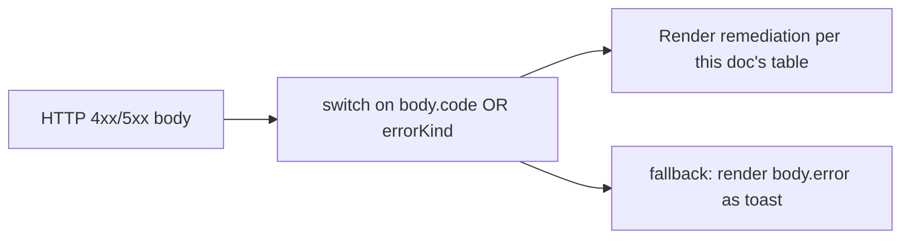
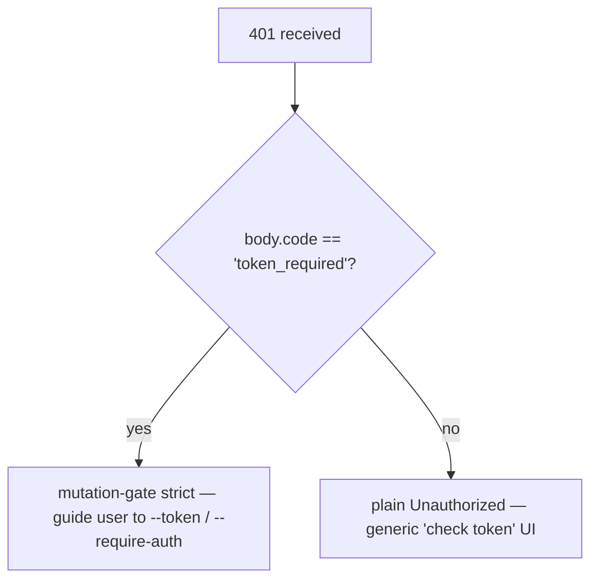

# Taxonomia de Erros & Remediação

## Visão Geral

Os modos de falha do daemon são uniões fechadas deliberadamente para que consumidores do SDK possam fazer switch exaustivo e handlers de rota possam moldar respostas HTTP consistentes. Este documento cataloga cada classe/tipo de erro tipado em três camadas:

1. **`packages/cli/src/serve/`** — erros de fronteira na borda HTTP (autenticação, sistema de arquivos do workspace, preflight do daemon-host).
2. **`packages/acp-bridge/`** — erros de ponte/mediador na fronteira entre daemon e processo filho ACP.
3. **`packages/sdk-typescript/src/daemon/`** — encapsulamento e campos de erro estruturados no lado do SDK.

As formas dos erros no nível de transmissão estão documentadas em [`../qwen-serve-protocol.md`](../qwen-serve-protocol.md); este documento adiciona orientação sobre causa e remediação.

## Fronteira do sistema de arquivos (`packages/cli/src/serve/fs/errors.ts`)

`FsError` carrega `{ kind, message, status, cause? }`. União `FsErrorKind` (14 tipos, status HTTP padrão):

| Tipo                        | HTTP      | Causa                                                                                     | Remediação                                                                                                              |
| --------------------------- | --------- | ----------------------------------------------------------------------------------------- | ----------------------------------------------------------------------------------------------------------------------- |
| `path_outside_workspace`    | 400       | O caminho resolvido sai do workspace associado.                                           | Use um caminho dentro do `workspaceCwd` do daemon; verifique `/capabilities`.                                           |
| `symlink_escape`            | 400       | O destino é um symlink.                                                                   | Acesse o caminho resolvido diretamente; symlinks são rejeitados por design.                                             |
| `path_not_found`            | 404       | `ENOENT`.                                                                                 | Confirme que o arquivo existe; verifique caminhos sensíveis a maiúsculas no Linux.                                      |
| `binary_file`               | 422       | Conteúdo detectado como binário em uma rota de texto.                                     | Use `GET /file/bytes` para bytes brutos; a rota de texto recusa binários.                                               |
| `file_too_large`            | 413       | Acima de `MAX_READ_BYTES` (256 KiB) ou `MAX_WRITE_BYTES` (5 MiB).                         | Use leitura por intervalo de bytes; divida a escrita.                                                                   |
| `hash_mismatch`             | 409       | Concorrência otimista `expectedSha256` falhou.                                            | Releia o arquivo e tente novamente com o novo hash.                                                                     |
| `file_already_exists`       | 409       | `mode: 'create'` contra um arquivo existente.                                             | Use `mode: 'overwrite'` ou escolha um novo caminho.                                                                     |
| `text_not_found`            | 422       | String de busca do `POST /file/edit` não encontrada no arquivo.                           | Verifique novamente a string de busca; diferenças de espaço em branco/codificação são a causa usual.                    |
| `ambiguous_text_match`      | 422       | Múltiplas correspondências quando apenas uma era necessária.                              | Adicione mais contexto ao redor da string de busca para torná-la única.                                                 |
| `untrusted_workspace`       | 403       | Tentativa de escrita em um workspace não confiável.                                       | Marque o workspace como confiável (`Config.isTrustedFolder()`) ou use `runQwenServe` em vez de incorporar `createServeApp` diretamente. |
| `permission_denied`         | 403       | `EACCES` / `EPERM` no nível do sistema operacional.                                       | Ajuste as ACLs do sistema de arquivos; isso **não** é um alerta de segurança.                                           |
| `io_error`                  | 503       | `ENOSPC` / `EIO` / `EBUSY` / `ETXTBSY` / `ENAMETOOLONG` / `EMFILE` / `ENFILE`.            | Correção operacional no nível do host (disco cheio, exaustão de descritores); página de operações, não segurança.        |
| `internal_error`            | 500       | Um erro não relacionado a errno chega à fronteira.                                        | Abra um bug do daemon.                                                                                                  |
| `parse_error`               | 400 / 422 | Erro de parse do corpo da requisição (400) ou violação de invariante de serviço (422).    | Valide o corpo da requisição; verifique a versão do SDK.                                                                |

A distinção entre `io_error` e `permission_denied` é deliberada para que pipelines de monitoramento possam rotear com base em `errorKind`; agrupar ENOSPC em `permission_denied` colocaria respondedores de segurança em alerta para um problema de `df -h`.
## Erros da bridge (`packages/acp-bridge/src/bridgeErrors.ts`)

Classes tipadas lançadas pela bridge / mediador. A maioria carrega um status HTTP via switch do manipulador de rota.

| Classe                               | HTTP | Causa                                                                               | Remediação                                                                                                                                                                                                                           |
| ------------------------------------ | ---- | ----------------------------------------------------------------------------------- | ------------------------------------------------------------------------------------------------------------------------------------------------------------------------------------------------------------------------------------ |
| `SessionNotFoundError`               | 404  | sessionId não está em `byId`.                                                       | Recrie ou anexe; a sessão pode ter sido removida.                                                                                                                                                                                    |
| `WorkspaceMismatchError`             | 400  | `POST /session` `cwd` ≠ `boundWorkspace` do daemon.                                 | Omita `cwd` (usa o vinculado) ou direcione para um daemon vinculado ao seu `cwd`.                                                                                                                                                    |
| `SessionLimitExceededError`          | 503  | `byId.size >= maxSessions`.                                                         | Feche sessões obsoletas; aumente `--max-sessions`.                                                                                                                                                                                   |
| `InvalidClientIdError`               | 400  | `X-Qwen-Client-Id` fora de `[A-Za-z0-9._:-]{1,128}`.                                | Sanitize o client id.                                                                                                                                                                                                               |
| `InvalidSessionMetadataError`        | 400  | `displayName` > 256 caracteres ou contém caracteres de controle.                    | Aparar / sanitizar.                                                                                                                                                                                                                  |
| `InvalidSessionScopeError`           | 400  | Valor desconhecido de `sessionScope`.                                               | Use `'single'` ou `'thread'`.                                                                                                                                                                                                        |
| `RestoreInProgressError`             | 409  | `loadSession` / `resumeSession` concorrentes.                                       | Aguarde + tente novamente.                                                                                                                                                                                                           |
| `WorkspaceInitConflictError`         | 409  | `POST /workspace/init` contra um arquivo existente sem `force`.                     | Passe `force: true` ou escolha outro caminho.                                                                                                                                                                                        |
| `WorkspaceInitPathEscapeError`       | 400  | Caminho de init sai do workspace.                                                   | Use um caminho dentro de `workspaceCwd`.                                                                                                                                                                                             |
| `WorkspaceInitSymlinkError`          | 400  | Caminho de init é um link simbólico.                                                | Aponte para o caminho resolvido.                                                                                                                                                                                                     |
| `WorkspaceInitRaceError`             | 409  | Condição de corrida TOCTOU no init.                                                 | Tente novamente.                                                                                                                                                                                                                     |
| `McpServerNotFoundError`             | 404  | Reinicialização para um servidor desconhecido.                                      | Verifique o nome do servidor em `/workspace/mcp`.                                                                                                                                                                                    |
| `McpServerRestartFailedError`        | 502  | Falha na reinicialização dentro do processo filho ACP.                              | Verifique os logs do processo filho ACP; pode indicar um servidor MCP quebrado.                                                                                                                                                      |
| `InvalidPermissionOptionError`       | 400  | Voto por fio tentou injetar `CANCEL_VOTE_SENTINEL` via `optionId`.                  | Vote com `{outcome: 'cancelled'}` em vez de um `optionId`.                                                                                                                                                                           |
| `PermissionForbiddenError`           | 403  | Política recusou o eleitor (`designated_mismatch` / `remote_not_allowed`).           | Use o client id do originador (designado), pré-cadastre o eleitor (consenso) ou vote a partir do loopback (apenas local). Veja [`04-permission-mediation.md`](./04-permission-mediation.md).                                          |
| `CancelSentinelCollisionError`       | 500  | Agente publicou `'__cancelled__'` como um rótulo de opção legítimo.                 | Bug do agente — altere o rótulo da opção para qualquer outro diferente do sentinela.                                                                                                                                                 |
| `PermissionPolicyNotImplementedError` | 500  | Política solicitada não embutida neste daemon.                                      | Atualize o daemon ou altere `policy.permissionStrategy`.                                                                                                                                                                             |
| `BridgeChannelClosedError`           | 503  | Canal do processo filho ACP fechou no meio da chamada.                              | Reconecte / tente novamente; verifique `session_died` para a causa.                                                                                                                                                                  |
| `BridgeTimeoutError`                 | 504  | Tempo de parede do nível da bridge excedido.                                        | Tente novamente; investigue lentidão subjacente.                                                                                                                                                                                     |
| `MissingCliEntryError`               | 500  | O arquivo de entrada da CLI `qwen` está ausente (definido em `status.ts`, não em `bridgeErrors.ts`). | Confirme que a instalação da CLI está completa; verifique se `packages/cli/index.ts` existe.                                                                                                                                         |
## Erros de configuração no boot (`packages/cli/src/serve/run-qwen-serve.ts`)

| Classe                      | Quando                                                                                                                                                                                                                                                             | Remedação                                                                                                                                                                                       |
| --------------------------- | ------------------------------------------------------------------------------------------------------------------------------------------------------------------------------------------------------------------------------------------------------------------ | ----------------------------------------------------------------------------------------------------------------------------------------------------------------------------------------------- |
| `InvalidPolicyConfigError` | `validatePolicyConfig()` rejeita configurações mescladas: `policy.permissionStrategy` desconhecida (validada contra `SERVE_CAPABILITY_REGISTRY.permission_mediation.modes`) ou `policy.consensusQuorum` não sendo um inteiro positivo. O boot falha explicitamente. | Corrija o campo ofensivo no `settings.json`. A classe suporta `instanceof`; `runQwenServe` a usa para distinguir incompatibilidade de política de falhas de I/O na leitura das configurações, que recaem para os padrões. |

## Autenticação via Device Flow (`packages/cli/src/serve/auth/device-flow.ts`)

| Classe                        | Quando                                                       | Observações                                                                                                                                                                                                                                                                                                                                                                                                                                           |
| ----------------------------- | ------------------------------------------------------------ | ----------------------------------------------------------------------------------------------------------------------------------------------------------------------------------------------------------------------------------------------------------------------------------------------------------------------------------------------------------------------------------------------------------------------------------------------------- |
| `UpstreamDeviceFlowError`    | O IdP upstream retorna um erro estruturado durante a sondagem. | O `oauthError` é sanitizado com `sanitizeForStderr` antes da interpolação em stderr ou dicas de auditoria (defesa contra CVE-2021-42574 / Trojan Source; veja [`12-auth-security.md`](./12-auth-security.md)).                                                                                                                                                                                                                                        |
| `DeviceFlowPollTimeoutError` | O timer de corrida do registro dispara antes do provedor retornar. | O código do provedor não deve lançar esse tipo. Ele é exportado para testes, mas o registro bloqueia `pollTimedOut` na marca de runtime `_isRegistryTimeout: boolean`, não `instanceof`. Um provedor que importa e lança `new DeviceFlowPollTimeoutError(ms)` ainda segue o caminho de auditoria genérico de lançamento de provedor, pois `_isRegistryTimeout` padrão é `false`; apenas a fábrica interna `makeRegistryPollTimeoutError(ms)` define a marca. |

## Tipos de erro do daemon hospedeiro (`packages/acp-bridge/src/status.ts`)

`SERVE_ERROR_KINDS` é a enumeração fechada usada por células de diagnóstico e erros estruturados do daemon:

| Tipo                          | Significado                                                                |
| ----------------------------- | -------------------------------------------------------------------------- |
| `missing_binary`            | O executável local ou entrada CLI necessária não pôde ser resolvida.       |
| `blocked_egress`            | A sonda de rede de saída falhou.                                           |
| `auth_env_error`            | A configuração de variável de ambiente, provedor ou gate de confiança de autenticação é inválida. |
| `init_timeout`              | A etapa de inicialização do lado do daemon excedeu seu tempo de parede.    |
| `protocol_error`            | Incompatibilidade de protocolo ACP / HTTP.                                 |
| `missing_file`              | O arquivo local necessário está ausente.                                   |
| `parse_error`               | Erro de análise de arquivo local ou solicitação.                           |
| `stat_failed`               | Falha no stat do sistema de arquivos local.                                |
| `budget_exhausted`          | A aplicação de orçamento MCP recusou descoberta ou entrada de servidor.    |
| `mcp_budget_would_exceed`  | A reinicialização ou mutação MCP excederia o orçamento configurado.        |
| `mcp_server_spawn_failed`  | Falha na inicialização ou reinicialização do servidor MCP.                 |
| `invalid_config`            | A configuração do MCP ou daemon era inválida.                              |
| `prompt_deadline_exceeded` | O prazo de parede do prompt expirou.                                       |
| `writer_idle_timeout`      | O escritor SSE não fez gravações bem-sucedidas antes de seu tempo limite de inatividade. |
Eles são apresentados através do `errorKind` da célula de preflight para que as UIs do cliente renderizem correções estruturadas (não rastros de pilha brutos).

## Formatos de erro de autenticação

| Status | Corpo                                         | Quando                                                                                                                                      |
| ------ | -------------------------------------------- | ----------------------------------------------------------------------------------------------------------------------------------------- |
| `401`  | `{ error: 'Unauthorized' }`                  | Token bearer ausente, errado ou sem esquema. Uniforme entre `cabeçalho ausente` / `esquema errado` / `token errado` para que a sondagem não consiga distinguir. |
| `401`  | `{ error: '...', code: 'token_required' }`   | Rota estrita de gate de mutação em um daemon de loopback sem token. SDKs renderizam dica "configure --token / --require-auth".                          |
| `403`  | `{ error: 'Request denied by CORS policy' }` | `denyBrowserOriginCors` rejeitou uma requisição contendo `Origin`.                                                                             |
| `403`  | `{ error: 'Invalid Host header' }`           | `hostAllowlist` rejeitou o cabeçalho `Host` (defesa contra rebinding de DNS).                                                                       |

Veja [`12-auth-security.md`](./12-auth-security.md) para o modelo completo de autenticação.

## Resultados de permissão (forma na comunicação vs sobrecarga na auditoria)

`PermissionResolution` tem dois tipos terminais:

- `{kind: 'option', optionId}` — um voto venceu.
- `{kind: 'cancelled', reason: 'timeout' \| 'session_closed' \| 'agent_cancelled'}` — a requisição foi cancelada. A forma na comunicação é única (`{outcome: 'cancelled'}`); o log de auditoria distingue timeout / session_closed / voter-cancelled / agent-cancelled em `decisionReason.type`. Essa sobrecarga é deliberadamente preservada para evitar quebrar o contrato congelado de `permission.ts`.

## Empacotamento de erros no lado do SDK

`DaemonClient` retorna erros HTTP como Promises rejeitadas com o corpo analisado como valor de rejeição. Métodos que encontram `404` para sessões desconhecidas rejeitam com `{error, sessionId}`; o SDK não os envolve em uma classe tipada atualmente. Os chamadores não devem confiar em `instanceof Error` com `.message.includes(...)`; em vez disso, use `err.code` ou `err.kind` do corpo.

`parseSseStream` aborta o iterador em estouro de buffer de 16 MiB (limite defensivo).

## Fluxo de trabalho

### Apresentar um erro a um usuário

### Distinguir modos de falha de autenticação

## Dependências

- Todas as classes de erro são exportadas de seus respectivos pacotes; consumidores do SDK podem usar `instanceof` contra os tipos de `bridgeErrors.ts` ao executar no mesmo processo Node. Através da comunicação, roteie por `body.code` / `body.kind` / `body.errorKind`.

## Advertências e Limitações Conhecidas

- **`io_error` vs `permission_denied`** são distintos propositalmente. Não os confunda.
- **Os motivos de `PermissionForbiddenError` (`designated_mismatch` / `remote_not_allowed`) são sobrecarregados** entre as políticas `designated` e `consensus`; o log de auditoria os distingue precisamente, mas a forma na comunicação não.
- **`CancelSentinelCollisionError` indica um bug no lado do agente**, não um evento de segurança — a ponte recusa a requisição em vez de deixar silenciosamente o sentinela corresponder a uma opção real.
- **Os erros tipados do lado do SDK ainda estão evoluindo.** Os chamadores devem rotear pelos campos do corpo em vez de confiar na identidade da classe JS através da comunicação.
- **`internal_error` deve sempre ser investigado.** Ele sinaliza que o construtor de `FsError` foi chamado com um tipo reservado para caminhos não-errno (erro de programador); o campo `cause` do corpo da resposta pode conter a exceção original.

## Referências

- `packages/cli/src/serve/fs/errors.ts` (`FsErrorKind`, `FsErrorStatus`)
- `packages/acp-bridge/src/bridgeErrors.ts` (every typed class)
- `packages/acp-bridge/src/status.ts` (`SERVE_ERROR_KINDS`, `ServeErrorKind`)
- `packages/cli/src/serve/auth.ts` (auth bodies)
- Wire reference: [`../qwen-serve-protocol.md`](../qwen-serve-protocol.md).
