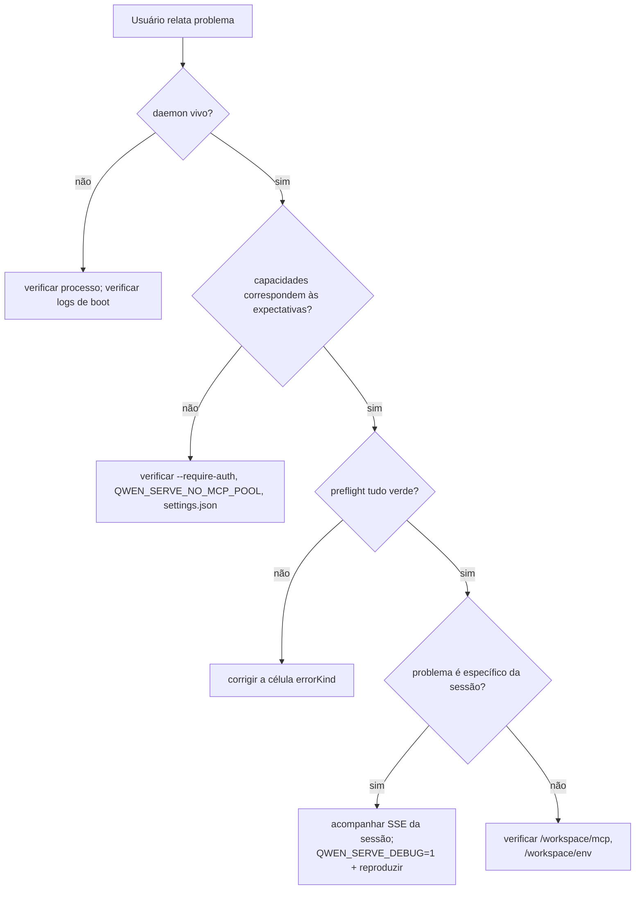

# Observabilidade & Depuração

## Visão Geral

`qwen serve` atualmente vem com **instrumentação de spans do OpenTelemetry**, **logs de arquivo estruturados** (`DaemonLogger`), **logs de acesso por requisição**, logs de depuração no stderr, células de preflight estruturadas e um anel de auditoria de permissões em memória. Esta página é um guia prático para a superfície atual de observabilidade e as lacunas a serem lembradas durante a triagem.

## O que existe hoje

| Superfície                                     | Localização                                       | Propósito                                                                                                                                                                                                                                                                                   |
| ---------------------------------------------- | ------------------------------------------------- | ------------------------------------------------------------------------------------------------------------------------------------------------------------------------------------------------------------------------------------------------------------------------------------------- |
| `QWEN_SERVE_DEBUG` logs de stderr              | `bridge.ts` e locais de chamada                   | Valores de env `1` / `true` / `on` / `yes` (não sensível a maiúsculas/minúsculas) imprimem linhas `qwen serve debug: ...` no stderr.                                                                                                                                                        |
| Instrumentação de spans OpenTelemetry          | `server.ts` `daemonTelemetryMiddleware`           | Cada requisição HTTP é encapsulada em `withDaemonRequestSpan`; atributos incluem rota, sessionId, clientId e código de status. Rotas de permissão têm spans dedicados. O ciclo de vida do prompt é rastreado de ponta a ponta. A configuração fica em `settings.json` `telemetry`.           |
| Logs estruturados de arquivo `DaemonLogger`    | `serve/daemon-logger.ts`                          | Linhas de log estruturadas no estilo JSON são escritas em um arquivo. A inicialização imprime `daemon log -> <path>`. Suporta níveis `info` / `warn` / `error`, com campos estruturados como `route`, `sessionId`, `clientId`, `childPid` e `channelId`.                                     |
| Middleware de log de acesso por requisição     | `server.ts`, registrado antes de `bearerAuth`     | Registra `method`, `path`, `status`, `durationMs`, `sessionId` e `clientId` após cada requisição. Ignora `GET /health` e heartbeat. 4xx+ usa `warn`; sucesso usa `info`.                                                                                                                    |
| `/health`                                      | Rota `server.ts`                                  | Sonda de vivacidade; `?deep=1` retorna detalhes estendidos.                                                                                                                                                                                                                                |
| `/capabilities`                                | Rota `server.ts`                                  | Descoberta de funcionalidades preflight. Veja [`11-capabilities-versioning.md`](./11-capabilities-versioning.md).                                                                                                                                                                           |
| `/workspace/preflight`                         | Rota -> `DaemonStatusProvider`                    | Células de prontidão estruturadas: versão do Node, entrada CLI, ripgrep, git, npm, além de células de nível ACP quando um filho está ativo.                                                                                                                                                 |
| `/workspace/env`                               | Rota -> `DaemonStatusProvider`                    | Instantâneo do env do processo do daemon. Variáveis de env secretas reportam apenas presença; credenciais de URL de proxy são removidas.                                                                                                                                                    |
| `/workspace/mcp`                               | Rota -> bridge extMethod                          | Instantâneo do pool, orçamento e recusas.                                                                                                                                                                                                                                                   |
| `/workspace/skills`, `/workspace/providers`    | Rotas                                            | Instantâneos ao vivo do lado ACP; retornam dados ociosos vazios quando não há sessão.                                                                                                                                                                                                       |
| SSE por sessão                                 | `GET /session/:id/events`                        | Fluxo de eventos em tempo real.                                                                                                                                                                                                                                                             |
| Console de depuração `/demo`                   | `GET /demo` (`packages/cli/src/serve/demo.ts`)   | Console de página única acessível pelo navegador: chat, registro de eventos, inspetor de workspace e UX de permissões. Em loopback, `http://127.0.0.1:4170/demo` é o caminho mais rápido de validação ponta a ponta sem escrever código SDK. As regras de registro estão em [`02-serve-runtime.md`](./02-serve-runtime.md). |
| `PermissionAuditRing`                          | `permission-audit.ts`                            | FIFO em memória de 512 decisões de permissão.                                                                                                                                                                                                                                               |
| Auditoria do `decisionReason` do Mediator      | `permissionMediator.ts`                          | Registro estruturado interno explicando por que uma solicitação de permissão foi resolvida da maneira que foi.                                                                                                                                                                              |
## O que não existe hoje

- **Nenhum endpoint Prometheus / métricas.** Não há `process_cpu_seconds_total`, `http_requests_total` ou `event_bus_queue_depth`.
- **Nenhum sink de auditoria externa para `PermissionAuditRing`.** O anel existe, mas os hooks de fan-out para SIEM ou armazenamento externo não estão conectados.

## Receitas de depuração

### 1. O daemon está vivo?

```bash
curl -s http://127.0.0.1:4170/health
# {"status":"ok"}

curl -s 'http://127.0.0.1:4170/health?deep=1' | jq
# {"status":"ok","workspaceCwd":"/path","sessions":N,...}
```

Um 401 no loopback significa que `--require-auth` provavelmente está ativado. Use `QWEN_SERVE_DEBUG=1` na inicialização para ver os logs de boot.

### 2. Quais recursos são anunciados?

```bash
curl -s http://127.0.0.1:4170/capabilities | jq
```

Verifique `mcp_workspace_pool` (pool F2 ativo?), `require_auth` (endurecido?), `permission_mediation.modes` (políticas suportadas) e `policy.permission` (política ativa).

### 3. A prontidão do daemon-host está saudável?

```bash
curl -s http://127.0.0.1:4170/workspace/preflight | jq
```

Células com `status: 'not_started'` são de nível ACP e só preenchem após a primeira sessão se conectar. Células com `status: 'fail'` incluem um `errorKind` fechado; renderize a remediação estruturada a partir de [`18-error-taxonomy.md`](./18-error-taxonomy.md).

### 4. Acompanhe um stream SSE de sessão

```bash
curl -N -H 'Accept: text/event-stream' \
     -H 'Authorization: Bearer XYZ' \
     -H 'X-Qwen-Client-Id: debug-tail' \
     -H 'Last-Event-ID: 0' \
     'http://127.0.0.1:4170/session/<sid>/events'
```

`-N` desabilita o buffer de saída do curl. `Last-Event-ID: 0` solicita replay para eventos do anel com `id > 0`.

### 5. Por que uma solicitação de permissão foi resolvida dessa forma?

`PermissionAuditRing` está na memória e não possui superfície HTTP atualmente. Ative `QWEN_SERVE_DEBUG=1` e reproduza; o mediador imprime linhas estruturadas para cada voto e decisão, incluindo `decisionReason.type`. Um PR posterior pode expor o anel via HTTP.

### 6. Qual consumidor está lento?

`slow_client_warning` é acionado uma vez por episódio de estouro quando a fila atinge 75%. Assine o stream SSE da sessão e procure pelo frame sintético; o payload inclui `queueSize`, `maxQueued` e `lastEventId`. Avisos repetidos apontam para um consumidor travado, geralmente um loop `for await` bloqueado do SDK.

### 7. Por que um servidor MCP foi recusado?

Combine `/workspace/mcp` por célula com `disabledReason: 'budget'`, a lista `refusedServerNames` e os eventos SSE `mcp_child_refused_batch`. Compare com `/capabilities` `mcp_guardrails.modes` (`enforce` ativo?) e o estado atual de `--mcp-client-budget` visível através de `getReservedSlots()`.

### 8. O daemon não desliga

O primeiro sinal dispara o desligamento gracioso (veja [`02-serve-runtime.md`](./02-serve-runtime.md)). Se travar após 10s, verifique:

- O processo filho ACP não respondeu ao fechamento gracioso.
- Conexões SSE longas mantiveram `http.server.close()` aberto após `SHUTDOWN_FORCE_CLOSE_MS` (5s).

Um **segundo** SIGTERM/SIGINT intencionalmente dispara `bridge.killAllSync()` + `process.exit(1)`.

## Fluxo

### Fluxo típico de triagem



## Estado e ciclo de vida

- `QWEN_SERVE_DEBUG` é lido a cada verificação através de `isServeDebugMode()` em `debug-mode.ts`; alterná-lo não requer reinicialização. Logs de boot não estão disponíveis a menos que a variável de ambiente tenha sido definida no boot.
- `PermissionAuditRing` é limitado a 512 entradas FIFO; registros mais antigos são descartados silenciosamente.
- `DaemonStatusProvider` reconstrói células por requisição e não faz cache; evite polling de alta frequência desnecessário.

## Dependências

- `process.stderr.write` para stderr de depuração.
- `DaemonLogger` para logs estruturados em arquivo.
- SDK OpenTelemetry via `initializeTelemetry` e `createDaemonBridgeTelemetry`.
- `node:process` para inspeção de variáveis de ambiente e sinais.

## Configuração

| Chave                           | Efeito                                                                                      |
| ------------------------------- | ------------------------------------------------------------------------------------------- |
| `QWEN_SERVE_DEBUG`              | Ativa logs verbosos no stderr. Veja [`17-configuration.md`](./17-configuration.md).         |
| `settings.json` `telemetry`     | Controla o comportamento do OTel: `enabled`, `otlpEndpoint`, `otlpProtocol` e endpoints por sinal. |
| Caminho do log do `DaemonLogger`| Gerado no boot e impresso no stderr como `daemon log -> <caminho>`.                         |
| Tamanho do `PermissionAuditRing`| Fixado em 512 atualmente.                                                                   |
| Limiar de `slow_client_warning` | `0.75` / `0.375`, fixado em `eventBus.ts`.                                                  |
## Ressalvas e limitações conhecidas

- **Os logs de arquivo do DaemonLogger são estruturados** e podem ser filtrados por `route`, `sessionId` e `clientId`. Os logs de stderr do `QWEN_SERVE_DEBUG` permanecem como texto não estruturado.
- **Os spans do OpenTelemetry incluem correlação por requisição.** Cada span de requisição HTTP carrega atributos route, sessionId e clientId que podem ser unidos em um backend de rastreamento.
- **As células `/workspace/preflight` no nível ACP exigem uma sessão ativa.** Em um daemon ocioso, auth / MCP / skills / providers podem mostrar `status: 'not_started'`; isso é esperado.
- **`/workspace/env` apenas informa a presença de secrets, não os valores.** Não exponha a resposta onde a mera presença de um secret é sensível.
- **O ring de auditoria é local ao processo** e o histórico é perdido ao reiniciar o daemon.
- **Nenhuma receita de teste de carga está documentada aqui.** A linha de base de desempenho está no branch `test/perf-daemon-baseline`.

## Referências

- `packages/cli/src/serve/daemon-status-provider.ts`
- `packages/cli/src/serve/daemon-logger.ts` (`DaemonLogger`, `buildDaemonLogLine`)
- `packages/cli/src/serve/debug-mode.ts` (`isServeDebugMode`)
- `packages/acp-bridge/src/permissionMediator.ts` (`PermissionDecisionReason`)
- `packages/cli/src/serve/server.ts` (`daemonTelemetryMiddleware`, access-log middleware)
- Configuração: [`17-configuration.md`](./17-configuration.md)
- Taxonomia de erros: [`18-error-taxonomy.md`](./18-error-taxonomy.md)
- Guia de operações do usuário: [`../../users/qwen-serve.md`](../../users/qwen-serve.md)
