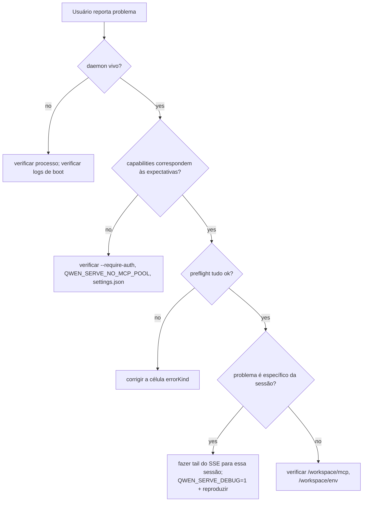

# Observabilidade e Debugging

## Overview

O `qwen serve` atualmente vem com **instrumentação de spans do OpenTelemetry**, **logs estruturados em arquivo** (`DaemonLogger`), **logs de acesso por requisição**, logs de debug no stderr, células de preflight estruturadas e um anel de auditoria de permissões em memória. Esta página é um guia prático para a superfície de observabilidade atual e as lacunas a serem lembradas durante a triagem.

## O que existe hoje

| Superfície                                  | Localização                                    | Propósito                                                                                                                                                                                                                                                                                   |
| ------------------------------------------- | ---------------------------------------------- | ------------------------------------------------------------------------------------------------------------------------------------------------------------------------------------------------------------------------------------------------------------------------------------------- |
| `QWEN_SERVE_DEBUG` stderr logs              | `bridge.ts` e pontos de chamada                | Valores de env `1` / `true` / `on` / `yes` (case-insensitive) imprimem linhas `qwen serve debug: ...` no stderr.                                                                                                                                                                            |
| OpenTelemetry span instrumentation          | `server.ts` `daemonTelemetryMiddleware`        | Cada requisição HTTP é envolvida em `withDaemonRequestSpan`; atributos incluem route, sessionId, clientId e status code. Rotas de permissão têm spans dedicados. O ciclo de vida do prompt é rastreado de ponta a ponta. A configuração fica em `settings.json` `telemetry`.             |
| OpenTelemetry daemon perf metrics           | `telemetry/*event-loop-lag*`, `daemon-metrics` | Gauges de event loop lag para o daemon e processos filhos ACP, além de histogramas de bytes de mensagens do pipe daemon-filho.                                                                                                                                                              |
| `DaemonLogger` structured file logs         | `serve/daemon-logger.ts`                       | Linhas de log estruturadas em formato JSON-like são escritas em um arquivo. O boot imprime `daemon log -> <path>`. Suporta níveis `info` / `warn` / `error`, com campos estruturados como `route`, `sessionId`, `clientId`, `childPid` e `channelId`.                                     |
| Per-request access-log middleware           | `server.ts`, registrado antes de `bearerAuth`   | Loga `method`, `path`, `status`, `durationMs`, `sessionId` e `clientId` após cada requisição. Ignora `GET /health` e heartbeat. 4xx+ usa `warn`; sucesso usa `info`.                                                                                                                        |
| `/health`                                   | rota `server.ts`                               | Liveness probe; `?deep=1` retorna detalhes estendidos.                                                                                                                                                                                                                                      |
| `/capabilities`                             | rota `server.ts`                               | Descoberta de recursos de preflight. Veja [`11-capabilities-versioning.md`](./11-capabilities-versioning.md).                                                                                                                                                                               |
| `/workspace/preflight`                      | Rota -> `DaemonStatusProvider`                 | Células de readiness estruturadas: versão do Node, entrada da CLI, ripgrep, git, npm, além de células no nível ACP assim que um filho estiver ativo.                                                                                                                                        |
| `/workspace/env`                            | Rota -> `DaemonStatusProvider`                 | Snapshot do env do processo daemon. Variáveis de env secretas reportam apenas a presença; credenciais de URL de proxy são removidas.                                                                                                                                                        |
| `/workspace/mcp`                            | Rota -> bridge extMethod                       | Snapshot de pool, budget e recusa.                                                                                                                                                                                                                                                          |
| `/workspace/skills`, `/workspace/providers` | Rotas                                          | Snapshots ao vivo do lado ACP; retornam dados ociosos vazios quando não existe sessão.                                                                                                                                                                                                      |
| Per-session SSE                             | `GET /session/:id/events`                      | Stream de eventos em tempo real.                                                                                                                                                                                                                                                            |
| `/demo` debug console                       | `GET /demo` (`packages/cli/src/serve/demo.ts`) | Console single-page acessível pelo navegador: chat, log de eventos, inspetor de workspace e UX de permissão. No loopback, `http://127.0.0.1:4170/demo` é o caminho de validação ponta a ponta mais rápido sem escrever código SDK. As regras de registro estão em [`02-serve-runtime.md`](./02-serve-runtime.md). |
| `PermissionAuditRing`                       | `permission-audit.ts`                          | FIFO em memória de 512 decisões de permissão.                                                                                                                                                                                                                                               |
| Mediator `decisionReason` audit             | `permissionMediator.ts`                        | Registro estruturado interno explicando por que uma solicitação de permissão foi resolvida da maneira que foi.                                                                                                                                                                              |

## O que não existe hoje

- **Sem endpoint do Prometheus / métricas.** As métricas OTel podem ser exportadas, mas o daemon não expõe um endpoint de scrape do Prometheus.
- **Sem sink de auditoria externo para o `PermissionAuditRing`.** O anel existe, mas os hooks de fan-out para SIEM ou armazenamento externo não estão conectados.

## Receitas de debugging

### 1. O daemon está vivo?

```bash
curl -s http://127.0.0.1:4170/health
# {"status":"ok"}

curl -s 'http://127.0.0.1:4170/health?deep=1' | jq
# {"status":"ok","workspaceCwd":"/path","sessions":N,...}
```

Um 401 no loopback significa que `--require-auth` provavelmente está habilitado. Use `QWEN_SERVE_DEBUG=1` na inicialização para ver os logs de boot.

### 2. Quais recursos são anunciados?

```bash
curl -s http://127.0.0.1:4170/capabilities | jq
```

Verifique `mcp_workspace_pool` (F2 pool on?), `require_auth` (hardened?), `permission_mediation.modes` (políticas suportadas) e `policy.permission` (política ativa).

### 3. O readiness do daemon-host está saudável?

```bash
curl -s http://127.0.0.1:4170/workspace/preflight | jq
```

Células com `status: 'not_started'` são de nível ACP e são populadas apenas após a primeira sessão ser anexada. Células com `status: 'fail'` incluem um `errorKind` fechado; renderize a remediação estruturada a partir de [`18-error-taxonomy.md`](./18-error-taxonomy.md).

### 4. Fazer tail de um stream SSE de sessão

```bash
curl -N -H 'Accept: text/event-stream' \
     -H 'Authorization: Bearer XYZ' \
     -H 'X-Qwen-Client-Id: debug-tail' \
     -H 'Last-Event-ID: 0' \
     'http://127.0.0.1:4170/session/<sid>/events'
```

`-N` desabilita o buffer de saída do curl. `Last-Event-ID: 0` solicita o replay para eventos do anel com `id > 0`.

### 5. Por que uma requisição de permissão foi resolvida desta forma?

O `PermissionAuditRing` é em memória e não tem superfície HTTP hoje. Habilite `QWEN_SERVE_DEBUG=1` e reproduza; o mediador imprime linhas estruturadas para cada voto e decisão, incluindo `decisionReason.type`. Um PR posterior pode expor o anel via HTTP.

### 6. Qual consumer está lento?

O `slow_client_warning` dispara uma vez por episódio de estouro quando a fila atinge 75%. Inscreva-se no stream SSE da sessão e procure pelo frame sintético; o payload inclui `queueSize`, `maxQueued` e `lastEventId`. Avisos repetidos apontam para um consumer travado, geralmente um loop `for await` do SDK bloqueado.

### 7. Por que um servidor MCP foi recusado?

Combine o `disabledReason: 'budget'` por célula do `/workspace/mcp`, a lista `refusedServerNames` e os eventos SSE `mcp_child_refused_batch`. Compare-os com `mcp_guardrails.modes` do `/capabilities` (`enforce` ativo?) e o estado ao vivo de `--mcp-client-budget` visível através de `getReservedSlots()`.

### 8. O daemon não está desligando

O primeiro sinal aciona o desligamento gracioso (veja [`02-serve-runtime.md`](./02-serve-runtime.md)). Se travar após 10s, verifique:

- O processo filho ACP não respondeu ao fechamento gracioso.
- Conexões SSE longas mantiveram o `server.close()` do HTTP aberto além de `SHUTDOWN_FORCE_CLOSE_MS` (5s).

Um **segundo** SIGTERM/SIGINT aciona intencionalmente `bridge.killAllSync()` + `process.exit(1)`.

### 9. O event loop do daemon, a fila de prompts ou o pipe ACP estão sobrecarregados?

`GET /daemon/status` pode incluir `runtime.perf` quando o runtime do daemon de produção injeta o provedor de snapshot de perf:

```json
{
  "runtime": {
    "perf": {
      "eventLoop": { "meanMs": 1.2, "p50Ms": 1.0, "p99Ms": 9.5, "maxMs": 25 },
      "promptQueueWait": { "count": 3, "meanMs": 12.5, "maxMs": 35, "lastMs": 4 },
      "pipe": {
        "inbound": { "count": 42, "totalBytes": 100000, "maxBytes": 12000 },
        "outbound": { "count": 41, "totalBytes": 90000, "maxBytes": 11000 }
      }
    }
  }
}
```

O payload de status é exclusivo do daemon. `promptQueueWait` resume as amostras de espera da fila FIFO de prompts observadas no processo daemon. O lag do event loop do filho ACP intencionalmente não é agregado em `/daemon/status`; ele é visível através do gauge OTel `qwen-code.acp.event_loop.lag` e através de linhas de stall no stderr encaminhadas para os logs do daemon.

Novos nomes de métricas OTel:

- `qwen-code.daemon.event_loop.lag`, gauge em milissegundos com `stat=mean|p50|p99|max`.
- `qwen-code.acp.event_loop.lag`, gauge em milissegundos com `stat=mean|p50|p99|max`.
- `qwen-code.daemon.prompt.queue_wait`, histograma em milissegundos.
- `qwen-code.daemon.pipe.message_bytes`, histograma em bytes com `direction=inbound|outbound`.

## Fluxo

### Fluxo de triagem típico


```mermaid
flowchart TD
    A[Usuário reporta problema] --> B{daemon vivo?}
    B -->|no| BD[verificar processo; verificar logs de boot]
    B -->|yes| C{capabilities correspondem às expectativas?}
    C -->|no| CD["verificar --require-auth, QWEN_SERVE_NO_MCP_POOL, settings.json"]
    C -->|yes| D{preflight tudo ok?}
    D -->|no| DD["corrigir a célula errorKind"]
    D -->|yes| E{problema é específico da sessão?}
    E -->|yes| ES["fazer tail do SSE para essa sessão;<br/>QWEN_SERVE_DEBUG=1 + reproduzir"]
    E -->|no| EW["verificar /workspace/mcp,<br/>/workspace/env"]
```

## Estado e ciclo de vida

- O `QWEN_SERVE_DEBUG` é lido em cada verificação através de `isServeDebugMode()` de `debug-mode.ts`; alterná-lo não requer reinicialização. Os logs de boot não estão disponíveis a menos que o env tenha sido definido no boot.
- O `PermissionAuditRing` é limitado a 512 entradas FIFO; registros mais antigos são descartados silenciosamente.
- O `DaemonStatusProvider` reconstrói as células por requisição e não faz cache; evite polling de alta frequência desnecessário.
## Dependências

- `process.stderr.write` para stderr de depuração.
- `DaemonLogger` para logs estruturados em arquivo.
- OpenTelemetry SDK através de `initializeTelemetry` e `createDaemonBridgeTelemetry`.
- `node:perf_hooks.monitorEventLoopDelay` para medidores de lag do event loop do daemon e do ACP.
- `node:process` para inspeção de variáveis de ambiente e sinais.

## Configuração

| Parâmetro                         | Efeito                                                                                       |
| --------------------------------- | -------------------------------------------------------------------------------------------- |
| `QWEN_SERVE_DEBUG`                | Habilita logs detalhados no stderr. Consulte [`17-configuration.md`](./17-configuration.md). |
| `settings.json` `telemetry`       | Controla o comportamento do OTel: `enabled`, `otlpEndpoint`, `otlpProtocol` e endpoints por sinal. |
| Caminho de log do `DaemonLogger`  | Gerado na inicialização e impresso no stderr como `daemon log -> <path>`.                    |
| Tamanho do `PermissionAuditRing`  | Fixado em 512 atualmente.                                                                    |
| Limiar de `slow_client_warning`   | `0.75` / `0.375`, fixado em `eventBus.ts`.                                                   |

## Ressalvas e limitações conhecidas

- **Os logs em arquivo do DaemonLogger são estruturados** e podem ser filtrados por `route`, `sessionId` e `clientId`. Os logs de stderr do `QWEN_SERVE_DEBUG` permanecem como texto não estruturado.
- **Os spans do OpenTelemetry incluem correlação por requisição.** Cada span de requisição HTTP carrega os atributos route, sessionId e clientId, que podem ser correlacionados em um backend de rastreamento.
- **`runtime.perf` é exclusivo do daemon.** O lag do event loop dos processos filhos não é reportado ali por design; use o OTel ou os avisos de stall encaminhados para o stderr para stalls nos filhos do ACP.
- **As células `/workspace/preflight` no nível do ACP requerem uma sessão ativa.** Em um daemon ocioso, auth / MCP / skills / providers podem mostrar `status: 'not_started'`; isso é o esperado.
- **`/workspace/env` reporta apenas a presença de secrets, não seus valores.** Não exponha a resposta em casos onde a mera presença de um secret seja sensível.
- **O audit ring é local ao processo** e o histórico é perdido na reinicialização do daemon.
- **Nenhuma receita de teste de carga está documentada aqui.** A baseline de performance está na branch `test/perf-daemon-baseline`.

## Referências

- `packages/cli/src/serve/daemon-status-provider.ts`
- `packages/cli/src/serve/daemon-logger.ts` (`DaemonLogger`, `buildDaemonLogLine`)
- `packages/cli/src/serve/debug-mode.ts` (`isServeDebugMode`)
- `packages/acp-bridge/src/permissionMediator.ts` (`PermissionDecisionReason`)
- `packages/cli/src/serve/server.ts` (`daemonTelemetryMiddleware`, middleware de access-log)
- Configuração: [`17-configuration.md`](./17-configuration.md)
- Taxonomia de erros: [`18-error-taxonomy.md`](./18-error-taxonomy.md)
- Guia de operações do usuário: [`../../users/qwen-serve.md`](../../users/qwen-serve.md)