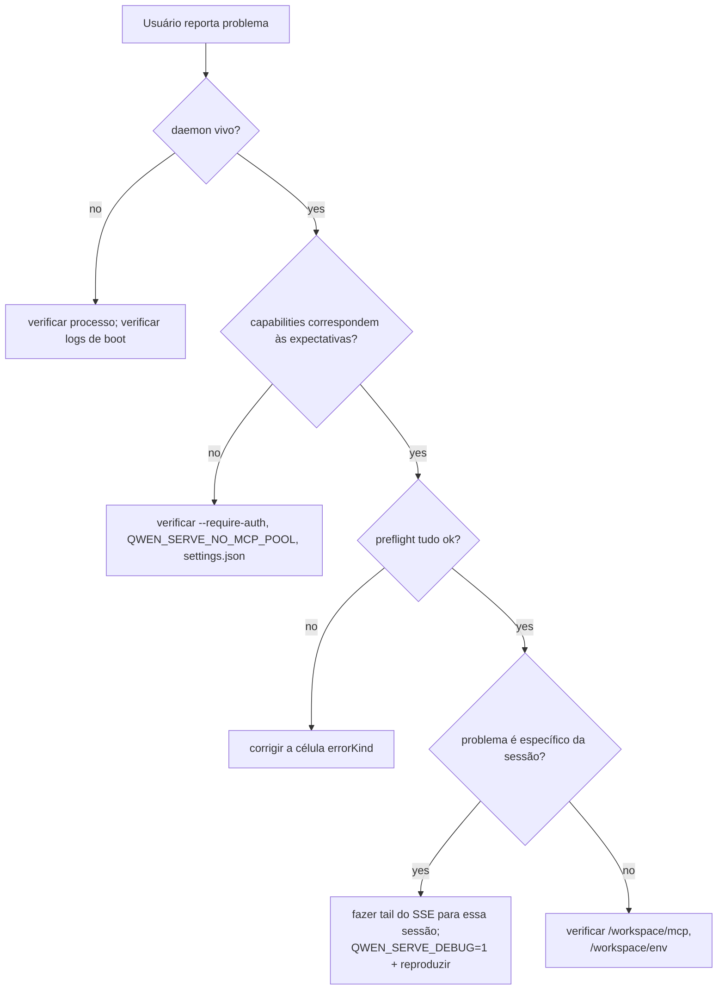

# Observabilidade e Debugging

## Visão Geral

O `qwen serve` atualmente vem com **instrumentação de spans do OpenTelemetry**, **logs estruturados em arquivo** (`DaemonLogger`), **logs de acesso por requisição**, logs de debug no stderr, células de preflight estruturadas e um anel de auditoria de permissões em memória. Esta página é um guia prático para a superfície de observabilidade atual e as lacunas a serem lembradas durante a triagem.

## O que existe hoje

| Superfície                                  | Localização                                    | Propósito                                                                                                                                                                                                                                                                                   |
| ------------------------------------------- | ---------------------------------------------- | ------------------------------------------------------------------------------------------------------------------------------------------------------------------------------------------------------------------------------------------------------------------------------------------- |
| `QWEN_SERVE_DEBUG` stderr logs              | `bridge.ts` e pontos de chamada                | Valores de env `1` / `true` / `on` / `yes` (case-insensitive) imprimem linhas `qwen serve debug: ...` no stderr.                                                                                                                                                                            |
| OpenTelemetry span instrumentation          | `server.ts` `daemonTelemetryMiddleware`        | Requisições classificadas da API do daemon que passam pelo middleware de telemetria são envolvidas em `withDaemonRequestSpan`; atributos incluem rota canônica, hash do workspace quando resolvido, sessionId, clientId e status code. Rotas de permissão têm spans dedicados. O ciclo de vida do prompt é rastreado de ponta a ponta. A configuração fica em `settings.json` `telemetry`. |
| OpenTelemetry daemon perf metrics           | `telemetry/*event-loop-lag*`, `daemon-metrics` | Gauges de event loop lag para o daemon e processos filhos ACP, além de histogramas de bytes de mensagens do pipe daemon-filho.                                                                                                                                                              |
| `DaemonLogger` structured file logs         | `serve/daemon-logger.ts`                       | Anexa a um `daemon.log` estável e rotacionado por tamanho. Registros de `info` / `warn` / `error` do chamador emitidos com um span OTel ativo, gravando e amostrado incluem `trace_id` e `span_id`; registros de arquivo também incluem `runId` e PID. O boot imprime o caminho estável/fallback selecionado; o status completo expõe saúde, problemas e contadores de perda de cópia de arquivo. |
| Per-request access-log middleware           | `server/access-log.ts`                         | Loga method/path, status, duração, sessão e primeiro ID bruto de cliente após cada requisição. Um burst de 60 tokens / bucket de 2 por segundo agrega o tráfego excedente em cinco contadores fixos de status. Exclusões de health, heartbeat e SSE bem-sucedido permanecem.              |
| `/health`                                   | rota `server.ts`                               | Liveness probe; `?deep=1` retorna detalhes estendidos.                                                                                                                                                                                                                                      |
| `/capabilities`                             | rota `server.ts`                               | Descoberta de recursos de preflight. Veja [`11-capabilities-versioning.md`](./11-capabilities-versioning.md).                                                                                                                                                                               |
| `/workspace/preflight`                      | Rota -> `DaemonStatusProvider`                 | Células de readiness estruturadas: versão do Node, entrada da CLI, ripgrep, git, npm, além de células no nível ACP assim que um filho estiver ativo.                                                                                                                                        |
| `/workspace/env`                            | Rota -> `DaemonStatusProvider`                 | Snapshot do env do processo daemon. Variáveis de env secretas reportam apenas a presença; credenciais de URL de proxy são removidas.                                                                                                                                                        |
| `/workspace/mcp`                            | Rota -> bridge extMethod                       | Snapshot de pool, budget e recusa.                                                                                                                                                                                                                                                          |
| `/workspace/skills`, `/workspace/providers` | Rotas                                          | Snapshots ao vivo do lado ACP; retornam dados ociosos vazios quando não existe sessão.                                                                                                                                                                                                      |
| Per-session SSE                             | `GET /session/:id/events`                      | Stream de eventos em tempo real.                                                                                                                                                                                                                                                            |
| Web Shell UI                                | `GET /` (`packages/cli/src/serve/web-shell-static.ts`) | UI do navegador servida a partir dos assets do Web Shell empacotados: chat, lista de sessões, inspetor de workspace e UX de permissão. No loopback, `http://127.0.0.1:4170/` é o caminho de validação ponta a ponta mais rápido sem escrever código SDK. As regras de registro estão em [`02-serve-runtime.md`](./02-serve-runtime.md). |
| `PermissionAuditRing`                       | `permission-audit.ts`                          | FIFO em memória de 512 decisões de permissão.                                                                                                                                                                                                                                               |
| Mediator `decisionReason` audit             | `permissionMediator.ts`                        | Registro estruturado interno explicando por que uma solicitação de permissão foi resolvida da maneira que foi.                                                                                                                                                                              |

## O que não existe hoje

- **Sem endpoint do Prometheus / métricas.** As métricas OTel podem ser exportadas, mas o daemon não expõe um endpoint de scrape do Prometheus.
- **Sem sink de auditoria externo para o `PermissionAuditRing`.** O anel existe, mas os hooks de fan-out para SIEM ou armazenamento externo não estão conectados.

## Receitas de debugging

### 1. O daemon está vivo?

```bash
curl -s http://127.0.0.1:4170/health
# {"status":"ok"}

curl -s 'http://127.0.0.1:4170/health?deep=1' | jq
# {"status":"ok","workspaceCount":N,"sessions":N,...}
```

O deep health soma todos os runtimes de workspace gerenciados, incluindo runtimes ainda em drenagem. É um snapshot informativo de contadores, não readiness por workspace; use `/daemon/status` quando diagnósticos individuais de workspace ou transporte importarem.

Um 401 no loopback significa que `--require-auth` provavelmente está habilitado. Use `QWEN_SERVE_DEBUG=1` na inicialização para ver os logs de boot.

### 2. Quais recursos são anunciados?

```bash
curl -s http://127.0.0.1:4170/capabilities | jq
```

Verifique `mcp_workspace_pool` (F2 pool on?), `require_auth` (hardened?), `permission_mediation.modes` (políticas suportadas) e `policy.permission` (política ativa).

### 3. O readiness do daemon-host está saudável?

```bash
curl -s http://127.0.0.1:4170/workspace/preflight | jq
```

Células com `status: 'not_started'` são de nível ACP e são populadas apenas após a primeira sessão ser anexada. Células com `status: 'fail'` incluem um `errorKind` fechado; renderize a remediação estruturada a partir de [`18-error-taxonomy.md`](./18-error-taxonomy.md).

### 4. Fazer tail de um stream SSE de sessão

```bash
curl -N -H 'Accept: text/event-stream' \
     -H 'Authorization: Bearer XYZ' \
     -H 'X-Qwen-Client-Id: debug-tail' \
     -H 'Last-Event-ID: 0' \
     'http://127.0.0.1:4170/session/<sid>/events'
```

`-N` desabilita o buffer de saída do curl. `Last-Event-ID: 0` solicita o replay para eventos do anel com `id > 0`.

### 5. Por que uma requisição de permissão foi resolvida desta forma?

O `PermissionAuditRing` é em memória e não tem superfície HTTP hoje. Habilite `QWEN_SERVE_DEBUG=1` e reproduza; o mediador imprime linhas estruturadas para cada voto e decisão, incluindo `decisionReason.type`. Um PR posterior pode expor o anel via HTTP.

### 6. Qual consumer está lento?

O `slow_client_warning` dispara uma vez por episódio de estouro quando a fila atinge 75%. Inscreva-se no stream SSE da sessão e procure pelo frame sintético; o payload inclui `queueSize`, `maxQueued` e `lastEventId`. Avisos repetidos apontam para um consumer travado, geralmente um loop `for await` do SDK bloqueado.

### 7. Por que um servidor MCP foi recusado?

Combine o `disabledReason: 'budget'` por célula do `/workspace/mcp`, a lista `refusedServerNames` e os eventos SSE `mcp_child_refused_batch`. Compare-os com `mcp_guardrails.modes` do `/capabilities` (`enforce` ativo?) e o estado ao vivo de `--mcp-client-budget` visível através de `getReservedSlots()`.

### 8. O daemon não está desligando

O primeiro sinal aciona o desligamento gracioso (veja [`02-serve-runtime.md`](./02-serve-runtime.md)). Se travar após 10s, verifique:

- O processo filho ACP não respondeu ao fechamento gracioso.
- Conexões SSE longas mantiveram o `server.close()` do HTTP aberto além de `SHUTDOWN_FORCE_CLOSE_MS` (5s).

Um **segundo** SIGTERM/SIGINT aciona intencionalmente `bridge.killAllSync()` + `process.exit(1)`.

### 9. O event loop do daemon, a fila de prompts ou o pipe ACP estão sobrecarregados?

`GET /daemon/status` pode incluir `runtime.perf` quando o runtime do daemon de produção injeta o provedor de snapshot de perf:

```json
{
  "runtime": {
    "perf": {
      "eventLoop": { "meanMs": 1.2, "p50Ms": 1.0, "p99Ms": 9.5, "maxMs": 25 },
      "promptQueueWait": {
        "count": 3,
        "meanMs": 12.5,
        "maxMs": 35,
        "lastMs": 4
      },
      "pipe": {
        "inbound": { "count": 42, "totalBytes": 100000, "maxBytes": 12000 },
        "outbound": { "count": 41, "totalBytes": 90000, "maxBytes": 11000 }
      }
    }
  }
}
```

O payload de status é exclusivo do daemon. `promptQueueWait` resume as amostras de espera da fila FIFO de prompts observadas no processo daemon. O lag do event loop do filho ACP intencionalmente não é agregado em `/daemon/status`; ele é visível através do gauge OTel `qwen-code.acp.event_loop.lag` e através de linhas de stall no stderr encaminhadas para os logs do daemon.

Novos nomes de métricas OTel:

- `qwen-code.daemon.event_loop.lag`, gauge em milissegundos com `stat=mean|p50|p99|max`.
- `qwen-code.acp.event_loop.lag`, gauge em milissegundos com `stat=mean|p50|p99|max`.
- `qwen-code.daemon.prompt.queue_wait`, histograma em milissegundos.
- `qwen-code.daemon.pipe.message_bytes`, histograma em bytes com `direction=inbound|outbound`.

### 10. O log em arquivo degradou ou perdeu registros?

Use o status completo do daemon:

```bash
curl -s 'http://127.0.0.1:4170/daemon/status?detail=full' | \
  jq '{status, issues, daemon: {runId: .daemon.runId, logMode: .daemon.logMode, logHealth: .daemon.logHealth, logPath: .daemon.logPath, logIssues: .daemon.logIssues, droppedRecords: .daemon.logDroppedRecords, droppedBytes: .daemon.logDroppedBytes}}'
```

`stable` é o proprietário normal, `fallback` significa que outro daemon possui a família estável, e `stderr-only` significa que o log em arquivo está desabilitado ou indisponível. `fallback/ok` é esperado sob concorrência intencional. Um aviso `daemon_log_degraded` não contém caminho; solicite o detalhe completo para o caminho real e os códigos de problema do logger. Use `runId` para separar reinicializações dentro do arquivo estável.

### 11. O daemon está sob pressão de memória?

```bash
curl -s 'http://127.0.0.1:4170/daemon/status' | \
  jq '.runtime.memory.pressure'
```

`level` é `normal` / `soft` / `hard` / `critical`, classificado a partir de `ratio` — o pior entre `rssRatio` (RSS contra memória detectada do cgroup/host, que é o que o OOM killer observa) e `heapRatio` (heap V8 usado contra o `heap_size_limit` deste processo — o heap inteiro, não apenas o old space que `--max-old-space-size` nomeia). `source` indica qual produziu o valor. Verifique `source` antes de agir: `unknown` significa que o daemon não conseguiu medir nenhum dos lados, então `normal` ali é a ausência de uma leitura, não evidência de saúde. Um lado só é reportado quando tanto seu numerador quanto seu denominador estavam utilizáveis, então `source` também é o que diferencia um `rssBytes` / `heapUsedBytes` zero de um valor real.

**`rssRatio` é tão bom quanto seu denominador, e `limits.memory.availableMemorySource` é o que o avalia.** Sob um cgroup (`constrained`), é exatamente o limite que o OOM killer impõe, então a razão significa o que diz. Em bare metal (`host`), é o tamanho da máquina inteira, enquanto o daemon realmente morre quando a _máquina_ fica sem memória — o que depende de todos os outros processos na máquina. Um daemon ocupando 20% de um host de 64 GB ao lado de um vizinho de 55 GB reporta `level: normal, source: rss` até ser morto. Sob `source: 'host'`, leia `rssRatio` como um **limite inferior** da pressão real. Isso é separado dos limites não calibrados: nenhuma escolha de limite corrige um denominador que está medindo a coisa errada.

Duas coisas adicionais que isso **não** cobre. É apenas o processo **raiz** do daemon, então um daemon cujos filhos `qwen --acp` são os que crescem pode reportar `normal` o tempo todo — leia `runtime.memory.children` ao lado, que soma o RSS dos filhos ativos (e diz via `sampled` quantos realmente reportaram). E nada remedia: sair de `normal` levanta um aviso `daemon_memory_pressure` e não muda nenhum comportamento.

Sob `--memory-pressure-mode off`, todos os valores acima ainda são reportados e o issue não é levantado, então o `status` de nível superior permanece o que seria. Use `off` enquanto calibra limites contra uma carga de trabalho real, ou se você alerta sobre `status` e não quer que um sinal não calibrado o mova.

## Fluxo

### Fluxo de triagem típico


```mermaid
flowchart TD
    A[Usuário reporta problema] --> B{daemon vivo?}
    B -->|no| BD[verificar processo; verificar logs de boot]
    B -->|yes| C{capabilities correspondem às expectativas?}
    C -->|no| CD["verificar --require-auth, QWEN_SERVE_NO_MCP_POOL, settings.json"]
    C -->|yes| D{preflight tudo ok?}
    D -->|no| DD["corrigir a célula errorKind"]
    D -->|yes| E{problema é específico da sessão?}
    E -->|yes| ES["fazer tail do SSE para essa sessão;<br/>QWEN_SERVE_DEBUG=1 + reproduzir"]
    E -->|no| EW["verificar /workspace/mcp,<br/>/workspace/env"]
```

## Estado e ciclo de vida

- O `QWEN_SERVE_DEBUG` é lido em cada verificação através de `isServeDebugMode()` de `debug-mode.ts`; alterná-lo não requer reinicialização. Os logs de boot não estão disponíveis a menos que o env tenha sido definido no boot.
- O `PermissionAuditRing` é limitado a 512 entradas FIFO; registros mais antigos são descartados silenciosamente.
- O `DaemonStatusProvider` reconstrói as células por requisição e não faz cache; evite polling de alta frequência desnecessário.

## Dependências

- `process.stderr.write` para stderr de depuração.
- `DaemonLogger` para logs estruturados em arquivo.
- OpenTelemetry SDK através de `initializeTelemetry` e `createDaemonBridgeTelemetry`.
- `node:perf_hooks.monitorEventLoopDelay` para medidores de lag do event loop do daemon e do ACP.
- `node:process` para inspeção de variáveis de ambiente e sinais.

## Configuração

| Parâmetro                         | Efeito                                                                                       |
| --------------------------------- | -------------------------------------------------------------------------------------------- |
| `QWEN_SERVE_DEBUG`                | Habilita logs detalhados no stderr. Consulte [`17-configuration.md`](./17-configuration.md). |
| `settings.json` `telemetry`       | Controla o comportamento do OTel: `enabled`, `otlpEndpoint`, `otlpProtocol` e endpoints por sinal. |
| Caminho de log do `DaemonLogger`  | `debug/daemon/daemon.log` estável, ou um fallback específico de execução selecionado no boot. |
| Tamanho do `PermissionAuditRing`  | Fixado em 512 atualmente.                                                                    |
| Limiar de `slow_client_warning`   | `0.75` / `0.375`, fixado em `eventBus.ts`.                                                   |

## Ressalvas e limitações conhecidas

- **Os logs em arquivo do DaemonLogger são texto estruturado** cujos campos `trace_id`, `span_id`, `route`, `sessionId` e `clientId` podem ser pesquisados ou extraídos com uma expressão regular. Registros de `info` / `warn` / `error` do chamador incluem campos de trace apenas quando a chamada de log é executada com um span OTel ativo, gravando e amostrado. Registros `raw` e de boot, resumos de file-drop e resumos de supressão de access-log intencionalmente os omitem. A correlação é best-effort: falha no exporter pode deixar um trace amostrado indisponível no backend. Esses identificadores de alta cardinalidade são para consulta diagnóstica, não para labels de métricas ou agregação. Os logs de stderr do `QWEN_SERVE_DEBUG` permanecem como texto não estruturado.
- **Mutações aceitas de prompt, continuação e cancelamento possuem logs de ciclo de vida.** `prompt enqueued`, `continuation enqueued` e `cancel sent` incluem `sessionId`, `promptId` quando aplicável, e `clientId` quando fornecido; o conteúdo do prompt não é logado. Use um ID de cliente estável distinto para cada controlador independente. Controladores que compartilham intencionalmente um ID são indistinguíveis nesses registros.
- **A retenção do DaemonLogger é baseada em tamanho, não em idade.** O arquivo ativo e quatro arquivos são limitados por família; proprietários fallback ativos nunca são excluídos.
- **Os resumos de acesso são contabilidade intencional de perda.** Um WARN `access logs suppressed` representa registros de acesso individuais omitidos tanto do stderr quanto do arquivo; não indica requisições HTTP perdidas.
- **O logrotate externo não deve mutar a família ativa.** Use um shipper que lê/copia e reabre o caminho estável após a substituição.
- **Os spans do OpenTelemetry incluem correlação por requisição.** Requisições classificadas da API do daemon que passam pela autenticação bearer, rate limiting e parsing do body carregam atributos de rota canônica, sessionId, clientId e (quando resolvido de forma única) `qwen-code.workspace.hash`. Requisições rejeitadas por um gate de middleware anterior não possuem esses spans de requisição.
- **As métricas HTTP são globais do daemon.** As métricas de requisição HTTP do OpenTelemetry e o anel de métricas de status do Web Shell não incluem uma dimensão de workspace. Uma conexão SSE de sessão bem-sucedida tem um span de requisição, mas é excluída das métricas comuns de contagem/duração de requisições porque seu tempo de vida não é latência de requisição; handshakes SSE com falha são contados normalmente.
- **`runtime.perf` é exclusivo do daemon.** O lag do event loop dos processos filhos não é reportado ali por design; use o OTel ou os avisos de stall encaminhados para o stderr para stalls nos filhos do ACP.
- **As células `/workspace/preflight` no nível do ACP requerem uma sessão ativa.** Em um daemon ocioso, auth / MCP / skills / providers podem mostrar `status: 'not_started'`; isso é o esperado.
- **`/workspace/env` reporta apenas a presença de secrets, não seus valores.** Não exponha a resposta em casos onde a mera presença de um secret seja sensível.
- **O audit ring é local ao processo** e o histórico é perdido na reinicialização do daemon.
- **Nenhuma receita de teste de carga está documentada aqui.** A baseline de performance está na branch `test/perf-daemon-baseline`.

## Referências

- `packages/cli/src/serve/daemon-status-provider.ts`
- `packages/cli/src/serve/daemon-logger.ts` (`DaemonLogger`, `buildDaemonLogLine`)
- `packages/cli/src/serve/debug-mode.ts` (`isServeDebugMode`)
- `packages/acp-bridge/src/permissionMediator.ts` (`PermissionDecisionReason`)
- `packages/cli/src/serve/server.ts` (`daemonTelemetryMiddleware`, middleware de access-log)
- Configuração: [`17-configuration.md`](./17-configuration.md)
- Taxonomia de erros: [`18-error-taxonomy.md`](./18-error-taxonomy.md)
- Guia de operações do usuário: [`../../users/qwen-serve.md`](../../users/qwen-serve.md)
