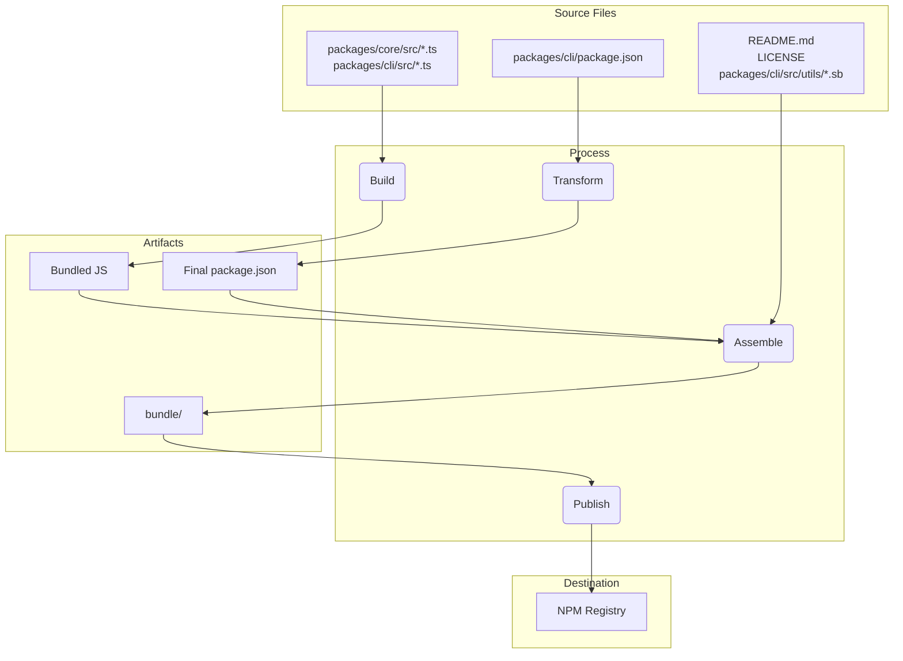

# Visão Geral do Pacote

Este monorepo contém dois pacotes principais: `@qwen-code/qwen-code` e `@qwen-code/qwen-code-core`.

## `@qwen-code/qwen-code`

Este é o pacote principal do Qwen Code. Ele é responsável pela interface do usuário, parsing de comandos e todas as outras funcionalidades voltadas ao usuário.

Quando este pacote é publicado, ele é empacotado em um único arquivo executável. Este bundle inclui todas as dependências do pacote, incluindo `@qwen-code/qwen-code-core`. Isso significa que, quer um usuário instale o pacote com `npm install -g @qwen-code/qwen-code` ou o execute diretamente com `npx @qwen-code/qwen-code`, ele estará usando este único executável autocontido.

## `@qwen-code/qwen-code-core`

Esse pacote contém a lógica principal do CLI. Ele é responsável por fazer requisições API para os providers configurados, gerenciar autenticação e controlar o cache local.

Esse pacote não é bundled. Quando publicado, ele é distribuído como um pacote Node.js padrão com suas próprias dependências. Isso permite que ele seja usado como um pacote independente em outros projetos, se necessário. Todo o código JS transpilado na pasta `dist` está incluído no pacote.

# Processo de Release

Este projeto segue um processo estruturado de release para garantir que todos os pacotes sejam versionados e publicados corretamente. O processo foi projetado para ser o mais automatizado possível.

## Como fazer uma Release

As releases são gerenciadas através do workflow do GitHub Actions [release.yml](https://github.com/QwenLM/qwen-code/actions/workflows/release.yml). Para realizar uma release manual de um patch ou hotfix:

1.  Navegue até a aba **Actions** do repositório.
2.  Selecione o workflow **Release** na lista.
3.  Clique no botão dropdown **Run workflow**.
4.  Preencha os inputs necessários:
    - **Version**: A versão exata a ser lançada (ex: `v0.2.1`).
    - **Ref**: O branch ou commit SHA a partir do qual será feito o release (o padrão é `main`).
    - **Dry Run**: Deixe como `true` para testar o workflow sem publicar, ou defina como `false` para realizar uma release real.
5.  Clique em **Run workflow**.

## Releases Noturnas (Nightly)

Além das releases manuais, este projeto possui um processo automatizado de release noturna para fornecer a versão mais recente e instável ("bleeding edge") para testes e desenvolvimento.

### Processo

Todo dia à meia-noite UTC, o [workflow de Release](https://github.com/QwenLM/qwen-code/actions/workflows/release.yml) é executado automaticamente conforme agendado. Ele executa os seguintes passos:

1.  Faz o checkout do código mais recente a partir da branch `main`.
2.  Instala todas as dependências.
3.  Executa a suite completa de checks `preflight` e testes de integração.
4.  Se todos os testes passarem, calcula o próximo número de versão nightly (ex.: `v0.2.1-nightly.20230101`).
5.  Em seguida, faz o build e publica os pacotes no npm com a dist-tag `nightly`.
6.  Por fim, cria um GitHub Release para a versão nightly.

### Tratamento de Falhas

Se qualquer etapa do workflow nightly falhar, ele criará automaticamente uma nova issue no repositório com as labels `bug` e `nightly-failure`. A issue conterá um link para a execução do workflow que falhou, facilitando o debug.

### Como Usar a Nightly Build

Para instalar a última nightly build, utilize a tag `@nightly`:

```bash
npm install -g @qwen-code/qwen-code@nightly
```

Também executamos um Google Cloud Build chamado [release-docker.yml](../.gcp/release-docker.yml), que publica a imagem Docker do sandbox para corresponder ao seu release. Isso também será movido para o GitHub e combinado com o arquivo principal de release assim que as permissões da service account forem resolvidas.

### Após o Release

Após a conclusão bem-sucedida do workflow, você pode acompanhar seu progresso na [aba GitHub Actions](https://github.com/QwenLM/qwen-code/actions/workflows/release.yml). Uma vez concluído, você deve:

1. Ir para a [página de pull requests](https://github.com/QwenLM/qwen-code/pulls) do repositório.
2. Criar um novo pull request da branch `release/vX.Y.Z` para `main`.
3. Revisar o pull request (ele deve conter apenas atualizações de versão nos arquivos `package.json`) e fazer o merge. Isso mantém a versão na branch `main` atualizada.

## Validação de Release

Após fazer o push de uma nova release, deve-se realizar um smoke test para garantir que os pacotes estão funcionando conforme o esperado. Isso pode ser feito instalando os pacotes localmente e executando um conjunto de testes para verificar se estão operando corretamente.

- `npx -y @qwen-code/qwen-code@latest --version` para validar se o push funcionou como esperado, caso você não esteja fazendo um tag rc ou dev
- `npx -y @qwen-code/qwen-code@<release tag> --version` para validar se a tag foi publicada corretamente
- _Isso é destrutivo localmente_ `npm uninstall @qwen-code/qwen-code && npm uninstall -g @qwen-code/qwen-code && npm cache clean --force && npm install @qwen-code/qwen-code@<version>`
- É recomendado fazer um smoke test básico, executando alguns comandos e ferramentas de LLM para garantir que os pacotes estão funcionando conforme o esperado. Vamos formalizar isso mais no futuro.

## Quando fazer merge da alteração de versão, ou não?

O padrão acima para criar releases de patch ou hotfix a partir de commits atuais ou antigos deixa o repositório no seguinte estado:

1.  A Tag (`vX.Y.Z-patch.1`): Esta tag aponta corretamente para o commit original na main
    que contém o código estável que você pretendia lançar. Isso é crucial. Qualquer pessoa que fizer
    checkout desta tag obtém exatamente o código que foi publicado.
2.  O Branch (`release-vX.Y.Z-patch.1`): Este branch contém um novo commit em cima do
    commit marcado com a tag. Esse novo commit contém apenas a alteração do número da versão no package.json
    (e outros arquivos relacionados como package-lock.json).

Essa separação é boa. Ela mantém o histórico do seu branch main limpo de bumps de versão
específicos para release até que você decida fazer merge deles.

Esta é a decisão crítica, e depende inteiramente da natureza do release.

### Merge Back para Patches Estáveis e Hotfixes

Quase sempre você vai querer fazer o merge da branch `release-<tag>` de volta para `main` para qualquer patch estável ou release de hotfix.

- Por quê? O principal motivo é atualizar a versão no package.json da branch main. Se você lançar a v1.2.1 a partir de um commit mais antigo mas nunca fizer o merge da atualização de versão de volta, o package.json da sua branch main ainda vai dizer "version": "1.2.0". O próximo desenvolvedor que começar a trabalhar na próxima feature release (v1.3.0) vai estar criando uma branch a partir de uma base de código que tem um número de versão incorreto e desatualizado. Isso gera confusão e requer atualização manual da versão depois.
- O Processo: Após a branch release-v1.2.1 ser criada e o pacote ser publicado com sucesso, você deve abrir um pull request para fazer o merge de release-v1.2.1 em main. Este PR vai conter apenas um commit: "chore: bump version to v1.2.1". É uma integração limpa e simples que mantém sua branch main sincronizada com a última versão lançada.

### NÃO Faça Merge de Volta para Pré-Lançamentos (RC, Beta, Dev)

Normalmente, você não faz merge das branches de release para pré-lançamentos de volta para `main`.

- Por quê? Versões de pré-lançamento (ex: v1.3.0-rc.1, v1.3.0-rc.2) são, por definição, instáveis e temporárias. Você não quer poluir o histórico da sua branch principal com uma série de atualizações de versão para release candidates. O package.json no main deve refletir a versão mais recente e estável, não uma RC.
- O Processo: A branch release-v1.3.0-rc.1 é criada, o npm publish --tag rc acontece e então... a branch cumpriu seu propósito. Você pode simplesmente deletá-la. O código da RC já está no main (ou em uma feature branch), então nenhum código funcional é perdido. A release branch era apenas um veículo temporário para o número da versão.

## Teste e Validação Local: Alterações no Processo de Empacotamento e Publicação

Se você precisar testar o processo de release sem publicar de fato no NPM ou criar um release público no GitHub, é possível acionar o workflow manualmente pela interface do GitHub.

1.  Acesse a [aba Actions](https://github.com/QwenLM/qwen-code/actions/workflows/release.yml) do repositório.
2.  Clique no dropdown "Run workflow".
3.  Mantenha a opção `dry_run` marcada (`true`).
4.  Clique no botão "Run workflow".

Isso executará todo o processo de release, mas pulará os passos `npm publish` e `gh release create`. Você pode inspecionar os logs do workflow para garantir que tudo está funcionando conforme o esperado.

É essencial testar localmente quaisquer alterações no processo de empacotamento e publicação antes de fazer o commit. Isso assegura que os pacotes serão publicados corretamente e funcionarão como esperado quando instalados por um usuário.

Para validar suas alterações, você pode realizar um dry run do processo de publicação. Isso simulará a publicação sem efetivamente enviar os pacotes ao registry do npm.

```bash
npm_package_version=9.9.9 SANDBOX_IMAGE_REGISTRY="registry" SANDBOX_IMAGE_NAME="thename" npm run publish:npm --dry-run
```

Este comando irá:

1.  Construir todos os pacotes.
2.  Executar todos os scripts de prepublish.
3.  Criar os tarballs dos pacotes que seriam publicados no npm.
4.  Exibir um resumo dos pacotes que seriam publicados.

Você pode então inspecionar os tarballs gerados para garantir que contenham os arquivos corretos e que os arquivos `package.json` tenham sido atualizados adequadamente. Os tarballs serão criados na raiz do diretório de cada pacote (ex: `packages/cli/qwen-code-0.1.6.tgz`).

Ao realizar um dry run, você pode ter confiança de que suas alterações no processo de empacotamento estão corretas e que os pacotes serão publicados com sucesso.

## Análise Profunda do Release

O objetivo principal do processo de release é pegar o código-fonte do diretório `packages/`, fazer o build e montar um pacote limpo e autocontido em um diretório temporário chamado `bundle` na raiz do projeto. É esse diretório `bundle` que realmente é publicado no NPM.

Aqui estão as etapas principais:

### Etapa 1: Verificações de Sanidade e Versionamento Pré-Release

- **O que acontece**: Antes de mover qualquer arquivo, o processo garante que o projeto esteja em bom estado. Isso envolve rodar testes, linter e verificação de tipos (`npm run preflight`). O número da versão no `package.json` da raiz e em `packages/cli/package.json` é atualizado para a nova versão de release.
- **Por quê**: Isso garante que apenas código de alta qualidade e funcional seja liberado. O versionamento é o primeiro passo para sinalizar uma nova release.

### Etapa 2: Build do Código-Fonte

- **O que acontece**: O código TypeScript em `packages/core/src` e `packages/cli/src` é compilado para JavaScript.
- **Movimentação de arquivos**:
  - `packages/core/src/**/*.ts` → compilado para → `packages/core/dist/`
  - `packages/cli/src/**/*.ts` → compilado para → `packages/cli/dist/`
- **Por quê**: O código TypeScript escrito durante o desenvolvimento precisa ser convertido em JavaScript puro para poder ser executado pelo Node.js. O pacote core é construído primeiro porque o pacote cli depende dele.

### Etapa 3: Montagem do Pacote Final Publicável

Esta é a etapa mais crítica, onde os arquivos são movidos e transformados em sua forma final para publicação. Uma pasta temporária `bundle` é criada na raiz do projeto para armazenar o conteúdo final do pacote.

#### 1. Transformação do `package.json`:

- **O que acontece**: O `package.json` de `packages/cli/` é lido, modificado e salvo no diretório `bundle/` da raiz.
- **Movimentação de arquivos**: `packages/cli/package.json` → (transformação em memória) → `bundle/package.json`
- **Por quê**: O `package.json` final deve ser diferente do usado no desenvolvimento. Alterações importantes incluem:
  - Remoção das `devDependencies`.
  - Remoção das dependências específicas do workspace: `{ "@qwen-code/core": "workspace:*" }`, garantindo que o código do core seja embutido diretamente no arquivo JavaScript final.
  - Garantir que os campos `bin`, `main` e `files` apontem para os locais corretos dentro da estrutura final do pacote.

#### 2. Criação do Bundle JavaScript:

- **O que acontece**: O JavaScript já compilado de `packages/core/dist` e `packages/cli/dist` é empacotado em um único arquivo JavaScript executável.
- **Movimentação de arquivos**: `packages/cli/dist/index.js` + `packages/core/dist/index.js` → (empacotado com esbuild) → `bundle/gemini.js` (ou nome similar).
- **Por quê**: Isso cria um único arquivo otimizado contendo todo o código necessário da aplicação. Simplifica o pacote ao eliminar a necessidade de que o pacote core seja uma dependência separada no NPM, já que seu código agora está incluso diretamente.

#### 3. Cópia de Arquivos Estáticos e de Suporte:

- **O que acontece**: Arquivos essenciais que não fazem parte do código-fonte mas são necessários para o funcionamento correto ou descrição adequada do pacote são copiados para o diretório `bundle`.
- **Movimentação de arquivos**:
  - `README.md` → `bundle/README.md`
  - `LICENSE` → `bundle/LICENSE`
  - `packages/cli/src/utils/*.sb` (perfis sandbox) → `bundle/`
- **Por quê**:
  - O `README.md` e `LICENSE` são arquivos padrão que devem estar presentes em qualquer pacote NPM.
  - Os perfis sandbox (arquivos `.sb`) são recursos críticos em tempo de execução necessários para o recurso de sandboxing do CLI. Devem ficar junto ao executável final.

### Etapa 4: Publicação no NPM

- **O que acontece**: O comando `npm publish` é executado a partir do diretório `bundle` na raiz.
- **Por quê**: Ao rodar `npm publish` dentro do diretório `bundle`, somente os arquivos cuidadosamente montados na Etapa 3 são enviados ao registro do NPM. Isso evita que código-fonte, arquivos de teste ou configurações de desenvolvimento sejam acidentalmente publicados, resultando em um pacote limpo e mínimo para os usuários.

---

### Resumo do Fluxo de Arquivos



Esse processo garante que o artefato final publicado seja uma representação limpa, eficiente e feita sob medida do projeto — e não uma cópia direta do workspace de desenvolvimento.

## NPM Workspaces

Este projeto usa [NPM Workspaces](https://docs.npmjs.com/cli/v10/using-npm/workspaces) para gerenciar os pacotes dentro deste monorepo. Isso simplifica o desenvolvimento, permitindo que a gente gerencie dependências e execute scripts em vários pacotes a partir da raiz do projeto.

### Como Funciona

O arquivo `package.json` da raiz define os workspaces para este projeto:

```json
{
  "workspaces": ["packages/*"]
}
```

Isso diz ao NPM que qualquer pasta dentro do diretório `packages` é um pacote separado que deve ser gerenciado como parte do workspace.

### Benefícios dos Workspaces

- **Gerenciamento Simplificado de Dependências**: Executar `npm install` na raiz do projeto irá instalar todas as dependências de todos os pacotes no workspace e fazer o link entre eles. Isso significa que você não precisa executar `npm install` no diretório de cada pacote.
- **Linkagem Automática**: Pacotes dentro do workspace podem depender uns dos outros. Quando você executa `npm install`, o NPM cria automaticamente symlinks entre os pacotes. Isso significa que quando você faz alterações em um pacote, as mudanças ficam imediatamente disponíveis para outros pacotes que dependem dele.
- **Execução Simplificada de Scripts**: Você pode rodar scripts em qualquer pacote a partir da raiz do projeto usando a flag `--workspace`. Por exemplo, para executar o script `build` no pacote `cli`, você pode rodar `npm run build --workspace @qwen-code/qwen-code`.