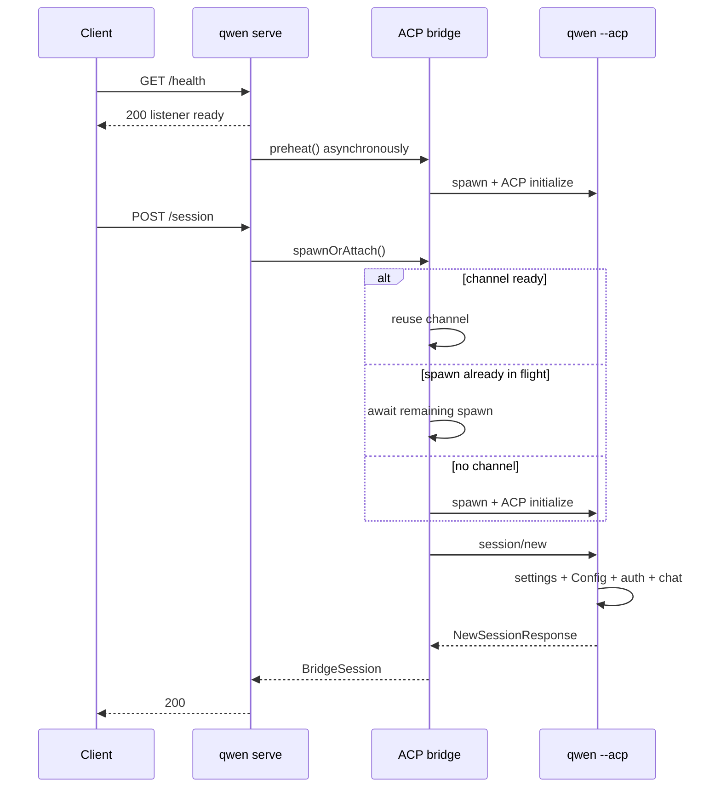

# Дизайн профилирования холодного первого сеанса

## Решение

Следующий срез реализации для #4748 — наблюдаемость, а не очередной кэш запуска или новый протокол сессий. Он должен объяснить один холодный запрос через демон, общий ACP-канал и ACP-дочерний процесс, сохраняя текущее быстрое поведение `/health`.

Реализация переиспользует существующие спаны запроса/бриджа OpenTelemetry демона и точку расширения `_meta` ACP. Она добавляет:

- тайминг bootstrap-запроса, чтобы ожидание отложенной среды выполнения попадало в последующий HTTP-спан, а не принималось за время прокси/сети;
- спан ожидания канала для каждого запроса, который показывает, переиспользовала ли сессия (Session) готовый канал, присоединилась ли к выполняющемуся запуску или запустила по требованию;
- непрозрачный идентификатор на каждом ACP-канале, чтобы трассировку автоматического прогрева можно было скоррелировать с последующей трассировкой Session, не выдумывая ложное отношение родитель/потомок;
- внедрение trace-контекста при `session/new` ACP;
- один спан `session/new` ACP-дочернего процесса с ограниченными длительностями этапов для настроек, инициализации Config, аутентификации, подготовки файловой системы, регистрации Session и построения ответа;
- ACP Session ID в существующей включаемой явно JSONL-записи `QWEN_CODE_PROFILE_SESSION_START`, чтобы ее детальные этапы `startChat` можно было связать с трассировкой.

Этот срез не добавляет заголовки ответа, публичные JSON-поля, флаги возможностей или второй формат профилировщика. Готовность ACP остается отдельным P1-изменением клиента/API после того, как станет доступна P0-разбивка.

## Данные

Сэмпл downstream `0.19.3-preview.2` показал P50 в 2 534 мс от успешного health до успешного Session и P50 в 1 713 мс для `POST /session`. Отрицательная корреляция между задержкой от health до запроса и длительностью POST согласуется с тем, что первый запрос ждет остаток автоматического прогрева, но тайминги браузера не могут разделить работу прокси, демона, канала и дочернего процесса.

Локальный прогон с глобально установленным `qwen 0.19.10` подтвердил ту же форму:

| Сценарий                                              |                   Наблюдение |
| ----------------------------------------------------- | ---------------------------: |
| Запуск процесса → слушатель                           |                        203 мс |
| Health сразу за которым следует холодный `POST /session` | 1 033 мс браузер / 962 мс демон |
| Уже прогретый `POST /session` в отдельном запуске     |   222 мс браузер / 221 мс демон |

Это иллюстративные одиночные запуски, а не приемочный бенчмарк. Они показывают, что текущая грубая длительность маршрута скрывает примерно 700–800 мс, которые могут быть ожиданием канала, bootstrap'ом ACP-дочернего процесса или и тем и другим.

## Текущая архитектура

Существующая наблюдаемость уже предоставляет:

- HTTP-спан запроса для `POST /session` после того, как приложение среды выполнения получает запрос;
- спаны бриджа для `channel.spawn`, `channel.initialize` и `session.new`;
- внедрение и извлечение W3C trace-контекста через зарезервированные ключи `_meta` ACP, в настоящее время используемое для диспетчеризации промптов;
- включаемый явно JSONL-профилировщик для детальных этапов `GeminiClient.startChat()`.

Отсутствующие части — любое ожидание отложенной среды выполнения на bootstrap-слое до этого спана запроса, ожидание канала для текущего запроса, корреляция с независимо начатой трассировкой прогрева, распространение при `session/new` и тайминги до `startChat` внутри дочернего процесса.

## Дизайн

### Родительский демон и бридж

Когда не-bootstrap-запрос прибывает до монтирования отложенной среды выполнения, делегирующее bootstrap-приложение записывает его время прибытия по настенным часам, оставшееся ожидание среды выполнения и то, начал ли этот запрос загрузку среды выполнения или присоединился к работе, уже начатой планированием health/фолбэка. Middleware телеметрии среды выполнения получает тот же объект запроса после монтирования и датирует HTTP-спан задним числом этим временем прибытия. Метрики длительности маршрута используют ту же границу. Это делает длительность браузера минус длительность запроса демона осмысленным остатком прокси/сети даже на холодном пути отложенной среды выполнения.

До того как `doSpawn()` ждет `ensureChannel()`, он классифицирует синхронное состояние канала:

- `reused`: не умирающий канал уже доступен;
- `joined`: `inFlightChannelSpawn` уже существует;
- `spawned_on_request`: нет ни живого канала, ни выполняющегося запуска.

Затем он оборачивает ожидание в спан бриджа `channel.wait`. Продакшен-реализации телеметрии вызывают свой колбэк синхронно, поэтому классификация читается, и `ensureChannel()` вызывается без уступки цикла событий JavaScript.

Каждый новый `ChannelInfo` получает случайный UUID до вызова `channelFactory()`. Тот же идентификатор прикрепляется только к спанам:

- `channel.spawn`;
- `channel.initialize`;
- `session.new`, когда канал известен.

Этот идентификатор — диагностические данные трассировки, а не метка метрик или публичный идентификатор. Автоматический прогрев и первый Session могут принадлежать разным трассировкам; идентификатор канала связывает их, не утверждая, что более поздний HTTP-запрос стал причиной более ранней работы.

`preheat()` получает собственный спан бриджа `channel.preheat`. Session, присоединяющийся к нему, имеет спан `channel.wait`, измеряющий только оставшееся ожидание. `channel.initialize` и `channel.wait` в этом случае перекрываются и не должны суммироваться.

Внутри существующего спана `session.new` бридж внедряет активный trace-контекст в `NewSessionRequest._meta`. Существующий помощник внедрения уже удаляет предоставленные клиентом зарезервированные ключи перед добавлением значений, принадлежащих демону. После ответа дочернего процесса событие спана записывает ACP Session ID для корреляции с JSONL-профилировщиком.

### ACP-дочерний процесс

`QwenAgent.newSession()` извлекает контекст демона из запроса и запускает дочерний спан `qwen-code.daemon.session_start` под родительским спаном бриджа `session.new`. Если контекст отсутствует или невалиден, применяется обычное поведение корневого спана OTel.

Дочерний процесс записывает фиксированные, неперекрывающиеся длительности с использованием `performance.now()`:

| Этап                | Граница                                                                                                                                                                            |
| ------------------- | ---------------------------------------------------------------------------------------------------------------------------------------------------------------------------------- |
| `settings_load`     | `loadSettingsCached(cwd)`                                                                                                                                                          |
| `config_setup`      | `newSessionConfig()`, включая `loadCliConfig()`, `config.initialize()` и обычный первый `startChat()`                                                                             |
| `auth`              | `ensureAuthenticated()`                                                                                                                                                            |
| `file_system_setup` | `setupFileSystem()`                                                                                                                                                                |
| `session_register`  | `createAndStoreSession()`, обычно построение и регистрация ACP `Session`; его защитная инициализация Gemini замеряется здесь, только если Config еще не инициализировал ее        |
| `response_build`    | модели, режимы, опции конфигурации и построение объекта ответа                                                                                                                     |

E2E-запуск реализации показал `config_setup` около 200 мс, из которых около 140 мс записал существующий вложенный профилировщик `startChat`. Это подтверждает, что обычный `startChat()` происходит во время `config.initialize()`, а не во время последующей регистрации Session. JSONL Session ID делает эти вложенные затраты связываемыми без угадывания по временным меткам файлов. Более поздняя оптимизация может отделить построение Config от `config.initialize()`, если репрезентативные downstream-трассировки покажут, что оставшиеся неатрибутированные затраты Config существенны; сделать это в этом срезе потребовало бы пропускать профилировщик через метод, общий для путей new/load/resume/transcript.

### Контракт атрибутов

Выпускаются только фиксированные имена атрибутов и ограниченные значения:

- `qwen-code.daemon.channel.path` = `reused | joined | spawned_on_request`;
- `qwen-code.daemon.runtime.path` = `started_on_request | joined`, когда запрос пересек гейт отложенной среды выполнения;
- `qwen-code.daemon.runtime.wait_ms` = конечное неотрицательное оставшееся ожидание среды выполнения;
- гистограмма длительности HTTP-запроса `runtime_path` = `started_on_request | joined` для запросов, пересекших гейт отложенной среды выполнения, иначе `none`;
- `qwen-code.daemon.acp_channel.id` = сгенерированный демоном UUID;
- `qwen-code.daemon.session_start.<stage>_ms` = конечная неотрицательная длительность;
- `qwen-code.daemon.session_start.failed_stage` = одно фиксированное имя этапа;
- `session.id` = сгенерированный ACP Session ID.

Не добавляются ни путь рабочего пространства, ни промпт, ни значение настроек, ни учетные данные, ни ответ модели, ни содержимое файлов.

## Сбои, параллельность и совместимость

- OTel отключен: существующее поведение не меняется; бридж по-прежнему проходит через свой стык телеметрии без операций, а дочерний профилировщик избегает вывода в файлы, если не включен существующий флаг окружения.
- Сбой отложенной среды выполнения: bootstrap-приложение по-прежнему возвращает существующую ошибку запуска; метаданные тайминга локальны для процесса и никогда не раскрываются в ответе.
- Невалидные или отсутствующие метаданные трассировки: дочерний процесс создает спан без родителя или не создает спана, и создание Session продолжается.
- Сбой атрибута телеметрии: атрибуты этапов записываются по мере возможности (best-effort) и не могут изменить результат Session.
- Сбой прогрева: `channel.wait` отражает путь повтора запроса; существующая очистка дочернего процесса и семантика ленивого повтора остаются неизменными.
- Параллельные первые Session: каждый запрос получает собственный `channel.wait` и спан дочерней Session, при этом все могут ссылаться на один и тот же идентификатор канала.
- Старые или не-демонские ACP-клиенты: `_meta` опциональна, поэтому дочерний процесс продолжает принимать обычные сообщения `NewSessionRequest`.
- Существующие потребители JSONL: `sessionId` аддитивен и опционален; существующие поля и компоновка файлов не меняются.
- Разборка канала: диагностический UUID живет только на `ChannelInfo` и исчезает вместе с каналом; он не меняет логику переиспользования, таймаута простоя или завершения.

## Альтернативы, отклоненные для этого среза

### Пользовательский идентификатор профиля и конверт ответа ACP

Возврат второй схемы тайминга в `NewSessionResponse._meta` дублировал бы OTel, требовал бы валидации/версионирования и создавал бы два источника истины. W3C-контекст уже несет причинность, а UUID канала обрабатывает одну намеренно отдельную трассировку прогрева.

### `Server-Timing` и `X-Qwen-Profile-Id`

Они помогли бы диагностике только из браузера, но требуют пропуска заголовков через прокси и решений об раскрытии CORS за пределами этого репозитория. Спан запроса демона и существующая длительность маршрута уже предоставляют серверное время. Работа над заголовками может последовать, если downstream-трассировка останется недоступной.

### Заставить `/health` ждать ACP

Это перемещает задержку в готовность и рискует регрессиями health-проб. `/health` остается готовностью слушателя/liveness; готовность ACP — отдельный будущий контракт, гейтируемый возможностью.

### Совместное использование Config или предсоздание Session

Оба меняют семантику изоляции и жизненного цикла до того, как профилирование определит доминирующий этап. Они явно вне скоупа.

## Верификация

Сфокусированные юнит-тесты должны доказать:

- `session/new` получает принадлежащие демону метаданные трассировки;
- запрос Session, пересекающий гейт отложенной среды выполнения, начинает свой HTTP-спан в момент прибытия bootstrap и записывает, начал он загрузку среды выполнения или присоединился к ней;
- `channel.wait` сообщает пути spawned, joined и reused;
- один UUID канала связывает спаны spawn, initialize и Session;
- дочерний процесс извлекает родительский контекст и записывает все фиксированные этапы;
- упавший этап записывается, а исходная ошибка сохраняется;
- JSONL запуска сессии включает Session ID, когда он предоставлен, и остается обратно совместимым при его отсутствии;
- отключенная телеметрия или некорректные метаданные не меняют поведение Session.

E2E-прогон вслепую сравнивает два случая с одинаковым рабочим пространством и аутентификацией:

1. health сразу за которым следует `POST /session`;
2. health за которым следует явный прогрев, затем `POST /session`.

Для обоих проверить успешность Session и изучить дерево трассировки. Холодный случай должен содержать путь запроса `channel.wait` и атрибуты этапов дочернего процесса; прогретый случай должен сообщать `reused`. Производительностные выводы требуют как минимум 30 сериализованных холодных запусков в репрезентативном downstream-окружении и не выводятся из таймингов локальных одиночных запусков.

## Граница реализации и гейт ревью

Продакшен-изменения ограничены передачей запроса отложенной среды выполнения и middleware телеметрии в `run-qwen-serve`, существующим стыком телеметрии в `packages/acp-bridge`, ACP `newSession` и существующим профилировщиком запуска сессии в ядре. Никаких изменений поведения Session/конфигурации/аутентификации.

Рассмотренные для этого дизайна межпакетные downstream-потребители:

- построение бриджа демона в `run-qwen-serve.ts` и реализации телеметрии тестового/встраиваемого бриджа;
- допуск маршрутов отложенной среды выполнения и потребители телеметрии/метрик запросов;
- все вызывающие стороны `AcpSessionBridge.spawnOrAttach()`, которые получают ту же форму `BridgeSession`;
- ACP-клиенты, отличные от демона, которые могут опускать `_meta`;
- тесты профилировщика запуска сессии и читатели JSONL, для которых `sessionId` опционален.

Поскольку это пересекает границы ядра/бриджа/CLI, требуется ревью мейнтейнера, даже если продакшен-изменение логики намеренно мало.
