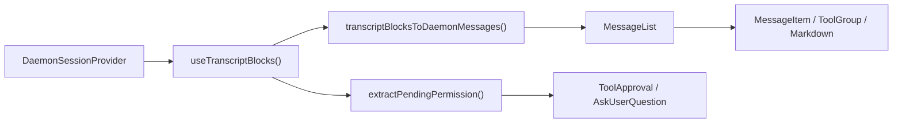
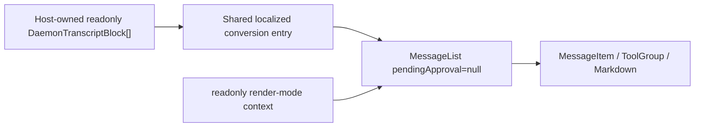

# Дизайн рендеринга транскрипта демона только для чтения в WebShell

## Статус документа

- Статус: Реализовано
- Дата: 2026-07-14
- Скоуп: `packages/web-shell`
- Вход: `readonly DaemonTranscriptBlock[]`
- Выход: представление транскрипта только для чтения, наследующее возможности отображения `MessageList` WebShell

## 1. Предпосылки

В WebShell уже есть полный путь рендеринга транскрипта демона, но сейчас его можно использовать только косвенно через `App` или `ChatPane` в split-виде. Компонент сначала читает блоки транскрипта из `DaemonSessionProvider`, преобразует эти блоки во внутренние сообщения WebShell и в итоге передает их в `MessageList` для рендеринга.

Новый сценарий использования уже напрямую владеет `DaemonTranscriptBlock[]` и нуждается только в стилях и возможностях рендеринга сообщений WebShell для отображения исторического содержимого. Ему не нужно устанавливать соединение сессии демона, и он не должен выполнять мутации сессии. Взаимодействия, явно исключенные из целевых: одобрение инструментов, `AskUserQuestion`, повтор, ветвление, отправка промпта и открытие панелей, изменяющих состояние сессии.

Если хост напрямую потребляет результат `transcriptBlocksToDaemonMessages` и собирает внутренние компоненты, это раскрывает приватную модель `DaemonMessage` WebShell, контексты и ограничения CSS. Это также приведет к дрейфу от поддерживаемого рендеринга, когда `MessageList` получит новые функции. Поэтому `@qwen-code/web-shell` должен предоставить стабильную публичную точку входа.

## 2. Цели

1. Добавить публичный React-компонент, который напрямую принимает и рендерит `readonly DaemonTranscriptBlock[]`.
2. Переиспользовать существующий `transcriptBlocksToDaemonMessages()` и тот же `MessageList`, чтобы возможности пользователя, ассистента, размышлений, инструментов, суб-агентов, плана, статуса, Markdown, таймлайна и виртуальной прокрутки длинных сессий автоматически эволюционировали вместе с `MessageList`.
3. Позволить компоненту рендериться независимо, без `DaemonWorkspaceProvider`, `DaemonSessionProvider` или сетевого соединения.
4. Не выполнять никаких мутаций демона/сессии в границе только для чтения и не показывать UI ответа на ожидающие разрешения или `AskUserQuestion`.
5. В основном добавлять экспорты, не меняя пути рантайма, значения по умолчанию или поведение DOM существующих `WebShell`, `WebShellWithProviders`, `App` или `ChatPane`.
6. Добавить полные юнит-тесты компонента и пройти существующие наборы тестов WebShell, сборку, lint и typecheck.

## 3. Не цели

- Добавление получения транскрипта, пагинации, кеширования или SSE-подписок; блоки предоставляет хост.
- Вставка режима только для чтения в существующий `WebShellProps` или добавление условных двойных источников данных `readOnly`/`blocks` в `App`.
- Экспорт внутренних типов `MessageList`, `Message` или `DaemonMessage`.
- Отображение или обработка неразрешенных одобрений инструментов или `AskUserQuestion`.
- Предоставление композера оболочки приложения, промптов в очереди, статуса потоковой передачи, сайдбара, split-вида, диалогов, правой панели артефактов или аналогичных возможностей. Таймлайн сессии, встроенный в `MessageList`, сохраняется.
- Вывод или загрузка отдельных артефактов сессии из блоков. Карточки вывода хода уровня приложения для изменений файлов, артефактов и запланированных задач вне скоупа.
- Предотвращение взаимодействий, изменяющих только локальное состояние представления, таких как копирование, сворачивание/разворачивание инструмента, разворачивание завершенного хода, фильтрация таблиц или навигация по таймлайну.

## 4. Терминология и граница только для чтения

В этом дизайне «только для чтения» означает **отсутствие чтения или изменения состояния среды выполнения демона/сессии**. Это не означает установку `pointer-events: none` на весь DOM.

| Категория                        | Поведение                                                                     | Сохраняется                       |
| -------------------------------- | ----------------------------------------------------------------------------- | --------------------------------- |
| Пассивное представление          | Текст, Markdown, изображения, diff, вывод shell, статус инструментов/суб-агентов | Да                             |
| Локальный просмотр               | Копирование, сворачивание, разворачивание, виртуальная прокрутка, таймлайн, сортировка/фильтрация таблиц | Да |
| Кастомизированное хостом представление | Рендереры Markdown/блоков кода, рендерер содержимого сообщений          | Да; хост владеет любыми побочными эффектами |
| Обычные внешние ссылки           | Навигация в новом окне после безопасной для браузера трансформации URL        | Да                                |
| Семантическая навигация WebShell | `qwen-session://` диспетчеризует глобальное событие `qwen:open-session`       | Нет; рендерится как неинтерактивный текст |
| Мутация сессии                   | Отправка промпта, отмена, повтор, ветвление, перемотка, смена модели/режима   | Нет                               |
| Мутация разрешений               | Одобрение/отклонение инструмента, отправка/игнорирование `AskUserQuestion`    | Нет                               |
| Загрузка внешних данных          | Подключение к сессии, инициированное компонентом, или получение транскрипта/артефактов/задач/MCP | Нет |

Эта граница сохраняет опыт чтения `MessageList`, гарантируя, что сам компонент не имеет возможности записи в демон.

## 5. Текущее состояние и карта вызывающих сторон

| Модуль                                                         | Текущая ответственность                                                                  | Отношение к этому дизайну                                              |
| -------------------------------------------------------------- | ---------------------------------------------------------------------------------------- | ---------------------------------------------------------------------- |
| `packages/sdk-typescript/src/daemon/ui/types.ts`               | Определяет объединение `DaemonTranscriptBlock`                                           | Публичная входная модель нового компонента                             |
| `packages/web-shell/client/adapters/transcriptToMessages.ts`   | Объединяет блоки в `DaemonMessage[]` WebShell                                            | Переиспользовать напрямую; не создавать новый конвертер                |
| `packages/web-shell/client/hooks/useMessages.ts`               | Читает блоки из хука сессии и предоставляет локализованные опции преобразования          | Выделить общую чистую точку преобразования, принимающую внешние блоки |
| `packages/web-shell/client/components/MessageList.tsx`         | Сворачивание ходов, группы инструментов/суб-агентов, таймлайн, виртуальная прокрутка и рендеринг отдельных сообщений | Единственная реализация списка, общая для нового и существующего путей |
| `packages/web-shell/client/components/MessageItem.tsx`         | Диспетчеризует конкретные рендереры по роли сообщения                                    | Изменения не требуются                                                 |
| `packages/web-shell/client/App.tsx`                            | Полный WebShell одной сессии: одобрения, композер, боковые панели                        | Существующий путь остается неизменным                                  |
| `packages/web-shell/client/components/ChatPane.tsx`            | Полная интерактивная сессия в split-виде                                                 | Существующий путь остается неизменным                                  |
| `packages/web-shell/client/index.tsx` / `index.ts`             | Экспорты рантайма/исходников пакета                                                      | Экспортировать новый компонент и тип                                   |

Текущий основной путь:



Новый путь только для чтения обходит provider сессии и ветку разрешений:



В основном редакторе WebShell `/tasks` и `/mcp` перехватываются внутри `App`. Они обновляют только React-состояние диалогов, не вызывают `sendPrompt()` и не пишут в JSONL сессии. Поэтому персистентные транскрипты не содержат сентинелов для этих двух локальных панелей, и новая точка входа не добавляет соответствующего распознавания или ветки фильтрации.

## 6. Публичный API

Добавить компонент с именем `WebShellTranscript`, экспортируемый из корня пакета `@qwen-code/web-shell`.

```ts
export interface WebShellTranscriptProps {
  /** Ordered transcript blocks from one logical session. */
  blocks: readonly DaemonTranscriptBlock[];

  theme?: WebShellTheme;
  language?: 'en' | 'zh-CN' | 'zh' | 'zh-cn';
  className?: string;
  style?: React.CSSProperties;
  chatMaxWidth?: number;
  workspaceCwd?: string;

  compactThinking?: boolean;
  collapseCompletedTurns?: boolean;
  markdownTableMode?: MarkdownTableMode;
  virtualScrollThreshold?: number;
  markdown?: WebShellMarkdownCustomization;

  composerTagIcons?: WebShellComposerTagIconMap;
  renderToolHeaderExtra?: ToolHeaderExtraRenderer;
  parseUserMessageContent?: UserMessageContentParser;
  renderUserMessageContent?: UserMessageContentRenderer;
  renderComposerTag?: ComposerTagRenderer;
  renderComposerTagTooltip?: ComposerTagRenderer;
  renderAssistantTurnFooter?: AssistantTurnFooterRenderer;
}

export function WebShellTranscript(
  props: WebShellTranscriptProps,
): React.ReactElement;
```

Замечания:

- `blocks` обязателен и не копируется и не изменяется. Вызывающим следует держать сессии блоков и порядок согласованными внутри массива.
- Визуальные props переиспользуют имена и типы из `WebShellProps`, избегая второго набора семантики конфигурации для тех же возможностей.
- Не раскрывать `onComposerTagClick`, `onRetryClick`, `onBranchSession`, `onTurnOutputOpen`, колбэки разрешений или колбэки композера.
- `theme` по умолчанию `dark`. Когда `language` опущен, использовать правила разрешения URL/языка браузера WebShell. `chatMaxWidth` по умолчанию 1000px.
- `compactThinking` по умолчанию `false` и `collapseCompletedTurns` по умолчанию `true`, соответствуя существующему `WebShell`.
- Компонент рассматривает транскрипт как статический/уже воспроизведенный и передает `isResponding={false}` в `MessageList`. Живая потоковая передача вне скоупа текущего API.

Пример:

```tsx
import { WebShellTranscript } from '@qwen-code/web-shell';
import type { DaemonTranscriptBlock } from '@qwen-code/sdk/daemon';

export function HistoryView({
  blocks,
}: {
  blocks: readonly DaemonTranscriptBlock[];
}) {
  return (
    <WebShellTranscript
      blocks={blocks}
      theme="dark"
      language="zh-CN"
      workspaceCwd="/workspace/project"
      style={{ height: 640 }}
    />
  );
}
```

Хост должен дать компоненту работоспособную высоту. Сам компонент сохраняет поведение WebShell `height: 100%`, внутреннюю прокрутку и ширину содержимого.

## 7. Детальный дизайн

### 7.1 Общее локализованное преобразование

Сохранить `transcriptBlocksToDaemonMessages()` как единственный адаптер из блоков в сообщения. Выделить внутреннюю чистую функцию в `useMessages.ts`, например:

```ts
export function transcriptBlocksToLocalizedMessages(
  blocks: readonly DaemonTranscriptBlock[],
  t: Translator,
): Message[];
```

Экспортировать эту функцию только из внутреннего модуля пакета для переиспользования новым компонентом; не раскрывать ее из корня пакета.

Функция только собирает локализованные подписи, в настоящее время используемые `useMessages()`, а затем вызывает существующий адаптер. И существующий `useMessages()`, и новый компонент вызывают ее, предотвращая дрейф текстов для отмены промпта, ветвления, вставки внутри хода и прерванных потоков.

Это единственная необходимая внутренняя реструктуризация в существующем пути рендеринга. Вход, выход и существующие результаты преобразования функции остаются неизменными, и правила объединения блоков адаптера не меняются.

### 7.2 Структура компонента `WebShellTranscript`

Добавить `packages/web-shell/client/components/WebShellTranscript.tsx` с этой внутренней последовательностью:

1. Разрешить тему и язык и создать переводчик.
2. Преобразовать `blocks` в `Message[]` с помощью `useMemo`.
3. Создать то же значение кастомизации слоя сообщений, что и существующий App.
4. Смонтировать контексты темы, i18n, кастомизации, компактного режима, режима рендеринга только для чтения и порталов WebShell.
5. Создать независимый корень с `data-web-shell-root` и `data-web-shell-shadcn`, переиспользуя классы темы App, базовые переменные, шрифты, фон и правила изоляции CSS.
6. Отрендерить тот же `MessageList`.

Важные фиксированные входы `MessageList`:

```tsx
<MessageList
  messages={messages}
  pendingApproval={null}
  isResponding={false}
  workspaceCwd={workspaceCwd ?? ''}
  virtualScrollThreshold={virtualScrollThreshold}
/>
```

Никогда не передавать эти props действий:

- `onShowContextDetail`
- `onRetryClick`
- `onBranchSession`
- `onReviewChanges`
- `onOpenArtifact`
- `onOpenScheduledTask`
- `onTurnOutputOpen`

Не передавать данные загрузки, догонки, хвоста или вывода хода, избегая любой зависимости от моделей состояния соединения и внешних ресурсов App.

### 7.3 Изоляция интерактивных рендереров

Передача только `pendingApproval=null` в `MessageList` не полностью гарантирует поведение только для чтения. Ссылки сессий в статусе цели, Markdown и результатах инструментов не используют колбэки `MessageList`; они диспетчеризуют глобальные семантические события в `window`, потенциально меняя футер или активную сессию другого WebShell на той же странице.

Добавить внутренний для пакета контекст режима рендеринга транскрипта в `client/transcriptRenderMode.ts` со значением по умолчанию `interactive`. Существующим `App` и `ChatPane` не нужен новый provider, поэтому их поведение остается неизменным. `WebShellTranscript` устанавливает значение в `readonly`. Режим только для чтения применяет только эти ограничения:

- Сохранять текст и стиль ссылок `qwen-session://`, но не диспетчеризовать `qwen:open-session`.
- `GoalStatusMessage` не диспетчеризует `GOAL_STATUS_ACTIVE_EVENT`.
- Не перехватывать обычные HTTPS-ссылки или взаимодействия локального просмотра, такие как копирование, сворачивание и сортировка.

Этот контекст меняет только выходы семантических событий в `Markdown`, `ToolGroup` и `GoalStatusMessage`, и его значение по умолчанию зафиксировано как `interactive`. Это позволяет избежать добавления prop `readOnly`, который должен проходить через каждый рендерер из `MessageList`. Новые юнит-тесты должны доказать как неизменность интерактивного поведения по умолчанию, так и подавление поведения только для чтения.

### 7.4 Тема, CSS и порталы

Сборка библиотеки WebShell внедряет и ограничивает CSS компонентов под `[data-web-shell-root]` или `[data-web-shell-portal-root]`. Новый компонент должен создать собственный корень WebShell; иначе `MessageList` может породить DOM, которому правила CSS-модулей не соответствуют.

Тултипы таймлайна и продвинутые таблицы Markdown используют порталы. Чтобы полностью наследовать эти возможности, новый компонент использует жизненный цикл хоста порталов, эквивалентный App:

- При монтировании добавляет узел с `data-web-shell-portal-root` и `data-web-shell-shadcn` в `document.body`.
- Синхронизирует классы темы и CSS-переменные корня.
- Предоставляет узел через `WebShellPortalRootContext`.
- При размонтировании удаляет узел и его наблюдатель/слушатель.

Держать этот жизненный цикл внутри нового компонента, а не рефакторить существующий код порталов App, ограничивая поверхность регрессии существующего поведения новой точкой входа. Не обращаться к `document` во время SSR; включать портал только после монтирования клиента.

### 7.5 Изоляция ошибок

Новая точка входа имеет внешнюю публичную границу и внутренний компонент содержимого. Преобразование блоков, инициализация provider'ов/порталов и `MessageList` все происходят в потомке границы, гарантируя, что сбои на любом из этих этапов попадают в тот же `RootErrorFallback`, что и публичная точка входа WebShell. Каждое сообщение остается изолированным собственной границей `MessageItem`, поэтому сбой в одном из рендереров Markdown, KaTeX, Mermaid или инструментов не очищает весь транскрипт.

### 7.6 Стратегия рендеринга блоков

Все стратегии продолжают использовать существующий адаптер; не добавлять второй switch в новом компоненте.

| `DaemonTranscriptBlock.kind` | Результат только для чтения                                                             |
| ---------------------------- | --------------------------------------------------------------------------------------- |
| `user`                       | Сообщения пользователя, изображения и аннотации ввода                                   |
| `assistant`                  | Markdown ассистента; последовательные блоки объединяются; содержимое суб-агентов назначается по родителю |
| `thought`                    | Сообщения размышления; последовательные блоки объединяются                              |
| `tool`                       | Существующие карточки для групп инструментов, diff/чтения/shell/fetch/todo/суб-агентов  |
| `shell`                      | Ассоциируется с ближайшим инструментом выполнения; существующий фолбэк сырого shell при недоступности |
| `user_shell`                 | Команда/вывод shell пользователя                                                        |
| `status` / `debug`           | Сообщение плана или системы/статуса                                                     |
| `error`                      | Системное сообщение об ошибке без действия повтора                                      |
| `prompt_cancelled`           | Локализованный статус отмены                                                            |
| неразрешенный `permission`   | Не преобразовывать, не отображать и не предоставлять точку входа действия               |
| разрешенный `permission`     | Существующие правила исторических плейсхолдеров/результатов инструментов из адаптера    |
| разрешение `AskUserQuestion` | Не показывать форму; показывать исторические результаты только при наличии последующего реального блока инструмента |

### 7.7 Обновления и производительность

- Запускать O(n) преобразование повторно только при изменении идентификации `blocks` или языка.
- `MessageList` сохраняет свои существующие мемоизацию, группировку ходов и порог виртуальной прокрутки.
- Не делать глубокую копию блоков и не создавать новый React-provider для каждого блока.
- Вызывающая сторона, часто предоставляющая новые по идентификации массивы с идентичным содержимым, вызывает повторное преобразование. Это приемлемо и соответствует текущей модели обновлений `useTranscriptBlocks()`.
- Не добавлять инкрементальный адаптер в этом релизе. Спроектировать инкрементальное преобразование отдельно, только если измерения покажут, что обновления больших внешних транскриптов являются узким местом.

## 8. Совместимость и контроль регрессий

### 8.1 Существующие пути остаются неизменными

- `WebShellProps` не получает обязательных полей и не меняет значений по умолчанию.
- `WebShell` и `WebShellWithProviders` продолжают рендерить `App`.
- `App` и `ChatPane` продолжают читать состояние сессии из соответствующих provider'ов/хуков.
- Оверлей одобрения, композер, сайдбар, split-вид и панель артефактов не проходят через новый компонент.
- `MessageList` не получает ветку prop `readOnly`. Новый вызывающий устанавливает поведение только для чтения, передавая `pendingApproval=null`, опуская колбэки действий и используя внутренний контекст режима рендеринга, значение по умолчанию которого остается интерактивным, для изоляции нескольких глобальных семантических событий.

### 8.2 Экспорты пакета

Обновить и `client/index.tsx`, и `client/index.ts` для экспорта:

```ts
export { WebShellTranscript } from './components/WebShellTranscript';
export type { WebShellTranscriptProps } from './components/WebShellTranscript';
```

Оба barrel-файла должны быть изменены, чтобы избежать ситуации, когда текущие двойные пути входа рантайма и деклараций/исходников создают «экспортировано в рантайме, но отсутствует в декларациях типов». Не добавлять экспорт подпути пакета.

### 8.3 Безопасность

- Новая точка входа не импортирует `useActions()`, `useTranscriptStore()`, `useConnection()` или `fetch`.
- Содержимое ожидающих разрешений не попадает в интерактивные рендереры.
- Не инспектировать и не переписывать содержимое сообщений статуса. Состояние диалогов `/tasks` и `/mcp` принципиально отсутствует в персистентных транскриптах.
- Режим рендеринга только для чтения не диспетчеризует глобальные события сессии/цели, которые могли бы повлиять на другой WebShell на той же странице.
- Обработка URL и HTML Markdown продолжает использовать существующий санитайзер/трансформацию WebShell; не добавлять `dangerouslySetInnerHTML` или другой обход.
- Кастомные рендереры — это код хоста. Побочные эффекты, выполняемые рендерером хоста, находятся вне гарантируемой границы только для чтения компонента, и README должен явно это указывать.

## 9. Дизайн тестов

### 9.1 Юнит-тесты контракта нового компонента

Добавить `WebShellTranscript.test.tsx`, мокая `MessageList` для верификации границы и обвязки:

1. Общий локализованный адаптер преобразует блоки в сообщения с корректным порядком и содержимым.
2. `pendingApproval` всегда `null`.
3. Колбэки мутаций сессии, разрешений, повтора, ветвления и вывода хода все опущены.
4. `isResponding` по умолчанию `false`, а конфигурация рабочего пространства и виртуальной прокрутки пробрасываются корректно.
5. Тема, язык, компактное/свернутое поведение и кастомизация сообщений попадают в правильные контексты.
6. Изменения блоков или языка перегенерируют сообщения без дублирования старого содержимого.
7. Пустые блоки рендерят пустой список без бросания исключения.

### 9.2 Юнит-тесты DOM-интеграции нового компонента

Добавить `WebShellTranscript.dom.test.tsx`, используя реальный `MessageList`:

1. Успешно рендериться в React-дереве без provider'ов демона.
2. Репрезентативные блоки пользователя, Markdown ассистента, размышлений, инструментов, суб-агентов, плана, статуса, ошибок и отмененных промптов попадают в соответствующий DOM WebShell.
3. Локальные сворачивание/разворачивание, копирование или навигация по таймлайну по-прежнему работают, доказывая переиспользование возможностей `MessageList`.
4. Неразрешенное обычное разрешение не порождает панель одобрения.
5. Неразрешенный `AskUserQuestion` не порождает UI опций, ввода, отправки или игнорирования.
6. Разрешенные исторические результаты инструментов/AskUserQuestion следуют существующим правилам отображения адаптера.
7. Ссылки сессий и статусы целей только для чтения не диспетчеризуют глобальные семантические события; соответствующие существующие тесты компонентов продолжают доказывать неизменность интерактивного поведения по умолчанию.
8. Темные/светлые классы, язык, локализованный текст, максимальная ширина чата и маркеры корня CSS корректны.
9. Корень порталов монтируется и размонтируется корректно, и содержимое порталов находится под ограниченным корнем.
10. Когда отдельный кастомный рендерер бросает исключение, используется фолбэк встроенного рендерера, и остальная часть сообщения сохраняется.

### 9.3 Тесты общего преобразования и экспортов

- Расширить тесты `useMessages`/адаптера, чтобы доказать, что существующий хук и внешние блоки используют в точности одни и те же локализованные опции.
- Расширить `index.test.tsx` или тесты артефактов сборки для проверки существования именованного экспорта рантайма.
- После сборки проверить, что `dist/types/index.d.ts` содержит экспорты `WebShellTranscript` и его props, предотвращая дрейф между двумя декларациями входа.

### 9.4 Существующий регрессионный набор

Минимально необходимая последовательность верификации после реализации:

```bash
cd packages/web-shell
npm run build
npx vitest run --config vitest.config.ts \
  client/components/WebShellTranscript.test.tsx \
  client/components/WebShellTranscript.dom.test.tsx \
  client/hooks/useMessages.test.ts \
  client/adapters/transcriptToMessages.test.ts \
  client/components/MessageList.test.ts \
  client/components/MessageList.dom.test.tsx \
  client/components/messages/Markdown.test.ts \
  client/components/messages/ToolGroup.test.tsx \
  client/components/messages/SystemMessage.test.tsx \
  client/index.test.tsx
npm test
npm run format:check
npm run lint
npm run typecheck

cd ../..
npm run build
npm run typecheck
```

`npm test` — это существующий полный набор тестов WebShell, который должен проходить для этого изменения. Изменение не добавляет отдельную страницу и не меняет протокол App/демона существующего smoke-теста Playwright, поэтому браузерный E2E-тест не добавляется. `WebShellTranscript.dom.test.tsx` покрывает поведение реального DOM.

## 10. Шаги реализации

1. Выделить общее локализованное преобразование блоков в `useMessages.ts`, сохраняя текущий вывод хука.
2. Добавить внутренний контекст режима рендеринга транскрипта и потреблять его на выходах ссылок сессий/событий цели; сохранить `interactive` как значение по умолчанию.
3. Добавить `WebShellTranscript` и его props, реализуя обвязку корня/provider'ов/порталов/`MessageList`.
4. Добавить экспорты рантайма и типов в оба публичных barrel-файла.
5. Обновить `packages/web-shell/README.md` примером интеграции только для чтения, требованием к высоте хоста и границей только для чтения.
6. Добавить тесты контракта, DOM, изоляции взаимодействий и экспортов/деклараций типов.
7. Запустить целевые тесты, полный набор тестов WebShell, сборку, lint и typecheck.
8. Провести ревью полного diff в соответствии с рекомендациями репозитория; перезапустить шаг 7 после любого фикса.

## 11. Альтернативы

### 11.1 Добавить `blocks` и `readOnly` в существующий `WebShell`

Отклонено. `App` в настоящее время безусловно потребляет несколько хуков демона и управляет одобрениями, композером, сессией, сайдбаром и панелями. Двойные источники данных добавили бы условные ветки по всему `App`, требуя provider'ов и одновременно защищаясь от двойных мутаций.

### 11.2 Публично экспортировать `MessageList`

Отклонено. Вызывающие по-прежнему зависели бы от приватных `Message[]`, нескольких контекстов, конвенций корня CSS и конвенций порталов, и внутренняя модель стала бы долгосрочным публичным API.

### 11.3 Дублировать рендерер для использования только для чтения

Отклонено. Дублирование немедленно разветвило бы поведение Markdown, инструментов/суб-агентов, сворачивания ходов, таймлайна и виртуальной прокрутки, не выполняя требование наследования возможностей рендеринга `MessageList`.

### 11.4 Показывать отключенные Permission/AskUserQuestion в новом компоненте

Отклонено. Отключенные формы по-прежнему создают интерактивную семантику и дополнительные ветки состояния и вводят пользователей в заблуждение, что они могут ответить в историческом представлении. Ожидающие разрешения скрыты в этом релизе; последующие блоки инструментов несут исторические результаты.

## 12. Риски и меры смягчения

| Риск                                                          | Мера смягчения                                                                                              |
| ------------------------------------------------------------- | ----------------------------------------------------------------------------------------------------------- |
| Локализованное преобразование дрейфует между новой точкой входа и App | Обе вызывают одно и то же локализованное преобразование                                              |
| Порталы пропускают область CSS                                | Создать отдельный `data-web-shell-portal-root`, синхронизировать переменные и покрыть DOM-тестами          |
| Случайная мутация демона                                      | Новый компонент не импортирует хуки действий и не раскрывает колбэки мутаций; тесты контракта фиксируют это |
| Локальное для App состояние диалогов принимается за данные транскрипта | Явно задокументировать, что `/tasks` и `/mcp` не пишут JSONL; новая точка входа не копирует состояние диалогов App |
| Глобальные семантические события влияют на другой WebShell на странице | Режим рендеринга только для чтения подавляет события сессии/цели; регрессионные тесты покрывают поведение по умолчанию |
| Новый вид блоков не имеет представления                       | Продолжать поддерживать его через общий адаптер; не дублировать switch в компоненте                        |
| Расходятся экспорты рантайма и типов пакета                   | Обновить оба barrel-файла и инспектировать собранные декларации                                            |
| Стоимость пересчета больших транскриптов                      | `useMemo` плюс существующая виртуальная прокрутка; отложить инкрементальное преобразование до подтверждения измерениями |
| Кастомный рендерер вносит побочные эффекты                    | Задокументировать ответственность хоста; рендереры по умолчанию остаются только для чтения                  |

## 13. Критерии приемки

- Хост может отрендерить транскрипт WebShell в окружении без provider'ов демона, предоставив только блоки.
- Репрезентативные блоки рендерятся идентично тем же данным в существующем `MessageList` WebShell.
- Ожидающие разрешения инструментов и `AskUserQuestion` не порождают интерактивного UI или пути отправки.
- Представление только для чтения не диспетчеризует глобальные семантические события сессии/цели.
- Новый компонент сохраняет локальные взаимодействия чтения `MessageList` и возможности длинных списков.
- Существующие API, значения по умолчанию, тесты и поведение рантайма `WebShell`/`WebShellWithProviders` остаются неизменными.
- И рантайм, и `.d.ts` `@qwen-code/web-shell` экспортируют новый компонент и props.
- Новые юнит-тесты, существующий полный набор тестов WebShell и корневая сборка/typecheck все проходят.
