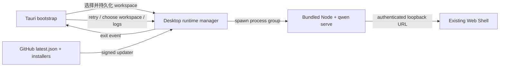

# Дизайн выпуска Desktop Web Shell

## Проблема

Текущий desktop PoC доказал, что Tauri может переиспользовать Web Shell,
предоставляемый демоном, без поддержки второго набора UI. Но PoC по-прежнему
не хватает пользовательских потоков, восстановления после сбоев, подписанных
обновлений, границ безопасности и установочных артефактов для трех платформ,
необходимых для публичного выпуска.

Этот дизайн дорабатывает `packages/desktop-shell` до тонкой desktop-оболочки:
оболочка отвечает только за жизненный цикл и платформенную интеграцию, а
продуктовые функции продолжают предоставляться `qwen serve` и
`@qwen-code/web-shell`.

## Цели

- macOS, Windows и Linux используют один и тот же UI Web Shell.
- Первый запуск позволяет пользователю выбрать рабочее пространство;
  последующие запуски восстанавливают последнее рабочее пространство.
- При сбое запуска демона или его выходе во время работы предоставляется
  пригодный для действий интерфейс восстановления вместо тихого выхода.
- Desktop-оболочка загружает только локальную bootstrap-страницу и демон на
  случайном порту машины; внешние URL всегда передаются системному браузеру.
- Артефакты выпуска несут версию, происхождение, лицензию, контрольные суммы
  и метаданные подписанных обновлений.
- Публичный release на macOS проходит подпись и нотаризацию, на Windows —
  подпись Authenticode; Linux генерирует AppImage и deb.

## Не цели

- Не добавляет desktop-специфичный чат-UI, модель сессий или API демона.
- Не копирует Web Shell в desktop-пакет для поддержки.
- Не реализует множественные окна, одновременную работу нескольких рабочих
  пространств или фоновую резидентность.
- Не обещает дистрибуцию через Store; первый публичный выпуск использует
  GitHub Releases.
- Не встраивает Git, shell или другие системные инструменты. Недостающие
  инструменты по-прежнему сообщаются существующими возможностями Web Shell.

## Архитектура



### Ответственности компонентов

| Компонент        | Ответственность                                                       |
| ---------------- | --------------------------------------------------------------------- |
| bootstrap-страница | состояние запуска, выбор рабочего пространства, восстановление после сбоя, вход в версию и логи |
| Rust desktop-состояние | персистентность настроек, состояние окна, жизненный цикл runtime, единственный экземпляр, состояние обновлений |
| bundled runtime  | Node.js текущей платформы, бандл Qwen Code, статические ресурсы Web Shell |
| CI выпуска       | сборка на трех платформах, подпись, нотаризация, smoke, контрольные суммы, latest.json, GitHub Release |

## Машина состояний запуска

| Состояние         | Что видит пользователь                 | Доступные действия                    |
| ----------------- | -------------------------------------- | ------------------------------------- |
| `starting`        | Брендовая стартовая страница Qwen Code и текущее рабочее пространство | ожидание |
| `needs_workspace` | Выбор рабочего пространства при первом запуске | выбор директории            |
| `ready`           | Web Shell, обслуживаемый демоном        | обычное использование                 |
| `failed`          | Краткое резюме ошибки                   | повтор, выбор другой директории, открытие логов |
| `stopped`         | Уведомление о неожиданном выходе демона | перезапуск демона, выбор директории, открытие логов |

Приложение сначала создает bootstrap-окно, затем асинхронно запускает демон.
После прохождения глубокой проверки здоровья демона (`/health?deep=true`) то
же окно навигируется на `http://127.0.0.1:<port>/#token=<token>`. Токен
существует только во фрагменте URL и никогда не отправляется серверу с
запросами, поэтому не нужен handshake через cookie, и он не попадает в
access log или Referer. Так и медленный запуск, и пути сбоев имеют видимый UI.

Должна использоваться глубокая проверка здоровья: fast path serve отвечает на
поверхностный `/health` bootstrap-приложением до того, как настоящий runtime
(включая Web Shell) смонтирован. В этот момент `/health?deep=true` все еще
возвращает `503 {"reason": "bootstrap"}`, поэтому только его 200 означает,
что Web Shell доступен; если определять готовность по поверхностной проверке,
навигация врежется в окно отложенного runtime.

## Выбор и персистентность рабочего пространства

Файл настроек хранится в `desktop-state.json` под `app_config_dir` Tauri:

```json
{
  "workspace": "/absolute/path",
  "window": {
    "width": 1280,
    "height": 820,
    "x": 120,
    "y": 80,
    "maximized": false
  }
}
```

Приоритет запуска:

1. `QWEN_DESKTOP_WORKSPACE` — для разработки и автоматических тестов.
2. Последнее рабочее пространство из файла настроек.
3. При первом запуске показывается выбор директории.

Демону передается только абсолютный канонический путь, который существует и
является директорией. При выборе нового рабочего пространства сначала
останавливается текущая группа процессов, затем выполняется перезапуск с
новой директорией.

## Жизненный цикл runtime и восстановление

- При каждом запуске генерируется 256-битный bearer-токен, передается демону
  через окружение дочернего процесса (`QWEN_SERVER_TOKEN`) и фронтенду
  Web Shell через фрагмент URL (`/#token=<token>`); фронтенд читает его,
  очищает из URL и вызывает API с заголовком `Authorization: Bearer`. Фрагмент
  не отправляется серверу, поэтому cookie не нужны.
- Демон привязывается к `127.0.0.1` на случайном порту и включает
  `--require-auth`.
- stdout и stderr одновременно пишутся в роллируемый лог, и для UI сохраняется
  ограниченное резюме запуска.
- Rust наблюдает за выходом процесса демона; остановка не по выходу приложения
  вызывает событие `runtime-stopped` и возврат на страницу сбоя bootstrap.
- Повтор всегда создает новый токен и демон, вышедший процесс не
  переиспользуется.
- При выходе приложения завершается вся группа дочерних процессов, чтобы не
  оставалось осиротевших демонов.

## Окна и единственный экземпляр

- Минимальный размер главного окна 900 × 600, по умолчанию 1280 × 820.
- Закрытие, перемещение, изменение размера и максимизация персистентны; при
  восстановлении невидимые позиции за пределами экрана откатываются в центр.
- Плагин единственного экземпляра должен регистрироваться первым. Второй
  запуск только фокусирует и восстанавливает главное окно, демон повторно не
  запускается.

## Границы безопасности

- CSP bootstrap: `default-src 'self'; script-src 'self'; style-src 'self' 'unsafe-inline'; img-src 'self' data:; connect-src ipc: http://ipc.localhost; object-src 'none'; base-uri 'none'; form-action 'none'; frame-ancestors 'none'`.
- Web Shell по-прежнему генерирует собственный CSP демоном; desktop-оболочка
  не ослабляет политику страниц демона.
- Главное окно разрешает только пользовательский протокол bootstrap и
  same-origin навигацию на выбранный демон.
- Внешние ссылки `http`, `https`, `mailto` передаются системному браузеру;
  `file`, `javascript` и пользовательские протоколы отклоняются.
- Скачивание blob разрешено только из основного Web Shell, а нативный колбэк
  скачивания выбирает безопасный целевой путь.
- Tauri не предоставляет JavaScript API файловой системы, shell или процессов;
  bootstrap использует только явные `invoke`-команды.
- Манифест Windows использует `asInvoker`, Common Controls v6 и осведомленность
  о длинных путях.
- На macOS включен hardened runtime, entitlements содержат только возможности,
  необходимые для JIT WebView и сетевого client/server.

## Метаданные сборки и комплаенс

`prepare-runtime.js` генерирует:

- `manifest.json`: версия desktop, версия Qwen Code, коммит Qwen Code, версия
  Node, target, время сборки.
- `checksums.json`: SHA-256 всех файлов bundled runtime.
- корневой `LICENSE` и desktop `NOTICE`.
- `LICENSE` Node.js.

Smoke перед упаковкой валидирует манифест, критические файлы и контрольные
суммы. GitHub Release одновременно публикует `SHA256SUMS.txt` для каждого
установочного артефакта.

## Модель обновлений

Апдейтер Tauri использует подписанные артефакты обновлений и фиксированный
публичный ключ. Приложение после запуска один раз проверяет обновления в фоне:

- Нет обновлений: пользователя не беспокоят.
- Проверка не удалась: пишется лог, запуск не блокируется.
- Есть обновление: над bootstrap/Web Shell показывается нативный диалог
  подтверждения; после подтверждения пользователя выполняется скачивание и
  установка, затем перезапуск.

CI выпуска использует `TAURI_SIGNING_PRIVATE_KEY` и
`TAURI_SIGNING_PRIVATE_KEY_PASSWORD` для генерации подписей апдейтера.
`latest.json` указывает на пакеты обновлений платформ того же GitHub Release.
Только не-draft, не-prerelease выпуски обновляют фиксированный feed release
`desktop-latest`.

## Матрица выпуска по платформам

| Платформа | Архитектуры | Установочные пакеты                     | Требования подписи                        |
| --------- | ----------- | --------------------------------------- | ----------------------------------------- |
| macOS     | arm64, x64  | `.dmg`, `.app.tar.gz` апдейтер          | Developer ID Application + нотаризация     |
| Windows   | x64         | NSIS `.exe` апдейтер/инсталлятор        | Authenticode SHA-256 + timestamp           |
| Linux     | x64         | `.AppImage` апдейтер/инсталлятор, `.deb` | minisign апдейтера; без OS code-signing  |

Windows WebView2 использует download bootstrapper; при офлайн-системе и
отсутствии WebView2 сбой установки явно сообщает о зависимости. CI Linux
устанавливает зависимости Tauri WebKit/GTK, AppImage и deb сборки.

## Процесс выпуска

1. Ввод версии desktop и ref Qwen Code для vendor.
2. Проверка, что ref прослеживается до коммита, разрешенного к выпуску.
3. Синхронизация версий desktop-shell пакета, Cargo и Tauri. Версии
   устанавливаются только мгновенно CI при каждой сборке и не коммитятся
   обратно в репозиторий; ветка `main` намеренно держит разработочную
   версию-заполнитель (`0.0.1`), выпущенные версии определяются по git-тегам.
4. На каждой платформе подготовка runtime, прогон smoke контрольных
   сумм/runtime и Rust-тестов.
5. Сборка установочных пакетов и артефактов апдейтера.
6. Раннер платформы устанавливает и запускает упакованное приложение, ожидая
   доказательств готовности демона/Web Shell.
7. Загрузка артефактов; job выпуска генерирует `latest.json` и
   `SHA256SUMS.txt`.
8. Не-draft stable release обновляет feed `desktop-latest`.

При отсутствующих ключах подписи допускается только `dry_run=true`; публичный
выпуск должен завершаться fail closed.

## Критерии верификации

- Первый запуск позволяет выбрать директорию и войти в Web Shell.
- Перезапуск восстанавливает рабочее пространство и позицию окна.
- Невалидное рабочее пространство, отсутствующий runtime, преждевременный
  выход демона — все показывают страницу восстановления.
- После завершения демона во время работы пользователь может перезапустить его
  в том же окне.
- Внешние ссылки уходят в системный браузер, главное окно не покидает origin
  демона.
- Smoke упакованных приложений на трех платформах наблюдает `/health`,
  неаутентифицированная навигация на корень Web Shell возвращает 200 (и не
  устанавливает никаких cookie), `/capabilities` без токена возвращает 401.
- Подпись манифеста апдейтера валидируется клиентом, откат версии
  отклоняется.
