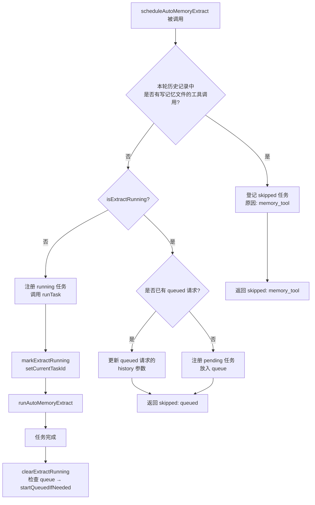
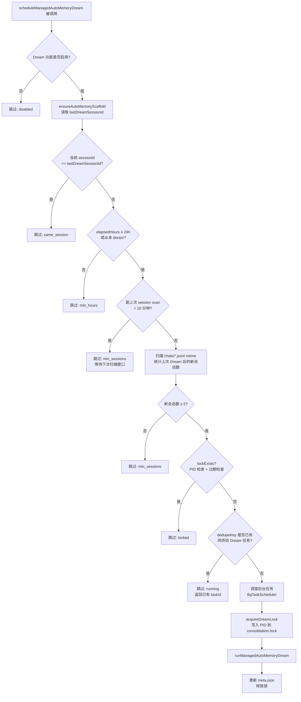
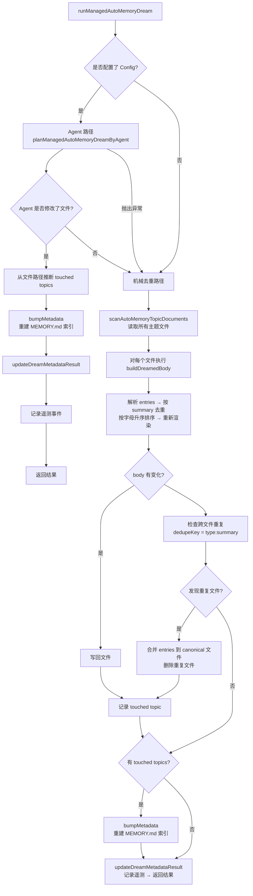
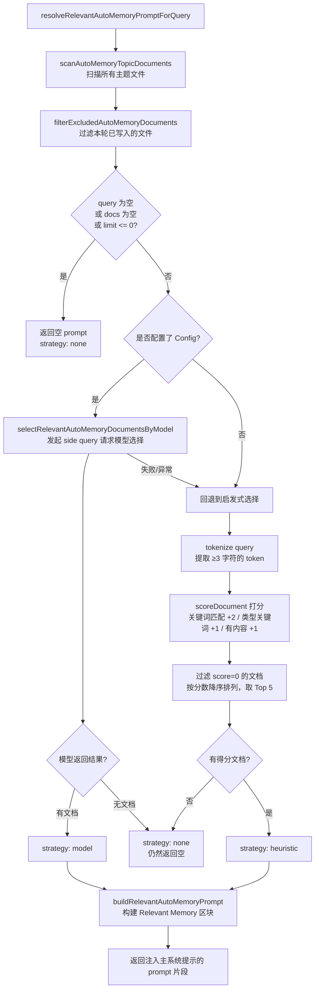
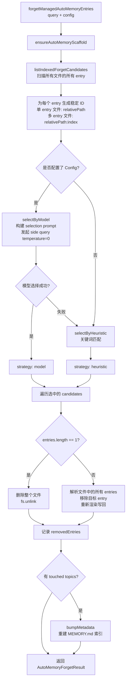

# Memory: система управления памятью

> В этом документе описывается механизм управления памятью **Managed Auto-Memory** (управляемая автоматическая память) в Qwen Code, условия её активации и детали реализации.

---

## 目录

1. [Обзор](#概述)
2. [Структура хранения](#存储结构)
3. [Типы памяти](#记忆类型)
4. [Формат записи памяти](#记忆条目格式)
5. [Основной жизненный цикл](#核心生命周期)
6. [Extract — извлечение](#extract--提取)
7. [Dream — консолидация](#dream--整合)
8. [Recall — поиск](#recall--召回)
9. [Forget — удаление](#forget--遗忘)
10. [Перестроение индекса](#索引重建)
11. [Телеметрия](#遥测埋点)

---

## 概述

Managed Auto-Memory — это система постоянной памяти, которая **автоматически** накапливает, консолидирует и извлекает знания о пользователе в процессе AI-сессий. Жизненный цикл памяти поддерживается с помощью четырёх основных операций:

| Операция | Англ. название | Условие активации | Назначение |
| ---- | ------- | -------------------------- | -------------------------------------- |
| Извлечение | Extract | Автоматически (после каждого раунда диалога) | Выделение новых знаний из истории диалога и запись в файлы памяти |
| Консолидация | Dream | Автоматически (периодическая фоновая задача) | Дедупликация и объединение файлов памяти для поддержания порядка |
| Поиск | Recall | Автоматически (перед каждым раундом диалога) | Поиск релевантной памяти и инъекция в системный промпт |
| Удаление | Forget | Вручную (команда пользователя `/forget`) | Точное удаление указанных записей памяти |

---

## 存储结构

### 目录布局

```
~/.qwen/                                      ← 全局基础目录（默认）
└── projects/
    └── <sanitized-git-root>/                 ← 项目标识（基于 Git 根路径）
        ├── meta.json                         ← 元数据（提取/整合时间戳、状态）
        ├── extract-cursor.json               ← 提取游标（已处理的对话偏移量）
        ├── consolidation.lock                ← Dream 进程互斥锁
        └── memory/                           ← 记忆主目录
            ├── MEMORY.md                     ← 索引文件（自动生成，汇总所有条目）
            ├── user.md                       ← 用户偏好记忆（示例）
            ├── feedback.md                   ← 反馈规范记忆（示例）
            ├── project/
            │   └── milestone.md              ← 项目记忆（支持子目录）
            └── reference/
                └── grafana.md                ← 外部资源记忆
```

> **Переопределение через переменные окружения**:
>
> - `QWEN_CODE_MEMORY_BASE_DIR`: заменяет глобальный базовый каталог
> - `QWEN_CODE_MEMORY_LOCAL=1`: использует путь внутри проекта `.qwen/memory/`

### 关键文件说明

| Файл | Описание |
| --------------------- | ---------------------------------------------------------------------- |
| `meta.json` | Фиксирует время последнего Extract / Dream, ID сессии, затронутые типы памяти и статус выполнения |
| `extract-cursor.json` | Хранит смещение (offset) в истории диалога, до которого обработана текущая сессия, чтобы избежать повторного извлечения |
| `consolidation.lock` | Файловая блокировка во время работы Dream. Содержит PID процесса-владельца. Автоматически истекает через 1 час |
| `MEMORY.md` | Индекс всех тематических файлов. Перестраивается после каждого Extract/Dream в формате Markdown-списка |

---

## 记忆类型

Система поддерживает четыре встроенных типа памяти, каждый из которых соответствует своему измерению информации:

| Тип | Хранимые данные | Условие записи | Условие чтения |
| ----------- | ----------------------------------------------------- | ---------------------------------------- | ---------------------------- |
| `user` | Роль пользователя, навыки, рабочие привычки | При выявлении роли/предпочтений/бэкграунда пользователя | Когда ответ требует кастомизации под бэкграунд пользователя |
| `feedback` | Инструкции пользователя по поведению AI: чего избегать, что продолжать | При коррекции AI пользователем или подтверждении неочевидного подхода | Когда влияет на стиль поведения AI |
| `project` | Прогресс проекта, цели, решения, дедлайны, отслеживание багов | При получении информации о том, кто что делает, зачем и к какому сроку | Когда помогает AI понять контекст работы и мотивацию |
| `reference` | Указатели на внешние ресурсы (дашборды, тикет-системы, Slack-каналы и т.д.) | При обнаружении внешнего ресурса и его назначения | Когда пользователь упоминает внешнюю систему или связанную информацию |

**Что не следует сохранять в памяти**: паттерны/соглашения кода, история Git, схемы отладки, временные статусы задач, информация, уже задокументированная в `QWEN.md`/`AGENTS.md`.

---

## 记忆条目格式

Каждый тематический файл использует формат **YAML frontmatter + Markdown body**:

```markdown
---
name: Название памяти
description: Краткое описание в одно предложение (используется для оценки релевантности при поиске, должно быть конкретным)
type: user|feedback|project|reference
---

Основное содержание памяти (строка summary)

Why: Причина (позволяет AI понимать граничные случаи, а не слепо следовать правилам)
How to apply: Сценарии применения и способ использования
```

Для типов `feedback` и `project` настоятельно рекомендуется заполнять поля `Why` и `How to apply`, чтобы память корректно применялась в граничных случаях.

---

## 核心生命周期


---

## Extract — 提取

### 触发时机

Автоматически вызывается функцией `scheduleAutoMemoryExtract` после каждого ответа AI (фоновый неблокирующий процесс).

### 调度逻辑（`extractScheduler.ts`）



**Причины пропуска**:

| Причина | Значение |
| ----------------- | ----------------------------------------------- |
| `memory_tool` | Основной агент в этом раунде уже записал файлы памяти напрямую. Пропуск для избежания конфликтов |
| `already_running` | Извлечение уже выполняется, задача не может быть добавлена в очередь |
| `queued` | Извлечение уже запущено, текущий запрос добавлен в очередь |

### 核心提取流程（`extract.ts`）

```mermaid
flowchart TD
    A[runAutoMemoryExtract] --> B[ensureAutoMemoryScaffold\n初始化目录和文件]
    B --> C[buildTranscriptMessages\n将 Content[] 转换为带 offset 的消息列表]
    C --> D[readExtractCursor\n读取上次处理到的位置]
    D --> E[loadUnprocessedTranscriptSlice\n截取未处理的消息段]
    E --> F{slice 为空?}
    F -- 是 --> G[返回无 patches 结果]
    F -- 否 --> H[runAutoMemoryExtractionByAgent\n调用 forked agent 提取 patches]
    H --> I[dedupeExtractPatches\n去重+规范化]
    I --> J{有 touched topics?}
    J -- 是 --> K[bumpMetadata\n更新 meta.json]
    K --> L[rebuildManagedAutoMemoryIndex\n重建 MEMORY.md]
    L --> M[writeExtractCursor\n记录最新 offset]
    J -- 否 --> M
    M --> N[返回 AutoMemoryExtractResult]
```

**Курсор извлечения (Cursor)**:

- Поля: `{ sessionId, processedOffset, updatedAt }`
- После каждого извлечения `processedOffset` обновляется до текущей длины истории
- При следующем извлечении обрабатываются только сообщения с `offset >= processedOffset`
- При смене сессии (изменение `sessionId`) процесс начинается со смещения 0

**Правила фильтрации патчей**:

- Длина summary < 12 символов → отбрасывается
- Summary заканчивается на `?` → отбрасывается (вопросительное предложение)
- Содержит временные ключевые слова (today/now/currently/temporary и т.д.) → отбрасывается
- Одинаковая комбинация `topic:summary` → дедупликация

---

## Dream — 整合

### 触发时机

Автоматически вызывается функцией `scheduleManagedAutoMemoryDream` после каждого ответа AI (фоновый неблокирующий процесс). Защищён несколькими условиями-гейтами, поэтому в большинстве случаев пропускается.

### 调度门控（`dreamScheduler.ts`）



**Параметры гейтов**:

| Параметр | Значение по умолчанию | Описание |
| -------------------------- | -------- | ----------------------------- |
| `minHoursBetweenDreams` | 24 часа | Минимальный интервал между двумя запусками Dream |
| `minSessionsBetweenDreams` | 5 сессий | Минимальное количество новых сессий для активации Dream |
| `SESSION_SCAN_INTERVAL_MS` | 10 минут | Интервал троттлинга при сканировании файлов сессий |
| `DREAM_LOCK_STALE_MS` | 1 час | Порог времени, после которого lock-файл считается истёкшим |

**Механизм блокировки**:

- Lock-файл находится в `<project-state-dir>/consolidation.lock`
- Содержит PID процесса-владельца
- При проверке: если процесс с PID больше не существует (ошибка `kill(pid, 0)`) или lock старше 1 часа → считается истёкшим и автоматически удаляется

### 整合执行流程（`dream.ts`）



**Логика механической дедупликации**:

1. Внутри каждого тематического файла: дедупликация по `summary.toLowerCase()`, объединение полей `why`/`howToApply`
2. Повторная сортировка по алфавиту на основе summary
3. Между файлами: записи с одинаковым `type:summary` объединяются в первый найденный файл, дубликаты удаляются

---

## Recall — 召回

### 触发时机

Автоматически вызывается функцией `resolveRelevantAutoMemoryPromptForQuery` перед обработкой каждого запроса пользователя AI. Внедряет релевантную память в системный промпт.

### 召回流程（`recall.ts`）



**Правила скоринга (эвристические)**:

| Условие | Баллы |
| -------------------------------- | ---------------- |
| Токен запроса найден в содержимом документа | +2 (за каждый токен) |
| Токен запроса является характерным ключевым словом для данного типа | +1 (за каждый токен) |
| Body документа не пуст | +1 |

**Характерные ключевые слова для каждого типа**:

- `user`: user, preference, background, role, terse
- `feedback`: feedback, rule, avoid, style, summary
- `project`: project, goal, incident, deadline, release
- `reference`: reference, dashboard, ticket, docs, link

**Правила сборки промпта**:

- Внедряется не более 5 документов (`MAX_RELEVANT_DOCS`)
- Body каждого документа обрезается до 1200 символов (`MAX_DOC_BODY_CHARS`)
- При превышении лимита добавляется предупреждение: "NOTE: Relevant memory truncated for prompt budget."
- Включает информацию о свежести документа (на основе mtime файла)

---

## Forget — 遗忘

### 触发时机

Активируется вручную пользователем через команду `/forget <query>`.

### 遗忘流程（`forget.ts`）



**Дизайн Entry ID**:

- Файлы с одной записью (частый случай): `relativePath` (например, `feedback/no-summary.md`)
- Файлы с несколькими записями: `relativePath:index` (например, `feedback/style.md:2`)
- Использование стабильных ID позволяет модели точно указывать на запись, не затрагивая другие записи в том же файле

---

## 索引重建

Файл `MEMORY.md` служит навигационным индексом для всех тематических файлов. Перестраивается функцией `rebuildManagedAutoMemoryIndex` после каждого Extract или Dream:

```
- [用户偏好](user/preferences.md) — 用户是资深 Go 工程师，第一次接触 React
- [反馈规范](feedback/style.md) — 保持回复简洁，不要尾部总结
- [项目里程碑](project/milestone.md) — 移动端发布切分支前的合并冻结窗口
```

**Ограничения индекса**:

- Не более 150 символов на строку (при превышении обрезается с помощью `…`)
- Не более 200 строк
- Общий размер не превышает 25 000 байт

---

## 遥测埋点

В систему встроены три типа телеметрических событий для мониторинга производительности и эффективности операций с памятью:

### Extract 遥测

| Поле | Тип | Описание |
| ---------------- | --------------------------- | ----------------------- |
| `trigger` | `'auto'` | Способ активации (на данный момент только автоматический) |
| `status` | `'completed'` \| `'failed'` | Результат выполнения |
| `patches_count` | number | Количество извлечённых валидных патчей |
| `touched_topics` | string[] | Список затронутых типов памяти |
| `duration_ms` | number | Общее время выполнения (мс) |

### Dream 遥测

| Поле | Тип | Описание |
| ----------------- | ------------------------------------- | ---------------------- |
| `trigger` | `'auto'` | Способ активации |
| `status` | `'updated'` \| `'noop'` \| `'failed'` | Результат выполнения |
| `deduped_entries` | number | Количество записей, обработанных механической дедупликацией |
| `touched_topics` | string[] | Список изменённых типов памяти |
| `duration_ms` | number | Общее время выполнения (мс) |

### Recall 遥测

| Поле | Тип | Описание |
| --------------- | -------------------------------------- | ---------------- |
| `query_length` | number | Длина строки запроса |
| `docs_scanned` | number | Общее количество просканированных документов |
| `docs_selected` | number | Количество документов, внедрённых в итоге |
| `strategy` | `'none'` \| `'heuristic'` \| `'model'` | Стратегия выбора |
| `duration_ms` | number | Общее время выполнения (мс) |

---

## 相关源文件索引

| Файл | Назначение |
| ---------------------------------------------------- | ----------------------------------------------------------------------------- |
| `packages/core/src/memory/types.ts` | Определение типов: `AutoMemoryType`, `AutoMemoryMetadata`, `AutoMemoryExtractCursor` |
| `packages/core/src/memory/paths.ts` | Вычисление путей: `getAutoMemoryRoot`, `isAutoMemPath`, хелперы для путей к файлам |
| `packages/core/src/memory/store.ts` | Инициализация структуры: `ensureAutoMemoryScaffold`, чтение/запись индекса и метаданных |
| `packages/core/src/memory/scan.ts` | Сканирование тематических файлов: `scanAutoMemoryTopicDocuments`, парсинг frontmatter |
| `packages/core/src/memory/entries.ts` | Парсинг и рендеринг записей: `parseAutoMemoryEntries`, `renderAutoMemoryBody` |
| `packages/core/src/memory/extract.ts` | Основная логика извлечения: `runAutoMemoryExtract`, управление курсором, дедупликация патчей |
| `packages/core/src/memory/extractScheduler.ts` | Планировщик извлечения: `ManagedAutoMemoryExtractRuntime`, очередь/машина состояний выполнения |
| `packages/core/src/memory/extractionAgentPlanner.ts` | Агент извлечения: `runAutoMemoryExtractionByAgent` |
| `packages/core/src/memory/dream.ts` | Основная логика консолидации: `runManagedAutoMemoryDream`, путь через агент + механическая дедупликация |
| `packages/core/src/memory/dreamScheduler.ts` | Планировщик консолидации: `ManagedAutoMemoryDreamRuntime`, проверка гейтов, управление блокировками |
| `packages/core/src/memory/dreamAgentPlanner.ts` | Агент консолидации: `planManagedAutoMemoryDreamByAgent` |
| `packages/core/src/memory/recall.ts` | Логика поиска: `resolveRelevantAutoMemoryPromptForQuery`, двойной путь (эвристика + модель) |
| `packages/core/src/memory/forget.ts` | Логика удаления: `forgetManagedAutoMemoryEntries`, генерация кандидатов + точное удаление |
| `packages/core/src/memory/indexer.ts` | Перестроение индекса: `rebuildManagedAutoMemoryIndex`, `buildManagedAutoMemoryIndex` |
| `packages/core/src/memory/prompt.ts` | Шаблоны системных промптов: описание типов памяти, примеры формата, правила использования |
| `packages/core/src/memory/governance.ts` | Типы рекомендаций по управлению: `AutoMemoryGovernanceSuggestionType` |
| `packages/core/src/memory/state.ts` | Состояние выполнения извлечения: `isExtractRunning`, `markExtractRunning`, `clearExtractRunning` |
| `packages/core/src/memory/memoryAge.ts` | Описание свежести: `memoryAge`, `memoryFreshnessText` |