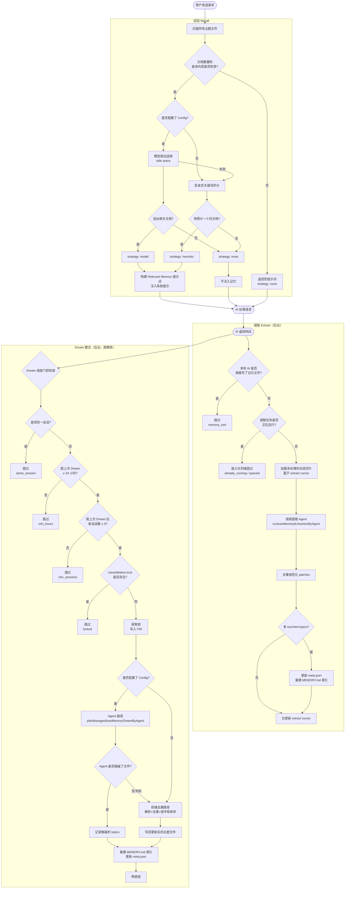
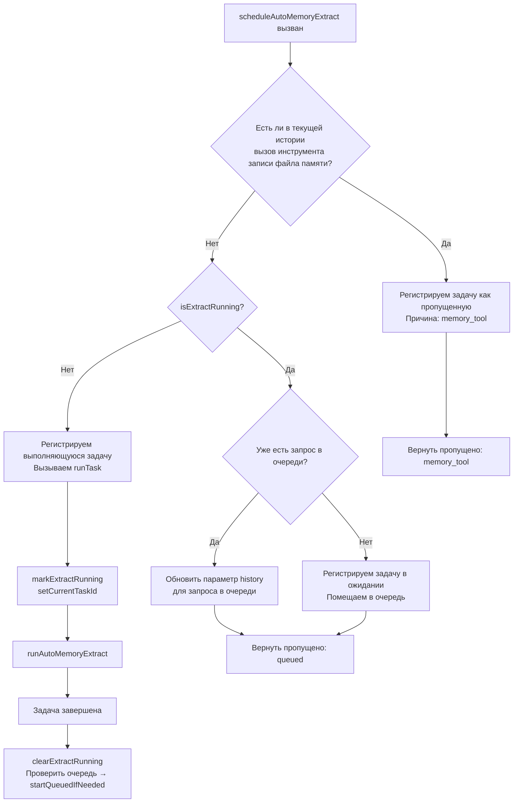
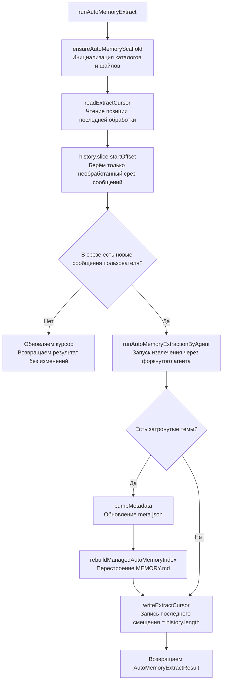
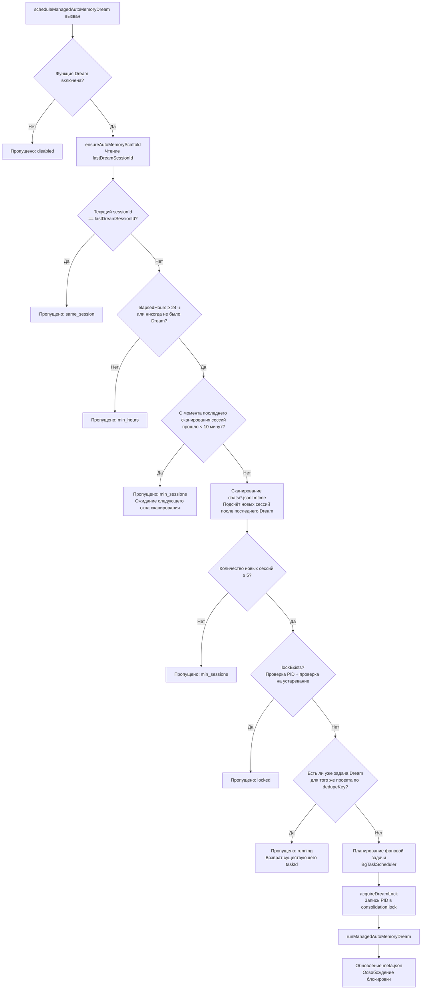
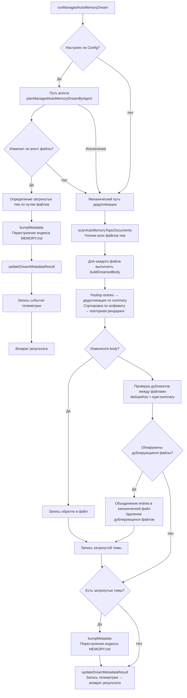
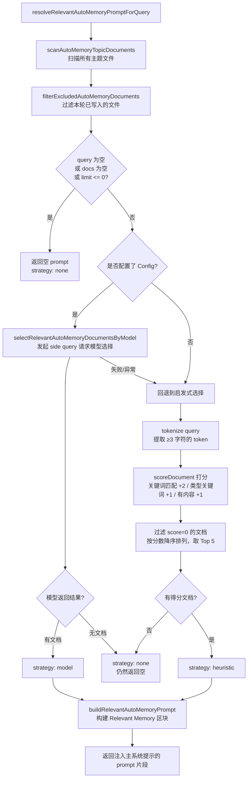
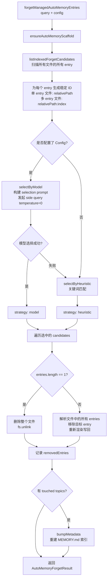

# Memory 记忆管理系统

> 本文介绍 Qwen Code 中 **Managed Auto-Memory**（托管自动记忆）的记忆管理机制、触发时机和实现细节。

---

## 目录

1. [概述](#概述)
2. [存储结构](#存储结构)
3. [记忆类型](#记忆类型)
4. [记忆条目格式](#记忆条目格式)
5. [核心生命周期](#核心生命周期)
6. [Extract — 提取](#extract--提取)
7. [Dream — 整合](#dream--整合)
8. [Recall — 召回](#recall--召回)
9. [Forget — 遗忘](#forget--遗忘)
10. [索引重建](#索引重建)
11. [遥测埋点](#遥测埋点)

---

## 概述

Managed Auto-Memory 是一套在 AI 会话过程中**自动**积累、整合和检索用户相关知识的持久化记忆系统。它通过四个核心操作维护记忆的生命周期：

| 操作 | 英文    | 触发方式                   | 作用                                   |
| ---- | ------- | -------------------------- | -------------------------------------- |
| 提取 | Extract | 自动（每轮对话后）         | 从对话记录中提炼新知识写入记忆文件     |
| 整合 | Dream   | 自动（周期性后台任务）     | 对记忆文件去重、合并，保持整洁         |
| 召回 | Recall  | 自动（每轮对话前）         | 检索与当前请求相关的记忆注入到系统提示 |
| 遗忘 | Forget  | 手动（用户命令 `/forget`） | 精确删除指定的记忆条目                 |

---

## 存储结构

### 目录布局

```
~/.qwen/                                      ← 全局基础目录（默认）
└── projects/
    └── <sanitized-git-root>/                 ← 项目标识（基于 Git 根路径）
        ├── meta.json                         ← 元数据（提取/整合时间戳、状态）
        ├── extract-cursor.json               ← 提取游标（已处理的对话偏移量）
        ├── consolidation.lock                ← Dream 进程互斥锁
        └── memory/                           ← 记忆主目录
            ├── MEMORY.md                     ← 索引文件（自动生成，汇总所有条目）
            ├── user.md                       ← 用户偏好记忆（示例）
            ├── feedback.md                   ← 反馈规范记忆（示例）
            ├── project/
            │   └── milestone.md              ← 项目记忆（支持子目录）
            └── reference/
                └── grafana.md                ← 外部资源记忆
```

> **环境变量覆盖**：
>
> - `QWEN_CODE_MEMORY_BASE_DIR`：替换全局基础目录
> - `QWEN_CODE_MEMORY_LOCAL=1`：改用项目内路径 `.qwen/memory/`

### 关键文件说明

| 文件                  | 说明                                                                   |
| --------------------- | ---------------------------------------------------------------------- |
| `meta.json`           | 记录最后一次 Extract / Dream 的时间、会话 ID、涉及的记忆类型、执行状态 |
| `extract-cursor.json` | 记录当前会话已处理到对话历史的哪个偏移量，避免重复提取                 |
| `consolidation.lock`  | Dream 运行时的文件锁，内容为持有者 PID，超过 1 小时自动失效            |
| `MEMORY.md`           | 所有主题文件的索引，每次 Extract/Dream 后重建，格式为 Markdown 列表    |

---

## 记忆类型

系统支持四种内置记忆类型，每种对应不同的信息维度：

| 类型        | 存储内容                                              | 何时写入                                 | 何时读取                     |
| ----------- | ----------------------------------------------------- | ---------------------------------------- | ---------------------------- |
| `user`      | 用户的角色、技能背景、工作习惯                        | 了解到用户角色/偏好/知识背景时           | 回答需要根据用户背景定制时   |
| `feedback`  | 用户对 AI 行为的指导：避免什么、继续什么              | 用户纠正 AI 或确认某种非显而易见的做法时 | 影响 AI 行为方式时           |
| `project`   | 项目进展、目标、决策、截止日期、Bug 追踪              | 了解到谁在做什么、为什么、截止何时时     | 帮助 AI 理解工作背景和动机时 |
| `reference` | 外部系统资源指针（Dashboard、工单系统、Slack 频道等） | 得知某种外部资源及其用途时               | 用户提及外部系统或相关信息时 |

**不应该存入记忆的内容**：代码模式/约定、Git 历史、调试方案、临时任务状态、已在 QWEN.md/AGENTS.md 中记录的内容。

---

## 记忆条目格式

每个主题文件使用 **YAML frontmatter + Markdown body** 格式：

```markdown
---
name: 记忆名称
description: 一句话描述（用于判断召回相关性，要具体）
type: user|feedback|project|reference
---

记忆主体内容（summary 行）

Why: 背后原因（让 AI 能理解边界情况而不是盲目遵守规则）
How to apply: 适用场景和使用方式
```

对于 `feedback` 和 `project` 类型，强烈建议填写 `Why` 和 `How to apply`，使记忆在边界情况下仍能正确应用。

---

## 核心生命周期


---

## Extract — Извлечение

### Момент срабатывания

Автоматически запускается с помощью `scheduleAutoMemoryExtract` после каждого завершения ответа AI (фоновый неблокирующий).

### Логика планирования (`extractScheduler.ts`)



**Пояснения причин пропуска**:

| Причина | Значение |
| ----------------- | ----------------------------------------------- |
| `memory_tool` | Основной агент в текущем раунде напрямую записал файл памяти, пропускаем, чтобы избежать конфликта |
| `already_running` | Извлечение уже выполняется, постановка в очередь невозможна |
| `queued` | Извлечение уже выполняется, текущий запрос поставлен в очередь |

### Основной процесс извлечения (`extract.ts`)



> **Примечание:** Вентиль `isUnderMemoryPressure` находится в `MemoryManager.runExtract()`, а не в этом процессе. Когда монитор сообщает о жёстком/критическом давлении, `MemoryManager` пропускает вызов извлечения, не продвигая курсор.

**Курсор извлечения (Cursor)**:

- Поля: `{ sessionId, processedOffset, updatedAt }`
- Перед извлечением читаем текущий прогресс через `readExtractCursor`, затем обрабатываем только непрочитанную часть через `history.slice(processedOffset)`
- После каждого извлечения обновляем `processedOffset` до текущей длины истории (`params.history.length`)
- При смене сессии (`sessionId` изменился) начинаем с нулевого смещения
- Важно: больше не используем `buildTranscriptMessages` / `loadUnprocessedTranscriptSlice` для построения транскрипта – проверка `hasNewUserMessages` выполняется через `history.slice(startOffset).some(m => m.role === 'user' && partToString(m.parts).trim().length > 0)`, лёгкая строкификация только на непрочитанном срезе, полная история больше не обрабатывается

**Правила фильтрации патчей**:

- Длина суммаризации < 12 символов → отбрасывается
- Суммаризация заканчивается на `?` → отбрасывается (вопросительное предложение)
- Содержит временные ключевые слова (today/now/currently/temporary и т.д.) → отбрасывается
- Комбинация `topic:summary` дублируется → дедупликация

---

## Dream — Консолидация

### Момент срабатывания

Автоматически запускается с помощью `scheduleManagedAutoMemoryDream` после каждого завершения ответа AI (фоновый неблокирующий). Но защищён несколькими вентилями, поэтому в большинстве случаев пропускается.

### Вентили планирования (`dreamScheduler.ts`)



**Параметры вентилей**:

| Параметр | Значение по умолчанию | Описание |
| -------------------------- | -------- | ----------------------------- |
| `minHoursBetweenDreams` | 24 часа | Минимальный интервал между двумя Dream |
| `minSessionsBetweenDreams` | 5 сессий | Минимальное количество новых сессий, необходимое для запуска Dream |
| `SESSION_SCAN_INTERVAL_MS` | 10 минут | Интервал срабатывания для сканирования файлов сессий |
| `DREAM_LOCK_STALE_MS` | 1 час | Время, после которого файл блокировки считается устаревшим |

**Механизм блокировки**:

- Файл блокировки находится в `<project-state-dir>/consolidation.lock`
- Содержит PID процесса, владеющего блокировкой
- При проверке: если процесс с PID не существует (ошибка `kill(pid, 0)`) или блокировка старше 1 часа → считается устаревшей, автоматически удаляется

### Процесс выполнения консолидации (`dream.ts`)



**Логика механической дедупликации**:

1. Внутри каждого файла темы: дедупликация по `summary.toLowerCase()`, объединение полей `why`/`howToApply`
2. Пересортировка по алфавиту summary
3. Между файлами: записи с одинаковым `type:summary` объединяются в первый обнаруженный файл, дублирующиеся файлы удаляются
---

## Recall — 召回

### 触发时机

在每个 AI 处理用户请求之前，由 `resolveRelevantAutoMemoryPromptForQuery` 自动触发，将相关记忆注入系统提示词。

### 召回流程（`recall.ts`）



**评分规则（启发式）**：

| 条件                             | 加分             |
| -------------------------------- | ---------------- |
| query token 出现在文档内容中     | +2（每个 token） |
| query token 是该类型的特征关键词 | +1（每个 token） |
| 文档 body 非空                   | +1               |

**每种类型的特征关键词**：

- `user`：user, preference, background, role, terse
- `feedback`：feedback, rule, avoid, style, summary
- `project`：project, goal, incident, deadline, release
- `reference`：reference, dashboard, ticket, docs, link

**Prompt 构建规则**：

- 最多注入 5 篇文档（`MAX_RELEVANT_DOCS`）
- 每篇文档 body 截断至 1200 字符（`MAX_DOC_BODY_CHARS`）
- 超出截断时追加提示："NOTE: Relevant memory truncated for prompt budget."
- 包含文档的新鲜度信息（基于文件 mtime）

---

## Forget — 遗忘

### 触发时机

由用户手动执行 `/forget <query>` 命令触发。

### 遗忘流程（`forget.ts`）



**Entry ID 设计**：

- 单条目文件（常见情况）：`relativePath`（如 `feedback/no-summary.md`）
- 多条目文件：`relativePath:index`（如 `feedback/style.md:2`）
- 使用稳定 ID 使模型可以精确定位条目而不影响同文件的其他条目

---

## 索引重建

`MEMORY.md` 是所有主题文件的导航索引，每次 Extract 或 Dream 后调用 `rebuildManagedAutoMemoryIndex` 重建：

```
- [用户偏好](user/preferences.md) — 用户是资深 Go 工程师，第一次接触 React
- [反馈规范](feedback/style.md) — 保持回复简洁，不要尾部总结
- [项目里程碑](project/milestone.md) — 移动端发布切分支前的合并冻结窗口
```

**索引限制**：

- 每行最多 150 字符（超出用 `…` 截断）
- 最多 200 行
- 总大小不超过 25,000 字节

---

## 遥测埋点

系统内置三类遥测事件，用于监控记忆操作的性能和效果：

### Extract 遥测

| 字段             | 类型                        | 说明                    |
| ---------------- | --------------------------- | ----------------------- |
| `trigger`        | `'auto'`                    | 触发方式（当前仅自动）  |
| `status`         | `'completed'` \| `'failed'` | 执行结果                |
| `patches_count`  | number                      | 提取到的有效 patch 数量 |
| `touched_topics` | string[]                    | 被写入的记忆类型列表    |
| `duration_ms`    | number                      | 总耗时（毫秒）          |

### Dream 遥测

| 字段              | 类型                                  | 说明                   |
| ----------------- | ------------------------------------- | ---------------------- |
| `trigger`         | `'auto'`                              | 触发方式               |
| `status`          | `'updated'` \| `'noop'` \| `'failed'` | 执行结果               |
| `deduped_entries` | number                                | 机械路径去重的条目数量 |
| `touched_topics`  | string[]                              | 被修改的记忆类型列表   |
| `duration_ms`     | number                                | 总耗时（毫秒）         |

### Recall 遥测

| 字段            | 类型                                   | 说明             |
| --------------- | -------------------------------------- | ---------------- |
| `query_length`  | number                                 | 查询字符串长度   |
| `docs_scanned`  | number                                 | 扫描的文档总数   |
| `docs_selected` | number                                 | 最终注入的文档数 |
| `strategy`      | `'none'` \| `'heuristic'` \| `'model'` | 选择策略         |
| `duration_ms`   | number                                 | 总耗时（毫秒）   |

---

## 相关源文件索引

| 文件                                                 | 职责                                                                          |
| ---------------------------------------------------- | ----------------------------------------------------------------------------- |
| `packages/core/src/memory/types.ts`                  | 类型定义：`AutoMemoryType`、`AutoMemoryMetadata`、`AutoMemoryExtractCursor`   |
| `packages/core/src/memory/paths.ts`                  | 路径计算：`getAutoMemoryRoot`、`isAutoMemPath`、各类文件路径 helpers          |
| `packages/core/src/memory/store.ts`                  | 脚手架初始化：`ensureAutoMemoryScaffold`，索引/元数据读写                     |
| `packages/core/src/memory/scan.ts`                   | 扫描主题文件：`scanAutoMemoryTopicDocuments`，解析 frontmatter                |
| `packages/core/src/memory/entries.ts`                | 条目解析和渲染：`parseAutoMemoryEntries`、`renderAutoMemoryBody`              |
| `packages/core/src/memory/extract.ts`                | 提取核心逻辑：`runAutoMemoryExtract`，游标管理，patch 去重                    |
| `packages/core/src/memory/extractScheduler.ts`       | 提取调度器：`ManagedAutoMemoryExtractRuntime`，队列/运行状态机                |
| `packages/core/src/memory/extractionAgentPlanner.ts` | 提取 Agent：`runAutoMemoryExtractionByAgent`                                  |
| `packages/core/src/memory/dream.ts`                  | 整合核心逻辑：`runManagedAutoMemoryDream`，Agent 路径 + 机械去重              |
| `packages/core/src/memory/dreamScheduler.ts`         | 整合调度器：`ManagedAutoMemoryDreamRuntime`，门控检查，锁管理                 |
| `packages/core/src/memory/dreamAgentPlanner.ts`      | 整合 Agent：`planManagedAutoMemoryDreamByAgent`                               |
| `packages/core/src/memory/recall.ts`                 | 召回逻辑：`resolveRelevantAutoMemoryPromptForQuery`，启发式+模型双路径        |
| `packages/core/src/memory/forget.ts`                 | 遗忘逻辑：`forgetManagedAutoMemoryEntries`，候选生成+精确删除                 |
| `packages/core/src/memory/indexer.ts`                | 索引重建：`rebuildManagedAutoMemoryIndex`，`buildManagedAutoMemoryIndex`      |
| `packages/core/src/memory/prompt.ts`                 | 系统提示模板：记忆类型说明、格式示例、使用规范                                |
| `packages/core/src/memory/governance.ts`             | 治理建议类型：`AutoMemoryGovernanceSuggestionType`                            |
| `packages/core/src/memory/state.ts`                  | 提取运行状态：`isExtractRunning`、`markExtractRunning`、`clearExtractRunning` |
| `packages/core/src/memory/memoryAge.ts`              | 新鲜度描述：`memoryAge`、`memoryFreshnessText`                                |
