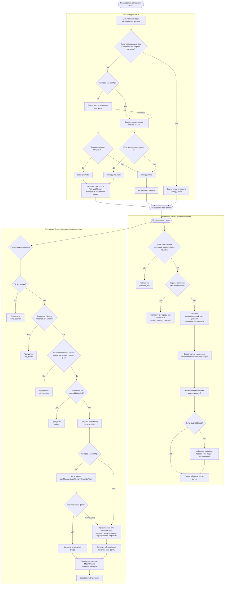
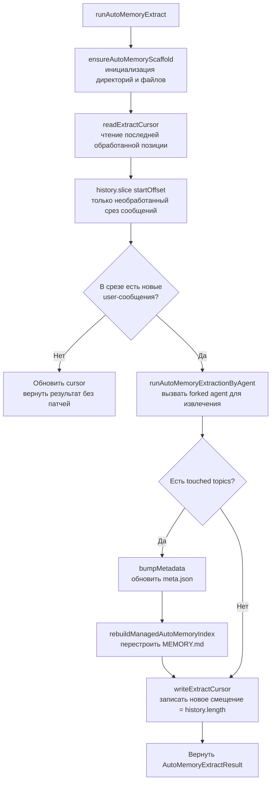
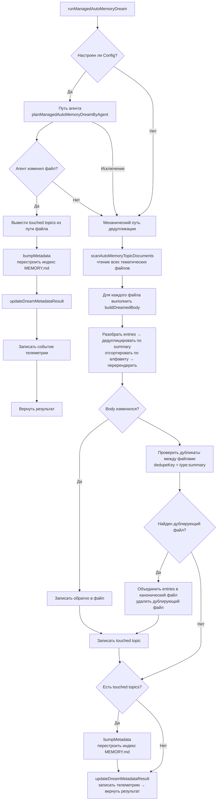
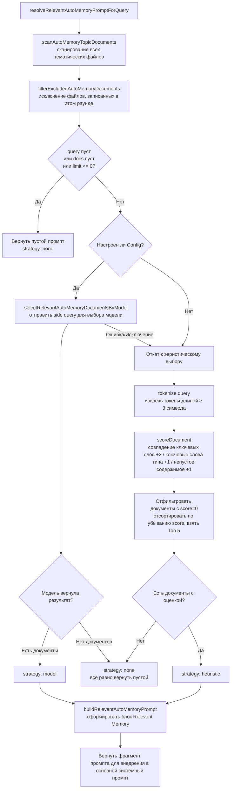
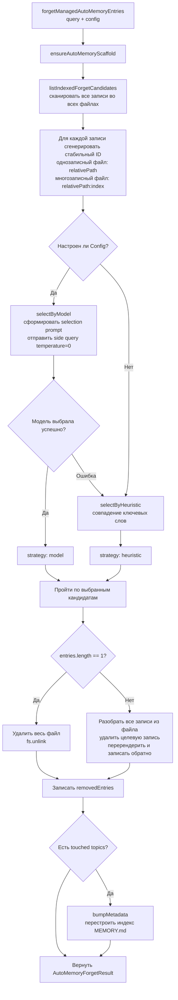

# Память — система управления памятью

> В этом разделе описывается механизм управления памятью **Managed Auto-Memory** (управляемая автоматическая память) в Qwen Code, условия его срабатывания и детали реализации.

---

## Содержание

1. [Обзор](#обзор)
2. [Структура хранения](#структура-хранения)
3. [Типы памяти](#типы-памяти)
4. [Формат записей памяти](#формат-записей-памяти)
5. [Основной жизненный цикл](#основной-жизненный-цикл)
6. [Extract — Извлечение](#extract--извлечение)
7. [Dream — Интеграция](#dream--интеграция)
8. [Recall — Припоминание](#recall--припоминание)
9. [Forget — Забывание](#forget--забывание)
10. [Перестроение индекса](#перестроение-индекса)
11. [Телеметрические точки](#телеметрические-точки)

---

## Обзор

Managed Auto-Memory — это постоянная система памяти, которая **автоматически** накапливает, интегрирует и извлекает знания, связанные с пользователем, в ходе сеансов ИИ. Она поддерживает жизненный цикл памяти с помощью четырёх основных операций:

| Операция   | Английский | Триггер                                         | Назначение                                                              |
| ---------- | ---------- | ----------------------------------------------- | ----------------------------------------------------------------------- |
| Извлечение | Extract    | Автоматически (после каждого раунда диалога)    | Выделение новых знаний из записей диалога и запись в файлы памяти      |
| Интеграция | Dream      | Автоматически (периодическая фоновая задача)    | Дедупликация, слияние файлов памяти для поддержания чистоты            |
| Припоминание | Recall   | Автоматически (перед каждым раундом диалога)    | Поиск релевантных записей памяти и внедрение в системный промпт        |
| Забывание  | Forget     | Вручную (команда пользователя `/forget`)        | Точное удаление указанных записей памяти                                |

---

## Структура хранения

### Расположение директорий

```
~/.qwen/                                      ← Глобальная базовая директория (по умолчанию)
└── projects/
    └── <sanitized-git-root>/                 ← Идентификатор проекта (на основе корня Git)
        ├── meta.json                         ← Метаданные (временные метки извлечения/интеграции, статус)
        ├── extract-cursor.json               ← Курсор извлечения (обработанное смещение диалога)
        ├── consolidation.lock                ← Мьютекс для процесса Dream
        └── memory/                           ← Основная директория памяти
            ├── MEMORY.md                     ← Индексный файл (автоматически генерируется, собирает все записи)
            ├── user.md                       ← Память о предпочтениях пользователя (пример)
            ├── feedback.md                   ← Память о правилах обратной связи (пример)
            ├── project/
            │   └── milestone.md              ← Память о проекте (поддерживает поддиректории)
            └── reference/
                └── grafana.md                ← Память о внешних ресурсах
```

> **Переопределение через переменные окружения**:
>
> - `QWEN_CODE_MEMORY_BASE_DIR` — заменяет глобальную базовую директорию
> - `QWEN_CODE_MEMORY_LOCAL=1` — использует путь внутри проекта `.qwen/memory/`

### Описание ключевых файлов

| Файл                  | Описание                                                                 |
| --------------------- | ------------------------------------------------------------------------ |
| `meta.json`           | Записывает время последнего Extract / Dream, ID сессии, затронутые типы памяти, статус выполнения |
| `extract-cursor.json` | Записывает, на каком смещении в истории диалога остановилась обработка текущей сессии, чтобы избежать повторного извлечения |
| `consolidation.lock`  | Файловая блокировка во время работы Dream, содержит PID владельца; автоматически теряет силу через 1 час |
| `MEMORY.md`           | Индекс всех тематических файлов, перестраивается после каждого Extract/Dream, формат — список Markdown |

---

## Типы памяти

Система поддерживает четыре встроенных типа памяти, каждый из которых соответствует определённому измерению информации:

| Тип         | Содержимое                                                      | Когда записывается                                                | Когда считывается                                    |
| ----------- | --------------------------------------------------------------- | ----------------------------------------------------------------- | ---------------------------------------------------- |
| `user`      | Роль пользователя, навыки, рабочие привычки                     | Когда узнаётся роль/предпочтения/фон знаний пользователя          | Когда ответ требует настройки под конкретного пользователя |
| `feedback`  | Указания пользователя по поведению ИИ: чего избегать, что продолжать | Когда пользователь исправляет ИИ или подтверждает неочевидные действия | Когда это влияет на поведение ИИ                    |
| `project`   | Ход проекта, цели, решения, сроки, отслеживание ошибок         | Когда узнаётся, кто что делает, почему и к какому сроку           | Когда помогает ИИ понять рабочий контекст и мотивацию |
| `reference` | Указатели на внешние системные ресурсы (дашборды, тикет-системы, каналы Slack и т.п.) | Когда становится известно о внешнем ресурсе и его назначении | Когда пользователь упоминает внешнюю систему или связанную информацию |

**Что не должно сохраняться в памяти**: шаблоны/соглашения кода, история Git, варианты отладки, временные статусы задач, содержимое, уже задокументированное в QWEN.md/AGENTS.md.

---

## Формат записей памяти

Каждый тематический файл использует формат **YAML frontmatter + Markdown body**:

```markdown
---
name: Имя памяти
description: Краткое описание (для оценки релевантности при припоминании; должно быть конкретным)
type: user|feedback|project|reference
---

Основное содержимое памяти (строка summary)

Why: Причина (чтобы ИИ понимал граничные случаи, а не слепо следовал правилам)
How to apply: Сценарии применения и способ использования
```

Для типов `feedback` и `project` настоятельно рекомендуется заполнять поля `Why` и `How to apply`, чтобы память правильно применялась даже в граничных ситуациях.

---

## Основной жизненный цикл



---

## Extract — Извлечение

### Условие срабатывания

После каждого раунда завершения ответа ИИ автоматически запускается функция `scheduleAutoMemoryExtract` (фоновая, неблокирующая).

### Логика планировщика (`extractScheduler.ts`)


**Пояснения причин пропуска**:

| Причина            | Значение                                                          |
| ------------------ | ----------------------------------------------------------------- |
| `memory_tool`      | Главный агент в этом раунде уже напрямую записал файл памяти; пропуск для избежания конфликта |
| `already_running`  | Извлечение уже выполняется и постановка в очередь невозможна       |
| `queued`           | Извлечение уже выполняется, текущий запрос поставлен в очередь    |

### Основной процесс извлечения (`extract.ts`)



> **Примечание:** Проверка `isUnderMemoryPressure` находится в `MemoryManager.runExtract()`, а не в этом потоке. Когда монитор сообщает о давлении hard/critical, `MemoryManager` пропускает вызов extract и не продвигает cursor.

**Курсор извлечения (Cursor)**:

- Поля: `{ sessionId, processedOffset, updatedAt }`
- Перед извлечением вызывается `readExtractCursor` для чтения текущего прогресса, затем `history.slice(processedOffset)` обрабатывает только непрочитанную часть.
- После каждого извлечения `processedOffset` обновляется до текущей длины истории (`params.history.length`).
- При смене сессии (`sessionId` меняется) offset сбрасывается на 0.
- Обратите внимание: больше не используются `buildTranscriptMessages` / `loadUnprocessedTranscriptSlice` для построения транскрипта — `hasNewUserMessages` проверяется через `history.slice(startOffset).some(m => m.role === 'user' && partToString(m.parts).trim().length > 0)`, только лёгкое строковое преобразование на необработанном срезе; полная история больше не обрабатывается.

**Правила фильтрации патчей**:

- Длина summary < 12 символов → отбрасывается
- Summary заканчивается на `?` → отбрасывается (вопросительное предложение)
- Содержит временные ключевые слова (today/now/currently/temporary и т.п.) → отбрасывается
- Комбинация `topic:summary` уже существует → дедупликация

---

## Dream — Интеграция

### Условие срабатывания

После каждого раунда завершения ответа ИИ автоматически запускается функция `scheduleManagedAutoMemoryDream` (фоновая, неблокирующая). Однако она защищена несколькими шлюзовыми условиями, поэтому в большинстве случаев будет пропущена.

### Шлюзовые проверки планировщика (`dreamScheduler.ts`)

```mermaid
flowchart TD
    A[Вызвана scheduleManagedAutoMemoryDream] --> B{Включена ли функция Dream?}
    B -- Нет --> C[Пропущено: disabled]
    B -- Да --> D[ensureAutoMemoryScaffold\nчтение lastDreamSessionId]
    D --> E{Текущий sessionId\n== lastDreamSessionId?}
    E -- Да --> F[Пропущено: same_session]
    E -- Нет --> G{elapsedHours ≥ 24ч\nили Dream никогда не запускался?}
    G -- Нет --> H[Пропущено: min_hours]
    G -- Да --> I{Прошло < 10 минут\nс последнего сканирования сессий?}
    I -- Да --> J[Пропущено: min_sessions\nожидание следующего окна сканирования]
    I -- Нет --> K[Сканировать mtime chats/*.jsonl\nподсчёт новых сессий после последнего Dream]
    K --> L{Количество новых сессий ≥ 5?}
    L -- Нет --> M[Пропущено: min_sessions]
    L -- Да --> N{lockExists?\nпроверка PID + истечение]
    N -- Да --> O[Пропущено: locked]
    N -- Нет --> P{Существует ли задача Dream\nс таким же dedupeKey для того же проекта?}
    P -- Да --> Q[Пропущено: running\nвернуть существующий taskId]
    P -- Нет --> R[Запланировать фоновую задачу\nBgTaskScheduler]
    R --> S[acquireDreamLock\nзаписать PID в consolidation.lock]
    S --> T[runManagedAutoMemoryDream]
    T --> U[Обновить meta.json\nосвободить блокировку]
```

**Параметры шлюзов**:

| Параметр                    | Значение по умолчанию | Описание                                     |
| --------------------------- | --------------------- | --------------------------------------------- |
| `minHoursBetweenDreams`     | 24 часа               | Минимальный интервал между двумя Dream        |
| `minSessionsBetweenDreams`  | 5 сессий              | Минимальное количество новых сессий для срабатывания Dream |
| `SESSION_SCAN_INTERVAL_MS`  | 10 минут              | Интервал троттлинга сканирования файлов сессий |
| `DREAM_LOCK_STALE_MS`       | 1 час                 | Порог, после которого файл блокировки считается истёкшим |

**Механизм блокировки**:

- Файл блокировки находится в `<project-state-dir>/consolidation.lock`
- Содержимое — PID процесса-владельца
- При проверке: если процесс с PID больше не существует (сбой `kill(pid, 0)`) или блокировке больше 1 часа → считается истёкшей, автоматически очищается

### Процесс выполнения интеграции (`dream.ts`)



**Логика механической дедупликации**:

1. Внутри каждого тематического файла: дедупликация по `summary.toLowerCase()`, объединение полей `why`/`howToApply`
2. Пересортировка по алфавиту summary
3. Между файлами: записи с одинаковым `type:summary` объединяются в первый обнаруженный файл, дублирующий файл удаляется

---

## Recall — Припоминание

### Условие срабатывания

Перед каждым раундом обработки пользовательского запроса ИИ автоматически вызывается функция `resolveRelevantAutoMemoryPromptForQuery`, которая внедряет релевантные воспоминания в системный промпт.

### Процесс припоминания (`recall.ts`)



**Правила оценки (эвристика)**:

| Условие                                             | Бонус             |
| --------------------------------------------------- | ----------------- |
| Токен query присутствует в содержимом документа     | +2 (за каждый токен) |
| Токен query является характерным ключевым словом типа | +1 (за каждый токен) |
| Body документа непустое                             | +1                |

**Ключевые слова для каждого типа**:

- `user`: user, preference, background, role, terse
- `feedback`: feedback, rule, avoid, style, summary
- `project`: project, goal, incident, deadline, release
- `reference`: reference, dashboard, ticket, docs, link

**Правила построения промпта**:

- Не более 5 документов (`MAX_RELEVANT_DOCS`)
- Body каждого документа обрезается до 1200 символов (`MAX_DOC_BODY_CHARS`)
- При обрезке добавляется подсказка: "NOTE: Relevant memory truncated for prompt budget."
- Включается информация о свежести документа (на основе mtime файла)

---

## Forget — Забывание

### Условие срабатывания

Запускается вручную командой пользователя `/forget <query>`.

### Процесс забывания (`forget.ts`)



**Дизайн Entry ID**:

- Одноэлементный файл (распространённый случай): `relativePath` (например, `feedback/no-summary.md`)
- Многоэлементный файл: `relativePath:index` (например, `feedback/style.md:2`)
- Стабильный ID позволяет модели точно указать запись, не затрагивая другие записи в том же файле.

---

## Перестроение индекса

`MEMORY.md` — навигационный индекс по всем тематическим файлам. Перестраивается вызовом `rebuildManagedAutoMemoryIndex` после каждого Extract или Dream:

```
- [Предпочтения пользователя](user/preferences.md) — пользователь — опытный Go-инженер, впервые сталкивается с React
- [Правила обратной связи](feedback/style.md) — отвечать кратко, без итоговых резюме
- [Веха проекта](project/milestone.md) — окно замёрзших изменений перед слиянием ветки перед релизом мобильного приложения
```

**Ограничения индекса**:

- Не более 150 символов на строку (если превышает — обрезается с `…`)
- Не более 200 строк
- Общий размер не более 25 000 байт

---

## Телеметрические точки

Система включает три типа телеметрических событий для мониторинга производительности и эффективности операций памяти.

### Телеметрия Extract

| Поле              | Тип                            | Описание                                 |
| ----------------- | ------------------------------ | ---------------------------------------- |
| `trigger`         | `'auto'`                       | Способ запуска (сейчас только автоматический) |
| `status`          | `'completed'` \| `'failed'`    | Результат выполнения                     |
| `patches_count`   | number                         | Количество извлечённых валидных патчей   |
| `touched_topics`  | string[]                       | Список затронутых типов памяти            |
| `duration_ms`     | number                         | Общее время выполнения (мс)              |

### Телеметрия Dream

| Поле               | Тип                                  | Описание                                     |
| ------------------ | ------------------------------------ | -------------------------------------------- |
| `trigger`          | `'auto'`                             | Способ запуска                               |
| `status`           | `'updated'` \| `'noop'` \| `'failed'` | Результат выполнения                         |
| `deduped_entries`  | number                               | Количество записей, дедуплицированных механическим путём |
| `touched_topics`   | string[]                             | Список изменённых типов памяти                |
| `duration_ms`      | number                               | Общее время выполнения (мс)                  |

### Телеметрия Recall

| Поле             | Тип                                   | Описание                  |
| ---------------- | ------------------------------------- | -------------------------- |
| `query_length`   | number                                | Длина строки запроса       |
| `docs_scanned`   | number                                | Общее количество просканированных документов |
| `docs_selected`  | number                                | Количество внедрённых документов |
| `strategy`       | `'none'` \| `'heuristic'` \| `'model'` | Стратегия выбора           |
| `duration_ms`    | number                                | Общее время выполнения (мс) |

---

## Указатель связанных исходных файлов

| Файл                                                    | Обязанности                                                                                 |
| ------------------------------------------------------- | ------------------------------------------------------------------------------------------- |
| `packages/core/src/memory/types.ts`                     | Определения типов: `AutoMemoryType`, `AutoMemoryMetadata`, `AutoMemoryExtractCursor`        |
| `packages/core/src/memory/paths.ts`                     | Вычисление путей: `getAutoMemoryRoot`, `isAutoMemPath`, различные helpers для путей файлов   |
| `packages/core/src/memory/store.ts`                     | Инициализация каркаса: `ensureAutoMemoryScaffold`, чтение/запись индекса и метаданных       |
| `packages/core/src/memory/scan.ts`                      | Сканирование тематических файлов: `scanAutoMemoryTopicDocuments`, парсинг frontmatter        |
| `packages/core/src/memory/entries.ts`                   | Парсинг и рендеринг записей: `parseAutoMemoryEntries`, `renderAutoMemoryBody`               |
| `packages/core/src/memory/extract.ts`                   | Основная логика извлечения: `runAutoMemoryExtract`, управление курсором, дедупликация патчей |
| `packages/core/src/memory/extractScheduler.ts`          | Планировщик извлечения: `ManagedAutoMemoryExtractRuntime`, очередь/состояние выполнения     |
| `packages/core/src/memory/extractionAgentPlanner.ts`    | Агент извлечения: `runAutoMemoryExtractionByAgent`                                          |
| `packages/core/src/memory/dream.ts`                     | Основная логика интеграции: `runManagedAutoMemoryDream`, путь агента + механическая дедупликация |
| `packages/core/src/memory/dreamScheduler.ts`            | Планировщик интеграции: `ManagedAutoMemoryDreamRuntime`, шлюзовые проверки, управление блокировками |
| `packages/core/src/memory/dreamAgentPlanner.ts`         | Агент интеграции: `planManagedAutoMemoryDreamByAgent`                                      |
| `packages/core/src/memory/recall.ts`                    | Логика припоминания: `resolveRelevantAutoMemoryPromptForQuery`, двойной путь эвристика+модель |
| `packages/core/src/memory/forget.ts`                    | Логика забывания: `forgetManagedAutoMemoryEntries`, генерация кандидатов + точное удаление   |
| `packages/core/src/memory/indexer.ts`                   | Перестроение индекса: `rebuildManagedAutoMemoryIndex`, `buildManagedAutoMemoryIndex`        |
| `packages/core/src/memory/prompt.ts`                    | Шаблоны системного промпта: описание типов памяти, примеры форматов, правила использования   |
| `packages/core/src/memory/governance.ts`                | Типы предложений по управлению: `AutoMemoryGovernanceSuggestionType`                         |
| `packages/core/src/memory/state.ts`                     | Состояние выполнения Extract: `isExtractRunning`, `markExtractRunning`, `clearExtractRunning` |
| `packages/core/src/memory/memoryAge.ts`                 | Описание свежести: `memoryAge`, `memoryFreshnessText`                                     |