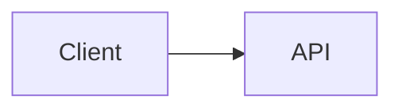

# Дизайн расширения синтаксиса Markdown

## Контекст

Этот документ содержит справочные материалы по реализации встроенного расширения синтаксиса Markdown в рамках PR. Он основан на исследовании оптимизации TUI из `origin/docs/tui-optimization-design`, особенно:

- `docs/design/tui-optimization/00-overview.md`
- `docs/design/tui-optimization/03-rendering-extensibility.md`
- `docs/design/tui-optimization/04-gemini-cli-research.md`
- `docs/design/tui-optimization/05-claude-code-research.md`
- `docs/design/tui-optimization/06-implementation-rollout-checklist.md`
- `docs/design/tui-optimization/08-execution-plan-and-test-matrix.md`

В упомянутых исследованиях рекомендуется долгосрочная архитектура Markdown, построенная на парсере AST, кэшировании блоков/токенов, потоковой передаче со стабильным префиксом, панелях с ограниченной детализацией и определении возможностей терминала. Эта первая реализация сохраняет небольшую площадь во время выполнения и делает новое поведение сразу видимым.

## Объем интегрированного PR

Этот PR рассматривает расширение синтаксиса Markdown как единое улучшение рендерера, а не как отдельные функциональные PR.

В первую реализацию включено:

- Блоки кода Mermaid визуально отображаются в TUI.
- Диаграммы Mermaid рендерятся через PNG-изображения в терминале, когда вывод изображений явно включен, доступен `mmdc` и терминал поддерживает путь к изображению.
- Диаграммы Mermaid `flowchart` / `graph` используют резервный режим предварительного просмотра в виде блок-схем (бокс-и-стрелки).
- Диаграммы Mermaid `sequenceDiagram` используют резервный режим предварительного просмотра в виде участников-стрелок.
- Блоки `classDiagram`, `stateDiagram`, `erDiagram`, `gantt`, `pie`, `journey`, `mindmap`, `gitGraph` и `requirementDiagram` используют резервный режим предварительного просмотра в виде ограниченного текста.
- Типы Mermaid без текстового просмотра возвращаются к исходному fenced-коду, чтобы пользователь мог прочитать и скопировать определение диаграммы.
- Элементы списка задач отображаются с отметками выполнено/не выполнено.
- Цитаты отображаются с видимой вертикальной линией.
- Встроенная математика `$...$` и блочная `$$...$$` отображаются с использованием стандартных подстановок Unicode.
- Существующие таблицы Markdown продолжают использовать `TableRenderer`.
- Существующие fenced-блоки кода (не Mermaid) продолжают использовать `CodeColorizer`.
- Визуальные блоки остаются доступными для исходного кода через `/copy mermaid N`, `/copy latex N`, `/copy latex inline N` и сырой режим.
- `ui.renderMode` управляет тем, в каком режиме (рендеринг или исходный/сырой) запускаются сессии, а `Alt/Option+M` переключает вид активной сессии.

## Стратегия рендеринга Mermaid

### Первая версия: рендеринг изображений с гейтами возможностей и текстовый резерв

Реализация теперь использует собственный макет Mermaid как предпочтительный путь. Если локальное окружение это поддерживает, TUI рендерит блоки Mermaid через следующий конвейер:

```text
Исходник Mermaid
  -> mmdc / Mermaid CLI
  -> PNG
  -> протокол изображений терминала Kitty или iTerm2
```

Если терминал не поддерживает встроенные изображения, но установлен `chafa`, тот же самый PNG рендерится как ANSI-блочная графика. Если ни протокол изображений, ни `chafa` недоступны, рендерер переключается на синхронный текстовый просмотр в терминале, описанный ниже.

Рендеринг изображения не выполняется, пока ответ ещё стримится. Во время стриминга блоки Mermaid показывают ограниченный предварительный просмотр в состоянии ожидания. После завершения ответа путь с изображением используется только при явном включении. Это позволяет избежать появления медленного запуска `mmdc`, особенно опционального пути через `npx`, в интерактивном рендеринге по умолчанию.

Генерация PNG кэшируется независимо от размещения в терминале. Повторный рендеринг одного и того же исходника Mermaid, включая обновления при изменении размера терминала, использует уже сгенерированный PNG и только пересчитывает размеры размещения для Kitty/iTerm2.

Путь с изображением намеренно опционален и ограничен возможностями, вместо того чтобы всегда встраивать или вызывать Puppeteer/Chromium из горячего пути CLI. Пользователь может включить вывод изображений с помощью `QWEN_CODE_MERMAID_IMAGE_RENDERING=1`, затем предоставить `@mermaid-js/mermaid-cli`, установив `mmdc` в `PATH` или указав путь к бинарнику через `QWEN_CODE_MERMAID_MMD_CLI`. Для разовой локальной проверки `QWEN_CODE_MERMAID_ALLOW_NPX=1` позволяет рендереру вызывать `npx -y @mermaid-js/mermaid-cli@11.12.0`; это намеренно опционально, так как при первом запуске может установиться Puppeteer/Chromium и заблокировать рендеринг. Локальные рендереры из `node_modules/.bin` репозитория не обнаруживаются автоматически, если не установлен `QWEN_CODE_MERMAID_ALLOW_LOCAL_RENDERERS=1`. Выбор протокола терминала можно принудительно задать с помощью `QWEN_CODE_MERMAID_IMAGE_PROTOCOL=kitty|iterm2|off`.

Для терминалов, совместимых с Kitty, таких как Ghostty, рендерер использует Unicode-плейсхолдеры Kitty вместо записи полезной нагрузки изображения в виде текста Ink. PNG передаётся через raw stdout в тихом режиме (`q=2`) с виртуальным размещением (`U=1`), а дерево React отрисовывает обычную сетку символов-заполнителей (`U+10EEEE`) с явными диакритиками строк и столбцов для каждой ячейки. Это позволяет Ink обрабатывать компоновку и изменение размера, предотвращая попадание байтов полезной нагрузки APC в видимый текст base64.

### Резервный режим: изменяемый каркасный просмотр

Резервный режим избегает асинхронной работы, так как путь Ink `<Static>` является append-only: финализированное сообщение не может надёжно дождаться фоновой задачи рендеринга и затем обновиться на месте без принудительного полного обновления статики. Поэтому резервный режим должен выводить результат в терминал во время обычного прохода рендеринга React.

Для диаграмм `flowchart` / `graph` резервный режим строит лёгкую модель графа вместо вывода одного ребра за раз:

- Узлы нормализуются по идентификатору Mermaid, метке и базовой форме.
- Метки узлов поддерживают разрывы строк в стиле Mermaid `\n` / `<br>`.
- Диаграммы сверху вниз распределяются по горизонтальным слоям.
- Диаграммы слева направо распределяются по вертикальным колонкам, если они помещаются.
- Несколько исходящих рёбер из одного узла отображаются как одна развилка с метками рёбер в скобках, например `[Yes]`, `[No]`, `[是]` и `[否]`.
- Обратные рёбра и циклы сводятся в секцию `Cycles:` с явными метками `↩ to <node>`. Это позволяет избежать нестабильных длинных маршрутов через диаграмму в шрифтах терминала, сохраняя при этом видимость семантики циклов.
- Граф пересчитывается на основе `contentWidth`, так что изменение размера меняет ширину узлов, расстояния и пути соединителей.
- Большие просмотры ограничиваются до компоновки графа, чтобы очень большие блоки Mermaid не выделяли неограниченный холст терминала во время рендеринга.

Пример:



отображается как визуальный просмотр в терминале, а не как исходник Mermaid.

Другие распространённые семейства диаграмм Mermaid используют ограниченные текстовые сводки вместо полноценного движка компоновки: отношения/члены классов, переходы состояний, сущности/отношения ER, задачи Gantt, секторы круговой диаграммы, шаги journey, деревья mindmap, записи git graph и деревья требований. Если тип диаграммы неизвестен или не может быть предварительно просмотрен, рендерер показывает исходный fenced-код Mermaid, а не заглушку, чтобы содержимое оставалось читаемым и доступным для выбора/копирования в терминале. Заголовки визуализированных Mermaid также показывают команду копирования для Mermaid, например `/copy mermaid 2`, чтобы пользователи могли восстановить исходный код диаграммы без переключения всего вида в сырой режим.

Резервный режим по-прежнему не является полноценным движком Mermaid. Это быстрый, лёгкий по зависимостям слой для предварительного просмотра распространённых диаграмм, генерируемых LLM, когда высокоточный рендеринг недоступен.

### Будущие провайдеры

Граница провайдера намеренно открыта для дополнительных нативных провайдеров изображений:

- `mmdc` / `@mermaid-js/mermaid-cli` для вывода SVG/PNG.
- `terminal-image` для Kitty/iTerm2 плюс резервный режим ANSI.
- `chafa` при наличии для мозаик Sixel/Kitty/iTerm2/Unicode.

Этот путь должен оставаться опциональным, кэшированным и ограниченным возможностями, с ключами кэша на основе хэша исходника, ширины терминала, провайдера рендерера и протокола терминала. Он не должен блокировать запуск или добавлять работу со встроенным Mermaid/Puppeteer в горячий путь TUI по умолчанию.

## Совместимость с рендерером AST

Первая версия расширяет существующий парсер, чтобы минимизировать зону поражения. Границы функциональности по-прежнему совместимы с будущим конвейером токенов `marked`:

- `code(lang=mermaid)` -> `MermaidDiagram`
- `code(lang=*)` -> существующий `CodeColorizer`
- `table` -> существующий `TableRenderer`
- `blockquote` -> рендерер цитат
- `list(task=true)` -> рендерер списка задач
- `paragraph/text` -> встроенный рендерер с поддержкой математики/ссылок/стилей

Реализация не кэширует узлы React. Будущий рендерер AST должен кэшировать токены/блоки, а затем рендерить на основе текущих свойств ширины, темы и настроек.

## Безопасность и производительность

- Исходный код Mermaid рассматривается как ненадёжный ввод.
- Первый рендерер не выполняет JavaScript-код Mermaid.
- Нативный рендеринг изображений должен быть опциональным или ограниченным возможностями.
- Будущий рендеринг на основе браузера должен использовать тайм-ауты и ограничения размера.
- Рендеринг должен деградировать до текста в терминале, а не вызывать исключения.
- Большие блоки должны учитывать доступную высоту и ширину.

## Валидация

Целевые модульные проверки:

```bash
cd packages/cli
npx vitest run \
  src/config/settingsSchema.test.ts \
  src/ui/AppContainer.test.tsx \
  src/ui/utils/MarkdownDisplay.test.tsx \
  src/ui/utils/mermaidImageRenderer.test.ts \
  src/ui/commands/copyCommand.test.ts \
  src/ui/components/BaseTextInput.test.tsx \
  src/ui/keyMatchers.test.ts \
  src/ui/contexts/KeypressContext.test.tsx
```

Более широкая проверка перед отправкой PR:

```bash
npm run build --workspace=packages/cli
npm run typecheck --workspace=packages/cli
npm run lint --workspace=packages/cli
git diff --check
```

Интеграционный сценарий с захватом терминала:

```bash
npm run build && npm run bundle
cd integration-tests/terminal-capture
npm run capture:markdown-rendering
```

Этот сценарий захватывает ответ модели, насыщенный Markdown, переключает режимы сырого/исходного кода с помощью `Alt/Option+M` и проверяет потоки копирования видимого исходного кода через `/copy mermaid 1` и `/copy latex 1`.

Ручные сценарии:

- Ответ ассистента с блоком Mermaid `flowchart LR`.
- Ответ ассистента с блоком Mermaid `sequenceDiagram`.
- Таблица Markdown плюс Mermaid в одном ответе.
- Fenced-блок кода JavaScript по-прежнему отображает форматирование кода.
- Узкая ширина терминала.
- Ограниченная поверхность инструментов/деталей.
- `ui.renderMode: "raw"` запускает сессию в режиме исходного кода.
- `Alt/Option+M` переключает один и тот же ответ между режимами рендеринга и исходного/сырого кода.
- Визуальные блоки Mermaid и LaTeX показывают подсказки для копирования, соответствующие фактическому порядку исходников `/copy mermaid N` и `/copy latex N`.