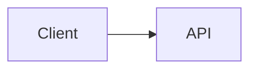

# Дизайн расширения синтаксиса Markdown

## Контекст

В этом документе содержатся ссылки на реализацию для интегрированного PR по
расширению синтаксиса Markdown. Он основан на исследовании оптимизации TUI из
`origin/docs/tui-optimization-design`, в особенности:

- `docs/design/tui-optimization/00-overview.md`
- `docs/design/tui-optimization/03-rendering-extensibility.md`
- `docs/design/tui-optimization/04-gemini-cli-research.md`
- `docs/design/tui-optimization/05-claude-code-research.md`
- `docs/design/tui-optimization/06-implementation-rollout-checklist.md`
- `docs/design/tui-optimization/08-execution-plan-and-test-matrix.md`

В упомянутом исследовании рекомендуется долгосрочная архитектура Markdown,
построенная вокруг парсера AST, кэширования блоков/токенов, стриминга с
устойчивым префиксом, панелей с деталями ограниченного размера и обнаружения
возможностей терминала. Эта первая реализация сохраняет небольшой объём
исполняемого кода и делает новое поведение видимым немедленно.

## Область интегрированного PR

Этот PR рассматривает расширение синтаксиса Markdown как одно целостное
улучшение рендерера, а не отдельные функциональные PR.

Включено в первую реализацию:

- Блоки кода Mermaid визуально отображаются в TUI.
- Диаграммы Mermaid рендерятся через PNG-изображения терминала, когда
  рендеринг изображений явно включён, доступен `mmdc` и терминал поддерживает
  путь к изображению.
- Диаграммы Mermaid типа `flowchart` / `graph` возвращаются к превью в виде
  блоков и стрелок.
- Диаграммы `sequenceDiagram` возвращаются к превью участников со стрелками.
- Блоки `classDiagram`, `stateDiagram`, `erDiagram`, `gantt`, `pie`,
  `journey`, `mindmap`, `gitGraph` и `requirementDiagram` возвращаются к
  текстовым превью ограниченного размера.
- Типы Mermaid без текстового превью возвращаются к исходному коду в
  ограждённых блоках, чтобы пользователь мог прочитать и скопировать
  определение диаграммы.
- Элементы списка задач отображают маркеры выполнено/не выполнено.
- Цитаты отображаются с видимой полосой цитирования.
- Встроенная математика `$...$` и блочная `$$...$$` рендерятся с
  использованием стандартных подстановок Unicode.
- Существующие таблицы Markdown продолжают использовать `TableRenderer`.
- Существующие ограждённые блоки кода, не являющиеся Mermaid, продолжают
  использовать `CodeColorizer`.
- Визуально отображаемые блоки остаются доступными для копирования через
  `/copy mermaid N`, `/copy latex N`, `/copy latex inline N` и сырой режим.
- `ui.renderMode` управляет, начинаются ли сессии в рендеренном или сыром
  режиме, а `Alt/Option+M` переключает вид активной сессии.

## Стратегия рендеринга Mermaid

### Первая версия: рендеринг изображений, ограниченный возможностями, с текстовым запасным вариантом

Реализация теперь рассматривает собственное расположение Mermaid как
предпочтительный путь. Когда локальное окружение это поддерживает, TUI
рендерит блоки Mermaid через этот конвейер:

```text
Исходник Mermaid
  -> mmdc / Mermaid CLI
  -> PNG
  -> Протокол терминальных изображений Kitty или iTerm2
```

Если терминал не поддерживает встроенные изображения, но установлен `chafa`,
тот же PNG рендерится как ANSI-блочная графика. Если ни протокол
изображений, ни `chafa` недоступны, рендерер возвращается к синхронному
текстовому превью терминала, описанному ниже.

Рендеринг изображения не предпринимается, пока ответ ещё стримится. Во время
стриминга блоки Mermaid показывают ограниченное превью в ожидании. После
завершения ответа путь изображения используется только при явном включении.
Это предотвращает медленный запуск `mmdc`, особенно опциональный путь `npx`,
в стандартном интерактивном пути рендеринга.

Генерация PNG кэшируется независимо от размещения на терминале. Повторные
рендеры того же исходника Mermaid, включая обновления при изменении размера
терминала, используют сгенерированный PNG и пересчитывают только размеры
размещения для Kitty/iTerm2.

Путь изображения намеренно является опциональным и ограниченным
возможностями, вместо постоянной упаковки или вызова Puppeteer/Chromium из
горячего пути CLI. Пользователь может включить путь изображения с помощью
`QWEN_CODE_MERMAID_IMAGE_RENDERING=1`, затем предоставить
`@mermaid-js/mermaid-cli`, установив `mmdc` в `PATH` или указав
`QWEN_CODE_MERMAID_MMD_CLI` на путь к бинарнику. Для ad-hoc локальной
проверки `QWEN_CODE_MERMAID_ALLOW_NPX=1` позволяет рендереру вызывать
`npx -y @mermaid-js/mermaid-cli@11.12.0`; это намеренно опционально, так как
первый запуск может установить Puppeteer/Chromium и заблокировать рендеринг.
Рендереры из локального репозитория `node_modules/.bin` не обнаруживаются
автоматически, если не установлен `QWEN_CODE_MERMAID_ALLOW_LOCAL_RENDERERS=1`.
Выбор протокола терминала можно принудительно задать с помощью
`QWEN_CODE_MERMAID_IMAGE_PROTOCOL=kitty|iterm2|off`.

Для терминалов, совместимых с Kitty, таких как Ghostty, рендерер использует
заполнители Unicode Kitty вместо записи полезной нагрузки изображения как
текста Ink. PNG передаётся через сырой stdout в тихом режиме (`q=2`) с
виртуальным размещением (`U=1`), а дерево React рендерит обычную сетку
символов-заполнителей (`U+10EEEE`) с явными диакритическими знаками строки и
столбца для каждой ячейки. Это позволяет Ink отвечать за расположение и
изменение размера, предотвращая обёртывание байтов полезной нагрузки APC в
видимый текст base64.

### Запасной вариант: изменяемое превью в виде каркаса

Запасной вариант избегает асинхронной работы, поскольку путь `<Static>` в Ink
является append-only: завершённое сообщение не может надёжно дождаться
фоновой задачи рендеринга, а затем обновиться на месте без принудительного
полного обновления статики. Поэтому запасной вариант должен выдавать вывод
терминала во время обычного прохода рендеринга React.
Для диаграмм `flowchart` / `graph` запасной вариант строит облегчённую модель графа вместо поочерёдной печати каждого ребра:

- Узлы нормализуются по идентификатору Mermaid, метке и базовой фигуре.
- Метки узлов поддерживают переносы строк в стиле Mermaid (`\n` / `<br>`).
- Диаграммы сверху вниз распределяются по горизонтальным слоям.
- Диаграммы слева направо, когда это возможно, распределяются по вертикальным колонкам.
- Несколько исходящих рёбер из одного узла отображаются как одна развилка с метками рёбер в квадратных скобках: `[Yes]`, `[No]`, `[是]`, `[否]`.
- Обратные рёбра и циклы сводятся в раздел `Cycles:` с явными маркерами `↩ to <node>`. Это позволяет избежать нестабильных длинных маршрутов поперёк диаграммы в шрифтах терминала, сохраняя при этом видимой семантику цикла.
- Граф пересчитывается на основе `contentWidth`, поэтому при изменении размера меняются ширина узлов, расстояния и пути соединителей.
- Большие превью ограничиваются до компоновки графа, чтобы очень большие блоки Mermaid не выделяли бесконечное полотно терминала при рендеринге.

Пример:



отображается как визуальное превью в терминале, а не как исходный код Mermaid.

Другие распространённые семейства диаграмм Mermaid используют ограниченные текстовые сводки, а не полноценный движок компоновки: отношения/члены классов, переходы состояний, сущности/связи ER, задачи Gantt, секторы круговых диаграмм, этапы journey, диаграммы mindmap, записи git-графа и деревья требований. Если тип диаграммы неизвестен или не может быть предпросмотрен, рендерер показывает исходный блок Mermaid в обрамлении, а не заглушку, чтобы содержимое оставалось читаемым, выделяемым и копируемым в терминале. В заголовках отрендеренных Mermaid также показывается команда копирования, специфичная для Mermaid, например `/copy mermaid 2`, чтобы пользователи могли восстановить исходный код диаграммы без переключения всего представления в режим сырого кода.

Запасной вариант по-прежнему не является полноценным движком Mermaid. Это быстрый слой предпросмотра с минимальными зависимостями для часто генерируемых LLM диаграмм, когда высококачественный рендеринг недоступен.

### Будущие провайдеры

Граница провайдеров намеренно открыта для дополнительных нативных провайдеров изображений:

- `mmcd` / `@mermaid-js/mermaid-cli` для вывода SVG/PNG.
- `terminal-image` для Kitty/iTerm2 с запасным вариантом ANSI.
- `chafa`, если присутствует, для мозаики Sixel/Kitty/iTerm2/Unicode.

Этот путь должен оставаться опциональным, кэшируемым и ограниченным по возможностям, с ключами кэша на основе хеша исходника, ширины терминала, провайдера рендерера и протокола терминала. Он не должен блокировать запуск или добавлять встроенные задачи Mermaid/Puppeteer в горячий путь TUI по умолчанию.

## Совместимость с AST-рендерером

Первая версия расширяет существующий парсер, чтобы минимизировать радиус взрыва. Границы функций по-прежнему совместимы с будущим конвейером токенов `marked`:

- `code(lang=mermaid)` → `MermaidDiagram`
- `code(lang=*)` → существующий `CodeColorizer`
- `table` → существующий `TableRenderer`
- `blockquote` → рендерер блоков цитат
- `list(task=true)` → рендерер списков задач
- `paragraph/text` → строчный рендерер с поддержкой математики/ссылок/стилей

Реализация не кэширует React-узлы. Будущий AST-рендерер должен кэшировать токены/блоки, а затем рендерить из текущих свойств width/theme/settings.

## Безопасность и производительность

- Исходный код Mermaid считается недоверенным входом.
- Первый рендерер не выполняет JavaScript Mermaid.
- Нативный рендеринг изображений должен быть opt-in или ограничен по возможностям.
- Будущий рендеринг на основе браузера должен использовать таймауты и ограничения размера.
- Рендеринг должен деградировать до текста терминала, а не выбрасывать исключения.
- Большие блоки должны учитывать доступные высоту и ширину.

## Валидация

Целевая модульная проверка:

```bash
cd packages/cli
npx vitest run \
  src/config/settingsSchema.test.ts \
  src/ui/AppContainer.test.tsx \
  src/ui/utils/MarkdownDisplay.test.tsx \
  src/ui/utils/mermaidImageRenderer.test.ts \
  src/ui/commands/copyCommand.test.ts \
  src/ui/components/BaseTextInput.test.tsx \
  src/ui/keyMatchers.test.ts \
  src/ui/contexts/KeypressContext.test.tsx
```

Более широкая проверка перед отправкой PR:

```bash
npm run build --workspace=packages/cli
npm run typecheck --workspace=packages/cli
npm run lint --workspace=packages/cli
git diff --check
```

Интеграционный сценарий терминального захвата:

```bash
npm run build && npm run bundle
cd integration-tests/terminal-capture
npm run capture:markdown-rendering
```

Этот сценарий захватывает тяжёлый по Markdown ответ модели, переключает режим сырого/исходного кода с помощью `Alt/Option+M` и проверяет потоки копирования видимого исходного кода с помощью `/copy mermaid 1` и `/copy latex 1`.

Ручные сценарии:

- Ответ ассистента с блоком Mermaid `flowchart LR`.
- Ответ ассистента с блоком Mermaid `sequenceDiagram`.
- Таблица Markdown плюс Mermaid в одном ответе.
- Блок кода JavaScript в обрамлении, всё ещё показывающий форматирование кода.
- Узкая ширина терминала.
- Ограниченная поверхность инструмента/деталей.
- `ui.renderMode: "raw"` запускает сессию в режиме, ориентированном на исходный код.
- `Alt/Option+M` переключает тот же ответ между режимами рендеринга и исходного кода.
- Визуальные блоки Mermaid и LaTeX показывают подсказки копирования, которые соответствуют фактическому порядку источников `/copy mermaid N` и `/copy latex N`.
