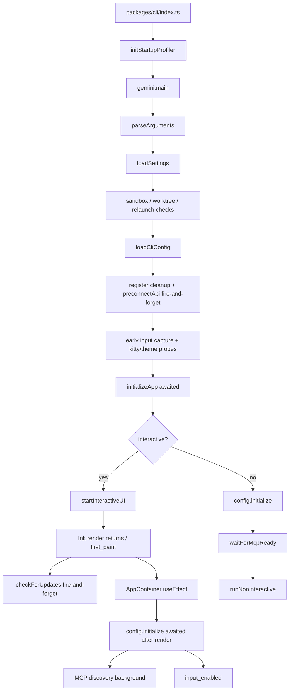
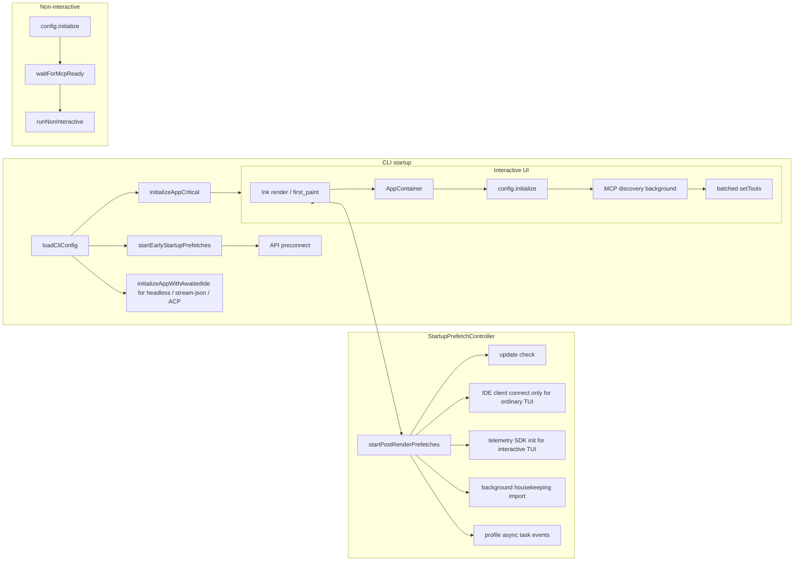
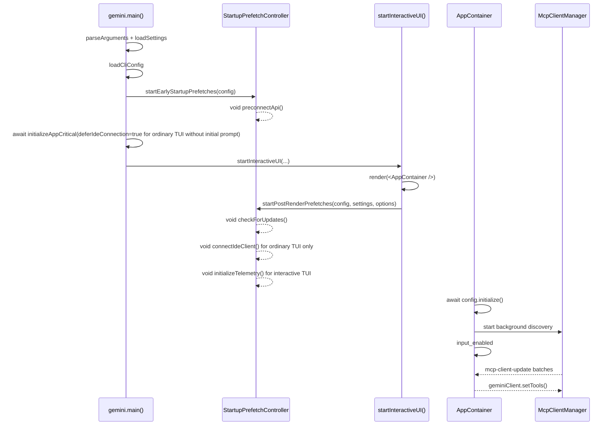

# Дизайн оптимизации fire-and-forget предварительной загрузки при запуске

## Предпосылки и цели

Родительская задача #3011 разбивает оптимизацию запуска qwen-code на несколько подзадач. В текущем репозитории уже реализован ряд базовых возможностей:

- #3219: Интегрирован профайлер производительности запуска, поддерживающий `QWEN_CODE_PROFILE_STARTUP=1` для вывода JSON с фазами запуска.
- #3221: Регистрация инструментов переведена на ленивые фабрики; `Config.initialize()` больше не создает статические экземпляры всех инструментов.
- #3223: Предварительное подключение к API (preconnect) уже реализовано и сейчас запускается в режиме fire-and-forget после `loadCliConfig()`.
- Ранний перехват ввода, прогрессивное обнаружение MCP и `config.initialize()` после рендеринга AppContainer также частично реализованы.

Цель #3222 — не переделывать эти возможности, а консолидировать некритичные для запуска операции, которые все еще разбросаны по пути запуска, в единый слой предварительной загрузки fire-and-forget: до первой отрисовки (first paint) ожидать только те операции, которые действительно влияют на корректность; после первой отрисовки запускать фоновые задачи, не влияющие на корректность первого взаимодействия, сохраняя при этом совместимую семантику для неинтерактивных режимов.

## Текущий процесс запуска

Ключевой процесс текущего интерактивного пути запуска выглядит следующим образом:



Оценка текущего состояния:

- `initializeApp()` по-прежнему последовательно выполняет i18n, аутентификацию, проверку темы и подключение к IDE-клиенту до первой отрисовки.
- Аутентификация и i18n должны выполняться до первой отрисовки; подключение к IDE не является жесткой зависимостью для первой отрисовки обычного TUI без начального промпта и может быть отложено на этом пути. Однако для путей вроде `qwen -i "prompt"`, `qwen -p`, stream-json и ACP/Zed — которые не имеют безопасного окна после рендеринга или чей первый запрос требует контекста/статуса IDE — подключение к IDE по-прежнему должно ожидаться до первого запроса.
- `checkForUpdates()` уже работает в режиме fire-and-forget после рендеринга в `startInteractiveUI()`, но логика разбросана внутри функции запуска UI.
- `preconnectApi()` уже работает в режиме fire-and-forget и должна запускаться как можно раньше, но ее нужно перевести под единое планирование.
- Инициализация Telemetry SDK ранее происходила синхронно при создании `Config`; для обычного интерактивного TUI ее можно отложить до рендеринга, в то время как неинтерактивные пути сохраняют семантику инициализации до первого запроса.
- На интерактивном пути `config.initialize()` уже выполняется после монтирования React; обнаружение MCP уже работает в фоне внутри core, при этом AppContainer пакетно обновляет список инструментов.
- Неинтерактивный путь по-прежнему требует ожидания `config.waitForMcpReady()`, иначе первый промпт может не увидеть инструменты MCP, что приведет к регрессу в поведении скриптов.

## Целевая архитектура

Внедрить небольшой слой планирования предварительной загрузки при запуске, который будет централизованно управлять задачами по принципу "запустить, но не ожидать", разделив их на две категории по времени срабатывания: ранние и после рендеринга.



Последовательность интерактивного запуска в рамках нового дизайна:



## Изменения в дизайне

### 1. Новый единый планировщик предварительной загрузки при запуске

Добавить файл `packages/cli/src/startup/startup-prefetch.ts`, предоставляющий две точки входа:

```ts
startEarlyStartupPrefetches(config: Config): void;
startPostRenderPrefetches(
  config: Config,
  settings: LoadedSettings,
  options?: { connectIde?: boolean; initializeTelemetry?: boolean },
): void;
```

Планировщик выполняет ровно три действия:

- Запускает задачи предварительной загрузки по имени.
- Использует `void task().catch(...)` для явного указания не ожидать выполнения и не пробрасывать ошибки.
- Записывает отладочные логи и асинхронные события профайлера для проверки того, запускаются ли задачи до или после рендеринга.

Планировщик должен гарантировать идемпотентность для каждой фазы, предотвращая многократный запуск одной и той же задачи из-за React StrictMode, повторных вызовов в тестах или аномальных повторных входов.

### 2. Ранняя предварительная загрузка: максимальный выигрыш во времени

`startEarlyStartupPrefetches(config)` вызывается сразу после успешного выполнения `loadCliConfig()`.

Первая фаза включает только предварительное подключение к API:

- Читает текущий тип аутентификации и разрешенный базовый URL из `config.getModelsConfig()`.
- Читает прокси из `config.getProxy()`.
- Вызывает существующую функцию `preconnectApi(authType, { resolvedBaseUrl, proxy })`.
- Сохраняет существующие проверки окружения: `QWEN_CODE_DISABLE_PRECONNECT`, sandbox, custom CA, non-Node runtime, отсутствие прокси и т.д.

Это не добавляет новых опций конфигурации. Сбои preconnect только записываются в отладочный лог и не влияют на запуск.

### 3. Предварительная загрузка после рендеринга: запуск после первой отрисовки

`startPostRenderPrefetches(config, settings)` вызывается в `startInteractiveUI()` после возврата из Ink `render()` и фиксации `first_paint`.

Первая партия включает:

- Проверка обновлений: перенос существующей логики `checkForUpdates().then(handleAutoUpdate)` с сохранением проверки `settings.merged.general?.enableAutoUpdate !== false`.
- Подключение к IDE-клиенту: переносится в предварительную загрузку после рендеринга только для пути обычного интерактивного TUI без начального промпта. Вызывающий код должен явно передавать `connectIde: true`, при этом планировщик внутри себя по-прежнему проверяет `config.getIdeMode()`. Пути `qwen -i "prompt"`, неинтерактивный, stream-json и ACP/Zed не откладывают подключение к IDE через эту точку входа.
- Инициализация Telemetry SDK: переносится в предварительную загрузку после рендеринга только для интерактивного пути TUI. `Config` по-прежнему хранит настройки телеметрии, но пропускает побочный эффект создания SDK во время конструирования через `deferTelemetryInitialization`; предварительная загрузка после рендеринга запускает SDK через `initializeTelemetry(config)`. Неинтерактивный, stream-json и ACP/Zed не откладывают инициализацию.
- Фоновое обслуживание: может быть перенесено из `gemini.tsx` в предварительную загрузку после рендеринга, предоставляя единую точку входа для всех фоновых задач запуска; по-прежнему ограничено интерактивным режимом, используется динамический импорт и подавление ошибок.

Ни одна из этих задач не должна влиять на возвращаемое значение `startInteractiveUI()`, а также не должна выводить видимые пользователю ошибки в stderr TUI. Сбои фиксируются только в отладочных логах.

### 4. Разделение критического пути `initializeApp()` с сохранением ожидаемого подключения к IDE для не-TUI

Добавить общий хелпер, чтобы избежать дублирования логики подключения к IDE между отложенным путем TUI и ожидаемым путем не-TUI:

```ts
export async function connectIdeForStartup(config: Config): Promise<void> {
  if (!config.getIdeMode()) return;

  const ideClient = await IdeClient.getInstance();
  await ideClient.connect();
  logIdeConnection(config, new IdeConnectionEvent(IdeConnectionType.START));
}
```

`initializeApp()` остается критической инициализацией до первой отрисовки, но получает явную опцию:

```ts
interface InitializeAppOptions {
  deferIdeConnection?: boolean;
}
```

Значение по умолчанию должно оставаться обратно совместимым: `deferIdeConnection` по умолчанию равно `false`. То есть, если опция не передана, подключение к IDE по-прежнему ожидается внутри `initializeApp()`.

Ожидаемое содержимое `initializeApp()` становится следующим:

- `initializeI18n(...)`
- `performInitialAuth(...)`
- `validateTheme(settings)`
- Если `deferIdeConnection !== true`, то `await connectIdeForStartup(config)`
- Вычисление `shouldOpenAuthDialog`
- Чтение `config.getGeminiMdFileCount()`

Место вызова в `gemini.tsx` отвечает за выбор на основе режима запуска:

```ts
const deferIdeConnection =
  config.isInteractive() && !config.getExperimentalZedIntegration() && !input;

const initializationResult = await initializeApp(config, settings, {
  deferIdeConnection,
});
```

В дальнейшем, только если `deferIdeConnection === true`, `startInteractiveUI()` запускает подключение к IDE в режиме fire-and-forget через `startPostRenderPrefetches(..., { connectIde: true })`; prompt-interactive, который автоматически отправляет первый вопрос, продолжает ожидать IDE до рендеринга и передает `connectIde: false`, чтобы избежать повторного подключения после рендеринга.

Это разделение устраняет риск совместимости, отмеченный при ревью:

- Обычный интерактивный TUI: подключение к сокету/IPC IDE больше не блокирует первую отрисовку.
- `qwen -i "prompt"`: продолжает ожидать подключения к IDE перед первым автоматически отправленным запросом, а после рендеринга не переподключается.
- `qwen -p` / piped stdin: продолжает ожидать подключения к IDE перед первым запросом к модели.
- stream-json: продолжает завершать подключение к IDE перед обработкой запросов сессии/управления.
- ACP/Zed: продолжает сохранять ожидаемый запуск IDE, избегая потери контекста/статуса IDE при первом запросе.

### 5. Семантика MCP и неинтерактивного режима остается неизменной

Этот дизайн не изменяет базовую машину состояний MCP.

Интерактивный режим:

- Продолжает вызывать `config.initialize()` в эффекте монтирования `AppContainer`.
- `Config.initialize()` продолжает запускать фоновое обнаружение MCP.
- AppContainer продолжает слушать `mcp-client-update` и пакетно вызывать `geminiClient.setTools()` с интервалом ~16 мс.
- Первая отрисовка и доступность ввода не ждут полного завершения работы MCP.

Неинтерактивный режим / stream-json / ACP:

- Продолжает ожидать подключения к IDE перед первым запросом к модели.
- Продолжает ожидать `config.waitForMcpReady()` перед первым запросом к модели.
- Сохраняет семантику видимости инструментов старого синхронного пути.
- Сохраняет существующее поведение вывода предупреждений в stderr при сбое MCP.

## Ожидаемый выигрыш в производительности

Выигрыш делится на две категории.

Первая — сокращение критического пути до первой отрисовки:

- Подключение к IDE-клиенту для обычного интерактивного TUI больше не блокирует первую отрисовку; выигрыш зависит от времени подключения к сокету/IPC IDE и, как ожидается, составит от десятков до сотен миллисекунд.
- Инициализация Telemetry SDK для обычного интерактивного TUI больше не блокирует первую отрисовку; выигрыш зависит от затрат на создание OTel SDK/экспортера, что обычно представляет собой небольшую или умеренную синхронную нагрузку при запуске.
- Проверка обновлений, фоновое обслуживание, preconnect и аналогичные задачи получают единую точку входа fire-and-forget, что предотвращает случайное возвращение их на ожидаемый путь при будущем обслуживании.
Второй пункт — это преимущества при первом API-запросе:

- Сохраняется архитектура preconnect для API из #3223.
- Если прокси/общий диспетчер можно переиспользовать, первый API-запрос позволяет избежать затрат на рукопожатие TCP+TLS, что экономит ожидаемые 100–200 мс.

Примечание: исторический базовый уровень из #3219 показал, что когда-то загрузка модулей занимала ~94% общего времени запуска; ленивая регистрация инструментов из #3221 уже устранила самое большое узкое место. Основная польза от #3222 заключается скорее в улучшении воспринимаемого TTI и отзывчивости при первом рендеринге, а не в полном устранении затрат на загрузку модулей.

## Риски и область влияния

### Риски

- Возможности IDE в обычном TUI могут сместиться от «подключено до первого рендеринга» к «подключено почти сразу после первого рендеринга». Меры по снижению рисков: откладываем выполнение только для обычного интерактивного TUI; неинтерактивный режим, stream-json и ACP/Zed сохраняют ожидание подключения перед первым запросом.
- События телеметрии до рендеринга могут быть просто отброшены (no-op), если SDK еще не инициализирован. Меры по снижению рисков: откладываем выполнение только для интерактивного TUI; телеметрия до первого запроса в неинтерактивном режиме сохраняет свою исходную семантику, новая очередь буферизации не добавляется.
- Сбои отложенных задач могут быть незаметны. Меры по снижению рисков: унифицированная обертка записывает debug-логи и асинхронные события профилировщика.
- Перенос update/preconnect может случайно изменить существующие условия (gates). Меры по снижению рисков: дословное сохранение существующих настроек и условий окружения.
- Чрезмерная отсрочка может привести к тому, что возможности не будут готовы к моменту первого ввода пользователя, если он от них зависит. Меры по снижению рисков: аутентификация, создание конфига, права доступа, хуки, память, реестр инструментов и ожидание готовности MCP в неинтерактивном режиме по-прежнему требуют ожидания (await).

### Область влияния

Ожидается, что изменения затронут только уровень запуска CLI:

- `packages/cli/src/startup/startup-prefetch.ts`
- `packages/cli/src/core/initializer.ts`
- `packages/cli/src/gemini.tsx`
- `packages/cli/src/ui/startInteractiveUI.tsx`
- Соответствующие модульные тесты

Не вносятся изменения в:

- Аргументы CLI и схему конфигурации
- Протокол основного реестра инструментов
- Конечный автомат обнаружения MCP
- Протокол запросов к модели
- Поведение команд, видимое пользователю

## План модульного тестирования

### `packages/cli/src/startup/startup-prefetch.test.ts`

Покрытие:

- `startEarlyStartupPrefetches()` вызывает `preconnectApi()` с типом аутентификации, разрешенным базовым URL и прокси.
- Ранний prefetch не ожидает завершения задачи.
- Повторные вызовы идемпотентны и не запускают одну и ту же раннюю задачу повторно.
- `startPostRenderPrefetches()` запускает проверку обновлений, если `enableAutoUpdate !== false`.
- Не запускает проверку обновлений, если `enableAutoUpdate === false`.
- Запускает подключение к IDE и вызывает `logIdeConnection()`, если `options.connectIde === true` и `config.getIdeMode() === true`.
- Не инициирует подключение к IDE, если `options.connectIde !== true`.
- Не инициирует подключение к IDE, если `config.getIdeMode() === false`, даже если `options.connectIde === true`.
- Запускает инициализацию SDK телеметрии, если `options.initializeTelemetry === true`.
- Не инициирует инициализацию SDK телеметрии, если `options.initializeTelemetry !== true`.
- Отклонения (rejections) отложенных задач не приводят к выбросу исключений в публичном API, а только записываются в debug-логи.

### `packages/cli/src/core/initializer.test.ts`

Корректировки и дополнения:

- `initializeApp()` по умолчанию ожидает `connectIdeForStartup()`, сохраняя совместимость с не-TUI путями.
- `initializeApp(..., { deferIdeConnection: true })` не вызывает `IdeClient.getInstance()` или `connect()`.
- `initializeApp(..., { deferIdeConnection: false })` вызывает и ожидает подключения к IDE, если `config.getIdeMode() === true`.
- По-прежнему ожидает `initializeI18n()`.
- По-прежнему ожидает `performInitialAuth()`.
- При сбое аутентификации сохраняет `authError` и `shouldOpenAuthDialog === true`.
- При сбое валидации темы сохраняет `themeError`.
- Когда тип аутентификации указан явно и она проходит успешно, `shouldOpenAuthDialog === false`.

### `packages/cli/src/ui/startInteractiveUI.test.tsx`

Покрытие:

- После возврата из Ink `render()` и записи `first_paint` вызывает `startPostRenderPrefetches(config, settings)`.
- Путь обычного TUI передает `{ connectIde: true, initializeTelemetry: true }`.
- Если prompt-interactive уже ожидал IDE до рендеринга, передает `{ connectIde: false, initializeTelemetry: true }`, чтобы избежать дублирования подключения к IDE.
- Не-TUI пути не инициируют post-render prefetch для IDE/телеметрии через `startInteractiveUI()`.
- Отклонения (rejections) post-render prefetch не приводят к отклонению `startInteractiveUI()`.
- После того как проверка обновлений вынесена из inline-логики `startInteractiveUI()`, она больше не вызывается напрямую.

### `packages/cli/src/gemini.test.tsx`

Корректировки и дополнения:

- Обычный интерактивный TUI вызывает `initializeApp(config, settings, { deferIdeConnection: true })` и подключает IDE в post-render prefetch.
- Prompt-interactive вызывает `initializeApp(config, settings, { deferIdeConnection: false })`, а post-render prefetch не переподключает IDE.
- `qwen -p` / piped stdin / stream-json вызывает `initializeApp(config, settings, { deferIdeConnection: false })` или использует значения по умолчанию, гарантируя подключение IDE перед первым запросом.
- Путь ACP/Zed не включает отложенный prefetch для IDE и продолжает работу через ожидаемый запуск IDE.

### `packages/core/src/config/config.test.ts`

Покрытие:

- Если телеметрия включена и `deferTelemetryInitialization` не передан, создание `Config` по-прежнему вызывает `initializeTelemetry(config)`.
- Если телеметрия включена и `deferTelemetryInitialization === true`, создание `Config` не вызывает `initializeTelemetry(config)`, но `config.getTelemetryEnabled()` по-прежнему возвращает true.

### Регрессионные тесты

Рекомендуемый запуск:

```bash
cd packages/cli && npx vitest run src/core/initializer.test.ts src/startup/startup-prefetch.test.ts
cd packages/cli && npx vitest run src/gemini.test.tsx
cd packages/core && npx vitest run src/config/config.test.ts -t "telemetry"
```

## Критерии приемки

- Первый рендеринг интерактивного REPL не ожидает подключения к IDE, инициализации телеметрии, проверки обновлений или служебных задач.
- Неинтерактивный режим, stream-json и ACP/Zed по-прежнему ожидают подключения к IDE перед первым запросом.
- Неинтерактивный режим, stream-json и ACP/Zed не откладывают инициализацию SDK телеметрии.
- API preconnect по-прежнему выполняется в режиме fire-and-forget как можно раньше после `loadCliConfig()`.
- Аутентификация, конфиг, права доступа, хуки, память и другие критичные для корректности инициализации по-прежнему требуют ожидания (await) там, где это необходимо.
- Первый промпт в неинтерактивном режиме по-прежнему ожидает готовности MCP.
- Сбои всех отложенных задач не влияют на рендеринг REPL.
- Профилировщик показывает, что отложенные задачи запускаются ожидаемым образом в районе first_paint.
- Модульные тесты покрывают критические пути, идемпотентность, подавление ошибок и ограничения совместимости с неинтерактивным режимом.

## Исходные допущения

- #3221 — это на самом деле issue на GitHub, а не PR; текущий репозиторий уже содержит реализацию ленивого реестра инструментов.
- Данный дизайн не добавляет новых опций конфигурации, чтобы не превращать оптимизацию запуска в настраиваемую пользователем сложность.
- «REPL рендерится до завершения отложенных операций» означает возврат из first-paint в Ink и доступность ввода, а не требование завершения всех фоновых возможностей до того, как пользователь увидит UI.
- В неинтерактивном режиме приоритет отдается совместимости, а не столь агрессивной оптимизации first-paint, как в интерактивном режиме.