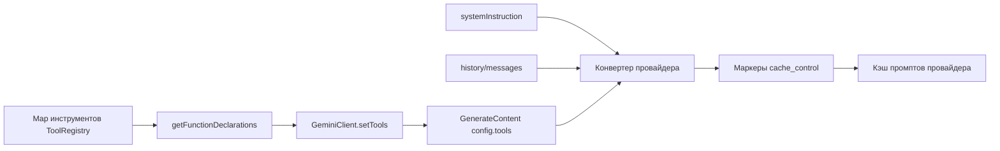
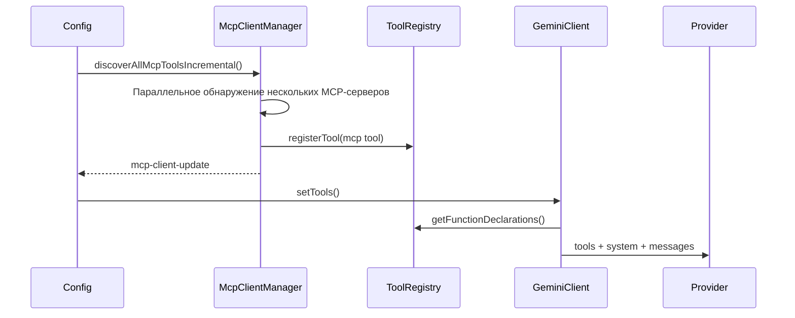

# Дизайн стабильной сортировки глобальной схемы инструментов

## Предыстория

Qwen Code уже поддерживает `cache_control` на уровнях преобразования запросов Anthropic и DashScope. Когда провайдер поддерживает кэширование промптов, стабильный префикс запроса может быть закэширован и повторно использован, что снижает затраты на повторные входные токены и уменьшает время до первого токена (TTFT).

Основной префикс в настоящее время состоит из трех частей:

1. Схема инструментов (tools schema): объявления инструментов, генерируемые с помощью `ToolRegistry.getFunctionDeclarations()`.
2. Системная инструкция (system instruction): системный промпт основной сессии.
3. Сообщения/история (messages/history): вступительная часть при запуске, сообщения пользователя, результаты работы инструментов и связанный контекст.

Схема инструментов часто бывает объемной и находится в начале префикса кэша провайдера. Если сериализованные байты массива инструментов изменятся, последующие префиксы системы и сообщений также могут потерять возможность повторного использования.

Сейчас `GeminiClient.setTools()` напрямую использует возвращаемое значение `ToolRegistry.getFunctionDeclarations()`, а `getFunctionDeclarations()` перебирает инструменты в порядке их добавления в `Map`. Порядок регистрации встроенных инструментов обычно стабилен, но постепенное обнаружение MCP, раскрытие инструментов через ToolSearch, переподключения MCP и регистрация внешних инструментов могут привести к тому, что один и тот же набор инструментов будет сериализован в разном порядке. Это вызывает ненужные промахи кэша промптов.

## Цели

Реализовать глобальную стабильную сортировку для схем инструментов: `functionDeclarations`, отправляемые в запросы к модели, должны иметь стабильный порядок для одного и того же набора инструментов, независимо от порядка завершения их регистрации.

Этот дизайн решает только проблему промахов кэша, когда набор инструментов идентичен, но отличается их порядок. Добавление, удаление инструментов или изменение содержимого схемы по-прежнему изменяет префикс; это легитимные промахи кэша.

Этот дизайн не включает:

- Разбиение системного промпта на блоки.
- Снапшоты/кэш схем инструментов на уровне сессии.
- Полную реализацию обнаружения разрывов кэша промптов (prompt cache break detection).
- Изменения политик `cache_control` провайдеров.

## Текущий поток



Постепенное обнаружение MCP — наиболее частая причина изменения порядка:



Если два MCP-сервера в итоге становятся доступны, но регистрируются в разном порядке, текущий блок инструментов может отличаться:

```text
Запуск 1:
[
  read_file,
  shell,
  mcp__filesystem__read_tree,
  mcp__github__search_issues
]

Запуск 2:
[
  read_file,
  shell,
  mcp__github__search_issues,
  mcp__filesystem__read_tree
]
```

С точки зрения возможностей модели, оба запуска предоставляют один и тот же набор инструментов. С точки зрения кэша промптов, это разные префиксы инструментов.

После сортировки один и тот же набор стабилизируется до:

```text
[
  mcp__filesystem__read_tree,
  mcp__github__search_issues,
  read_file,
  shell
]
```

## Роль кэша промптов и различия между попаданиями и промахами

Кэш промптов позволяет провайдеру повторно использовать вычисления KV/кэша для стабильного префикса. Для длинных списков инструментов, длинных системных промптов и длинных префиксов истории попадание в кэш обычно дает два преимущества:

- Снижение затрат на входные токены: закэшированный префикс попадает в тарификацию чтения из кэша.
- Снижение TTFT: провайдеру не нужно заново обрабатывать весь префикс.

До попадания в кэш:

```text
изменены байты запроса
-> префикс tools/system/messages не может быть переиспользован
-> cache_read_input_tokens низкий или равен 0
-> весь префикс снова учитывается как входные данные/создание кэша
-> TTFT выше
```

После попадания в кэш:

```text
стабильные байты префикса не изменились
-> префикс tools/system/messages переиспользуется из кэша провайдера
-> cache_read_input_tokens увеличивается
-> только новое содержимое в конце учитывается как входные данные/создание кэша
-> TTFT ниже
```

Этот дизайн повышает вероятность попадания в кэш за счет стабилизации порядка массива инструментов, особенно при изменении порядка регистрации, вызванном постепенным обнаружением MCP и раскрытием инструментов через ToolSearch.

## Дизайн

Сортировка должна выполняться в `ToolRegistry.getFunctionDeclarations()`, так как это единственная точка генерации объявлений инструментов для текущего API. Не следует сортировать в конвертере провайдера, потому что другие читатели объявлений останутся нестабильными. Не следует сортировать только в `GeminiClient.setTools()`, потому что диагностика, оценка контекста и тесты могут по-прежнему наблюдать неотсортированные объявления.

Правила сортировки:

1. Сначала применить существующую логику фильтрации:
   - По умолчанию исключать инструменты, для которых `shouldDefer && !alwaysLoad && !revealedDeferred`.
   - `{ includeDeferred: true }` включает отложенные (deferred) инструменты.
   - Инструменты `alwaysLoad` всегда видимы.
2. Отсортировать отфильтрованные экземпляры инструментов.
3. Использовать `tool.schema.name ?? tool.name` в качестве первичного ключа сортировки.
4. Использовать `tool.displayName` для разрешения ничьей (tie-breaker).
5. Вернуть отсортированные значения `tool.schema`.

Псевдокод:

```ts
getFunctionDeclarations(options?: { includeDeferred?: boolean }) {
  const includeDeferred = options?.includeDeferred === true;
  return Array.from(this.tools.values())
    .filter((tool) => {
      if (
        !includeDeferred &&
        tool.shouldDefer &&
        !tool.alwaysLoad &&
        !this.revealedDeferred.has(tool.name)
      ) {
        return false;
      }
      return true;
    })
    .sort(compareToolsByDeclarationName)
    .map((tool) => tool.schema);
}
```

Функция сравнения должна быть локальной и простой. Не добавляйте конфигурацию:

```ts
function compareToolsByDeclarationName(
  a: AnyDeclarativeTool,
  b: AnyDeclarativeTool,
) {
  const aName = a.schema.name ?? a.name;
  const bName = b.schema.name ?? b.name;
  const byName = aName.localeCompare(bName);
  if (byName !== 0) return byName;
  return a.displayName.localeCompare(b.displayName);
}
```

Не сохраняйте порядок регистрации как неявный ранг. Порядок инструментов не должен выражать предпочтение модели; модель должна выбирать инструменты на основе имени, описания, схемы и контекста.

## План тестирования

Добавьте или обновите тесты в `packages/core/src/tools/tool-registry.test.ts`.

### 1. Сортировка обычных инструментов по каноническому имени

Порядок регистрации:

```text
zeta, alpha, middle
```

Ожидание:

```text
getFunctionDeclarations().map(name) === [alpha, middle, zeta]
```

### 2. Фильтрация отложенных инструментов перед сортировкой

Регистрация:

```text
visible-z
hidden-a (shouldDefer)
visible-a
```

Ожидание по умолчанию:

```text
[visible-a, visible-z]
```

### 3. includeDeferred включает все инструменты и сортирует их

Используйте те же инструменты, что и выше, и вызовите:

```ts
getFunctionDeclarations({ includeDeferred: true });
```

Ожидание:

```text
[hidden-a, visible-a, visible-z]
```

### 4. Раскрытые отложенные инструменты появляются на своих отсортированных позициях

Регистрация:

```text
visible-m
hidden-a (shouldDefer)
visible-z
```

Выполнение:

```ts
toolRegistry.revealDeferredTool('hidden-a');
```

Ожидание:

```text
[hidden-a, visible-m, visible-z]
```

### 5. Отложенные инструменты alwaysLoad остаются видимыми и отсортированными

Регистрация:

```text
z (shouldDefer, alwaysLoad)
a
```

Ожидание по умолчанию:

```text
[a, z]
```

### 6. Порядок регистрации MCP-инструментов отличается, но вывод совпадает

Создайте два экземпляра `ToolRegistry`:

```text
Порядок регистрации registryA:
  mcp__github__search_issues
  mcp__filesystem__read_tree

Порядок регистрации registryB:
  mcp__filesystem__read_tree
  mcp__github__search_issues
```

Ожидание:

```text
registryA.getFunctionDeclarations().map(name)
  === registryB.getFunctionDeclarations().map(name)
```

### 7. Обновление старых проверок

Существующие тесты, зависящие от порядка регистрации, должны быть обновлены так, чтобы зависеть от отсортированного порядка. Например, тест фильтрации отложенных инструментов, который проверяет только `['visible']`, можно оставить как есть; если в будущем он зарегистрирует несколько видимых инструментов, он должен проверять отсортированный массив.

Рекомендуемые команды для проверки:

```bash
cd packages/core && npx vitest run src/tools/tool-registry.test.ts
cd packages/core && npx vitest run src/tools/tool-search.test.ts
cd packages/core && npx vitest run src/core/client.test.ts
npm run build && npm run typecheck
```

## Риски и ограничения

- Изменение порядка инструментов может повлиять на неявное предпочтение выбора модели. Этот риск приемлем, поскольку порядок инструментов не должен быть продуктовой семантикой; стабильные префиксы кэша имеют более высокий приоритет.
- Этот дизайн не предотвращает промахи кэша, вызванные добавлением новых инструментов. Новые инструменты MCP-серверов, изменения содержимого схемы инструментов и раскрытие новых инструментов через ToolSearch по-прежнему будут легитимно изменять блок инструментов.
- Если в будущем провайдеру потребуется сохранение семантики регистрации инструментов, это должно обрабатываться на уровне провайдера. В текущем коде таких требований нет.

## Следующий шаг: Обнаружение разрывов кэша промптов

После внедрения глобальной сортировки следующим шагом должна стать легковесная система обнаружения разрывов кэша промптов для проверки преимуществ сортировки и поиска оставшихся промахов кэша.

Реализация в два этапа:

1. Запись снапшота перед каждым запросом:
   - model.
   - хэш системной инструкции.
   - имена functionDeclaration и хэш схемы.
   - включен ли cache control / его область действия (scope).
2. Чтение использования (usage) после каждого ответа:
   - `cache_read_input_tokens`.
   - `cache_creation_input_tokens`.
   - совместимые метаданные кэшированных токенов от OpenAI/DashScope/Gemini.

Когда чтение из кэша значительно падает по сравнению с предыдущим ходом, выводите debug-лог или телеметрическое событие:

```text
prompt_cache_break:
  reason: tools_order_changed | tools_schema_changed | system_changed |
          cache_control_changed | model_changed | likely_provider_ttl_or_eviction
  previousCacheReadTokens
  currentCacheReadTokens
  changedToolNames
```

Первая версия должна только наблюдать и не должна изменять поведение запросов. Ее цель — ответить на два вопроса:

1. Снижает ли глобальная сортировка инструментов промахи кэша из-за порядка инструментов?
2. Связаны ли оставшиеся промахи кэша в основном с системным текстом, содержимым схемы инструментов, `cache_control` или TTL/вытеснением (eviction) на стороне провайдера?