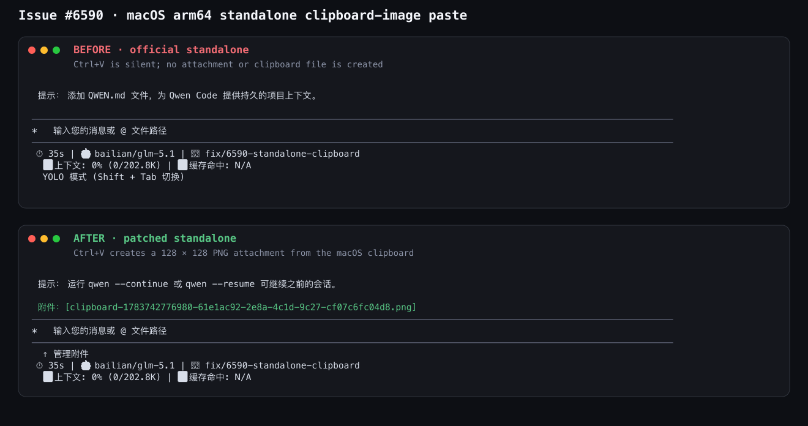

# Нативный аддон clipboard для standalone

## Проблема

Бандл CLI оставляет `@teddyzhu/clipboard` внешним, чтобы установки npm могли
загружать платформенно-специфичный нативный пакет во время выполнения.
Автономные архивы также оставляют импорт внешним, но сейчас копируют в
`lib/node_modules` только нативный аддон захвата аудио. Поэтому вставка
изображений из буфера обмена молча не работает во всех автономных архивах.

## Ограничения

- Каждый архив должен содержать JavaScript-пакет `@teddyzhu/clipboard` и
  ровно один нативный пакет, соответствующий целевой платформе архива.
- Релизная джоба создаёт все поддерживаемые цели на одном раннере Ubuntu.
  Обычный `npm ci` устанавливает только опциональный нативный пакет раннера,
  поэтому упаковка не может полагаться на `node_modules` репозитория для
  кросс-целевых артефактов.
- Версии пакетов clipboard должны браться из lockfile и оставаться
  согласованными с опциональными зависимостями CLI.
- Локальная упаковка должна продолжать работать, когда артефакт clipboard не
  для хоста недоступен, при этом релизная упаковка должна падать, а не
  публиковать частично функциональный архив.

## Дизайн

Перед сборкой релизных архивов установить залоченный метапакет clipboard и
все поддерживаемые целевые пакеты во временный каталог стейджинга. Передавать
этот каталог явно команде упаковки для каждой цели.

Автономный упаковщик сопоставляет каждой цели её нативный пакет clipboard и
копирует в `lib/node_modules/@teddyzhu` только метапакет плюс этот целевой
пакет. Когда явный каталог стейджинга не предоставлен, упаковщик использует
`node_modules` репозитория; отсутствующий артефакт хоста выдаёт предупреждение
для локальных сборок. Отсутствие артефактов в явном каталоге стейджинга
является фатальным.

Если модуль рантайма всё ещё не может загрузиться, промпт ввода сообщает одну
видимую пользователю ошибку при первой попытке вставки изображения из буфера
обмена. Существующие пути Linux `wl-paste` и `xclip` не изменяются.

## Проверка

- Тесты упаковки покрывают выбор цели, исключение других нативных целей и
  сбой при неполном явном стейджинге.
- Тесты clipboard и промпта ввода покрывают колбэк недоступного модуля и
  одноразовую ошибку UI.
- Реальный архив macOS arm64 распаковывается вне репозитория, загружается со
  своим встроенным рантаймом Node.js и проверяется на реальном PNG в
  системном буфере обмена.

