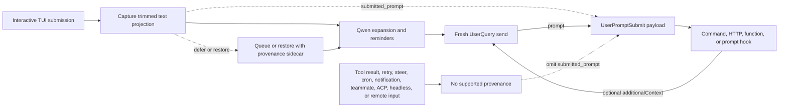

# Происхождение отправленного промпта для `UserPromptSubmit`

## Сводка

`UserPromptSubmit.prompt` — это промпт текущего вызова модели. Он может
содержать напоминания, сгенерированные Qwen, развёрнутые файлы и ресурсы,
вывод слеш-команд, вывод расширений или контекст, добавленный более ранним
хуком. Поэтому он не может надёжно ответить на другой вопрос: какая текстовая
проекция пересекла поддерживаемую границу интерактивного ввода?

Это изменение добавляет опциональное поле `submitted_prompt`:

```ts
interface UserPromptSubmitInput {
  prompt: string;
  submitted_prompt?: string;
}
```

Поле заполняется только когда Qwen может перенести происхождение (provenance)
из поддерживаемой интерактивной отправки TUI в свежий `UserQuery`. Потребители,
которым нужен именно отправленный пользователем текст, должны трактовать
отсутствующее поле как недоступное и не должны откатываться на `prompt`.

Изменение не меняет момент срабатывания `UserPromptSubmit`, существующее
значение `prompt`, порядок или блокировку хуков, а также поведение
`additionalContext`.

## Цели и нецели

Цели:

- Сохранить текст, отправленный через поддерживаемый интерактивный TUI, до
  того, как Qwen развернёт его.
- Перенести этот текст через отложенные и восстановленные отправки, не
  связывая его с неверным запросом модели.
- Добавить поле, не ломая потребителей, принимающих forward-совместимый JSON.
- Сделать всех получателей данных и границы доверия явными.

Нецели:

- Изменение семантики срабатывания `UserPromptSubmit`.
- Вывод исходного промпта из контента, предназначенного модели.
- Поддержка ACP, headless-режима, удалённого ввода, SDK или других
  производителей ввода в этом изменении.
- Предоставление аутентификации, идентичности тенанта, DLP или неизменяемой
  метки безопасности.
- Реализация вызова внешнего контекста.

## Поток данных



Очередь остаётся ориентированной на текст для рендеринга. Происхождение
связывается через внутренний sidecar и потребляется только когда текст из
очереди становится свежим ходом. Любая неоднозначная трансформация, частичный
батч или отредактированное восстановление завершается fail closed, опуская
`submitted_prompt`.

Placeholder'ы больших вставок остаются компактными в `submitted_prompt`; их
полное содержимое разворачивается только в `prompt` для модели. Это сохраняет
проекцию TUI и избегает дублирования многомегабайтного вставленного контента в
каждом payload'е хуков.

Восстановление при отмене сохраняет владение основным ходом, когда параллельно
выполняется побочный вопрос `/btw`. Поскольку этот побочный вопрос может
записать в дисковую историю более новую запись пользователя, отмена удаляет
последнюю залогированную запись только когда основной ход всё ещё единолично
владеет ею. Эта связка держит восстановленный sidecar происхождения и
персистентную историю согласованными, вместо того чтобы восстанавливать один
ход и удалять другой.

## Право на заполнение

| Путь                                                                               | `prompt`                   | `submitted_prompt`                               | Правило                                         |
| ---------------------------------------------------------------------------------- | -------------------------- | ------------------------------------------------ | ----------------------------------------------- |
| Свежая интерактивная отправка TUI, отправленная как `UserQuery`                    | Существующее значение для модели | Присутствует                               | Захватить обрезанную проекцию до разворачивания |
| Отложенная отправка TUI, позже становящаяся свежим ходом                            | Существующее значение для модели | Присутствует только при полном происхождении | Сохранять sidecar, пока в очереди          |
| Точное восстановление после отмены или очереди с последующей повторной отправкой    | Существующее значение для модели | Присутствует только если восстановленный текст не изменился | Переиспользовать sidecar только для точного восстановления |
| Отредактированный или частично известный восстановленный ввод                       | Существующее значение для модели | Отсутствует                                  | Не угадывать происхождение                      |
| Навигация по истории промптов, команд или shell, либо выбранный результат поиска    | Существующее значение для модели | Отсутствует                                  | История может содержать сгенерированные разворачивания |
| Промпт, восстановленный из стэша между перезапусками                                | Существующее значение для модели | Отсутствует                                  | Стэш хранит текст без происхождения             |
| Промпт, восстановленный rewind разговора                                            | Существующее значение для модели | Отсутствует                                  | История rewind хранит только текст для модели   |
| Steering-ввод в том же ходе                                                          | Существующее поведение     | Отсутствует                                      | Steering — не свежая поддерживаемая отправка    |
| Результат инструмента или продолжение хука                                          | Существующее поведение     | Отсутствует                                      | Сохранить легаси-поведение продолжений          |
| Трафик retry, cron, уведомлений или тиммейтов                                       | Существующее поведение     | Отсутствует                                      | Сохранить существующее поведение срабатывания   |
| Сконфигурированный начальный промпт `--prompt-interactive`                        | Существующее значение для модели | Отсутствует                                  | Он не пересекал границу интерактивного ввода    |
| Непустой ввод при включённом режиме Vim, включая после отключения Vim               | Существующее значение для модели | Отсутствует                                  | Регистры Vim не переносят происхождение         |
| ACP, headless-режим, `serve`, SDK, удалённый ввод или принятый спекулятивный ввод   | Существующее поведение     | Отсутствует                                      | В этом изменении производители не добавляются   |

Когда восстановленный или лишённый происхождения ввод для модели очищается или
отправляется, TUI отбрасывает историю undo/redo текстового буфера до того, как
более поздний ввод сможет получить право на заполнение. Это предотвращает
восстановление текстом для модели через undo после того, как его маркер
происхождения или sidecar был потреблён.

Любой непустой ввод, присутствующий при включённом Vim, остаётся не имеющим
права после отключения Vim, пока композер не очищен. Это консервативное
правило также покрывает черновики, введённые до включения Vim. Регистры Vim
могут сохранять текст для модели сквозь очистки буфера, поэтому смена режима не
может восстановить происхождение существующего контента.

Таблица определяет только происхождение. Существующее срабатывание событий
остаётся неизменным, включая пути, которые не запускают `UserPromptSubmit`.

## Инварианты

1. Core сериализует `submitted_prompt` только для свежего `UserQuery`, несущего
   непустую строку от поддерживаемого производителя.
2. Значение сохраняется таким, каким получено Core; Core не обрезает, не
   реконструирует и не выводит его из `prompt`.
3. Последовательные обновления `additionalContext` могут расширять `prompt`, но
   не переписывают `submitted_prompt`.
4. Рекурсивные и машинные отправки очищают происхождение.
5. Батч в очереди атрибутируется только когда каждый включённый элемент имеет
   совместимое происхождение. Иначе батч опускает поле.
6. Восстановленный sidecar одноразовый и применяется только к точной повторной
   отправке.
7. Отсутствие происхождения — нормальное состояние, а не ошибка.

## Совместимость и миграция

JSON-контракт хуков расширяем вперёд. Декодеры должны игнорировать неизвестные
поля. Потребители, намеренно отклоняющие неизвестные поля, например JSON
Schema с `additionalProperties: false`, должны явно разрешить опциональное
свойство `submitted_prompt` перед обновлением. Для критичного к безопасности
хука сбой строгого декодера может изменить то, завершится ли вызов fail open
или fail closed, поэтому администраторы должны протестировать обновлённый
payload с развёрнутым хуком перед раскаткой.

Существующие потребители, читающие только `prompt`, сохраняют текущее
поведение. Чувствительные к источнику потребители должны читать
`submitted_prompt` и пропускать, спрашивать пользователя или применять
задокументированную фолбэк-политику при его отсутствии. Молчаливое
использование `prompt` как исходного текста пользователя — небезопасный
фолбэк.

## Доверие и границы данных

`submitted_prompt` — это происхождение, предоставленное вызывающей стороной.
Это не аутентифицированная идентичность, решение об авторизации, привязка к
репозиторию или результат DLP. Оно наследует доверие от локального процесса
Qwen и поддерживаемого производителя TUI; оно не устанавливает новую границу
доверия. В частности, function-хук получает внутрипроцессный объект и должен
трактоваться как доверенный код; этот дизайн не заявляет неизменяемость во
время выполнения против такого хука.

Все сконфигурированные исполнители хуков получают payload события:

| Тип хука  | Получатель                                                |
| --------- | --------------------------------------------------------- |
| Command   | Дочерний процесс через стандартный ввод                   |
| HTTP      | Сконфигурированный эндпоинт через тело POST               |
| Function  | Доверенный внутрипроцессный колбэк                        |
| Prompt    | Сконфигурированный провайдер модели после подстановки `$ARGUMENTS` |

Операторы должны трактовать и `prompt`, и `submitted_prompt` как потенциально
чувствительные. Prompt-хуки отправляют payload провайдеру модели. Файловый
debug-лог записывает полностью развёрнутый запрос prompt-хука, поэтому его
хранение и контроль доступа должны соответствовать отправленным данным. Хук
также может копировать свой ввод в собственный вывод, ошибки, логи или
нижестоящие системы; эти назначения выходят за рамки гарантий этого поля.

Когда присутствуют оба поля, payload'ы prompt-хуков содержат перекрывающийся
текст и могут потреблять дополнительные входные токены модели. Этот контракт
не предоставляет подавление полей для отдельных хуков.

Телеметрия вызовов хуков сейчас экспортирует метаданные хука, а не полный
ввод, но эта деталь реализации не является границей приватности, и
потребителям не следует на неё полагаться.

## Почему это отличается от Claude Code

Claude Code запускает `UserPromptSubmit` на границе отправки пользователя, до
того, как управление входит в цикл запросов модели. Рекурсия результатов
инструментов не пересекает эту границу, поэтому существующий `prompt` там
естественно представляет отправленный ввод.

Qwen Code запускает хук ближе к общему конвейеру отправки модели и сохраняет
легаси-поведение на большем числе путей отправки. Перемещение события было бы
более широким, ломающим семантическим изменением. Аддитивное поле происхождения
даёт поддерживаемым вызывающим сторонам TUI недостающий сигнал границы,
сохраняя существующие интеграции.

## Проверка

Модульные тесты покрывают гейт сериализации Core, цепочки хуков, захват TUI,
проекцию больших вставок, отложенные очереди, точное и отредактированное
восстановление, очистку происхождения и неполные батчи. Интерактивное
E2E-покрытие захватывает реальный payload command-хука и подтверждает, что
разворачивание может изменить `prompt` без изменения `submitted_prompt`, и что
продолжение результата инструмента опускает поле.
