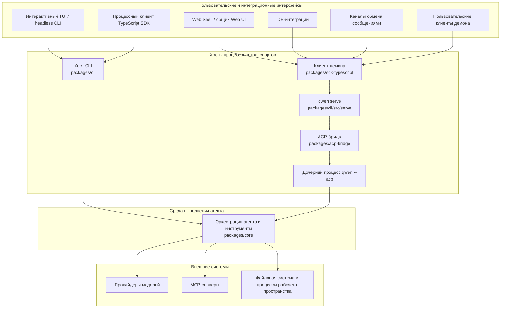

# Обзор архитектуры Qwen Code

Qwen Code — это монорепозиторий, который поддерживает интерактивный терминал, headless-режим
и программное выполнение, Agent Client Protocol (ACP), долгоживущий HTTP-демон,
веб- и IDE-клиенты, а также адаптеры для мессенджеров. Этот документ сопоставляет
эти интерфейсы с реализующими их пакетами и объясняет основные границы среды выполнения.

Подробную информацию о внутреннем устройстве демона см. в
[документации демона](./daemon/00-index.md). Форматы HTTP-запросов и событий
описаны в [справочнике протокола `qwen serve`](./qwen-serve-protocol.md).

## Система в общих чертах

В Qwen Code используются две модели выполнения агента:

- **Прямое выполнение:** интерактивный TUI и headless CLI напрямую конструируют
  и запускают среду выполнения агента.
- **Выполнение через ACP:** `qwen --acp` размещает агента за ACP-транспортом.
  Им может управлять ACP-клиент напрямую или `qwen serve` через общий
  ACP-бридж.

`qwen serve` добавляет плоскость управления HTTP + Server-Sent Events (SSE)
вокруг выполнения через ACP, чтобы несколько клиентов могли использовать
долгоживущие среды выполнения, привязанные к рабочему пространству.

На диаграмме показаны основные рабочие пути. Некоторые адаптеры также имеют
автономные режимы: например, `qwen channel start` использует ACP-бридж без
HTTP-демона. Варианты описаны в
[руководстве по плагинам каналов](./channel-plugins.md#runtime-modes).

## Структура репозитория

| Путь                                                                                                       | Назначение                                                                                                                                                                                             |
| ---------------------------------------------------------------------------------------------------------- | ------------------------------------------------------------------------------------------------------------------------------------------------------------------------------------------------------ |
| `packages/cli`                                                                                             | Исполняемый файл `qwen`, разбор аргументов, сборка конфигурации, Ink TUI, headless-вывод, точка входа ACP, `qwen serve` и адаптеры для конкретных команд.                                             |
| `packages/core`                                                                                            | Независимая от UI оркестрация агента, интеграция с провайдерами моделей, построение промптов и контекста, регистрация и выполнение инструментов, разрешения, сессии, память, телеметрия и общие сервисы. |
| `packages/acp-bridge`                                                                                      | Жизненный цикл ACP-канала, мультиплексирование сессий, доставка событий, посредничество разрешений, создание процессов и стык файловой системы, общий для демона и хостов адаптеров.                    |
| `packages/sdk-typescript`                                                                                  | Программное выполнение процессов через `query()` плюс HTTP/SSE-клиенты и проекция транскриптов для `qwen serve`.                                                                                        |
| `packages/webui`                                                                                           | Общие React-компоненты и React-адаптер демона, построенные на TypeScript SDK.                                                                                                                          |
| `packages/web-shell`                                                                                       | Терминальный браузерный UI, построенный на `packages/webui` и SDK демона.                                                                                                                              |
| `packages/web-templates`                                                                                   | Веб-шаблоны, упакованные как встраиваемые строки JavaScript и CSS.                                                                                                                                     |
| `packages/audio-capture`                                                                                                                                                   | Нативный захват микрофона для голосового ввода.                                                                                                                                                        |
| `packages/channels`                                                                                        | Общая среда выполнения каналов и платформенные адаптеры для сервисов обмена сообщениями.                                                                                                               |
| `packages/desktop`, `packages/vscode-ide-companion`, `packages/chrome-extension`, `packages/zed-extension` | Продуктовые и редакторские интерфейсы, адаптирующие Qwen Code к среде хоста.                                                                                                                           |
| `packages/sdk-java`, `packages/sdk-python`                                                                 | Программные клиенты для конкретных языков.                                                                                                                                                             |
| `packages/cua-driver`, `packages/mobile-mcp`                                                               | Интеграции компьютерного использования и мобильных устройств, доступные через MCP-совместимые границы.                                                                                                 |
| `integration-tests`                                                                                        | End-to-end покрытие для CLI, интерактивного режима, SDK, песочницы, хуков и поведения терминала.                                                                                                       |
| `docs` и `docs-site`                                                                                       | Пользовательская, разработческая, протокольная и проектная документация, а также сайт документации.                                                                                                    |
| `scripts`                                                                                                  | Автоматизация сборки, упаковки, релизов, валидации и поддержки репозитория.                                                                                                                            |

Большая часть кода находится в npm-воркспейсах в `packages/`. Пакет должен зависеть
от другого пакета через его объявленные публичные экспорты, а не через относительный
путь в исходное дерево этого пакета.

## Границы пакетов

### CLI и интерфейсы представления

`packages/cli` владеет исполняемым файлом и выбирает режим выполнения из аргументов
командной строки. Он загружает настройки пользователя и рабочего пространства,
конструирует конфигурацию ядра, при необходимости входит в запрошенную песочницу
и затем запускает один из интерактивных, headless, ACP, демонских, канальных
или обслуживающих потоков.

Представление остаётся за пределами среды выполнения ядра:

- Ink TUI отрисовывает локальные интерактивные сессии;
- `packages/webui` адаптирует состояние демона к React-провайдерам и хукам;
- `packages/web-shell` обеспечивает браузерный терминальный опыт;
- IDE- и канальные пакеты преобразуют события хоста в общие контракты клиента
  или бриджа.

### Среда выполнения ядра

`packages/core` владеет циклом агента. Он формирует запросы к модели, поддерживает
контекст беседы, диспетчеризует вызовы инструментов, применяет политику разрешений
и возвращает структурированные события и результаты активному хосту. Встроенные
инструменты охватывают операции с файлами, выполнение shell-команд, поиск,
планирование, веб-доступ, память, навыки и субагенты. MCP расширяет поверхность
инструментов и ресурсов без привязки среды выполнения к конкретной интеграции.

Пакет ядра не определяет, как отображаются результаты и как удалённый клиент
их транспортирует. Эти решения относятся к слоям CLI, бриджа, SDK и UI.

### ACP-бридж

`packages/acp-bridge` соединяет хост-процесс со средой выполнения ACP-агента.
Его основные обязанности:

- создание дочернего процесса ACP или подключение к нему;
- мультиплексирование сессий и клиентов;
- пересылка промптов, отмен и уведомлений ACP;
- посредничество в запросах разрешений;
- публикация ограниченных потоков событий сессии;
- предоставление интерфейса файловой системы рабочего пространства хосту.

Бридж может использовать реальный дочерний процесс `qwen --acp` в продакшене
или in-memory канал в тестах. См.
[README `@qwen-code/acp-bridge`](../../packages/acp-bridge/README.md) для его
публичных точек входа.

### SDK и UI-адаптеры

TypeScript SDK предоставляет два стиля клиентов:

- `query()` запускает и управляет процессом Qwen Code для программного локального использования;
- клиенты демона взаимодействуют с `qwen serve` через HTTP и SSE.

`packages/webui` строит слой состояния React на клиенте демона, а
`packages/web-shell` строит браузерный UI на этом слое состояния. Другие клиенты,
включая IDE-интеграции и управляемые демоном каналы, переиспользуют те же SDK
и контракты событий вместо импорта кода серверной реализации.

## Потоки выполнения

### Прямой поток CLI

1. CLI разбирает аргументы и резолвит конфигурацию из настроек пользователя,
   рабочего пространства, окружения и командной строки.
2. Подготавливается песочница и конструируется конфигурация среды выполнения ядра.
3. Среда выполнения ядра строит запрос к модели и входит в цикл агент/инструмент.
4. Вызовы инструментов проверяются по политике разрешений и выполняются в активном
   окружении рабочего пространства.
5. CLI отображает инкрементальные события в TUI или сериализует их для
   headless-вывода.

### Поток демона

1. Клиент использует TypeScript SDK или документированный HTTP API для подключения
   к `qwen serve`.
2. Демон аутентифицирует запрос и определяет рабочее пространство, которому
   принадлежит запрошенная операция.
3. Среда выполнения рабочего пространства перенаправляет операции агента через
   свой ACP-бридж дочернему процессу `qwen --acp`.
4. Дочерний процесс выполняет ту же логику ядра агента и инструментов, что и
   при прямом выполнении.
5. Ответы и уведомления возвращаются через бридж; события сессии доставляются
   клиентам через SSE.

При включённых мульти-воркспейс сессиях каждая активная среда выполнения рабочего
пространства владеет собственным бриджем и дочерним процессом ACP. Доступ к файловой
системе, оверлеи окружения, транспорты MCP, сессии и обработка сбоев остаются
привязанными к этой резолвленной среде выполнения. В
[архитектуре демона](./daemon/01-architecture.md) подробно описаны топология
процессов, границы доверия, воспроизведение событий и жизненный цикл.

## Точки расширения

Qwen Code можно расширять на нескольких уровнях:

- **MCP-серверы** добавляют инструменты, промпты и ресурсы в среду выполнения ядра.
- **Расширения и навыки** упаковывают переиспользуемые команды, конфигурацию и
  поведение агента.
- **Плагины каналов** адаптируют платформы обмена сообщениями к общей среде
  выполнения каналов.
- **SDK-клиенты** создают пользовательские локальные или демоном приложения.
- **UI-адаптеры** проецируют общие события демона в специфичное для хоста
  состояние и представление.

Держите платформенно-специфичные задачи в адаптерах. Общее поведение агента
относится к среде выполнения ядра, а транспортное поведение — к ACP-бриджу,
SDK или хосту демона.

## Конфигурация и состояние

CLI собирает эффективную конфигурацию из аргументов командной строки, переменных
окружения, настроек пользователя, настроек рабочего пространства и значений по
умолчанию перед конструированием среды выполнения. Ядро получает резолвленную
конфигурацию, а не читает специфичные для представления входные данные. См.
[Настройки](../users/configuration/settings.md) для описания поддерживаемых
настроек и их областей действия.

Прямые сессии сохраняют свою историю и метаданные через общие сервисы ядра.
В режиме демона демон определяет рабочее пространство-владелец и предоставляет
клиентам операции с областью действия рабочего пространства и сессии; дочерний
процесс ACP остаётся владельцем активного выполнения агента.

## Куда двигаться дальше

- [Документация демона для разработчиков](./daemon/00-index.md)
- [HTTP-протокол `qwen serve`](./qwen-serve-protocol.md)
- [TypeScript SDK](../../packages/sdk-typescript/README.md)
- [ACP-бридж](../../packages/acp-bridge/README.md)
- [Руководство разработчика плагинов каналов](./channel-plugins.md)
- [Разработка инструментов](./tools/introduction.md)
- [Интеграционное тестирование](./development/integration-tests.md)
