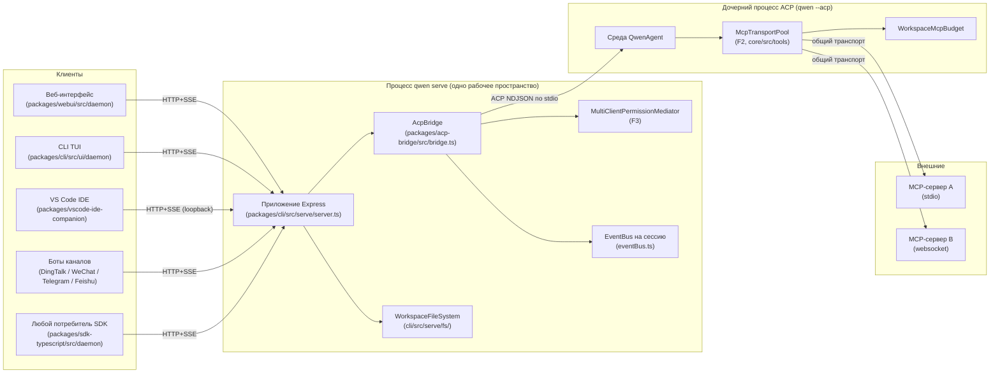
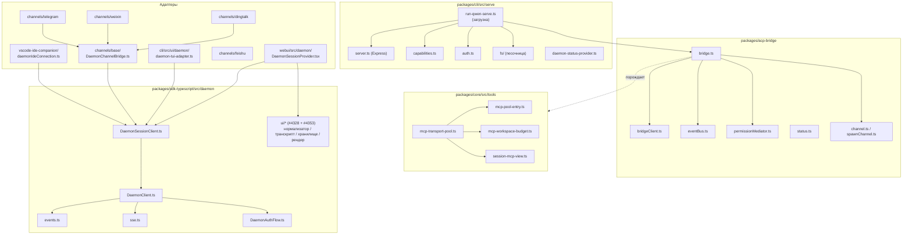
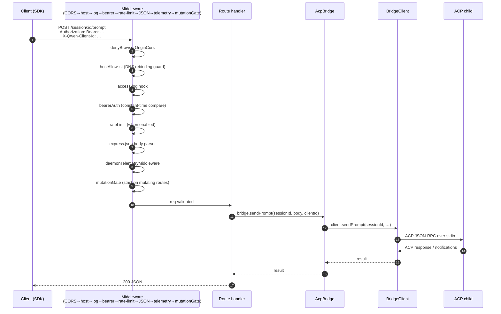
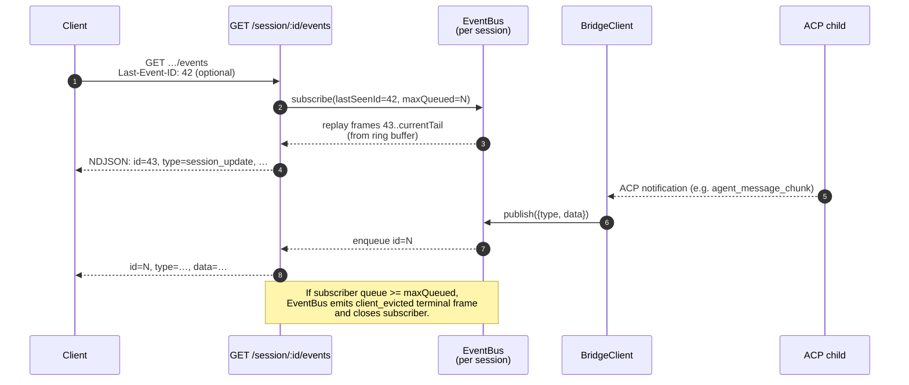
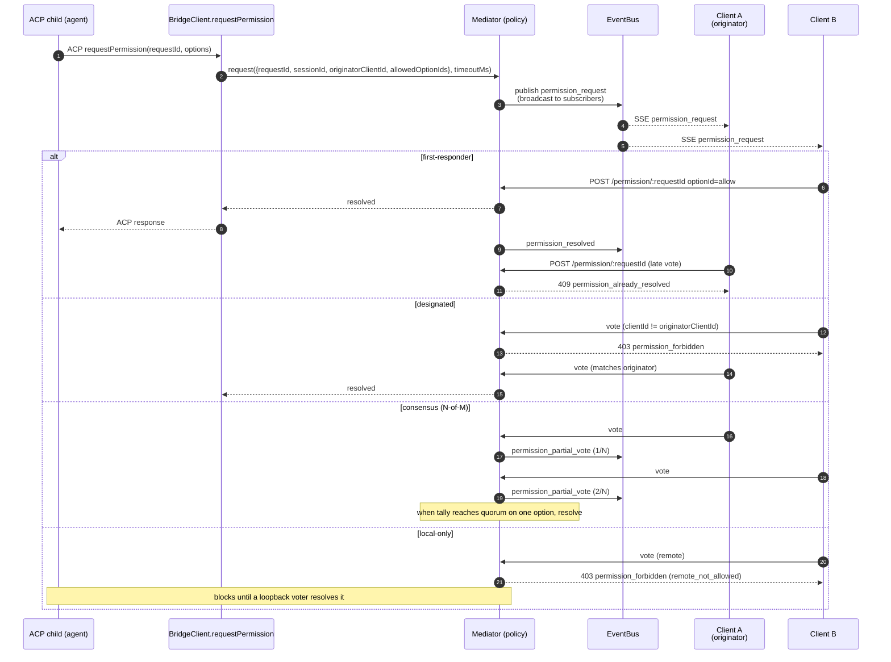
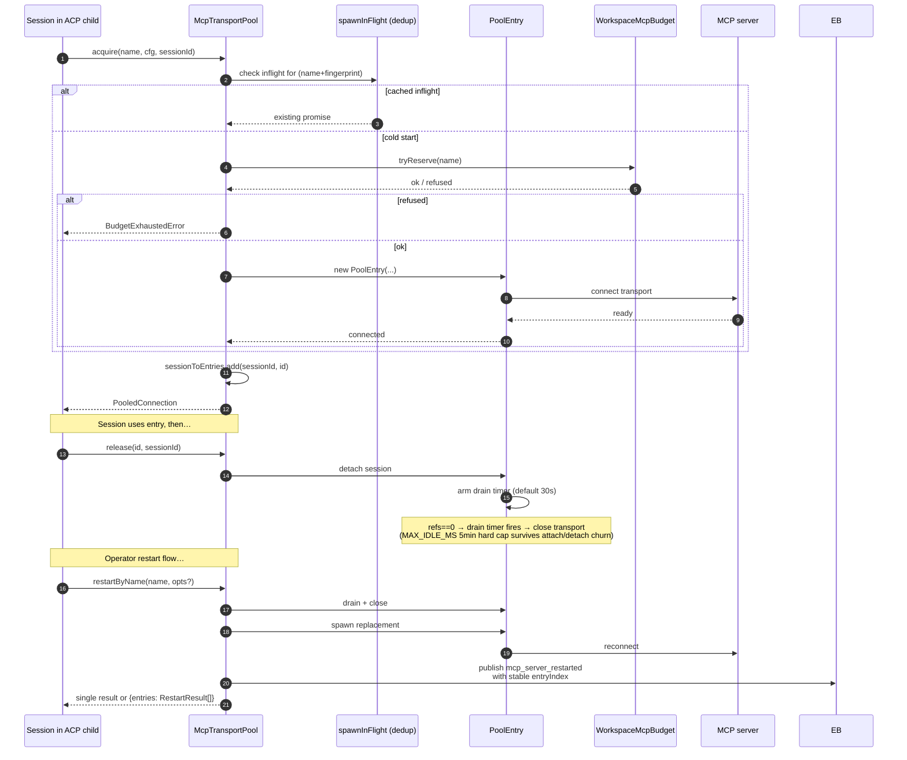
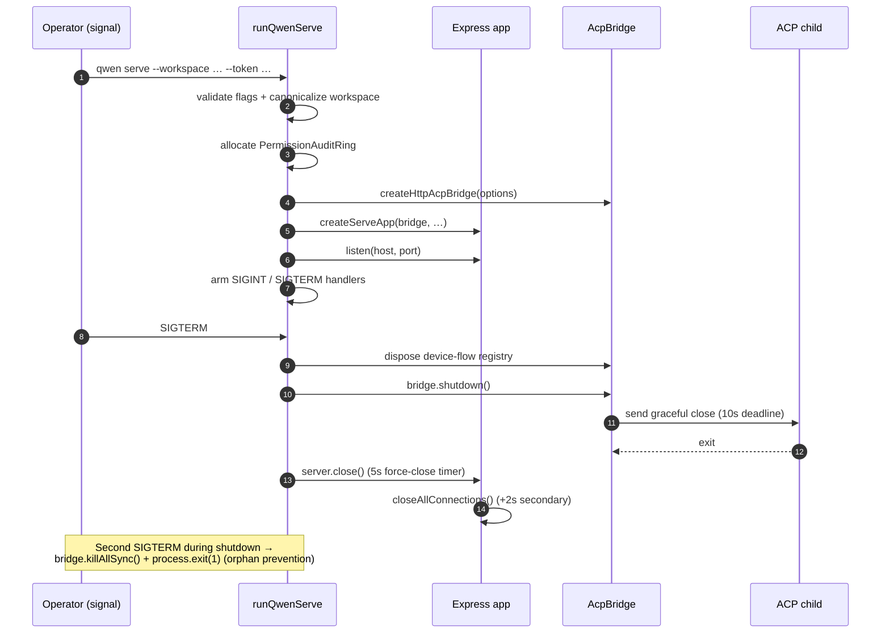

# Архитектура демона

## Обзор

Процесс `qwen serve` — это **один демон = одно рабочее пространство**. Он запускает один HTTP-сервер Express, владеет экземпляром `@qwen-code/acp-bridge` и порождает один дочерний процесс ACP (`qwen --acp`), который выполняет саму среду агента. Несколько клиентов (CLI TUI, IDE-компаньон, боты каналов, веб-BFF, пользовательские скрипты) подключаются по HTTP + SSE и либо используют одну ACP-сессию (`sessionScope: 'single'`, по умолчанию), либо разделяют сессии по потокам общения (`sessionScope: 'thread'`).

Внутри дочернего ACP-процесса MCP-серверы являются общими для всего рабочего пространства через `McpTransportPool` (F2): кортеж (имя_сервера + отпечаток_конфигурации) отображается ровно на один MCP-транспорт, независимо от того, сколько сессий его обнаруживают. `MultiClientPermissionMediator` (F3) координатует голосование за разрешения от всех подключенных клиентов в рамках одной из четырёх политик.

Этот документ даёт **системную картину**, на которую опирается остальная документация. Каждый критический поток показан в виде диаграммы последовательности Mermaid; детали реализации компонентов живут в остальных 18 документах.

## Топология процессов

Процесс демона и дочерний процесс ACP соединены через `AcpChannel` (по умолчанию: реальная пара stdio-каналов дочернего процесса; `inMemoryChannel` для тестов). Всё, что делает демон, определяется этим разделением: HTTP- и SSE-трафик завершается в демоне, решения агента и вызовы инструментов выполняются в дочернем процессе, а мост соединяет их.

## Карта пакетов

Три границы доверия имеют значение: HTTP-граница (цепочка middleware из `serve/auth.ts`), граница между мостом и дочерним процессом ACP (NDJSON по stdio, без аутентификации; дочерний процесс доверяет мосту неявно) и граница между агентом и MCP-сервером (агент может вызывать инструменты, взаимодействующие с хостом).
## Сценарий 1: Жизненный цикл HTTP-запроса

Нестримингые маршруты (prompt, cancel, model switch, metadata, workspace CRUD) завершаются одним JSON-ответом. Потоковый вывод доставляется вне полосы (out-of-band) по SSE-каналу, **не** в виде фрагментированного HTTP-тела в этом соединении. Смотрите сценарий 2.

## Сценарий 2: Доставка и повторное воспроизведение SSE-событий

Кольцевой буфер ограничен (`eventRingSize`, по умолчанию 8000). Переподключающийся клиент, чей `Last-Event-ID` старше головы буфера, получает синтетический сигнал синхронизации и должен вызвать `loadSession` / `resumeSession` для восстановления более глубокого состояния. Медленные клиенты инициируют `slow_client_warning` при заполнении очереди на 75% и `client_evicted` при достижении предела.

## Сценарий 3: Посредничество разрешений для нескольких клиентов

Аварийный выход для кроссполитик: любой клиент может проголосовать `CANCEL_VOTE_SENTINEL`, чтобы замкнуть запрос как `cancelled / agent_cancelled`. Мост защищает от попыток проводных вызывающих абонентов протащить sentinel через обычное поле `optionId` (`InvalidPermissionOptionError`).

## Сценарий 4: Получение/освобождение/перезапуск пула MCP-транспортов

`releaseSession(sessionId)` использует обратный индекс `sessionToEntries`, чтобы освободить все записи, удерживаемые сессией, за O(refs). При завершении демона `drainAll()` устанавливает флаг `draining` (отказываясь от новых захватов) и ожидает закрытия каждой записи в пределах настраиваемого таймаута.

## Workflow 5: Жизненный цикл — запуск и корректное завершение

Двухфазное завершение важно, потому что текущие HTTP-запросы, активные подписчики SSE и текущие вызовы инструментов дочернего процесса ACP — все требуют ограниченных окон для завершения. Если что-то блокирует выполнение дольше установленных сроков, вступает в силу принудительное закрытие, чтобы зависший дочерний процесс не удерживал процесс демона в живых.

## Критические файлы

| Область ответственности      | Файл                                                        |
| ---------------------------- | ------------------------------------------------------------|
| Загрузка                     | `packages/cli/src/serve/run-qwen-serve.ts`                    |
| Express приложение           | `packages/cli/src/serve/server.ts`                          |
| Реестр возможностей          | `packages/cli/src/serve/capabilities.ts`                      |
| Промежуточное ПО аутентификации | `packages/cli/src/serve/auth.ts`                            |
| Мост (Bridge)                | `packages/acp-bridge/src/bridge.ts`                         |
| BridgeClient                 | `packages/acp-bridge/src/bridgeClient.ts`                   |
| Посредник разрешений         | `packages/acp-bridge/src/permissionMediator.ts`             |
| EventBus                     | `packages/acp-bridge/src/eventBus.ts`                       |
| Пул транспортов MCP          | `packages/core/src/tools/mcp-transport-pool.ts`             |
| Бюджет MCP рабочей области   | `packages/core/src/tools/mcp-workspace-budget.ts`           |
| Файловая система рабочей области | `packages/cli/src/serve/fs/`                                |
| SDK DaemonClient             | `packages/sdk-typescript/src/daemon/DaemonClient.ts`        |
| SDK SessionClient            | `packages/sdk-typescript/src/daemon/DaemonSessionClient.ts` |
| Схема событий                | `packages/sdk-typescript/src/daemon/events.ts`              |

## Ссылки

- Дизайн-issue: [#3803](https://github.com/QwenLM/qwen-code/issues/3803) (дизайн демона), [#4175](https://github.com/QwenLM/qwen-code/issues/4175) (вехи F-серии).
- Руководство пользователя: [`../../users/qwen-serve.md`](../../users/qwen-serve.md).
- Спецификация протокола по проводам: [`../qwen-serve-protocol.md`](../qwen-serve-protocol.md).
- Дизайн-документ F2: [`../../design/f2-mcp-transport-pool.md`](../../design/f2-mcp-transport-pool.md).
- Заметки к дизайну F2: issue [#4175](https://github.com/QwenLM/qwen-code/issues/4175), коммиты 4–6.
