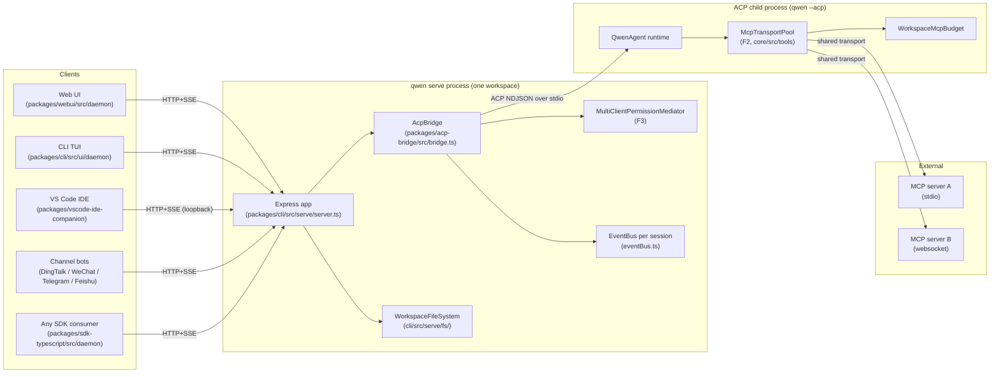
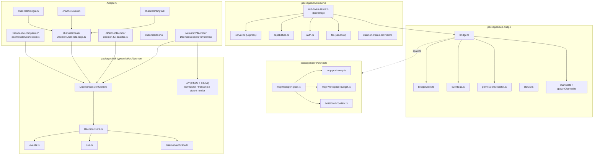
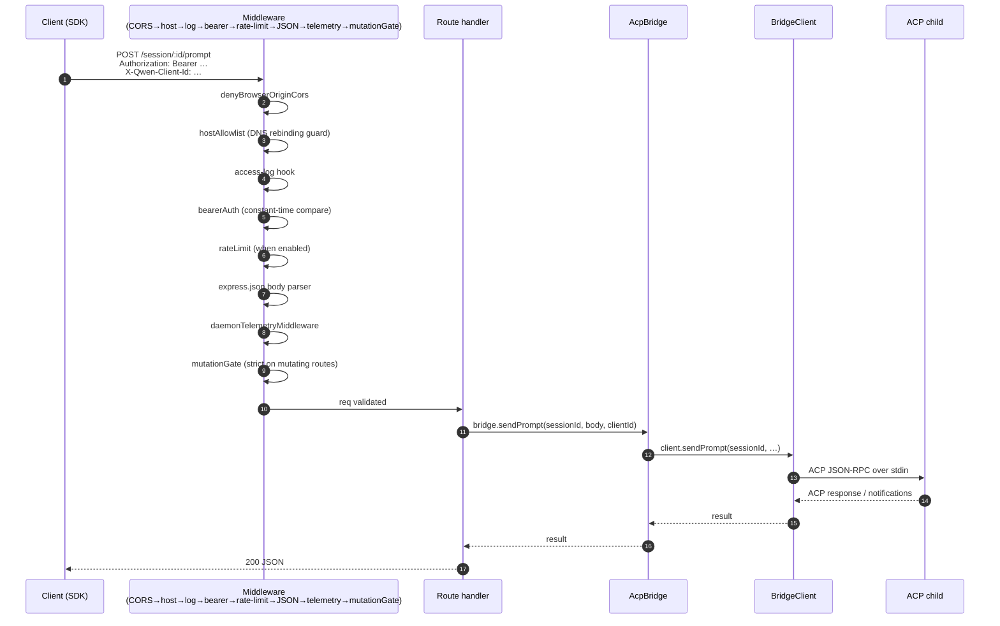
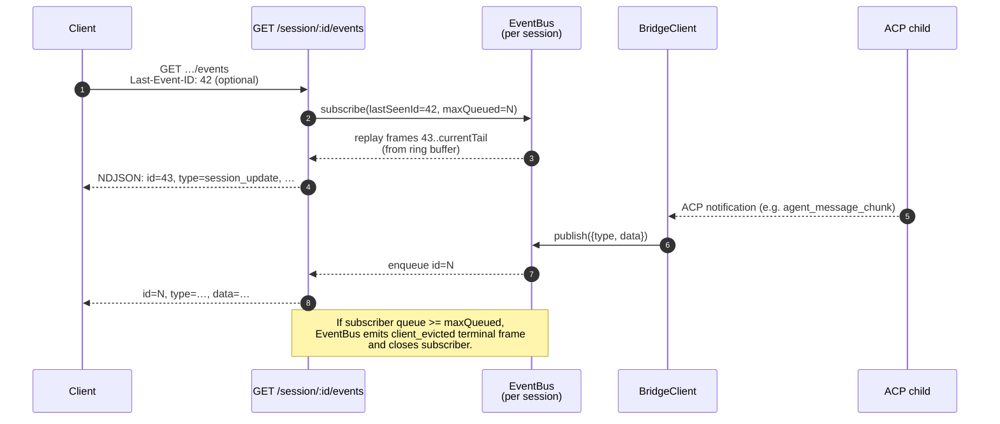
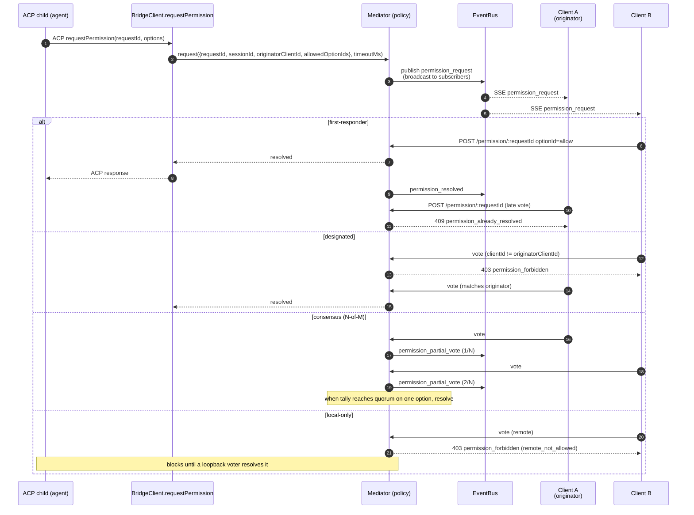
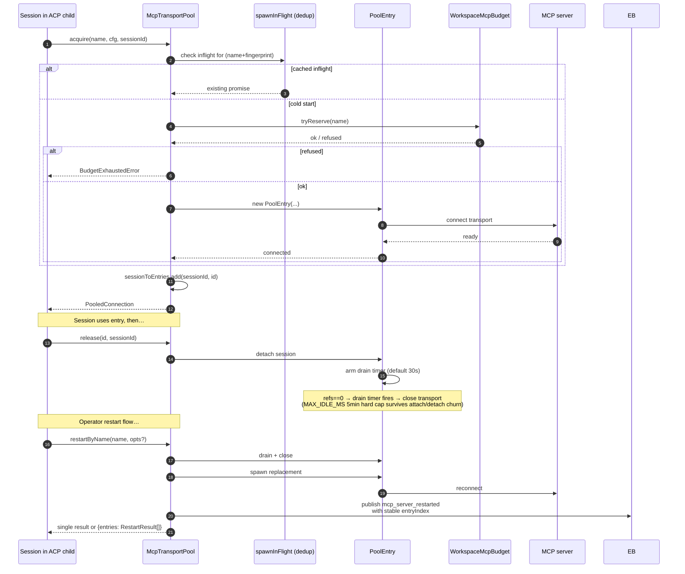
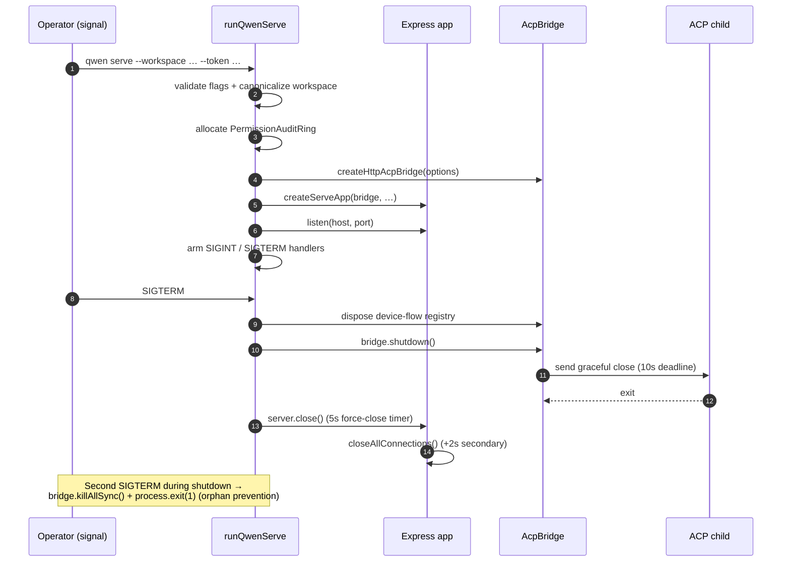

# Архитектура демона

## Обзор

Процесс `qwen serve` — это **один демон = одно рабочее пространство**. Он запускает один HTTP-сервер Express, владеет экземпляром `@qwen-code/acp-bridge` и порождает один дочерний процесс ACP (`qwen --acp`), который выполняет фактическую среду выполнения агента. Несколько клиентов (CLI TUI, IDE companion, IM channel bots, web BFFs, пользовательские скрипты) подключаются через HTTP + SSE и либо используют одну сессию ACP (`sessionScope: 'single'`, по умолчанию), либо разделяют сессии по тредам обсуждения (`sessionScope: 'thread'`).

Внутри дочернего процесса ACP MCP-серверы используются всем рабочим пространством через `McpTransportPool` (F2): один кортеж (имя_сервера + отпечаток_конфигурации) отображается на один транспорт MCP, независимо от того, сколько сессий его обнаруживают. `MultiClientPermissionMediator` (F3) моста координирует голосование за разрешения среди всех подключенных клиентов в рамках одной из четырёх политик.

Этот документ даёт общую картину системы, на которой основаны остальные документы документации. Каждый критический поток показан в виде последовательной диаграммы Mermaid; детали реализации каждого компонента находятся в остальных 18 документах.

## Топология процессов

Процесс демона и дочерний процесс ACP соединены через `AcpChannel` (по умолчанию: реальная пара stdio-каналов дочернего процесса; `inMemoryChannel` для тестов). Вся работа демона определяется этим разделением: трафик HTTP и SSE завершается в демоне, решения агента и вызовы инструментов выполняются в дочернем процессе, а мост соединяет их.

## Карта пакетов

Три границы доверия имеют значение: граница HTTP (цепочка middleware `serve/auth.ts`), граница между мостом и дочерним процессом ACP (NDJSON через stdio, без аутентификации; дочерний процесс неявно доверяет мосту) и граница между агентом и MCP-сервером (агент может вызывать инструменты, которые взаимодействуют с хостом).

## Workflow 1: жизненный цикл HTTP-запроса

Маршруты без стриминга (prompt, cancel, переключение модели, метаданные, CRUD рабочего пространства) завершаются одиночным JSON-ответом. Стриминговый вывод доставляется вне полосы по SSE-каналу, **а не** как фрагментированное HTTP-тело на этом соединении. См. workflow 2.

## Workflow 2: доставка и повтор событий SSE

Кольцевой буфер ограничен (`eventRingSize`, по умолчанию 8000). Если переподключающийся клиент отправляет `Last-Event-ID`, который старше начала буфера, он получает синтетический сигнал догоняния и должен вызвать `loadSession` / `resumeSession`, чтобы восстановить более глубокое состояние. Медленные клиенты вызывают `slow_client_warning` при заполнении очереди на 75% и `client_evicted` при достижении предела.

## Workflow 3: много клиентское согласование разрешений

Кросс-политический запасной выход: любой клиент может проголосовать `CANCEL_VOTE_SENTINEL`, чтобы прервать запрос как `cancelled / agent_cancelled`. Мост защищается от попыток протащить sentinel через обычное поле `optionId` из вызовов по сети (`InvalidPermissionOptionError`).

## Workflow 4: захват / освобождение / перезапуск пула транспортов MCP

`releaseSession(sessionId)` использует обратный индекс `sessionToEntries`, чтобы освободить все записи, удерживаемые сессией, за O(refs). При завершении демона `drainAll()` устанавливает флаг `draining` (отказывая в новых захватах) и ожидает закрытия каждой записи в течение настраиваемого тайм-аута.

## Workflow 5: жизненный цикл — запуск и корректное завершение

Двухфазное завершение важно, потому что выполняющиеся HTTP-запросы, активные подписчики SSE и выполняющиеся вызовы инструментов дочернего процесса ACP требуют ограниченных окон завершения. Если что-то блокируется после этих дедлайнов, вступает в силу путь принудительного закрытия, чтобы зависший дочерний процесс не мог удерживать демон активным.

## Критические файлы

| Область                     | Файл                                                          |
| --------------------------- | ------------------------------------------------------------- |
| Загрузка                    | `packages/cli/src/serve/run-qwen-serve.ts`                    |
| Express-приложение          | `packages/cli/src/serve/server.ts`                            |
| Реестр возможностей         | `packages/cli/src/serve/capabilities.ts`                      |
| Middleware аутентификации   | `packages/cli/src/serve/auth.ts`                              |
| Мост                        | `packages/acp-bridge/src/bridge.ts`                           |
| BridgeClient                | `packages/acp-bridge/src/bridgeClient.ts`                     |
| Посредник разрешений        | `packages/acp-bridge/src/permissionMediator.ts`               |
| EventBus                    | `packages/acp-bridge/src/eventBus.ts`                         |
| Пул транспортов MCP         | `packages/core/src/tools/mcp-transport-pool.ts`               |
| Бюджет MCP рабочего пространства | `packages/core/src/tools/mcp-workspace-budget.ts`         |
| Файловая система рабочего пространства | `packages/cli/src/serve/fs/`                          |
| SDK DaemonClient            | `packages/sdk-typescript/src/daemon/DaemonClient.ts`          |
| SDK SessionClient           | `packages/sdk-typescript/src/daemon/DaemonSessionClient.ts`   |
| Схема событий               | `packages/sdk-typescript/src/daemon/events.ts`                |

## Ссылки

- Вопросы дизайна: [#3803](https://github.com/QwenLM/qwen-code/issues/3803) (дизайн демона), [#4175](https://github.com/QwenLM/qwen-code/issues/4175) (вехи серии F).
- Руководство пользователя: [`../../users/qwen-serve.md`](../../users/qwen-serve.md).
- Справочник по протоколу: [`../qwen-serve-protocol.md`](../qwen-serve-protocol.md).
- Документ дизайна F2: [`../../design/f2-mcp-transport-pool.md`](../../design/f2-mcp-transport-pool.md).
- Заметки по дизайну F2: issue [#4175](https://github.com/QwenLM/qwen-code/issues/4175), коммиты 4–6.