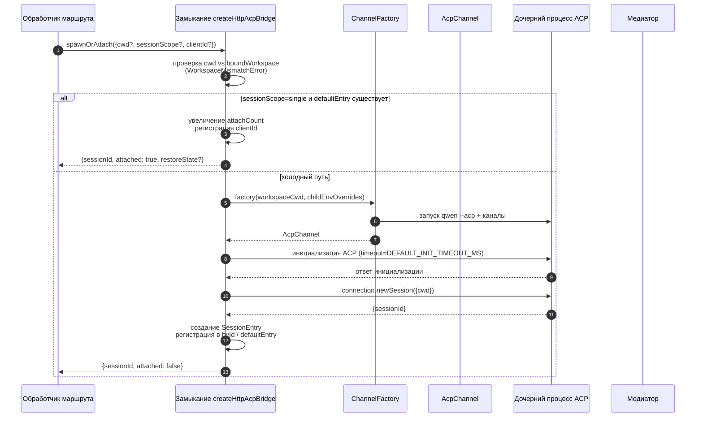
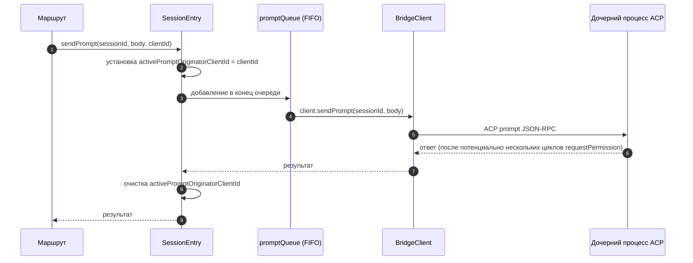
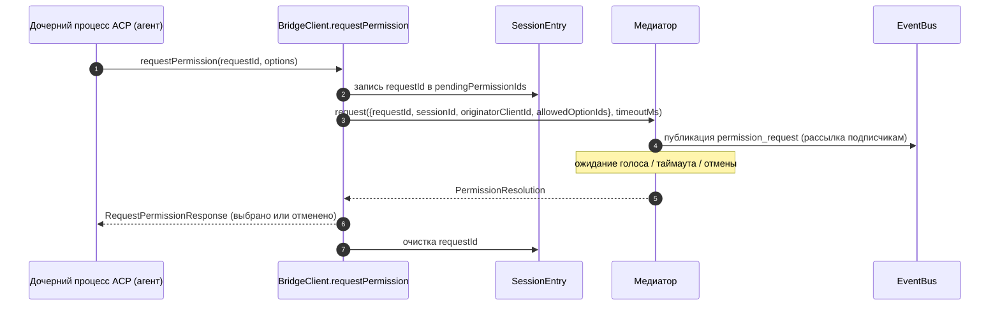
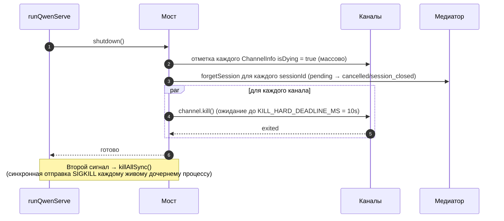

# ACP Bridge

## Обзор

`packages/acp-bridge/` отвечает за границу между HTTP-слоем демона и дочерним процессом ACP. Он используется в `packages/cli/src/serve/` (демон `qwen serve`) и был вынесен в #4175 F1 шаг 3, чтобы будущие потребители (`channels/base/AcpBridge.ts`, компаньон VS Code IDE) могли использовать то же ядро моста, не обращаясь напрямую к пакету CLI.

Мост предоставляет один экземпляр `HttpAcpBridge`, один `AcpChannel` для дочернего процесса ACP, мультиплексированные сессии через этот канал, `EventBus` для каждой сессии, `MultiClientPermissionMediator`, адаптер `BridgeFileSystem` и вспомогательные функции для ACP (`spawnOrAttach`, `loadSession`, `resumeSession`, `sendPrompt`, `cancelSession`, `respondToPermission`, а также RPC-вызовы extMethod для статуса рабочего пространства и перезапуска MCP).

## Обязанности

- Запуск или подключение к дочернему процессу ACP через подключаемую `ChannelFactory`. Фабрика по умолчанию: `defaultSpawnChannelFactory` (подпроцесс `qwen --acp`). В тестах используется `inMemoryChannel`.
- Поддержание `aliveChannels` (реестр каналов) и `byId` (реестр сессий).
- Мультиплексирование N сессий на стороне HTTP в один дочерний процесс ACP через `connection.newSession()`.
- Сериализация промптов для каждой сессии через `promptQueue` (ACP требует только один активный промпт на сессию).
- FIFO-очередь для вызовов `setSessionModel` в каждой сессии, чтобы одновременные подключения с разными моделями не создавали гонку у агента.
- `EventBus` для каждой сессии, который обслуживает `GET /session/:id/events` (см. [`10-event-bus.md`](./10-event-bus.md)).
- Поток разрешений: `BridgeClient.requestPermission` → `MultiClientPermissionMediator.request` → рассылка → сбор голосов → ответ ACP (см. [`04-permission-mediation.md`](./04-permission-mediation.md)).
- Файловый ввод-вывод: адаптер `BridgeFileSystem` для вызовов ACP `readTextFile` / `writeTextFile` (см. [`07-workspace-filesystem.md`](./07-workspace-filesystem.md)).
- RPC-вызовы extMethod для статуса на уровне рабочего пространства (`/workspace/mcp`, `/workspace/skills`, `/workspace/providers`) и перезапуска MCP.
- Жизненный цикл: корректный `shutdown()` с `KILL_HARD_DEADLINE_MS` (10 с) на канал; синхронный `killAllSync()` для принудительного завершения по второму сигналу.

## Архитектура

**Публичная точка входа**: `createHttpAcpBridge(opts: BridgeOptions): HttpAcpBridge` в `packages/acp-bridge/src/bridge.ts`.

**Ключевые типы**:

| Type                            | File                    | Role                                                                                                                                                                                                                  |
| ------------------------------- | ----------------------- | --------------------------------------------------------------------------------------------------------------------------------------------------------------------------------------------------------------------- |
| `HttpAcpBridge`                 | `bridgeTypes.ts`        | Публичный интерфейс: `spawnOrAttach`, `loadSession`, `resumeSession`, `sendPrompt`, `cancelSession`, `subscribeEvents`, `respondToPermission`, `getWorkspaceMcpStatus`, `restartMcpServer`, `shutdown`, `killAllSync`, … |
| `BridgeSession`                 | `bridgeTypes.ts`        | `{ sessionId, workspaceCwd, attached, clientId?, createdAt? }`, возвращается HTTP-обработчикам.                                                                                                                             |
| `BridgeOptions`                 | `bridgeOptions.ts`      | Конфигурация на этапе создания (см. [Конфигурация](#configuration)).                                                                                                                                                       |
| `AcpChannel`                    | `channel.ts`            | `{ stream, kill(), killSync(), exited }` — один NDJSON-канал ACP.                                                                                                                                                    |
| `ChannelFactory`                | `channel.ts`            | `(workspaceCwd, childEnvOverrides?) => Promise<AcpChannel>`.                                                                                                                                                          |
| `BridgeClient`                  | `bridgeClient.ts`       | Обертка над одним ACP `ClientSideConnection`; реализует ACP `Client` (`requestPermission`, `readTextFile`, `writeTextFile`, `sessionUpdate`, `extNotification`).                                                             |
| `EventBus`                      | `eventBus.ts`           | In-memory pub/sub для каждой сессии. См. [`10-event-bus.md`](./10-event-bus.md).                                                                                                                                            |
| `MultiClientPermissionMediator` | `permissionMediator.ts` | Медиатор с четырьмя политиками. См. [`04-permission-mediation.md`](./04-permission-mediation.md).                                                                                                                               |

**Внутреннее состояние (замыкается в `createHttpAcpBridge`)**:

| State           | Shape                           | Purpose                                                                                                                                                                                                                                                                                                                                                                                                  |
| --------------- | ------------------------------- | -------------------------------------------------------------------------------------------------------------------------------------------------------------------------------------------------------------------------------------------------------------------------------------------------------------------------------------------------------------------------------------------------------- |
| `aliveChannels` | `Map<string, ChannelInfo>`      | Реестр каналов по id канала. Каждый `ChannelInfo` содержит `channel`, `connection`, `client` (один `BridgeClient` на канал), `sessionIds: Set<string>`, `pendingRestoreIds`, `statusClosedReject?`, `isDying: boolean`.                                                                                                                                                                            |
| `byId`          | `Map<string, SessionEntry>`     | Реестр сессий по sessionId. Каждый `SessionEntry` содержит `channel`, `connection`, `events: EventBus`, `promptQueue: Promise<void>`, `modelChangeQueue: Promise<void>`, `pendingPermissionIds: Set<string>`, `clientIds: Map<string, count>`, `activePromptOriginatorClientId?`, `attachCount`, `spawnOwnerWantedKill`, `restoreState?`, `sessionLastSeenAt?`, `clientLastSeenAt: Map<string, ms>`. |
| `defaultEntry`  | `SessionEntry \| null`          | "Единственная" сессия, используемая при `sessionScope: 'single'`.                                                                                                                                                                                                                                                                                                                                                 |
| `defaultPolicy` | `PermissionPolicy`              | Настраивается через `BridgeOptions.permissionPolicy`.                                                                                                                                                                                                                                                                                                                                                         |
| `mediator`      | `MultiClientPermissionMediator` | Один на экземпляр моста.                                                                                                                                                                                                                                                                                                                                                                                 |
| Constants       | —                               | `DEFAULT_INIT_TIMEOUT_MS = 10_000`, `MCP_RESTART_TIMEOUT_MS = 300_000`, `DEFAULT_MAX_SESSIONS = 20`, `MAX_EVENT_RING_SIZE = 1_000_000`, `DEFAULT_PERMISSION_TIMEOUT_MS = 5min`, `DEFAULT_MAX_PENDING_PER_SESSION = 64`.                                                                                                                                                                                  |

**Инвариант `isDying`**: любой путь завершения должен синхронно устанавливать `ChannelInfo.isDying = true` **до** ожидания `channel.kill()`. `ensureChannel` считает умирающий канал отсутствующим и создает новый. Без этого флага параллельный `spawnOrAttach`, поступающий во время окна корректного завершения SIGTERM (до 10 с), подключится к транспорту, который вот-вот закроется, и sessionId вызывающего будет возвращать 404 при всех последующих запросах. **Места установки** (должны быть синхронизированы): `ensureChannel` (ошибка инициализации + повторная проверка при позднем завершении), `doSpawn` (ошибка newSession на пустом канале), `killSession` (последняя сессия покидает канал), `shutdown` (массовое завершение).

**Инвариант сохранения `channelInfo`**: **не** очищайте `channelInfo` при установке `isDying = true`. `killAllSync` все равно должен найти канал во время окна корректного завершения SIGTERM, чтобы отправить SIGKILL при `process.exit(1)`. `aliveChannels` хранит умирающую запись до тех пор, пока не сработает `channel.exited`.

**Ограниченная буферизация BridgeClient**: фреймы ACP `extNotification`, поступающие в `BridgeClient` для sessionId, которого еще нет в `byId` (поскольку ответ `connection.newSession` еще не вернулся, но обнаружение MCP внутри `newSession` уже сгенерировало события бюджета), буферизуются в очередь ранних событий, ограниченную `MAX_EARLY_EVENT_SESSIONS = 64` × `MAX_EARLY_EVENTS_PER_SESSION = 32` × `EARLY_EVENT_TTL_MS = 60_000`. В худшем случае это около 400 КБ памяти. Без буферизации первый слот кольца повторной передачи SSE для новой сессии не содержал бы событий, сгенерированных во время её создания.

## Рабочий процесс

### `spawnOrAttach` (основная точка входа)

Ключевые моменты:

- `sessionScope='single'` при существующем `defaultEntry` только увеличивает `attachCount`, регистрирует `clientId` и возвращает `attached: true`.
- Холодный путь запускает ChannelFactory, выполняет инициализацию ACP (`DEFAULT_INIT_TIMEOUT_MS=10s`), вызывает `connection.newSession({cwd})`, затем регистрирует новый `SessionEntry`.
- `SessionLimitExceededError` выбрасывается, когда `byId.size >= maxSessions`.
- `InvalidClientIdError` выбрасывается, если `X-Qwen-Client-Id` выходит за пределы `[A-Za-z0-9._:-]{1,128}`.
- Сборщик отключений в `server.ts` отслеживает владельца процесса запуска через `attachCount`/`spawnOwnerWantedKill`, чтобы не сносить сессию, владелец которой отключился, но к ней уже подключились другие клиенты (см. #3889 BQ9tV).

### Сериализация промптов

Ошибки в конце очереди **проглатываются**, чтобы отклонение предыдущего промпта не отравило последующие; исходный вызывающий все равно получит отклонение в своем возвращенном промисе. `transportClosedReject`, кэшированный в сессии, сравнивает промис промпта с `channel.exited`, чтобы сбой дочернего процесса проявился немедленно, а не привел к зависанию.

### Поток разрешений (высокоуровнево)

`InvalidPermissionOptionError` выбрасывается до медиатора, если попытка голоса по сети пытается внедрить `CANCEL_VOTE_SENTINEL` через обычное поле `optionId` — этот сентинел является единственным механизмом моста для прерывания запроса как `cancelled / agent_cancelled`, и к нему не должно быть случайного доступа из сети. См. [`04-permission-mediation.md`](./04-permission-mediation.md).

### Завершение работы

## Фабрика каналов

`AcpChannel` (`channel.ts`) — это транспортная абстракция моста. В продакшене используется `defaultSpawnChannelFactory` в `spawnChannel.ts`, которая запускает `qwen --acp` как подпроцесс с парой stdio-каналов. В тестах внедряется `inMemoryChannel` для запуска агента внутри процесса. Мост ничего не знает о базовом механизме — ему нужны только `{ stream, kill, killSync, exited }`.

`ChannelFactory` принимает `childEnvOverrides`, чтобы каждый дескриптор демона мог передавать свои переменные окружения бюджета MCP (`QWEN_SERVE_MCP_CLIENT_BUDGET`, `QWEN_SERVE_MCP_BUDGET_MODE`) без изменения `process.env` (что вызвало бы гонку при работе двух встроенных демонов в одном процессе Node).

## Состояние и жизненный цикл

- Создание моста синхронно; первый `spawnOrAttach` запускает дочерний процесс ACP.
- `defaultEntry` живет в течение всего времени работы моста при `sessionScope: 'single'`; канал очищается, когда `sessionIds.size === 0` (после `killSession`) И `isDying` становится true.
- `MAX_EVENT_RING_SIZE = 1_000_000` — это мягкий верхний предел для `BridgeOptions.eventRingSize`, чтобы отловить опечатки оператора до того, как они приведут к OOM (~500 МБ на сессию).
- `DEFAULT_PERMISSION_TIMEOUT_MS = 5 * 60 * 1000` не дает зависшему запросу разрешения блокировать `promptQueue` сессии навсегда.
- `DEFAULT_MAX_PENDING_PER_SESSION = 64` зеркально отражает `DEFAULT_MAX_SUBSCRIBERS`; избыточные вызовы `requestPermission` разрешаются как отмененные с предупреждением в stderr.

## Зависимости

| Upstream                                                                                     | Downstream                                     |
| -------------------------------------------------------------------------------------------- | ---------------------------------------------- |
| `@agentclientprotocol/sdk` — `ClientSideConnection`, `PROTOCOL_VERSION`, типы ACP           | `packages/cli/src/serve/` (демон)         |
| `@qwen-code/qwen-code-core` — `ApprovalMode`, `TrustGateError`, `getCurrentGeminiMdFilename` | `packages/channels/base/` (запланировано, F4)        |
| `node:crypto`, `node:fs`, `node:path`                                                        | `packages/vscode-ide-companion/` (запланировано, F4) |

## Конфигурация

`BridgeOptions` (`bridgeOptions.ts`):

| Key                                           | Default                                            | Purpose                                                                                                               |
| --------------------------------------------- | -------------------------------------------------- | --------------------------------------------------------------------------------------------------------------------- |
| `boundWorkspace`                              | (required)                                         | Канонический путь к рабочему пространству, который применяет мост.                                                                         |
| `sessionScope`                                | `'single'`                                         | `'single'` разделяет одну сессию между всеми клиентами; `'thread'` создает отдельную сессию для каждого потока разговора. |
| `channelFactory`                              | `defaultSpawnChannelFactory`                       | Подключаемая фабрика дочерних процессов ACP.                                                                                          |
| `initializeTimeoutMs`                         | `DEFAULT_INIT_TIMEOUT_MS = 10_000`                 | Таймаут рукопожатия `initialize` ACP.                                                                                   |
| `maxSessions`                                 | `DEFAULT_MAX_SESSIONS = 20`                        | Ограничение на `byId.size`. `0` / `Infinity` = без ограничений; NaN/отрицательное значение вызывает ошибку.                                                |
| `eventRingSize`                               | `DEFAULT_RING_SIZE` (из `eventBus.ts`)           | Кольцо событий для каждой сессии; мягко ограничено `MAX_EVENT_RING_SIZE`.                                                         |
| `permissionResponseTimeoutMs`                 | `DEFAULT_PERMISSION_TIMEOUT_MS = 5 min`            | Абсолютное время ожидания для медиатора на каждый запрос.                                                                               |
| `maxPendingPermissionsPerSession`             | `DEFAULT_MAX_PENDING_PER_SESSION = 64`             | Обратное давление для агентов с высокой нагрузкой.                                                                                   |
| `childEnvOverrides`                           | `{}`                                               | Добавления / очистки переменных окружения для каждого дескриптора дочернего процесса ACP.                                                                  |
| `persistApprovalMode`, `persistDisabledTools` | —                                                  | Хуки записи настроек для маршрутов мутации Wave 4.                                                                  |
| `contextFilename`                             | из `context.fileName` в `settings.json`          | Переопределяет `getCurrentGeminiMdFilename`.                                                                               |
| `statusProvider`                              | (none)                                             | Предварительные проверки хоста демона (`DaemonStatusProvider`).                                                                 |
| `fileSystem`                                  | (none)                                             | Адаптер `BridgeFileSystem` для ACP `readTextFile` / `writeTextFile`.                                                  |
| `permissionPolicy`                            | из `policy.permissionStrategy` в `settings.json` | Одно из `first-responder` / `designated` / `consensus` / `local-only`.                                                 |
| `permissionConsensusQuorum`                   | из `settings.json`                               | N для политики консенсуса.                                                                                               |
| `permissionAudit`                             | `createNoOpPermissionAuditPublisher()`             | Подключение к `PermissionAuditRing` для журнала аудита.                                                                    |
| `channelIdleTimeoutMs`                        | `0`                                                | Поддерживать дочерний процесс ACP активным в течение этого количества миллисекунд после закрытия последней сессии.                                    |
## Дополнительные методы bridge

В дополнение к основным вызовам `spawnOrAttach`, `sendPrompt`, `cancelSession`,
`respondToPermission`, `loadSession` и `resumeSession`, интерфейс
`HttpAcpBridge` теперь включает следующие вспомогательные методы для взаимодействия с демоном:

| Метод                                                        | Назначение                                  |
| ------------------------------------------------------------ | ------------------------------------------- |
| `generateSessionRecap(sessionId, context?)`                  | Генерация краткого описания сессии в одну строку. |
| `generateSessionBtw(sessionId, question, signal?, context?)` | Ответ на побочный вопрос / prompt "btw".    |
| `executeShellCommand(sessionId, command, signal?, context?)` | Выполнение shell-команды на хосте демона.   |
| `getSessionContextUsageStatus(sessionId, opts?)`             | Возврат информации об использовании context-window. |
| `getSessionSupportedCommandsStatus(sessionId)`               | Возврат списка доступных slash-команд.      |
| `getSessionTasksStatus(sessionId)`                           | Возврат снимка состояния фоновых задач.     |
| `getSessionStatsStatus(sessionId)`                           | Возврат статистики использования сессии.    |
| `setSessionApprovalMode(sessionId, mode, opts, context?)`    | Обновление режима подтверждения (approval mode) для сессии. |
| `detachClient(sessionId, clientId?)`                         | Явное отключение клиента.                   |
| `addRuntimeMcpServer(name, config, originatorClientId)`      | Добавление MCP-сервера в runtime.           |
| `removeRuntimeMcpServer(name, originatorClientId)`           | Удаление MCP-сервера в runtime.             |
| `manageMcpServer(serverName, action, originatorClientId)`    | Включение / отключение / аутентификация / сброс аутентификации. |
| `generateWorkspaceAgent(description, originatorClientId)`    | Генерация определения subagent с помощью ИИ.|
| `preheat()`                                                  | Прогрев дочернего процесса ACP перед первой сессией. |
| `getSessionLastEventId(sessionId)`                           | Чтение монотонного id события сессии.       |
| `getWorkspaceToolsStatus()`                                  | Возврат снимка встроенного реестра инструментов. |
| `getWorkspaceMcpToolsStatus(serverName)`                     | Возврат инструментов для конкретного MCP-сервера. |

Поле `BridgeSpawnRequest.sessionScope` было переименовано из `'per-client'` в
`'thread'`. `BridgeRestoredSession` теперь содержит `compactedReplay`,
`liveJournal` и `lastEventId`. `BridgeClientRequestContext` — это контекст запроса,
передаваемый через вызовы bridge; он включает `clientId`,
`fromLoopback: boolean` и `promptId`.

## Ограничения и известные проблемы

- `MCP_RESTART_TIMEOUT_MS = 300_000` (5 мин) — таймаут bridge для `/workspace/mcp/:server/restart` намеренно сделан большим, так как `McpClientManager.MAX_DISCOVERY_TIMEOUT_MS` для stdio-серверов может достигать 5 минут. Более короткий дедлайн приводил бы к ложным таймаутам, пока дочерний процесс ACP продолжает переподключение в фоне.
- `BridgeOptions.eventRingSize > 1_000_000` вызывает исключение при создании.
- `connection.unstable_resumeSession` предоставляется через стабильную возможность (capability) демона `session_resume`; `unstable_session_resume` по-прежнему объявляется как устаревший алиас для обратной совместимости со старыми SDK. Клиентам следует использовать feature-detection для `session_resume`.
- Пакет bridge — это `@qwen-code/acp-bridge`. Текущий код импортирует примитивы event-bus и status напрямую из подпутей пакета; `serve/acp-session-bridge.ts` остается как локальный для CLI фасад совместимости для более широкой поверхности bridge.

## Ссылки

- `packages/acp-bridge/src/bridge.ts` (в частности, `createHttpAcpBridge` на строке 350+)
- `packages/acp-bridge/src/bridgeClient.ts`
- `packages/acp-bridge/src/bridgeTypes.ts`
- `packages/acp-bridge/src/bridgeOptions.ts`
- `packages/acp-bridge/src/channel.ts`
- `packages/acp-bridge/src/spawnChannel.ts`
- `packages/acp-bridge/src/bridgeErrors.ts`
- Задачи: [#3803](https://github.com/QwenLM/qwen-code/issues/3803), [#4175](https://github.com/QwenLM/qwen-code/issues/4175).