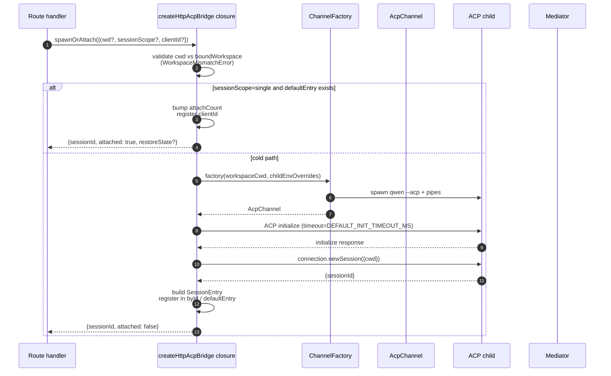
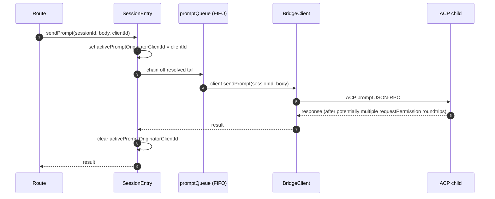
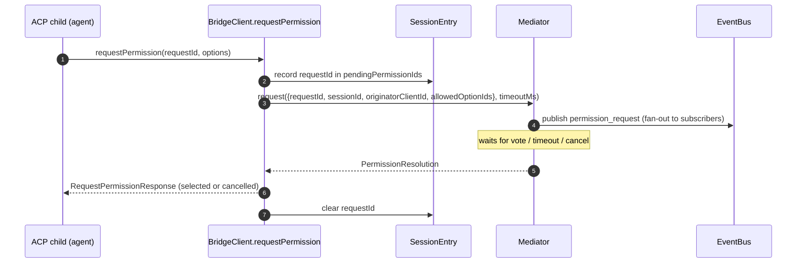
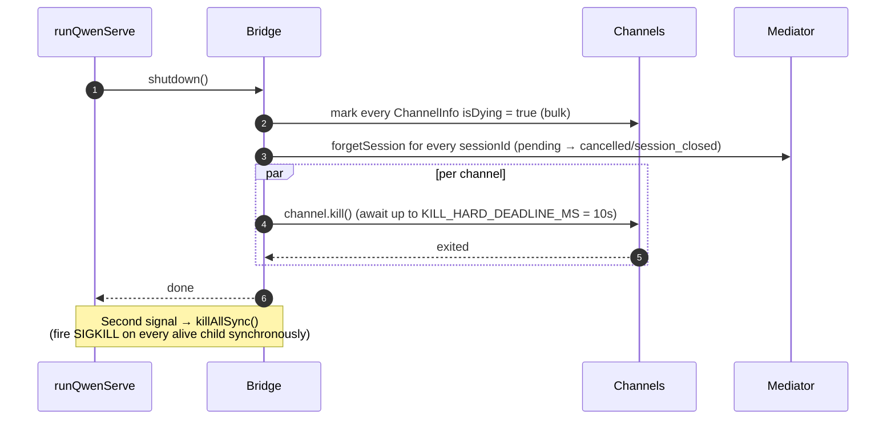

# ACP Bridge

## Обзор

`packages/acp-bridge/` владеет границей между HTTP-слоем демона и дочерним процессом ACP. Он используется `packages/cli/src/serve/` (демон `qwen serve`) и был выделен в #4175 F1 шаг 3, чтобы будущие потребители (`channels/base/AcpBridge.ts`, компаньон VS Code IDE) могли использовать тот же базовый мост, не залезая в пакет CLI.

Мост предоставляет один экземпляр `HttpAcpBridge`, один `AcpChannel` для дочернего процесса ACP, мультиплексированные сессии по этому каналу, `EventBus` для каждой сессии, `MultiClientPermissionMediator`, адаптер `BridgeFileSystem` и вспомогательные функции, ориентированные на ACP (`spawnOrAttach`, `loadSession`, `resumeSession`, `sendPrompt`, `cancelSession`, `respondToPermission`, а также вызовы extMethod RPC для статуса рабочего пространства и перезапуска MCP).

## Обязанности

- Запустить или присоединиться к дочернему процессу ACP через подключаемую `ChannelFactory`. Фабрика по умолчанию: `defaultSpawnChannelFactory` (подпроцесс `qwen --acp`). Тесты вводят `inMemoryChannel`.
- Поддерживать `aliveChannels` (реестр каналов) и `byId` (реестр сессий).
- Мультиплексировать N HTTP-сторонних сессий в один дочерний процесс ACP через `connection.newSession()`.
- Сериализовать запросы для каждой сессии через `promptQueue` (ACP требует одного активного запроса на сессию).
- Per-session FIFO для вызовов `setSessionModel`, чтобы одновременные присоединения с разными моделями не создавали гонку за агента.
- Per-session `EventBus`, который управляет `GET /session/:id/events` (см. [`10-event-bus.md`](./10-event-bus.md)).
- Поток разрешений: `BridgeClient.requestPermission` → `MultiClientPermissionMediator.request` → веерная рассылка → сбор голосов → ответ ACP (см. [`04-permission-mediation.md`](./04-permission-mediation.md)).
- Ввод/вывод файлов: адаптер `BridgeFileSystem` для вызовов ACP `readTextFile` / `writeTextFile` (см. [`07-workspace-filesystem.md`](./07-workspace-filesystem.md)).
- Вызовы extMethod RPC для статуса на уровне рабочего пространства (`/workspace/mcp`, `/workspace/skills`, `/workspace/providers`) и перезапуска MCP.
- Жизненный цикл: корректное `shutdown()` с `KILL_HARD_DEADLINE_MS` (10 с) на канал; синхронный `killAllSync()` для принудительного выхода по второму сигналу.

## Архитектура

**Публичная точка входа**: `createHttpAcpBridge(opts: BridgeOptions): HttpAcpBridge` в `packages/acp-bridge/src/bridge.ts`.

**Ключевые типы**:

| Тип                            | Файл                    | Роль                                                                                                                                                                                                                  |
| ------------------------------- | ----------------------- | --------------------------------------------------------------------------------------------------------------------------------------------------------------------------------------------------------------------- |
| `HttpAcpBridge`                 | `bridgeTypes.ts`        | Публичный интерфейс: `spawnOrAttach`, `loadSession`, `resumeSession`, `sendPrompt`, `cancelSession`, `subscribeEvents`, `respondToPermission`, `getWorkspaceMcpStatus`, `restartMcpServer`, `shutdown`, `killAllSync`, … |
| `BridgeSession`                 | `bridgeTypes.ts`        | `{ sessionId, workspaceCwd, attached, clientId?, createdAt? }` возвращается HTTP-обработчикам.                                                                                                                            |
| `BridgeOptions`                 | `bridgeOptions.ts`      | Конфигурация во время создания (см. [Конфигурация](#configuration)).                                                                                                                                                       |
| `AcpChannel`                    | `channel.ts`            | `{ stream, kill(), killSync(), exited }` — один ACP NDJSON-канал.                                                                                                                                                     |
| `ChannelFactory`                | `channel.ts`            | `(workspaceCwd, childEnvOverrides?) => Promise<AcpChannel>`.                                                                                                                                                           |
| `BridgeClient`                  | `bridgeClient.ts`       | Оборачивает одно ACP `ClientSideConnection`; реализует ACP `Client` (`requestPermission`, `readTextFile`, `writeTextFile`, `sessionUpdate`, `extNotification`).                                                           |
| `EventBus`                      | `eventBus.ts`           | In-memory pub/sub для каждой сессии. См. [`10-event-bus.md`](./10-event-bus.md).                                                                                                                                            |
| `MultiClientPermissionMediator` | `permissionMediator.ts` | Медиатор с четырьмя политиками. См. [`04-permission-mediation.md`](./04-permission-mediation.md).                                                                                                                       |

**Внутреннее состояние (замкнутое в `createHttpAcpBridge`)**:

| Состояние       | Форма                           | Назначение                                                                                                                                                                                                                                                                                                                                                                                                  |
| --------------- | ------------------------------- | -------------------------------------------------------------------------------------------------------------------------------------------------------------------------------------------------------------------------------------------------------------------------------------------------------------------------------------------------------------------------------------------------------- |
| `aliveChannels` | `Map<string, ChannelInfo>`      | Реестр каналов, ключ — идентификатор канала. Каждый `ChannelInfo` содержит `channel`, `connection`, `client` (один `BridgeClient` на канал), `sessionIds: Set<string>`, `pendingRestoreIds`, `statusClosedReject?`, `isDying: boolean`.                                                                                                                                                                            |
| `byId`          | `Map<string, SessionEntry>`     | Реестр сессий, ключ — sessionId. Каждый `SessionEntry` содержит `channel`, `connection`, `events: EventBus`, `promptQueue: Promise<void>`, `modelChangeQueue: Promise<void>`, `pendingPermissionIds: Set<string>`, `clientIds: Map<string, count>`, `activePromptOriginatorClientId?`, `attachCount`, `spawnOwnerWantedKill`, `restoreState?`, `sessionLastSeenAt?`, `clientLastSeenAt: Map<string, ms>`. |
| `defaultEntry`  | `SessionEntry \| null`          | «Одиночная» сессия, используемая при `sessionScope: 'single'`.                                                                                                                                                                                                                                                                                                                                                 |
| `defaultPolicy` | `PermissionPolicy`              | Настраивается через `BridgeOptions.permissionPolicy`.                                                                                                                                                                                                                                                                                                                                                         |
| `mediator`      | `MultiClientPermissionMediator` | Один на экземпляр моста.                                                                                                                                                                                                                                                                                                                                                                                 |
| Константы       | —                               | `DEFAULT_INIT_TIMEOUT_MS = 10_000`, `MCP_RESTART_TIMEOUT_MS = 300_000`, `DEFAULT_MAX_SESSIONS = 20`, `MAX_EVENT_RING_SIZE = 1_000_000`, `DEFAULT_PERMISSION_TIMEOUT_MS = 5min`, `DEFAULT_MAX_PENDING_PER_SESSION = 64`.                                                                                                                                                                                  |

**Инвариант `isDying`**: любой путь завершения должен синхронно установить `ChannelInfo.isDying = true` **до** ожидания `channel.kill()`. `ensureChannel` считает умирающий канал отсутствующим и создаёт новый. Без этого флага параллельный вызов `spawnOrAttach`, поступающий в окно ожидания SIGTERM (до 10 с), присоединился бы к транспорту, который вот-вот закроется, и у вызывающего sessionId вернул бы 404 на все последующие запросы. **Места установки** (должны быть синхронизированы): `ensureChannel` (сбой инициализации + повторная проверка при позднем завершении), `doSpawn` (сбой newSession на пустом канале), `killSession` (последняя сессия уходит), `shutdown` (массовое завершение).

**Инвариант сохранения `channelInfo`**: **не** очищайте `channelInfo` при установке `isDying = true`. `killAllSync` всё ещё должен найти канал в окне ожидания SIGTERM, чтобы отправить SIGKILL при `process.exit(1)`. `aliveChannels` удерживает умирающую запись до срабатывания `channel.exited`.

**Ограниченная буферизация BridgeClient**: кадры ACP `extNotification`, поступающие на `BridgeClient` для sessionId, ещё не находящегося в `byId` (потому что ответ `connection.newSession` ещё не вернулся, но обнаружение MCP внутри `newSession` уже выдало события бюджета), буферизуются в очередь ранних событий, ограниченную `MAX_EARLY_EVENT_SESSIONS = 64` × `MAX_EARLY_EVENTS_PER_SESSION = 32` × `EARLY_EVENT_TTL_MS = 60_000`. Худший случай — примерно 400 КБ кучи. Без буферизации первый слот кольца повторного воспроизведения SSE для новой сессии потерял бы события, произошедшие во время её создания.

## Workflow

### `spawnOrAttach` (основная точка входа)

Ключевые моменты:

- `sessionScope='single'` с существующим `defaultEntry` только увеличивает `attachCount`, регистрирует `clientId` и возвращает `attached: true`.
- Холодный путь запускает ChannelFactory, выполняет ACP `initialize` (`DEFAULT_INIT_TIMEOUT_MS=10s`), вызывает `connection.newSession({cwd})`, затем регистрирует новый `SessionEntry`.
- `SessionLimitExceededError` выбрасывается, когда `byId.size >= maxSessions`.
- `InvalidClientIdError` выбрасывается, если `X-Qwen-Client-Id` не соответствует `[A-Za-z0-9._:-]{1,128}`.
- Сборщик отключённых соединений в `server.ts` отслеживает владельца запуска через `attachCount`/`spawnOwnerWantedKill`, чтобы не разрушать сессию, владелец которой отключился, но другие клиенты уже присоединились (рецензия #3889 BQ9tV).

### Сериализация запросов

Ошибки в хвосте очереди **проглатываются**, чтобы отклонение предыдущего запроса не отравляло последующие; исходный вызывающий всё равно получает отклонение через собственное возвращаемое обещание. Кэшированный на сессии `transportClosedReject` соперничает с обещанием запроса против `channel.exited`, так что аварийное завершение дочернего процесса проявляется немедленно, а не зависает.

### Поток разрешений (высокоуровневый)

`InvalidPermissionOptionError` выбрасывается до медиатора, когда голос с провода пытается вставить `CANCEL_VOTE_SENTINEL` через обычное поле `optionId` — sentinel — единственный запасной выход моста для прерывания запроса как `cancelled / agent_cancelled` и не должен быть случайно достижим с провода. См. [`04-permission-mediation.md`](./04-permission-mediation.md).

### Завершение работы

## Фабрика каналов

`AcpChannel` (`channel.ts`) — транспортная абстракция моста. В производстве используется `defaultSpawnChannelFactory` из `spawnChannel.ts`, которая запускает `qwen --acp` как подпроцесс с парой stdio-каналов. Тесты вводят `inMemoryChannel` для запуска агента внутри процесса. Мост ничего не знает о базовом механизме — ему нужно только `{ stream, kill, killSync, exited }`.

`ChannelFactory` принимает `childEnvOverrides`, чтобы каждый дескриптор демона мог передавать свои переменные окружения для бюджета MCP (`QWEN_SERVE_MCP_CLIENT_BUDGET`, `QWEN_SERVE_MCP_BUDGET_MODE`) без мутации `process.env` (что вызвало бы гонку, если два встроенных демона работают в одном процессе Node).

## Состояние и жизненный цикл

- Создание моста синхронно; первый `spawnOrAttach` холодно запускает дочерний процесс ACP.
- `defaultEntry` живёт в течение всего времени жизни моста при `sessionScope: 'single'`; канал удаляется, когда `sessionIds.size === 0` (после `killSession`) И `isDying` становится true.
- `MAX_EVENT_RING_SIZE = 1_000_000` — мягкая верхняя граница для `BridgeOptions.eventRingSize`, чтобы отлавливать опечатки операторов до OOM порядка ~500 МБ на сессию.
- `DEFAULT_PERMISSION_TIMEOUT_MS = 5 * 60 * 1000` не даёт застрявшему запросу разрешения навсегда блокировать `promptQueue` для сессии.
- `DEFAULT_MAX_PENDING_PER_SESSION = 64` зеркалирует `DEFAULT_MAX_SUBSCRIBERS`; избыточные вызовы `requestPermission` разрешаются как отменённые с предупреждением в stderr.

## Зависимости

| Вышестоящие                                                                                     | Нижестоящие                                     |
| -------------------------------------------------------------------------------------------- | ---------------------------------------------- |
| `@agentclientprotocol/sdk` — `ClientSideConnection`, `PROTOCOL_VERSION`, типы ACP            | `packages/cli/src/serve/` (демон)              |
| `@qwen-code/qwen-code-core` — `ApprovalMode`, `TrustGateError`, `getCurrentGeminiMdFilename` | `packages/channels/base/` (планируется, F4)    |
| `node:crypto`, `node:fs`, `node:path`                                                        | `packages/vscode-ide-companion/` (планируется, F4) |

## Конфигурация

`BridgeOptions` (`bridgeOptions.ts`):

| Ключ                                           | Значение по умолчанию                                | Назначение                                                                                                               |
| --------------------------------------------- | -------------------------------------------------- | --------------------------------------------------------------------------------------------------------------------- |
| `boundWorkspace`                              | (обязательно)                                      | Канонический путь рабочего пространства, которое принудительно устанавливает мост.                                          |
| `sessionScope`                                | `'single'`                                         | `'single'` разделяет одну сессию между всеми клиентами; `'thread'` создаёт отдельную сессию для каждой нити разговора. |
| `channelFactory`                              | `defaultSpawnChannelFactory`                       | Подключаемая фабрика дочернего процесса ACP.                                                                          |
| `initializeTimeoutMs`                         | `DEFAULT_INIT_TIMEOUT_MS = 10_000`                 | Тайм-аут рукопожатия ACP `initialize`.                                                                                |
| `maxSessions`                                 | `DEFAULT_MAX_SESSIONS = 20`                        | Ограничение на `byId.size`. `0` / `Infinity` = без ограничений; NaN/отрицательное выбрасывает исключение.             |
| `eventRingSize`                               | `DEFAULT_RING_SIZE` (из `eventBus.ts`)             | Кольцо событий для каждой сессии; мягкое ограничение на `MAX_EVENT_RING_SIZE`.                                        |
| `permissionResponseTimeoutMs`                 | `DEFAULT_PERMISSION_TIMEOUT_MS = 5 мин`            | Максимальное время ожидания для каждого запроса медиатора.                                                              |
| `maxPendingPermissionsPerSession`             | `DEFAULT_MAX_PENDING_PER_SESSION = 64`             | Обратное давление для высоконагруженных агентов.                                                                        |
| `childEnvOverrides`                           | `{}`                                               | Добавления/очистка env для каждого дескриптора дочернего процесса ACP.                                                |
| `persistApprovalMode`, `persistDisabledTools` | —                                                  | Хуки записи настроек для маршрутов мутации Wave 4.                                                                     |
| `contextFilename`                             | из `settings.json`'s `context.fileName`            | Переопределяет `getCurrentGeminiMdFilename`.                                                                           |
| `statusProvider`                              | (нет)                                              | Ячейки предварительной проверки хоста демона (`DaemonStatusProvider`).                                                |
| `fileSystem`                                  | (нет)                                              | Адаптер `BridgeFileSystem` для вызовов ACP `readTextFile` / `writeTextFile`.                                           |
| `permissionPolicy`                            | из `settings.json`'s `policy.permissionStrategy`   | Одна из `first-responder` / `designated` / `consensus` / `local-only`.                                                 |
| `permissionConsensusQuorum`                   | из `settings.json`                                 | N для политики консенсуса.                                                                                               |
| `permissionAudit`                             | `createNoOpPermissionAuditPublisher()`              | Подключение к `PermissionAuditRing` для журнала аудита.                                                                  |
| `channelIdleTimeoutMs`                        | `0`                                                | Держать дочерний процесс ACP живым в течение этого количества миллисекунд после закрытия последней сессии.             |
## Дополнительные методы bridge

В дополнение к основным вызовам `spawnOrAttach`, `sendPrompt`, `cancelSession`,
`respondToPermission`, `loadSession` и `resumeSession`, интерфейс
`HttpAcpBridge` теперь включает следующие вспомогательные методы, ориентированные на демона:

| Метод                                                       | Назначение                                       |
| ------------------------------------------------------------ | --------------------------------------------- |
| `generateSessionRecap(sessionId, context?)`                  | Сгенерировать однострочное резюме сессии.            |
| `generateSessionBtw(sessionId, question, signal?, context?)` | Ответить на побочный вопрос / подсказку "кстати". |
| `executeShellCommand(sessionId, command, signal?, context?)` | Выполнить команду оболочки на хосте демона.       |
| `getSessionContextUsageStatus(sessionId, opts?)`             | Вернуть информацию об использовании контекстного окна.                  |
| `getSessionSupportedCommandsStatus(sessionId)`               | Вернуть доступные слэш-команды.              |
| `getSessionTasksStatus(sessionId)`                           | Вернуть снимок фоновых задач.            |
| `getSessionStatsStatus(sessionId)`                           | Вернуть статистику использования сессии.              |
| `setSessionApprovalMode(sessionId, mode, opts, context?)`    | Обновить режим одобрения для сессии.           |
| `detachClient(sessionId, clientId?)`                         | Явно открепить клиент.                   |
| `addRuntimeMcpServer(name, config, originatorClientId)`      | Добавить MCP-сервер во время выполнения.                 |
| `removeRuntimeMcpServer(name, originatorClientId)`           | Удалить MCP-сервер во время выполнения.              |
| `manageMcpServer(serverName, action, originatorClientId)`    | Включить / отключить / аутентифицировать / очистить аутентификацию. |
| `generateWorkspaceAgent(description, originatorClientId)`    | Сгенерировать определение субагента с помощью ИИ.       |
| `preheat()`                                                  | Прогреть дочерний процесс ACP перед первой сессией.  |
| `getSessionLastEventId(sessionId)`                           | Прочитать монотонный идентификатор события сессии.        |
| `getWorkspaceToolsStatus()`                                  | Вернуть снимок встроенного реестра инструментов.   |
| `getWorkspaceMcpToolsStatus(serverName)`                     | Вернуть инструменты для конкретного MCP-сервера.       |

`BridgeSpawnRequest.sessionScope` был переименован из `'per-client'` в
`'thread'`. `BridgeRestoredSession` теперь содержит `compactedReplay`,
`liveJournal` и `lastEventId`. `BridgeClientRequestContext` — это контекст запроса,
передаваемый через вызовы bridge; он содержит `clientId`,
`fromLoopback: boolean` и `promptId`.

## Предостережения и известные ограничения

- `MCP_RESTART_TIMEOUT_MS = 300_000` (5 мин) — тайм-аут моста для `/workspace/mcp/:server/restart` намеренно велик, потому что `McpClientManager.MAX_DISCOVERY_TIMEOUT_MS` может достигать 5 минут для stdio-серверов. Меньший лимит приводил бы к ложным тайм-аутам, пока дочерний процесс ACP продолжал бы переподключаться в фоне.
- `BridgeOptions.eventRingSize > 1_000_000` вызывает исключение при создании.
- `connection.unstable_resumeSession` предоставляется через стабильную возможность демона `session_resume`; `unstable_session_resume` остаётся рекламируемым устаревшим псевдонимом совместимости для старых SDK. Клиентам следует использовать определение возможности `session_resume`.
- Пакет bridge — `@qwen-code/acp-bridge`, и он потребляется через прокси-реэкспорты в `serve/event-bus.ts`, `serve/status.ts`, `serve/httpAcpBridge.ts` для обратной совместимости с импортными путями до F1. Новый код должен импортировать напрямую.

## Ссылки

- `packages/acp-bridge/src/bridge.ts` (особенно `createHttpAcpBridge` на строке 350+)
- `packages/acp-bridge/src/bridgeClient.ts`
- `packages/acp-bridge/src/bridgeTypes.ts`
- `packages/acp-bridge/src/bridgeOptions.ts`
- `packages/acp-bridge/src/channel.ts`
- `packages/acp-bridge/src/spawnChannel.ts`
- `packages/acp-bridge/src/bridgeErrors.ts`
- Issues: [#3803](https://github.com/QwenLM/qwen-code/issues/3803), [#4175](https://github.com/QwenLM/qwen-code/issues/4175).