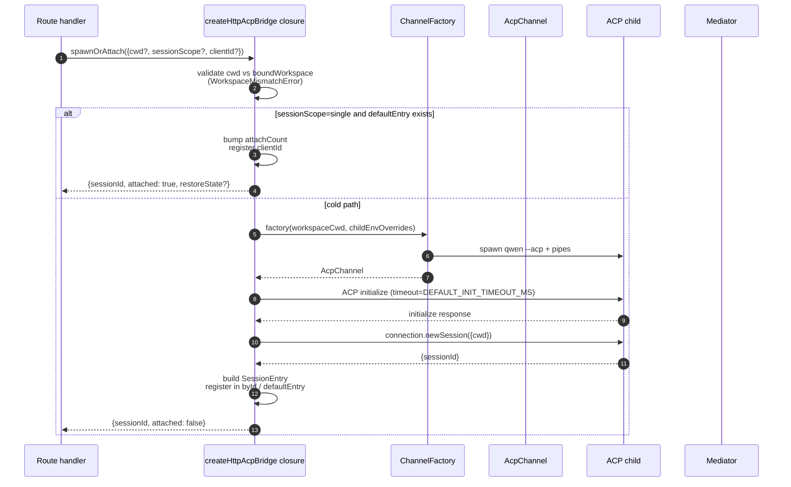
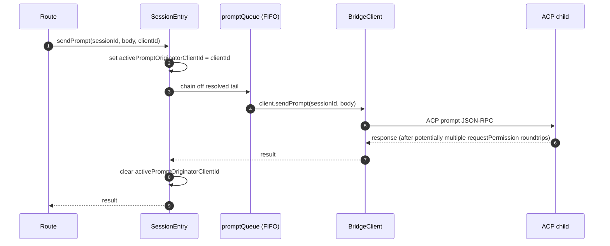
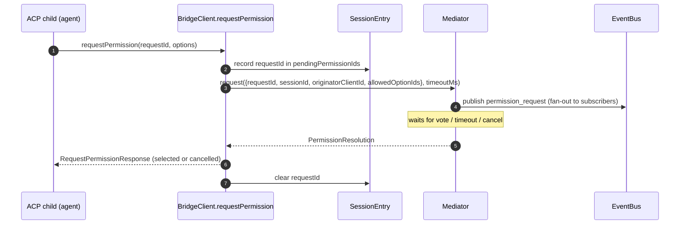
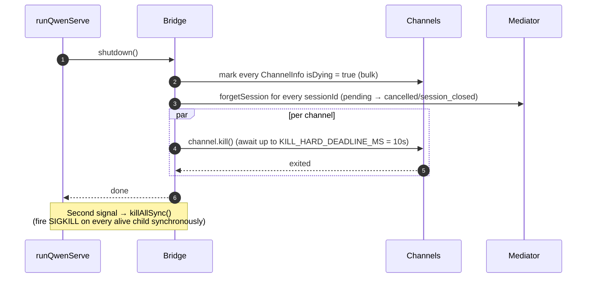

# ACP Bridge

## Обзор

`packages/acp-bridge/` отвечает за границу между HTTP-уровнем демона и дочерним процессом ACP. Он используется в `packages/cli/src/serve/` (демон `qwen serve`) и был выделен в #4175 F1 step 3, чтобы будущие потребители (`channels/base/AcpBridge.ts`, компаньон VS Code IDE) могли использовать тот же базовый мост, не обращаясь к пакету CLI.

Мост предоставляет один экземпляр `HttpAcpBridge`, один `AcpChannel` для дочернего процесса ACP, мультиплексированные сессии через этот канал, `EventBus` для каждой сессии, `MultiClientPermissionMediator`, адаптер `BridgeFileSystem`, а также вспомогательные функции, ориентированные на ACP (`spawnOrAttach`, `loadSession`, `resumeSession`, `sendPrompt`, `cancelSession`, `respondToPermission`, а также вызовы extMethod RPC для статуса рабочей области и перезапуска MCP).

## Обязанности

- Запуск или подключение к дочернему процессу ACP через подключаемую `ChannelFactory`. Фабрика по умолчанию: `defaultSpawnChannelFactory` (подпроцесс `qwen --acp`). Тесты используют `inMemoryChannel`.
- Поддержка `aliveChannels` (реестр каналов) и `byId` (реестр сессий).
- Мультиплексирование N HTTP-сессий в один дочерний процесс ACP через `connection.newSession()`.
- Сериализация запросов для каждой сессии через `promptQueue` (ACP требует один активный запрос на сессию).
- FIFO для вызовов `setSessionModel` в каждой сессии, чтобы параллельные подключения с разными моделями не конфликтовали с агентом.
- `EventBus` для каждой сессии, который управляет `GET /session/:id/events` (см. [`10-event-bus.md`](./10-event-bus.md)).
- Процесс разрешения: `BridgeClient.requestPermission` → `MultiClientPermissionMediator.request` → рассылка → сбор голосов → ответ ACP (см. [`04-permission-mediation.md`](./04-permission-mediation.md)).
- Ввод/вывод файлов: адаптер `BridgeFileSystem` для вызовов ACP `readTextFile` / `writeTextFile` (см. [`07-workspace-filesystem.md`](./07-workspace-filesystem.md)).
- Вызовы extMethod RPC для статуса рабочей области (`/workspace/mcp`, `/workspace/skills`, `/workspace/providers`) и перезапуска MCP.
- Жизненный цикл: корректное завершение `shutdown()` с `KILL_HARD_DEADLINE_MS` (10 с) для каждого канала; синхронное `killAllSync()` для принудительного выхода по второму сигналу.

## Архитектура

**Публичная точка входа**: `createHttpAcpBridge(opts: BridgeOptions): HttpAcpBridge` в `packages/acp-bridge/src/bridge.ts`.

**Ключевые типы**:

| Тип                              | Файл                    | Роль                                                                                                                                                                                                                  |
| -------------------------------- | ----------------------- | --------------------------------------------------------------------------------------------------------------------------------------------------------------------------------------------------------------------- |
| `HttpAcpBridge`                  | `bridgeTypes.ts`        | Публичный интерфейс: `spawnOrAttach`, `loadSession`, `resumeSession`, `sendPrompt`, `cancelSession`, `subscribeEvents`, `respondToPermission`, `getWorkspaceMcpStatus`, `restartMcpServer`, `shutdown`, `killAllSync`, … |
| `BridgeSession`                  | `bridgeTypes.ts`        | `{ sessionId, workspaceCwd, attached, clientId?, createdAt? }`, возвращается HTTP-обработчикам.                                                                                                                       |
| `BridgeOptions`                  | `bridgeOptions.ts`      | Конфигурация времени создания (см. [Конфигурация](#configuration)).                                                                                                                                                   |
| `AcpChannel`                     | `channel.ts`            | `{ stream, kill(), killSync(), exited }` — один канал NDJSON ACP.                                                                                                                                                     |
| `ChannelFactory`                 | `channel.ts`            | `(workspaceCwd, childEnvOverrides?) => Promise<AcpChannel>`.                                                                                                                                                          |
| `BridgeClient`                   | `bridgeClient.ts`       | Обёртка одного ACP `ClientSideConnection`; реализует ACP `Client` (`requestPermission`, `readTextFile`, `writeTextFile`, `sessionUpdate`, `extNotification`).                                                          |
| `EventBus`                       | `eventBus.ts`           | Внутрипроцессная модель pub/sub для каждой сессии. См. [`10-event-bus.md`](./10-event-bus.md).                                                                                                                       |
| `MultiClientPermissionMediator`  | `permissionMediator.ts` | Посредник с четырьмя политиками. См. [`04-permission-mediation.md`](./04-permission-mediation.md).                                                                                                                    |
**Внутреннее состояние (замыкается в `createHttpAcpBridge`)**:

| Состояние          | Форма                            | Назначение                                                                                                                                                                                                                                                                                                                                                                                                 |
| ------------------ | -------------------------------- | ---------------------------------------------------------------------------------------------------------------------------------------------------------------------------------------------------------------------------------------------------------------------------------------------------------------------------------------------------------------------------------------------------------- |
| `aliveChannels`    | `Map<string, ChannelInfo>`       | Реестр каналов, ключ — идентификатор канала. Каждый `ChannelInfo` содержит `channel`, `connection`, `client` (один `BridgeClient` на канал), `sessionIds: Set<string>`, `pendingRestoreIds`, `statusClosedReject?`, `isDying: boolean`.                                                                                                                                                                    |
| `byId`             | `Map<string, SessionEntry>`      | Реестр сессий, ключ — sessionId. Каждый `SessionEntry` содержит `channel`, `connection`, `events: EventBus`, `promptQueue: Promise<void>`, `modelChangeQueue: Promise<void>`, `pendingPermissionIds: Set<string>`, `clientIds: Map<string, count>`, `activePromptOriginatorClientId?`, `attachCount`, `spawnOwnerWantedKill`, `restoreState?`, `sessionLastSeenAt?`, `clientLastSeenAt: Map<string, ms>`. |
| `defaultEntry`     | `SessionEntry \| null`           | «Одиночная» сессия, используемая при `sessionScope: 'single'`.                                                                                                                                                                                                                                                                                                                                            |
| `defaultPolicy`    | `PermissionPolicy`               | Настраивается через `BridgeOptions.permissionPolicy`.                                                                                                                                                                                                                                                                                                                                                     |
| `mediator`         | `MultiClientPermissionMediator`  | Один на экземпляр моста.                                                                                                                                                                                                                                                                                                                                                                                  |
| Константы          | —                                | `DEFAULT_INIT_TIMEOUT_MS = 10_000`, `MCP_RESTART_TIMEOUT_MS = 300_000`, `DEFAULT_MAX_SESSIONS = 20`, `MAX_EVENT_RING_SIZE = 1_000_000`, `DEFAULT_PERMISSION_TIMEOUT_MS = 5min`, `DEFAULT_MAX_PENDING_PER_SESSION = 64`.                                                                                                                                                                                  |

**Инвариант `isDying`**: любой путь завершения должен установить `ChannelInfo.isDying = true` синхронно **до** вызова `await channel.kill()`. `ensureChannel` считает умирающий канал отсутствующим и создает новый. Без этого флага параллельный `spawnOrAttach`, поступающий в течение окна ожидания SIGTERM (до 10 с), прикрепился бы к транспорту, который вот-вот закроется, и sessionId вызывающего получил бы 404 на каждом последующем запросе. **Места установки** (должны быть синхронизированы): `ensureChannel` (ошибка инициализации + повторная проверка при позднем завершении), `doSpawn` (ошибка newSession на пустом канале), `killSession` (уход последней сессии), `shutdown` (массовое).

**Инвариант сохранения `channelInfo`**: **не** очищайте `channelInfo` при установке `isDying = true`. `killAllSync` должен по-прежнему находить канал в окне ожидания SIGTERM, чтобы отправить SIGKILL через `process.exit(1)`. `aliveChannels` хранит умирающую запись до срабатывания `channel.exited`.

**Ограниченная буферизация BridgeClient**: кадры ACP `extNotification`, поступающие на `BridgeClient` для sessionId, еще не присутствующего в `byId` (потому что ответ `connection.newSession` еще не вернулся, но MCP-обнаружение внутри `newSession` уже отправило события бюджета), буферизуются в очередь ранних событий, ограниченную `MAX_EARLY_EVENT_SESSIONS = 64` × `MAX_EARLY_EVENTS_PER_SESSION = 32` × `EARLY_EVENT_TTL_MS = 60_000`. Худший случай — примерно 400 КБ кучи. Без буферизации первый слот кольца воспроизведения SSE для новой сессии пропустил бы события, произошедшие во время ее создания.
## Workflow

### `spawnOrAttach` (основная точка входа)

Ключевые моменты:

- При `sessionScope='single'` и существующем `defaultEntry` происходит только увеличение
  `attachCount`, регистрация `clientId` и возврат `attached: true`.
- Холодный путь запускает ChannelFactory, выполняет ACP `initialize`
  (`DEFAULT_INIT_TIMEOUT_MS=10s`), вызывает `connection.newSession({cwd})`, а затем
  регистрирует новый `SessionEntry`.
- `SessionLimitExceededError` выбрасывается, когда `byId.size >= maxSessions`.
- `InvalidClientIdError` выбрасывается, если `X-Qwen-Client-Id` не соответствует
  `[A-Za-z0-9._:-]{1,128}`.
- Disconnect-reaper в `server.ts` отслеживает владельца процесса через
  `attachCount`/`spawnOwnerWantedKill`, чтобы не уничтожать сессию, от которой
  отключился владелец, но к которой уже присоединились другие клиенты (см. #3889
  BQ9tV).

### Сериализация запросов (prompt)

Ошибки в хвосте очереди **проглатываются**, чтобы отклонение предыдущего запроса не повредило последующие; исходный вызывающий код по-прежнему получает отклонение в своём собственном возвращаемом promise. Кешированный `transportClosedReject` в сессии гоняет promise запроса против `channel.exited`, так что упавший дочерний процесс обнаруживается немедленно, а не зависает.

### Разрешение прав (Permission flow, высокоуровнево)

`InvalidPermissionOptionError` выбрасывается до медиатора, когда пришедший по проводам голос пытается подставить `CANCEL_VOTE_SENTINEL` через обычное поле `optionId` — sentinel является единственным запасным люком моста для прерывания запроса как `cancelled / agent_cancelled` и не должен быть случайно достижим из сети. См. [`04-permission-mediation.md`](./04-permission-mediation.md).

### Завершение работы (Shutdown)

## Фабрика каналов (Channel factory)

`AcpChannel` (`channel.ts`) — это транспортная абстракция моста. В production используется `defaultSpawnChannelFactory` из `spawnChannel.ts`, который запускает `qwen --acp` как подпроцесс с парой stdio-каналов. В тестах подключается `inMemoryChannel`, чтобы запускать агента внутри процесса. Мост не знает о деталях реализации — ему нужны только `{ stream, kill, killSync, exited }`.

`ChannelFactory` принимает `childEnvOverrides`, чтобы каждый обработчик демона мог передать собственные переменные окружения для MCP-бюджета (`QWEN_SERVE_MCP_CLIENT_BUDGET`, `QWEN_SERVE_MCP_BUDGET_MODE`) без изменения `process.env` (что привело бы к гонке, если два встроенных демона работают в одном Node-процессе).
## Состояние и жизненный цикл

- Построение моста (bridge) синхронно; первый вызов `spawnOrAttach` выполняет холодный старт дочернего процесса ACP.
- `defaultEntry` живёт всё время существования моста в режиме `sessionScope: 'single'`; канал освобождается, когда `sessionIds.size === 0` (после `killSession`) И `isDying` переключается в `true`.
- `MAX_EVENT_RING_SIZE = 1_000_000` — мягкое верхнее ограничение для `BridgeOptions.eventRingSize`, предотвращающее опечатки оператора до того, как произойдёт OOM на ~500 МБ на сессию.
- `DEFAULT_PERMISSION_TIMEOUT_MS = 5 * 60 * 1000` предотвращает бесконечную блокировку ожидающего запроса разрешения в очереди `promptQueue` для данной сессии.
- `DEFAULT_MAX_PENDING_PER_SESSION = 64` соответствует `DEFAULT_MAX_SUBSCRIBERS`; избыточные вызовы `requestPermission` разрешаются как отменённые с предупреждением в stderr.

## Зависимости

| Вышестоящий пакет                                                                           | Нижестоящий пакет                                   |
| ------------------------------------------------------------------------------------------- | --------------------------------------------------- |
| `@agentclientprotocol/sdk` — `ClientSideConnection`, `PROTOCOL_VERSION`, типы ACP            | `packages/cli/src/serve/` (демон)                   |
| `@qwen-code/qwen-code-core` — `ApprovalMode`, `TrustGateError`, `getCurrentGeminiMdFilename` | `packages/channels/base/` (планируется, F4)         |
| `node:crypto`, `node:fs`, `node:path`                                                       | `packages/vscode-ide-companion/` (планируется, F4)  |

## Конфигурация

`BridgeOptions` (`bridgeOptions.ts`):

| Ключ                                          | Значение по умолчанию                                  | Назначение                                                                                                              |
| --------------------------------------------- | ------------------------------------------------------ | ----------------------------------------------------------------------------------------------------------------------- |
| `boundWorkspace`                              | (обязательно)                                          | Канонический путь рабочей области, который принудительно устанавливает мост.                                             |
| `sessionScope`                                | `'single'`                                             | `'single'` — одна сессия для всех клиентов; `'thread'` — отдельная сессия для каждой ветки разговора.                  |
| `channelFactory`                              | `defaultSpawnChannelFactory`                           | Подключаемая фабрика дочерних процессов ACP.                                                                            |
| `initializeTimeoutMs`                         | `DEFAULT_INIT_TIMEOUT_MS = 10_000`                     | Тайм-аут рукопожатия ACP `initialize`.                                                                                  |
| `maxSessions`                                 | `DEFAULT_MAX_SESSIONS = 20`                            | Ограничение на `byId.size`. `0` / `Infinity` — без ограничений; NaN/отрицательное — выброс.                             |
| `eventRingSize`                               | `DEFAULT_RING_SIZE` (из `eventBus.ts`)                 | Кольцевой буфер событий на сессию; мягко ограничен сверху `MAX_EVENT_RING_SIZE`.                                        |
| `permissionResponseTimeoutMs`                 | `DEFAULT_PERMISSION_TIMEOUT_MS = 5 мин`                | Настенные часы для одного запроса к посреднику.                                                                         |
| `maxPendingPermissionsPerSession`             | `DEFAULT_MAX_PENDING_PER_SESSION = 64`                 | Обратное давление для высокочастотных агентов.                                                                          |
| `childEnvOverrides`                           | `{}`                                                   | Добавления/очистка переменных окружения для дочернего процесса ACP.                                                     |
| `persistApprovalMode`, `persistDisabledTools` | —                                                      | Хуки записи настроек для маршрутов изменения (Wave 4).                                                                 |
| `contextFilename`                             | из `settings.json`'s `context.fileName`                | Переопределяет `getCurrentGeminiMdFilename`.                                                                            |
| `statusProvider`                              | (отсутствует)                                          | Провайдер предварительных проверок в демоне (`DaemonStatusProvider`).                                                   |
| `fileSystem`                                  | (отсутствует)                                          | Адаптер `BridgeFileSystem` для `readTextFile` / `writeTextFile` ACP.                                                    |
| `permissionPolicy`                            | из `settings.json`'s `policy.permissionStrategy`       | Одно из: `first-responder` / `designated` / `consensus` / `local-only`.                                                 |
| `permissionConsensusQuorum`                   | из `settings.json`                                    | N для политики консенсуса.                                                                                              |
| `permissionAudit`                             | `createNoOpPermissionAuditPublisher()`                 | Подключение к `PermissionAuditRing` для цепочки аудита.                                                                 |
| `channelIdleTimeoutMs`                        | `0`                                                    | Держать дочерний процесс ACP живым указанное количество миллисекунд после закрытия последней сессии.                    |
## Дополнительные методы bridge

В дополнение к основным вызовам `spawnOrAttach`, `sendPrompt`, `cancelSession`,
`respondToPermission`, `loadSession` и `resumeSession`, интерфейс
`HttpAcpBridge` теперь включает следующие вспомогательные методы для демона:

| Метод                                                        | Назначение                                          |
| ------------------------------------------------------------ | --------------------------------------------------- |
| `generateSessionRecap(sessionId, context?)`                  | Сгенерировать однострочную сводку сессии.           |
| `generateSessionBtw(sessionId, question, signal?, context?)` | Ответить на побочный вопрос / запрос "btw".        |
| `executeShellCommand(sessionId, command, signal?, context?)` | Выполнить команду оболочки на хосте демона.         |
| `getSessionContextUsageStatus(sessionId, opts?)`             | Вернуть информацию о занятости контекстного окна.   |
| `getSessionSupportedCommandsStatus(sessionId)`               | Вернуть список доступных слеш-команд.               |
| `getSessionTasksStatus(sessionId)`                           | Вернуть снимок фоновых задач.                       |
| `getSessionStatsStatus(sessionId)`                           | Вернуть статистику использования сессии.            |
| `setSessionApprovalMode(sessionId, mode, opts, context?)`    | Обновить режим одобрения для сессии.                |
| `detachClient(sessionId, clientId?)`                         | Явно открепить клиента.                             |
| `addRuntimeMcpServer(name, config, originatorClientId)`      | Добавить MCP-сервер во время выполнения.            |
| `removeRuntimeMcpServer(name, originatorClientId)`           | Удалить MCP-сервер во время выполнения.             |
| `manageMcpServer(serverName, action, originatorClientId)`    | Включить / отключить / аутентифицировать / сбросить аутентификацию. |
| `generateWorkspaceAgent(description, originatorClientId)`    | Сгенерировать определение сабагента с помощью ИИ.  |
| `preheat()`                                                  | Прогреть дочерний ACP-процесс до первой сессии.     |
| `getSessionLastEventId(sessionId)`                           | Прочитать монотонный идентификатор события сессии.  |
| `getWorkspaceToolsStatus()`                                  | Вернуть снимок реестра встроенных инструментов.     |
| `getWorkspaceMcpToolsStatus(serverName)`                     | Вернуть инструменты для конкретного MCP-сервера.   |

`BridgeSpawnRequest.sessionScope` был переименован из `'per-client'` в
`'thread'`. `BridgeRestoredSession` теперь содержит `compactedReplay`,
`liveJournal` и `lastEventId`. `BridgeClientRequestContext` — это контекст
запроса, передаваемый через вызовы bridge; он содержит `clientId`,
`fromLoopback: boolean` и `promptId`.

## Предостережения и известные ограничения

- `MCP_RESTART_TIMEOUT_MS = 300_000` (5 мин) — таймаут bridge для `/workspace/mcp/:server/restart` намеренно большой, потому что `McpClientManager.MAX_DISCOVERY_TIMEOUT_MS` может достигать 5 мин для stdio-серверов. Более короткий дедлайн приводил бы к ложным таймаутам, пока дочерний ACP-процесс продолжал бы переподключаться в фоне.
- `BridgeOptions.eventRingSize > 1_000_000` вызывает исключение при конструировании.
- `connection.unstable_resumeSession` раскрывается через стабильную возможность демона `session_resume`; `unstable_session_resume` по-прежнему рекламируется как устаревший псевдоним обратной совместимости для старых SDK. Клиентам следует определять возможность по `session_resume`.
- Пакет bridge — это `@qwen-code/acp-bridge`, и он потребляется через реэкспортные прокладки в `serve/event-bus.ts`, `serve/status.ts`, `serve/httpAcpBridge.ts` для обратной совместимости с путями импорта до F1. Новый код должен импортировать напрямую.

## Ссылки

- `packages/acp-bridge/src/bridge.ts` (особенно `createHttpAcpBridge` начиная со строки 350+)
- `packages/acp-bridge/src/bridgeClient.ts`
- `packages/acp-bridge/src/bridgeTypes.ts`
- `packages/acp-bridge/src/bridgeOptions.ts`
- `packages/acp-bridge/src/channel.ts`
- `packages/acp-bridge/src/spawnChannel.ts`
- `packages/acp-bridge/src/bridgeErrors.ts`
- Issues: [#3803](https://github.com/QwenLM/qwen-code/issues/3803), [#4175](https://github.com/QwenLM/qwen-code/issues/4175).
