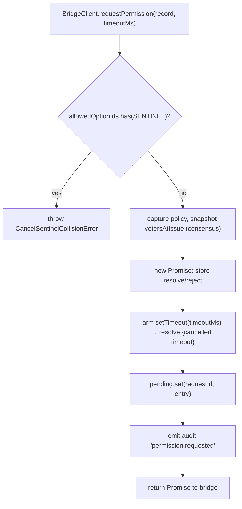
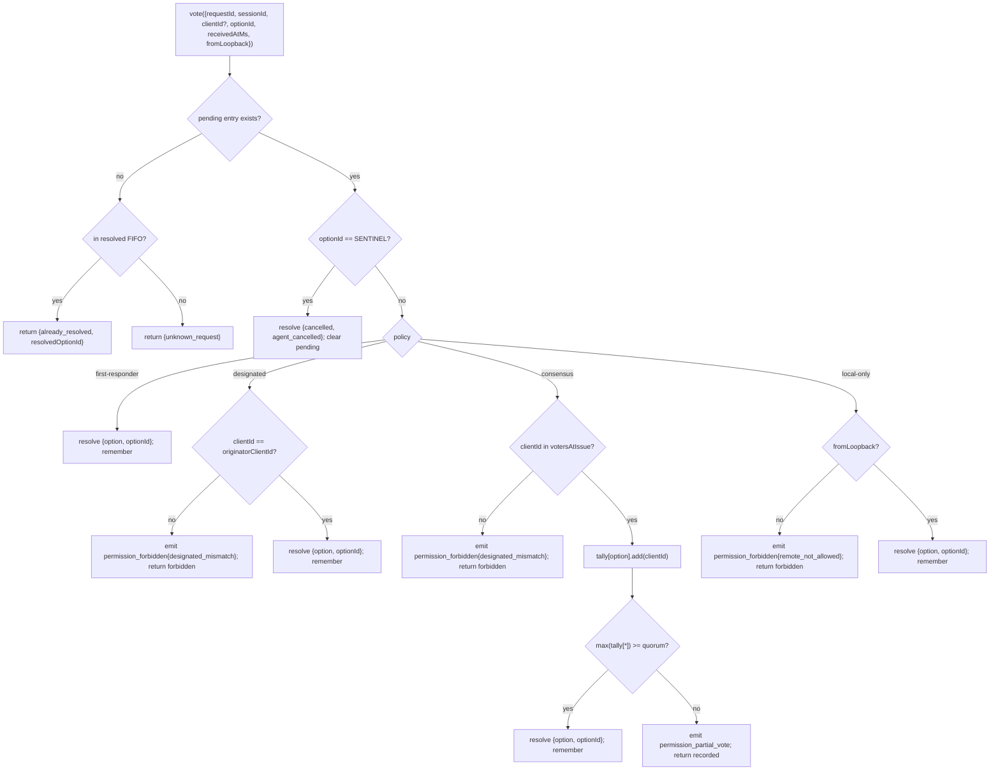

# Медиация разрешений между несколькими клиентами

## Обзор

Когда агент дочернего процесса ACP вызывает `requestPermission`, демон не просто пересылает его одному клиенту. При `sessionScope: 'single'` каждый подключенный клиент видит запрос, и любой из них может ответить. Без медиации опоздавшие голоса не имеют возможности быть обработанными, два клиента могут конкурировать за один и тот же запрос, а один недобросовестный клиент может переопределить инициатора.

`MultiClientPermissionMediator` (`packages/acp-bridge/src/permissionMediator.ts`) реализует контракт `PermissionMediator` (`packages/acp-bridge/src/permission.ts`) и владеет всеми ожидающими и разрешенными состояниями разрешений для моста. Он направляет голоса через одну из четырех политик, объявленных в `PermissionPolicy`:

| Политика          | Правило разрешения                                                                                                     | Вариант использования                                                      |
| ----------------- | ---------------------------------------------------------------------------------------------------------------------- | -------------------------------------------------------------------------- |
| `first-responder` | Первый действительный голос побеждает; последующие голосующие получают `permission_already_resolved`.                 | UX совместной работы между клиентами в реальном времени (по умолчанию).    |
| `designated`      | Только `originatorClientId` запроса может разрешить; другие видят `permission_forbidden{designated_mismatch}`.        | Мультитенантный SaaS, где поверхность UI должна владеть своими одобрениями.|
| `consensus`       | Кворум N из M среди снимка идентификаторов клиентов v1; промежуточные события `permission_partial_vote` позволяют UI отображать прогресс. | Корпоративный обзор изменений, где два оператора должны согласоваться.     |
| `local-only`      | Отклоняет любых голосующих не с loopback; блокирует, пока клиент с loopback не разрешит.                               | Рабочие станции, где удаленное управление никогда не должно предоставлять повышение привилегий. |

> [!note]
> **Ограничение безопасности v1**: `X-Qwen-Client-Id` является самопровозглашенным. `designated` и
> `consensus` пока не имеют подтверждения владения. Клиент, который наблюдает
> `originatorClientId`, может повторно использовать этот id. `{outcome:'cancelled'}` также направляется
> через сторожевое значение отмены перед отправкой политики, поэтому даже `local-only`
> не может рассматривать отмену как защищенное политикой разрешение. Для надежной изоляции привяжите
> демон к loopback или поместите его за аутентифицированным обратным прокси. См.
> [Замечание по безопасности: идентификация клиента v1 является самопровозглашенной](#security-note-v1-client-identity-is-self-reported).

## Обязанности

- Отслеживать каждый ожидающий запрос (жизненный цикл `request → vote → resolved`).
- Устанавливать и снимать таймауты по реальному времени для каждого запроса (**инвариант N1**: таймаут должен устанавливаться синхронно внутри `request()`, чтобы немедленно отмененная сессия не могла привести к утечке постоянно ожидающего замыкания).
- Направлять голоса через политику, захваченную во время `request()` (изменение политики демона на лету не влияет на выполняющиеся запросы).
- Поддерживать ограниченную FIFO (`MAX_RESOLVED_PERMISSION_RECORDS = 512`) недавно разрешенных запросов, чтобы повторные голоса получали структурированный `already_resolved`, а не `unknown_request`.
- Генерировать `permission_partial_vote` (consensus) и `permission_forbidden` (designated/consensus/local-only) в шине событий на сессию.
- Разрешать ожидающие запросы как `{kind: 'cancelled', reason: 'session_closed'}` через `forgetSession(sessionId)` при завершении сессии.
- Отклонять вредоносное или случайное внедрение `CANCEL_VOTE_SENTINEL` через сеть (`InvalidPermissionOptionError`) и через метки опций, опубликованные агентом (`CancelSentinelCollisionError`).

## Архитектура

### Публичный интерфейс

```ts
interface PermissionMediator {
  readonly policy: PermissionPolicy;
  request(
    record: PermissionRequestRecord,
    timeoutMs: number,
  ): Promise<PermissionResolution>;
  vote(vote: PermissionVote): PermissionVoteOutcome;
  forgetSession(sessionId: string): void;
}
```

`MultiClientPermissionMediator` добавляет: `peekSessionFor(requestId)`, `pendingCount(sessionId)`, внутренний издатель аудита и т. д. `BridgeClient` зависит только от части `request()` (структурная подтипизация — см. `bridgeClient.ts`).

### `PermissionPolicy` и `PermissionVoteOutcome`

```ts
type PermissionPolicy =
  | 'first-responder'
  | 'designated'
  | 'consensus'
  | 'local-only';

type PermissionVoteOutcome =
  | { kind: 'resolved'; resolvedOptionId: string }
  | { kind: 'recorded'; votesNeeded: number } // consensus partial
  | { kind: 'already_resolved'; resolvedOptionId: string }
  | { kind: 'forbidden'; reason: 'designated_mismatch' | 'remote_not_allowed' }
  | { kind: 'unknown_request' };

type PermissionResolution =
  | { kind: 'option'; optionId: string }
  | {
      kind: 'cancelled';
      reason: 'timeout' | 'session_closed' | 'agent_cancelled';
    };
```

### Сторожевое значение отмены

`CANCEL_VOTE_SENTINEL = '__cancelled__'`. Мост преобразует голосующего `{outcome:'cancelled'}` в этот сторожевое значение **перед** вызовом `mediator.vote`. Посредник направляет сторожевое значение **перед** отправкой политики — отмена голосующего работает в любой политике независимо от `clientId` / loopback / членства. Две защиты:
1. **`bridge.ts`** отклоняет голоса с провода, у которых `optionId === CANCEL_VOTE_SENTINEL`, с ошибкой `InvalidPermissionOptionError` (злонамеренный клиент провода не должен иметь возможность внедрить отмену, солгав об `optionId`).
2. **`mediator.request`** отклоняет записи, у которых `allowedOptionIds` содержит sentinel, с ошибкой `CancelSentinelCollisionError` (агент, легитимно публикующий `'__cancelled__'` в качестве метки опции, не должен иметь возможность маскироваться).

Этот преднамеренный обход между политиками задокументирован в `permissionMediator.ts`, чтобы будущий разработчик случайно не удалил этот обход.

### Состояние ожидания (Pending)

Каждый ожидающий запрос ключируется по `requestId` и содержит:

- `policy` — захватывается в момент вызова `request()`.
- `record: PermissionRequestRecord` (requestId, sessionId, originatorClientId, allowedOptionIds, issuedAtMs).
- замыкания `resolve`/`reject`.
- `votesAtIssue` (только для консенсуса) — снимок зарегистрированных `clientIds` для сессии на момент выдачи; последующие голоса отклоняются, если их нет в этом наборе.
- `tally` (только для консенсуса) — `Map<optionId, Set<clientId>>`, подсчитывающая голоса за каждую опцию.
- `timeoutHandle` — таймер Node, установленный внутри `request()` (инвариант N1).
- `auditTrail[]` — записи аудита для каждого голоса.

### FIFO для разрешённых

`MAX_RESOLVED_PERMISSION_RECORDS = 512`. Вытеснение осуществляется по принципу FIFO через `resolvedOrder.shift()` (рецензия DeepSeek #4335 / 3271627446 — зеркалирует `PermissionAuditRing`). Хранит только `{requestId, sessionId, outcome}`, поэтому 512 записей остаются менее 100 КБ в обычных окнах переподключения/гонки UI.

## Рабочий процесс

### `request()` (инвариант N1)



Таймер устанавливается **до** того, как запись становится видимой где-либо ещё. Без этого `forgetSession`, пришедший между `pending.set` и `setTimeout`, оставил бы запись ожидающей без таймера — per-session `promptQueue` моста зависла бы навсегда.

### Диспетчеризация `vote()`



### `forgetSession()`

Вызывается при закрытии сессии, вытеснении и остановке моста. Для каждой ожидающей записи, у которой `record.sessionId === sessionId`:

1. Отменить таймер.
2. Разрешить ожидающий Promise со значением `{kind: 'cancelled', reason: 'session_closed'}`.
3. Добавить запись аудита.
4. Удалить из `pending`.

Путь завершения сессии моста всегда вызывает `forgetSession` **до** окна уничтожения канала, чтобы ожидающие разрешения не переживали свою сессию.

## Состояние и жизненный цикл

- `policy` захватывается для каждого запроса. Изменение общедемонной политики (в будущем) не влияет на выполняющиеся запросы.
- `votesAtIssue` (консенсус) захватывается в момент `request()`; клиенты, появившиеся после запроса, могут голосовать, но если их `clientId` не был зарегистрирован в сессии на момент выдачи, их голос отклоняется как `designated_mismatch`. Это намеренно использует ту же причину несоответствия, что и политика `designated`, чтобы сохранить закрытость контракта; будущие версии могут разделить объединение, если потребителям SDK потребуется различать.
- Разрешённые записи живут в FIFO не более `MAX_RESOLVED_PERMISSION_RECORDS` (512). После вытеснения повторный голос по тому же `requestId` возвращает `{unknown_request}`.
- `permission_partial_vote` срабатывает только для `consensus`. Не полагайтесь на это при любой другой политике.
- `permission_forbidden` срабатывает для `designated`, `consensus` и `local-only` — не для `first-responder`.

## Зависимости
- [`03-acp-bridge.md`](./03-acp-bridge.md) — как мост связывает `BridgeClient.requestPermission` с `mediator.request`.
- [`10-event-bus.md`](./10-event-bus.md) — как частичные голоса и запрещённые фреймы достигают клиентов.
- [`09-event-schema.md`](./09-event-schema.md) — контракты полезной нагрузки для событий `permission_*`.
- [`08-session-lifecycle.md`](./08-session-lifecycle.md) — `forgetSession()` вызывается при каждом завершении сессии.
- [`02-serve-runtime.md`](./02-serve-runtime.md) — `PermissionAuditRing` (FIFO-буфер на 512 записей аудита).

## Конфигурация

| Источник            | Параметр                                                                                              | Эффект                                |
| ------------------- | ------------------------------------------------------------------------------------------------------ | ------------------------------------- |
| `settings.json`     | `policy.permissionStrategy`                                                                            | Активная политика медиатора.          |
| `settings.json`     | `policy.consensusQuorum`                                                                               | N для консенсуса.                     |
| `BridgeOptions`     | `permissionPolicy`, `permissionConsensusQuorum`, `permissionAudit`                                     | Программное переопределение.          |
| Тег возможностей    | `permission_mediation` (всегда; `modes: ['first-responder', 'designated', 'consensus', 'local-only']`) | Поддерживаемый набор сборки.          |
| Конверт возможностей| `policy.permission`                                                                                    | Активная политика, под которой работает демон. |

Если `policy.permissionStrategy` явно не настроена, демон использует
`first-responder`. `designated`, `consensus` и `local-only` вступают в силу
только при указании в `settings.json`.

## Кворум консенсуса: формула по умолчанию и граничный случай M=2

Когда активна политика `consensus` и `policy.consensusQuorum` не задан,
медиатор вычисляет **N = floor(M/2) + 1** с помощью `consensusQuorumFor` в
`permissionMediator.ts`:

```ts
Math.max(1, Math.floor(m / 2) + 1);
```

| M (`votersAtIssue.size`) | N по умолчанию | Поведение                        |
| ------------------------ | --------- | ------------------------------- |
| 1                        | 1         | Один голосующий разрешает немедленно. |
| 2                        | 2         | Требуется единогласное решение.  |
| 3                        | 2         | Большинство.                    |
| 4                        | 3         | Более половины.                 |
| 5                        | 3         | Большинство.                    |
| 6                        | 4         | Более половины.                 |

Для **M = 2** разделённые голоса (A выбирает X, B выбирает Y) могут быть разрешены
только таймаутом на разрешение запроса: ни один вариант не достигает единогласия,
поэтому запрос ждёт `permissionResponseTimeoutMs` (по умолчанию 5 минут) и
разрешается как `{cancelled, timeout}`. Путь продвижения голосов записывает это
поведение «единогласие означает таймаут разделённых голосов» в stderr для
операторов.

Операторы, желающие поведения «первый голос побеждает» для M = 2, могут явно
установить `policy.consensusQuorum: 1`. Более строгие конфигурации, например
требование единогласия для M = 4, используют то же поле.

## Проверка политики при запуске

`runQwenServe.validatePolicyConfig(policyConfig)`
(`packages/cli/src/serve/run-qwen-serve.ts`) проверяет объединённые
`settings.json` `policy.*` при запуске и выбрасывает `InvalidPolicyConfigError`
при ошибках оператора:

- `policy.permissionStrategy` задан, но не входит в четыре поддерживаемых режима.
  Допустимый набор определяется во время выполнения из
  `SERVE_CAPABILITY_REGISTRY.permission_mediation.modes` — единственного
  источника истины для объявления возможностей.
- `policy.consensusQuorum` задан, но не является положительным целым числом.

Также есть мягкое предупреждение в stderr, когда `consensusQuorum` задан, а
`permissionStrategy !== 'consensus'`; иначе переопределение было бы молча
проигнорировано при политиках, отличных от консенсуса.

`InvalidPolicyConfigError` экспортируется для проверок через `instanceof`.
`runQwenServe` использует его, чтобы отличать ошибочную конфигурацию оператора
(которая перевыбрасывается как явный сбой загрузки) от ошибок ввода-вывода при
чтении настроек (которые приводят к использованию значений по умолчанию).

## Замечание по безопасности: идентификация клиента v1 является самодекларируемой

`X-Qwen-Client-Id` предоставляется HTTP-клиентом. В v1 демон проверяет формат
(`[A-Za-z0-9._:-]{1,128}`) и отслеживает прикреплённые идентификаторы клиентов в
`clientIds`, но не выполняет проверку владения (proof-of-possession). Любой
клиент, который может наблюдать `originatorClientId` в SSE, может
зарегистрироваться с тем же идентификатором и выдать себя за этого инициатора
в последующих запросах.

Влияние на политики:

- **`first-responder`** не подвержена влиянию, так как не зависит от
  идентификации.
- **`designated`** может быть подделана удалённым клиентом, повторно
  использующим `originatorClientId`.
- **`consensus`** привязывается к снимку `votersAtIssue` на момент запроса;
  если поддельный идентификатор уже прикреплён на момент отправки запроса, он
  может голосовать.
- **`local-only`** невосприимчива к подделке идентификатора, потому что
  `fromLoopback: boolean` устанавливается демоном на основе удалённого адреса
  соединения, а не предоставляется клиентом.
Будущий механизм парных токенов будет выдавать секрет на сессию через `POST /session` и требовать его при голосовании `designated` / `consensus`. В v1 такого механизма нет.

## Предостережения и известные ограничения

- **Отмена sentinel-маршрутов ДО диспетчеризации политики** по замыслу — демон `local-only` и демон `consensus` могут быть отменены любым голосующим, который отправляет `{outcome: 'cancelled'}`. Это документировано в `permissionMediator.ts` и представляет собой путь прерывания на стороне агента.
- **`designated` и `consensus` перегружают `designated_mismatch`** в `PermissionVoteOutcome`. Посредник испускает отдельные записи аудита, но форма передачи данных (wire shape) единая. В будущих версиях протокола возможно разделение объединения.
- **Анонимные голосующие (без `X-Qwen-Client-Id`)** принимаются только в рамках `first-responder` и `local-only` (loopback); `designated` и `consensus` их отклоняют.
- **Кросс-политический запасной выход** означает, что отмена не может быть ограничена политикой. Если развертыванию требуется отмена, ограниченная политикой, это было бы будущим изменением контракта — не маскируйте это проверками на уровне маршрутов.
- **Семантика снимка `votesAtIssue`** означает, что в развертывании с консенсусом и меняющимся набором клиентов легитимные клиенты могут быть отклонены, потому что они подключились после выдачи запроса. Операторам следует предварительно регистрировать идентификаторы клиентов-сотрудников перед выдачей запросов на рецензирование изменений.

## Ссылки

- `packages/acp-bridge/src/permission.ts` (frozen contract)
- `packages/acp-bridge/src/permissionMediator.ts` (F3 mediator implementation)
- `packages/acp-bridge/src/bridgeClient.ts` (uses structural sub-typing on `PermissionMediator`)
- `packages/acp-bridge/src/bridgeErrors.ts` (`CancelSentinelCollisionError`, `InvalidPermissionOptionError`, `PermissionForbiddenError`)
- `packages/cli/src/serve/permission-audit.ts` (audit ring + publisher)
- Issue: [#4175](https://github.com/QwenLM/qwen-code/issues/4175) F3 series.
