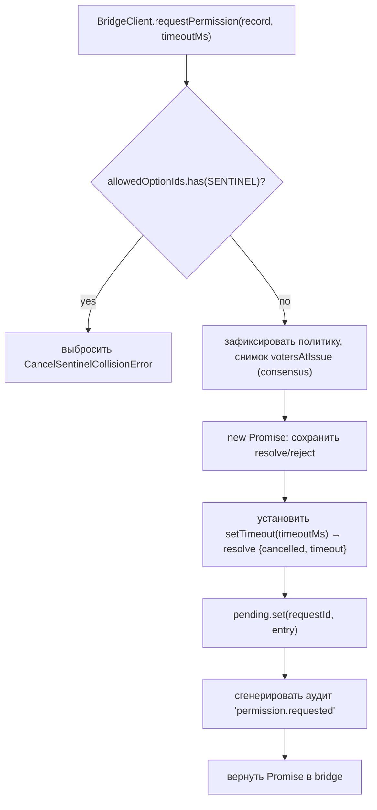
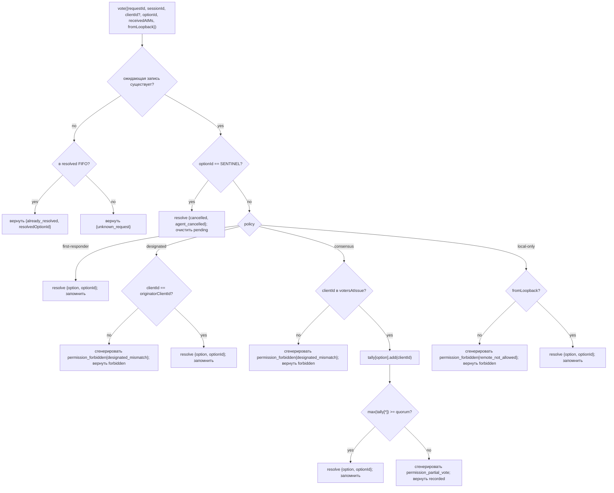

# Медиация разрешений для нескольких клиентов

## Обзор

Когда агент дочернего процесса ACP вызывает `requestPermission`, демон не просто перенаправляет его одному клиенту. При `sessionScope: 'single'` каждый подключенный клиент видит запрос, и любой из них может ответить. Без механизма медиации запоздалые голоса теряются, два клиента могут одновременно обрабатывать один и тот же запрос, а один злонамеренный клиент может переопределить действия инициатора.

`MultiClientPermissionMediator` (`packages/acp-bridge/src/permissionMediator.ts`) реализует контракт `PermissionMediator` (`packages/acp-bridge/src/permission.ts`) и управляет всем состоянием ожидающих и разрешенных запросов разрешений для моста (bridge). Он распределяет голоса в соответствии с одной из четырех политик, объявленных в `PermissionPolicy`:

| Политика            | Правило разрешения                                                                                                        | Сценарий использования                                                                 |
| ------------------- | ---------------------------------------------------------------------------------------------------------------------- | ------------------------------------------------------------------------ |
| `first-responder` | Первый действительный голос побеждает; последующие голосующие получают `permission_already_resolved`.                                                 | Интерфейс совместной работы в реальном времени между клиентами (по умолчанию).                            |
| `designated`      | Только `originatorClientId` запроса может вынести решение; остальные видят `permission_forbidden{designated_mismatch}`.            | Мультитенантные SaaS-приложения, где UI-поверхность должна сама управлять своими подтверждениями.         |
| `consensus`       | Кворум N из M по снимку client-id v1; промежуточные события `permission_partial_vote` позволяют UI отображать прогресс. | Корпоративное ревью изменений, где два оператора должны прийти к согласию.                 |
| `local-only`      | Отклоняет любого голосующего не с loopback-адреса; блокирует до тех пор, пока клиент с loopback-адреса не вынесет решение.                                               | Рабочие станции, где удаленное управление никогда не должно предоставлять повышение привилегий. |

> **Ограничение безопасности v1**: `X-Qwen-Client-Id` сообщается самим клиентом. Для `designated` и
> `consensus` пока нет подтверждения владения (proof-of-possession). Клиент, перехвативший
> `originatorClientId`, может повторно использовать этот id. `{outcome:'cancelled'}` также маршрутизируется
> через cancel sentinel до распределения по политике, поэтому даже `local-only`
> не может рассматривать отмену как защищенное политикой разрешение. Для строгой изоляции привяжите
> демон к loopback-адресу или поместите его за аутентифицированный обратный прокси. См.
> [Security note: v1 client identity is self-reported](#security-note-v1-client-identity-is-self-reported).

## Ответственность

- Отслеживание каждого ожидающего запроса (жизненный цикл `request → vote → resolved`).
- Установка и сброс таймаутов реального времени для каждого запроса (**инвариант N1**: таймаут должен устанавливаться синхронно внутри `request()`, чтобы немедленно отмененная сессия не могла привести к утечке постоянно ожидающего замыкания).
- Распределение голосов в соответствии с политикой, зафиксированной на момент `request()` (изменение политики демона во время выполнения не влияет на уже выполняющиеся запросы).
- Поддержка ограниченного FIFO (`MAX_RESOLVED_PERMISSION_RECORDS = 512`) недавно разрешенных запросов, чтобы дубликаты голосов получали структурированный ответ `already_resolved`, а не `unknown_request`.
- Генерация событий `permission_partial_vote` (consensus) и `permission_forbidden` (designated / consensus / local-only) в per-session EventBus.
- Разрешение ожидающих запросов как `{kind: 'cancelled', reason: 'session_closed'}` через `forgetSession(sessionId)` при завершении сессии.
- Отклонение злонамеренного или случайного внедрения `CANCEL_VOTE_SENTINEL` через сеть (`InvalidPermissionOptionError`) и через метки опций, публикуемые агентом (`CancelSentinelCollisionError`).

## Архитектура

### Публичный интерфейс

```ts
interface PermissionMediator {
  readonly policy: PermissionPolicy;
  request(
    record: PermissionRequestRecord,
    timeoutMs: number,
  ): Promise<PermissionResolution>;
  vote(vote: PermissionVote): PermissionVoteOutcome;
  forgetSession(sessionId: string): void;
}
```

`MultiClientPermissionMediator` добавляет: `peekSessionFor(requestId)`, `pendingCount(sessionId)`, внутренний издатель аудита и т.д. `BridgeClient` зависит только от части `request()` (структурное подтипизирование — см. `bridgeClient.ts`).

### `PermissionPolicy` и `PermissionVoteOutcome`

```ts
type PermissionPolicy =
  | 'first-responder'
  | 'designated'
  | 'consensus'
  | 'local-only';

type PermissionVoteOutcome =
  | { kind: 'resolved'; resolvedOptionId: string }
  | { kind: 'recorded'; votesNeeded: number } // consensus partial
  | { kind: 'already_resolved'; resolvedOptionId: string }
  | { kind: 'forbidden'; reason: 'designated_mismatch' | 'remote_not_allowed' }
  | { kind: 'unknown_request' };

type PermissionResolution =
  | { kind: 'option'; optionId: string }
  | {
      kind: 'cancelled';
      reason: 'timeout' | 'session_closed' | 'agent_cancelled';
    };
```

### Cancel sentinel

`CANCEL_VOTE_SENTINEL = '__cancelled__'`. Мост (bridge) сопоставляет голосующему `{outcome:'cancelled'}` этот сентинел **до** вызова `mediator.vote`. Медиатор маршрутизирует сентинел **до** распределения по политике — отмена голосующим работает при любой политике независимо от `clientId` / loopback / членства. Два защитных механизма:

1. **`bridge.ts`** отклоняет сетевые голоса, у которых `optionId === CANCEL_VOTE_SENTINEL`, с ошибкой `InvalidPermissionOptionError` (злонамеренный сетевой клиент не должен иметь возможности внедрить отмену, солгав об `optionId`).
2. **`mediator.request`** отклоняет записи, у которых `allowedOptionIds` содержит сентинел, с ошибкой `CancelSentinelCollisionError` (агент, легитимно публикующий `'__cancelled__'` как метку опции, не должен иметь возможности маскироваться).

Этот намеренный обход политик задокументирован в `permissionMediator.ts`, чтобы будущий сопровождающий разработчик случайно не удалил этот обходной путь.

### Ожидающие запросы

Каждый ожидающий запрос индексируется по `requestId` и содержит:

- `policy` — фиксируется на момент `request()`.
- `record: PermissionRequestRecord` (requestId, sessionId, originatorClientId, allowedOptionIds, issuedAtMs).
- Замыкания `resolve` / `reject`.
- `votesAtIssue` (только для consensus) — снимок зарегистрированных `clientIds` для сессии на момент выдачи; последующие голоса отклоняются, если их нет в этом наборе.
- `tally` (только для consensus) — `Map<optionId, Set<clientId>>`, подсчитывающая голоса для каждой опции.
- `timeoutHandle` — таймаут Node, установленный внутри `request()` (инвариант N1).
- `auditTrail[]` — записи аудита для каждого голоса.

### Resolved FIFO

`MAX_RESOLVED_PERMISSION_RECORDS = 512`. Вытеснение происходит по FIFO через `resolvedOrder.shift()` (DeepSeek review #4335 / 3271627446 — аналогично `PermissionAuditRing`). Хранит только `{requestId, sessionId, outcome}`, поэтому 512 записей занимают менее 100 КБ даже при обычных окнах переподключения/состязаний UI.

## Рабочий процесс

### request() (N1 invariant)



Таймер устанавливается **до** того, как запись становится видимой где-либо еще. Без этого `forgetSession`, поступивший между `pending.set` и `setTimeout`, оставил бы запись в ожидании без таймаута — `promptQueue` моста для каждой сессии завис бы навсегда.

### vote() dispatch



### forgetSession()

Вызывается при закрытии сессии, вытеснении и завершении работы моста. Для каждой ожидающей записи, у которой `record.sessionId === sessionId`:

1. Отменяет таймаут.
2. Разрешает ожидающий Promise как `{kind: 'cancelled', reason: 'session_closed'}`.
3. Добавляет запись аудита.
4. Удаляет из `pending`.

Путь завершения сессии в мосту всегда вызывает `forgetSession` **до** окна уничтожения канала, чтобы ожидающие разрешения не пережили свою сессию.

## Состояние и жизненный цикл

- `policy` фиксируется для каждого запроса. Изменение политики для всего демона (будущий функционал) не влияет на выполняющиеся запросы.
- `votesAtIssue` (consensus) фиксируется на момент `request()`; клиенты, подключившиеся после запроса, могут голосовать, но если их `clientId` не был зарегистрирован в сессии на момент выдачи, их голос отклоняется как `designated_mismatch`. Это намеренно повторно использует причину несовпадения политики `designated`, чтобы сохранить контракт закрытым; будущие версии могут разделить объединение, если потребителям SDK потребуется их различать.
- Разрешенные записи хранятся в FIFO не более `MAX_RESOLVED_PERMISSION_RECORDS` (512). После вытеснения дублирующий голос по тому же `requestId` возвращает `{unknown_request}`.
- `permission_partial_vote` срабатывает только для `consensus`. Не полагайтесь на него при других политиках.
- `permission_forbidden` срабатывает для `designated`, `consensus` и `local-only`, но не для `first-responder`.

## Зависимости

- [`03-acp-bridge.md`](./03-acp-bridge.md) — как мост связывает `BridgeClient.requestPermission` с `mediator.request`.
- [`10-event-bus.md`](./10-event-bus.md) — как фреймы partial-vote и forbidden достигают клиентов.
- [`09-event-schema.md`](./09-event-schema.md) — контракты полезных нагрузок для событий `permission_*`.
- [`08-session-lifecycle.md`](./08-session-lifecycle.md) — `forgetSession()` вызывается при каждом завершении сессии.
- [`02-serve-runtime.md`](./02-serve-runtime.md) — `PermissionAuditRing` (FIFO на 512 записей аудита).

## Конфигурация

| Источник              | Параметр                                                                                                   | Эффект                                |
| ------------------- | ------------------------------------------------------------------------------------------------------ | ------------------------------------- |
| `settings.json`     | `policy.permissionStrategy`                                                                            | Активная политика медиатора.               |
| `settings.json`     | `policy.consensusQuorum`                                                                               | N для consensus.                      |
| `BridgeOptions`     | `permissionPolicy`, `permissionConsensusQuorum`, `permissionAudit`                                     | Программное переопределение.                |
| Capability tag      | `permission_mediation` (always; `modes: ['first-responder', 'designated', 'consensus', 'local-only']`) | Набор, поддерживаемый сборкой.                  |
| Capability envelope | `policy.permission`                                                                                    | Активная политика, с которой работает этот демон. |

Если `policy.permissionStrategy` не настроена явно, демон использует
`first-responder`. `designated`, `consensus` и `local-only` вступают в силу
только при установке в `settings.json`.

## Кворум consensus: формула по умолчанию и граничный случай M=2

Когда активна политика `consensus` и `policy.consensusQuorum` не установлена,
медиатор вычисляет **N = floor(M/2) + 1** с помощью `consensusQuorumFor` в
`permissionMediator.ts`:

```ts
Math.max(1, Math.floor(m / 2) + 1);
```

| M (`votersAtIssue.size`) | N по умолчанию | Поведение                        |
| ------------------------ | --------- | ------------------------------- |
| 1                        | 1         | Один голосующий сразу выносит решение. |
| 2                        | 2         | Требуется единогласное согласие.   |
| 3                        | 2         | Большинство.                       |
| 4                        | 3         | Более половины.                 |
| 5                        | 3         | Большинство.                       |
| 6                        | 4         | Более половины.                 |

При **M = 2** разделившиеся голоса (A выбирает X, B выбирает Y) могут быть разрешены только
таймаутом для каждого разрешения: ни одна опция не достигает единогласия, поэтому запрос ожидает
до `permissionResponseTimeoutMs` (по умолчанию 5 мин) и разрешается как
`{cancelled, timeout}`. Путь продвижения голоса логирует это поведение («единогласие означает, что разделившиеся голоса истекают по таймауту»)
в stderr для операторов.

Операторы, которые хотят поведение «первый голос побеждает» для M = 2, могут явно установить
`policy.consensusQuorum: 1`. Более строгие конфигурации, такие как требование
единогласия для M = 4, используют то же поле.

## Валидация политики при запуске

`runQwenServe.validatePolicyConfig(policyConfig)`
(`packages/cli/src/serve/run-qwen-serve.ts`) валидирует объединенные `policy.*` из `settings.json`
при запуске и выбрасывает `InvalidPolicyConfigError` при ошибках оператора:

- `policy.permissionStrategy` установлена, но не входит в четыре поддерживаемых режима. Допустимый
  набор выводится во время выполнения из
  `SERVE_CAPABILITY_REGISTRY.permission_mediation.modes`, который является единственным источником истины для анонсирования возможностей.
- `policy.consensusQuorum` установлена, но не является положительным целым числом.

Также выводится мягкое предупреждение в stderr, если `consensusQuorum` установлена, при этом
`permissionStrategy !== 'consensus'`; в противном случае переопределение было бы молча
проигнорировано при политиках, отличных от consensus.

`InvalidPolicyConfigError` экспортируется для тестов `instanceof`. `runQwenServe`
использует его, чтобы отличать неправильную конфигурацию оператора, которая пробрасывается как явная ошибка загрузки, от ошибок ввода-вывода при чтении настроек, при которых происходит откат к
значениям по умолчанию.

## Security note: v1 client identity is self-reported

`X-Qwen-Client-Id` предоставляется HTTP-клиентом. В v1 демон валидирует
формат (`[A-Za-z0-9._:-]{1,128}`) и отслеживает подключенные client id в
`clientIds`, но не выполняет подтверждение владения (proof-of-possession). Любой клиент, который может перехватить `originatorClientId` в SSE, может зарегистрироваться с тем же id и
выдавать себя за этого инициатора в последующих запросах.

Влияние на политики:

- **`first-responder`** не затрагивается, так как не зависит от идентичности.
- **`designated`** может быть подделана удаленным клиентом, повторно использующим
  `originatorClientId`.
- **`consensus`** проверяет снимок `votersAtIssue` на момент выдачи; если поддельный
  id уже подключен на момент выдачи запроса, он может проголосовать.
- **`local-only`** невосприимчива к подделке id, поскольку `fromLoopback: boolean`
  устанавливается демоном на основе удаленного адреса подключения, а не предоставляется
  клиентом.

Будущий механизм парных токенов будет выдавать секрет для каждой сессии через
`POST /session` и требовать его при голосах `designated` / `consensus`. Этот
механизм не реализован в v1.

## Маршрутизация голосов между соединениями

### Пути доставки голосов

Голоса разрешений могут достигать медиатора моста через два независимых транспортных пути:

1. **Транспорт ACP (ответ в том же соединении)**: Событие моста `permission_request` доставляется в SSE/WS поток сессии принадлежащего соединения как JSON-RPC запрос `session/request_permission`. Клиент отвечает JSON-RPC ответом в том же соединении. `resolveClientResponse` диспетчера сопоставляет локальный для соединения JSON-RPC id обратно с `requestId` моста и вызывает `bridge.respondToSessionPermission`.

2. **REST API (между соединениями)**: Любой HTTP-клиент, включая клиенты на другом ACP-соединении или вообще без ACP-соединения, может проголосовать через `POST /session/:id/permission/:requestId`. Устаревший маршрут `POST /permission/:requestId` (без сессии в URL) использует `peekSessionFor(requestId)` для определения сессии перед делегированием тому же пути `respondToSessionPermission`.

### Локальные для соединения ID запросов разрешений

Транспорт ACP использует двухуровневую схему ID для сопоставления между сетью и мостом:

| Уровень               | Формат ID                                            | Область действия            | Назначение                                                                                       |
| ------------------- | ---------------------------------------------------- | ---------------- | --------------------------------------------------------------------------------------------- |
| JSON-RPC message id | `_qwen_perm_N` (строка, монотонная для каждого соединения)    | Локальная для соединения | Сопоставляет пару JSON-RPC запрос→ответ в потоке сессии.                          |
| Bridge request id   | Непрозрачная строка (UUID, сгенерированный агентом/медиатором) | Глобальная для демона    | Идентифицирует запрос разрешения во всех маршрутах и в картах pending/resolved медиатора. |

Bridge request id передается через вендорное расширение `_meta`, чтобы клиент мог включить его при голосовании через REST-путь:

```json
{
  "method": "session/request_permission",
  "id": "_qwen_perm_3",
  "params": {
    "sessionId": "<session-id>",
    "toolCall": { "name": "shell" },
    "options": [{ "optionId": "allow", "name": "Allow" }],
    "_meta": { "qwen": { "requestId": "<bridge-request-id>" } }
  }
}
```

Соединение хранит сопоставление в `conn.pending: Map<jsonRpcId, PendingClientRequest>`, где `PendingClientRequest.bridgeRequestId` — это id уровня моста.

### Правила авторизации голосов

`respondToSessionPermission(sessionId, requestId, response, context)` применяет следующие проверки **по порядку**:

1. **Существование сессии** — сессия, к которой обращаются по `sessionId`, должна быть активной (`byId.has(sessionId)`). В противном случае `SessionNotFoundError`.

2. **Отклонение межсессионных запросов** — `peekSessionFor(requestId)` определяет сессию, к которой на самом деле принадлежит запрос. Если он принадлежит _другой_ сессии, голос отклоняется (возвращает `false` / 404) без раскрытия информации о членстве в сессии.

3. **Защита от неизвестных запросов** — когда `peekSessionFor` возвращает `undefined` (истек таймаут запроса, вытеснен LRU или никогда не существовал), голос отклоняется (возвращает `false` / 404) **до** любой валидации `clientId`. Это предотвращает атаку типа оракул: без нее зондирование с поддельным `clientId` могло бы отличить «в сессии есть этот клиент» (проходит валидацию → 404) от «клиент неизвестен» (`InvalidClientIdError` → 400).

4. **Валидация идентичности клиента** — `resolveTrustedClientId(entry, context?.clientId)` проверяет, что предоставленный `X-Qwen-Client-Id` (REST) или `clientId`, установленный мостом (ACP), зарегистрирован в карте `clientIds` сессии. Анонимные голоса (`clientId === undefined`) проходят дальше — их обрабатывает распределение по политике. Незарегистрированные id выбрасывают `InvalidClientIdError` (обработчики маршрутов преобразуют его в 400).

5. **Применение cancel sentinel** — сетевой голос `{ outcome: "selected", optionId: "__cancelled__" }` отклоняется с ошибкой `InvalidPermissionOptionError` для предотвращения внедрения сентинела.

6. **Распределение `vote()` медиатора** — провалидированный голос перенаправляется в `permissionMediator.vote(...)`, который применяет активную политику (см. [Рабочий процесс → `vote()` dispatch](#vote-dispatch)).
### Оценка loopback

Бит `fromLoopback` вычисляется **для каждого запроса**, а не для каждого соединения:

- **Транспорт ACP**: `reqLoopback` формируется на основе `req.socket.remoteAddress` на уровне ядра для POST-запроса на HTTP-уровне и передается в `dispatcher.handle(conn, msg, sessionHeader, isLoopbackReq(req))`. Это означает, что POST-запрос с голосованием за разрешение, пришедший от другого пира, отличного от того, от которого пришел запрос `initialize`, получит собственную оценку loopback.
- **REST API**: `detectFromLoopback(req)` проверяет тот же удаленный адрес на уровне сокета.

Ни один из путей не определяет loopback на основе подделываемых заголовков (`X-Forwarded-For`, `Forwarded` и т. д.).

### Формат ответа с голосованием для транспорта ACP

Клиент отвечает на `session/request_permission` стандартным JSON-RPC ответом:

**Принять (выбрать опцию)**:

```json
{
  "jsonrpc": "2.0",
  "id": "_qwen_perm_3",
  "result": {
    "outcome": { "outcome": "selected", "optionId": "allow" }
  }
}
```

**Отменить**:

```json
{
  "jsonrpc": "2.0",
  "id": "_qwen_perm_3",
  "result": {
    "outcome": { "outcome": "cancelled" }
  }
}
```

**Ответ с ошибкой** (диспетчер преобразует его в отмену):

```json
{
  "jsonrpc": "2.0",
  "id": "_qwen_perm_3",
  "error": { "code": -32000, "message": "user declined" }
}
```

### Восстановление после сбоев в `resolveClientResponse`

Если `bridge.respondToSessionPermission` выбрасывает исключение (например, из-за некорректного тела голоса), диспетчер переходит к явной отмене (`cancelAbandonedPermission`), чтобы медиатор никогда не оставался в заблокированном состоянии. Если и голосование, и отмена выбрасывают исключение (двойной сбой), запись `pending` **сохраняется**, чтобы последующее завершение соединения (`abandonPendingForSession`) могло повторить попытку.

## Оговорки и известные ограничения

- **Маршруты отмены (Cancel sentinel) обрабатываются ДО диспетчеризации политик** по замыслу — как демон `local-only`, так и демон `consensus` могут быть отменены любым голосующим, отправившим `{outcome: 'cancelled'}`. Это задокументировано в `permissionMediator.ts` и представляет собой путь прерывания на стороне агента.
- **`designated` и `consensus` используют `designated_mismatch`** в `PermissionVoteOutcome`. Медиатор создает отдельные записи аудита, но сетевой формат остается единым. Будущие версии протокола могут разделить это объединение.
- **Анонимные голосующие (без `X-Qwen-Client-Id`)** принимаются только в режимах `first-responder` и `local-only` (loopback); `designated` и `consensus` их отклоняют.
- **Обходной путь для кросс-политик (Cross-policy escape hatch)** означает, что отмена не может блокироваться политикой. Если развертыванию требуется отмена, управляемая политикой, это потребует изменения контракта в будущем — не пытайтесь закрыть это проверками на уровне маршрутов.
- **Семантика снимка `votesAtIssue`** означает, что в развертывании с консенсусом и часто меняющимся набором клиентов легитимные клиенты могут быть отклонены, если они подключились после отправки запроса. Операторам следует предварительно зарегистрировать client id соавторов перед отправкой запросов на проверку изменений.

## Ссылки

- `packages/acp-bridge/src/permission.ts` (неизменяемый контракт)
- `packages/acp-bridge/src/permissionMediator.ts` (реализация медиатора F3)
- `packages/acp-bridge/src/bridgeClient.ts` (использует структурное подтипирование для `PermissionMediator`)
- `packages/acp-bridge/src/bridge.ts` (`respondToSessionPermission` — маршрутизация голосов и авторизация)
- `packages/acp-bridge/src/bridgeErrors.ts` (`CancelSentinelCollisionError`, `InvalidPermissionOptionError`, `PermissionForbiddenError`, `InvalidClientIdError`)
- `packages/cli/src/serve/acp-http/dispatch.ts` (`resolveClientResponse` — путь голоса транспорта ACP)
- `packages/cli/src/serve/acp-http/connection-registry.ts` (`AcpConnection.pending` — маппинг запросов в рамках соединения)
- `packages/cli/src/serve/routes/permission.ts` (REST-маршруты для голосов)
- `packages/cli/src/serve/permission-audit.ts` (кольцо аудита + издатель)
- Issue: [#4175](https://github.com/QwenLM/qwen-code/issues/4175) Серия F3.