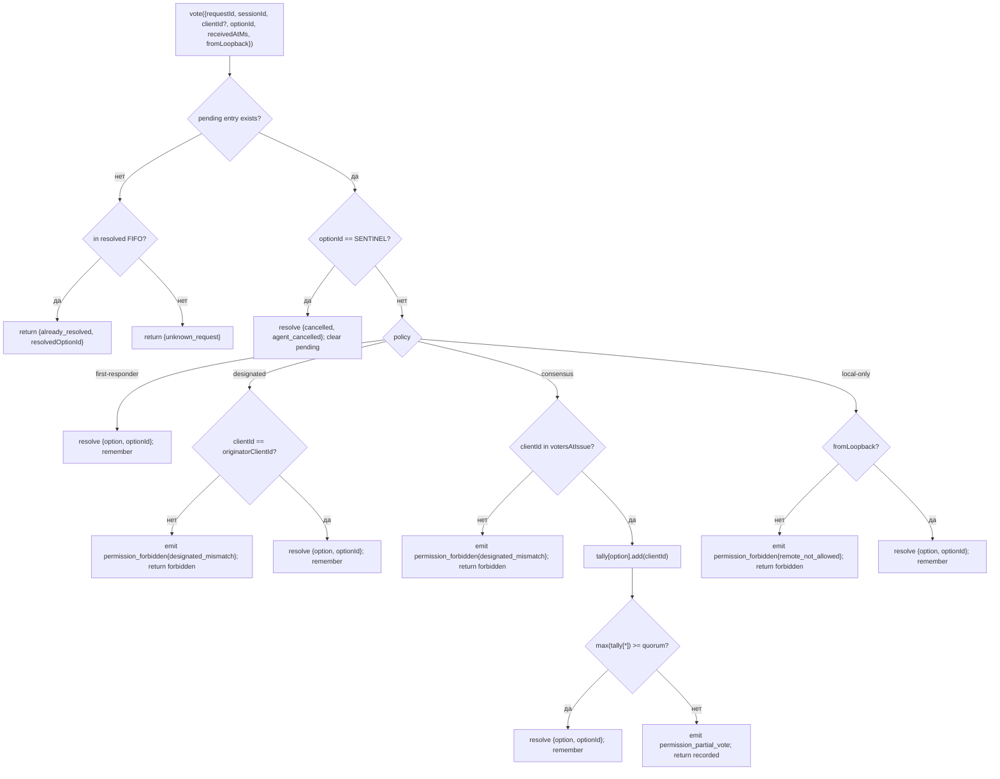

# Multi-Client Permission Mediation

## Обзор

Когда агент дочернего процесса ACP вызывает `requestPermission`, демон не просто перенаправляет запрос одному клиенту. При `sessionScope: 'single'` каждый подключённый клиент видит запрос, и любой из них может ответить. Без посредничества поздние голоса некуда девать, два клиента могут обрабатывать один и тот же запрос одновременно, а один недобросовестный клиент может переопределить инициатора.

`MultiClientPermissionMediator` (`packages/acp-bridge/src/permissionMediator.ts`) реализует контракт `PermissionMediator` (`packages/acp-bridge/src/permission.ts`) и владеет всем состоянием ожидающих и разрешённых разрешений для моста. Он распределяет голоса через одну из четырёх политик, объявленных в `PermissionPolicy`:

| Политика          | Правило разрешения                                                                                                         | Сценарий использования                                                          |
| ----------------- | --------------------------------------------------------------------------------------------------------------------------- | ------------------------------------------------------------------------------- |
| `first-responder` | Первый валидный голос побеждает; более поздние голосующие получают `permission_already_resolved`.                            | UX для живой совместной работы между клиентами (по умолчанию).                   |
| `designated`      | Только `originatorClientId` из подсказки может разрешить; другие видят `permission_forbidden{designated_mismatch}`.          | Мультитенантный SaaS, где UI должен владеть своими подтверждениями.             |
| `consensus`       | Кворум N из M по снимку client-id на момент выдачи; промежуточные события `permission_partial_vote` позволяют UI отображать прогресс. | Проверка изменений на уровне предприятия, где необходимо согласие двух операторов. |
| `local-only`      | Отклоняет любого голосующего не из loopback; блокируется до разрешения клиентом через loopback.                              | Рабочие станции, где удалённое управление не должно повышать привилегии.        |

> **Ограничение безопасности v1**: `X-Qwen-Client-Id` является самоотчётным. `designated` и
> `consensus` пока не имеют доказательства владения. Клиент, который видит
> `originatorClientId`, может повторно использовать этот id. `{outcome:'cancelled'}` также проходит
> через sentinel отмены перед диспетчеризацией политики, поэтому даже `local-only`
> не может считать отмену защищённым политикой разрешением. Для сильной изоляции привяжите
> демон к loopback или поместите его за аутентифицированный обратный прокси. См.
> [Заметка по безопасности: идентификация клиента v1 является самоотчётной](#security-note-v1-client-identity-is-self-reported).

## Обязанности

- Отслеживать каждый ожидающий запрос (жизненный цикл `request → vote → resolved`).
- Устанавливать и снимать таймауты по настенным часам для каждого запроса (**инвариант N1**: таймаут должен быть установлен синхронно внутри `request()`, чтобы немедленно отменённая сессия не утекла в вечно ожидающее замыкание).
- Направлять голоса через политику, захваченную в момент вызова `request()` (изменение политики демона на лету не влияет на выполняющиеся запросы).
- Поддерживать ограниченную FIFO-очередь (`MAX_RESOLVED_PERMISSION_RECORDS = 512`) недавно разрешённых запросов, чтобы повторные голоса получали структурированный ответ `already_resolved`, а не `unknown_request`.
- Генерировать события `permission_partial_vote` (consensus) и `permission_forbidden` (designated / consensus / local-only) в шине событий сессии.
- Разрешать ожидающие запросы как `{kind: 'cancelled', reason: 'session_closed'}` через `forgetSession(sessionId)` при завершении сессии.
- Отклонять злонамеренное или случайное внедрение `CANCEL_VOTE_SENTINEL` через провод (`InvalidPermissionOptionError`) и через метки параметров, опубликованные агентом (`CancelSentinelCollisionError`).

## Архитектура

### Публичный интерфейс

```ts
interface PermissionMediator {
  readonly policy: PermissionPolicy;
  request(
    record: PermissionRequestRecord,
    timeoutMs: number,
  ): Promise<PermissionResolution>;
  vote(vote: PermissionVote): PermissionVoteOutcome;
  forgetSession(sessionId: string): void;
}
```

`MultiClientPermissionMediator` добавляет: `peekSessionFor(requestId)`, `pendingCount(sessionId)`, внутренний издатель аудита и т.д. `BridgeClient` зависит только от части `request()` (структурная подтипизация — см. `bridgeClient.ts`).

### `PermissionPolicy` и `PermissionVoteOutcome`

```ts
type PermissionPolicy =
  | 'first-responder'
  | 'designated'
  | 'consensus'
  | 'local-only';

type PermissionVoteOutcome =
  | { kind: 'resolved'; resolvedOptionId: string }
  | { kind: 'recorded'; votesNeeded: number } // consensus partial
  | { kind: 'already_resolved'; resolvedOptionId: string }
  | { kind: 'forbidden'; reason: 'designated_mismatch' | 'remote_not_allowed' }
  | { kind: 'unknown_request' };

type PermissionResolution =
  | { kind: 'option'; optionId: string }
  | {
      kind: 'cancelled';
      reason: 'timeout' | 'session_closed' | 'agent_cancelled';
    };
```

### Sentinel отмены

`CANCEL_VOTE_SENTINEL = '__cancelled__'`. Мост преобразует `{outcome:'cancelled'}` голосующего в этот sentinel **до** вызова `mediator.vote`. Посредник обрабатывает sentinel **до** диспетчеризации политики — отмена голосующего работает при любой политике независимо от `clientId` / loopback / членства. Два ограничения:

1. **`bridge.ts`** отклоняет проводные голоса, у которых `optionId === CANCEL_VOTE_SENTINEL`, с ошибкой `InvalidPermissionOptionError` (злонамеренный проводной клиент не должен иметь возможность внедрить отмену, солгав об `optionId`).
2. **`mediator.request`** отклоняет записи, у которых `allowedOptionIds` содержит sentinel, с ошибкой `CancelSentinelCollisionError` (агент, легитимно публикующий `'__cancelled__'` в качестве метки параметра, не должен иметь возможность маскироваться).

Этот намеренный межполитический обход документирован в `permissionMediator.ts`, чтобы будущий разработчик случайно не удалил этот путь.

### Ожидающее состояние

Каждый ожидающий запрос индексируется по `requestId` и содержит:

- `policy` — захвачена при вызове `request()`.
- `record: PermissionRequestRecord` (requestId, sessionId, originatorClientId, allowedOptionIds, issuedAtMs).
- Замыкания `resolve` / `reject`.
- `votesAtIssue` (только consensus) — снимок зарегистрированных `clientIds` для сессии на момент выдачи; более поздние голоса отклоняются, если отсутствуют в этом наборе.
- `tally` (только consensus) — `Map<optionId, Set<clientId>>`, подсчёт голосов по параметрам.
- `timeoutHandle` — таймаут Node, установленный внутри `request()` (инвариант N1).
- `auditTrail[]` — записи аудита по каждому голосу.

### FIFO разрешённых

`MAX_RESOLVED_PERMISSION_RECORDS = 512`. Удаление по FIFO через `resolvedOrder.shift()` (рецензия DeepSeek #4335 / 3271627446 — отражает `PermissionAuditRing`). Хранит только `{requestId, sessionId, outcome}`, поэтому 512 записей остаются под 100 КБ в нормальных окнах переподключения/гонки UI.

## Рабочий процесс

### `request()` (инвариант N1)


Таймер устанавливается **до** того, как запись становится видимой где-либо ещё. Без этого `forgetSession`, поступившая между `pending.set` и `setTimeout`, оставила бы запись в состоянии ожидания без таймаута — очередь `promptQueue` сессии моста зависла бы навсегда.

### Диспетчеризация `vote()`



### `forgetSession()`

Вызывается при закрытии сессии, удалении и завершении моста. Для каждой ожидающей записи, у которой `record.sessionId === sessionId`:

1. Отменить таймаут.
2. Разрешить ожидающий Promise с `{kind: 'cancelled', reason: 'session_closed'}`.
3. Добавить запись аудита.
4. Удалить из `pending`.

Путь завершения сессии моста всегда вызывает `forgetSession` **до** окончания окна уничтожения канала, чтобы ожидающие разрешения не пережили свою сессию.

## Состояние и жизненный цикл

- `policy` захватывается для каждого запроса. Изменение политики демона (будущее API) не влияет на выполняющиеся запросы.
- `votesAtIssue` (consensus) захватывается при вызове `request()`; клиенты, появившиеся после запроса, могут голосовать, но если их `clientId` не был зарегистрирован в сессии на момент выдачи, их голос отклоняется как `designated_mismatch`. Это намеренно использует ту же причину несоответствия, что и политика `designated`, чтобы контракт оставался закрытым; будущие версии могут разделить объединение, если SDK-потребителям потребуется различать.
- Разрешённые записи остаются в FIFO максимум `MAX_RESOLVED_PERMISSION_RECORDS` (512). После удаления повторный голос по тому же `requestId` возвращает `{unknown_request}`.
- `permission_partial_vote` срабатывает только для `consensus`. Не полагайтесь на неё при любой другой политике.
- `permission_forbidden` срабатывает для `designated`, `consensus` и `local-only` — не для `first-responder`.

## Зависимости

- [`03-acp-bridge.md`](./03-acp-bridge.md) — как мост связывает `BridgeClient.requestPermission` с `mediator.request`.
- [`10-event-bus.md`](./10-event-bus.md) — как кадры частичных голосов и запретов доходят до клиентов.
- [`09-event-schema.md`](./09-event-schema.md) — контракты полезной нагрузки для событий `permission_*`.
- [`08-session-lifecycle.md`](./08-session-lifecycle.md) — `forgetSession()` вызывается при каждом завершении сессии.
- [`02-serve-runtime.md`](./02-serve-runtime.md) — `PermissionAuditRing` (FIFO-очередь из 512 записей аудита).

## Конфигурация

| Источник           | Параметр                                                                                               | Эффект                                |
| ------------------ | ------------------------------------------------------------------------------------------------------ | ------------------------------------- |
| `settings.json`    | `policy.permissionStrategy`                                                                            | Активная политика посредника.         |
| `settings.json`    | `policy.consensusQuorum`                                                                               | N для consensus.                      |
| `BridgeOptions`    | `permissionPolicy`, `permissionConsensusQuorum`, `permissionAudit`                                     | Программное переопределение.          |
| Тег возможности    | `permission_mediation` (всегда; `modes: ['first-responder', 'designated', 'consensus', 'local-only']`) | Поддерживаемый набор.                 |
| Конверт возможности| `policy.permission`                                                                                    | Активная политика, под которой работает демон. |

Если `policy.permissionStrategy` явно не задана, демон использует
`first-responder`. `designated`, `consensus` и `local-only` работают только
при установке в `settings.json`.

## Кворум консенсуса: формула по умолчанию и крайний случай M=2

Когда активна политика `consensus` и `policy.consensusQuorum` не задан,
посредник вычисляет **N = floor(M/2) + 1** через `consensusQuorumFor` в
`permissionMediator.ts`:

```ts
Math.max(1, Math.floor(m / 2) + 1);
```

| M (`votersAtIssue.size`) | N по умолчанию | Поведение                        |
| ------------------------ | -------------- | ------------------------------- |
| 1                        | 1              | Один голосующий разрешает немедленно. |
| 2                        | 2              | Требуется единогласное согласие.   |
| 3                        | 2              | Большинство.                     |
| 4                        | 3              | Более половины.                  |
| 5                        | 3              | Большинство.                     |
| 6                        | 4              | Более половины.                  |

Для **M = 2** разделённые голоса (A выбирает X, B выбирает Y) могут быть разрешены только
таймаутом каждого разрешения: ни один параметр не достигает единогласия, поэтому запрос ждёт
до `permissionResponseTimeoutMs` (по умолчанию 5 мин) и разрешается как
`{cancelled, timeout}`. Путь продвижения голоса логирует такое поведение "единогласие означает тайм-аут разделённых голосов" в stderr для операторов.

Операторы, которые хотят поведение "первый голос побеждает" для M = 2, могут явно установить
`policy.consensusQuorum: 1`. Более строгие конфигурации, например требующие
единогласия для M = 4, используют то же поле.

## Проверка политики при запуске

`runQwenServe.validatePolicyConfig(policyConfig)`
(`packages/cli/src/serve/run-qwen-serve.ts`) проверяет объединённые `settings.json`
`policy.*` при запуске и выбрасывает `InvalidPolicyConfigError` при ошибках оператора:

- `policy.permissionStrategy` установлен, но не соответствует четырём поддерживаемым режимам.
  Допустимый набор извлекается во время выполнения из
  `SERVE_CAPABILITY_REGISTRY.permission_mediation.modes`, единственного источника истины для объявления возможностей.
- `policy.consensusQuorum` установлен, но не является положительным целым числом.

Также есть мягкое предупреждение в stderr, когда `consensusQuorum` установлен при
`permissionStrategy !== 'consensus'`; в противном случае переопределение было бы молча проигнорировано под неполитиками консенсуса.

`InvalidPolicyConfigError` экспортируется для тестов `instanceof`. `runQwenServe`
использует его, чтобы отличать неправильную конфигурацию оператора, которая повторно выбрасывается как явный сбой при загрузке, от ошибок чтения I/O настроек, которые приводят к использованию значений по умолчанию.

## Заметка по безопасности: идентификация клиента v1 является самоотчётной

`X-Qwen-Client-Id` предоставляется HTTP-клиентом. В v1 демон проверяет формат
(`[A-Za-z0-9._:-]{1,128}`) и отслеживает присоединённые идентификаторы клиентов в
`clientIds`, но не выполняет доказательство владения. Любой клиент, который может
наблюдать `originatorClientId` в SSE, может зарегистрироваться с тем же id и
выдать себя за этого инициатора в последующих запросах.

Влияние на политики:

- **`first-responder`** не затрагивается, так как не зависит от идентичности.
- **`designated`** может быть подделана удалённым клиентом, повторно использующим
  `originatorClientId`.
- **`consensus`** проверяет снимок `votersAtIssue` на момент выдачи; если поддельный
  id уже присоединён на момент выдачи запроса, он может голосовать.
- **`local-only`** устойчив к подделке id, потому что `fromLoopback: boolean` устанавливается
  демоном на основе удалённого адреса соединения, а не предоставляется клиентом.

Будущий механизм парных токенов будет выдавать секрет на сессию из
`POST /session` и требовать его для голосов `designated` / `consensus`. Этого механизма
не существует в v1.

## Ограничения и известные пределы

- **Sentinel отмены проходит ДО диспетчеризации политики** по замыслу — демон с `local-only` и демон с `consensus` могут быть отменены любым голосующим, который отправляет `{outcome: 'cancelled'}`. Это документировано в `permissionMediator.ts` и является путём прерывания на стороне агента.
- **`designated` и `consensus` перегружают `designated_mismatch`** в `PermissionVoteOutcome`. Посредник генерирует отдельные записи аудита, но форма провода одинакова. Будущие версии протокола могут разделить объединение.
- **Анонимные голосующие (без `X-Qwen-Client-Id`)** принимаются только в `first-responder` и `local-only` (loopback); `designated` и `consensus` отклоняют их.
- **Межполитический аварийный люк** означает, что отмена не может быть ограничена политикой. Если развёртыванию требуется отмена с ограничением по политике, это потребует изменения контракта в будущем — не исправляйте проверками на уровне маршрутов.
- **Семантика снимка `votesAtIssue`** означает, что в сценарии консенсуса с изменяющимся набором клиентов легитимные клиенты могут быть отклонены, потому что они подключились после выдачи запроса. Операторам следует предварительно регистрировать идентификаторы клиентов-соавторов перед выдачей запросов на проверку изменений.

## Ссылки

- `packages/acp-bridge/src/permission.ts` (замороженный контракт)
- `packages/acp-bridge/src/permissionMediator.ts` (реализация посредника F3)
- `packages/acp-bridge/src/bridgeClient.ts` (использует структурную подтипизацию на `PermissionMediator`)
- `packages/acp-bridge/src/bridgeErrors.ts` (`CancelSentinelCollisionError`, `InvalidPermissionOptionError`, `PermissionForbiddenError`)
- `packages/cli/src/serve/permission-audit.ts` (кольцо аудита + издатель)
- Issue: [#4175](https://github.com/QwenLM/qwen-code/issues/4175) серия F3.