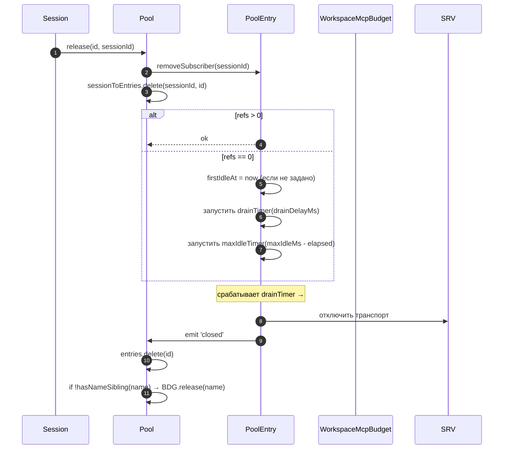
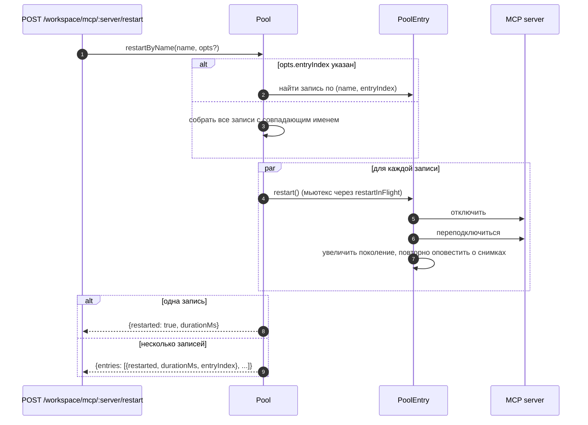
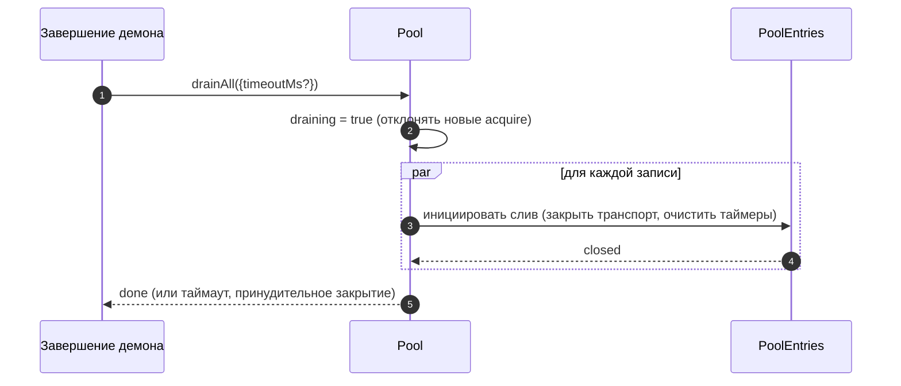

# Workspace MCP Transport Pool

## Обзор

`McpTransportPool` (`packages/core/src/tools/mcp-transport-pool.ts`) — это пул уровня рабочей области в F2 (#4175 commit 5): несколько ACP-сессий на одном демоне используют один транспорт на уникальный кортеж `(serverName + configFingerprint)`, вместо того чтобы каждая порождала собственный MCP-дочерний процесс. Пул находится **внутри ACP-дочернего процесса** (`QwenAgent.mcpPool`), создаётся однократно при запуске агента с начальным `Config` демона и переживает жизненные циклы сессий. Записи ведут подсчёт ссылок на прикреплённые сессии и закрываются после настраиваемого периода ожидания, когда счётчик ссылок достигает нуля.

Это основной механизм, предотвращающий порождение многосессионным демоном по одной копии каждого MCP-сервера на сессию.

## Обязанности

- Получить или породить один MCP-транспорт на `(имя + отпечаток)`, дедуплицируя конкурентные запросы через `spawnInFlight`.
- Освобождать ссылки по сессиям; установить таймер слива записи, когда последняя ссылка отсоединяется.
- Переживать высокую частоту изменений счётчика ссылок с помощью жёсткого предела `MAX_IDLE_MS`, чтобы интенсивно работающий клиент не мог удерживать бездействующий транспорт вечно.
- Вести обратный индекс (`sessionToEntries`) для подсчёта ссылок по сессиям, чтобы `releaseSession(sessionId)` выполнялся за O(ссылки), а не O(записи).
- Перезапускать записи по запросу (`restartByName`) — для одной записи возвращается `{restarted, durationMs}`, для нескольких — `{entries: RestartResult[]}` (контракт для нескольких записей в F2).
- Сливать весь пул при завершении демона с настраиваемым тайм-аутом; отклонять новые запросы на получение во время слива.
- Обращаться к `WorkspaceMcpBudget` (см. [`06-mcp-budget-guardrails.md`](./06-mcp-budget-guardrails.md)) при `acquire` для соблюдения лимитов резервирования по имени; освобождать слот при закрытии записи, если ни одна родственная запись не содержит то же имя.
- Создавать отфильтрованные по сессии снимки инструментов/подсказок через `SessionMcpView`, чтобы обнаружение в одной сессии не регистрировало инструменты в других сессиях.

## Архитектура

### Публичный интерфейс

```ts
class McpTransportPool {
  constructor(cliConfig: Config, options: McpTransportPoolOptions);
  acquire(
    serverName,
    cfg,
    sessionId,
    sessionToolRegistry,
    sessionPromptRegistry,
  ): Promise<PooledConnection>;
  release(id, sessionId): void;
  releaseSession(sessionId): void;
  restartByName(
    name,
    opts?,
  ): Promise<RestartResult | { entries: RestartResult[] }>;
  drainAll(opts?): Promise<void>;
  getBudget(): WorkspaceMcpBudget | undefined;
  getSnapshot(): McpPoolSnapshot;
}
```

`McpTransportPoolOptions`:

- `workspaceContext: WorkspaceContext` (обязательно).
- `debugMode: boolean`.
- `sendSdkMcpMessage?` — обратный вызов для каждой сессии (пул обходит SDK MCP).
- `pooledTransports?: ReadonlySet<McpTransportKind>` — по умолчанию `{stdio, websocket}`. Транспорты HTTP/SSE по умолчанию остаются вне пула, поскольку их заголовки могут содержать специфичные для сессии состояния OAuth, но операторы могут явно включить их в пул с помощью `QWEN_SERVE_MCP_POOL_TRANSPORTS`.
- `drainDelayMs?` — по умолчанию `30_000`.
- `entryOptions?: (transport) => PoolEntryOptions`.
- `budget?: WorkspaceMcpBudget`.

### Внутреннее состояние

| Состояние           | Тип                                    | Назначение                                                                                         |
| ------------------- | -------------------------------------- | -------------------------------------------------------------------------------------------------- |
| `entries`           | `Map<ConnectionId, PoolEntry>`         | Живые записи пула, индексированные по `connectionIdOf(name, fingerprint)`.                         |
| `unpooledIds`       | `Set<ConnectionId>`                    | Записи для транспортов, не входящих в список разрешённых `pooledTransports`.                       |
| `spawnInFlight`     | `Map<ConnectionId, Promise<PoolEntry>>`| Дедуплицирует конкурентные «холодные» запросы на получение для одного ключа.                       |
| `sessionToEntries`  | `Map<string, Set<ConnectionId>>`       | Обратный индекс V21-2 для O(ссылки) `releaseSession`.                                              |
| `draining`          | `boolean`                              | Мьютекс слива — после установки все вызовы `acquire` отклоняются.                                  |
| `nextIndexByName`   | `Map<string, number>`                  | Монотонный `entryIndex` V21-7 для каждого имени сервера (панели не перетасовываются при появлении новой записи). |

### `PoolEntry` (структура записи, `mcp-pool-entry.ts`)

Автомат состояний: `spawning → active ⇄ (active ↔ reconnect) → (active → draining при последнем отсоединении, draining → active при присоединении ИЛИ draining → closed по таймеру)`.

| Поле                                                  | Назначение                                                                         |
| ----------------------------------------------------- | ---------------------------------------------------------------------------------- |
| `localStatus: MCPServerStatus`                        | Определяется жизненным циклом `MCPServerStatus`.                                   |
| `state: PoolEntryState`                               | `spawning`/`active`/`draining`/`closed`/`failed`.                                  |
| `generation: number`                                  | Увеличивается при каждом перезапуске; подписчики сравнивают для обнаружения циклов переподключения. |
| `refs: Set<string>`                                   | Идентификаторы сессий, в данный момент прикреплённых.                              |
| `subscribers: Map<string, SessionMcpView>`            | Отфильтрованные представления для каждой сессии.                                   |
| `subscriberHandles: Map<string, PooledConnectionImpl>`| Обработчики, возвращаемые из `acquire`.                                            |
| `toolsSnapshot[], promptsSnapshot[]`                   | Канонические снимки на уровне пула; перевыпускаются при `toolsChanged` / `promptsChanged`. |
| `drainTimer?`                                          | Устанавливается, когда `refs.size === 0`; по умолчанию 30 с. Сбрасывается при присоединении. |
| `maxIdleTimer?`                                        | Устанавливается при первом бездействии; не сбрасывается при изменениях счётчика ссылок. По умолчанию 5 мин. |
| `firstIdleAt?`                                         | Метка для жёсткого предела максимального бездействия.                              |
| `restartInFlight?`                                     | Мьютекс для `restart()`.                                                            |
### `PoolEntryOptions`

```ts
interface PoolEntryOptions {
  drainDelayMs: number; // по умолчанию 30_000
  maxIdleMs: number; // по умолчанию 5 * 60_000
  maxReconnectAttempts: number; // по умолчанию 3 (stdio/ws) или 5 (http/sse)
  reconnectStrategy:
    | { kind: 'fixed'; delayMs: number }
    | { kind: 'exponential'; baseMs: number; capMs: number };
}
```

`defaultPoolEntryOptions(transport)` (`mcp-pool-entry.ts`) возвращает для stdio/ws значения по умолчанию `{fixed 5s, 3 attempts}`, а для http/sse — `{exponential 1s → 16s, 5 attempts}`. Для удалённых транспортов используются более щедрые бюджеты повторных попыток, поскольку их сбои чаще носят временный характер.

## Рабочий процесс

### `acquire`

```mermaid
sequenceDiagram
    autonumber
    participant S as Session
    participant P as Pool
    participant SIF as spawnInFlight
    participant E as PoolEntry
    participant BDG as WorkspaceMcpBudget
    participant SRV as MCP server

    S->>P: acquire(name, cfg, sessionId, sessionToolRegistry, sessionPromptRegistry)
    P->>P: отказ, если выполняется слив
    P->>P: connectionId = connectionIdOf(name, fingerprint)
    P->>P: if !isPoolable(cfg) → пометить как непулируемый
    alt запись в entries (тёплое)
        E-->>P: существующий PoolEntry
    else запуск в обработке (холодный)
        SIF-->>P: существующий Promise<PoolEntry>
    else холодный старт
        P->>BDG: tryReserve(name) (если задан бюджет + пулируемый)
        BDG-->>P: 'reserved' | 'already_held' | 'refused'
        alt отказ
            P->>BDG: recordRefusal(name, transport)
            P-->>S: BudgetExhaustedError
        else ok
            P->>E: spawnEntry(name, cfg)
            E->>SRV: подключить транспорт
            SRV-->>E: готово
            P->>P: entries.set(id, E); nextIndexByName++
            E-->>P: подключено
        end
    end
    P->>E: addSubscriber(sessionId, sessionToolRegistry, sessionPromptRegistry)
    P->>P: sessionToEntries.add(sessionId, id)
    P->>P: отменить таймер слива (refs>0)
    P-->>S: PooledConnection { id, serverName, entryIndex, client, toolsSnapshot, promptsSnapshot, on, off, release }
```

### `release` + слив



`hasNameSibling(name)` (`mcp-transport-pool.ts`) перебирает как `entries.values()`, так и `spawnInFlight.keys()`, парся последние с помощью `parseConnectionId` (имена серверов могут легально содержать `::`, поэтому `startsWith` дало бы ложное срабатывание на имени сестры, начинающемся с `${name}::`).

`releaseSession(sessionId)` читает из `sessionToEntries`, освобождает все связанные записи за O(refs) и очищает запись в индексе. Используется в пути закрытия сессии моста, чтобы не перебирать всю карту записей.

### `restartByName`



Предварительная проверка бюджета на уровне HTTP-демона возвращает `{restarted:false, skipped:true, reason:'budget_would_exceed'}` (контроль мутаций Wave 4), когда целевой слот ещё не зарезервирован, и перезапуск превысил бы лимит `enforce`.

### `drainAll`



## Состояние и жизненный цикл

- Создание пула синхронно; первый вызов `acquire` холодно запускает транспорт.
- `drainDelayMs` (по умолчанию 30 с) сбрасывается до отмены при подключении.
- `maxIdleMs` (по умолчанию 5 мин) **никогда** не сбрасывается при подключении/отключении — отсчёт начинается при ПЕРВОМ простое и останавливается только тогда, когда запись действительно закрывается или переподключается до наступления дедлайна. Защита от клиентов, вызывающих дребезг.
- `nextIndexByName` монотонно растёт. Старые записи сохраняют свой назначенный индекс даже после появления новых, поэтому панели мониторинга, читающие `entryIndex`, не перетасовываются.
- Ошибка запуска освобождает зарезервированный слот бюджета (V21-4 — без этого холодный старт, упавший в середине подключения, навсегда сохранил бы резервацию).
## Зависимости

- `packages/core/src/tools/mcp-client.ts` — `McpClient`, перечисление состояний, `SendSdkMcpMessage`.
- `packages/core/src/tools/mcp-pool-entry.ts` — `PoolEntry`, `PoolEntryOptions`, `defaultPoolEntryOptions`.
- `packages/core/src/tools/mcp-pool-key.ts` — `connectionIdOf`, `parseConnectionId`, `isPoolable`, `mcpTransportOf`, `POOLED_TRANSPORTS_DEFAULT`.
- `packages/core/src/tools/mcp-pool-events.ts` — `ConnectionId`, `PoolEntryState`, `PoolEvent`.
- `packages/core/src/tools/session-mcp-view.ts` — представление для конкретной сессии, фильтрующее снимки пула.
- `packages/core/src/tools/mcp-workspace-budget.ts` — `WorkspaceMcpBudget` (см. [`06-mcp-budget-guardrails.md`](./06-mcp-budget-guardrails.md)).
- `packages/core/src/tools/mcp-discovery-timeout.ts` — `discoveryTimeoutFor`, `runWithTimeout`.

## Конфигурация

| Источник                     | Регулятор                                                        | Эффект                                                                                                                                    |
| ---------------------------- | ---------------------------------------------------------------- | ----------------------------------------------------------------------------------------------------------------------------------------- |
| Env                          | `QWEN_SERVE_NO_MCP_POOL=1`                                       | Аварийный выключатель — `QwenAgent.mcpPool` остаётся неопределённым; посизионный `McpClientManager` принудительно действует (путь до F2).  |
| Флаг                         | `--mcp-client-budget=N`, `--mcp-budget-mode={off,warn,enforce}`  | Передаётся процессу ACP через `childEnvOverrides`; дочерний процесс создаёт `WorkspaceMcpBudget` и передаёт его пулу.                     |
| Теги возможностей (условно)  | `mcp_workspace_pool`, `mcp_pool_restart`                         | Анонсируются вместе, когда пул активен. SDK использует оба для ветвления по чувствительным к пулу формам ответов.                        |

### Непулловые записи (HTTP / SSE / SDK-MCP)

Транспорты, не входящие в разрешённый список `pooledTransports` (по умолчанию HTTP, SSE и SDK-MCP), идут по отдельному пути: `createUnpooledConnection(name, cfg, sessionId, ...)` (`mcp-transport-pool.ts`) создаёт запись для каждой сессии с идентификатором `${name}::unpooled-${entryIndex}`. Отличия от пулловых записей:

- Хранятся в `entries` И отслеживаются в `unpooledIds: Set<ConnectionId>`, чтобы `release` / `releaseSession` могли быстро закрыть при отсоединении (макс. количество ссылок — 1).
- Вместо воспроизведения пула используется `McpClient.discover()` напрямую; `applyTools` / `applyPrompts` ничего не делают, потому что реестры сессии уже содержат зарегистрированные данные (W77 / `skipReplay: true` в `attach()`).
- Рабочий бюджет всё равно их ограничивает — последующее исправление F2 закрыло прежнюю лазейку, когда непулловые соединения обходили `tryReserve`; тот же слот `WorkspaceMcpBudget` резервируется и освобождается при закрытии записи (как пулловой, так и непулловой).

Гонка W77 (`cb206da36`): `createUnpooledConnection` сохраняет запись в `this.entries` ДО того, как произойдёт `await client.connect()` / `client.discover()`, но индексирует `sessionToEntries[sessionId]` ТОЛЬКО после успешного `attach()`. Параллельный вызов `closeStoredSession()` / `releaseSession(sessionId)` во время окна connect/discover видел пустой индекс, позволял непулловому запуску завершиться, а потом `attach()` регистрировал инструменты/подсказки в уже закрытой сессии. Исправление:

- `mcp-pool-entry.ts`: публичный метод `isTerminated(): boolean` (проверяет `state === 'closed' || state === 'failed'`).
- `mcp-pool-entry.ts`: `markActive()` досрочно завершается, если `isTerminated()` истинно, чтобы разрушенная запись не могла быть восстановлена в состояние `'active'`.
- Вызывающие стороны (непулловый путь пула) проверяют `isTerminated()` между вызовами await и прерывают присоединение, если родительская сессия исчезла.

Эта гонка была скрытой на тот момент (хуки `releaseSession` для каждой сессии из W61/W71 появятся в F4), но стала бы активной сразу после появления этого хука. Исправление было внесено на раннем этапе серии F2.

## `GET /workspace/mcp` — поля снимка состояния с поддержкой пула

Когда пул активен, каждая ячейка `ServeWorkspaceMcpStatus` сервера
(`packages/acp-bridge/src/status.ts`) включает три дополнительных поля:

| Поле              | Тип                                        | Назначение                                                                                                                                                                                                                                                                                                                                        |
| ----------------- | ------------------------------------------- | ------------------------------------------------------------------------------------------------------------------------------------------------------------------------------------------------------------------------------------------------------------------------------------------------------------------------------------------------- |
| `disabledReason`  | `'config' \| 'budget'`                      | Позволяет отличить серверы, отключённые оператором (`disabled: true` из `disabledMcpServers`), от отказа из-за бюджета (`status: 'error', errorKind: 'budget_exhausted'`). Панели управления могут отображать одну строку сервера без необходимости читать `errors[]` или `budgets[]`.                                                              |
| `entryCount`      | `number` (`>=1`)                            | В режиме пула рабочее пространство может иметь несколько экземпляров `PoolEntry` с одинаковым именем, когда сессии вводят разные отпечатки, например, заголовки OAuth, зависящие от сессии. Это поле отсутствует, когда `QWEN_SERVE_NO_MCP_POOL=1` отключает пул. Новые клиенты отображают значок «N записей», если `entryCount > 1`.              |
| `entrySummary`    | `ReadonlyArray<{entryIndex, refs, status}>` | Детализация по каждой записи. `entryIndex` — стабильное непрозрачное целое число, присвоенное при создании записи; это не сырой отпечаток, поэтому различия снимков не раскрывают время ротации OAuth или окружения. `refs` — текущее количество присоединённых сессий. `status` позволяет панелям управления отображать здоровье каждой записи, в то время как агрегированный `mcpStatus` уже показывает «подключено». |
`(entryCount, entrySummary)` всегда передаются парой. Тег возможности `mcp_workspace_pool` подразумевает оба поля. Старые клиенты SDK игнорируют их в рамках контракта аддитивного протокола.

Снимки пула также раскрывают `subprocessCount`. Он учитывает только семейство `'stdio'`. Транспорты WebSocket, HTTP и SSE подключаются к удаленным серверам и не порождают локальные дочерние процессы. В ранних версиях транспорты WebSocket учитывались как локальные подпроцессы, что завышало показатели на панелях ресурсов.

## Слив выполняется из обоих путей завершения

Слив пула не ограничивается обработчиком SIGTERM. Обычный путь завершения IDE (`await connection.closed`) также вызывает `drainAll` через `drainPoolBeforeExit` в `packages/cli/src/acp-integration/acpAgent.ts`. Независимо от того, получает ли демон сигнал процесса или IDE корректно закрывает свое соединение, пул переходит в состояние `draining`, отказывает в новых захватах и ожидает закрытия записей.

## `/mcp refresh` использует общий путь обнаружения при загрузке

`discoverAllMcpTools` (обнаружение при загрузке) и `discoverAllMcpToolsIncremental` (`/mcp refresh` / горячая перезагрузка) оба сначала обращаются к пулу в режиме пула (`packages/core/src/tools/mcp-client-manager.ts`). Общий шлюз предотвращает случайное создание клиента для сессии, двойной учет бюджета или оставление осиротевшего транспорта при горячей перезагрузке.

## Вызовы инструментов в полете во время переподключения (`MCPCallInterruptedError`)

Когда нижележащий транспорт MCP молча отключается (соединение переходит из `'active'` / `'draining'` в `localStatus === DISCONNECTED` без явного закрытия), пул помечает запись как `'failed'`, удаляет ее из `pool.entries` и генерирует событие `failed` до отсоединения представлений подписчиков. Этот порядок (сначала генерация, затем отсоединение) важен: подписчики получают событие `failed` достаточно рано, чтобы перенаправить ожидающие обещания `callTool` в `MCPCallInterruptedError`, так что застрявший `await client.callTool(...)` корректно отклоняется, а не зависает. `forceShutdown` использует тот же порядок: сначала генерация, затем отсоединение.

## Отпечаток и нормализация `canonicalOAuth`

Ключ пула получается из `fingerprint(cfg)` в `mcp-pool-key.ts`. Хэш покрывает все поля, определяющие транспорт:

> `transport, command, args, cwd, env, url, httpUrl, tcp, headers, timeout, oauth`

Поля фильтрации и метаданных для каждой сессии (`includeTools`, `excludeTools`, `trust`, `description`, `extensionName`, `discoveryTimeoutMs`) исключены, поэтому сессии с разными фильтрами могут использовать одну запись.

Для ячейки OAuth `canonicalOAuth(o)` хэширует каждое поле `MCPOAuthConfig`: `clientId`, `clientSecret`, отсортированные `scopes`, отсортированные `audiences`, `authorizationUrl`, `tokenUrl`, `redirectUri`, `tokenParamName` и `registrationUrl`. Это контракт изоляции учетных данных: две конфигурации сессии, отличающиеся только `clientSecret`, `audiences` или `redirectUri`, получают разные отпечатки и не могут использовать одну запись. Конфиденциальные клиенты и развертывания с несколькими аудиториями зависят от этого.

Сортировка `scopes` и `audiences` делает порядок вызова несущественным. Явный `null` нормализуется, так что неопределенные поля хэшируются так же, как явный null. Ключ не включает `discoveryTimeoutMs`; одновременные вызовы захвата с одним и тем же ключом, но разными таймаутами, работают по принципу "первый победил", что соответствует поведению менеджера для каждой сессии до F2.

`PoolEntry` хранит `cfg: MCPServerConfig` приватно. Внешний код должен использовать геттер `entry.transportKind`, когда ему нужно семейство транспорта. Это предотвращает случайную утечку полей env, header auth и OAuth потребителям.

## Выгрузка расширений полагается на `MAX_IDLE_MS`

Намеренно отсутствует активный путь очистки для выгрузки расширения MCP во время выполнения. Осиротевшие записи, чей `MCPServerConfig` больше не появляется в объединенных настройках рабочей области, естественным образом удаляются с помощью жесткого лимита `MAX_IDLE_MS` после отсоединения последнего подписчика. Синхронный путь выгрузки-очистки добавил бы сложности для редкого операторского крайнего случая; жесткий лимит ограничивает время жизни осиротевшего процесса после точки выгрузки до 5 минут по умолчанию.

Операторы, которым нужна более быстрая очистка, могут перезапустить демон или вызвать `POST /workspace/mcp/:server/restart` для теперь уже не настроенного имени, что проходит через путь отключенного сервера и разрушает запись.

## Наблюдаемость самовосстановления

Пул генерирует две структурированные диагностики на пути самовосстановления:

**`McpClient.lastTransportError: Error | undefined`** (`packages/core/src/tools/mcp-client.ts`) — `McpClient.onerror` сохраняет последнее исключение транспорта в приватном поле и очищает его при входе в `connect()`. Путь тихого сброса `PoolEntry` читает `client.getLastTransportError()` и включает его в `emit({kind:'failed', lastError})`, поэтому подписчики и панели управления не должны искать первопричину в stderr.

**`SweepResult`** (внутренний интерфейс, не экспортируется; `packages/core/src/tools/mcp-pool-entry.ts`) — `sweepAndDisconnect(reason)` возвращает `Promise<SweepResult>`:

```ts
interface SweepResult {
  pidSweepError?: Error; // listDescendantPids itself threw
  descendantsFound?: number; // descendant pid count found
  descendantsSignaled?: number; // successfully SIGTERM'd count
}
```
Единственным потребителем является блок silent-drop в `statusChangeListener`. Он использует `descendantsFound` / `descendantsSignaled` для обнаружения случаев частичной отправки сигналов (меньше процессов получили сигнал, чем было найдено — обычно из-за того, что процесс завершился или произошёл EPERM между `listDescendantPids` и `sigtermPids`) и ошибок при обходе, после чего записывает структурированное предупреждение. `forceShutdown` и `doRestart` игнорируют это возвращаемое значение, так как их собственные пути обработки исключений уже содержат более подробные сигналы об ошибках.

## Очистка подпроцессов: путь моментального снимка `pid-descendants`

При завершении работы подпроцессов stdio `McpTransportPool` должен перечислить их дочерние процессы; обёртки `npx` и оболочки могут создавать несколько уровней форков. `packages/core/src/tools/pid-descendants.ts` предоставляет `listDescendantPids(rootPid) → Promise<number[]>` и `sigtermPids(pids)` для `sweepAndDisconnect`.

### Основной путь для Linux / macOS

Один моментальный снимок `ps -A -o pid=,ppid=` читает таблицу процессов, разбирает её в `Map<ppid, pid[]>`, после чего `walkDescendants(tree, root)` выполняет поиск в ширину (BFS) для извлечения поддерева. Для любой глубины требуется только один форк `ps`.

`walkDescendants` поддерживает `visited: Set<number>` и включает `root` в это множество для защиты от циклов, возникающих из-за повторного использования PID. При быстрой смене процессов теоретически возможны циклы A→B / B→A. Без `visited` обходчик может заполнить лимит `MAX_DESCENDANTS` фиктивными данными, вытеснив настоящих потомков.

### Основной путь для Windows

Один моментальный снимок `Get-CimInstance Win32_Process | ConvertTo-Csv -Delimiter ","` выводит все строки `(ProcessId, ParentProcessId)`, затем применяется тот же путь `Map` и `walkDescendants`.

Явное указание `-Delimiter ","` необходимо. PowerShell 5.1, поставляемый с Windows, по умолчанию использует системный разделитель списка для локали; в локалях DE, FR, NL, IT и подобных используется `;`, поэтому парсер `^"(\d+)","(\d+)"$` никогда не срабатывал, и каждый останов демона откатывался к пути фильтра CIM для каждого PID, что добавляло примерно 0.5–1 с на запуск PowerShell на каждый дочерний процесс.

### Резервный путь

BusyBox <v1.28 не поддерживает `ps -o`, контейнеры distroless могут не включать `ps`, а в некоторых средах Windows вывод CIM урезается из-за ACL. Когда основной путь разбирает ноль строк или вызывает исключение, код откатывается к BFS для каждого PID: в Linux/macOS используется `pgrep -P <pid>`, в Windows — `Get-CimInstance -Filter "ParentProcessId=$p"`, где `$p` — привязка переменной PowerShell, а не конкатенация строк. Текущая проверка `Number.isInteger` достаточна для точки входа, а привязка является защитой в глубину.

### Общие ограничения

Оба пути ограничены значениями `MAX_DESCENDANTS = 256` и `MAX_DEPTH = 8`, чтобы вредоносное или вырожденное дерево процессов не замедляло обход.

Путь моментального снимка использует `maxBuffer: 8MB`, что достаточно для патологических систем с примерно 250k процессов. Стандартный буфер Node в 1MB может обрезать вывод дочерних процессов при около 30k процессов.

Прирост производительности намеренно скромный (типичные рабочие машины разработчика с 200–500 процессов разбираются менее чем за 10 мс, что примерно в 2 раза быстрее, чем поштучный `pgrep`). Основное преимущество — гигиена форков и согласованность снимка: BFS видит всё поддерево сразу, тогда как прежний путь поштучных запросов мог пропустить процесс-внука, созданный между двумя запросами.

## Примечание для встраивающего кода: конструктор `McpClientManager`

`McpClientManager` конструируется как `(config, toolRegistry, options?: McpClientManagerOptions)`. Встраивающий код, импортирующий класс напрямую, должен передавать:

```ts
new McpClientManager(config, toolRegistry, {
  eventEmitter,
  sendSdkMcpMessage,
  healthConfig,
  budgetConfig,
  pool,
});
```

Тестам следует использовать фабрику `mkManager(overrides?)`, чтобы случаи, в которых важны одно или два поля, оставались однострочными.

## Примечания к реализации

Эти вспомогательные функции являются внутренними, но читатели исходного кода могут их встретить:

- `McpTransportPool.acquire()` использует `attachPooledSession` и `rollbackReservationOnSpawnFailure` для совместного использования быстрого пути присоединения, присоединения после порождения и поведения отлова во время полёта. Поведение во время выполнения не меняется; инварианты окна состязания по-прежнему находятся в точках вызовов.
- `SessionMcpView.applyTools` / `applyPrompts` компилируют `includeTools` / `excludeTools` один раз через `compileNameFilter(cfg)` и проверяют каждый инструмент с помощью `compiledFilterAccepts(compiled, name)`. Экспортируемые `passesSessionFilter` / `passesSessionPromptFilter` используют тот же скомпилированный путь. `excludeTools` сравнивает точно; `includeTools` отбрасывает суффикс `(...)`, так что `toolName(args)` соответствует `toolName`.

Дизайн-документ: [`../../design/f2-mcp-transport-pool.md`](../../design/f2-mcp-transport-pool.md) §6 описывает автомат состояний пула транспортов, повторное подключение, очистку и обход дочерних процессов.

## Предостережения и известные ограничения

- **Транспорты HTTP / SSE по умолчанию не пулируются** — если операторы явно не включают их в `QWEN_SERVE_MCP_POOL_TRANSPORTS`, каждый acquire создаёт свежую запись, которая существует только в течение своей сессии. Их заголовки могут содержать специфическое для сессии состояние OAuth, поэтому пулирование по умолчанию привело бы к риску утечки учётных данных между сессиями.
- **`maxIdleMs` — жёсткий лимит, который переживает смену присоединения/отсоединения.** Жёсткий лимит в 5 минут простоя означает, что даже клиент, активно присоединяющийся и отсоединяющийся, не сможет удержать idle-транспорт дольше 5 минут. Операторы, желающие закрепить долгоживущие транспорты, должны увеличить `maxIdleMs` или запустить сервер вне пула.
- **Слоты бюджета на имя сервера** означают, что две записи пула с одинаковым именем, но разными отпечатками, используют ОДИН слот, а не два. Учёт подпроцессов отображается отдельно через `pool.getSnapshot().subprocessCount`.
- **Регрессия `startsWith`** была предотвращена в `hasNameSibling`, поскольку имена MCP-серверов могут содержать `::` (см. `mcp-pool-key.test.ts`). Всегда используйте разбиение `parseConnectionId` по `lastIndexOf('::')`, никогда не сопоставляйте по префиксу строки.
- **Очистка пула однонаправленная** — `drainAll` устанавливает `draining = true` навсегда; для дальнейшей работы требуется новый пул.
## Ссылки

- `packages/core/src/tools/mcp-transport-pool.ts` (весь файл)
- `packages/core/src/tools/mcp-pool-entry.ts` (жизненный цикл записи)
- `packages/core/src/tools/mcp-pool-key.ts` (`connectionIdOf`, `parseConnectionId`)
- `packages/core/src/tools/mcp-pool-events.ts` (типы событий)
- `packages/core/src/tools/session-mcp-view.ts` (фильтрованное представление на сессию)
- Документ дизайна F2 (v2.2, с changelog, включающим 32 элемента review fold-in): [`../../design/f2-mcp-transport-pool.md`](../../design/f2-mcp-transport-pool.md). Считайте контракт дизайна авторитетным; эта страница — глубокое погружение для разработчика.
- Заметки к дизайну F2: задача [#4175](https://github.com/QwenLM/qwen-code/issues/4175) (коммиты 4–6 серии F2).
