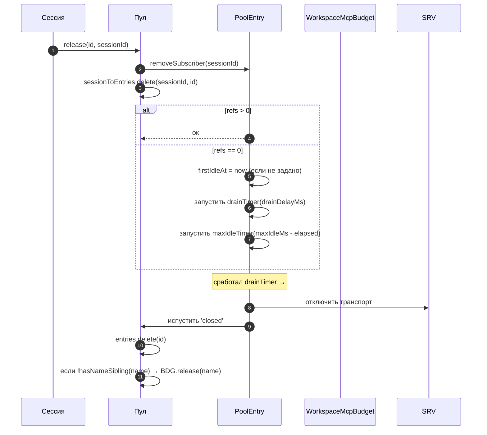
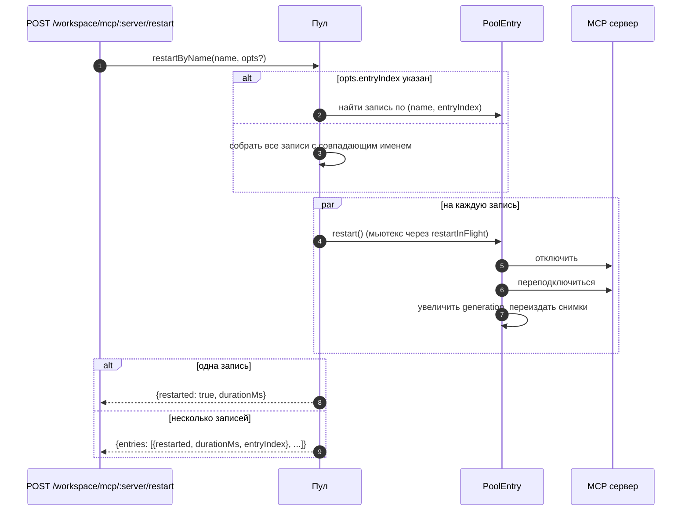
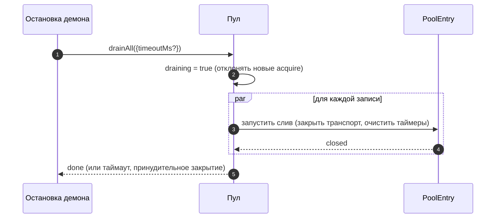

# Пул транспортов рабочей области MCP

## Обзор

`McpTransportPool` (`packages/core/src/tools/mcp-transport-pool.ts`) — это пул уровня рабочей области в F2 (#4175 commit 5): несколько сессий ACP на одном демоне используют один транспорт на уникальный кортеж `(serverName + configFingerprint)`, вместо того чтобы каждая сессия порождала собственный дочерний процесс MCP. Пул находится **внутри дочернего процесса ACP** (`QwenAgent.mcpPool`), создаётся один раз при запуске агента с загрузочным `Config` демона и переживает жизненные циклы сессий. Записи ведут подсчёт ссылок на подключения сессий и закрываются после настраиваемого периода ожидания, когда счётчик ссылок достигает нуля.

Это основной механизм, предотвращающий создание многократных копий каждого MCP-сервера на сессию в многопользовательском демоне.

## Обязанности

- Получить или породить один транспорт MCP на кортеж `(имя + отпечаток)`, дедуплицируя одновременные запросы через `spawnInFlight`.
- Освобождать ссылки на сессии; запускать таймер слива записи, когда последняя ссылка отсоединяется.
- Выдерживать колебания числа ссылок с жёстким пределом `MAX_IDLE_MS`, чтобы «дёргающийся» клиент не мог удерживать простаивающий транспорт бесконечно.
- Вести обратный индекс (`sessionToEntries`) для подсчёта ссылок на сессии, чтобы `releaseSession(sessionId)` работал за O(ссылок), а не за O(записей).
- Перезапускать записи по требованию (`restartByName`) — для одной записи возвращается `{restarted, durationMs}`, для нескольких — `{entries: RestartResult[]}` (контракт нескольких записей F2).
- Сливать весь пул при выключении демона с настраиваемым таймаутом; отклонять новые запросы `acquire` во время слива.
- Обращаться к `WorkspaceMcpBudget` (см. [`06-mcp-budget-guardrails.md`](./06-mcp-budget-guardrails.md)) при `acquire` для соблюдения квот резервирования по имени; освобождать слот при закрытии записи, если ни одна родственная запись с тем же именем не осталась.
- Создавать отфильтрованные по сессии снимки инструментов/подсказок через `SessionMcpView`, чтобы обнаружение в одной сессии не регистрировало инструменты в других сессиях.

## Архитектура

### Публичный интерфейс

```ts
class McpTransportPool {
  constructor(cliConfig: Config, options: McpTransportPoolOptions);
  acquire(
    serverName,
    cfg,
    sessionId,
    sessionToolRegistry,
    sessionPromptRegistry,
  ): Promise<PooledConnection>;
  release(id, sessionId): void;
  releaseSession(sessionId): void;
  restartByName(
    name,
    opts?,
  ): Promise<RestartResult | { entries: RestartResult[] }>;
  drainAll(opts?): Promise<void>;
  getBudget(): WorkspaceMcpBudget | undefined;
  getSnapshot(): McpPoolSnapshot;
}
```

`McpTransportPoolOptions`:

- `workspaceContext: WorkspaceContext` (обязательно).
- `debugMode: boolean`.
- `sendSdkMcpMessage?` — колбэк на сессию (пул обходит SDK MCP).
- `pooledTransports?: ReadonlySet<McpTransportKind>` — по умолчанию `{stdio, websocket}`. Транспорты HTTP/SSE остаются непуллированными по умолчанию, так как их заголовки могут содержать состояние OAuth для конкретной сессии, но операторы могут явно включить их в пулинг с помощью `QWEN_SERVE_MCP_POOL_TRANSPORTS`.
- `drainDelayMs?` — по умолчанию `30_000`.
- `entryOptions?: (transport) => PoolEntryOptions`.
- `budget?: WorkspaceMcpBudget`.

### Внутреннее состояние

| Состояние            | Тип                                      | Назначение                                                                                          |
| -------------------- | ---------------------------------------- | --------------------------------------------------------------------------------------------------- |
| `entries`            | `Map<ConnectionId, PoolEntry>`           | Активные записи пула, ключ — `connectionIdOf(name, fingerprint)`.                                   |
| `unpooledIds`        | `Set<ConnectionId>`                      | Записи для транспортов вне сконфигурированного списка `pooledTransports`.                           |
| `spawnInFlight`      | `Map<ConnectionId, Promise<PoolEntry>>`  | Дедупликация одновременных холодных запросов `acquire` для одного ключа.                            |
| `sessionToEntries`   | `Map<string, Set<ConnectionId>>`         | V21-2 обратный индекс для O(ссылок) в `releaseSession`.                                              |
| `draining`           | `boolean`                                | Мьютекс слива — при установке все вызовы `acquire` отклоняются.                                      |
| `nextIndexByName`    | `Map<string, number>`                    | V21-7 монотонный `entryIndex` для каждого имени сервера (дашборды не перемешиваются при появлении новой записи). |

### `PoolEntry` (структура на запись, `mcp-pool-entry.ts`)

Автомат состояний: `spawning → active ⇄ (active ↔ reconnect) → (active → draining при последнем отсоединении, draining → active при присоединении ИЛИ draining → closed по таймеру)`.

| Поле                                                    | Назначение                                                                        |
| ------------------------------------------------------- | --------------------------------------------------------------------------------- |
| `localStatus: MCPServerStatus`                          | Управляется жизненным циклом `MCPServerStatus`.                                   |
| `state: PoolEntryState`                                 | `spawning`/`active`/`draining`/`closed`/`failed`.                                 |
| `generation: number`                                    | Увеличивается при каждом перезапуске; подписчики сравнивают для обнаружения циклов переподключения. |
| `refs: Set<string>`                                     | Идентификаторы сессий, в данный момент подключённых.                              |
| `subscribers: Map<string, SessionMcpView>`             | Отфильтрованные представления на сессию.                                          |
| `subscriberHandles: Map<string, PooledConnectionImpl>` | Обработчики, возвращаемые из `acquire`.                                           |
| `toolsSnapshot[], promptsSnapshot[]`                   | Канонические снимки на уровне пула; переиздаются по событиям `toolsChanged`/`promptsChanged`. |
| `drainTimer?`                                           | Запускается, когда `refs.size === 0`; по умолчанию 30 с. Сбрасывается при присоединении. |
| `maxIdleTimer?`                                         | Запускается при первом простое; никогда не сбрасывается переключением ссылок. По умолчанию 5 мин. |
| `firstIdleAt?`                                          | Отметка для жёсткого предела максимального простоя.                                |
| `restartInFlight?`                                      | Мьютекс для `restart()`.                                                          |

### `PoolEntryOptions`

```ts
interface PoolEntryOptions {
  drainDelayMs: number; // по умолчанию 30_000
  maxIdleMs: number; // по умолчанию 5 * 60_000
  maxReconnectAttempts: number; // по умолчанию 3 (stdio/ws) или 5 (http/sse)
  reconnectStrategy:
    | { kind: 'fixed'; delayMs: number }
    | { kind: 'exponential'; baseMs: number; capMs: number };
}
```

`defaultPoolEntryOptions(transport)` (`mcp-pool-entry.ts`) возвращает значения по умолчанию для stdio/ws `{фиксированная 5 с, 3 попытки}` и для http/sse `{экспоненциальная 1 с → 16 с, 5 попыток}`. Удалённые транспорты получают более длительные бюджеты повторных попыток, так как их сбои чаще бывают временными.

## Рабочий процесс

### `acquire`

```mermaid
sequenceDiagram
    autonumber
    participant S as Сессия
    participant P as Пул
    participant SIF as spawnInFlight
    participant E as PoolEntry
    participant BDG as WorkspaceMcpBudget
    participant SRV as MCP сервер

    S->>P: acquire(name, cfg, sessionId, sessionToolRegistry, sessionPromptRegistry)
    P->>P: отказать, если идёт слив
    P->>P: connectionId = connectionIdOf(name, fingerprint)
    P->>P: если !isPoolable(cfg) → пометить как непуллированный
    alt запись в entries (тёплая)
        E-->>P: существующая PoolEntry
    else идёт холодный запуск
        SIF-->>P: существующий Promise<PoolEntry>
    else холодный старт
        P->>BDG: tryReserve(name) (если бюджет задан + пуллируемый)
        BDG-->>P: 'reserved' | 'already_held' | 'refused'
        alt отказано
            P->>BDG: recordRefusal(name, transport)
            P-->>S: BudgetExhaustedError
        else ок
            P->>E: spawnEntry(name, cfg)
            E->>SRV: подключить транспорт
            SRV-->>E: готово
            P->>P: entries.set(id, E); nextIndexByName++
            E-->>P: подключено
        end
    end
    P->>E: addSubscriber(sessionId, sessionToolRegistry, sessionPromptRegistry)
    P->>P: sessionToEntries.add(sessionId, id)
    P->>P: отменить таймер слива (refs>0)
    P-->>S: PooledConnection { id, serverName, entryIndex, client, toolsSnapshot, promptsSnapshot, on, off, release }
```

### `release` + слив



`hasNameSibling(name)` (`mcp-transport-pool.ts`) итерирует как `entries.values()`, так и `spawnInFlight.keys()`, разбирая последние с помощью `parseConnectionId` (имена серверов могут законно содержать `::`, поэтому `startsWith` дало бы ложное срабатывание на родственное имя, начинающееся с `${name}::`).

`releaseSession(sessionId)` читает из `sessionToEntries`, освобождает все ссылки на записи за O(ссылок), затем очищает запись индекса. Используется в пути закрытия сессии мостом, чтобы не итерировать всю карту записей.

### `restartByName`



Предварительная проверка бюджета на уровне HTTP демона возвращает `{restarted:false, skipped:true, reason:'budget_would_exceed'}` (управление мутациями Wave 4), когда слот целевого сервера ещё не зарезервирован и перезапуск превысил бы `enforce`-бюджет.

### `drainAll`



## Состояние и жизненный цикл

- Создание пула синхронно; первый `acquire` холодно запускает транспорт.
- `drainDelayMs` (по умолчанию 30 с) сбрасывается при присоединении на отмену.
- `maxIdleMs` (по умолчанию 5 мин) **никогда** не сбрасывается при присоединении/отсоединении — начинает отсчёт с ПЕРВОГО простоя и останавливается только когда запись фактически закрывается или присоединяется до истечения срока. Защита от «дёргающихся» клиентов.
- `nextIndexByName` монотонен. Старые записи сохраняют свой назначенный индекс даже после появления новых, поэтому дашборды, читающие `entryIndex`, не перемешиваются.
- Сбой при запуске освобождает зарезервированный слот бюджета (V21-4 — без этого холодный запуск, упавший в середине подключения, навсегда бы удерживал резервирование).

## Зависимости

- `packages/core/src/tools/mcp-client.ts` — `McpClient`, статус-перечисление, `SendSdkMcpMessage`.
- `packages/core/src/tools/mcp-pool-entry.ts` — `PoolEntry`, `PoolEntryOptions`, `defaultPoolEntryOptions`.
- `packages/core/src/tools/mcp-pool-key.ts` — `connectionIdOf`, `parseConnectionId`, `isPoolable`, `mcpTransportOf`, `POOLED_TRANSPORTS_DEFAULT`.
- `packages/core/src/tools/mcp-pool-events.ts` — `ConnectionId`, `PoolEntryState`, `PoolEvent`.
- `packages/core/src/tools/session-mcp-view.ts` — представление на сессию, фильтрующее снимки пула.
- `packages/core/src/tools/mcp-workspace-budget.ts` — `WorkspaceMcpBudget` (см. [`06-mcp-budget-guardrails.md`](./06-mcp-budget-guardrails.md)).
- `packages/core/src/tools/mcp-discovery-timeout.ts` — `discoveryTimeoutFor`, `runWithTimeout`.

## Конфигурация

| Источник                    | Ручка                                                           | Эффект                                                                                                                                    |
| --------------------------- | --------------------------------------------------------------- | ----------------------------------------------------------------------------------------------------------------------------------------- |
| Переменная окружения        | `QWEN_SERVE_NO_MCP_POOL=1`                                      | Kill switch — `QwenAgent.mcpPool` остаётся неопределённым; `McpClientManager` на сессию (путь до F2). |
| Флаг                        | `--mcp-client-budget=N`, `--mcp-budget-mode={off,warn,enforce}` | Передаётся в дочерний процесс ACP через `childEnvOverrides`; дочерний процесс создаёт `WorkspaceMcpBudget` и передаёт его пулу. |
| Теги возможностей (условно) | `mcp_workspace_pool`, `mcp_pool_restart`                        | Объявляются вместе, когда пул включён. SDK предварительно проверяет оба для выбора подходящих форм ответа с учётом пула. |

### Непуллированные записи (HTTP / SSE / SDK-MCP)

Транспорты вне сконфигурированного списка `pooledTransports` (по умолчанию HTTP, SSE и SDK-MCP) идут по отдельному пути: `createUnpooledConnection(name, cfg, sessionId, ...)` (`mcp-transport-pool.ts`) создаёт запись на сессию с идентификатором `${name}::unpooled-${entryIndex}`. Отличия от пуллированных записей:

- Хранятся в `entries` И отслеживаются в `unpooledIds: Set<ConnectionId>`, чтобы `release`/`releaseSession` могли применить быстрый путь закрытия при отсоединении (ссылки всегда не более 1).
- Вместо воспроизведения из пула используется `McpClient.discover()`; `applyTools`/`applyPrompts` не делают ничего, так как регистры сессии уже содержат зарегистрированное (W77 / `skipReplay: true` в `attach()`).
- Бюджет рабочей области всё равно их ограничивает — доработка бюджета F2 закрыла предыдущую лазейку, когда непуллированные соединения обходили `tryReserve`; тот же слот `WorkspaceMcpBudget` резервируется и освобождается при закрытии записи (пуллированной или нет).

Гонка W77 (`cb206da36`): `createUnpooledConnection` сохраняет запись в `this.entries` ДО ожидания `client.connect()`/`client.discover()`, но индексирует `sessionToEntries[sessionId]` ТОЛЬКО после успешного `attach()`. Одновременный вызов `closeStoredSession()`/`releaseSession(sessionId)` во время окна подключения/обнаружения видел пустой индекс, позволял непуллированному запуску завершиться, и `attach()` затем регистрировал инструменты/подсказки в уже закрытой сессии. Исправление:

- `mcp-pool-entry.ts`: публичный метод `isTerminated(): boolean` (`state === 'closed' || state === 'failed'`).
- `mcp-pool-entry.ts`: `markActive()` прерывается, если `isTerminated()`, так что уничтоженная запись не может быть воскрешена до состояния `'active'`.
- Вызывающие (непуллированный путь пула) проверяют `isTerminated()` между ожиданиями и прерывают присоединение, если родительская сессия исчезла.

Эта гонка была скрытой на тот момент (хуки `releaseSession` на сессию W61/W71 появятся в F4), но стала бы активной сразу после добавления хука. Исправление было внесено рано в серии F2.

## `GET /workspace/mcp` поля снимка с учётом пула

Когда пул активен, каждая ячейка сервера `ServeWorkspaceMcpStatus`
(`packages/acp-bridge/src/status.ts`) включает три дополнительных поля:

| Поле            | Тип                                          | Назначение                                                                                                                                                                                                                                                                                                                                      |
| --------------- | -------------------------------------------- | ----------------------------------------------------------------------------------------------------------------------------------------------------------------------------------------------------------------------------------------------------------------------------------------------------------------------------------------------- |
| `disabledReason` | `'config' \| 'budget'`                      | Различает серверы, отключённые оператором (`disabled: true` из `disabledMcpServers`), и отказы бюджета (`status: 'error', errorKind: 'budget_exhausted'`). Дашборды могут отображать одну строку сервера без перекрёстного чтения `errors[]` или `budgets[]`.                                                                                   |
| `entryCount`     | `number` (`>=1`)                              | В режиме пула рабочая область может иметь несколько экземпляров `PoolEntry` с одинаковым именем, когда сессии предоставляют разные отпечатки, например заголовки OAuth для разных сессий. Это поле отсутствует, когда пул отключён (`QWEN_SERVE_NO_MCP_POOL=1`). Новые клиенты отображают значок "N entries" при `entryCount > 1`. |
| `entrySummary`   | `ReadonlyArray<{entryIndex, refs, status}>` | Детализация по записям. `entryIndex` — стабильный непрозрачный целочисленный идентификатор, присвоенный при создании записи; это не сырой отпечаток, поэтому различия снимков не раскрывают время OAuth или ротации окружения. `refs` — текущее количество подключённых сессий. `status` позволяет дашбордам показывать здоровье каждой записи, пока агрегированный `mcpStatus` уже подключён. |

`(entryCount, entrySummary)` всегда передаются парой. Тег возможностей
`mcp_workspace_pool` подразумевает оба поля. Старые клиенты SDK
игнорируют их согласно аддитивному контракту протокола.

Снимки пула также раскрывают `subprocessCount`. Он учитывает только семейство
`'stdio'`. WebSocket, HTTP и SSE транспорты подключаются к удалённым серверам и
не порождают локальные дочерние процессы. Ранние версии считали WebSocket-транспорты
локальными дочерними процессами, что завышало показатели в ресурсных дашбордах.

## Слив выполняется из обоих путей завершения

Слив пула не ограничивается обработчиком SIGTERM. Нормальный путь завершения IDE
(`await connection.closed`) также вызывает `drainAll` через
`packages/cli/src/acp-integration/acpAgent.ts`'s `drainPoolBeforeExit`. Независимо от того,
получает ли демон сигнал процесса или IDE чисто закрывает соединение,
пул переходит в состояние `draining`, отклоняет новые запросы `acquire` и ждёт закрытия записей.

## `/mcp refresh` использует общий путь обнаружения при запуске

`discoverAllMcpTools` (обнаружение при запуске) и
`discoverAllMcpToolsIncremental` (`/mcp refresh` / горячая перезагрузка) оба сначала
обращаются к пулу в режиме пула (`packages/core/src/tools/mcp-client-manager.ts`).
Общий шлюз предотвращает случайное создание клиента на сессию,
двойной учёт бюджета или оставление осиротевшего транспорта при горячей перезагрузке.

## Вызовы инструментов в полёте во время переподключения (`MCPCallInterruptedError`)

Когда базовый транспорт MCP молча отключается (соединение переходит из
`'active'`/`'draining'` в `localStatus === DISCONNECTED` без явного закрытия),
пул помечает запись как `'failed'`, удаляет её из `pool.entries` и испускает
событие `failed` перед отсоединением представлений подписчиков. Этот порядок
«испустить-перед-отсоединением» важен: подписчики получают событие `failed`
достаточно рано, чтобы направить ожидающие обещания `callTool` к
`MCPCallInterruptedError`, так что застрявшее `await client.callTool(...)` корректно
отклоняется, а не зависает. `forceShutdown` использует тот же порядок
«испустить-затем-отсоединить».
## Нормализация `fingerprint` и `canonicalOAuth`

Ключ пула формируется из `fingerprint(cfg)` в `mcp-pool-key.ts`. Хеш покрывает
все поля, определяющие транспорт:

> `transport, command, args, cwd, env, url, httpUrl, tcp, headers, timeout, oauth`

Поля посидионной фильтрации и метаданные (`includeTools`, `excludeTools`,
`trust`, `description`, `extensionName`, `discoveryTimeoutMs`) исключены,
поэтому сессии с разными фильтрами могут использовать одну запись.

Для OAuth-ячейки `canonicalOAuth(o)` хеширует каждое поле `MCPOAuthConfig`:
`clientId`, `clientSecret`, отсортированные `scopes`, отсортированные `audiences`,
`authorizationUrl`, `tokenUrl`, `redirectUri`, `tokenParamName` и
`registrationUrl`. Это контракт изоляции учётных данных: две конфигурации
сессии, различающиеся только `clientSecret`, `audiences` или `redirectUri`,
получают разные отпечатки и не могут использовать одну запись. От этого
зависят конфиденциальные клиенты и токенные развёртывания с несколькими
аудиториями.

Сортировка `scopes` и `audiences` делает порядок в точке вызова несущественным.
Явный `null` нормализуется, так что неопределённые поля хешируются так же, как
явный null. Ключ не включает `discoveryTimeoutMs`; конкурентные вызовы `acquire`
с одним ключом, но разными таймаутами обрабатываются по принципу «первый
выиграл», что соответствует поведению менеджера сессий до F2.

`PoolEntry` хранит `cfg: MCPServerConfig` как приватное поле. Внешний код
должен использовать геттер `entry.transportKind`, когда требуется узнать тип
транспорта. Это предотвращает случайную утечку env, заголовков аутентификации
и OAuth-полей потребителям.

## Выгрузка расширений зависит от `MAX_IDLE_MS`

Намеренно не реализован активный путь очистки для выгрузки MCP-расширения
во время выполнения. Потерянные записи, чей `MCPServerConfig` больше не
появляется в объединённых настройках рабочей области, перерабатываются
естественным образом через жёсткий лимит `MAX_IDLE_MS` после отключения
последнего подписчика. Синхронный путь очистки при выгрузке добавил бы
сложности ради редкого операторского случая; жёсткий лимит ограничивает
время жизни потерянного процесса после выгрузки до 5 минут по умолчанию.

Операторам, которым нужно более быстрое освобождение ресурсов, можно
перезапустить демон или вызвать `POST /workspace/mcp/:server/restart` для
теперь уже не сконфигурированного имени, что проходит через путь отключённого
сервера и удаляет запись.

## Наблюдаемость самовосстановления

Пул генерирует два структурированных диагностических сообщения на пути
самовосстановления:

**`McpClient.lastTransportError: Error | undefined`** (`packages/core/src/tools/mcp-client.ts`) — `McpClient.onerror` сохраняет самую последнюю ошибку транспорта в приватном поле и очищает его при входе в `connect()`. Путь молчаливого удаления `PoolEntry` считывает `client.getLastTransportError()` и включает его в `emit({kind:'failed', lastError})`, чтобы подписчики и панели мониторинга могли не искать первопричину в stderr.

**`SweepResult`** (внутренний интерфейс, не экспортируется; `packages/core/src/tools/mcp-pool-entry.ts`) — `sweepAndDisconnect(reason)` возвращает `Promise<SweepResult>`:

```ts
interface SweepResult {
  pidSweepError?: Error; // сам listDescendantPids выбросил исключение
  descendantsFound?: number; // количество найденных дочерних PID
  descendantsSignaled?: number; // количество успешно завершённых через SIGTERM
}
```

Единственный потребитель — блок молчаливого удаления в `statusChangeListener`. Он использует
`descendantsFound` / `descendantsSignaled` для обнаружения случаев частичной отправки сигналов
(меньше процессов получили сигнал, чем найдено, обычно из-за того, что процесс завершился или произошёл EPERM
между вызовами `listDescendantPids` и `sigtermPids`) и ошибок очистки, а затем
логирует структурированное предупреждение. `forceShutdown` и `doRestart` игнорируют это возвращаемое
значение, потому что их пути перехвата ошибок уже содержат более богатые сигналы сбоя.

## Очистка дочерних процессов: путь снимка `pid-descendants`

Когда `McpTransportPool` завершает дочерние процессы stdio, ему необходимо перечислить их
дочерние процессы; обёртки `npx` и shell-обёртки могут создавать несколько уровней
форков. `packages/core/src/tools/pid-descendants.ts` предоставляет
`listDescendantPids(rootPid) → Promise<number[]>` и `sigtermPids(pids)` для
`sweepAndDisconnect`.

### Основной путь для Linux / macOS

Один снимок `ps -A -o pid=,ppid=` считывает таблицу процессов, парсит её в
`Map<ppid, pid[]>`, затем `walkDescendants(tree, root)` выполняет BFS для извлечения
поддерева. Любая глубина требует только один форк `ps`.

`walkDescendants` поддерживает `visited: Set<number>` и включает `root` в
множество для защиты от циклов переиспользования PID. При быстрой смене процессов
снимок теоретически может содержать циклы A→B / B→A. Без `visited` обходчик мог бы
заполнить квоту `MAX_DESCENDANTS` поддельными данными и вытеснить реальные дочерние
процессы.

### Основной путь для Windows

Один снимок `Get-CimInstance Win32_Process | ConvertTo-Csv -Delimiter ","`
выводит все строки `(ProcessId, ParentProcessId)`, после чего выполняется тот же
путь с `Map` и `walkDescendants`.

Явный `-Delimiter ","` обязателен. PowerShell 5.1, который поставляется с
Windows, по умолчанию использует для `ConvertTo-Csv` разделитель списка системной
локали; в локалях DE, FR, NL, IT и подобных используется `;`, поэтому парсер
`^"(\d+)","(\d+)"$` никогда не срабатывал, и при каждом завершении демона
выполнялся путь CIM-фильтра для каждого PID, что добавляло примерно 0.5–1 с
запуска PowerShell на каждый дочерний процесс.

### Резервный путь

В BusyBox `<v1.28` отсутствует `ps -o`, дистрибутивные контейнеры могут не
включать `ps`, а некоторые окружения Windows урезают вывод CIM через ACL. Когда
основной путь парсит ноль строк или вызывает исключение, код переходит к BFS по
каждому PID: Linux/macOS используют `pgrep -P <pid>`, а Windows —
`Get-CimInstance -Filter "ParentProcessId=$p"`, где `$p` — привязка переменной
PowerShell, а не конкатенация строк. Текущей проверки `Number.isInteger` достаточно
для точки входа; привязка — это защита в глубину.

### Общие ограничения

Оба пути ограничены значениями `MAX_DESCENDANTS = 256` и `MAX_DEPTH = 8`, чтобы
вредоносное или вырожденное дерево процессов не замедлило очистку.

Путь снимка использует `maxBuffer: 8MB`, достаточно для патологических хостов с
примерно 250k процессов. Стандартного буфера Node в 1МБ может не хватить для обрезки
вывода дочернего процесса при около 30k процессов.

Прирост производительности намеренно скромен (типичные машины разработки с 200-500
процессами парсят снимок менее чем за 10мс, примерно в 2 раза быстрее, чем `pgrep` для
каждого PID). Основное преимущество — гигиена форков и консистентность снимка: BFS
видит полное поддерево сразу, тогда как предыдущий путь запроса по каждому PID мог
пропустить внучатого процесса, ответвившегося между двумя запросами.

## Примечание для встраивающих систем: конструктор `McpClientManager`

`McpClientManager` конструируется как
`(config, toolRegistry, options?: McpClientManagerOptions)`. Встраивающие системы,
которые импортируют класс напрямую, должны передавать:

```ts
new McpClientManager(config, toolRegistry, {
  eventEmitter,
  sendSdkMcpMessage,
  healthConfig,
  budgetConfig,
  pool,
});
```

В тестах следует предпочитать фабрику `mkManager(overrides?)`, чтобы случаи,
касающиеся одного-двух полей, оставались в одну строку.

## Замечания по реализации

Эти помощники являются внутренними, но читатели исходного кода могут их встретить:

- `McpTransportPool.acquire()` использует `attachPooledSession` и `rollbackReservationOnSpawnFailure` для совместного использования поведения быстрого присоединения, присоединения после запуска и перехвата конкуренции во время запуска пула. Поведение во время выполнения не изменилось; инварианты в окне гонки по-прежнему находятся в точках вызова.
- `SessionMcpView.applyTools` / `applyPrompts` компилируют `includeTools` / `excludeTools` один раз через `compileNameFilter(cfg)` и проверяют каждый инструмент с помощью `compiledFilterAccepts(compiled, name)`. Экспортируемые `passesSessionFilter` / `passesSessionPromptFilter` используют тот же скомпилированный путь. `excludeTools` — это точное совпадение; `includeTools` отбрасывает первый суффикс `(...)`, так что `toolName(args)` соответствует `toolName`.

Дизайн-документ: [`../../design/f2-mcp-transport-pool.md`](../../design/f2-mcp-transport-pool.md) §6 описывает конечный автомат пула транспортов, переподключение, слив и путь очистки дочерних процессов.

## Оговорки и известные ограничения

- **HTTP / SSE транспорты по умолчанию не пулируются** — если операторы явно не включат их в `QWEN_SERVE_MCP_POOL_TRANSPORTS`, каждый вызов `acquire` создаёт новую запись, которая живёт только пока существует сессия. Их заголовки могут содержать состояние OAuth, специфичное для сессии, поэтому пулирование их по умолчанию рисковало бы утечкой учётных данных между сессиями.
- **`maxIdleMs` — это жёсткий лимит, который переживает циклы присоединения/отсоединения.** Жёсткий лимит простоя в 5 минут означает, что даже активно подключающийся/отключающийся клиент не сможет удерживать бездействующий транспорт дольше 5 минут. Операторы, которым нужны долгоживущие транспорты, должны увеличить `maxIdleMs` или запускать сервер вне пула.
- **Бюджетные слоты на имя сервера** означают, что две записи пула, которые имеют одно имя, но различаются отпечатком, потребляют ОДИН слот вместе, а не два. Учёт дочерних процессов предоставляется отдельно через `pool.getSnapshot().subprocessCount`.
- **Регрессия `startsWith`** была предотвращена в `hasNameSibling`, потому что имена MCP-серверов могут вполне содержать `::` (`mcp-pool-key.test.ts`). Всегда используйте разбиение `parseConnectionId` с `lastIndexOf('::')`, никогда — префиксное сравнение строк.
- **Слив пула однонаправленный** — `drainAll` устанавливает `draining = true` навсегда; для дальнейшей работы требуется новый пул.

## Ссылки

- `packages/core/src/tools/mcp-transport-pool.ts` (весь файл)
- `packages/core/src/tools/mcp-pool-entry.ts` (жизненный цикл записи)
- `packages/core/src/tools/mcp-pool-key.ts` (`connectionIdOf`, `parseConnectionId`)
- `packages/core/src/tools/mcp-pool-events.ts` (типы событий)
- `packages/core/src/tools/session-mcp-view.ts` (фильтрованное представление на сессию)
- Дизайн-документ F2 (v2.2, с журналом изменений на 32 пункта): [`../../design/f2-mcp-transport-pool.md`](../../design/f2-mcp-transport-pool.md). Считайте дизайн-контракт авторитетным; эта страница — глубокое погружение для разработчиков.
- Заметки к дизайну F2: issue [#4175](https://github.com/QwenLM/qwen-code/issues/4175) (коммиты 4-6 серии F2).