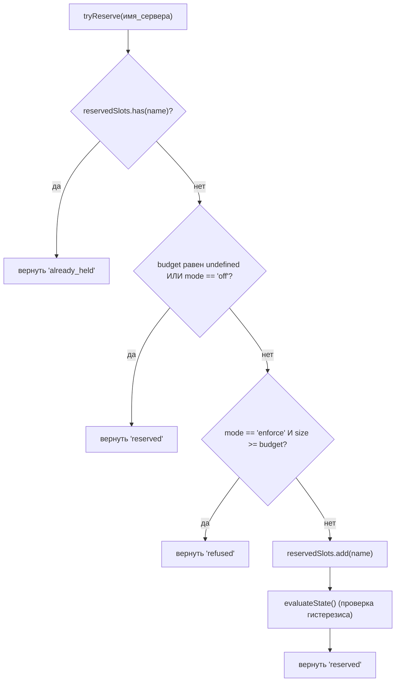
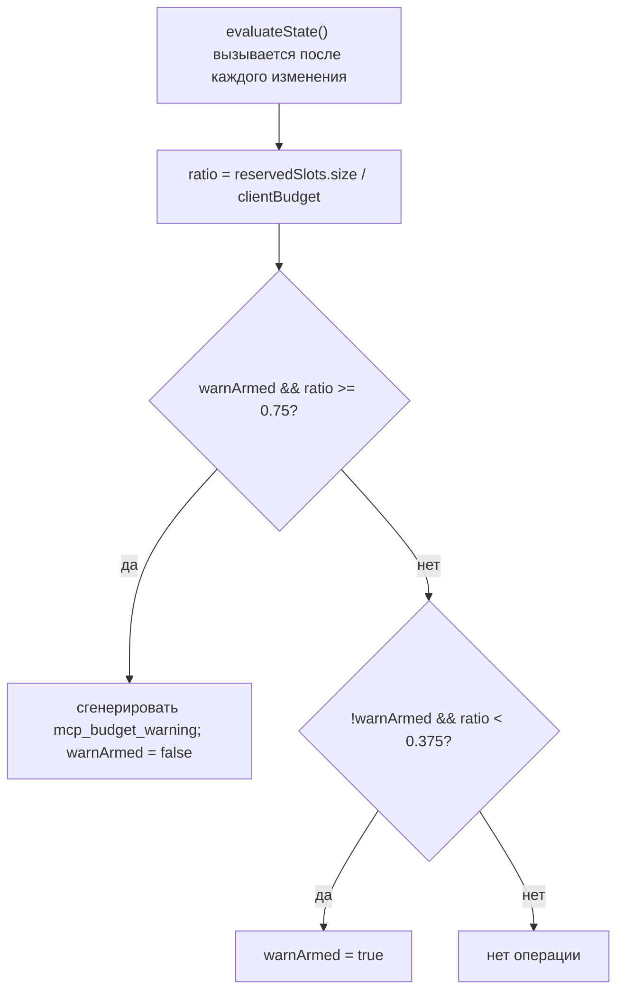

# Ограничения бюджета MCP рабочей области

## Обзор

`WorkspaceMcpBudget` (`packages/core/src/tools/mcp-workspace-budget.ts`) — это контроллер бюджета MCP-клиента в рамках рабочей области из F2 (#4175 commit 6). Он содержит тот же конечный автомат, что и `McpClientManager` (резервирование слотов, предупреждение с гистерезисом 75%, объединение отказов в пакет в рамках прохода `discoverAllMcpTools*`), но живёт **один раз на рабочую область** внутри `McpTransportPool`, а не один раз на сессию внутри менеджера каждого дочернего ACP. Пул делегирует вызовы `acquire` и `release` сюда, так что ограничение применяется к **рабочей области**, а не к каждой сессии.

Устаревший механизм бюджета `McpClientManager` остаётся для автономного qwen и серверов MCP SDK (которые обходят пул согласно исправлению commit 4). В режиме пула применяется `WorkspaceMcpBudget`; в автономном режиме / режиме MCP SDK — встроенный механизм менеджера. Двойной учёт исключён, потому что при обнаружении через пул никогда не вызывается `tryReserveSlot` менеджера.

## Обязанности

- Отслеживает `reservedSlots: Set<string>` — имена серверов, удерживающих слоты в данный момент (ключ слота — по ИМЕНИ, соответствует PR 14 v1).
- `tryReserve(name) → 'reserved' | 'already_held' | 'refused'` — атомарная и синхронная, чтобы конкурентные `Promise.all` приобретения не могли превысить лимит на await-границе.
- `release(name) → boolean` — идемпотентна (семантика `Set.delete`).
- Инициирует `mcp_budget_warning` один раз при превышении 75% `reservedSlots.size / clientBudget`; повторно взводится только после пересечения 37.5% вниз.
- Объединяет отказы на сервер в рамках массового прохода обнаружения — пара `beginBulkPass()` / `endBulkPass()` накапливает отказы в единое событие `mcp_child_refused_batch`.
- Поддерживает `lastRefusedServerNames` для потребителей снимка (`GET /workspace/mcp`) — очищается в НАЧАЛЕ следующего массового прохода, а не при отправке, чтобы снимок между проходами всё ещё содержал последний набор отказов.

## Архитектура

### Конфигурация

```ts
new WorkspaceMcpBudget({
  clientBudget?: number,           // undefined = без ограничений
  mode: 'off' | 'warn' | 'enforce',
  onEvent?: (event: McpBudgetEvent) => void,
});
```

Семантика `mode`:

- `off` — каждый метод ничего не делает; `tryReserve` безусловно возвращает `'reserved'`; события не генерируются.
- `warn` — слоты отслеживаются, и `mcp_budget_warning` срабатывает при 75%, но `tryReserve` НИКОГДА не отказывает.
- `enforce` — `tryReserve` отказывает при превышении `clientBudget`; `recordRefusal` помещает отказы по серверам в очередь; `endBulkPass` генерирует `mcp_child_refused_batch`.

### Константы из `mcp-client-manager.ts`

- `MCP_BUDGET_WARN_FRACTION = 0.75` — порог срабатывания вверх.
- `MCP_BUDGET_REARM_FRACTION = 0.375` — порог гистерезиса для повторного взведения вниз.
- `McpBudgetMode = 'off' | 'warn' | 'enforce'`.

### Внутреннее состояние

| Состояние                                          | Назначение                                                                                                           |
| -------------------------------------------------- | -------------------------------------------------------------------------------------------------------------------- |
| `reservedSlots: Set<string>`                       | Основной набор резервирований; гистерезис вычисляет `size / clientBudget`.                                           |
| `pendingRefusalNames: Set<string>`                 | Имена отказов, накопленные за текущее окно `beginBulkPass`/`endBulkPass`; очищается в `endBulkPass`.                 |
| `pendingRefusalTransports: Map<string, transport>` | Сопутствующая структура, чтобы сгенерированный пакет содержал transport каждого отказавшего сервера.                  |
| `lastRefusedServerNames: readonly string[]`        | Список отказов из последнего завершённого прохода, видимый в снимке. Очищается в начале следующего прохода.          |
| `warnArmed: boolean`                               | Состояние гистерезиса — true = готов к срабатыванию, false = уже сработал до следующего снижения до 37.5%.          |
| `bulkPassDepth: number`                            | Счётчик реентерабельности для вложенных массовых проходов (вложенные проходы не должны генерировать двойное событие).|

## Рабочий процесс

### `tryReserve`



`tryReserve` **синхронна**. `acquire` пула асинхронен, но резервирование происходит до любого `await`, поэтому два конкурентных `Promise.all` приобретения для разных имён не могут оба превысить лимит.

### Гистерезис


Гистерезис предотвращает повторные предупреждения, когда рабочая нагрузка колеблется около 75%. Первое пересечение срабатывает; последующие пересечения без падения до 37,5% — нет.

### Объединение отказавших пакетов

```mermaid
sequenceDiagram
    autonumber
    participant POOL as pool.discoverAllMcpToolsViaPool
    participant BDG as WorkspaceMcpBudget
    participant EB as EventBus

    POOL->>BDG: beginBulkPass()
    BDG->>BDG: bulkPassDepth++<br/>clear lastRefusedServerNames if outermost
    loop per server in pass
        POOL->>BDG: tryReserve(name)
        alt refused
            POOL->>BDG: recordRefusal(name, transport)
            BDG->>BDG: pendingRefusalNames.add; pendingRefusalTransports.set
            Note over BDG: NO event yet (coalesce)
        end
    end
    POOL->>BDG: endBulkPass()
    BDG->>BDG: bulkPassDepth--
    alt outermost (depth == 0) AND pending non-empty
        BDG->>EB: emit mcp_child_refused_batch<br/>{refusedServers, budget, liveCount, reservedCount, mode: 'enforce', scope?: 'workspace'}
        BDG->>BDG: lastRefusedServerNames = drain pendingRefusalNames
    end
```

Отказы вне пакетной обработки (например, ленивый spawn `readResource`, который полностью обходит пакетную обработку) генерируют пакеты длины 1 строкой для единообразия формата. Вложенные пакетные проходы (`bulkPassDepth > 0`) не срабатывают; только самый внешний конец прохода генерирует объединённый пакет.

## Состояние и жизненный цикл

- Контроллер бюджета создаётся один раз для рабочей области при инициализации пула.
- `clientBudget` неизменяем после создания; изменения во время выполнения требуют пересоздания пула.
- `mode` также неизменяем (`onEvent` сохраняется как `undefined`, когда `mode === 'off'`, в качестве дополнительной защиты).
- `warnArmed` изначально равен `true`; сбрасывается в `true` при пересечении вниз отметки 37,5%.
- `lastRefusedServerNames` НЕ очищается при генерации `endBulkPass` — только в НАЧАЛЕ следующего пакетного прохода. Это позволяет снимку, вызванному между проходами, по-прежнему сообщать последний набор отказов (иначе панели мониторинга показывали бы пустые отказы сразу после доставки события отказавшего пакета).

## Зависимости

- `packages/core/src/tools/mcp-client-manager.ts` — повторно использует `McpBudgetEvent`, `McpBudgetMode`, `McpRefusedServer`, `MCP_BUDGET_WARN_FRACTION`, `MCP_BUDGET_REARM_FRACTION`, `BudgetExhaustedError` (выбрасывается пулом при отказе в `acquire`).
- `packages/core/src/tools/mcp-transport-pool.ts` — потребляет бюджет; передаёт события через механизм `onEvent` пула в EventBus демона.
- Маршрут снимка демона `GET /workspace/mcp` — читает `getReservedSlots()`, `getRefusedServerNames()`, `getReservedCount()`, `getBudget()`, `getMode()`.

## Конфигурация

| Источник        | Параметр (Knob)                                                                          | Эффект                                                                                                     |
| --------------- | ---------------------------------------------------------------------------------------- | ---------------------------------------------------------------------------------------------------------- |
| Флаг            | `--mcp-client-budget=N`                                                                  | Устанавливает `clientBudget` для контроллера рабочей области.                                              |
| Флаг            | `--mcp-budget-mode={off,warn,enforce}`                                                   | Устанавливает `mode`. `enforce` требует положительного `clientBudget`; иначе запуск явно завершается с ошибкой. |
| Переменная окружения | `QWEN_SERVE_MCP_CLIENT_BUDGET`, `QWEN_SERVE_MCP_BUDGET_MODE`                             | Передаются дочернему процессу ACP через `childEnvOverrides`; дочерний процесс подхватывает их через `readBudgetFromEnv()`. |
| Теги возможностей | `mcp_guardrails` (всегда; `modes: ['warn', 'enforce']`), `mcp_guardrail_events` (всегда) | См. [`11-capabilities-versioning.md`](./11-capabilities-versioning.md).                                    |

## Ограничения и известные недостатки

- **Ключ резервирования — по ИМЕНИ.** Две записи в пуле с одинаковым именем сервера, но разными отпечатками (например, сессии с разными заголовками OAuth) занимают ОДИН слот вместе. Учёт подпроцессов выставляется отдельно через снимок пула `subprocessCount`. Операторы должны рассматривать бюджет как «настроенные слоты сервера», а не «количество подпроцессов».
- **Гистерезис срабатывает по количеству резервирований, а не по количеству живых (CONNECTED) соединений.** Резервирования включают подключающиеся соединения и переживают временные разрывы, поэтому гистерезис остаётся стабильным на протяжении циклов переподключения. Количество живых соединений отображается в данных события как `liveCount` для потребителей SDK, которым нужна такая перспектива.
- **Режим `warn` никогда не отказывает.** Он всё ещё отслеживает резервирования и генерирует `mcp_budget_warning`, но `tryReserve` всегда возвращает `'reserved'`. Семантика отказа действует только для `enforce`.
- **События бюджета в рамках рабочей области содержат `scope: 'workspace'`**, поэтому они распространяются на каждую подключённую сессию одновременно. Счётчики `mcpBudgetWarningCount` / `mcpChildRefusedBatchCount` в редукторах SDK увеличиваются синхронно во всех сессиях на одном соединении. События устаревшей модели для отдельных сессий от `McpClientManager` не содержат `scope` (семантически по умолчанию `'session'`).
- **Аварийный выключатель `QWEN_SERVE_NO_MCP_POOL=1`** полностью отключает пул; бюджет рабочей области также отключается, и управление бюджетом переходит к `McpClientManager` для каждой сессии. Набор возможностей теряет теги `mcp_workspace_pool` и `mcp_pool_restart`, чтобы точно отражать это состояние.
- **`ServeMcpBudgetStatusCell.scope` — это совместимый с будущими версиями список.** Ячейки снимка содержат `budgets[]`, а не одно поле `budget?`. В PR 14 v1 для каждой сессии ACP создаётся одна ячейка `scope: 'session'`, поскольку `acpAgent.newSessionConfig()` создаёт `Config` / `McpClientManager` для этой сессии. Область `'pool'` зарезервирована для ячейки уровня пула из PR 23 (Wave 5), которая будет располагаться рядом с ячейками уровня сессий. Потребители должны допускать дополнительные неизвестные значения `scope`, игнорируя их, а не прерывая работу.
## Ссылки

- `packages/core/src/tools/mcp-workspace-budget.ts` (весь класс)
- `packages/core/src/tools/mcp-client-manager.ts` (`BudgetExhaustedError`, `McpBudgetEvent`, константы гистерезиса)
- `packages/core/src/tools/mcp-transport-pool.ts` (точка `acquire` пула, вызывающая `tryReserve`)
- Документ по дизайну F2 (v2.2): [`../../design/f2-mcp-transport-pool.md`](../../design/f2-mcp-transport-pool.md) §11 для бюджета на уровне рабочего пространства и записи журнала изменений v2.2 о бюджете и последующих доработках по fingerprint.
- Заметки по дизайну F2: issue [#4175](https://github.com/QwenLM/qwen-code/issues/4175) коммит 6.
