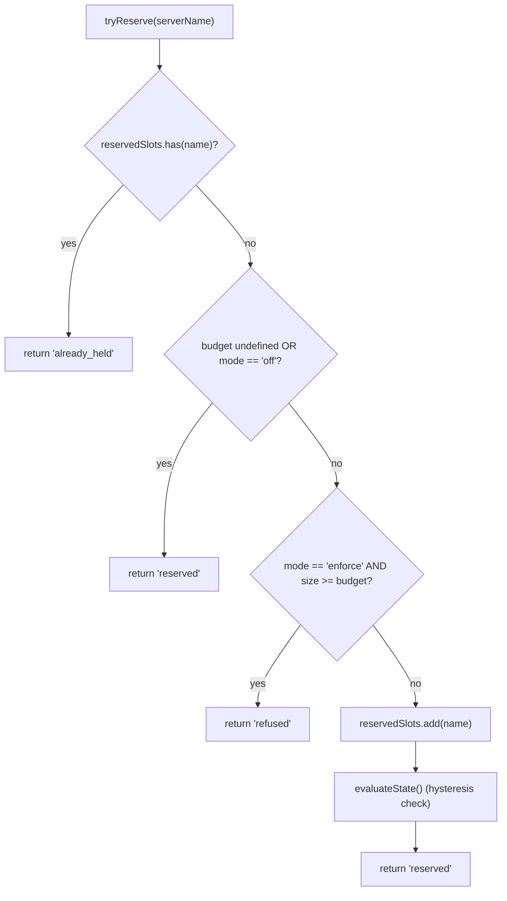
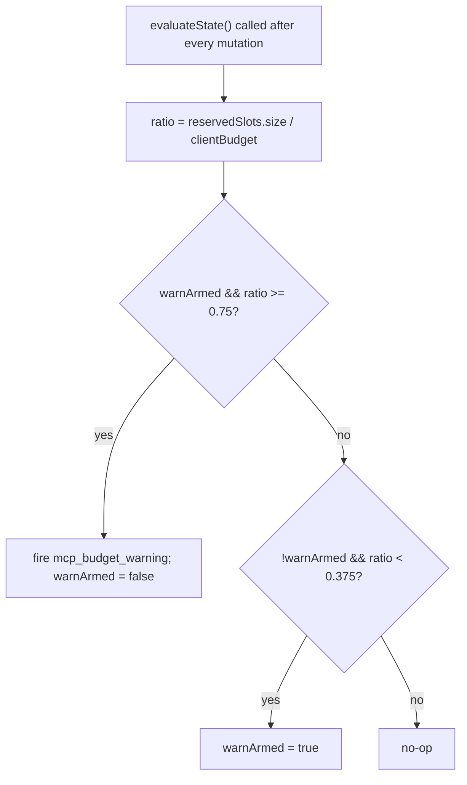

# Ограничения бюджета рабочего пространства MCP

## Обзор

`WorkspaceMcpBudget` (`packages/core/src/tools/mcp-workspace-budget.ts`) — это контроллер бюджета клиента MCP на уровне рабочего пространства из F2 (#4175, коммит 6). Он содержит ту же машину состояний, что и `McpClientManager` (резервирование слотов, гистерезис 75%, объединение отказов в пакеты в течение прохода `discoverAllMcpTools*`), но живёт **один раз на рабочее пространство** внутри `McpTransportPool`, а не один раз на сессию в менеджере каждого дочернего ACP. Пул делегирует вызовы `acquire` и `release` сюда, чтобы ограничение применялось к **рабочему пространству**, а не к каждой сессии.

Устаревшая механика бюджета `McpClientManager` остаётся для автономных серверов Qwen и SDK MCP (которые обходят пул, согласно исправлению в коммите 4). Режим пула → применяется `WorkspaceMcpBudget`; автономный режим / SDK MCP → применяется встроенная механика менеджера. Двойного учёта нет, так как обнаружение в режиме пула никогда не вызывает `tryReserveSlot` менеджера.

## Обязанности

- Отслеживать `reservedSlots: Set<string>` — имена серверов, удерживающих слоты в данный момент (ключ слота — по имени, соответствует PR 14 v1).
- `tryReserve(name) → 'reserved' | 'already_held' | 'refused'` — атомарно и синхронно, чтобы одновременные `Promise.all` захваты не могли превысить лимит на границе await.
- `release(name) → boolean` — идемпотентно (семантика `Set.delete`).
- Генерировать событие `mcp_budget_warning` один раз при превышении 75% порога вверх (`reservedSlots.size / clientBudget`); повторная готовность только после снижения до 37.5%.
- Объединять отказы для каждого сервера в рамках массового прохода обнаружения — `beginBulkPass()` / `endBulkPass()` накапливают отказы в единое событие `mcp_child_refused_batch`.
- Поддерживать `lastRefusedServerNames` для потребителей снимков (`GET /workspace/mcp`) — очищается в НАЧАЛЕ следующего массового прохода, а не при отправке, чтобы снимок между проходами всё ещё видел последний набор отказов.

## Архитектура

### Конфигурация

```ts
new WorkspaceMcpBudget({
  clientBudget?: number,           // undefined = без ограничений
  mode: 'off' | 'warn' | 'enforce',
  onEvent?: (event: McpBudgetEvent) => void,
});
```

Семантика `mode`:

- `off` — все методы не выполняют никаких действий; `tryReserve` безусловно возвращает `'reserved'`; события не генерируются.
- `warn` — слоты отслеживаются, и `mcp_budget_warning` генерируется при 75%, но `tryReserve` НИКОГДА не отказывает.
- `enforce` — `tryReserve` отказывает, если превышен `clientBudget`; `recordRefusal` ставит отказы в очередь; `endBulkPass` генерирует `mcp_child_refused_batch`.

### Константы из `mcp-client-manager.ts`

- `MCP_BUDGET_WARN_FRACTION = 0.75` — порог срабатывания вверх.
- `MCP_BUDGET_REARM_FRACTION = 0.375` — порог гистерезиса для повторной готовности.
- `McpBudgetMode = 'off' | 'warn' | 'enforce'`.

### Внутреннее состояние

| Состояние                                            | Назначение                                                                                         |
| ---------------------------------------------------- | -------------------------------------------------------------------------------------------------- |
| `reservedSlots: Set<string>`                         | Авторитетный набор резервирований; гистерезис вычисляется как `size / clientBudget`.                |
| `pendingRefusalNames: Set<string>`                   | Имена отказов, накопленные в текущем окне `beginBulkPass`/`endBulkPass`; очищается при `endBulkPass`. |
| `pendingRefusalTransports: Map<string, transport>`   | Дополнительное хранилище, чтобы сгенерированный пакет содержал транспорт каждого отказавшего сервера. |
| `lastRefusedServerNames: readonly string[]`           | Список отказов из последнего завершённого прохода, видимый в снимках. Очищается при начале следующего прохода. |
| `warnArmed: boolean`                                 | Состояние гистерезиса — true = готово к срабатыванию, false = уже сработало с момента последнего снижения до 37.5%. |
| `bulkPassDepth: number`                              | Счётчик реентерабельности для вложенных массовых проходов (вложенные проходы не должны генерировать события дважды). |

## Workflow

### `tryReserve`



`tryReserve` выполняется **синхронно**. `acquire` пула асинхронен, но резервирование происходит до любого `await`, поэтому два одновременных вызова `Promise.all` acquire для разных имён не могут оба пройти лимит.

### Гистерезис



Гистерезис предотвращает повторные предупреждения, когда нагрузка колеблется около 75%. Первое пересечение генерирует событие; последующие пересечения без снижения до 37.5% не вызывают повторного срабатывания.

### Объединение отказов в пакет

```mermaid
sequenceDiagram
    autonumber
    participant POOL as pool.discoverAllMcpToolsViaPool
    participant BDG as WorkspaceMcpBudget
    participant EB as EventBus

    POOL->>BDG: beginBulkPass()
    BDG->>BDG: bulkPassDepth++<br/>clear lastRefusedServerNames if outermost
    loop per server in pass
        POOL->>BDG: tryReserve(name)
        alt refused
            POOL->>BDG: recordRefusal(name, transport)
            BDG->>BDG: pendingRefusalNames.add; pendingRefusalTransports.set
            Note over BDG: NO event yet (coalesce)
        end
    end
    POOL->>BDG: endBulkPass()
    BDG->>BDG: bulkPassDepth--
    alt outermost (depth == 0) AND pending non-empty
        BDG->>EB: emit mcp_child_refused_batch<br/>{refusedServers, budget, liveCount, reservedCount, mode: 'enforce', scope?: 'workspace'}
        BDG->>BDG: lastRefusedServerNames = drain pendingRefusalNames
    end
```

Отказы вне прохода (например, ленивый spawn `readResource`, который полностью обходит массовый проход) генерируют пакеты длиной 1 встроенно для единообразия формы. Вложенные проходы (`bulkPassDepth > 0`) не генерируют события; только внешний проход при завершении отправляет объединённый пакет.

## Состояние и жизненный цикл

- Контроллер бюджета создаётся один раз на рабочее пространство при инициализации пула.
- `clientBudget` неизменяем после создания; изменения во время выполнения требуют пересборки пула.
- `mode` также неизменяем (`onEvent` сохраняется как `undefined`, когда `mode === 'off'`, для защиты в глубину).
- `warnArmed` изначально true; сбрасывается в true при пересечении порога 37.5% вниз.
- `lastRefusedServerNames` НЕ очищается при отправке `endBulkPass` — только в НАЧАЛЕ следующего массового прохода. Это позволяет маршруту снимка, вызванному между проходами, всё ещё сообщать последний набор отказов (иначе панели мониторинга показывали бы пустые отказы сразу после доставки события пакета отказов).

## Зависимости

- `packages/core/src/tools/mcp-client-manager.ts` — повторно использует `McpBudgetEvent`, `McpBudgetMode`, `McpRefusedServer`, `MCP_BUDGET_WARN_FRACTION`, `MCP_BUDGET_REARM_FRACTION`, `BudgetExhaustedError` (выбрасывается `acquire` пула при отказе).
- `packages/core/src/tools/mcp-transport-pool.ts` — потребляет бюджет; передаёт события в шину событий демона через механизм `onEvent` пула.
- Маршрут снимка демона `GET /workspace/mcp` — читает `getReservedSlots()`, `getRefusedServerNames()`, `getReservedCount()`, `getBudget()`, `getMode()`.

## Конфигурация

| Источник         | Параметр                                                                                | Эффект                                                                                     |
| ---------------- | --------------------------------------------------------------------------------------- | ------------------------------------------------------------------------------------------ |
| Флаг             | `--mcp-client-budget=N`                                                                 | Устанавливает `clientBudget` для контроллера рабочего пространства.                         |
| Флаг             | `--mcp-budget-mode={off,warn,enforce}`                                                   | Устанавливает `mode`. `enforce` требует положительного `clientBudget`; иначе запуск явно завершается ошибкой. |
| Переменная среды | `QWEN_SERVE_MCP_CLIENT_BUDGET`, `QWEN_SERVE_MCP_BUDGET_MODE`                            | Передаётся дочернему ACP через `childEnvOverrides`; дочерний процесс читает их через `readBudgetFromEnv()`. |
| Теги возможностей | `mcp_guardrails` (всегда; `modes: ['warn', 'enforce']`), `mcp_guardrail_events` (всегда) | См. [`11-capabilities-versioning.md`](./11-capabilities-versioning.md).                     |

## Оговорки и известные ограничения

- **Ключ резервирования — по имени.** Две записи пула с одним именем сервера, но разными отпечатками (например, сессии, передающие различные заголовки OAuth), занимают ОДИН слот вместе. Учёт подпроцессов раскрывается отдельно через поле `subprocessCount` в снимке пула. Операторам следует рассматривать бюджет как «настроенные слоты серверов», а не «количество подпроцессов».
- **Гистерезис срабатывает по количеству резервирований, а не по количеству живых (CONNECTED) подключений.** Резервирования включают текущие подключения и переживают временные разрывы, поэтому гистерезис остаётся стабильным во время циклов переподключения. Количество живых подключений раскрывается в полезных нагрузках событий как `liveCount` для тех потребителей SDK, кому нужна такая перспектива.
- **Режим `warn` никогда не отказывает.** Он по-прежнему отслеживает резервирования и генерирует `mcp_budget_warning`, но `tryReserve` всегда возвращает `'reserved'`. Семантика отказа доступна только в режиме `enforce`.
- **События бюджета на уровне рабочего пространства содержат `scope: 'workspace'`,** что позволяет им распространяться на все подключённые сессии одновременно. Счётчики `mcpBudgetWarningCount` / `mcpChildRefusedBatchCount` в редьюсерах SDK увеличиваются синхронно во всех сессиях на одном соединении. Устаревшие события на уровне сессии от `McpClientManager` не содержат `scope` (по умолчанию семантически равно `'session'`).
- **Аварийный переключатель `QWEN_SERVE_NO_MCP_POOL=1`** полностью отключает пул; бюджет рабочего пространства также отключается, и бюджет сессии (`McpClientManager`) вступает в силу. Конверт возможностей удаляет `mcp_workspace_pool` и `mcp_pool_restart`, чтобы сообщить об этом.
- **`ServeMcpBudgetStatusCell.scope`** — это форма списка, совместимая с будущими расширениями. Ячейки снимка раскрывают `budgets[]`, а не одно поле `budget?`. PR 14 v1 генерирует одну ячейку с `scope: 'session'` для каждой ACP-сессии, так как `acpAgent.newSessionConfig()` создаёт `Config` / `McpClientManager` этой сессии. Область `'pool'` зарезервирована для ячейки на уровне пула в Wave 5, PR 23, которая будет располагаться рядом с ячейками на уровне сессий. Потребители должны допускать дополнительные неизвестные значения `scope`, игнорируя их, а не завершаясь с ошибкой.

## Ссылки

- `packages/core/src/tools/mcp-workspace-budget.ts` (весь класс)
- `packages/core/src/tools/mcp-client-manager.ts` (`BudgetExhaustedError`, `McpBudgetEvent`, константы гистерезиса)
- `packages/core/src/tools/mcp-transport-pool.ts` (место вызова `acquire` пула, которое вызывает `tryReserve`)
- Дизайн-документ F2 (v2.2): [`../../design/f2-mcp-transport-pool.md`](../../design/f2-mcp-transport-pool.md) §11 для бюджета на уровне рабочего пространства и записей в changelog v2.2 о доработках бюджета и отпечатков.
- Заметки к дизайну F2: задача [#4175](https://github.com/QwenLM/qwen-code/issues/4175), коммит 6.