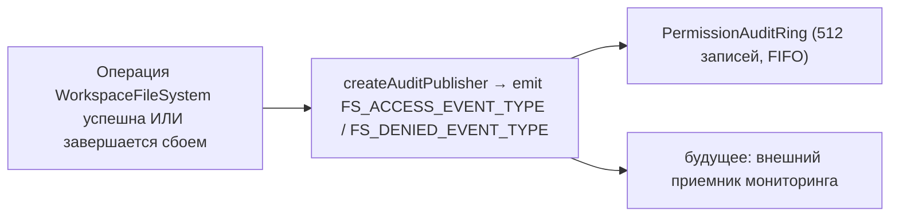

# Граница файловой системы рабочей области

## Обзор

Демон никогда не позволяет HTTP-маршрутам или ACP-вызовам агентов напрямую обращаться к файловой системе хоста. Каждая операция чтения, записи, вывода списка, поиска по шаблону и получения атрибутов проходит через границу `WorkspaceFileSystem` (`packages/cli/src/serve/fs/`), которая предоставляет:

- **Разрешение путей** — канонизация путей и отклонение всего, что выходит за пределы привязанной рабочей области, включая символические ссылки.
- **Шлюз доверия** — отказ в записи, если рабочая область не является доверенной (`untrusted_workspace`).
- **Политика размера и содержимого** — лимит на чтение (`MAX_READ_BYTES = 256 КБ`), лимит на запись (`MAX_WRITE_BYTES = 5 МБ`), обнаружение двоичных файлов.
- **Атомарность** — запись с последующим переименованием, с сохранением режима целевого файла и режимом по умолчанию `0o600` для новых файлов.
- **Аудит** — каждый доступ / отказ генерирует структурированное событие для `PermissionAuditRing` / мониторинга.
- **Типизированные ошибки** — замкнутый объединенный тип `FsErrorKind`, сопоставленный с HTTP-статусами.

HTTP-маршруты для файлов (`GET /file`, `GET /file/bytes`, `POST /file/write`, `POST /file/edit`, `GET /list`, `GET /glob`, `GET /stat`) и ACP-адаптер `BridgeFileSystem` (чтобы вызовы агентов `readTextFile` / `writeTextFile` проходили те же шлюзы) — все они проходят через эту границу.

## Обязанности

- Разрешать пути, предоставленные пользователем, в типизированные значения `ResolvedPath`, которые остальная часть границы может безопасно использовать.
- Отказывать в работе с путями за пределами привязанной рабочей области (`path_outside_workspace`) и путями, цель которых — символическая ссылка (`symlink_escape`).
- Отказывать в чтении, если размер превышает `MAX_READ_BYTES`, в записи — если превышает `MAX_WRITE_BYTES`, а также в работе с двоичными файлами (`binary_file`).
- Отказывать в записи/редактировании, если рабочая область не доверена (`untrusted_workspace`) — проверка через `assertTrustedForIntent(trusted, intent)`.
- Учитывать шаблоны `.gitignore` / `.qwenignore` через `shouldIgnore`.
- Выполнять атомарные операции записи с последующим переименованием с сохранением режима целевого файла; режим нового файла по умолчанию — `0o600`.
- Генерировать события аудита `fs.access` / `fs.denied` при каждой операции.
- Сопоставлять каждый сбой с `FsError` с указанием вида и HTTP-статуса; обработчики маршрутов сериализуют их единообразно.

## Архитектура

### Структура модулей

| Файл                      | Назначение                                                                                                                                                                                                                                                |
| ------------------------- | --------------------------------------------------------------------------------------------------------------------------------------------------------------------------------------------------------------------------------------------------------- |
| `paths.ts`                | `canonicalizeWorkspace`, `resolveWithinWorkspace`, `hasSuspiciousPathPattern`, типизированный `ResolvedPath`, объединение `Intent` (`read \| write \| list \| stat \| glob`).                                                                              |
| `policy.ts`               | `MAX_READ_BYTES`, `MAX_WRITE_BYTES`, `BINARY_PROBE_BYTES`, `assertTrustedForIntent`, `detectBinary`, `enforceReadBytesSize`, `enforceReadSize`, `enforceWriteSize`, `shouldIgnore`.                                                                       |
| `audit.ts`                | `FS_ACCESS_EVENT_TYPE`, `FS_DENIED_EVENT_TYPE`, `createAuditPublisher`, типы полезной нагрузки аудита.                                                                                                                                                    |
| `errors.ts`               | Класс `FsError`, `isFsError`, объединение `FsErrorKind` (14 видов), объединение `FsErrorStatus` (`400 / 403 / 404 / 409 / 413 / 422 / 500 / 503`).                                                                                                        |
| `workspace-file-system.ts` | `createWorkspaceFileSystemFactory`, `WorkspaceFileSystem` (оркестратор для чтения/записи/вывода списков), `WriteMode`, `ContentHash`, `FsEntry`, `FsStat`, `ListOptions`, `GlobOptions`, `ReadTextOptions`, `ReadBytesOptions`, `WriteTextAtomicOptions`. |

### Таксономия `FsErrorKind`

| Вид                        | HTTP по умолчанию | Значение                                                                                                                                                                                                                     |
| -------------------------- | ----------------- | ---------------------------------------------------------------------------------------------------------------------------------------------------------------------------------------------------------------------------- |
| `path_outside_workspace`   | 400               | Разрешенный путь находится за пределами привязанной рабочей области.                                                                                                                                                         |
| `symlink_escape`           | 400               | Цель — символическая ссылка (отклонено в соответствии с консервативной позицией PR 18 + PR 20).                                                                                                                              |
| `path_not_found`           | 404               | `ENOENT`.                                                                                                                                                                                                                    |
| `binary_file`              | 422               | Содержимое определено как двоичное при запросе через текстовый маршрут.                                                                                                                                                      |
| `file_too_large`           | 413               | Превышает `MAX_READ_BYTES` или `MAX_WRITE_BYTES`.                                                                                                                                                                            |
| `hash_mismatch`            | 409               | Ошибка оптимистичной блокировки `expectedSha256`.                                                                                                                                                                            |
| `file_already_exists`      | 409               | Режим `'create'` для существующего файла.                                                                                                                                                                                    |
| `text_not_found`           | 422               | Строка поиска в `POST /file/edit` не найдена в файле.                                                                                                                                                                        |
| `ambiguous_text_match`     | 422               | Несколько совпадений, когда требовалось ровно одно.                                                                                                                                                                          |
| `untrusted_workspace`      | 403               | Попытка записи в недоверенной рабочей области.                                                                                                                                                                               |
| `permission_denied`        | 403               | Ошибка ОС `EACCES` / `EPERM`.                                                                                                                                                                                               |
| `io_error`                 | 503               | `ENOSPC` / `EIO` / `EBUSY` / `ETXTBSY` / `ENAMETOOLONG` / `EMFILE` / `ENFILE`. **Отличается от `permission_denied`**, чтобы пайплайны мониторинга не вызывали команду реагирования на инциденты безопасности из-за "диск заполнен". |
| `internal_error`           | 500               | Ошибка, не связанная с errno, достигшая границы (`TypeError`, программная ошибка).                                                                                                                                           |
| `parse_error`              | 400 / 422         | Ошибка разбора тела запроса (400) или нарушение инварианта уровня сервиса (422).                                                                                                                                             |

### `BridgeFileSystem` (ACP-адаптер)

`packages/acp-bridge/src/bridgeFileSystem.ts` определяет:

```ts
interface BridgeFileSystem {
  readText(params: ReadTextFileRequest): Promise<ReadTextFileResponse>;
  writeText(params: WriteTextFileRequest): Promise<WriteTextFileResponse>;
}
```

Это точка внедрения для ACP `readTextFile` / `writeTextFile`. Тесты моста и встроенные вызывающие в режиме A могут опустить его в `BridgeOptions`; `BridgeClient` использует свой встроенный прокси `fs.readFile` / `fs.writeFile` (сохраняет поведение до F1). В продакшене `qwen serve` подключает `BridgeFileSystem` через `createBridgeFileSystemAdapter(fsFactory)` (`packages/cli/src/serve/bridge-file-system-adapter.ts`), чтобы ACP-записи со стороны агента проходили через те же шлюзы TOCTOU, символьных ссылок, доверия и аудита, что и HTTP-маршруты.

Два защитных шлюза, которые адаптер ОБЯЗАН воспроизвести (потому что встроенный прокси полностью обходится при внедрении адаптера):

1. **Отклонение нерегулярных файлов** — сокеты/каналы/символьные устройства/файлы procfs/sysfs могут передавать неограниченные потоки данных, несмотря на `stats.size === 0`. Встроенный путь выбрасывает исключение с `describeStatKind(stats)` в сообщении.
2. **Ограничение буферизованного размера** на уровне `READ_FILE_SIZE_CAP = 100 МиБ`. Небольшой запрос `{ line: 1, limit: 10 }` к 500-мегабайтному логу в противном случае стоил бы 500 МиБ RSS только для того, чтобы вернуть 10 строк.

Адаптер идет дальше: он использует `WorkspaceFileSystem.writeTextOverwrite` (примитив PR 18) для атомарной записи во временный файл с переименованием, сохранением режима, значением по умолчанию `0o600` и отклонением символьных ссылок в рамках блокировки на каждый путь. Это **отличие от встроенного прокси до F1**, который разрешал символьные ссылки и записывал через них в целевой файл — агенты, которые полагались на запись через символьные ссылки в dot-файлы, теперь должны обращаться непосредственно к разрешенному пути.

### Сохранение FsError через ACP-проводку

Когда адаптер `BridgeFileSystem` выбрасывает `FsError` (`kind: 'untrusted_workspace'` / `'symlink_escape'` / `'file_too_large'` / и т.д.), стандартный RPC-путь ошибок ACP SDK сериализует только `error.message` как общую ошибку `-32603 "Internal error"` — `kind` / `status` / `hint` отбрасываются. Клиенту RPC агента пришлось бы сопоставлять человекочитаемое сообщение с регулярным выражением, чтобы диспетчеризовать типизированные действия (повтор аутентификации, выбор файла, подсказка прокси).

`BridgeClient.writeTextFile` и `BridgeClient.readTextFile` устанавливают тонкую защиту (`packages/acp-bridge/src/bridgeClient.ts`), которая перехватывает исключения, похожие на FsError, и пробрасывает их как ACP `RequestError`:

```ts
function isFsErrorShape(err: unknown): err is FsErrorShape {
  return (
    err instanceof Error &&
    err.name === 'FsError' &&
    typeof (err as { kind?: unknown }).kind === 'string'
  );
}

function preserveFsErrorOverAcp(err: unknown): never {
  if (isFsErrorShape(err)) {
    throw new RequestError(-32603, err.message, {
      errorKind: err.kind,
      ...(err.hint !== undefined ? { hint: err.hint } : {}),
      ...(err.status !== undefined ? { status: err.status } : {}),
    });
  }
  throw err;
}
```

Теперь клиент RPC агента получает `data.errorKind` (замкнутое значение `FsErrorKind`) и опциональные `data.hint` и `data.status`, так что потребители SDK могут ветвиться по типизированному перечислению вместо сопоставления с регулярным выражением по сообщению.

Два замечания по дизайну:

- **Утиная типизация вместо импорта** — `FsError` находится в `packages/cli/src/serve/fs/errors.ts`, а `BridgeClient` — в `packages/acp-bridge`. Прямой `import { FsError }` инвертировал бы зависимость. Проверка через «утку» (`name === 'FsError'` + `kind: string`) повторяет то, что `mapDomainErrorToErrorKind` (`status.ts`) уже делает для `TrustGateError` / `SkillError` по той же причине кросс-пакетной сборки.
- **Код JSON-RPC остается -32603** — мост не может надежно сопоставить `FsError.kind` с формой кода ошибки JSON-RPC, поэтому структурированное поле `data` несет семантическую информацию для потребителей SDK. Код статуса проводки (`-32603` "internal error") не изменяется; клиенты маршрутизируют на основе `data.errorKind`.

### Шлюз доверия

`assertTrustedForIntent(trusted, intent)` потребляет булево значение доверия, переданное вызывающей стороной; уровень политики не читает `Config.isTrustedFolder()` напрямую. Чтение/вывод списка/статистика/поиск по шаблону всегда разрешены (доверие требуется только для записи). Попытки записи в недоверенных рабочих областях выбрасывают `FsError('untrusted_workspace', ..., status: 403)`. Сигнал доверия поступает через `WorkspaceFileSystemFactoryDeps.trusted: boolean` — `runQwenServe` передает `true`, потому что оператор запустил демона для рабочей области, которой неявно доверяет; `createServeApp` (прямое встраивание без `runQwenServe`) по умолчанию устанавливает `false` и выводит предупреждение один раз на процесс (см. [`02-serve-runtime.md`](./02-serve-runtime.md)).

## Рабочий процесс

### Чтение

```mermaid
sequenceDiagram
    autonumber
    participant R as HTTP-маршрут ИЛИ BridgeFileSystem.readText
    participant FS as WorkspaceFileSystem
    participant POL as policy.ts
    participant FSP as node:fs

    R->>FS: readText(ctx, path, opts)
    FS->>FS: resolveWithinWorkspace(path) → ResolvedPath ИЛИ throw
    FS->>FSP: stat(path)
    FSP-->>FS: stats
    FS->>FS: отклонить, если не обычный файл (describeStatKind)
    FS->>POL: enforceReadSize(stats.size, opts.maxBytes?)<br/>→ throw file_too_large ИЛИ план разбивки на части
    FS->>FSP: readFile(path)
    FSP-->>FS: buffer
    FS->>POL: detectBinary(buffer)
    POL-->>FS: isBinary?
    FS->>FS: отклонить, если двоичный; хэш sha256; обрезать до окна строк
    FS->>FS: shouldIgnore? → аннотировать meta.matchedIgnore
    FS->>FS: аудит fs.access
    FS-->>R: { content, sha256, truncated?, meta }
```

`readText` не пропускает и не отклоняет чтение из-за правил игнорирования. Он читает файл в обычном режиме и записывает соответствующую классификацию игнорирования в `meta.matchedIgnore`. `list` и `glob` фильтруют игнорируемые результаты только если `includeIgnored` не включено.

### Запись

```mermaid
sequenceDiagram
    autonumber
    participant R as POST /file/write ИЛИ ACP writeText
    participant FS как WorkspaceFileSystem
    participant POL как policy.ts
    participant FSP как node:fs

    R->>FS: writeTextAtomic(ctx, path, content, opts)
    FS->>FS: assertTrustedForIntent(trusted, 'write') → throw untrusted_workspace ИЛИ ok
    FS->>FS: resolveWithinWorkspace(path)
    FS->>POL: enforceWriteSize(content) → throw file_too_large ИЛИ ok
    FS->>FSP: lstat(path) → отклонить symlink
    FS->>FS: захватить блокировку на путь
    FS->>FSP: stat(existing?) → захватить режим цели (по умолчанию 0o600)
    FS->>FSP: writeFile(tmpPath, content, {mode})
    FS->>FSP: rename(tmpPath, path) (атомарно)
    FS->>FS: аудит fs.access (запись)
    FS-->>R: { sha256, mode, bytesWritten }
```

Атомарная запись с переименованием гарантирует, что SIGKILL / OOM в середине записи НЕ оставит целевой файл обрезанным. Режим `'create'` прерывается с `file_already_exists` при lstat; режим `'overwrite'` продолжается; `expectedSha256` включает оптимистичную блокировку (`hash_mismatch` при несовпадении).

### `POST /file/edit` (однократная замена текста)

Добавляет два дополнительных режима сбоя поверх записи:

- `text_not_found` (422) — строка поиска не найдена в файле.
- `ambiguous_text_match` (422) — несколько совпадений, когда требовалось ровно одно (контракт маршрута).

### Разветвление аудита



`FS_ACCESS_EVENT_TYPE` / `FS_DENIED_EVENT_TYPE` содержат контекст (`ctx`), путь, намерение, результат, errorKind?, прочитано/записано байт, sha256?.

## Состояние и жизненный цикл

- Фабрика создается один раз при запуске демона (`runQwenServe` → `resolveBridgeFsFactory` → адаптер).
- Каждый запрос создает `RequestContext` и вызывает оркестратор фабрики только для этого вызова — долгоживущего состояния на файл нет.
- Блокировки на путь живут только на время операции записи (без блокировок между вызовами; одновременные записи в один и тот же путь конкурируют за блокировку и сериализуются).
- Кольцо аудита принадлежит `runQwenServe` и используется совместно с издателем аудита разрешений.

## Зависимости

- `@qwen-code/qwen-code-core` — `Ignore`, `isBinaryFile`, `Config.isTrustedFolder()`.
- `node:fs`, `node:path`, `node:crypto`.
- `@qwen-code/acp-bridge` — контракт `BridgeFileSystem` на стороне ACP.
- HTTP-маршруты: `packages/cli/src/serve/routes/workspace-file-read.ts`, `workspace-file-write.ts`.

## Конфигурация

| Источник                                          | Параметр                                                              | Эффект                                                                                                              |
| ------------------------------------------------- | --------------------------------------------------------------------- | ------------------------------------------------------------------------------------------------------------------- |
| `WorkspaceFileSystemFactoryDeps.trusted: boolean` | Входной параметр конструктора                                         | Разрешена ли запись; по умолчанию `true` от `runQwenServe`, `false` от `createServeApp` (с предупреждением).        |
| Константа                                         | `MAX_READ_BYTES = 256 КБ`                                             | Лимит чтения; `file_too_large` при превышении.                                                                      |
| Константа                                         | `MAX_WRITE_BYTES = 5 МБ`                                              | Лимит записи; размер меньше `express.json({ limit: '10mb' })`.                                                      |
| Константа                                         | `BINARY_PROBE_BYTES = 4096`                                           | Размер выборки для определения двоичного содержимого.                                                               |
| Теги возможностей                                 | `workspace_file_read`, `workspace_file_bytes`, `workspace_file_write` | См. [`11-capabilities-versioning.md`](./11-capabilities-versioning.md).                                             |
| Файлы рабочей области                             | `.gitignore`, `.qwenignore`                                           | Игнорируемые пути отмечаются как `ignored: true` от `shouldIgnore`.                                                 |

## Оговорки и известные ограничения

- **Символические ссылки отклоняются, а не обрабатываются.** Это отличие от встроенного прокси `BridgeClient.writeTextFile` до F1, который разрешал символьные ссылки. Агентам, записывающим данные через символические ссылки в dot-файлы, необходимо обращаться непосредственно к разрешенному пути.
- **`io_error` и `permission_denied` различимы.** Не путайте их. Пайплайны мониторинга используют `errorKind` для оповещения — сведение ENOSPC к permission_denied вызовет вызов команды реагирования на проблемы с `df -h`.
- **Режим нового файла по умолчанию — `0o600`, а не по умолчанию umask.** Аргумент `mode` системного вызова записи обходит umask. Агенты, записывающие общедоступные файлы, должны явно передавать переопределение режима.
- **`createServeApp` по умолчанию `trusted: false`** молча отклоняет ACP-записи с `untrusted_workspace` для встраивающих систем, которые не внедряют собственную `fsFactory` или `bridge`. Одноразовое предупреждение в stderr выводится при первом вызове; последующие вызывающие не увидят напоминания. См. [`02-serve-runtime.md`](./02-serve-runtime.md).
- **Лимит чтения применяется до декодирования.** Файл размером `MAX_READ_BYTES + 1` будет отклонен, даже если запрос требует только 10 строк — потому что базовый `readFileWithLineAndLimit` читает весь файл в память перед нарезкой.
- **Адаптер `BridgeFileSystem` ОБЯЗАН воспроизвести оба шлюза встроенного прокси** (отказ от нерегулярных файлов + ограничение буферизованного размера). Встроенный путь полностью обходится при внедрении адаптера.

## Ссылки

- `packages/cli/src/serve/fs/index.ts` (экспортный баррель)
- `packages/cli/src/serve/fs/paths.ts`
- `packages/cli/src/serve/fs/policy.ts`
- `packages/cli/src/serve/fs/errors.ts`
- `packages/cli/src/serve/fs/audit.ts`
- `packages/cli/src/serve/fs/workspace-file-system.ts`
- `packages/cli/src/serve/bridge-file-system-adapter.ts`
- `packages/acp-bridge/src/bridgeFileSystem.ts`
- Справочник по HTTP-маршрутам: [`../qwen-serve-protocol.md`](../qwen-serve-protocol.md).