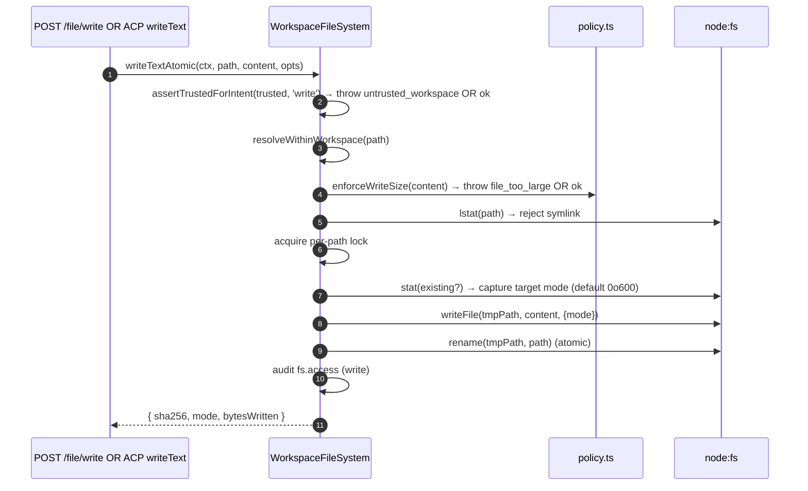
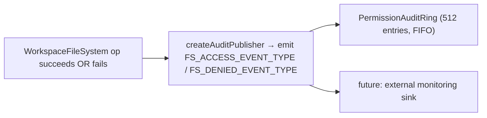

# Граница файловой системы рабочего пространства

## Обзор

Демон никогда не позволяет HTTP-маршрутам или вызовам агентов со стороны ACP напрямую касаться файловой системы хоста. Каждое чтение, запись, список, glob и stat проходят через границу `WorkspaceFileSystem` (`packages/cli/src/serve/fs/`), которая обеспечивает:

- **Разрешение путей** — канонизация путей и отклонение любых попыток выйти за пределы привязанного рабочего пространства, в том числе через символические ссылки.
- **Блокировка по доверию** — отказ в записи, если рабочее пространство не является доверенным (`untrusted_workspace`).
- **Политика размера и содержимого** — лимит на чтение (`MAX_READ_BYTES = 256 КБ`), лимит на запись (`MAX_WRITE_BYTES = 5 МБ`), обнаружение бинарных файлов.
- **Атомарность** — запись с последующим переименованием с сохранением режима целевого файла и режимом `0o600` для новых файлов по умолчанию.
- **Аудит** — каждый доступ или отклонение порождает структурированное событие для `PermissionAuditRing` / мониторинга.
- **Типизированные ошибки** — закрытое объединение `FsErrorKind`, сопоставленное с HTTP-статусами.

HTTP-маршруты для файлов (`GET /file`, `GET /file/bytes`, `POST /file/write`, `POST /file/edit`, `GET /list`, `GET /glob`, `GET /stat`) и адаптер `BridgeFileSystem` для ACP (чтобы вызовы `readTextFile` / `writeTextFile` от агента проходили те же проверки) — все проходят через эту границу.

## Обязанности

- Преобразовывать пользовательские пути в типизированные значения `ResolvedPath`, которые остальная часть границы может безопасно использовать.
- Отклонять пути за пределами привязанного рабочего пространства (`path_outside_workspace`) и пути, целью которых является символическая ссылка (`symlink_escape`).
- Отклонять чтение выше `MAX_READ_BYTES`, запись выше `MAX_WRITE_BYTES` и бинарные файлы (`binary_file`).
- Отклонять запись/редактирование, если рабочее пространство не является доверенным (`untrusted_workspace`) — проверяется через `assertTrustedForIntent(trusted, intent)`.
- Учитывать шаблоны `.gitignore` / `.qwenignore` через `shouldIgnore`.
- Выполнять атомарную запись с переименованием и сохранением режима целевого файла; для новых файлов по умолчанию используется режим `0o600`.
- Порождать события аудита `fs.access` / `fs.denied` при каждой операции.
- Отображать каждый сбой на `FsError` с типом и HTTP-статусом; обработчики маршрутов сериализуют их единообразно.

## Архитектура

### Структура модулей

| Файл                       | Назначение                                                                                                                                                                                                                                                 |
| -------------------------- | ---------------------------------------------------------------------------------------------------------------------------------------------------------------------------------------------------------------------------------------------------------- |
| `paths.ts`                 | `canonicalizeWorkspace`, `resolveWithinWorkspace`, `hasSuspiciousPathPattern`, типизированный `ResolvedPath`, объединение `Intent` (`read \| write \| list \| stat \| glob`).                                                                               |
| `policy.ts`                | `MAX_READ_BYTES`, `MAX_WRITE_BYTES`, `BINARY_PROBE_BYTES`, `assertTrustedForIntent`, `detectBinary`, `enforceReadBytesSize`, `enforceReadSize`, `enforceWriteSize`, `shouldIgnore`.                                                                        |
| `audit.ts`                 | `FS_ACCESS_EVENT_TYPE`, `FS_DENIED_EVENT_TYPE`, `createAuditPublisher`, типы полезной нагрузки аудита.                                                                                                                                                     |
| `errors.ts`                | Класс `FsError`, `isFsError`, объединение `FsErrorKind` (14 видов), объединение `FsErrorStatus` (`400 / 403 / 404 / 409 / 413 / 422 / 500 / 503`).                                                                                                          |
| `workspace-file-system.ts` | `createWorkspaceFileSystemFactory`, `WorkspaceFileSystem` (оркестратор, выполняющий чтение/запись/список), `WriteMode`, `ContentHash`, `FsEntry`, `FsStat`, `ListOptions`, `GlobOptions`, `ReadTextOptions`, `ReadBytesOptions`, `WriteTextAtomicOptions`. |

### Таксономия `FsErrorKind`

| Вид                       | HTTP по умолчанию | Значение                                                                                                                                                                                            |
| ------------------------- | ----------------- | --------------------------------------------------------------------------------------------------------------------------------------------------------------------------------------------------- |
| `path_outside_workspace`  | 400               | Разрешенный путь находится за пределами привязанного рабочего пространства.                                                                                                                          |
| `symlink_escape`          | 400               | Цель является символической ссылкой (отклонено в соответствии с консервативной позицией PR 18 + PR 20).                                                                                             |
| `path_not_found`          | 404               | `ENOENT`.                                                                                                                                                                                           |
| `binary_file`             | 422               | Содержимое определено как бинарное на текстовом маршруте.                                                                                                                                            |
| `file_too_large`          | 413               | Превышает `MAX_READ_BYTES` или `MAX_WRITE_BYTES`.                                                                                                                                                   |
| `hash_mismatch`           | 409               | Ошибка оптимистичной блокировки `expectedSha256`.                                                                                                                                                   |
| `file_already_exists`     | 409               | `mode: 'create'` для уже существующего файла.                                                                                                                                                       |
| `text_not_found`          | 422               | Строка поиска `POST /file/edit` не найдена в файле.                                                                                                                                                 |
| `ambiguous_text_match`    | 422               | Несколько совпадений, когда требовалось ровно одно.                                                                                                                                                 |
| `untrusted_workspace`     | 403               | Попытка записи в недоверенном рабочем пространстве.                                                                                                                                                 |
| `permission_denied`       | 403               | Ошибка ОС `EACCES` / `EPERM`.                                                                                                                                                                       |
| `io_error`                | 503               | `ENOSPC` / `EIO` / `EBUSY` / `ETXTBSY` / `ENAMETOOLONG` / `EMFILE` / `ENFILE`. **Отличается от `permission_denied`**, чтобы пайплайны мониторинга не поднимали тревогу по безопасности при «диск полон». |
| `internal_error`          | 500               | Ошибка, не связанная с errno, достигающая границы (`TypeError`, ошибка программиста).                                                                                                               |
| `parse_error`             | 400 / 422         | Ошибка разбора тела запроса (400) или нарушение инварианта уровня сервиса (422).                                                                                                                    |
### `BridgeFileSystem` (адаптер со стороны ACP)

Файл `packages/acp-bridge/src/bridgeFileSystem.ts` определяет:

```ts
interface BridgeFileSystem {
  readText(params: ReadTextFileRequest): Promise<ReadTextFileResponse>;
  writeText(params: WriteTextFileRequest): Promise<WriteTextFileResponse>;
}
```

Это точка внедрения для ACP-методов `readTextFile` / `writeTextFile`. Тесты Bridge и встроенные вызывающие объекты Mode A могут опустить её в `BridgeOptions`; `BridgeClient` откатывается к своему встроенному прокси `fs.readFile` / `fs.writeFile` (сохраняет поведение до F1). В продакшене `qwen serve` подключает `BridgeFileSystem` через `createBridgeFileSystemAdapter(fsFactory)` (`packages/cli/src/serve/bridge-file-system-adapter.ts`), так что ACP-записи со стороны агента проходят через те же самые шлюзы TOCTOU, симлинков, доверия и аудита, которые используют HTTP-маршруты.

Два защитных шлюза, которые адаптер ОБЯЗАН воспроизводить (поскольку встроенный прокси полностью обходится при внедрении адаптера):

1. **Отклонение нерегулярных файлов** — сокеты / пайпы / символьные устройства / записи procfs / sysfs могут передавать неограниченные данные, несмотря на `stats.size === 0`. Встроенный путь генерирует исключение с `describeStatKind(stats)` в сообщении.
2. **Ограничение размера буфера** до `READ_FILE_SIZE_CAP = 100 МиБ`. Маленький запрос `{ line: 1, limit: 10 }` к 500 МБ логу обошёлся бы в 500 МБ RSS только ради возврата 10 строк.

Адаптер идёт дальше: он использует `WorkspaceFileSystem.writeTextOverwrite` (примитив PR 18) для атомарной записи через временный файл с переименованием, сохранением режима, значением по умолчанию `0o600` и отклонением симлинков внутри блокировки для каждого пути. Это **отклонение от встроенного прокси до F1**, который разрешал симлинки и записывал в их цель — агенты, полагавшиеся на запись через симлинки на dot-файлы, теперь должны обращаться напрямую к разрешённому пути.

### Сохранение FsError через провод ACP

Когда адаптер `BridgeFileSystem` генерирует `FsError` (`kind: 'untrusted_workspace'` / `'symlink_escape'` / `'file_too_large'` / и т.д.), стандартный путь обработки RPC-ошибок ACP SDK сериализует только `error.message` как общий `-32603 "Internal error"` — `kind` / `status` / `hint` отбрасываются. Нисходящему RPC-клиенту агента пришлось бы затем применять regex-сопоставление человекочитаемого сообщения, чтобы отправлять типизированный UI (повторная аутентификация vs выбор файла vs подсказка прокси).

`BridgeClient.writeTextFile` и `BridgeClient.readTextFile` устанавливают тонкий защитник (`packages/acp-bridge/src/bridgeClient.ts`), который перехватывает исключения, похожие на FsError, и повторно генерирует их как ACP `RequestError`:

```ts
function isFsErrorShape(err: unknown): err is FsErrorShape {
  return (
    err instanceof Error &&
    err.name === 'FsError' &&
    typeof (err as { kind?: unknown }).kind === 'string'
  );
}

function preserveFsErrorOverAcp(err: unknown): never {
  if (isFsErrorShape(err)) {
    throw new RequestError(-32603, err.message, {
      errorKind: err.kind,
      ...(err.hint !== undefined ? { hint: err.hint } : {}),
      ...(err.status !== undefined ? { status: err.status } : {}),
    });
  }
  throw err;
}
```

RPC-клиент агента теперь получает `data.errorKind` (значение из замкнутого типа `FsErrorKind`) плюс опциональные `data.hint` и `data.status`, так что потребители SDK ветвятся по типизированному перечислению вместо regex-сопоставления сообщения.

Два замечания по архитектуре:

- **Утиная типизация вместо импорта** — `FsError` находится в `packages/cli/src/serve/fs/errors.ts`, а `BridgeClient` — в `packages/acp-bridge`. Прямой `import { FsError }` обратил бы зависимость вспять. Утиная проверка (`name === 'FsError'` + `kind: string`) повторяет то, что `mapDomainErrorToErrorKind` (`status.ts`) уже делает для `TrustGateError` / `SkillError` по той же причине кросспакетной сборки.
- **JSON-RPC-код остаётся -32603** — bridge не может надёжно сопоставить `FsError.kind` с формой кода ошибки JSON-RPC, поэтому структурированное поле `data` несёт семантическую информацию для потребителей SDK. Код состояния провода (`-32603` "internal error") не меняется; клиенты маршрутизируют по `data.errorKind`.

### Шлюз доверия

`assertTrustedForIntent(trusted, intent)` потребляет булево значение доверия, переданное вызывающим объектом; уровень политики не читает `Config.isTrustedFolder()` напрямую. Чтение / список / stat / glob всегда разрешены (доверие требуется только для записи). Намерения записи в недоверенных рабочих пространствах генерируют `FsError('untrusted_workspace', ..., status: 403)`. Сигнал доверия поступает через `WorkspaceFileSystemFactoryDeps.trusted: boolean` — `runQwenServe` передаёт `true`, потому что оператор запустил демона через рабочее пространство, которому он неявно доверяет; `createServeApp` (прямая встраивание без `runQwenServe`) по умолчанию использует `false` и выводит предупреждение один раз на процесс (см. [`02-serve-runtime.md`](./02-serve-runtime.md)).

## Workflow

### Read

```mermaid
sequenceDiagram
    autonumber
    participant R as HTTP route OR BridgeFileSystem.readText
    participant FS as WorkspaceFileSystem
    participant POL as policy.ts
    participant FSP as node:fs

    R->>FS: readText(ctx, path, opts)
    FS->>FS: resolveWithinWorkspace(path) → ResolvedPath OR throw
    FS->>FSP: stat(path)
    FSP-->>FS: stats
    FS->>FS: reject if not regular file (describeStatKind)
    FS->>POL: enforceReadSize(stats.size, opts.maxBytes?)<br/>→ throw file_too_large OR slice plan
    FS->>FSP: readFile(path)
    FSP-->>FS: buffer
    FS->>POL: detectBinary(buffer)
    POL-->>FS: isBinary?
    FS->>FS: reject if binary; sha256 hash; truncate to line window
    FS->>FS: shouldIgnore? → annotate meta.matchedIgnore
    FS->>FS: audit fs.access
    FS-->>R: { content, sha256, truncated?, meta }
```
`readText` не пропускает и не отклоняет чтение из-за правил игнорирования. Он читает файл обычным образом и записывает соответствующую классификацию игнорирования в `meta.matchedIgnore`. `list` и `glob` фильтруют игнорируемые результаты только если `includeIgnored` не включён.

### Запись



Атомарная запись с переименованием гарантирует, что SIGKILL/OOM во время записи НЕ оставляет целевой файл усечённым. `mode: 'create'` прерывается с `file_already_exists` на lstat; `mode: 'overwrite'` продолжает запись; `expectedSha256` включает оптимистичную блокировку (`hash_mismatch` при несовпадении).

### `POST /file/edit` (одиночная замена текста)

Добавляет два режима отказа поверх записи:

- `text_not_found` (422) — строка поиска отсутствует в файле.
- `ambiguous_text_match` (422) — несколько совпадений, когда требовалось ровно одно (по контракту маршрута).

### Рассылка аудита



`FS_ACCESS_EVENT_TYPE` / `FS_DENIED_EVENT_TYPE` несут контекст (`ctx`), путь, намерение, результат, errorKind?, bytesRead/written, sha256?.

## Состояние и жизненный цикл

- Фабрика создаётся один раз при запуске демона (`runQwenServe` → `resolveBridgeFsFactory` → адаптер).
- Каждый запрос создаёт `RequestContext` и вызывает оркестратор фабрики только для этого вызова — нет долгоживущего состояния для каждого файла.
- Блокировки на путь живут только в течение операции записи (нет блокировок между вызовами; конкурентные записи в один путь соревнуются за блокировку и сериализуются).
- Кольцо аудита принадлежит `runQwenServe` и разделяется с издателем аудита разрешений.

## Зависимости

- `@qwen-code/qwen-code-core` — `Ignore`, `isBinaryFile`, `Config.isTrustedFolder()`.
- `node:fs`, `node:path`, `node:crypto`.
- `@qwen-code/acp-bridge` — контракт `BridgeFileSystem` на стороне ACP.
- HTTP-маршруты: `packages/cli/src/serve/routes/workspace-file-read.ts`, `workspace-file-write.ts`.

## Конфигурация

| Источник                                          | Параметр                                                              | Эффект                                                                                                             |
| ------------------------------------------------- | --------------------------------------------------------------------- | ------------------------------------------------------------------------------------------------------------------- |
| `WorkspaceFileSystemFactoryDeps.trusted: boolean` | Входной параметр конструктора                                         | Разрешены ли записи; по умолчанию `true` для `runQwenServe`, `false` для `createServeApp` (с предупреждением).       |
| Константа                                         | `MAX_READ_BYTES = 256 KiB`                                            | Предел чтения; `file_too_large` превышающего.                                                                       |
| Константа                                         | `MAX_WRITE_BYTES = 5 MiB`                                             | Предел записи; меньше, чем `express.json({ limit: '10mb' })`.                                                       |
| Константа                                         | `BINARY_PROBE_BYTES = 4096`                                           | Размер выборки для определения бинарного содержимого.                                                               |
| Теги возможностей                                 | `workspace_file_read`, `workspace_file_bytes`, `workspace_file_write` | См. [`11-capabilities-versioning.md`](./11-capabilities-versioning.md).                                             |
| Файлы рабочего пространства                       | `.gitignore`, `.qwenignore`                                           | Игнорируемые пути возвращаются как `ignored: true` из `shouldIgnore`.                                              |

## Предостережения и известные ограничения

- **Символические ссылки отклоняются, а не разрешаются.** Это расхождение с довстроенным прокси `BridgeClient.writeTextFile` (до F1), который разрешал симлинки. Агентам, записывающим через симлинки на dot-файлы, нужно обращаться напрямую к разрешённому пути.
- **`io_error` и `permission_denied` различны.** Не путайте их. Мониторинговые пайплайны опираются на `errorKind` для оповещений — сворачивание ENOSPC в `permission_denied` приводило бы к вызову security-реагирующих на проблемы `df -h`.
- **Режим нового файла по умолчанию `0o600`, а не umask.** Параметр `mode` системного вызова write обходит umask. Агентам, записывающим общедоступные файлы, следует явно передавать переопределение режима.
- **`createServeApp` по умолчанию `trusted: false`** молча отклоняет ACP-записи с `untrusted_workspace` для встраиваемых приложений, которые не вставляют кастомную `fsFactory` или `bridge`. Однократное предупреждение в stderr срабатывает при первом вызове; последующие вызывающие не увидят напоминания. См. [`02-serve-runtime.md`](./02-serve-runtime.md).
- **Предел чтения применяется до декодирования.** Файл размером `MAX_READ_BYTES + 1` будет отклонён, даже если запрос требует всего 10 строк — потому что лежащая в основе функция `readFileWithLineAndLimit` читает весь файл в память перед нарезкой.
- **Адаптер `BridgeFileSystem` ОБЯЗАН повторять обе проверки inline-прокси** (отказ от нерегулярных файлов + ограничение по размеру буфера). Когда адаптер внедрён, inline-путь полностью обходится.
## Ссылки

- `packages/cli/src/serve/fs/index.ts` (barrel)
- `packages/cli/src/serve/fs/paths.ts`
- `packages/cli/src/serve/fs/policy.ts`
- `packages/cli/src/serve/fs/errors.ts`
- `packages/cli/src/serve/fs/audit.ts`
- `packages/cli/src/serve/fs/workspace-file-system.ts`
- `packages/cli/src/serve/bridge-file-system-adapter.ts`
- `packages/acp-bridge/src/bridgeFileSystem.ts`
- Справочник HTTP-маршрутов: [`../qwen-serve-protocol.md`](../qwen-serve-protocol.md).
