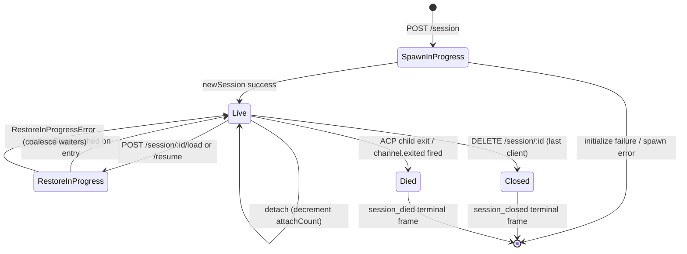

# Жизненный цикл сессии и идентификация

## Обзор

**Сессия** демона — это один логический разговор, привязанный к определённому ACP `sessionId`. Мост поддерживает запись `SessionEntry` на каждую сессию (см. [`03-acp-bridge.md`](./03-acp-bridge.md)), которая связывает ACP-соединение ребёнка с учётными данными HTTP-стороны: FIFO промптов, FIFO смены модели, шина событий, ожидающие разрешения, прикреплённые клиенты, пульсации, состояние восстановления, терминальные фреймы.

**Клиент** демона идентифицируется заголовком `X-Qwen-Client-Id` — непрозрачной строкой, проверяемой демоном, которую HTTP-клиент отправляет со своими запросами. Мост отслеживает, какие клиенты прикреплены к каким сессиям, и использует идентификатор исходного клиента для управления политикой разрешений `designated`, аудиторскими записями и attribution событий.

Этот документ объясняет все переходы жизненного цикла сессии (создание / прикрепление / загрузка / возобновление / закрытие / смерть / вытеснение) и все поверхности идентификации, которые предоставляет демон.

## Обязанности

- Создавать, прикреплять, восстанавливать и убирать сессии.
- Проверять валидность `X-Qwen-Client-Id` и отклонять некорректные идентификаторы.
- Отслеживать несколько прикреплённых клиентов на сессию (`clientIds: Map<string, count>`, `attachCount`).
- Устанавливать `originatorClientId` на исходящие события.
- Запускать пульсации, чтобы информационные панели знали, какие клиенты всё ещё подключены.
- Предоставлять метаданные сессии (`displayName`), которые операторы задают через `PATCH /session/:id/metadata`.
- Управлять отправкой терминальных фреймов (`session_died`, `session_closed`, `client_evicted`, `stream_error`).

## Архитектура

| Компонент                   | Источник                                                       | Примечания                                                                                  |
| --------------------------- | -------------------------------------------------------------- | ------------------------------------------------------------------------------------------- |
| `SessionEntry`              | `packages/acp-bridge/src/bridge.ts`                            | Структура на сессию; полный список полей см. в [`03-acp-bridge.md`](./03-acp-bridge.md).    |
| `BridgeSession` (публичный) | `packages/acp-bridge/src/bridgeTypes.ts`                       | `{ sessionId, workspaceCwd, attached, clientId?, createdAt? }`, возвращаемое HTTP-обработчикам. |
| `BridgeSessionState`        | `packages/acp-bridge/src/bridgeTypes.ts`                       | `LoadSessionResponse \| ResumeSessionResponse`, кэшируемое на записи как `restoreState`.     |
| `DaemonSession` (SDK)       | `packages/sdk-typescript/src/daemon/types.ts`                  | `{ sessionId, workspaceCwd, attached, clientId?, createdAt? }`.                             |
| Валидация id клиента        | `packages/acp-bridge/src/bridge.ts` (около `spawnOrAttach`)    | Шаблон `[A-Za-z0-9._:-]{1,128}`; `InvalidClientIdError` при некорректном значении.          |
| Уборщик отключений сессий   | `packages/cli/src/serve/server.ts`                             | Отслеживает отключения владельца запуска с помощью `attachCount` + `spawnOwnerWantedKill`.  |

### Машина состояний



### Прикрепление vs запуск

При `sessionScope: 'single'` (по умолчанию) `defaultEntry` моста используется всеми подключающимися клиентами. Если `POST /session` приходит, когда `defaultEntry` уже существует, он возвращает `attached: true` без порождения нового ACP-ребёнка. Мост синхронно увеличивает `attachCount` и регистрирует `X-Qwen-Client-Id` вызывающей стороны в `clientIds`.

При `sessionScope: 'thread'` каждый тред может создавать отдельную сессию. При этом всё ещё действует ограничение `maxSessions`.

### Идентификация

`X-Qwen-Client-Id` **необязателен**, но **настоятельно рекомендуется**. Демон не генерирует его за вызывающую сторону — клиенты выбирают свой идентификатор и используют его повторно в запросах, чтобы демон мог приписывать голоса, аудировать события и обнаруживать переподключения.

Правила валидации:

- Допустимые символы: `[A-Za-z0-9._:-]`.
- Длина: от 1 до 128.
- Вне этого набора: `InvalidClientIdError` (`400`).

Демон устанавливает `originatorClientId` на исходящие SSE-события, когда:

1. Запрос, вызвавший событие, содержал `X-Qwen-Client-Id`, И
2. Этот идентификатор в данный момент зарегистрирован в наборе `clientIds` сессии, И
3. В сессии установлен `activePromptOriginatorClientId` (встроенные `sessionUpdate` и `permission_request` наследуют originator от активного промпта).

Анонимные вызывающие (без `X-Qwen-Client-Id`) корректно работают с политикой `first-responder`; `designated` отклоняет их голоса с причиной `permission_forbidden{ reason: 'designated_mismatch' }`; `consensus` отклоняет с той же причиной `forbidden`, так как голосующий не входит в слепок `votersAtIssue` на момент запроса; `local-only` — единственная политика, которая принимает анонимных голосующих из loopback.

## Рабочий процесс

### Создание или прикрепление

```mermaid
sequenceDiagram
    autonumber
    participant C as Клиент
    participant R as POST /session
    participant B as Bridge.spawnOrAttach
    participant CH as ACP-ребёнок

    C->>R: POST /session<br/>X-Qwen-Client-Id: alice<br/>{cwd, sessionScope?}
    R->>R: проверка шаблона clientId
    R->>B: spawnOrAttach({cwd, sessionScope, clientId})
    alt single scope + defaultEntry существует
        B->>B: увеличение attachCount; регистрация clientId
        B-->>R: {sessionId, attached: true, restoreState?}
    else холодный запуск
        B->>CH: spawn + ACP initialize + newSession
        CH-->>B: sessionId
        B->>B: создание SessionEntry; регистрация в byId
        B-->>R: {sessionId, attached: false}
    end
    R-->>C: 200 { sessionId, attached, ... }
```

### Загрузка / возобновление

`POST /session/:id/load` — воспроизводит полную историю ACP (уведомления `session/load` приходят до того, как ответ будет возвращён).
`POST /session/:id/resume` — восстанавливает без воспроизведения (`connection.unstable_resumeSession`, предоставляется под стабильной возможностью демона `session_resume`; `unstable_session_resume` остаётся устаревшим псевдонимом).

Оба:

1. Используют набор `pendingRestoreIds` на канале для каждой сессии, так что параллельные вызовы восстановления объединяются (`RestoreInProgressError`).
2. Кэшируют `restoreState` на записи, чтобы поздний присоединяющийся получил ту же полезную нагрузку, что и исходный восстановитель.

### Пульсация

`POST /session/:id/heartbeat` обновляет `sessionLastSeenAt` независимо от `clientId`. Если запрос содержит зарегистрированный `X-Qwen-Client-Id`, также обновляется `clientLastSeenAt.set(clientId, Date.now())`. Вытеснение по клиенту **не реализовано** в v1; отзыв запланирован на F-series Wave 5. Сейчас пульсации обеспечивают наблюдаемость для информационных панелей и для будущей политики отзыва (PR 24).

### Метаданные

`PATCH /session/:id/metadata` принимает `{displayName?}`. Валидация:

- Максимальная длина: `MAX_DISPLAY_NAME_LENGTH = 256`.
- Не должен содержать управляющих символов (`hasControlCharacter` отклоняет кодовые точки ≤ 0x1f или == 0x7f).
- При нарушении: `InvalidSessionMetadataError` (`400`).

Успешное обновление отправляет событие `session_metadata_updated` всем подписчикам.

### Завершение

| Терминальный фрейм | Триггер                                                                                                                                    |
| ------------------ | ------------------------------------------------------------------------------------------------------------------------------------------ |
| `session_closed`   | `DELETE /session/:id` (client_close) или программное закрытие.                                                                             |
| `session_died`     | Событие `channel.exited` по любой причине (сбой, убийство ребёнка). Содержит `exitCode?` + `signalCode?`, если использовался путь завершения ОС. |
| `client_evicted`   | Переполнение очереди подписчика на EventBus (см. [`10-event-bus.md`](./10-event-bus.md)). НЕ завершение уровня сессии — закрывается только этот подписчик. |
| `stream_error`     | Ошибка SubscriberLimitExceededError или другой сбой потока на уровне маршрута.                                                              |

Ожидающие разрешения разрешаются как `{kind:'cancelled', reason:'session_closed'}` через `mediator.forgetSession(sessionId)` на всех путях завершения.

### Защита от преждевременного удаления при отключении

Когда ответ HTTP клиента, инициировавшего запуск, не может быть записан (TCP-сброс во время рукопожатия), маршрут вызывает `killSession({ requireZeroAttaches: true })`. Если другой клиент уже прикреплён (`attachCount > 0`), защита срабатывает преждевременно, и сессия продолжает жить. Установка `spawnOwnerWantedKill = true` запоминает намерение, так что последующий вызов `detachClient()`, который вернёт `attachCount` к 0, завершит отложенную уборку. Без этой защиты быстро отключающийся владелец запуска уничтожил бы здоровую сессию при каждом переподключении.

## Состояние и жизненный цикл

Поля `SessionEntry`, критически важные для жизненного цикла:

| Поле                              | Тип                  | Значение                                                                      |
| --------------------------------- | -------------------- | ----------------------------------------------------------------------------- |
| `clientIds`                       | `Map<string, number>`| Зарегистрированные id клиентов → счётчик ссылок.                              |
| `attachCount`                     | `number`             | Сколько раз `spawnOrAttach` вернул `attached: true` для этой записи.           |
| `activePromptOriginatorClientId`  | `string?`            | Исходный клиент для активного в данный момент промпта.                        |
| `restoreState`                    | `BridgeSessionState?`| Кэшированный ответ загрузки/возобновления, чтобы поздние присоединяющиеся получали согласованные данные. |
| `spawnOwnerWantedKill`            | `boolean`            | Флаг отложенной уборки (см. защиту выше).                                     |
| `sessionLastSeenAt`               | `number?`            | Самая поздняя пульсация от любого клиента (время в мс от эпохи).              |
| `clientLastSeenAt`                | `Map<string, number>`| Пульсации по клиентам.                                                        |
| `pendingPermissionIds`            | `Set<string>`        | Ожидающие requestId ACP — используются при отмене/закрытии для разрешения как cancelled. |

## Зависимости

- Слой ACP: `connection.newSession`, `connection.unstable_resumeSession`, `connection.loadSession`.
- [`03-acp-bridge.md`](./03-acp-bridge.md) — окружающая архитектура моста.
- [`04-permission-mediation.md`](./04-permission-mediation.md) — как originator + идентификация управляют политическими решениями.
- [`10-event-bus.md`](./10-event-bus.md) — доставка терминальных фреймов.

## Дополнительные конечные точки сессии

Эти конечные точки расширяют базовый поверх жизненного цикла:

### Неблокирующий промпт (тег возможности `non_blocking_prompt`)

`POST /session/:id/prompt` теперь возвращает HTTP **202** с
`{ promptId, lastEventId }` вместо блокировки до завершения промпта.
Фактический результат приходит по SSE как `turn_complete` / `turn_error`, а
поле `promptId` связывает эти события с ответом 202.
`DaemonSessionClient.prompt()` автоматически использует неблокирующий путь, когда
имеет активную подписку на события, и прозрачно сопоставляет результат из
потока SSE.

### Резюме сессии (тег возможности `session_recap`)

`POST /session/:id/recap` запрашивает у быстрой модели однострочное резюме «на чём я
остановился». Возвращает `{ sessionId, recap: string | null }`; `null` означает, что
история была слишком короткой или модель временно недоступна. Эта конечная точка
работает по принципу best-effort.

### Побочный вопрос сессии (тег возможности `session_btw`)

`POST /session/:id/btw` задаёт одноразовый вопрос в контексте сессии,
не прерывая основной поток разговора. Использует `runForkedAgent` на
пути кэша для одношагового вызова LLM без инструментов и возвращает
`{ sessionId, answer: string | null }`. Реализация проверяет
`BTW_MAX_INPUT_LENGTH`, защиту от утечки между сессиями и обработку тайм-аутов.

### Выполнение shell-команды

`POST /session/:id/shell` выполняет shell-команду непосредственно на хосте демона,
без маршрутизации через LLM. Поток вывода передаётся по SSE-шине сессии через
события `user_shell_command` / `user_shell_result` и вставляет команду и
результат в историю разговора LLM. Ответ:
`{ exitCode, output, aborted }`.

### Открепление сессии

`POST /session/:id/detach` явно открепляет клиента от сессии, уменьшая
`attachCount`; он не закрывает сессию сам по себе. Если не остаётся других
прикреплений или подписчиков, сессия удаляется. Конечная точка возвращает 204.

### Пакетное удаление сессий

`POST /sessions/delete` принимает `{ sessionIds: string[] }` (до 100 id),
закрывает сессии моста и удаляет файлы транскриптов. Использует
`Promise.allSettled` для устойчивости и возвращает `{ removed, notFound, errors }`.

### Использование контекста (тег возможности `session_context_usage`)

`GET /session/:id/context-usage` возвращает структурированную информацию об использовании
контекстного окна. `?detail=true` включает более детальную информацию, сгруппированную по
инструментам, памяти и навыкам.

### Статистика сессии (тег возможности `session_stats`)

`GET /session/:id/stats` возвращает статистику использования: метрики модели
(входные/выходные токены, чтение/запись кэша, общая стоимость), количество вызовов
и задержки по каждому инструменту, количество правок файлов и количество вызовов
по каждому навыку для текущей сессии. Блок `skills` отражает загрузки тел навыков и
slash-команды навыков только в этой сессии; это не агрегат активности между сессиями.

### Задачи сессии (тег возможности `session_tasks`)

`GET /session/:id/tasks` возвращает снимок фоновых задач: задачи агента,
shell-задачи, мониторинговые задачи и их состояния жизненного цикла.

### Статус LSP сессии (тег возможности `session_lsp`)

`GET /session/:id/lsp` возвращает очищенный статус LSP по сессиям для клиентов
демона: включение, количество агрегированных серверов, состояние недоступности/инициализации,
и для каждого сервера: `name`, `status`, `languages`, `transport`, `command`,
`error`. Отключённый или недоступный LSP представляется как данные со статусом HTTP 200,
а не как транспортная ошибка.

### Сжатое воспроизведение

`POST /session/:id/load` теперь возвращает `BridgeRestoredSession`, который может содержать
`compactedReplay?: BridgeEvent[]`, `liveJournal?: BridgeEvent[]` и
`lastEventId?: number`. `compactedReplay` создаётся
`TurnBoundaryCompactionEngine`: на границах витков он сворачивает последовательные блоки
текста/мыслей, сжимает последовательности вызовов инструментов до конечного состояния,
отбрасывает транзиентные сигналы и создаёт журналы воспроизведения с размером O(витки)
вместо O(токены) (обычно уменьшение в 25–30 раз).

### Предварительный разогрев ACP-ребёнка

`bridge.preheat()` прогревает процесс ACP-ребёнка до первой сессии, чтобы
первая реальная сессия избежала задержки холодного старта. Он работает в паре с
`channelIdleTimeoutMs`, который держит ACP-ребёнка живым после закрытия последней
сессии, и поведением пропуска перезапуска, позволяющим повторно использовать уже
простаивающего ребёнка при поступлении новой сессии.

## Конфигурация

- `BridgeOptions.maxSessions` (по умолчанию 20) — лимит.
- `BridgeOptions.sessionScope` (по умолчанию `'single'`; опционально `'thread'`).
- `BridgeOptions.initializeTimeoutMs` (по умолчанию 10 с) — рукопожатие ACP `initialize`.
- `BridgeOptions.channelIdleTimeoutMs` (по умолчанию 0; немедленная уборка ACP-ребёнка).
- Теги возможностей: `session_create`, `session_scope_override`, `session_load`, `session_resume`, `unstable_session_resume` (устаревший псевдоним), `session_list`, `session_close`, `session_metadata`, `session_set_model`, `client_identity`, `client_heartbeat`, `session_recap`, `session_btw`, `session_context_usage`, `session_tasks`, `session_stats`, `session_lsp`, `session_status`, `non_blocking_prompt`.

## Ограничения и известные проблемы

- `connection.unstable_resumeSession` всё ещё может быть нестабильным на уровне ACP, но демон рекламирует утверждённый контракт маршрута v1 с помощью `session_resume`. `unstable_session_resume` сохранён только как устаревший псевдоним для обратной совместимости.
- В v1 **нет вытеснения по клиенту**; есть только завершение по сессии и по подписчику. Политика отзыва запланирована на F-series Wave 5 / PR 24.
- `client_evicted` относится к подписчику, а не к сессии. Клиент, чей SSE-подписчик был вытеснен, может переподключиться.
- Анонимные клиенты (без `X-Qwen-Client-Id**) не могут голосовать при политиках `designated` или `consensus`.

## Ссылки

- `packages/acp-bridge/src/bridge.ts` (определение SessionEntry)
- `packages/acp-bridge/src/bridgeTypes.ts` (`HttpAcpBridge`, `BridgeSession`, `BridgeSessionState`)
- `packages/sdk-typescript/src/daemon/types.ts` (`DaemonSession`)
- `packages/sdk-typescript/src/daemon/DaemonSessionClient.ts`
- Проводной протокол: [`../qwen-serve-protocol.md`](../qwen-serve-protocol.md) (каталог маршрутов).