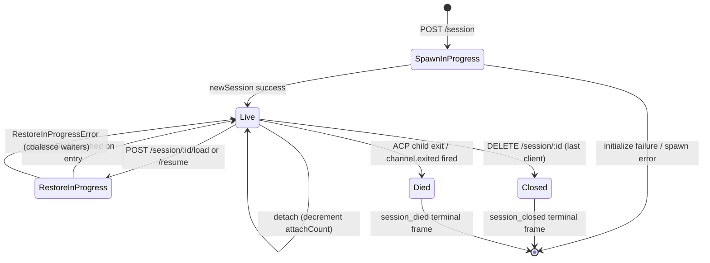

# Жизненный цикл сессии и идентификация

## Обзор

**Сессия** демона — это одно логическое обсуждение, привязанное к одному ACP `sessionId`. Мост хранит `SessionEntry` для каждой сессии (см. [`03-acp-bridge.md`](./03-acp-bridge.md)), который связывает дочернее ACP-соединение с учётными данными на стороне HTTP: FIFO-очередь подсказок, FIFO-очередь изменений модели, шина событий, ожидающие разрешения, подключённые клиенты, пульс, состояние восстановления, «могильные плиты» терминальных фреймов.

**Клиент** демона идентифицируется по заголовку `X-Qwen-Client-Id` — непрозрачной строке, прошедшей валидацию демона, которую HTTP-вызывающий код проставляет в своих запросах. Мост отслеживает, какие клиенты подключены к каким сессиям, и использует идентификатор клиента-инициатора для управления политикой разрешений `designated`, журналов аудита и привязки событий.

В этом документе объясняется каждый переход жизненного цикла сессии (создание / подключение / загрузка / возобновление / закрытие / завершение / вытеснение), а также все поверхности идентификации, которые предоставляет демон.

## Обязанности

- Создавать, подключать, восстанавливать и завершать сессии.
- Проверять `X-Qwen-Client-Id` и отклонять некорректные идентификаторы.
- Отслеживать несколько подключённых клиентов на одну сессию (`clientIds: Map<string, count>`, `attachCount`).
- Проставлять `originatorClientId` в исходящих событиях.
- Выполнять пульс, чтобы панели управления знали, какие клиенты всё ещё подключены.
- Предоставлять метаданные сессии (`displayName`), которые операторы задают через `PATCH /session/:id/metadata`.
- Формировать терминальные фреймы (`session_died`, `session_closed`, `client_evicted`, `stream_error`).

## Архитектура

| Аспект                    | Источник                                                     | Примечания                                                                               |
| ------------------------- | ------------------------------------------------------------ | ---------------------------------------------------------------------------------------- |
| `SessionEntry`            | `packages/acp-bridge/src/bridge.ts`                          | Структура на сессию; полный список полей см. в [`03-acp-bridge.md`](./03-acp-bridge.md). |
| `BridgeSession` (публичный)| `packages/acp-bridge/src/bridgeTypes.ts`                     | `{ sessionId, workspaceCwd, attached, clientId?, createdAt? }`, возвращаемый HTTP-обработчикам. |
| `BridgeSessionState`      | `packages/acp-bridge/src/bridgeTypes.ts`                     | `LoadSessionResponse \| ResumeSessionResponse`, кэшируется в записи как `restoreState`.   |
| `DaemonSession` (SDK)     | `packages/sdk-typescript/src/daemon/types.ts`                | `{ sessionId, workspaceCwd, attached, clientId?, createdAt? }`.                          |
| Валидация client-id       | `packages/acp-bridge/src/bridge.ts` (вокруг `spawnOrAttach`) | Шаблон `[A-Za-z0-9._:-]{1,128}`; `InvalidClientIdError` при несоответствии.             |
| Уборщик отключений сессий | `packages/cli/src/serve/server.ts`                           | Отслеживает отключения владельца создания с помощью `attachCount` + `spawnOwnerWantedKill`. |

### Конечный автомат



### Подключение против создания

При `sessionScope: 'single'` (по умолчанию) мост использует общий `defaultEntry` для всех подключающихся клиентов. Если `POST /session` поступает, когда `defaultEntry` уже существует, он возвращает `attached: true`, не создавая новый дочерний процесс ACP. Мост синхронно увеличивает `attachCount` и регистрирует `X-Qwen-Client-Id` вызывающего кода в `clientIds`.

При `sessionScope: 'thread'` каждый поток может получить отдельную сессию. Вызывающий код по-прежнему соблюдает `maxSessions`.

### Идентификация

`X-Qwen-Client-Id` **необязателен**, но **настоятельно рекомендуется**. Демон не генерирует его за вызывающий код — клиенты выбирают свой собственный идентификатор и повторно используют его в разных запросах, чтобы демон мог привязывать голоса, события аудита и обнаруживать переподключения.

Правила валидации:

- Допустимые символы: `[A-Za-z0-9._:-]`.
- Длина: от 1 до 128.
- Выход за этот набор: `InvalidClientIdError` (`400`).

Демон проставляет `originatorClientId` в исходящих SSE-событиях, когда:

1. Запрос, вызвавший событие, содержал `X-Qwen-Client-Id`, И
2. Этот идентификатор в настоящее время зарегистрирован в наборе `clientIds` сессии, И
3. У сессии установлен `activePromptOriginatorClientId` (встроенные `sessionUpdate` и `permission_request` наследуют инициатора от активной подсказки).

Анонимные вызывающие (без `X-Qwen-Client-Id`) нормально работают с политикой `first-responder`; политика `designated` отклоняет их голоса с `permission_forbidden{ reason: 'designated_mismatch' }`; `consensus` отклоняет с тем же `forbidden`, потому что голосующий отсутствует в снимке `votersAtIssue` на момент запроса; `local-only` — единственная политика, которая принимает анонимных голосующих через локальный цикл.
## Рабочий процесс

### Создание или подключение

```mermaid
sequenceDiagram
    autonumber
    participant C as Клиент
    participant R как POST /session
    participant B как Bridge.spawnOrAttach
    participant CH как Дочерний процесс ACP

    C->>R: POST /session<br/>X-Qwen-Client-Id: alice<br/>{cwd, sessionScope?}
    R->>R: проверка шаблона clientId
    R->>B: spawnOrAttach({cwd, sessionScope, clientId})
    alt одна область + существует defaultEntry
        B->>B: увеличить attachCount; зарегистрировать clientId
        B-->>R: {sessionId, attached: true, restoreState?}
    иначе холодный старт
        B->>CH: spawn + инициализация ACP + newSession
        CH-->>B: sessionId
        B->>B: построить SessionEntry; зарегистрировать в byId
        B-->>R: {sessionId, attached: false}
    end
    R-->>C: 200 { sessionId, attached, ... }
```

### Загрузка / возобновление

`POST /session/:id/load` — воспроизводит полную историю ACP (уведомления `session/load` отправляются до возврата ответа).
`POST /session/:id/resume` — восстанавливает без воспроизведения (`connection.unstable_resumeSession`, предоставляется под стабильной возможностью `session_resume` демона; `unstable_session_resume` остаётся устаревшим псевдонимом).

Оба:

1. Используют набор `pendingRestoreIds` для конкретной сессии на канале, чтобы конкурентные вызовы восстановления объединялись (`RestoreInProgressError`).
2. Кэшируют `restoreState` в записи, чтобы позднее подключающийся клиент получил ту же полезную нагрузку, что и первоначальный восстановитель.

### Heartbeat

`POST /session/:id/heartbeat` обновляет `sessionLastSeenAt` независимо от `clientId`. Если в запросе указан зарегистрированный `X-Qwen-Client-Id`, то также обновляется `clientLastSeenAt.set(clientId, Date.now())`. Индивидуальное удаление клиентов **не** реализовано в v1; отзыв запланирован на F-series Wave 5. Сегодня heartbeat обеспечивает наблюдаемость для панелей мониторинга и для будущей политики отзыва в PR 24.

### Метаданные

`PATCH /session/:id/metadata` принимает `{displayName?}`. Проверка:

- Максимальная длина: `MAX_DISPLAY_NAME_LENGTH = 256`.
- Не должен содержать управляющие символы (`hasControlCharacter` отклоняет кодовые точки ≤ 0x1f или == 0x7f).
- `InvalidSessionMetadataError` (`400`) при нарушении.

При успешном обновлении уведомление `session_metadata_updated` отправляется всем подписчикам.

### Завершение

| Терминальный фрейм | Триггер                                                                                                                                                         |
| ------------------ | --------------------------------------------------------------------------------------------------------------------------------------------------------------- |
| `session_closed`   | `DELETE /session/:id` (client_close) или программное закрытие.                                                                                                  |
| `session_died`     | `channel.exited` срабатывает по любой причине (сбой, уничтожение дочернего процесса). Содержит `exitCode?` + `signalCode?`, если использовался путь завершения ОС. |
| `client_evicted`   | Переполнение очереди подписчика на EventBus (см. [`10-event-bus.md`](./10-event-bus.md)). НЕ завершение сессии — закрывается только этот подписчик.              |
| `stream_error`     | Ошибка SubscriberLimitExceededError или другая ошибка потока на уровне маршрута.                                                                                |

Ожидающие разрешения разрешаются как `{kind:'cancelled', reason:'session_closed'}` через `mediator.forgetSession(sessionId)` на каждом пути завершения.

### Охранник при отключении (disconnect-reaper)

Когда HTTP-ответ клиента-владельца, создавшего сессию, не может быть записан (TCP сброс во время рукопожатия), маршрут вызывает `killSession({ requireZeroAttaches: true })`. Если другой клиент уже подключился (`attachCount > 0`), охранник прерывает выполнение, и сессия продолжает жить. Установка `spawnOwnerWantedKill = true` запоминает намерение, так что последующий вызов `detachClient()`, уменьшающий `attachCount` до 0, завершит отложенную очистку. Без этого быстро отключающийся владелец сессии разрушал бы здоровую сессию при каждом переподключении.

## Состояние и жизненный цикл

Поля `SessionEntry`, критически важные для жизненного цикла:

| Поле                             | Тип                    | Значение                                                                                      |
| -------------------------------- | ---------------------- | --------------------------------------------------------------------------------------------- |
| `clientIds`                      | `Map<string, number>`  | Зарегистрированные идентификаторы клиентов → счётчик ссылок регистрации.                       |
| `attachCount`                    | `number`               | Сколько раз `spawnOrAttach` возвращал `attached: true` для этой записи.                        |
| `activePromptOriginatorClientId` | `string?`              | Инициатор текущего выполняемого запроса.                                                       |
| `restoreState`                   | `BridgeSessionState?`  | Кэшированный ответ load/resume, чтобы поздние подключения видели согласованные данные.         |
| `spawnOwnerWantedKill`           | `boolean`              | Признак отложенной очистки (см. охранник при отключении выше).                                 |
| `sessionLastSeenAt`              | `number?`              | Последний heartbeat от любого клиента (мс от эпохи).                                          |
| `clientLastSeenAt`               | `Map<string, number>`  | Heartbeat по каждому клиенту.                                                                  |
| `pendingPermissionIds`           | `Set<string>`          | Текущие ожидающие ACP requestIds — используются при отмене/закрытии для разрешения как отменённые. |
## Зависимости

- Уровень ACP: `connection.newSession`, `connection.unstable_resumeSession`, `connection.loadSession`.
- [`03-acp-bridge.md`](./03-acp-bridge.md) — описание окружающей архитектуры моста.
- [`04-permission-mediation.md`](./04-permission-mediation.md) — как инициатор + идентификатор влияют на принятие решений политиками.
- [`10-event-bus.md`](./10-event-bus.md) — доставка терминальных кадров.

## Дополнительные конечные точки сессии

Эти конечные точки расширяют базовую поверхность жизненного цикла:

### Неблокирующий запрос (тег возможности `non_blocking_prompt`)

`POST /session/:id/prompt` теперь возвращает HTTP **202** с `{ promptId, lastEventId }` вместо блокировки до завершения запроса. Фактический результат прибывает по SSE в виде `turn_complete` / `turn_error`, а поле `promptId` связывает эти события с ответом 202. `DaemonSessionClient.prompt()` автоматически использует неблокирующий путь, когда активна подписка на события, и прозрачно сопоставляет результат из потока SSE.

### Сводка сессии (тег возможности `session_recap`)

`POST /session/:id/recap` запрашивает у быстрой модели однострочную сводку «на чём я остановился». Возвращает `{ sessionId, recap: string | null }`; `null` означает, что история слишком коротка или модель временно не справилась. Эта конечная точка работает по мере возможности.

### Побочный вопрос сессии (тег возможности `session_btw`)

`POST /session/:id/btw` задаёт разовый вопрос в контексте сессии, не прерывая основной диалог. Он использует `runForkedAgent` на кешированном пути для одношагового вызова LLM без инструментов и возвращает `{ sessionId, answer: string | null }`. Реализация соблюдает `BTW_MAX_INPUT_LENGTH`, защиту от утечки между сессиями и обработку тайм-аута.

### Выполнение команд оболочки

`POST /session/:id/shell` выполняет команду оболочки непосредственно на хосте демона, не направляя её через LLM. Вывод транслируется в шину SSE сессии через события `user_shell_command` / `user_shell_result`, а команда и результат добавляются в историю диалога LLM. Ответ: `{ exitCode, output, aborted }`.

### Открепление сессии

`POST /session/:id/detach` явно открепляет клиента от сессии, уменьшая `attachCount`; само по себе оно не закрывает сессию. Если не осталось других подключений или подписчиков, сессия завершается. Конечная точка возвращает 204.

### Пакетное удаление сессий

`POST /sessions/delete` принимает `{ sessionIds: string[] }` (до 100 идентификаторов), закрывает мостовые сессии и удаляет файлы стенограмм. Использует `Promise.allSettled` для устойчивости и возвращает `{ removed, notFound, errors }`.

### Использование контекста (тег возможности `session_context_usage`)

`GET /session/:id/context-usage` возвращает структурированную информацию об использовании окна контекста. `?detail=true` включает более детальное использование, сгруппированное по инструментам, памяти и навыкам.

### Статистика сессии (тег возможности `session_stats`)

`GET /session/:id/stats` возвращает статистику использования: метрики модели (входные/выходные токены, чтение/запись кеша, общая стоимость), количество вызовов и задержки по каждому инструменту, количество правок файлов, количество вызовов каждого навыка в рамках текущей сессии. Блок `skills` отражает загрузки тел навыков и слэш-команды навыков только в этой сессии; это не агрегат активности между сессиями.

### Задачи сессии (тег возможности `session_tasks`)

`GET /session/:id/tasks` возвращает снимок фоновых задач: задачи агента, задачи оболочки, задачи монитора и их состояния жизненного цикла.

### Статус LSP сессии (тег возможности `session_lsp`)

`GET /session/:id/lsp` возвращает очищенный статус LSP для каждой сессии для клиентов демона: включение, общее количество серверов, состояние недоступности/инициализации и для каждого сервера — `name`, `status`, `languages`, `transport`, `command` и `error`. Отключённый или недоступный LSP представляется как данные с HTTP-статусом 200, а не как транспортная ошибка.

### Сжатый повтор

`POST /session/:id/load` теперь возвращает `BridgeRestoredSession`, который может содержать `compactedReplay?: BridgeEvent[]`, `liveJournal?: BridgeEvent[]` и `lastEventId?: number`. `compactedReplay` создаётся `TurnBoundaryCompactionEngine`: на границах шагов сворачиваются последовательные блоки текста/мыслей, последовательности вызовов инструментов сводятся к конечному состоянию, отбрасываются транзиентные сигналы, и создаются журналы повтора порядка O(шагов) вместо O(токенов) (обычно уменьшение в 25–30 раз).

### Предварительный прогрев дочернего процесса ACP

`bridge.preheat()` прогревает дочерний процесс ACP до первой сессии, чтобы первый реальный сеанс избежал задержки холодного старта. Он работает в паре с `channelIdleTimeoutMs`, который удерживает дочерний процесс ACP живым после закрытия последней сессии, и поведением пропуска перезапуска, при котором уже простаивающий дочерний процесс повторно используется при появлении новой сессии.

## Конфигурация

- `BridgeOptions.maxSessions` (по умолчанию 20) — лимит.
- `BridgeOptions.sessionScope` (по умолчанию `'single'`; опционально `'thread'`).
- `BridgeOptions.initializeTimeoutMs` (по умолчанию 10 с) — рукопожатие ACP `initialize`.
- `BridgeOptions.channelIdleTimeoutMs` (по умолчанию 0; завершить дочерний процесс ACP немедленно).
- Теги возможностей: `session_create`, `session_scope_override`, `session_load`, `session_resume`, `unstable_session_resume` (устаревший псевдоним), `session_list`, `session_close`, `session_metadata`, `session_set_model`, `client_identity`, `client_heartbeat`, `session_recap`, `session_btw`, `session_context_usage`, `session_tasks`, `session_stats`, `session_lsp`, `non_blocking_prompt`.
## Ограничения и известные проблемы

- `connection.unstable_resumeSession` может оставаться нестабильным на уровне ACP, но демон рекламирует зафиксированный контракт маршрута v1 с `session_resume`. `unstable_session_resume` сохраняется только как устаревший псевдоним для совместимости.
- В v1 **нет вытеснения по клиенту**; только завершение по сессии и по подписчику. Политика отзыва — F-series Wave 5 / PR 24.
- `client_evicted` относится к подписчику, а не к сессии. Клиент, чей SSE-подписчик был вытеснен, может переподключиться.
- Анонимные клиенты (без `X-Qwen-Client-Id`) не могут голосовать при политиках `designated` или `consensus`.

## Ссылки

- `packages/acp-bridge/src/bridge.ts` (определение SessionEntry)
- `packages/acp-bridge/src/bridgeTypes.ts` (`HttpAcpBridge`, `BridgeSession`, `BridgeSessionState`)
- `packages/sdk-typescript/src/daemon/types.ts` (`DaemonSession`)
- `packages/sdk-typescript/src/daemon/DaemonSessionClient.ts`
- Ссылка на протокол: [`../qwen-serve-protocol.md`](../qwen-serve-protocol.md) (каталог маршрутов).
