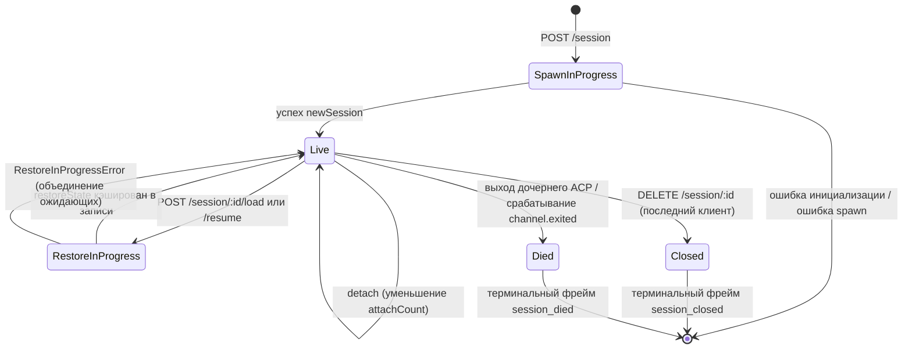

# Жизненный цикл сессии и идентификация

## Обзор

Сессия **демона** — это один логический диалог, привязанный к одному ACP `sessionId`. Бридж ведет `SessionEntry` для каждой сессии (см. [`03-acp-bridge.md`](./03-acp-bridge.md)), связывая дочернее ACP-соединение с HTTP-учетом: FIFO промптов, FIFO изменений модели, шина событий, ожидающие разрешения, подключенные клиенты, heartbeat-сигналы, состояние восстановления и tombstone-метки терминальных фреймов.

**Клиент** демона идентифицируется с помощью `X-Qwen-Client-Id` — непрозрачной строки, валидируемой демоном, которую HTTP-вызывающая сторона добавляет в свои запросы. Бридж отслеживает, какие клиенты подключены к каким сессиям, и использует ID клиента-инициатора для управления политикой разрешений `designated`, журналами аудита и атрибуцией событий.

В этом документе описывается каждый переход жизненного цикла сессии (create / attach / load / resume / close / die / evict) и каждый интерфейс идентификации, предоставляемый демоном.

## Обязанности

- Создание, подключение, восстановление и очистка (reap) сессий.
- Валидация `X-Qwen-Client-Id` и отклонение некорректных ID.
- Отслеживание нескольких подключенных клиентов для каждой сессии (`clientIds: Map<string, count>`, `attachCount`).
- Добавление `originatorClientId` в исходящие события.
- Обработка heartbeat-сигналов, чтобы дашборды знали, какие клиенты все еще подключены.
- Предоставление метаданных сессии (`displayName`), которые операторы устанавливают через `PATCH /session/:id/metadata`.
- Управление генерацией терминальных фреймов (`session_died`, `session_closed`, `client_evicted`, `stream_error`).

## Архитектура

| Задача                      | Источник                                                     | Примечания                                                                                |
| --------------------------- | ------------------------------------------------------------ | ----------------------------------------------------------------------------------------- |
| `SessionEntry`              | `packages/acp-bridge/src/bridge.ts`                          | Структура для каждой сессии; полный список полей см. в [`03-acp-bridge.md`](./03-acp-bridge.md). |
| `BridgeSession` (public)    | `packages/acp-bridge/src/bridgeTypes.ts`                     | `{ sessionId, workspaceCwd, attached, clientId?, createdAt? }`, возвращается HTTP-обработчикам. |
| `BridgeSessionState`        | `packages/acp-bridge/src/bridgeTypes.ts`                     | `LoadSessionResponse \| ResumeSessionResponse`, кэшируется в записи как `restoreState`.   |
| `DaemonSession` (SDK)       | `packages/sdk-typescript/src/daemon/types.ts`                | `{ sessionId, workspaceCwd, attached, clientId?, createdAt? }`.                           |
| Валидация Client-id         | `packages/acp-bridge/src/bridge.ts` (вокруг `spawnOrAttach`) | Паттерн `[A-Za-z0-9._:-]{1,128}`; `InvalidClientIdError`, если формат неверен.            |
| Очистка сессий при отключении | `packages/cli/src/serve/server.ts`                           | Отслеживает отключения владельца spawn с помощью `attachCount` + `spawnOwnerWantedKill`.  |

### Конечный автомат

```mermaid
stateDiagram-v2
    [*] --> SpawnInProgress: POST /session
    SpawnInProgress --> Live: успех newSession
    SpawnInProgress --> [*]: ошибка инициализации / ошибка spawn
    Live --> Live: attach (sessionScope=single, увеличение attachCount)
    Live --> Live: detach (уменьшение attachCount)
    Live --> RestoreInProgress: POST /session/:id/load или /resume
    RestoreInProgress --> Live: restoreState кэширован в записи
    RestoreInProgress --> Live: RestoreInProgressError (объединение ожидающих)
    Live --> Closed: DELETE /session/:id (последний клиент)
    Live --> Died: выход дочернего ACP / срабатывание channel.exited
    Closed --> [*]: терминальный фрейм session_closed
    Died --> [*]: терминальный фрейм session_died
```

### Attach против spawn

При `sessionScope: 'single'` (по умолчанию) `defaultEntry` бриджа используется всеми подключающимися клиентами. Запрос `POST /session`, поступающий при уже существующем `defaultEntry`, возвращает `attached: true` без создания нового дочернего ACP-процесса. Бридж синхронно увеличивает `attachCount` и регистрирует `X-Qwen-Client-Id` вызывающей стороны в `clientIds`.

При `sessionScope: 'thread'` каждый поток может создавать отдельную сессию. Вызывающая сторона по-прежнему должна соблюдать `maxSessions`.

### Идентификация

`X-Qwen-Client-Id` является **опциональным**, но **настоятельно рекомендуется**. Демон не генерирует его от имени вызывающей стороны — клиенты выбирают его сами и повторно используют в запросах, чтобы демон мог атрибутировать голоса, вести аудит событий и обнаруживать переподключения.

Правила валидации:

- Набор символов: `[A-Za-z0-9._:-]`.
- Длина: 1–128.
- За пределами этого набора: `InvalidClientIdError` (`400`).

Демон добавляет `originatorClientId` в исходящие SSE-события, когда:

1. Запрос, вызвавший событие, содержал `X-Qwen-Client-Id`, И
2. ID в данный момент зарегистрирован в наборе `clientIds` сессии, И
3. В сессии установлен `activePromptOriginatorClientId` (инлайновые `sessionUpdate` и `permission_request` наследуют инициатора от активного промпта).

Анонимные вызывающие стороны (без `X-Qwen-Client-Id`) нормально работают с политикой `first-responder`; `designated` отклоняет их голоса с ошибкой `permission_forbidden{ reason: 'designated_mismatch' }`; `consensus` отклоняет их по той же причине `forbidden`, так как голосующего нет в снимке `votersAtIssue` на момент выдачи; `local-only` — единственная политика, принимающая анонимных loopback-голосующих.

## Рабочий процесс

### Создание или подключение

```mermaid
sequenceDiagram
    autonumber
    participant C as Клиент
    participant R as POST /session
    participant B as Bridge.spawnOrAttach
    participant CH as Дочерний ACP

    C->>R: POST /session<br/>X-Qwen-Client-Id: alice<br/>{cwd, sessionScope?}
    R->>R: валидация паттерна clientId
    R->>B: spawnOrAttach({cwd, sessionScope, clientId})
    alt single scope + defaultEntry существует
        B->>B: увеличение attachCount; регистрация clientId
        B-->>R: {sessionId, attached: true, restoreState?}
    else cold
        B->>CH: spawn + ACP initialize + newSession
        CH-->>B: sessionId
        B->>B: создание SessionEntry; регистрация в byId
        B-->>R: {sessionId, attached: false}
    end
    R-->>C: 200 { sessionId, attached, ... }
```

### Load / resume

`POST /session/:id/load` — восстанавливает сохранённую сессию и возвращает текущее ограниченное окно снимка воспроизведения (уведомления `session/load` или воспроизведение в режиме ответа инициализируются до возврата ответа).
`POST /session/:id/resume` — восстанавливает без воспроизведения (`connection.unstable_resumeSession`, доступно через стабильную возможность демона `session_resume`; `unstable_session_resume` остается устаревшим псевдонимом).

Оба метода:

1. Используют набор `pendingRestoreIds` для каждой сессии в канале, чтобы одновременные вызовы восстановления объединялись (`RestoreInProgressError`).
2. Кэшируют `restoreState` в записи, чтобы запоздалый подключающийся клиент получил тот же пейлоад, что и исходный восстановитель.

### Heartbeat

`POST /session/:id/heartbeat` обновляет `sessionLastSeenAt` независимо от `clientId`. Если запрос содержит зарегистрированный `X-Qwen-Client-Id`, также выполняется обновление `clientLastSeenAt.set(clientId, Date.now())`. Вытеснение (eviction) для каждого клиента **не** реализовано в v1; отзыв (revocation) запланирован на F-series Wave 5. На данный момент heartbeat-сигналы обеспечивают наблюдаемость для дашбордов и для предстоящей политики отзыва в PR 24.

### Метаданные

`PATCH /session/:id/metadata` принимает `{displayName?}`. Валидация:

- Максимальная длина: `MAX_DISPLAY_NAME_LENGTH = 256`.
- Не должен содержать управляющих символов (`hasControlCharacter` отклоняет кодовые точки ≤ 0x1f или == 0x7f).
- `InvalidSessionMetadataError` (`400`) при нарушении.

При успешном обновлении событие `session_metadata_updated` рассылается всем подписчикам.

### Завершение

| Терминальный фрейм | Триггер                                                                                                                                                     |
| ------------------ | ----------------------------------------------------------------------------------------------------------------------------------------------------------- |
| `session_closed`   | `DELETE /session/:id` (client_close) или программное закрытие.                                                                                              |
| `session_died`     | `channel.exited` срабатывает по любой причине (сбой, завершение дочернего процесса). Содержит `exitCode?` + `signalCode?`, если использовался путь завершения ОС. |
| `client_evicted`   | Переполнение очереди для конкретного подписчика в EventBus (см. [`10-event-bus.md`](./10-event-bus.md)). Это НЕ завершение на уровне сессии — закрывается только этот подписчик. |
| `stream_error`     | `SubscriberLimitExceededError` или другая ошибка потока на уровне маршрута.                                                                                 |

Ожидающие разрешения разрешаются как `{kind:'cancelled', reason:'session_closed'}` через `mediator.forgetSession(sessionId)` на каждом пути завершения.

### Защита очистки при отключении

Когда HTTP-ответ клиента-владельца spawn не может быть записан (TCP reset во время рукопожатия), маршрут вызывает `killSession({ requireZeroAttaches: true })`. Если другой клиент уже подключился (`attachCount > 0`), срабатывает защита и выполнение прерывается, а сессия продолжает работать. Установка `spawnOwnerWantedKill = true` запоминает это намерение, чтобы последующий `detachClient()`, который вернет `attachCount` к 0, завершил отложенную очистку. Без этого быстро отключающийся владелец spawn разрушал бы здоровую сессию при каждом втором переподключении.

## Состояние и жизненный цикл

Поля `SessionEntry`, критичные для жизненного цикла:

| Поле                             | Тип                   | Значение                                                                         |
| -------------------------------- | --------------------- | -------------------------------------------------------------------------------- |
| `clientIds`                      | `Map<string, number>` | Зарегистрированные ID клиентов → счетчик ссылок регистрации.                     |
| `attachCount`                    | `number`              | Количество раз, когда `spawnOrAttach` возвращал `attached: true` для этой записи.|
| `activePromptOriginatorClientId` | `string?`             | Инициатор промпта, выполняющегося в данный момент.                               |
| `restoreState`                   | `BridgeSessionState?` | Кэшированный ответ load/resume, чтобы запоздалые подключающиеся клиенты видели согласованные пейлоады. |
| `spawnOwnerWantedKill`           | `boolean`             | Tombstone отложенной очистки (см. очистку при отключении выше).                  |
| `sessionLastSeenAt`              | `number?`             | Самый последний heartbeat от любого клиента (эпохальное время в мс).             |
| `clientLastSeenAt`               | `Map<string, number>` | Heartbeat для каждого клиента.                                                   |
| `pendingPermissionIds`           | `Set<string>`         | ACP requestIds, ожидающие обработки — используются при отмене/закрытии для разрешения как отмененные. |

## Зависимости

- Уровень ACP: `connection.newSession`, `connection.unstable_resumeSession`, `connection.loadSession`.
- [`03-acp-bridge.md`](./03-acp-bridge.md) для общей архитектуры бриджа.
- [`04-permission-mediation.md`](./04-permission-mediation.md) для понимания того, как инициатор + идентификация управляют решениями политик.
- [`10-event-bus.md`](./10-event-bus.md) для доставки терминальных фреймов.

## Дополнительные эндпоинты сессий

Эти эндпоинты расширяют базовый интерфейс жизненного цикла:

### Неблокирующий промпт (тег возможности `non_blocking_prompt`)

`POST /session/:id/prompt` теперь возвращает HTTP **202** с `{ promptId, lastEventId }` вместо блокировки до завершения промпта. Фактический результат поступает по SSE в виде `turn_complete` / `turn_error`, а поле `promptId` связывает эти события с ответом 202. `DaemonSessionClient.prompt()` автоматически использует неблокирующий путь, если у него есть активная подписка на события, и прозрачно сопоставляет результат из SSE-потока.

### Краткое резюме сессии (тег возможности `session_recap`)

`POST /session/:id/recap` запрашивает у быстрой модели краткое резюме в одну строку «на чем я остановился». Возвращает `{ sessionId, recap: string | null }`; `null` означает, что история слишком коротка или модель временно дала сбой. Этот эндпоинт работает по принципу best-effort.
### Session BTW / Side Question (тег возможности `session_btw`)

`POST /session/:id/btw` задает разовый вопрос в контексте сессии, не прерывая основной поток диалога. Он использует `runForkedAgent` на пути кэша для одного раунда вызова LLM без инструментов и возвращает `{ sessionId, answer: string | null }`. Реализация обеспечивает контроль `BTW_MAX_INPUT_LENGTH`, защиту от утечки данных между сессиями и обработку таймаутов.

### Выполнение shell-команд

`POST /session/:id/shell` выполняет shell-команду напрямую на хосте демона, без маршрутизации через LLM. Он транслирует вывод в SSE-шину сессии через события `user_shell_command` / `user_shell_result` и добавляет команду вместе с результатом в историю диалога LLM. Ответ имеет вид `{ exitCode, output, aborted }`. Для live-сессии вторичного рабочего пространства единичный REST-маршрут определяет владельца сессии и выполняет команду через bridge этого runtime, так что команда запускается в cwd рабочего пространства владельца. Маршрут не предоставляет песочницу для путей. ACP-клиенты с квалификацией рабочего пространства могут продолжать использовать `_qwen/session/shell` на соединении рабочего пространства владельца.

### Отсоединение от сессии

`POST /session/:id/detach` явно отсоединяет клиент от сессии, уменьшая `attachCount`; сам по себе он не закрывает сессию. Если не остается других подключений или подписчиков, сессия уничтожается. Эндпоинт возвращает 204.

### Пакетное удаление сессий

`POST /sessions/delete` принимает `{ sessionIds: string[] }` (до 100 id), закрывает сессии моста и удаляет активные или архивные файлы транскриптов. Если для одного и того же id существуют как активные, так и архивные JSONL-файлы, жесткое удаление удаляет оба, чтобы операторы могли устранить конфликт. Он очищает активные и архивные sidecar-файлы рабочего дерева, но оставляет нетронутыми снимки истории файлов, транскрипты подагентов и runtime sidecar-файлы. Для отказоустойчивости используется `Promise.allSettled`, а возвращается `{ removed, notFound, errors }`.

### Архивация сессий

`POST /sessions/archive` перемещает неактивные JSONL-файлы сессий из `chats/` в `chats/archive/`. Если целевая сессия активна, демон сначала входит в механизм блокировки архивации для конкретной сессии и выполняет строгое закрытие, которое требует от дочернего процесса ACP сброса `ChatRecordingService`; если закрытие или сброс не удаются, архивация оставляет JSONL-файл на месте.

`POST /sessions/unarchive` перемещает архивные JSONL-файлы обратно в `chats/`. Это лишь переход состояния хранилища; после этого клиенты должны вызвать `session/load` или `session/resume`. Архивные сессии возвращают `409 session_archived` при попытке load/resume, а мутации, конкурирующие с переходом архивации, возвращают `409 session_archiving`.

### Использование контекста (тег возможности `session_context_usage`)

`GET /session/:id/context-usage` возвращает структурированное использование окна контекста. Параметр `?detail=true` включает более детализированное использование, сгруппированное по инструментам, памяти и навыкам.

### Статистика сессии (тег возможности `session_stats`)

`GET /session/:id/stats` возвращает статистику использования: метрики модели (входные/выходные токены, чтения/записи кэша, общая стоимость), количество вызовов и задержки по каждому инструменту, количество редактирований файлов и количество вызовов по каждому навыку для текущей активной сессии. Блок `skills` отражает загрузку тел навыков и slash-команд навыков только в рамках данной сессии; это не агрегированная активность между сессиями.

### Задачи сессии (тег возможности `session_tasks`)

`GET /session/:id/tasks` возвращает снимок фоновых задач для задач агента, shell-задач, задач монитора и их состояний жизненного цикла. Записи агентов, порожденные другим подагентом, содержат опциональные поля происхождения (`parentAgentId`, `parentName`, `depth`), чтобы клиенты могли отображать вложенные подагенты в виде дерева; см. пример payload в `qwen-serve-protocol.md`.

Возможность `session_monitor_tool_correlation` дополнительно гарантирует, что записи монитора содержат `toolUseId`, позволяя клиентам связывать вызов инструмента в транскрипте с деталями его задачи.

### Статус LSP сессии (тег возможности `session_lsp`)

`GET /session/:id/lsp` возвращает очищенный статус LSP для конкретной сессии для клиентов демона: включение, агрегированное количество серверов, состояние недоступности/инициализации, а также `name`, `status`, `languages`, `transport`, `command` и `error` для каждого сервера. Отключенный или недоступный LSP представляется как данные статуса HTTP 200, а не как ошибка транспорта.

### Сжатое воспроизведение

`POST /session/:id/load` теперь возвращает `BridgeRestoredSession`, который может включать `compactedReplay?: BridgeEvent[]`, `liveJournal?: BridgeEvent[]` и `lastEventId?: number`. Эти поля представляют собой ограниченное окно воспроизведения демона в памяти для активной сессии, а не полный API транскриптов. Лимит окна по умолчанию — 4 МиБ на активную сессию (`--compacted-replay-max-bytes`), при запуске отклоняются некорректные лимиты; жёсткий потолок — 256 МиБ. `compactedReplay` создаётся `TurnBoundaryCompactionEngine`: на границах ходов он сворачивает последовательные блоки текста / мыслей, схлопывает последовательности вызовов инструментов до их конечного состояния, отбрасывает переходные сигналы и создаёт журналы воспроизведения порядка O(turns) вместо журналов порядка O(tokens) (обычно сокращение в 25-30 раз). Когда более старые записи воспроизведения были удалены из байтового окна, `compactedReplay[0]` является синтетическим маркером `history_truncated` без id с полями `{reason: 'replay_window_exceeded', truncatedEvents, retainedEvents, maxBytes, truncatedTurns?, fullTranscriptAvailable: boolean}`. `fullTranscriptAvailable` — это флаг возможности: `true` означает, что клиент может листать полный сохранённый транскрипт через `GET /session/:id/transcript`, тогда как `false` означает доступность только ограниченного воспроизведения. Клиенты должны отображать его как статус и применять сохранённое воспроизведение в обычном режиме; он не должен вызывать цикл ресинхронизации.

### Прогрев дочернего процесса ACP

`bridge.preheat()` прогревает дочерний процесс ACP перед первой сессией, чтобы первая реальная сессия избежала задержек холодного старта. Это работает в связке с `channelIdleTimeoutMs`, который поддерживает дочерний процесс ACP активным после закрытия последней сессии, и поведением skip-relaunch, которое повторно использует уже неактивный дочерний процесс при поступлении новой сессии.

## Конфигурация

- `BridgeOptions.maxSessions` (по умолчанию 32) — лимит.
- `BridgeOptions.sessionScope` (по умолчанию `'single'`; опционально `'thread'`).
- `BridgeOptions.initializeTimeoutMs` (по умолчанию 10 с) — рукопожатие ACP `initialize`.
- `BridgeOptions.channelIdleTimeoutMs` (по умолчанию 0; немедленное уничтожение дочернего процесса ACP).
- Теги возможностей: `session_create`, `session_scope_override`, `session_load`, `session_resume`, `unstable_session_resume` (устаревший псевдоним), `session_list`, `session_info`, `session_close`, `session_metadata`, `session_set_model`, `client_identity`, `client_heartbeat`, `session_recap`, `session_generation`, `session_btw`, `session_context_usage`, `session_tasks`, `session_monitor_tool_correlation`, `session_stats`, `session_lsp`, `session_status`, `non_blocking_prompt`.

### Stateless generation (тег возможности `session_generation`)

`POST /session/:id/generate` принимает `{ "prompt": string }` и возвращает SSE-поток, привязанный к запросу, с событиями `started`, опциональным `thinking`, `delta`, `done` или `error`. Запрос не читает историю диалога, не записывает ход и не предоставляет инструменты. Дочерний процесс ACP использует настроенную быструю модель, если она доступна, в противном случае — основную модель сессии.

## Оговорки и известные ограничения

- `connection.unstable_resumeSession` может быть нестабильным на уровне ACP, но демон анонсирует подтвержденный контракт маршрута v1 с помощью `session_resume`. `unstable_session_resume` сохранен только как устаревший псевдоним для совместимости.
- В v1 **нет вытеснения для каждого клиента**; есть только завершение для каждой сессии и каждого подписчика. Политика отзыва — F-series Wave 5 / PR 24.
- `client_evicted` действует для каждого подписчика, а не для каждой сессии. Клиент, чей SSE-подписчик был вытеснен, может переподключиться.
- Анонимные клиенты (без `X-Qwen-Client-Id`) не могут голосовать в рамках политик `designated` или `consensus`.

## Ссылки

- `packages/acp-bridge/src/bridge.ts` (определение SessionEntry)
- `packages/acp-bridge/src/bridgeTypes.ts` (`HttpAcpBridge`, `BridgeSession`, `BridgeSessionState`)
- `packages/sdk-typescript/src/daemon/types.ts` (`DaemonSession`)
- `packages/sdk-typescript/src/daemon/DaemonSessionClient.ts`
- Сетевой справочник: [`../qwen-serve-protocol.md`](../qwen-serve-protocol.md) (каталог маршрутов).