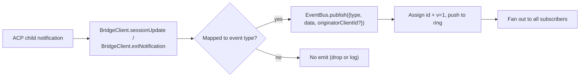
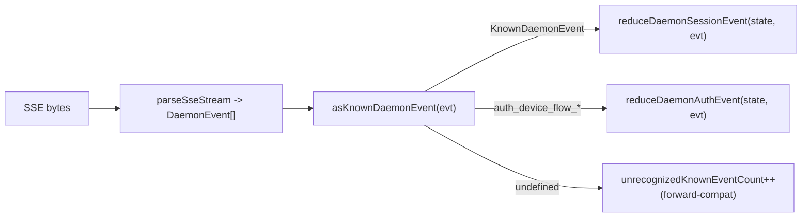

# Типизированная схема событий демона v1

## Обзор

Каждый фрейм SSE, отправляемый демоном через `GET /session/:id/events`, имеет форму `{ id, v, type, data, originatorClientId?, _meta? }`. `v: 1` — текущая версия `EVENT_SCHEMA_VERSION`. `type` берётся из закрытого, привязанного к версии набора `DAEMON_KNOWN_EVENT_TYPE_VALUES` в `packages/sdk-typescript/src/daemon/events.ts`; текущий набор содержит 43 известных типа событий. Поле конверта `_meta` заполняется на границе записи SSE функцией `formatSseFrame()` в `server.ts`; см. [Метаданные на уровне конверта](#envelope-level-metadata).

SDK предоставляет функцию `asKnownDaemonEvent(evt)`. Она возвращает дискриминированный `KnownDaemonEvent` для известных типов событий и `undefined` для остальных. Таким образом, потребители SDK могут обрабатывать прямую совместимость, не требуя обязательного обновления SDK при добавлении нового типа событий более новым демоном; редьюсер сессии записывает их как `unrecognizedKnownEventCount`.

Формат проводов описан в [`../qwen-serve-protocol.md`](../qwen-serve-protocol.md). Эта страница представляет собой контракт полезной нагрузки для каждого события.

## Обязанности

- Предоставлять единый источник истины для словаря событий (`DAEMON_KNOWN_EVENT_TYPE_VALUES`).
- Предоставлять типизированный конверт для каждого типа событий (`DaemonEventEnvelope<TType, TData>`).
- Предоставлять чистые редьюсеры (`reduceDaemonSessionEvent`, `reduceDaemonAuthEvent`), которые проецируют поток событий в состояние представления SDK.
- Транслировать тег возможности `typed_event_schema` как информационный сигнал. Если тег отсутствует, `asKnownDaemonEvent` всё равно откатывается к `unknown`.

## Словарь событий (43 известных типа)

Сгруппированы по доменам.

### Основная сессия

| Тип                        | Направление   | Триггер                                                                        | Ключевые поля полезной нагрузки                                                          |
| -------------------------- | ------------- | ------------------------------------------------------------------------------ | ---------------------------------------------------------------------------------------- |
| `session_update`           | S->C          | Любое уведомление ACP `sessionUpdate`: текст агента, размышление, вызов инструмента или план | `sessionUpdate: string, content?: ...` (непрозрачная форма ACP)                          |
| `session_metadata_updated` | S->C          | `PATCH /session/:id/metadata`                                                  | `sessionId, displayName?`                                                                |
| `session_died`             | S->C терминал | `channel.exited`                                                               | `sessionId, reason, exitCode? \| null, signalCode? \| null`                              |
| `session_closed`           | S->C терминал | `DELETE /session/:id` или программное закрытие                                 | `sessionId, reason: 'client_close' \| string, closedBy?`                                 |
| `session_snapshot`         | S->C синтетика| Кадр снимка после присоединения SSE / повторного воспроизведения                | `sessionId, currentModelId: string \| null, currentApprovalMode: string \| null`         |

### Синтетические кадры на уровне подписчика

| Тип                      | Триггер                                                                                                                                                                                                          | Примечания                                                                                                                                                                                                                                                                                                                  |
| ------------------------ | ---------------------------------------------------------------------------------------------------------------------------------------------------------------------------------------------------------------- | --------------------------------------------------------------------------------------------------------------------------------------------------------------------------------------------------------------------------------------------------------------------------------------------------------------------------- |
| `client_evicted`         | Переполнение очереди EventBus для подписчика. **Без `id`**                                                                                                                                                       | `reason: string, droppedAfter?: number`; терминал только для текущего подписчика, сессия при этом остаётся активной.                                                                                                                                                                                                         |
| `slow_client_warning`    | Очередь >= 75%; принудительно отправлено и **не имеет `id`**                                                                                                                                                     | `queueSize, maxQueued, lastEventId`; переустанавливается после того, как очередь опускается ниже 37,5%.                                                                                                                                                                                                                      |
| `stream_error`           | `SubscriberLimitExceededError` или другая ошибка потока маршрута                                                                                                                                                 | `error: string`; терминал для подписки.                                                                                                                                                                                                                                                                                     |
| `state_resync_required`  | `subscribe({lastEventId})` обнаруживает, что кольцо демона больше не содержит `[lastEventId+1, earliestInRing-1]`, или курсор клиента из предыдущей эпохи шины. Принудительно отправляется **до** остальных кадров воспроизведения и **не имеет `id`**. | `reason: 'ring_evicted' \| 'epoch_reset' \| string`, `lastDeliveredId: number`, `earliestAvailableId: number`. Это сигнал восстановления, не терминал: поток SSE остаётся открытым, и кадры воспроизведения + реального времени продолжаются. Редьюсер SDK устанавливает `awaitingResync = true` и пропускает дельты, пока вызывающий код не сбросит состояние с помощью `loadSession`. |
| `replay_complete`        | Страж без id, отправленный после завершения цикла воспроизведения `Last-Event-ID`, как для чистого воспроизведения, так и для пути с вытеснением из кольца, даже когда `data.replayedCount === 0`. **Без `id`**       | `replayedCount: number`; позволяет потребителям детерминированно убрать UI догоняющей загрузки без тайм-аута.                                                                                                                                                                                                                |
### Разрешения (F3 + base)

| Тип                            | Направление | Триггер                                            | Ключевые поля полезной нагрузки                                                                                                                  |
| ------------------------------ | ----------- | -------------------------------------------------- | ------------------------------------------------------------------------------------------------------------------------------------------------ |
| `permission_request`           | S->C        | Агент вызывает `requestPermission`                 | `requestId, sessionId, toolCall, options[]`; конверт помечает `originatorClientId` от отправителя запроса.                                       |
| `permission_resolved`          | S->C        | Медиатор принял решение                            | `requestId, outcome` (ACP `PermissionOutcome`)                                                                                                   |
| `permission_already_resolved`  | S->C        | Голос поступает после того, как запрос уже был решён | `requestId, sessionId, outcome`                                                                                                                  |
| `permission_partial_vote`      | S->C        | Политика `consensus` записывает неокончательный голос | `requestId, sessionId, votesReceived, votesNeeded (>= 1), quorum, optionTallies: Record<string, number>, originatorClientId?`                    |
| `permission_forbidden`         | S->C        | Политика отклоняет голос                            | `requestId, sessionId, clientId?, reason: 'designated_mismatch' \| 'remote_not_allowed', originatorClientId?`; анонимные голосующие опускают `clientId`. |

### Модели

| Тип                  | Направление | Полезная нагрузка                              |
| -------------------- | ----------- | ---------------------------------------------- |
| `model_switched`      | S->C        | `sessionId, modelId`                           |
| `model_switch_failed` | S->C        | `sessionId, requestedModelId, error: string`   |

### Ограничения MCP (PR 14b + F2)

| Тип                           | Направление | Полезная нагрузка                                                                                                                                                                                                                                                                                                                                                                                                                                           |
| ----------------------------- | ----------- | ----------------------------------------------------------------------------------------------------------------------------------------------------------------------------------------------------------------------------------------------------------------------------------------------------------------------------------------------------------------------------------------------------------------------------------------------------------- |
| `mcp_budget_warning`          | S->C        | `liveCount, reservedCount, budget, thresholdRatio: 0.75, mode: 'warn' \| 'enforce', scope?: 'workspace' \| 'session'`                                                                                                                                                                                                                                                                                                                                       |
| `mcp_child_refused_batch`     | S->C        | `refusedServers: [{ name, transport, reason: 'budget_exhausted' }], budget, liveCount, reservedCount, mode: 'enforce', scope?: 'workspace' \| 'session'`                                                                                                                                                                                                                                                                                                    |
| `mcp_server_restarted`        | S->C        | `serverName, durationMs, entryIndex?` для перезапусков пула с несколькими записями F2                                                                                                                                                                                                                                                                                                                                                                       |
| `mcp_server_restart_refused`  | S->C        | `serverName, reason: 'budget_would_exceed' \| 'in_flight' \| 'disabled' \| 'restart_failed', entryIndex?, details?`. Четвёртое значение `restart_failed` несёт в себе базовый сбой при перезапуске с несколькими записями в режиме пула. `MCP_RESTART_REFUSED_REASONS` отклоняет неизвестные причины; старый редуктор SDK молча отбрасывает дополнительные новые значения причин, потому что `parseDaemonEvent` возвращает `undefined`. Отправляйте новую причину только с SDK, который её знает. |
### Управление мутациями (Wave 4 PR 16+17)

| Тип                    | Направление | Полезная нагрузка                                                                                 |
| ----------------------- | ----------- | ------------------------------------------------------------------------------------------------- |
| `memory_changed`        | S->C        | `scope: 'workspace' \| 'global', filePath, mode: 'append' \| 'replace', bytesWritten`             |
| `agent_changed`         | S->C        | `change: 'created' \| 'updated' \| 'deleted', name, level: 'project' \| 'user'`                   |
| `approval_mode_changed` | S->C        | `sessionId, previous, next, persisted: boolean`                                                    |
| `tool_toggled`          | S->C        | `toolName, enabled`; влияет на следующий порождённый дочерний процесс ACP и не изменяет уже запущенные сессии. |
| `settings_changed`      | S->C        | Запись настроек рабочей области завершена. Полезная нагрузка открыта; потребители должны обновить данные через read-after-write. |
| `settings_reloaded`     | S->C        | Демон рабочей области перечитал настройки. Полезная нагрузка открыта.                             |
| `workspace_initialized` | S->C        | `path, action: 'created' \| 'overwrote' \| 'noop', originatorClientId?`                           |

### Поток аутентификации устройства (PR 21)

Эти события привязаны к рабочей области, а не к сессии. Reducer сессии обрабатывает их как no-op; `reduceDaemonAuthEvent` проецирует их в состояние уровня рабочей области.

| Тип                               | Направление | Полезная нагрузка                                              |
| --------------------------------- | ----------- | -------------------------------------------------------------- |
| `auth_device_flow_started`        | S->C        | `deviceFlowId, providerId, expiresAt`                          |
| `auth_device_flow_throttled`      | S->C        | `deviceFlowId, intervalMs`                                     |
| `auth_device_flow_authorized`     | S->C        | `deviceFlowId, providerId, expiresAt?, accountAlias?`          |
| `auth_device_flow_failed`         | S->C        | `deviceFlowId, errorKind, hint?`                               |
| `auth_device_flow_cancelled`      | S->C        | `deviceFlowId`                                                 |

### Мутация времени выполнения MCP

| Тип                   | Направление | Триггер                                              | Ключевые поля полезной нагрузки                                                    |
| --------------------- | ----------- | ---------------------------------------------------- | ---------------------------------------------------------------------------------- |
| `mcp_server_added`    | S->C        | Сервер добавлен во время выполнения через `POST /workspace/mcp/servers` | `name, transport, replaced, shadowedSettings, toolCount, originatorClientId`       |
| `mcp_server_removed`  | S->C        | Сервер удалён во время выполнения                    | `name, wasShadowingSettings, originatorClientId`                                   |

### Жизненный цикл хода / push-уведомления ассистента

| Тип                    | Направление | Триггер                                                                                              | Ключевые поля полезной нагрузки                                                                                                                                                                                     |
| ---------------------- | ----------- | ---------------------------------------------------------------------------------------------------- | ------------------------------------------------------------------------------------------------------------------------------------------------------------------------------------------------------------------- |
| `prompt_cancelled`     | S->C        | Запрос был отменён явным маршрутом `cancelSession` **или** отключением инициатора по SSE             | Конверт отмечает `originatorClientId` для отменяющего клиента. Это означает «запрос на отмену», а не «подтверждение отмены». Другие подписчики узнают, что запрос завершён.                                           |
| `turn_complete`        | S->C        | Ход завершился успешно                                                                               | `sessionId, stopReason, promptId?`. `promptId` связывает с неблокирующими ответами на запросы (`202`). SDK сопоставляет SSE-события с породившим их запросом через этот идентификатор.                              |
| `turn_error`           | S->C        | Ход завершился ошибкой                                                                               | `sessionId, message, code?, promptId?`; тот же механизм корреляции по `promptId`.                                                                                                                                   |
| `session_rewound`      | S->C        | `POST /session/:id/rewind` выполнен успешно                                                          | `sessionId, promptId, targetTurnIndex, filesChanged[], filesFailed[], originatorClientId?`                                                                                                                           |
| `session_branched`     | S->C        | `POST /session/:id/branch` создал ветку из существующей сессии                                       | `sourceSessionId, newSessionId, displayName, originatorClientId?`                                                                                                                                                   |
| `followup_suggestion`  | S->C        | Дочерний процесс ACP сгенерировал «призрачные» подсказки для продолжения после `end_turn`, переданные через SSE сессии               | `sessionId, suggestion, promptId`; по каналу передаются только подсказки, у которых `getFilterReason()===null`. Клиенты отображают их как призрачный текст-заполнитель во вводе и сбрасывают при следующем `sendPrompt`. |
| `user_shell_command`   | S->C        | Пользователь запустил команду оболочки через `POST /session/:id/shell`; разослана другим подписчикам в той же сессии | `sessionId, command, shellId, originatorClientId?`. Типизированного интерфейса `DaemonXxxData` пока нет; `asKnownDaemonEvent` возвращает `undefined`, и UI-нормализатор разбирает его по месту.                      |
| `user_shell_result`    | S->C        | Результат выполнения команды оболочки выше                                                           | `sessionId, shellId, exitCode, output, aborted`. То же замечание о парсинге по месту, что и для `user_shell_command`.                                                                                               |
## Архитектура

| Аспект                                | Источник                                         | Примечания                                                                                                          |
| -------------------------------------- | ------------------------------------------------ | ------------------------------------------------------------------------------------------------------------------- |
| `EVENT_SCHEMA_VERSION = 1`             | `packages/acp-bridge/src/eventBus.ts`            | Отправляется в каждом фрейме.                                                                                       |
| `DAEMON_KNOWN_EVENT_TYPE_VALUES`       | `packages/sdk-typescript/src/daemon/events.ts`   | Закрытый список из 43 типов.                                                                                        |
| `DaemonEventEnvelope<TType, TData>`    | `events.ts`                                      | Обобщённая оболочка.                                                                                                |
| `DaemonKnownEventType`                 | `events.ts`                                      | `typeof DAEMON_KNOWN_EVENT_TYPE_VALUES[number]`.                                                                    |
| Типы payload для каждого события       | `events.ts`                                      | Для большинства типов событий существует интерфейс `DaemonXxxData`; `user_shell_*` в настоящее время разбирается нормализатором UI. |
| `asKnownDaemonEvent(evt)`              | `events.ts`                                      | Возвращает `KnownDaemonEvent \| undefined`.                                                                         |
| `reduceDaemonSessionEvent(state, evt)` | `events.ts`                                      | Проецирует в `DaemonSessionViewState`.                                                                              |
| `reduceDaemonAuthEvent(state, evt)`    | `events.ts`                                      | Проецирует в `DaemonAuthState`.                                                                                     |
| `isWorkspaceScopedBudgetEvent(evt)`    | `events.ts`                                      | Определяет F2 `scope: 'workspace'`.                                                                                 |

### `DaemonSessionViewState`

`reduceDaemonSessionEvent` заполняет это состояние представления. Его потребляют TUI-адаптер CLI, `DaemonChannelBridge` и VS Code IDE. Ключевые поля:

- `alive: boolean` — становится `false` после терминального фрейма (`session_died`, `session_closed`, `client_evicted`, `stream_error`).
- `currentModelId?: string` — из `model_switched`.
- `displayName?: string` — из `session_metadata_updated`.
- `pendingPermissions: Record<string, DaemonPermissionRequestData>` — открытые запросы, ключи — `requestId`; очищается по `permission_resolved` / `permission_already_resolved`.
- `lastSessionUpdate?: DaemonSessionUpdateData` — последнее `session_update`.
- `lastModelSwitchFailure?: DaemonModelSwitchFailedData` — из `model_switch_failed`.
- `terminalEvent?` — сырое терминальное событие.
- `streamError?: DaemonStreamErrorData` — последний payload `stream_error`.
- `unrecognizedKnownEventCount`, `lastUnrecognizedKnownEvent?` — событие распознано `asKnownDaemonEvent`, но редьюсер ещё не имеет для него выделенного состояния.
- `droppedPermissionRequestCount`, `lastDroppedPermissionRequestId?` — некорректный запрос разрешения не смог попасть в карту ожидающих.
- `unmatchedPermissionResolutionCount`, `lastUnmatchedPermissionResolutionId?` — разрешение не имело совпадающего ожидающего запроса.
- `slowClientWarningCount`, `lastSlowClientWarning?` — из `slow_client_warning`.
- `mcpBudgetWarningCount`, `lastMcpBudgetWarning?` — из `mcp_budget_warning`.
- `mcpChildRefusedBatchCount`, `lastMcpChildRefusedBatch?` — из `mcp_child_refused_batch`.
- `lastWorkspaceMutation?`, `lastWorkspaceMutationType?` — из `memory_changed` / `agent_changed`.
- `approvalMode?`, `approvalModeChangedCount`, `lastApprovalModeChange?` — из `approval_mode_changed`.
- `toolToggleCount`, `lastToolToggle?` — из `tool_toggled`.
- `workspaceInitCount`, `lastWorkspaceInit?` — из `workspace_initialized`.
- `mcpRestartCount`, `lastMcpRestart?` — из `mcp_server_restarted`.
- `mcpRestartRefusedCount`, `lastMcpRestartRefused?` — из `mcp_server_restart_refused`.
- `settings_changed` / `settings_reloaded` — распознаётся `asKnownDaemonEvent`; редьюсер сессии не поддерживает отдельные поля состояния представления, и UI обычно обрабатывают их как сигналы к обновлению.
- `permissionVoteProgress: Record<string, DaemonPermissionPartialVoteData>` — прогресс консенсусного голосования.
- `forbiddenVotes: DaemonPermissionForbiddenData[]`, `forbiddenVoteCount` — записи голосов, отклонённых политикой; максимум 32.
- `awaitingResync: boolean` — устанавливается `state_resync_required`; очищается, когда потребитель сбрасывает состояние представления.
- `resyncRequiredCount`, `lastResyncRequired?` — наблюдаемость повторной синхронизации.
- `lastFollowupSuggestion?: DaemonFollowupSuggestionData` — последняя подсказка, отправленная демоном.
- `lastTurnComplete?: DaemonTurnCompleteData` — последнее успешное завершение шага.
- `lastTurnError?: DaemonTurnErrorData` — последняя ошибка шага.
- `rewindCount`, `lastRewind?`, `lastBranch?` — последние события перемотки / ветвления.
### `DaemonAuthState`

Одна запись на `providerId`, управляется `auth_device_flow_*`. Каждый поток предоставляет `{ deviceFlowId, status, providerId, expiresAt?, lastThrottleIntervalMs?, lastError? }`.

## Поток

### Сторона производителя



### Сторона потребителя (SDK)



## Метаданные уровня конверта

Помимо полезной нагрузки `data` каждого события, демон проставляет два поля уровня конверта.

### `_meta.serverTimestamp` — часы демона

`formatSseFrame()` в `packages/cli/src/serve/server.ts` проставляет метку на границе записи SSE, **не** внутри `EventBus.publish`. Тип `BridgeEvent` в памяти остаётся без изменений; внутренние потребители демона не видят `_meta`, в то время как проволочные SSE-фреймы — видят.

```jsonc
{
  "id": 47,
  "v": 1,
  "type": "session_update",
  "data": { ... },
  "_meta": { "serverTimestamp": 1716287345123 }
}
```

Объединение сохраняет любые существующие ключи `_meta`
(`{...existingMeta, serverTimestamp: Date.now()}`). **Ни один текущий производитель демона не записывает `_meta` уровня конверта**. Объединение на верхнем уровне — это запасной выход для прямой совместимости.

Почему это важно: многоклиентские интерфейсы, отображающие относительное время или сортирующие блоки транскрипции, должны использовать серверное время вместо локальных часов каждого браузера/вкладки/телефона. Серверная отметка сохраняет единый порядок для всех клиентов.

Доступ из SDK: предпочтительно `event._meta?.serverTimestamp`. Пути совместимости могут также проверять `event.serverTimestamp` или `event.data._meta.serverTimestamp`. Не смешивайте `data._meta` полезной нагрузки ACP с `_meta` конверта демона.

### `originatorClientId`

События, вызванные запросом, который содержал зарегистрированный `X-Qwen-Client-Id`, могут заполнять это поле. См. [`08-session-lifecycle.md`](./08-session-lifecycle.md).

## `_meta` вызова инструмента (происхождение / serverId)

Это отдельно от `_meta` конверта: полезные нагрузки ACP `session/update` могут содержать собственный `_meta` в `event.data._meta`. `ToolCallEmitter` (`packages/cli/src/acp-integration/session/emitters/ToolCallEmitter.ts`) заполняет два поля в `emitStart`, `emitResult` и `emitError`:

| Поле          | Тип                                     | Правило определения                                                                                                                                                                      |
| ------------- | --------------------------------------- | ---------------------------------------------------------------------------------------------------------------------------------------------------------------------------------------- |
| `provenance`  | `'builtin' \| 'mcp' \| 'subagent'`     | `ToolCallEmitter.resolveToolProvenance`: `subagentMeta` преобладает с `subagent`; имя инструмента, совпадающее с `mcp__<server>__<tool>`, отображается в `mcp`; всё остальное — в `builtin`. |
| `serverId`    | `string` только когда `provenance === 'mcp'` | Извлекается эвристически из `mcp__<serverId>__<tool>`.                                                                                                                                 |

Существующее отображаемое имя `_meta.toolName` сохраняется. Интерфейс использует эти поля для отображения значков встроенного / MCP-сервера / субагента без повторного разбора имени инструмента.

## Поведение редьюсера SDK

`reduceDaemonSessionEvent(state, evt)` в `packages/sdk-typescript/src/daemon/events.ts` проецирует поток в `DaemonSessionViewState`. Поля, связанные с ресинхронизацией:

- **`awaitingResync: boolean`** — устанавливается через `state_resync_required`; вызывающий код сбрасывает его, обычно после `POST /session/:id/load`, который сбрасывает состояние представления.
- **`resyncRequiredCount: number`** — счётчик наблюдаемости.
- **`lastResyncRequired?: DaemonStateResyncRequiredData`** — последняя полезная нагрузка.

Когда `awaitingResync = true`, редьюсер **пропускает применение дельты** и разрешает только замкнутый набор `RESYNC_PASSTHROUGH_TYPES`:

| Тип пропуска              | Почему он всё ещё применяется во время ресинхронизации                                |
| ------------------------- | ------------------------------------------------------------------------------------- |
| `state_resync_required`   | Редкая повторная ресинхронизация должна обновлять `lastResyncRequired` / `resyncRequiredCount`. |
| `session_died`            | Терминальный сигнал потока должен оставаться видимым во время ресинхронизации.        |
| `session_closed`          | То же, что выше.                                                                      |
| `client_evicted`          | То же, что выше.                                                                      |
| `stream_error`            | То же, что выше.                                                                      |
| `session_snapshot`        | Полный авторитетный фрейм состояния; безопасен для применения во время ресинхронизации. |
`lastEventId` продолжает монотонно увеличиваться через `advanceLastEventId(base)` во время ресинхронизации. После того как вызывающий код сбрасывает и очищает `awaitingResync`, последующие дельты выравниваются по правильному курсору.

`reduceDaemonAuthEvent` проецирует события потока устройства в состояние авторизации уровня рабочего пространства, которое концептуально имеет вид:
`{deviceFlowId, status, providerId, expiresAt?, lastThrottleIntervalMs?, lastError?}`.
В коде редьюсер хранит `status`, `errorKind`, `hint`, `intervalMs`, `lastSeenEventId`, `authorizedExpiresAt` и `accountAlias` в `DaemonDeviceFlowReducerState`; сами полезные нагрузки событий демона остаются в форматах, перечисленных выше для каждого события.

## Состояние и обратная совместимость

- Добавьте новый известный тип события, добавив его в `DAEMON_KNOWN_EVENT_TYPE_VALUES`. Старые SDK возвращают `undefined` для неизвестных типов событий через путь запасного варианта и увеличивают `unrecognizedKnownEventCount`; новые SDK полагаются на discriminated union.
- Добавление необязательных полей в существующую полезную нагрузку безопасно, так как полезные нагрузки являются открытыми (`{ [key: string]: unknown }`).
- **Изменение** существующей **формы** полезной нагрузки является критическим изменением и требует увеличения `EVENT_SCHEMA_VERSION`, а также объявления совместимого тега возможности, например `caps.features.typed_event_schema_v2`.
- `id` является монотонным для каждой сессии. Синтетические кадры уровня подписчика (`client_evicted`, `slow_client_warning`, `stream_error`, `state_resync_required`, `replay_complete`, `session_snapshot`) намеренно не имеют id, чтобы другие подписчики не видели пробелов.
- `originatorClientId` находится в конверте, а не в `data`. Полезные нагрузки F3 partial-vote / forbidden также объединяют его в `data` через `mergeOriginator`, чтобы потребители состояния представления не нуждались в сохранении конверта.

## Зависимости

- [`10-event-bus.md`](./10-event-bus.md) — канал доставки.
- [`11-capabilities-versioning.md`](./11-capabilities-versioning.md) — как SDK проверяют `typed_event_schema`, `mcp_guardrail_events` и `permission_mediation`.
- [`04-permission-mediation.md`](./04-permission-mediation.md) — как создаются события разрешений.
- [`13-sdk-daemon-client.md`](./13-sdk-daemon-client.md) — `asKnownDaemonEvent`, редьюсеры и форма состояния представления.

## Конфигурация

- Всегда объявляются: `typed_event_schema`, `mcp_guardrail_events` и `permission_mediation` (с поддерживаемыми режимами политик).
- Никакие переменные окружения или флаги напрямую не управляют самой схемой. `QWEN_SERVE_NO_MCP_POOL=1` изменяет `scope` события MCP с `'workspace'` на отсутствующее или `'session'`.

## Оговорки и известные ограничения

- Шесть типов синтетических кадров намеренно не имеют `id`; код SDK не должен предполагать, что каждое событие имеет id.
- `permission_partial_vote` появляется только в рамках `consensus`. `permission_forbidden` появляется в рамках `designated`, `consensus` и `local-only`, но не в рамках `first-responder`.
- `mcp_child_refused_batch` появляется только в режиме `enforce`; режим `warn` никогда не отказывает.
- События `auth_device_flow_*` не привязаны к сессии. При использовании через `DaemonSessionClient` для них следует использовать `reduceDaemonAuthEvent`, а не редьюсер сессии.

## Ссылки

- `packages/sdk-typescript/src/daemon/events.ts`
- `packages/acp-bridge/src/eventBus.ts` (`EVENT_SCHEMA_VERSION`)
- `packages/cli/src/serve/capabilities.ts` (`typed_event_schema`, `mcp_guardrail_events`, `permission_mediation`)
- Спецификация протокола: [`../qwen-serve-protocol.md`](../qwen-serve-protocol.md)
