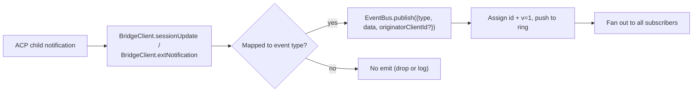
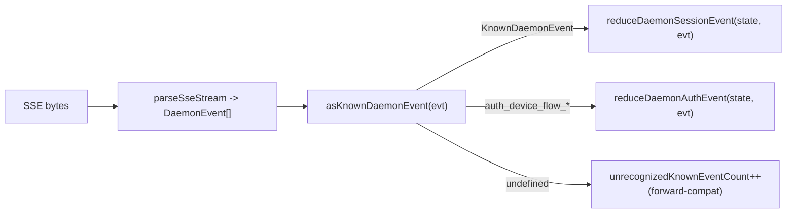

# Типизированная схема событий демона v1

## Обзор

Каждый SSE-фрейм, отправляемый демоном на `GET /session/:id/events`, имеет вид `{ id, v, type, data, originatorClientId?, _meta? }`. `v: 1` — это текущая версия `EVENT_SCHEMA_VERSION`. `type` берётся из замкнутого, привязанного к версии набора `DAEMON_KNOWN_EVENT_TYPE_VALUES` в `packages/sdk-typescript/src/daemon/events.ts`; текущий набор содержит 43 известных типа событий. Поле конверта `_meta` проставляется на границе записи SSE функцией `formatSseFrame()` в `server.ts`; см. [Метаданные уровня конверта](#envelope-level-metadata).

SDK предоставляет функцию `asKnownDaemonEvent(evt)`. Она возвращает дискриминированный тип `KnownDaemonEvent` для известных типов событий и `undefined` для остальных. Таким образом, потребители SDK могут обеспечивать прямую совместимость без обязательного обновления SDK, когда новый демон добавляет тип события; редьюсер сессии записывает такие события как `unrecognizedKnownEventCount`.

Формат передачи описан в [`../qwen-serve-protocol.md`](../qwen-serve-protocol.md). На этой странице описан контракт полезной нагрузки для каждого события.

## Обязанности

- Предоставить единый источник истины для словаря событий (`DAEMON_KNOWN_EVENT_TYPE_VALUES`).
- Предоставить типизированный конверт для каждого типа событий (`DaemonEventEnvelope<TType, TData>`).
- Предоставить чистые редьюсеры (`reduceDaemonSessionEvent`, `reduceDaemonAuthEvent`), которые проецируют поток событий в состояние представления SDK.
- Транслировать тег возможности `typed_event_schema` в качестве информационного сигнала. Если тег отсутствует, `asKnownDaemonEvent` всё равно выполняет резервное приведение к `unknown`.

## Словарь событий (43 известных типа)

Сгруппированы по доменам.

### Основная сессия

| Тип                        | Направление | Триггер                                                                        | Ключевые поля полезной нагрузки                                                              |
| -------------------------- | ----------- | ------------------------------------------------------------------------------ | -------------------------------------------------------------------------------------------- |
| `session_update`           | S->C        | Любое ACP-уведомление `sessionUpdate`: текст агента, мысль, вызов инструмента или план | `sessionUpdate: string, content?: ...` (непрозрачная ACP-форма)                              |
| `session_metadata_updated` | S->C        | `PATCH /session/:id/metadata`                                                  | `sessionId, displayName?`                                                                     |
| `session_died`             | S->C, терминальное | `channel.exited`                                                          | `sessionId, reason, exitCode? \| null, signalCode? \| null`                                  |
| `session_closed`           | S->C, терминальное | `DELETE /session/:id` или программное закрытие                            | `sessionId, reason: 'client_close' \| string, closedBy?`                                     |
| `session_snapshot`         | S->C, синтетическое | Кадр снимка после подключения SSE / повторного воспроизведения               | `sessionId, currentModelId: string \| null, currentApprovalMode: string \| null`             |

### Синтетические фреймы на уровне подписчика

| Тип                       | Триггер                                                                                                                                                                                                                          | Примечания                                                                                                                                                                                                                                                                                                                                                                                                                                            |
| ------------------------- | -------------------------------------------------------------------------------------------------------------------------------------------------------------------------------------------------------------------------------- | ----------------------------------------------------------------------------------------------------------------------------------------------------------------------------------------------------------------------------------------------------------------------------------------------------------------------------------------------------------------------------------------------------------------------------------------------------- |
| `client_evicted`          | Переполнение очереди EventBus для конкретного подписчика. **Без `id`**                                                                                            | `reason: string, droppedAfter?: number`; терминальное только для текущего подписчика, при этом сессия остаётся активной.                                                                                                                                                                                                                                                                                                                              |
| `slow_client_warning`     | Очередь >= 75%; принудительно отправлено и **не имеет `id`**                                                                                                      | `queueSize, maxQueued, lastEventId`; перевооружается после того, как очередь опускается ниже 37.5%.                                                                                                                                                                                                                                                                                                                                                   |
| `stream_error`            | `SubscriberLimitExceededError` или другая ошибка потока маршрута                                                                                                   | `error: string`; терминальное для подписки.                                                                                                                                                                                                                                                                                                                                                                                                           |
| `state_resync_required`   | `subscribe({lastEventId})` обнаруживает, что кольцо демона больше не содержит `[lastEventId+1, earliestInRing-1]`, или курсор клиента относится к предыдущей эпохе шины. Принудительно отправляется **до** оставшихся фреймов повторного воспроизведения и **не имеет `id`**. | `reason: 'ring_evicted' \| 'epoch_reset' \| string`, `lastDeliveredId: number`, `earliestAvailableId: number`. Это сигнал восстановления, не терминальный: SSE-поток остаётся открытым, повторное воспроизведение и живые фреймы продолжаются. Редьюсер SDK устанавливает `awaitingResync = true` и пропускает дельты, пока вызывающий код не выполнит сброс с помощью `loadSession`. |
| `replay_complete`         | Страж без id, отправляемый после завершения цикла повторного воспроизведения `Last-Event-ID`, как для чистого воспроизведения, так и для пути с вытеснением из кольца, даже когда `data.replayedCount === 0`. **Без `id`**         | `replayedCount: number`; позволяет потребителям детерминированно убирать UI догоняющего режима без таймаута.                                                                                                                                                                                                                                                                                                                                           |

### Разрешения (F3 + base)

| Тип                             | Направление | Триггер                                                | Ключевые поля полезной нагрузки                                                                                                                                |
| ------------------------------- | ----------- | ------------------------------------------------------ | ----------------------------------------------------------------------------------------------------------------------------------------------------------------- |
| `permission_request`            | S->C        | Агент вызывает `requestPermission`                     | `requestId, sessionId, toolCall, options[]`; конверт проставляет `originatorClientId` от инициатора подсказки.                                                      |
| `permission_resolved`           | S->C        | Посредник принял решение                               | `requestId, outcome` (ACP `PermissionOutcome`)                                                                                                                      |
| `permission_already_resolved`   | S->C        | Голос поступает после того, как запрос уже был решён   | `requestId, sessionId, outcome`                                                                                                                                     |
| `permission_partial_vote`       | S->C        | Политика `consensus` фиксирует нефинальный голос        | `requestId, sessionId, votesReceived, votesNeeded (>= 1), quorum, optionTallies: Record<string, number>, originatorClientId?`                                      |
| `permission_forbidden`          | S->C        | Политика отклоняет голос                                | `requestId, sessionId, clientId?, reason: 'designated_mismatch' \| 'remote_not_allowed', originatorClientId?`; анонимные голосующие опускают `clientId`.               |

### Модели

| Тип                     | Направление | Полезная нагрузка                          |
| ----------------------- | ----------- | ------------------------------------------ |
| `model_switched`        | S->C        | `sessionId, modelId`                       |
| `model_switch_failed`   | S->C        | `sessionId, requestedModelId, error: string` |

### MCP-ограничения (PR 14b + F2)

| Тип                            | Направление | Полезная нагрузка                                                                                                                                                                                                                                                                                                                                                                                                                                    |
| ------------------------------ | ----------- | ---------------------------------------------------------------------------------------------------------------------------------------------------------------------------------------------------------------------------------------------------------------------------------------------------------------------------------------------------------------------------------------------------------------------------------------------------- |
| `mcp_budget_warning`           | S->C        | `liveCount, reservedCount, budget, thresholdRatio: 0.75, mode: 'warn' \| 'enforce', scope?: 'workspace' \| 'session'`                                                                                                                                                                                                                                                                                                                                |
| `mcp_child_refused_batch`      | S->C        | `refusedServers: [{ name, transport, reason: 'budget_exhausted' }], budget, liveCount, reservedCount, mode: 'enforce', scope?: 'workspace' \| 'session'`                                                                                                                                                                                                                                                                                             |
| `mcp_server_restarted`         | S->C        | `serverName, durationMs, entryIndex?` для F2 перезапусков пула с несколькими входами                                                                                                                                                                                                                                                                                                                                                                 |
| `mcp_server_restart_refused`   | S->C        | `serverName, reason: 'budget_would_exceed' \| 'in_flight' \| 'disabled' \| 'restart_failed', entryIndex?, details?`. Четвёртое значение, `restart_failed`, несёт в себе базовый аппаратный сбой для перезапуска пула с несколькими входами. `MCP_RESTART_REFUSED_REASONS` отвергает неизвестные причины; старый редьюсер SDK молча отбрасывает аддитивные новые значения причин, поскольку `parseDaemonEvent` возвращает `undefined`. Выпускайте новую причину вместе с SDK, который её знает. |

### Управление мутациями (Wave 4 PR 16+17)

| Тип                       | Направление | Полезная нагрузка                                                                                     |
| ------------------------- | ----------- | ----------------------------------------------------------------------------------------------------- |
| `memory_changed`          | S->C        | `scope: 'workspace' \| 'global', filePath, mode: 'append' \| 'replace', bytesWritten`                  |
| `agent_changed`           | S->C        | `change: 'created' \| 'updated' \| 'deleted', name, level: 'project' \| 'user'`                        |
| `approval_mode_changed`   | S->C        | `sessionId, previous, next, persisted: boolean`                                                        |
| `tool_toggled`            | S->C        | `toolName, enabled`; влияет на следующее порождение дочернего ACP-процесса и не изменяет уже запущенные сессии. |
| `settings_changed`        | S->C        | Запись настроек рабочего пространства завершена. Полезная нагрузка открыта; потребителям следует обновить данные с помощью чтения после записи. |
| `settings_reloaded`       | S->C        | Сервис рабочего пространства демона перечитал настройки. Полезная нагрузка открыта.                    |
| `workspace_initialized`   | S->C        | `path, action: 'created' \| 'overwrote' \| 'noop', originatorClientId?`                               |

### Поток аутентификации устройства (PR 21)

Эти события привязаны к рабочему пространству, а не к сессии. Редьюсер сессии рассматривает их как no-op; `reduceDaemonAuthEvent` проецирует их в состояние на уровне рабочего пространства.

| Тип                             | Направление | Полезная нагрузка                                        |
| ------------------------------- | ----------- | -------------------------------------------------------- |
| `auth_device_flow_started`      | S->C        | `deviceFlowId, providerId, expiresAt`                    |
| `auth_device_flow_throttled`    | S->C        | `deviceFlowId, intervalMs`                               |
| `auth_device_flow_authorized`   | S->C        | `deviceFlowId, providerId, expiresAt?, accountAlias?`    |
| `auth_device_flow_failed`       | S->C        | `deviceFlowId, errorKind, hint?`                         |
| `auth_device_flow_cancelled`    | S->C        | `deviceFlowId`                                           |

### MCP-мутации во время выполнения

| Тип                    | Направление | Триггер                                                         | Ключевые поля полезной нагрузки                                                                |
| ---------------------- | ----------- | --------------------------------------------------------------- | ---------------------------------------------------------------------------------------------- |
| `mcp_server_added`     | S->C        | Сервер добавлен во время выполнения через `POST /workspace/mcp/servers` | `name, transport, replaced, shadowedSettings, toolCount, originatorClientId`                   |
| `mcp_server_removed`   | S->C        | Сервер удалён во время выполнения                                | `name, wasShadowingSettings, originatorClientId`                                               |

### Жизненный цикл хода / отправки ассистента

| Тип                    | Направление | Триггер                                                                                                               | Ключевые поля полезной нагрузки                                                                                                                                                                    |
| ---------------------- | ----------- | --------------------------------------------------------------------------------------------------------------------- | --------------------------------------------------------------------------------------------------------------------------------------------------------------------------------------------------- |
| `prompt_cancelled`     | S->C        | Запрос отменён через явный маршрут `cancelSession` **или** разрыв SSE-соединения инициатором                          | Конверт проставляет `originatorClientId` для отменяющего клиента. Это означает «запрос на отмену», а не «отмена подтверждена». Другие подписчики узнают, что запрос завершён.                        |
| `turn_complete`        | S->C        | Ход успешно завершён                                                                                                  | `sessionId, stopReason, promptId?`. `promptId` связывает с ответами на неблокирующие запросы (`202`). SDK сопоставляет SSE-события с исходным запросом через этот идентификатор.                     |
| `turn_error`           | S->C        | Ход завершился ошибкой                                                                                                | `sessionId, message, code?, promptId?`; тот же механизм корреляции `promptId`.                                                                                                                       |
| `session_rewound`      | S->C        | `POST /session/:id/rewind` выполнен успешно                                                                            | `sessionId, promptId, targetTurnIndex, filesChanged[], filesFailed[], originatorClientId?`                                                                                                            |
| `session_branched`     | S->C        | `POST /session/:id/branch` создал ответвление от существующей сессии                                                   | `sourceSessionId, newSessionId, displayName, originatorClientId?`                                                                                                                                   |
| `followup_suggestion`  | S->C        | ACP-дочерний процесс сгенерировал предложения-призраки после `end_turn`, пересылаемые через SSE конкретной сессии      | `sessionId, suggestion, promptId`; по проводу передаются только предложения, у которых `getFilterReason()===null`. Клиенты отображают их как текст-призрак в поле ввода и сбрасывают при следующем `sendPrompt`. |
| `user_shell_command`   | S->C        | Пользователь запустил команду оболочки через `POST /session/:id/shell`; разослана другим подписчикам той же сессии     | `sessionId, command, shellId, originatorClientId?`. Типизированного интерфейса `DaemonXxxData` пока нет; `asKnownDaemonEvent` возвращает `undefined`, и нормализатор UI разбирает его ad hoc.       |
| `user_shell_result`    | S->C        | Результат вышеуказанной команды оболочки                                                                               | `sessionId, shellId, exitCode, output, aborted`. То же примечание о разборе ad hoc, что и для `user_shell_command`.                                                                                   |

## Архитектура

| Аспект                              | Источник                                        | Примечания                                                                                             |
| ----------------------------------- | ----------------------------------------------- | ------------------------------------------------------------------------------------------------------ |
| `EVENT_SCHEMA_VERSION = 1`          | `packages/acp-bridge/src/eventBus.ts`           | Отправляется в каждом фрейме.                                                                          |
| `DAEMON_KNOWN_EVENT_TYPE_VALUES`    | `packages/sdk-typescript/src/daemon/events.ts`  | Закрытый список из 43 типов.                                                                           |
| `DaemonEventEnvelope<TType, TData>` | `events.ts`                                     | Общий конверт.                                                                                         |
| `DaemonKnownEventType`              | `events.ts`                                     | `typeof DAEMON_KNOWN_EVENT_TYPE_VALUES[number]`.                                                       |
| Типы полезной нагрузки для каждого события | `events.ts`                                | У большинства типов событий есть интерфейс `DaemonXxxData`; `user_shell_*` пока разбирается ad hoc нормализатором UI. |
| `asKnownDaemonEvent(evt)`           | `events.ts`                                     | Возвращает `KnownDaemonEvent \| undefined`.                                                            |
| `reduceDaemonSessionEvent(state, evt)` | `events.ts`                                  | Проецирует в `DaemonSessionViewState`.                                                                 |
| `reduceDaemonAuthEvent(state, evt)`  | `events.ts`                                     | Проецирует в `DaemonAuthState`.                                                                        |
| `isWorkspaceScopedBudgetEvent(evt)`  | `events.ts`                                     | Обнаруживает F2 `scope: 'workspace'`.                                                                  |
### `DaemonSessionViewState`

`reduceDaemonSessionEvent` заполняет это состояние представления. Адаптер CLI TUI, `DaemonChannelBridge` и VS Code IDE потребляют его. Ключевые поля:

- `alive: boolean` — становится `false` после терминального кадра (`session_died`, `session_closed`, `client_evicted`, `stream_error`).
- `currentModelId?: string` — из `model_switched`.
- `displayName?: string` — из `session_metadata_updated`.
- `pendingPermissions: Record<string, DaemonPermissionRequestData>` — открытые запросы, ключи — `requestId`; очищается при `permission_resolved` / `permission_already_resolved`.
- `lastSessionUpdate?: DaemonSessionUpdateData` — последний `session_update`.
- `lastModelSwitchFailure?: DaemonModelSwitchFailedData` — из `model_switch_failed`.
- `terminalEvent?` — сырое терминальное событие.
- `streamError?: DaemonStreamErrorData` — последняя полезная нагрузка `stream_error`.
- `unrecognizedKnownEventCount`, `lastUnrecognizedKnownEvent?` — событие было распознано `asKnownDaemonEvent`, но у редьюсера пока нет выделенного состояния для него.
- `droppedPermissionRequestCount`, `lastDroppedPermissionRequestId?` — некорректный запрос разрешения не смог попасть в карту ожидающих.
- `unmatchedPermissionResolutionCount`, `lastUnmatchedPermissionResolutionId?` — разрешение не нашло соответствующего ожидающего запроса.
- `slowClientWarningCount`, `lastSlowClientWarning?` — из `slow_client_warning`.
- `mcpBudgetWarningCount`, `lastMcpBudgetWarning?` — из `mcp_budget_warning`.
- `mcpChildRefusedBatchCount`, `lastMcpChildRefusedBatch?` — из `mcp_child_refused_batch`.
- `lastWorkspaceMutation?`, `lastWorkspaceMutationType?` — из `memory_changed` / `agent_changed`.
- `approvalMode?`, `approvalModeChangedCount`, `lastApprovalModeChange?` — из `approval_mode_changed`.
- `toolToggleCount`, `lastToolToggle?` — из `tool_toggled`.
- `workspaceInitCount`, `lastWorkspaceInit?` — из `workspace_initialized`.
- `mcpRestartCount`, `lastMcpRestart?` — из `mcp_server_restarted`.
- `mcpRestartRefusedCount`, `lastMcpRestartRefused?` — из `mcp_server_restart_refused`.
- `settings_changed` / `settings_reloaded` — распознается `asKnownDaemonEvent`; редьюсер сессии не поддерживает выделенные поля состояния представления, UI обычно трактует их как сигналы обновления.
- `permissionVoteProgress: Record<string, DaemonPermissionPartialVoteData>` — ход консенсусного голосования.
- `forbiddenVotes: DaemonPermissionForbiddenData[]`, `forbiddenVoteCount` — записи голосов, отклонённых политикой, не более 32.
- `awaitingResync: boolean` — устанавливается `state_resync_required`; сбрасывается, когда потребитель перезагружает состояние представления.
- `resyncRequiredCount`, `lastResyncRequired?` — наблюдаемость ресинхронизации.
- `lastFollowupSuggestion?: DaemonFollowupSuggestionData` — последняя подсказка для продолжения, отправленная демоном.
- `lastTurnComplete?: DaemonTurnCompleteData` — последнее успешное завершение хода.
- `lastTurnError?: DaemonTurnErrorData` — последняя ошибка хода.
- `rewindCount`, `lastRewind?`, `lastBranch?` — последние события перемотки / ветвления.

### `DaemonAuthState`

Одна запись на `providerId`, управляется `auth_device_flow_*`. Каждый поток раскрывает `{ deviceFlowId, status, providerId, expiresAt?, lastThrottleIntervalMs?, lastError? }`.

## Поток (Flow)

### Сторона продюсера



### Сторона потребителя (SDK)



## Метаданные на уровне конверта (Envelope-level metadata)

Помимо полезной нагрузки `data` каждого события, демон добавляет два поля уровня конверта.

### `_meta.serverTimestamp` — часы демона

`formatSseFrame()` в `packages/cli/src/serve/server.ts` проставляет её на границе записи SSE, **не** внутри `EventBus.publish`. Тип `BridgeEvent` в памяти остаётся неизменным; внутренние потребители демона не видят `_meta`, а проволочные SSE-кадры — да.

```jsonc
{
  "id": 47,
  "v": 1,
  "type": "session_update",
  "data": { ... },
  "_meta": { "serverTimestamp": 1716287345123 }
}
```

Слияние сохраняет любые существующие ключи `_meta`
(`{...existingMeta, serverTimestamp: Date.now()}`). **Ни один текущий продюсер
демона не пишет `_meta` на уровне конверта**. Слияние верхнего уровня — это
обратно-совместимый запасной вариант.

Почему это важно: мультиклиентские UI, которые отображают относительное время или сортируют блоки транскрипта, должны использовать серверное время вместо локальных часов каждого браузера/вкладки/телефона. Серверная метка сохраняет согласованность порядка между клиентами.

Доступ из SDK: предпочтительно `event._meta?.serverTimestamp`. Пути обратной совместимости могут также проверять `event.serverTimestamp` или `event.data._meta.serverTimestamp`. Не смешивайте `data._meta` из полезной нагрузки ACP с конвертным `_meta`.

### `originatorClientId`

События, вызванные запросом, который содержал зарегистрированный `X-Qwen-Client-Id`, могут проставлять это поле. См. [`08-session-lifecycle.md`](./08-session-lifecycle.md).

## `_meta` вызова инструмента (provenance / serverId)

Это отдельно от конвертного `_meta`: полезные нагрузки ACP `session/update` могут нести собственный `_meta` в `event.data._meta`. `ToolCallEmitter` (`packages/cli/src/acp-integration/session/emitters/ToolCallEmitter.ts`) проставляет два поля в `emitStart`, `emitResult` и `emitError`:

| Поле         | Тип                                        | Правило разрешения                                                                                                                                                                |
| ------------ | ------------------------------------------ | --------------------------------------------------------------------------------------------------------------------------------------------------------------------------------- |
| `provenance` | `'builtin' \| 'mcp' \| 'subagent'`        | `ToolCallEmitter.resolveToolProvenance`: если есть `subagentMeta` — `subagent`; имя инструмента, совпадающее с `mcp__<server>__<tool>`, даёт `mcp`; всё остальное — `builtin`. |
| `serverId`   | `string` только когда `provenance === 'mcp'` | Извлекается эвристически из `mcp__<serverId>__<tool>`.                                                                                                                            |

Существующее отображаемое имя `_meta.toolName` сохраняется. UI использует эти поля для отображения значков builtin / MCP server / subagent без повторного разбора имени инструмента.

## Поведение редьюсера SDK

`reduceDaemonSessionEvent(state, evt)` в `packages/sdk-typescript/src/daemon/events.ts` проецирует поток в `DaemonSessionViewState`. Поля, связанные с ресинхронизацией:

- **`awaitingResync: boolean`** — устанавливается `state_resync_required`; вызывающий код очищает его, обычно после `POST /session/:id/load` сбрасывает состояние представления.
- **`resyncRequiredCount: number`** — счётчик наблюдаемости.
- **`lastResyncRequired?: DaemonStateResyncRequiredData`** — последняя полезная нагрузка.

Пока `awaitingResync = true`, редьюсер **пропускает применение дельт** и разрешает только закрытое множество `RESYNC_PASSTHROUGH_TYPES`:

| Тип пропуска (Passthrough type) | Почему всё ещё применяется во время ресинхронизации                                |
| ------------------------------- | ---------------------------------------------------------------------------------- |
| `state_resync_required`         | Редкая вторая ресинхронизация должна обновить `lastResyncRequired` / `resyncRequiredCount`. |
| `session_died`                  | Сигнал терминального потока должен оставаться видимым во время ресинхронизации.     |
| `session_closed`                | То же, что выше.                                                                   |
| `client_evicted`                | То же, что выше.                                                                   |
| `stream_error`                  | То же, что выше.                                                                   |
| `session_snapshot`              | Полный авторитетный кадр состояния; безопасно применять во время ресинхронизации.  |

`lastEventId` по-прежнему монотонно увеличивается через `advanceLastEventId(base)` во время ресинхронизации. После того как вызывающий код сбросит состояние и очистит `awaitingResync`, последующие дельты выравниваются по правильному курсору.

`reduceDaemonAuthEvent` проецирует события потоков устройства в записи состояния аутентификации уровня рабочего пространства, имеющие вид
`{deviceFlowId, status, providerId, expiresAt?, lastThrottleIntervalMs?, lastError?}`
концептуально. В коде редьюсер хранит `status`, `errorKind`, `hint`,
`intervalMs`, `lastSeenEventId`, `authorizedExpiresAt` и `accountAlias` в
`DaemonDeviceFlowReducerState`; сами полезные нагрузки событий демона остаются
формами для каждого события, перечисленными выше.

## Состояние и прямая совместимость

- Добавьте известный тип события, дополнив `DAEMON_KNOWN_EVENT_TYPE_VALUES`. Старые SDK возвращают `undefined` для неизвестных типов событий через путь запасного варианта и увеличивают `unrecognizedKnownEventCount`; новые SDK полагаются на размеченное объединение.
- Добавление опциональных полей в существующую полезную нагрузку безопасно, поскольку полезные нагрузки открыты (`{ [key: string]: unknown }`).
- Изменение **формы** существующей полезной нагрузки является ломающим изменением и требует увеличения `EVENT_SCHEMA_VERSION` и объявления совместимого тега возможностей, например `caps.features.typed_event_schema_v2`.
- `id` монотонен в рамках сессии. Синтетические кадры уровня подписчика (`client_evicted`, `slow_client_warning`, `stream_error`, `state_resync_required`, `replay_complete`, `session_snapshot`) намеренно не имеют id, чтобы другие подписчики не видели пропусков.
- `originatorClientId` находится на конверте, а не в `data`. Полезные нагрузки частичных голосов F3 / запрещённых действий также объединяют его в `data` через `mergeOriginator`, чтобы потребители состояния представления не нуждались в сохранении конверта.

## Зависимости (Dependencies)

- [`10-event-bus.md`](./10-event-bus.md) — канал доставки.
- [`11-capabilities-versioning.md`](./11-capabilities-versioning.md) — как SDK проверяют `typed_event_schema`, `mcp_guardrail_events` и `permission_mediation`.
- [`04-permission-mediation.md`](./04-permission-mediation.md) — как создаются события разрешений.
- [`13-sdk-daemon-client.md`](./13-sdk-daemon-client.md) — `asKnownDaemonEvent`, редьюсеры и форма состояния представления.

## Конфигурация (Configuration)

- Всегда объявляются: `typed_event_schema`, `mcp_guardrail_events` и `permission_mediation` (с поддерживаемыми режимами политик).
- Никакая переменная окружения или флаг напрямую не управляют самой схемой. `QWEN_SERVE_NO_MCP_POOL=1` изменяет `scope` события MCP с `'workspace'` на отсутствующий или `'session'`.

## Предостережения и известные ограничения (Caveats and known limits)

- Шесть типов синтетических кадров намеренно не имеют `id`; код SDK не должен предполагать, что каждое событие имеет id.
- `permission_partial_vote` появляется только при `consensus`. `permission_forbidden` появляется при `designated`, `consensus` и `local-only`, но не при `first-responder`.
- `mcp_child_refused_batch` появляется только в `mode: 'enforce'`; в режиме `warn` отказ не происходит.
- События `auth_device_flow_*` не привязаны к сессии. При потреблении через `DaemonSessionClient` используйте для них `reduceDaemonAuthEvent`, а не редьюсер сессии.

## Ссылки (References)

- `packages/sdk-typescript/src/daemon/events.ts`
- `packages/acp-bridge/src/eventBus.ts` (`EVENT_SCHEMA_VERSION`)
- `packages/cli/src/serve/capabilities.ts` (`typed_event_schema`, `mcp_guardrail_events`, `permission_mediation`)
- Проволочный справочник: [`../qwen-serve-protocol.md`](../qwen-serve-protocol.md)