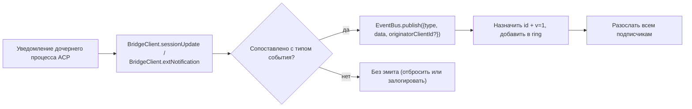
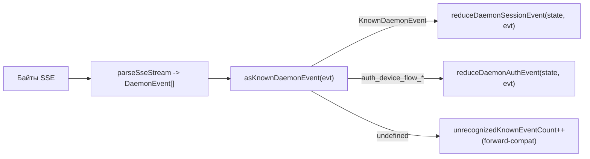

# Типизированная схема событий демона v1

## Обзор

Каждый SSE-фрейм, генерируемый демоном на эндпоинте `GET /session/:id/events`, имеет структуру `{ id, v, type, data, originatorClientId?, _meta? }`. `v: 1` — это текущая версия `EVENT_SCHEMA_VERSION`. Поле `type` берется из закрытого, зафиксированного по версии набора `DAEMON_KNOWN_EVENT_TYPE_VALUES` в `packages/sdk-typescript/src/daemon/events.ts`. Поле `_meta` в обертке проставляется на границе записи SSE функцией `formatSseFrame()` в `packages/cli/src/serve/routes/sse-events.ts`; см. [Метаданные уровня обертки](#envelope-level-metadata).

SDK предоставляет метод `asKnownDaemonEvent(evt)`. Он возвращает дискриминированный объект `KnownDaemonEvent` для известных типов событий и `undefined` для остальных. Таким образом, потребители SDK могут обеспечивать прямую совместимость без необходимости синхронного обновления SDK, когда более новая версия демона добавляет новый тип события; редьюсер сессии записывает такие события как `unrecognizedKnownEventCount`.

Сетевой формат описан в [`../qwen-serve-protocol.md`](../qwen-serve-protocol.md). На этой странице представлен контракт полезной нагрузки для каждого события.

## Ответственность

- Предоставляет единый источник истины для словаря событий (`DAEMON_KNOWN_EVENT_TYPE_VALUES`).
- Предоставляет типизированную обертку для каждого типа события (`DaemonEventEnvelope<TType, TData>`).
- Предоставляет чистые редьюсеры (`reduceDaemonSessionEvent`, `reduceDaemonAuthEvent`), которые проецируют поток событий в состояние представления SDK.
- Транслирует тег возможности `typed_event_schema` в качестве информационного сигнала. Если тег отсутствует, `asKnownDaemonEvent` все равно возвращает `unknown`.

## Словарь событий

Сгруппированы по доменам.

### Основная сессия

| Тип | Направление | Триггер | Ключевые поля payload |
| --- | --- | --- | --- |
| `session_update` | S->C | Любое уведомление ACP `sessionUpdate`: текст агента, размышление, вызов инструмента или план | `sessionUpdate: string, content?: ...` (непрозрачная структура ACP) |
| `session_metadata_updated` | S->C | `PATCH /session/:id/metadata` | `sessionId, displayName?` |
| `session_died` | S->C terminal | `channel.exited` | `sessionId, reason, exitCode? \| null, signalCode? \| null` |
| `session_closed` | S->C terminal | `DELETE /session/:id` или программное закрытие | `sessionId, reason: 'client_close' \| string, closedBy?` |
| `session_snapshot` | S->C synthetic | Снимочный фрейм после подключения / воспроизведения SSE | `sessionId, currentModelId: string \| null, currentApprovalMode: string \| null, recordingDegraded: boolean` |
| `session_recording_degraded` | S->C | Транскрипт сессии был безвозвратно остановлен после асинхронной ошибки записи | `sessionId, reason: 'write_failed'` |

### Синтетические фреймы уровня подписчика

| Тип | Триггер | Примечания |
| --- | --- | --- |
| `client_evicted` | Переполнение очереди EventBus для конкретного подписчика. **Нет `id`** | `reason: 'queue_overflow' \| 'queue_bytes_overflow' \| string, droppedAfter?: number, queueSize?: number, maxQueued?: number, queuedBytes?: number, maxQueuedBytes?: number, eventBytes?: number`; завершающее событие только для текущего подписчика, при этом сессия остается активной. |
| `slow_client_warning` | Отставание по живым фреймам или живым сериализованным байтам >= 75%; принудительно отправляется и **не имеет `id`** | `queueSize, maxQueued, lastEventId, queuedBytes?, maxQueuedBytes?, threshold?: 'frames' \| 'bytes' \| 'frames_and_bytes'`; повторно активируется после того, как показатели по фреймам и байтам падают ниже 37.5%. |
| `stream_error` | `SubscriberLimitExceededError` или другая ошибка потока маршрута | `error: string`; завершающее событие для подписки. |
| `state_resync_required` | `subscribe({lastEventId})` обнаруживает, что кольцевой буфер демона больше не содержит `[lastEventId+1, earliestInRing-1]`, или курсор клиента относится к предыдущей эпохе шины. Принудительно отправляется **до** оставшихся фреймов воспроизведения и **не имеет `id`**. | `reason: 'ring_evicted' \| 'epoch_reset' \| string`, `lastDeliveredId: number`, `earliestAvailableId: number`. Это сигнал восстановления, а не завершающее событие: поток SSE остается открытым, и воспроизведение + живые фреймы продолжаются. Редьюсер SDK устанавливает `awaitingResync = true` и пропускает дельты, пока вызывающий код не выполнит сброс с помощью `loadSession`. |
| `history_truncated`     | `POST /session/:id/load` возвращает ограниченный снимок воспроизведения после удаления старых записей воспроизведения из памяти. Добавляется в начало `compactedReplay` и **не имеет `id`**. | `reason: 'replay_window_exceeded'`, `truncatedEvents: number`, `retainedEvents: number`, `maxBytes: number`, `truncatedTurns?: number`, `fullTranscriptAvailable: boolean`. Это маркер состояния, а не запрос ресинхронизации; клиенты отображают его и продолжают применять сохранённое воспроизведение. |
| `replay_complete` | Сигнальное событие без id, генерируемое после завершения цикла воспроизведения `Last-Event-ID`, как для чистого воспроизведения, так и для путей с выселением из кольца, даже если `data.replayedCount === 0`. **Нет `id`** | `replayedCount: number`; позволяет потребителям детерминированно скрывать UI синхронизации без использования таймаута. |

`fullTranscriptAvailable` — это булев флаг возможности (capability), а не литеральный тип `true`. Текущие демоны выдают `true`, когда `/session/:id/transcript` может использоваться для постраничного просмотра сохранённого транскрипта; старые или ограниченные демоны могут выдавать `false`, и клиенты должны продолжать нормально отображать ограниченное воспроизведение.

### Разрешения (F3 + base)

| Тип | Направление | Триггер | Ключевые поля payload |
| --- | --- | --- | --- |
| `permission_request` | S->C | Агент вызывает `requestPermission` | `requestId, sessionId, toolCall, options[]`; обертка проставляет `originatorClientId` от инициатора промпта. |
| `permission_resolved` | S->C | Медиатор принял решение | `requestId, outcome` (ACP `PermissionOutcome`) |
| `permission_already_resolved` | S->C | Голос поступает после того, как запрос уже был решен | `requestId, sessionId, outcome` |
| `permission_partial_vote` | S->C | Политика `consensus` фиксирует неокончательный голос | `requestId, sessionId, votesReceived, votesNeeded (>= 1), quorum, optionTallies: Record<string, number>, originatorClientId?` |
| `permission_forbidden` | S->C | Политика отклоняет голос | `requestId, sessionId, clientId?, reason: 'designated_mismatch' \| 'remote_not_allowed', originatorClientId?`; анонимные голосующие не указывают `clientId`. |

### Модели

| Тип | Направление | Payload |
| --- | --- | --- |
| `model_switched` | S->C | `sessionId, modelId` |
| `model_switch_failed` | S->C | `sessionId, requestedModelId, error: string` |

### Ограничения MCP (PR 14b + F2)

| Тип | Направление | Payload |
| --- | --- | --- |
| `mcp_budget_warning` | S->C | `liveCount, reservedCount, budget, thresholdRatio: 0.75, mode: 'warn' \| 'enforce', scope?: 'workspace' \| 'session'` |
| `mcp_child_refused_batch` | S->C | `refusedServers: [{ name, transport, reason: 'budget_exhausted' }], budget, liveCount, reservedCount, mode: 'enforce', scope?: 'workspace' \| 'session'` |
| `mcp_server_restarted` | S->C | `serverName, durationMs, entryIndex?` для перезапусков пула с несколькими записями F2 |
| `mcp_server_restart_refused` | S->C | `serverName, reason: 'budget_would_exceed' \| 'in_flight' \| 'disabled' \| 'restart_failed', entryIndex?, details?`. Четвертое значение, `restart_failed`, содержит информацию о базовой жесткой ошибке при перезапуске пула с несколькими записями. `MCP_RESTART_REFUSED_REASONS` отклоняет неизвестные причины; старый редьюсер SDK молча отбрасывает новые добавленные значения причин, поскольку `parseDaemonEvent` возвращает `undefined`. Отправляйте новую причину вместе с SDK, который её поддерживает. |
### Управление мутациями (Wave 4 PR 16+17)

| Тип                      | Направление | Полезная нагрузка                                                                                                                              |
| ------------------------ | ----------- | ---------------------------------------------------------------------------------------------------------------------------------------------- |
| `memory_changed`         | S->C        | Файловая память: `scope: 'workspace' \| 'global', filePath, mode, bytesWritten`; управляемая память: `scope: 'managed', source, taskId, touchedScopes` |
| `agent_changed`          | S->C        | `change: 'created' \| 'updated' \| 'deleted', name, level: 'project' \| 'user'`                                                                |
| `approval_mode_changed`  | S->C        | `sessionId, previous, next, persisted: boolean`                                                                                                |
| `tool_toggled`           | S->C        | `toolName, enabled`; влияет на следующий запуск дочернего процесса ACP и не изменяет уже запущенные сессии.                                            |
| `settings_changed`       | S->C        | Запись настроек рабочего пространства завершена. Полезная нагрузка открыта; потребителям следует обновить данные с помощью чтения после записи.                                           |
| `settings_reloaded`      | S->C        | Сервис рабочего пространства демона перечитал настройки. Полезная нагрузка открыта.                                                                                     |
| `trust_change_requested` | S->C        | `workspaceCwd, desiredState: 'trusted' \| 'untrusted', reason?`                                                                                |
| `workspace_initialized`  | S->C        | `path, action: 'created' \| 'overwrote' \| 'noop', originatorClientId?`                                                                        |
| `github_setup_completed` | S->C        | `releaseTag, readmeUrl, secretsUrl?, workflows: [{path, status, sizeBytes?, error?}], gitignore: {path, status, added?, error?}`               |

`memory_changed` также охватывает задачи управляемой памяти без сессии. Для таких полезных нагрузок `scope` равен `"managed"`, `source` — это одно из значений `"workspace_memory_remember"`, `"workspace_memory_forget"` или `"workspace_memory_dream"`, `taskId` — это идентификатор задачи в очереди, а `touchedScopes` содержит список измененных областей управляемой памяти (`"user"` и/или `"project"`). Событие не генерируется, если задача remember/forget/dream завершается без изменения управляемой памяти.

### Device flow аутентификации (PR 21)

Эти события привязаны к рабочему пространству (workspace), а не к сессии. Редьюсер сессии обрабатывает их как no-op; `reduceDaemonAuthEvent` проецирует их в состояние на уровне рабочего пространства.

| Тип                           | Направление | Полезная нагрузка                                       |
| ----------------------------- | ----------- | ----------------------------------------------------- |
| `auth_device_flow_started`    | S->C        | `deviceFlowId, providerId, expiresAt`                 |
| `auth_device_flow_throttled`  | S->C        | `deviceFlowId, intervalMs`                            |
| `auth_device_flow_authorized` | S->C        | `deviceFlowId, providerId, expiresAt?, accountAlias?` |
| `auth_device_flow_failed`     | S->C        | `deviceFlowId, errorKind, hint?`                      |
| `auth_device_flow_cancelled`  | S->C        | `deviceFlowId`                                        |

### Мутации runtime MCP

| Тип                | Направление | Триггер                                                       | Ключевые поля полезной нагрузки                                                  |
| ------------------ | ----------- | ------------------------------------------------------------- | -------------------------------------------------------------------------------- |
| `mcp_server_added` | S->C        | Сервер добавлен в runtime через `POST /workspace/mcp/servers` | `name, transport, replaced, shadowedSettings, toolCount, originatorClientId`     |
| `mcp_server_removed` | S->C      | Сервер удален в runtime                                       | `name, wasShadowingSettings, originatorClientId`                                 |

### Жизненный цикл расширений

| Тип                | Направление | Триггер                                                              | Ключевые поля полезной нагрузки                                                                                          |
| ------------------ | ----------- | -------------------------------------------------------------------- | ------------------------------------------------------------------------------------------------------------------------ |
| `extensions_changed` | S->C      | Завершена фоновая установка/обновление расширения или изменен статус | `refreshed, failed, status?: 'installed' \| 'enabled' \| 'disabled' \| 'updated' \| 'uninstalled' \| 'failed', source?, name?, version?, error?` |

### Инъекция сообщений в середине хода

| Тип                       | Направление | Триггер                                                                                         | Ключевые поля полезной нагрузки                                                                                                  |
| ------------------------- | ----------- | ----------------------------------------------------------------------------------------------- | -------------------------------------------------------------------------------------------------------------------------------- |
| `mid_turn_message_injected` | S->C      | Веб-оболочка или удаленный клиент внедрил сообщения в выполняющийся ход через `POST /session/:id/inject` | `sessionId, messages: string[], originatorClientId?`; потребители ДОЛЖНЫ сравнивать `originatorClientId` со своим собственным id перед дедупликацией. |

### Жизненный цикл хода / push-уведомления от ассистента

| Тип                 | Направление | Триггер                                                                                                             | Ключевые поля полезной нагрузки                                                                                                                                                                  |
| ------------------- | ----------- | ------------------------------------------------------------------------------------------------------------------- | ------------------------------------------------------------------------------------------------------------------------------------------------------------------------------------------------ |
| `prompt_cancelled`  | S->C        | Промпт был отменен через явный маршрут `cancelSession` или из-за отключения SSE инициатора                        | Оболочка добавляет `originatorClientId` для отменяющего клиента. Это означает "запрошена отмена", а не "отмена подтверждена". Равноправные подписчики узнают, что промпт завершен.              |
| `turn_complete`     | S->C        | Ход успешно завершен                                                                                                | `sessionId, stopReason, promptId?`. `promptId` связывает с неблокирующими ответами на промпт (`202`). SDK сопоставляет события SSE с исходным промптом с его помощью.                                  |
| `turn_error`        | S->C        | Сбой хода                                                                                                           | `sessionId, message, code?, promptId?`; тот же механизм корреляции `promptId`.                                                                                                                   |
| `session_rewound`   | S->C        | `POST /session/:id/rewind` выполнен успешно                                                                         | `sessionId, promptId, targetTurnIndex, filesChanged[], filesFailed[], originatorClientId?`                                                                                                       |
| `session_branched`  | S->C        | `POST /session/:id/branch` создал ветку из существующей сессии                                                      | `sourceSessionId, newSessionId, displayName, originatorClientId?`                                                                                                                                |
| `followup_suggestion` | S->C      | Дочерний процесс ACP сгенерировал follow-up предложения в виде ghost-текста после `end_turn`, которые были пересланы через SSE для каждой сессии | `sessionId, suggestion, promptId`; по каналу передаются только предложения, у которых `getFilterReason()===null`. Клиенты отображают их как ghost-текст в плейсхолдере ввода и инвалидируют их при следующем `sendPrompt`. |
| `user_shell_command` | S->C       | Пользователь запустил shell-команду через `POST /session/:id/shell`; событие рассылается другим подписчикам в той же сессии | `sessionId, command, shellId, originatorClientId?`. Типизированного интерфейса `DaemonXxxData` пока нет; `asKnownDaemonEvent` возвращает `undefined`, и нормализатор UI разбирает его ad hoc.            |
| `user_shell_result` | S->C        | Результат выполнения вышеуказанной shell-команды                                                                    | `sessionId, shellId, exitCode, output, aborted`. То же замечание о разборе ad hoc, что и для `user_shell_command`.                                                                                               |

## Архитектура

| Аспект                                 | Источник                                       | Примечания                                                                                                         |
| -------------------------------------- | ---------------------------------------------- | ------------------------------------------------------------------------------------------------------------------ |
| `EVENT_SCHEMA_VERSION = 1`             | `packages/acp-bridge/src/eventBus.ts`          | Отправляется в каждом фрейме.                                                                                      |
| `DAEMON_KNOWN_EVENT_TYPE_VALUES`       | `packages/sdk-typescript/src/daemon/events.ts` | Закрытый список из 53 типов.                                                                                       |
| `DaemonEventEnvelope<TType, TData>`    | `events.ts`                                    | Общая оболочка.                                                                                                    |
| `DaemonKnownEventType`                 | `events.ts`                                    | `typeof DAEMON_KNOWN_EVENT_TYPE_VALUES[number]`.                                                                   |
| Типы полезных нагрузок для каждого события | `events.ts`                                | Большинство типов событий имеют интерфейс `DaemonXxxData`; `user_shell_*` в настоящее время разбирается нормализатором UI ad hoc. |
| `asKnownDaemonEvent(evt)`              | `events.ts`                                    | Возвращает `KnownDaemonEvent \| undefined`.                                                                        |
| `reduceDaemonSessionEvent(state, evt)` | `events.ts`                                    | Проецируется в `DaemonSessionViewState`.                                                                           |
| `reduceDaemonAuthEvent(state, evt)`    | `events.ts`                                    | Проецируется в `DaemonAuthState`.                                                                                  |
| `isWorkspaceScopedBudgetEvent(evt)`    | `events.ts`                                    | Обнаруживает F2 `scope: 'workspace'`.                                                                              |

### `DaemonSessionViewState`

`reduceDaemonSessionEvent` заполняет это состояние представления. Адаптер CLI TUI, `DaemonChannelBridge` и VS Code IDE потребляют его. Ключевые поля:

- `alive: boolean` — становится `false` после терминального фрейма (`session_died`, `session_closed`, `client_evicted`, `stream_error`).
- `currentModelId?: string` — из `model_switched`.
- `displayName?: string` — из `session_metadata_updated`.
- `pendingPermissions: Record<string, DaemonPermissionRequestData>` — открытые запросы, сгруппированные по `requestId`; очищается с помощью `permission_resolved` / `permission_already_resolved`.
- `lastSessionUpdate?: DaemonSessionUpdateData` — последний `session_update`.
- `lastModelSwitchFailure?: DaemonModelSwitchFailedData` — из `model_switch_failed`.
- `terminalEvent?` — сырое терминальное событие.
- `streamError?: DaemonStreamErrorData` — полезная нагрузка последнего `stream_error`.
- `unrecognizedKnownEventCount`, `lastUnrecognizedKnownEvent?` — событие было распознано через `asKnownDaemonEvent`, но у редьюсера пока нет выделенного состояния для него.
- `droppedPermissionRequestCount`, `lastDroppedPermissionRequestId?` — некорректный запрос разрешений не смог попасть в pending map.
- `unmatchedPermissionResolutionCount`, `lastUnmatchedPermissionResolutionId?` — разрешение запроса не нашло соответствующего ожидающего запроса.
- `slowClientWarningCount`, `lastSlowClientWarning?` — из `slow_client_warning`.
- `mcpBudgetWarningCount`, `lastMcpBudgetWarning?` — из `mcp_budget_warning`.
- `mcpChildRefusedBatchCount`, `lastMcpChildRefusedBatch?` — из `mcp_child_refused_batch`.
- `lastWorkspaceMutation?`, `lastWorkspaceMutationType?` — из `memory_changed` / `agent_changed`.
- `approvalMode?`, `approvalModeChangedCount`, `lastApprovalModeChange?` — из `approval_mode_changed`.
- `toolToggleCount`, `lastToolToggle?` — из `tool_toggled`.
- `workspaceInitCount`, `lastWorkspaceInit?` — из `workspace_initialized`.
- `mcpRestartCount`, `lastMcpRestart?` — из `mcp_server_restarted`.
- `mcpRestartRefusedCount`, `lastMcpRestartRefused?` — из `mcp_server_restart_refused`.
- `settings_changed` / `settings_reloaded` — распознаются через `asKnownDaemonEvent`; редьюсер сессии не поддерживает выделенные поля состояния представления, и UI обычно обрабатывает их как сигналы обновления.
- `permissionVoteProgress: Record<string, DaemonPermissionPartialVoteData>` — прогресс голосования по консенсусу.
- `forbiddenVotes: DaemonPermissionForbiddenData[]`, `forbiddenVoteCount` — записи о голосах, отклоненных политикой, ограничено 32.
- `awaitingResync: boolean` — устанавливается через `state_resync_required`; очищается, когда потребитель сбрасывает состояние представления.
- `resyncRequiredCount`, `lastResyncRequired?` — наблюдаемость ресинхронизации.
- `lastFollowupSuggestion?: DaemonFollowupSuggestionData` — последнее follow-up предложение, отправленное демоном.
- `lastTurnComplete?: DaemonTurnCompleteData` — последнее успешное завершение хода.
- `lastTurnError?: DaemonTurnErrorData` — последняя ошибка хода.
- `rewindCount`, `lastRewind?`, `lastBranch?` — последние события rewind / branch.
### `DaemonAuthState`

Одна запись для каждого `providerId`, управляемая событиями `auth_device_flow_*`. Каждый flow предоставляет объект вида `{ deviceFlowId, status, providerId, expiresAt?, lastThrottleIntervalMs?, lastError? }`.

## Поток

### На стороне продюсера


```mermaid
flowchart LR
    A["Уведомление дочернего процесса ACP"] --> B["BridgeClient.sessionUpdate /<br/>BridgeClient.extNotification"]
    B --> C{"Сопоставлено с типом события?"}
    C -->|да| D["EventBus.publish({type, data, originatorClientId?})"]
    C -->|нет| E["Без эмита (отбросить или залогировать)"]
    D --> F["Назначить id + v=1, добавить в ring"]
    F --> G["Разослать всем подписчикам"]
```

### На стороне потребителя (SDK)


```mermaid
flowchart LR
    A["Байты SSE"] --> B["parseSseStream -> DaemonEvent[]"]
    B --> C["asKnownDaemonEvent(evt)"]
    C -->|"KnownDaemonEvent"| D["reduceDaemonSessionEvent(state, evt)"]
    C -->|"auth_device_flow_*"| E["reduceDaemonAuthEvent(state, evt)"]
    C -->|"undefined"| F["unrecognizedKnownEventCount++<br/>(forward-compat)"]
```

## Метаданные уровня оболочки

Помимо полезной нагрузки `data` каждого события, демон добавляет два поля на уровне оболочки (envelope).

### `_meta.serverTimestamp` - часы демона

`EventBus.publish()` в `packages/acp-bridge/src/eventBus.ts` добавляет `_meta.serverTimestamp`, когда событие попадает в шину. Тип `BridgeEvent` включает `_meta?: Record<string, unknown>`, поэтому внутренние потребители демона **видят** `_meta` для каждого события, опубликованного в шине. `formatSseFrame()` в `packages/cli/src/serve/routes/sse-events.ts` предоставляет резервную метку времени только для синтетических фреймов (например, `stream_error`), которые обходят `EventBus.publish`.

```jsonc
{
  "id": 47,
  "v": 1,
  "type": "session_update",
  "data": { ... },
  "_meta": { "serverTimestamp": 1716287345123 }
}
```

Слияние сохраняет любые существующие ключи `_meta` из входного события
(`{...input._meta, serverTimestamp: Date.now()}`). Продюсеры могут прикреплять
дополнительные ключи `_meta` на уровне оболочки; `EventBus.publish` объединяет их с
меткой времени, а не перезаписывает.

Почему это важно: многоклиентские UI, которые отображают относительное время или сортируют блоки транскриптов, должны использовать серверное время вместо локальных часов каждого браузера/вкладки/телефона. Серверная метка времени обеспечивает согласованный порядок для всех клиентов.

Доступ в SDK: предпочтительно использовать `event._meta?.serverTimestamp`. Пути совместимости также могут проверять `event.serverTimestamp` или `event.data._meta.serverTimestamp`. Не путайте `data._meta` полезной нагрузки ACP с `_meta` оболочки демона.

### `originatorClientId`

События, инициированные запросом с зарегистрированным `X-Qwen-Client-Id`, могут заполнять это поле. См. [`08-session-lifecycle.md`](./08-session-lifecycle.md).

## `_meta` вызова инструмента (provenance / serverId)

Это отдельно от `_meta` оболочки: полезные нагрузки ACP `session/update` могут содержать собственный `_meta` в `event.data._meta`. `ToolCallEmitter` (`packages/cli/src/acp-integration/session/emitters/ToolCallEmitter.ts`) добавляет два поля при `emitStart`, `emitResult` и `emitError`:

| Поле        | Тип                                      | Правило определения                                                                                                                                                            |
| ------------ | ----------------------------------------- | -------------------------------------------------------------------------------------------------------------------------------------------------------------------------- |
| `provenance` | `'builtin' \| 'mcp' \| 'subagent'`        | `ToolCallEmitter.resolveToolProvenance`: `subagentMeta` имеет приоритет и возвращает `subagent`; имя инструмента, соответствующее `mcp__<server>__<tool>`, сопоставляется с `mcp`; всё остальное сопоставляется с `builtin`. |
| `serverId`   | `string`, только если `provenance === 'mcp'` | Эвристически извлекается из `mcp__<serverId>__<tool>`.                                                                                                                    |

Существующее отображаемое имя `_meta.toolName` сохраняется. UI использует эти поля для отрисовки бейджей builtin / MCP server / subagent без повторного парсинга имени инструмента.

## Поведение редьюсера SDK

`reduceDaemonSessionEvent(state, evt)` в `packages/sdk-typescript/src/daemon/events.ts` проецирует поток в `DaemonSessionViewState`. Поля, связанные с ресинком:

- **`awaitingResync: boolean`** — устанавливается `state_resync_required`; вызывающая сторона очищает его, обычно после того как `POST /session/:id/load` сбрасывает состояние представления.
- **`resyncRequiredCount: number`** — счетчик для наблюдаемости.
- **`lastResyncRequired?: DaemonStateResyncRequiredData`** — последняя полезная нагрузка.

Пока `awaitingResync = true`, редьюсер **пропускает применение дельт** и разрешает только закрытый набор `RESYNC_PASSTHROUGH_TYPES`:

| Тип пропускания        | Почему он всё ещё применяется во время ресинка                                          |
| ----------------------- | ------------------------------------------------------------------------------ |
| `state_resync_required` | Редкий второй ресинк должен обновлять `lastResyncRequired` / `resyncRequiredCount`. |
| `session_died`          | Терминальный сигнал потока должен оставаться видимым во время ресинка.                      |
| `session_closed`        | Аналогично.                                                                 |
| `client_evicted`        | Аналогично.                                                                 |
| `stream_error`          | Аналогично.                                                                 |
| `session_snapshot`      | Авторитативный фрейм с полным состоянием; безопасно применять во время ресинка.                   |

`lastEventId` по-прежнему монотонно увеличивается через `advanceLastEventId(base)` во время ресинка. После того как вызывающая сторона сбрасывает и очищает `awaitingResync`, последующие дельты выравниваются по правильному курсору.

`reduceDaemonAuthEvent` концептуально проецирует события device-flow в записи состояния аутентификации на уровне воркспейса вида
`{deviceFlowId, status, providerId, expiresAt?, lastThrottleIntervalMs?, lastError?}`. В коде редьюсер хранит `status`, `errorKind`, `hint`,
`intervalMs`, `lastSeenEventId`, `authorizedExpiresAt` и `accountAlias` в
`DaemonDeviceFlowReducerState`; сами полезные нагрузки событий демона остаются в формах для каждого события, перечисленных выше.

## Состояние и прямая совместимость

- Добавьте известный тип события, добавив его в `DAEMON_KNOWN_EVENT_TYPE_VALUES`. Старые SDK возвращают `undefined` для нераспознанных типов событий через путь fallback и увеличивают `unrecognizedKnownEventCount`; новые SDK полагаются на discriminated union.
- Добавление опциональных полей в существующую полезную нагрузку безопасно, так как полезные нагрузки открыты (`{ [key: string]: unknown }`).
- Изменение **формы** существующей полезной нагрузки является breaking change и должно увеличивать `EVENT_SCHEMA_VERSION`, а также анонсировать совместимый тег возможности, такой как `caps.features.typed_event_schema_v2`.
- `id` монотонен в рамках сессии. Синтетические фреймы на уровне подписчика (`client_evicted`, `slow_client_warning`, `stream_error`, `state_resync_required`, `replay_complete`, `session_snapshot`) намеренно не имеют `id`, чтобы другие подписчики не видели пропусков.
- `originatorClientId` находится в envelope, а не в `data`. Полезные нагрузки F3 partial-vote / forbidden также объединяют его в `data` через `mergeOriginator`, чтобы потребителям состояния представления не нужно было сохранять envelope.

## Зависимости

- [`10-event-bus.md`](./10-event-bus.md) — канал доставки.
- [`11-capabilities-versioning.md`](./11-capabilities-versioning.md) — как SDK выполняют preflight для `typed_event_schema`, `mcp_guardrail_events` и `permission_mediation`.
- [`04-permission-mediation.md`](./04-permission-mediation.md) — как создаются события разрешений.
- [`13-sdk-daemon-client.md`](./13-sdk-daemon-client.md) — `asKnownDaemonEvent`, редьюсеры и форма состояния представления.

## Конфигурация

- Всегда анонсируются: `typed_event_schema`, `mcp_guardrail_events` и `permission_mediation` (с поддерживаемыми режимами политик).
- Ни одна переменная окружения или флаг напрямую не управляет самой схемой. `QWEN_SERVE_NO_MCP_POOL=1` изменяет `scope` событий MCP с `'workspace'` на отсутствующий или `'session'`.

## Важные замечания и известные ограничения

- Шесть типов синтетических фреймов намеренно не имеют `id`; код SDK не должен предполагать, что каждое событие имеет `id`.
- `permission_partial_vote` появляется только в `consensus`. `permission_forbidden` появляется в `designated`, `consensus` и `local-only`, но не в `first-responder`.
- `mcp_child_refused_batch` появляется только в `mode: 'enforce'`; режим `warn` никогда не отклоняет.
- События `auth_device_flow_*` не привязаны к сессии. При потреблении через `DaemonSessionClient` используйте для них `reduceDaemonAuthEvent`, а не редьюсер сессии.

## Ссылки

- `packages/sdk-typescript/src/daemon/events.ts`
- `packages/acp-bridge/src/eventBus.ts` (`EVENT_SCHEMA_VERSION`)
- `packages/cli/src/serve/capabilities.ts` (`typed_event_schema`, `mcp_guardrail_events`, `permission_mediation`)
- Ссылка на протокол: [`../qwen-serve-protocol.md`](../qwen-serve-protocol.md)