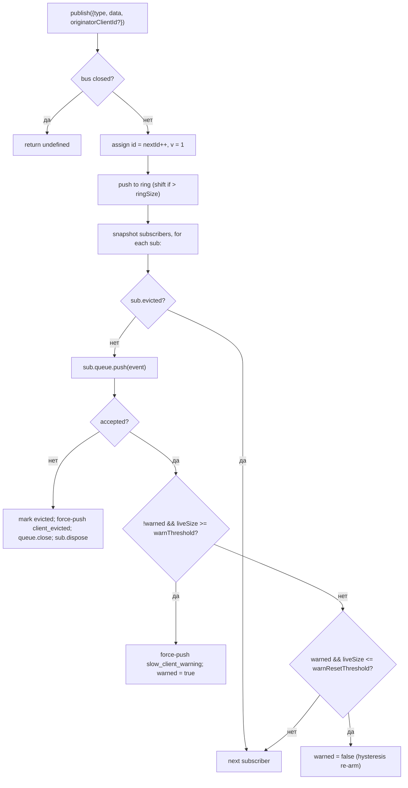

# SSE Event Bus & Backpressure

## Обзор

`EventBus` (`packages/acp-bridge/src/eventBus.ts`) — это внутрисессионный pub/sub в памяти, который питает SSE-маршрут демона `GET /session/:id/events`. Он присваивает каждому событию монотонный идентификатор, буферизирует последние события в ограниченном кольце для воспроизведения через `Last-Event-ID`, рассылает опубликованные события всем подписчикам, применяет per-subscriber backpressure (предупреждение при заполнении очереди на 75%, удаление при достижении лимита) и генерирует два синтетических терминальных фрейма (`client_evicted`, `slow_client_warning`), которые SDK обрабатывает как полноценные события, но шина помечает **без `id`**, чтобы они не занимали слот в последовательности сессии.

`EventBus` в настоящее время является package-private для `acp-bridge` и используется фабрикой bridge через один замкнутый экземпляр на сессию. Будущий рефакторинг (отмечен в строках 150–159 файла `eventBus.ts`) поднимет его до строительного блока верхнего уровня, так что каналы, dual-output и будущие WebSocket-транспорты смогут подписываться через ту же шину вместо запуска параллельных потоков.

## Обязанности

- Присваивать монотонные идентификаторы событий в рамках сессии, начиная с 1.
- Буферизировать последние `ringSize` событий для воспроизведения при подписке с `lastEventId`.
- Рассылать опубликованные события не более чем `maxSubscribers` одновременным подписчикам.
- Применять ограниченные очереди на подписчика; отключать переполняющихся подписчиков синтетическим терминальным фреймом `client_evicted`.
- Генерировать `slow_client_warning` один раз за эпизод переполнения при заполнении очереди на 75%, с гистерезисом 37,5% для предотвращения повторных предупреждений.
- Немедленно завершать подписки при `AbortSignal.abort()`.
- Корректно закрывать всех подписчиков при закрытии шины (например, при завершении сессии).
- Никогда не выбрасывать исключения из `publish` (контракт: «publish всегда безопасно вызывать»).

## Архитектура

| Константа                             | Значение     | Назначение                                                                                         |
| ------------------------------------- | ------------ | -------------------------------------------------------------------------------------------------- |
| `EVENT_SCHEMA_VERSION`                | `1`          | Проставляется в каждом `BridgeEvent.v`; увеличивается при критических изменениях фреймов.          |
| `DEFAULT_RING_SIZE`                   | `8000`       | Кольцо воспроизведения на сессию. Переопределяется оператором через `--event-ring-size`.            |
| `DEFAULT_MAX_QUEUED`                  | `256`        | Максимальный размер очереди на подписчика.                                                          |
| `DEFAULT_MAX_SUBSCRIBERS`             | `64`         | Максимальное количество подписчиков на сессию.                                                      |
| `WARN_THRESHOLD_RATIO`                | `0.75`       | Доля от `maxQueued`, при которой срабатывает `slow_client_warning`.                                 |
| `WARN_RESET_RATIO`                    | `0.375`      | Доля для повторной активации гистерезиса.                                                           |
| `MAX_EVENT_RING_SIZE` (в `bridge.ts`) | `1_000_000`  | Мягкая верхняя граница для `BridgeOptions.eventRingSize`, чтобы предотвратить ошибки нехватки памяти из-за опечаток. |

### `BridgeEvent`

```ts
interface BridgeEvent {
  id?: number; // монотонный в рамках сессии; отсутствует на синтетических терминальных фреймах
  v: 1; // EVENT_SCHEMA_VERSION
  type: string; // один из 43 известных типов или расширяемый в будущем
  data: unknown; // полезная нагрузка (типизирована по типу в SDK; см. 09-event-schema.md)
  originatorClientId?: string; // устанавливается, когда событие происходит из запроса, помеченного clientId
}
```

### `SubscribeOptions`

```ts
interface SubscribeOptions {
  lastEventId?: number; // воспроизведение с после этого id (Last-Event-ID resume)
  signal?: AbortSignal; // немедленно отменяет подписку
  maxQueued?: number; // максимальный размер очереди на подписчика; по умолчанию 256
}
```

`subscribe()` возвращает `AsyncIterable<BridgeEvent>`. SSE-маршрут потребляет его через `for await`. Регистрация **синхронна** — к моменту возврата `subscribe()` подписчик уже подключён, поэтому `publish()`, выполняющийся одновременно с первым `next()` потребителя, всё равно будет доставлен.

### `BoundedAsyncQueue`

Очередь на подписчика. Два ключевых поведения:

- **Живой лимит применяется только к живым элементам.** Элементы, вставленные через `forcePush()`, имеют тег `forced: true` и никогда не учитываются в `maxSize`. Это позволяет пути воспроизведения `Last-Event-ID` принудительно помещать сотни исторических фреймов в нового подписчика, не вызывая немедленного превышения лимита и удаления только что возобновлённого подписчика.
- **`liveCount` поддерживается как поле**, а не выводится из позиции `forcedInBuf`. Более ранняя эвристика, основанная на позиции, сломалась, когда `slow_client_warning` начал принудительно вставляться в середину потока (предупреждения помещаются в КОНЕЦ очереди, а не в начало, как воспроизводимые). Теги `forced` на запись не зависят от позиции.

`push(value)` возвращает `false` (вместо блокировки или исключения), когда живой буфер достиг лимита — шина использует этот сигнал для удаления подписчика. `forcePush(value)` игнорирует лимит. `close({drain?: boolean})` по умолчанию сливает ожидающие элементы; путь прерывания передаёт `drain: false`, чтобы немедленно их отбросить.

## Рабочий процесс

### Публикация



`publish` никогда не выбрасывает исключения. Закрытие шины во время публикации (путь завершения закрывает шины сессий до ожидания `channel.kill()`) возвращает `undefined`, а не выбрасывает исключение, потому что агент всё ещё может отправлять уведомления `sessionUpdate` в небольшом окне между закрытием шины и уничтожением канала.

### Подписка + воспроизведение (с обнаружением вытеснения из кольца)

```mermaid
sequenceDiagram
    autonumber
    participant SR as SSE route
    participant EB as EventBus
    participant Q as BoundedAsyncQueue

    SR->>EB: subscribe({lastEventId: 42, maxQueued: 256, signal})
    EB->>EB: refuse if subs.size >= maxSubscribers<br/>(throws SubscriberLimitExceededError)
    EB->>Q: new BoundedAsyncQueue(256)
    EB->>EB: subs.add(sub)
    EB->>EB: epochReset = lastEventId >= nextId
    alt epochReset (старая эпоха шины)
        EB->>Q: forcePush state_resync_required<br/>{ reason: 'epoch_reset', lastDeliveredId: 42, earliestAvailableId: ring[0]?.id ?? nextId }
        Note over EB,Q: id-less synthetic, frame goes BEFORE replay.<br/>Replay scans the whole current ring.
    else та же эпоха шины
        EB->>EB: earliestInRing = ring[0]?.id
        opt earliestInRing > lastEventId + 1 (вытеснение с пробелом)
            EB->>Q: forcePush state_resync_required<br/>{ reason: 'ring_evicted', lastDeliveredId: 42, earliestAvailableId: earliestInRing }
            Note over EB,Q: id-less synthetic, frame goes BEFORE replay.<br/>Stream stays open; SDK reducer flips awaitingResync.
        end
    end
    loop сканирование кольца
        EB->>EB: for e in ring where e.id > (epochReset ? 0 : 42)
        EB->>Q: forcePush(e)
    end
    EB->>EB: attach AbortSignal listener<br/>(onAbort → queue.close({drain:false}); dispose)
    EB-->>SR: AsyncIterable
    SR->>Q: next() in for-await loop
```

Если при подписке `subs.size >= maxSubscribers`, выбрасывается `SubscriberLimitExceededError` — SSE-маршрут перехватывает его и сериализует синтетический фрейм `stream_error` для отклонённого клиента, чтобы он не видел молчаливый пустой поток. Возврат пустого итерируемого объекта вместо этого оставил бы операторов без информации о том, что «некоторые клиенты получают события, некоторые нет» под нагрузкой.

### Вытеснение из кольца → `state_resync_required` (процесс восстановления)

Когда потребитель переподключается с `Last-Event-ID: N`, а самое раннее сохранившееся событие в кольце имеет `id > N + 1`, события из `[N+1, earliestInRing-1]` были вытеснены до переподключения потребителя. Наивное воспроизведение молчаливо бы вернуло не непрерывный суффикс, SDK-редьюсер продолжал бы применять дельты, как если бы поток был непрерывным, и его состояние разошлось бы с истиной демона — без терминального сигнала.

Реализовано в `EventBus.subscribe()`:

1. Сначала проверяется `opts.lastEventId >= this.nextId`. Если истинно, курсор клиента относится к старой эпохе шины (перезапуск демона / пересоздание EventBus), поэтому шина генерирует `reason: 'epoch_reset'` и воспроизводит всё текущее кольцо.
2. Иначе вычисляется `earliestInRing = this.ring[0]?.id`.
3. Если `earliestInRing > opts.lastEventId + 1`, то перед кадрами воспроизведения принудительно помещается синтетический фрейм:
   ```jsonc
   {
     "v": 1,
     "type": "state_resync_required",
     "data": {
       "reason": "ring_evicted",
       "lastDeliveredId": <opts.lastEventId>,
       "earliestAvailableId": <earliestInRing>
     }
   }
   ```
4. После этого продолжается обычный цикл воспроизведения.

Критические контракты (и что исправил обзор #4360):

- **Без `id`** — тот же шаблон «без слота», что и у `client_evicted`, поэтому он не занимает слот в монотонной последовательности сессии, которую видят другие подписчики.
- **Поток остаётся открытым** — в отличие от `client_evicted` (действительно терминальный), `state_resync_required` ориентирован на восстановление. После него продолжают поступать воспроизведённые и живые фреймы.
- **Редьюсер автоматически пропускает дельты** — сторона SDK устанавливает `awaitingResync = true` и применяет только `state_resync_required`, терминальные фреймы и полные снимки состояния, пока код потребителя не вызовет `loadSession` и не сбросит флаг. См. [`09-event-schema.md`](./09-event-schema.md) для `RESYNC_PASSTHROUGH_TYPES`.
- **Дружественно к сети** — фреймы остаются в проводе, чтобы SDK мог вычислить разницу «что вы пропустили» позже, если захочет. Дополнительного цикла переподключения не требуется.

### Процесс терминального удаления

Когда живой буфер подписчика достиг `maxQueued` и следующий `push()` возвращает `false`:

1. Устанавливается `sub.evicted = true`.
2. Создаётся фрейм `client_evicted` **без `id`** — `{ v: 1, type: 'client_evicted', data: { reason: 'queue_overflow', droppedAfter: <последний доставленный id> } }`.
3. `queue.forcePush(evictionFrame)` — чтобы итератор потребителя увидел один терминальный фрейм.
4. `queue.close()` — чтобы итерация завершилась после терминального фрейма.
5. Вызов `sub.dispose()` — удаляет из `subs` и отключает обработчик `AbortSignal`; без этой очистки замыкания застрявших потребителей остаются в памяти до сборки мусора `AbortSignal`.

### Процесс прерывания

`AbortSignal.abort()` → `onAbort()`:

1. `queue.close({drain: false})` — отбрасывает буферизованные элементы, чтобы SSE-маршрут не продолжал сериализовать события в сокет, который никто не слушает.
2. `dispose()` — идемпотентен благодаря флагу `disposed`.

Уже прерванные сигналы во время подписки вызывают `onAbort()` синхронно перед возвратом итератора.

## Состояние и жизненный цикл

- `nextId` начинается с 1 и только увеличивается. Геттер `lastEventId` возвращает `nextId - 1`.
- `ring` ограничен; вытеснение со сдвигом — O(n) после заполнения. При `ringSize=8000` это занимает единицы миллисекунд в высоконагруженных сессиях — значительно ниже бюджета задержки на фрейм. Рефакторинг на кольцевой буфер отложен до тех пор, пока профилирование не укажет на проблему или операторы не увеличат `--event-ring-size` на порядок.
- `close()` устанавливает `closed`, закрывает очередь каждого подписчика и очищает `subs`. Последующие вызовы `publish()` / `subscribe()` ничего не делают (`publish` возвращает undefined; `subscribe` возвращает `emptyAsyncIterable`).
- Каждая сессия владеет одним `EventBus`. Закрытие шины происходит до `channel.kill()`, чтобы выполняющиеся во время завершения публикации не выбрасывали исключения, а возвращали undefined.

## Зависимости

- Потребляется в `packages/acp-bridge/src/bridge.ts` (`BridgeClient.sessionUpdate` / `BridgeClient.extNotification` → `events.publish(...)`).
- Потребляется в `packages/cli/src/serve/server.ts` (обработчик SSE-маршрута → `events.subscribe(...)`, затем форматирует `BridgeEvent` в SSE-фреймы).
- Прокси-реэкспорт: `packages/cli/src/serve/event-bus.ts` → `@qwen-code/acp-bridge/eventBus`.
- Потребитель SDK: `packages/sdk-typescript/src/daemon/sse.ts` (`parseSseStream`), затем `asKnownDaemonEvent` (см. [`09-event-schema.md`](./09-event-schema.md), [`13-sdk-daemon-client.md`](./13-sdk-daemon-client.md)).

## Конфигурация

- `--event-ring-size <n>` — глубина кольца на сессию; мягкий лимит `MAX_EVENT_RING_SIZE = 1_000_000`.
- Параметр запроса подписчика `?maxQueued=N` на `GET /session/:id/events`, диапазон `[16, 2048]`. Клиенты SDK проверяют `caps.features.slow_client_warning` перед включением.
- `BridgeOptions.eventRingSize` (переопределяет значение по умолчанию демона для встраиваемого использования).
- Теги возможностей: `session_events`, `slow_client_warning`, `typed_event_schema`.

## Предостережения и известные ограничения

- **Синтетические фреймы не имеют `id`.** Потребители SDK, использующие возобновление через `Last-Event-ID`, записывают только фреймы с id; `slow_client_warning`, `client_evicted`, `state_resync_required` и `replay_complete` не продвигают курсор и не занимают порядковые номера сессии. Если между двумя живыми фреймами с id есть реальный пробел, обрабатывайте его через путь ресинхронизации вытеснения из кольца / сброса эпохи, а не как частный синтетический фрейм.
- `client_evicted` действует **на подписчика**, а не на сессию. Тот же клиент может переподключиться.
- Итератор `BoundedAsyncQueue` **небезопасен для параллельных драйверов** — два одновременных вызова `.next()` будут конкурировать за одно и то же событие. Использование в демоне последовательное (`for await ... of` в обработчике SSE-маршрута), поэтому в продакшене это безопасно.
- Шина в настоящее время package-private; каналы и веб-интерфейс должны подписываться через HTTP SSE-маршрут демона, а не через прямое обращение к шине. Этап 1.5 поднимет это.

## Ссылки

- `packages/acp-bridge/src/eventBus.ts` (весь файл)
- `packages/acp-bridge/src/bridge.ts` (места публикации, особенно `BridgeClient.sessionUpdate` и события разрешений F3)
- `packages/cli/src/serve/server.ts` (обработчик SSE-маршрута — форматирует `BridgeEvent` в проводе SSE)
- `packages/sdk-typescript/src/daemon/sse.ts` (парсер SSE на клиентской стороне)
- Ссылка на провод: [`../qwen-serve-protocol.md`](../qwen-serve-protocol.md) (контракт переподключения через `Last-Event-ID`).