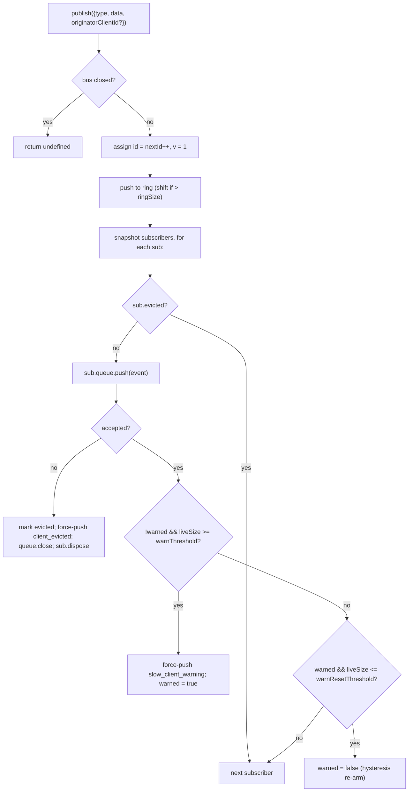

# SSE шина событий и противодавление

## Обзор

`EventBus` (`packages/acp-bridge/src/eventBus.ts`) — это внутрисессионная pub/sub шина в памяти, которая питает SSE-маршрут `GET /session/:id/events` демона. Она присваивает каждому событию монотонный идентификатор, буферизирует последние события в ограниченном кольцевом буфере для воспроизведения через `Last-Event-ID`, рассылает опубликованные события всем подписчикам, применяет к каждому подписчику противодавление (предупреждение при заполнении очереди на 75%, вытеснение при достижении предела) и генерирует два синтетических терминальных кадра (`client_evicted`, `slow_client_warning`), которые SDK обрабатывает как события первого класса, но шина помечает **без `id`**, чтобы они не занимали слот в последовательности сессии.

`EventBus` в настоящее время является приватным для пакета `acp-bridge` и используется фабрикой моста через один замыкающий экземпляр на сессию. Будущий рефакторинг (указанный в строках 150–159 файла `eventBus.ts`) сделает его строительным блоком верхнего уровня, чтобы каналы, двойной вывод и будущие WebSocket-транспорты могли подписываться через ту же шину, а не через параллельные потоки.

## Обязанности

- Назначать монотонные идентификаторы событий для каждой сессии, начиная с 1.
- Буферизировать последние `ringSize` событий для воспроизведения при подписке с `lastEventId`.
- Рассылвать опубликованные события не более чем `maxSubscribers` одновременным подписчикам.
- Применять ограниченные очереди для каждого подписчика; отбрасывать переполнившихся подписчиков с синтетическим терминальным кадром `client_evicted`.
- Генерировать `slow_client_warning` один раз за эпизод переполнения при заполнении очереди на 75%, с гистерезисом 37,5% для предотвращения повторных предупреждений.
- Немедленно отзывать подписки при `AbortSignal.abort()`.
- Аккуратно закрывать каждого подписчика при закрытии шины (например, при завершении сессии).
- Никогда не выбрасывать исключения из `publish` (контракт — 'вызов publish всегда безопасен').

## Архитектура

| Константа                               | Значение       | Назначение                                                                                            |
| --------------------------------------- | -------------- | ----------------------------------------------------------------------------------------------------- |
| `EVENT_SCHEMA_VERSION`                  | `1`            | Проставляется в каждом `BridgeEvent.v`; увеличивается при изменениях, нарушающих совместимость.       |
| `DEFAULT_RING_SIZE`                     | `8000`         | Кольцевой буфер воспроизведения для каждой сессии. Оператор может переопределить через `--event-ring-size`. |
| `DEFAULT_MAX_QUEUED`                    | `256`          | Максимальный размер очереди для каждого подписчика.                                                    |
| `DEFAULT_MAX_SUBSCRIBERS`               | `64`           | Максимальное количество подписчиков на сессию.                                                         |
| `WARN_THRESHOLD_RATIO`                  | `0.75`         | Доля `maxQueued`, при которой срабатывает `slow_client_warning`.                                      |
| `WARN_RESET_RATIO`                      | `0.375`        | Доля для повторного взведения гистерезиса.                                                            |
| `MAX_EVENT_RING_SIZE` (в `bridge.ts`)   | `1_000_000`    | Мягкая верхняя граница для `BridgeOptions.eventRingSize`, чтобы выявить ошибки с памятью, вызванные опечатками. |

### `BridgeEvent`

```ts
interface BridgeEvent {
  id?: number; // monotonic per session; absent on synthetic terminal frames
  v: 1; // EVENT_SCHEMA_VERSION
  type: string; // one of the 43 known types or future-extensible
  data: unknown; // payload (typed per-type by the SDK; see 09-event-schema.md)
  originatorClientId?: string; // set when the event derives from a clientId-stamped request
}
```

### `SubscribeOptions`

```ts
interface SubscribeOptions {
  lastEventId?: number; // replay from after this id (Last-Event-ID resume)
  signal?: AbortSignal; // aborts the subscription promptly
  maxQueued?: number; // per-subscriber backlog cap; default 256
}
```

`subscribe()` возвращает `AsyncIterable<BridgeEvent>`. SSE-маршрут потребляет его через `for await`. Регистрация **синхронна** — к моменту возврата из `subscribe()` подписчик уже присоединен, поэтому `publish()`, вызываемый одновременно с первым `next()` потребителя, всё равно будет доставлен.

### `BoundedAsyncQueue`

Очередь для каждого подписчика. Два ключевых поведения:

- **Ограничение применяется только к активным элементам.** Элементы, вставленные через `forcePush()`, получают тег `forced: true` для каждой записи и никогда не учитываются в `maxSize`. Это позволяет пути воспроизведения `Last-Event-ID` принудительно вставить сотни исторических кадров в нового подписчика, не вызывая немедленного срабатывания ограничения и вытеснения только что возобновленного подписчика.

- **`liveCount` поддерживается как поле**, а не вычисляется из позиции `forcedInBuf`. Более ранняя эвристика, основанная на позиции, сломалась, когда `slow_client_warning` стал принудительно вставляться в середину потока (предупреждения помещаются в КОНЕЦ очереди, а не в начало, как воспроизводимые). Теги `forced` для каждой записи не зависят от позиции.

`push(value)` возвращает `false` (вместо блокировки или исключения), когда активный резерв достигает предела — шина использует этот сигнал для вытеснения подписчика. `forcePush(value)` обходит ограничение. `close({drain?: boolean})` по умолчанию сливает ожидающие элементы; при прерывании передается `drain: false`, чтобы немедленно отбросить их.
## Рабочий процесс

### Публикация



`publish` никогда не выбрасывает исключений. Закрытие шины в середине публикации (путь завершения закрывает шины для каждой сессии перед ожиданием `channel.kill()`) возвращает `undefined`, а не выбрасывает исключение, поскольку агент всё ещё может отправлять уведомления `sessionUpdate` в небольшом окне между закрытием шины и убийством канала.

### Подписка + воспроизведение (с обнаружением вытеснения из кольца)

```mermaid
sequenceDiagram
    autonumber
    participant SR as SSE route
    participant EB as EventBus
    participant Q as BoundedAsyncQueue

    SR->>EB: subscribe({lastEventId: 42, maxQueued: 256, signal})
    EB->>EB: refuse if subs.size >= maxSubscribers<br/>(throws SubscriberLimitExceededError)
    EB->>Q: new BoundedAsyncQueue(256)
    EB->>EB: subs.add(sub)
    EB->>EB: epochReset = lastEventId >= nextId
    alt epochReset (old bus epoch)
        EB->>Q: forcePush state_resync_required<br/>{ reason: 'epoch_reset', lastDeliveredId: 42, earliestAvailableId: ring[0]?.id ?? nextId }
        Note over EB,Q: id-less synthetic, frame goes BEFORE replay.<br/>Replay scans the whole current ring.
    else same bus epoch
        EB->>EB: earliestInRing = ring[0]?.id
        opt earliestInRing > lastEventId + 1 (gap evicted)
            EB->>Q: forcePush state_resync_required<br/>{ reason: 'ring_evicted', lastDeliveredId: 42, earliestAvailableId: earliestInRing }
            Note over EB,Q: id-less synthetic, frame goes BEFORE replay.<br/>Stream stays open; SDK reducer flips awaitingResync.
        end
    end
    loop ring scan
        EB->>EB: for e in ring where e.id > (epochReset ? 0 : 42)
        EB->>Q: forcePush(e)
    end
    EB->>EB: attach AbortSignal listener<br/>(onAbort → queue.close({drain:false}); dispose)
    EB-->>SR: AsyncIterable
    SR->>Q: next() in for-await loop
```

Если `subs.size >= maxSubscribers` на момент подписки, выбрасывается `SubscriberLimitExceededError` — маршрут SSE перехватывает его и сериализует синтетический фрейм `stream_error` для отклоненного клиента, чтобы он не видел пустой поток в тишине. Возвращение пустой итерации вместо этого оставило бы операторов без возможности увидеть, что «некоторые клиенты получают события, а некоторые нет» под нагрузкой.

### Вытеснение из кольца → `state_resync_required` (поток восстановления)

Когда потребитель переподключается с `Last-Event-ID: N`, а самое раннее сохраненное событие в кольце имеет `id > N + 1`, события в диапазоне `[N+1, earliestInRing-1]` были вытеснены до того, как потребитель переподключился. Наивное воспроизведение молча бы удалось с не непрерывным суффиксом, редуктор SDK продолжал бы применять дельты, как если бы поток был непрерывным, и его состояние разошлось бы с истиной демона — без терминального сигнала.

Реализовано в `EventBus.subscribe()`:

1. Сначала проверка `opts.lastEventId >= this.nextId`. Если истина, курсор клиента
   из более старой эпохи шины (перезапуск демона / реконструкция EventBus), поэтому
   шина генерирует `reason: 'epoch_reset'` и воспроизводит все текущее кольцо.
2. В противном случае вычисляется `earliestInRing = this.ring[0]?.id`.
3. Если `earliestInRing > opts.lastEventId + 1`, принудительно отправляется синтетический фрейм **перед** фреймами воспроизведения:
   ```jsonc
   {
     "v": 1,
     "type": "state_resync_required",
     "data": {
       "reason": "ring_evicted",
       "lastDeliveredId": <opts.lastEventId>,
       "earliestAvailableId": <earliestInRing>
     }
   }
   ```
4. После этого продолжается обычный цикл воспроизведения.

Критические контракты (и что было исправлено в ревью #4360):

- **Нет `id`** — тот же шаблон без слота, что и у `client_evicted`, поэтому он не занимает слот в монотонной последовательности для каждой сессии, которую видят другие подписчики.
- **Поток остается открытым** — в отличие от `client_evicted` (действительно терминального), `state_resync_required` ориентирован на восстановление. Воспроизведение и живые фреймы продолжают поступать после него.
- **Редуктор автоматически пропускает дельты** — сторона SDK переключает `awaitingResync = true` и применяет только `state_resync_required`, терминальные фреймы и снапшоты полного состояния, пока код потребителя не вызовет `loadSession` и не сбросит флаг. См. [`09-event-schema.md`](./09-event-schema.md) для `RESYNC_PASSTHROUGH_TYPES`.
- **Дружелюбно к сети** — фреймы остаются на проводе, чтобы SDK мог вычислить «что вы пропустили» позже, если захочет. Дополнительный цикл переподключения не требуется.
### Терминальный поток вытеснения

Когда живой бэклог подписчика достиг `maxQueued`, и следующий вызов `push()` возвращает `false`:

1. Установить `sub.evicted = true`.
2. Создать фрейм `client_evicted` **без `id`** — `{ v: 1, type: 'client_evicted', data: { reason: 'queue_overflow', droppedAfter: <last delivered id> } }`.
3. `queue.forcePush(evictionFrame)` чтобы итератор потребителя увидел один терминальный фрейм.
4. `queue.close()` чтобы итерация завершилась после терминального фрейма.
5. Вызвать `sub.dispose()` — удаляет из `subs` и отключает слушатель `AbortSignal`; без этой очистки замыкания зависших потребителей остаются живыми до сборки мусора `AbortSignal`.

### Поток прерывания

`AbortSignal.abort()` → `onAbort()`:

1. `queue.close({drain: false})` — отбросить буферизированные элементы, чтобы SSE-маршрут не продолжал сериализовать события в сокет, который никто не слушает.
2. `dispose()` — идемпотентен благодаря флагу `disposed`.

Уже прерванные сигналы во время подписки вызывают `onAbort()` синхронно перед возвратом итератора.

## Состояние и жизненный цикл

- `nextId` начинается с 1 и только увеличивается. Геттер `lastEventId` возвращает `nextId - 1`.
- `ring` ограничен; вытеснение через сдвиг — O(n) после заполнения. При `ringSize=8000` это занимает несколько миллисекунд на сессиях с высокой нагрузкой — значительно ниже бюджета задержки на фрейм. Рефакторинг на кольцевой буфер отложен до тех пор, пока профилирование не укажет на это, или операторы не увеличат `--event-ring-size` на порядок.
- `close()` переключает `closed`, закрывает очередь каждого подписчика и очищает `subs`. Последующие вызовы `publish()` / `subscribe()` являются no-ops (`publish` возвращает undefined; `subscribe` возвращает `emptyAsyncIterable`).
- Каждая сессия владеет одним `EventBus`. Закрытие шины происходит до `channel.kill()`, чтобы выполняющиеся в процессе завершения публикации возвращали undefined, а не выбрасывали исключение.

## Зависимости

- Потребляется в `packages/acp-bridge/src/bridge.ts` (`BridgeClient.sessionUpdate` / `BridgeClient.extNotification` → `events.publish(...)`).
- Потребляется в `packages/cli/src/serve/server.ts` (обработчик SSE-маршрута → `events.subscribe(...)` затем форматирует `BridgeEvent` в проволочные фреймы SSE).
- Повторно экспортируемый шим: `packages/cli/src/serve/event-bus.ts` → `@qwen-code/acp-bridge/eventBus`.
- Потребитель SDK: `packages/sdk-typescript/src/daemon/sse.ts` (`parseSseStream`), затем `asKnownDaemonEvent` (см. [`09-event-schema.md`](./09-event-schema.md), [`13-sdk-daemon-client.md`](./13-sdk-daemon-client.md)).

## Конфигурация

- `--event-ring-size <n>` — глубина кольца на сессию; мягкое ограничение `MAX_EVENT_RING_SIZE = 1_000_000`.
- Параметр запроса подписчика `?maxQueued=N` на `GET /session/:id/events`, диапазон `[16, 2048]`. Клиенты SDK предварительно проверяют `caps.features.slow_client_warning` перед включением.
- `BridgeOptions.eventRingSize` (переопределяет значение по умолчанию демона для встроенного использования).
- Теги возможностей: `session_events`, `slow_client_warning`, `typed_event_schema`.

## Оговорки и известные ограничения

- **Синтетические фреймы не имеют `id`.** Потребители SDK, использующие `Last-Event-ID` для возобновления, записывают только фреймы с id; `slow_client_warning`, `client_evicted`, `state_resync_required` и `replay_complete` не перемещают курсор и не потребляют порядковые номера сессии. Если между двумя живыми фреймами с id есть реальный разрыв, обрабатывайте его через путь повторной синхронизации при вытеснении из кольца/сбросе эпохи, а не рассматривайте как частный синтетический фрейм.
- `client_evicted` действует **для каждого подписчика**, а не для сессии. Тот же клиент может переподключиться.
- Итератор `BoundedAsyncQueue` **небезопасен для параллельных потребителей** — два одновременных вызова `.next()` будут конкурировать за одно событие. Использование в демоне последовательно (`for await ... of` в обработчике SSE-маршрута), поэтому в production это безопасно.
- В настоящее время шина является package-private; каналы и веб-интерфейс должны подписываться через HTTP SSE-маршрут демона, а не напрямую обращаться к шине. Этап 1.5 снимет это ограничение.

## Ссылки

- `packages/acp-bridge/src/eventBus.ts` (весь файл)
- `packages/acp-bridge/src/bridge.ts` (места публикации, особенно `BridgeClient.sessionUpdate` и события разрешений F3)
- `packages/cli/src/serve/server.ts` (обработчик SSE-маршрута — форматирует `BridgeEvent` в проволочный SSE)
- `packages/sdk-typescript/src/daemon/sse.ts` (парсер проволочного SSE на стороне клиента)
- Проволочный протокол: [`../qwen-serve-protocol.md`](../qwen-serve-protocol.md) (контракт переподключения `Last-Event-ID`).
