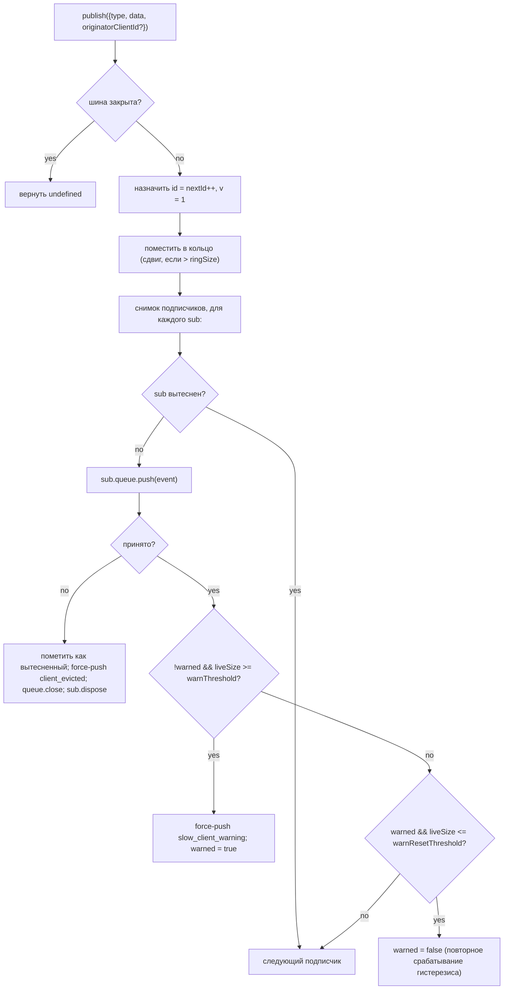

# SSE Event Bus и backpressure

## Обзор

`EventBus` (`packages/acp-bridge/src/eventBus.ts`) — это внутрипамятный pub/sub для каждой сессии, который питает SSE-маршрут демона `GET /session/:id/events`. Он присваивает каждому событию монотонный id, буферизует недавние события в ограниченном кольцевом буфере для воспроизведения по `Last-Event-ID`, рассылает опубликованные события всем подписчикам, применяет backpressure для каждого подписчика (предупреждение при заполнении очереди на 75%, вытеснение при достижении лимита) и генерирует два синтетических терминальных фрейма (`client_evicted`, `slow_client_warning`), которые SDK обрабатывает как первоклассные события, но шина помечает их **без `id`**, чтобы они не занимали слот в монотонной последовательности сессии.

В настоящее время `EventBus` является package-private для `acp-bridge` и используется фабрикой мостов через один замкнутый экземпляр на сессию. Будущий рефакторинг (указанный в строках 150–159 файла `eventBus.ts`) вынесет его на верхний уровень, чтобы каналы, dual-output и будущие WebSocket-транспорты могли подписываться через ту же шину вместо запуска параллельных потоков.

## Обязанности

- Присваивать монотонные id событий для каждой сессии, начиная с 1.
- Буферизовать последние `ringSize` событий для воспроизведения при подписке с `lastEventId`.
- Рассылать опубликованные события не более чем `maxSubscribers` одновременным подписчикам.
- Применять ограниченные очереди для каждого подписчика; отключать переполненных подписчиков с помощью синтетического терминального фрейма `client_evicted`.
- Выдавать `slow_client_warning` один раз за эпизод переполнения при достижении 75% заполнения очереди, с гистерезисом 37,5% для предотвращения повторных предупреждений.
- Оперативно разрывать подписки при `AbortSignal.abort()`.
- Корректно закрывать каждого подписчика при закрытии шины (например, при завершении сессии).
- Никогда не выбрасывать исключения из `publish` (контракт гласит: "вызов publish всегда безопасен").

## Архитектура

| Константа                              | Значение    | Назначение                                                                                         |
| -------------------------------------- | ----------- | -------------------------------------------------------------------------------------------------- |
| `EVENT_SCHEMA_VERSION`                 | `1`         | Проставляется в каждом `BridgeEvent.v`; увеличивается при критических изменениях фреймов.          |
| `DEFAULT_RING_SIZE`                    | `8000`      | Кольцевой буфер воспроизведения для сессии. Переопределяется оператором через `--event-ring-size`. |
| `DEFAULT_MAX_QUEUED`                   | `256`       | Лимит очереди для каждого подписчика.                                                              |
| `DEFAULT_MAX_SUBSCRIBERS`              | `64`        | Лимит подписчиков для сессии.                                                                      |
| `WARN_THRESHOLD_RATIO`                 | `0.75`      | Доля `maxQueued`, при которой срабатывает `slow_client_warning`.                                   |
| `WARN_RESET_RATIO`                     | `0.375`     | Доля для повторного срабатывания гистерезиса.                                                      |
| `MAX_EVENT_RING_SIZE` (в `bridge.ts`)  | `1_000_000` | Мягкий верхний лимит для `BridgeOptions.eventRingSize` для предотвращения сбоев out-of-memory из-за опечаток. |

### `BridgeEvent`

```ts
interface BridgeEvent {
  id?: number; // монотонный для сессии; отсутствует в синтетических терминальных фреймах
  v: 1; // EVENT_SCHEMA_VERSION
  type: string; // один из 47 известных типов или расширяемый в будущем
  data: unknown; // полезные данные (типизируются SDK для каждого типа; см. 09-event-schema.md)
  _meta?: { serverTimestamp?: number; [key: string]: unknown }; // проставляется EventBus.publish
  originatorClientId?: string; // устанавливается, если событие происходит из запроса с clientId
}
```

### `SubscribeOptions`

```ts
interface SubscribeOptions {
  lastEventId?: number; // воспроизведение начиная с этого id (возобновление по Last-Event-ID)
  signal?: AbortSignal; // оперативно прерывает подписку
  maxQueued?: number; // лимит очереди для подписчика; по умолчанию 256
}
```

`subscribe()` возвращает `AsyncIterable<BridgeEvent>`. SSE-маршрут потребляет его с помощью `for await`. Регистрация происходит **синхронно** — к моменту возврата из `subscribe()` подписчик уже подключен, поэтому `publish()`, который выполняется параллельно с первым `next()` потребителя, всё равно будет доставлен.

### `BoundedAsyncQueue`

Очередь для каждого подписчика. Два ключевых поведения:

- **Лимит применяется только к "живым" элементам.** Элементы, вставленные через `forcePush()`, имеют тег `forced: true` для каждой записи и никогда не учитываются в `maxSize`. Это позволяет пути воспроизведения `Last-Event-ID` принудительно отправлять сотни исторических фреймов новому подписчику, не превышая мгновенно лимит "живых" элементов и не отключая только что возобновленного подписчика.
- **`liveCount` поддерживается как поле**, а не выводится из позиции `forcedInBuf`. Более ранняя эвристика на основе позиций сломалась, когда `slow_client_warning` начал принудительно отправлять данные в середине потока (предупреждения идут в КОНЕЦ очереди, а не в начало, как при воспроизведении). Теги `forced` для каждой записи не зависят от позиции.

`push(value)` возвращает `false` (вместо блокировки или выброса исключения), когда "живая" очередь достигла лимита — шина использует этот сигнал для отключения подписчика. `forcePush(value)` обходит лимит. `close({drain?: boolean})` по умолчанию выгружает ожидающие элементы; при прерывании передается `drain: false`, чтобы немедленно их отбросить.

## Рабочий процесс

### Публикация



`publish` никогда не выбрасывает исключения. Закрытие шины во время `publish` (путь завершения работы закрывает шины сессии до ожидания `channel.kill()`) возвращает `undefined`, а не выбрасывает исключение, поскольку агент может продолжать генерировать уведомления `sessionUpdate` в небольшом окне между закрытием шины и уничтожением канала.

### Подписка и воспроизведение (с обнаружением вытеснения из кольца)

```mermaid
sequenceDiagram
    autonumber
    participant SR as SSE-маршрут
    participant EB as EventBus
    participant Q as BoundedAsyncQueue

    SR->>EB: subscribe({lastEventId: 42, maxQueued: 256, signal})
    EB->>EB: отклонить, если subs.size >= maxSubscribers<br/>(выбрасывает SubscriberLimitExceededError)
    EB->>Q: new BoundedAsyncQueue(256)
    EB->>EB: subs.add(sub)
    EB->>EB: epochReset = lastEventId >= nextId
    alt epochReset (старая эпоха шины)
        EB->>Q: forcePush state_resync_required<br/>{ reason: 'epoch_reset', lastDeliveredId: 42, earliestAvailableId: ring[0]?.id ?? nextId }
        Note over EB,Q: синтетический без id, фрейм идет ДО воспроизведения.<br/>Воспроизведение сканирует всё текущее кольцо.
    else та же эпоха шины
        EB->>EB: earliestInRing = ring[0]?.id
        opt earliestInRing > lastEventId + 1 (пробел из-за вытеснения)
            EB->>Q: forcePush state_resync_required<br/>{ reason: 'ring_evicted', lastDeliveredId: 42, earliestAvailableId: earliestInRing }
            Note over EB,Q: синтетический без id, фрейм идет ДО воспроизведения.<br/>Поток остается открытым; SDK reducer переключает awaitingResync.
        end
    end
    loop сканирование кольца
        EB->>EB: for e in ring where e.id > (epochReset ? 0 : 42)
        EB->>Q: forcePush(e)
    end
    EB->>EB: подключить слушатель AbortSignal<br/>(onAbort → queue.close({drain:false}); dispose)
    EB-->>SR: AsyncIterable
    SR->>Q: next() в цикле for-await
```

Если во время подписки `subs.size >= maxSubscribers`, выбрасывается `SubscriberLimitExceededError` — SSE-маршрут перехватывает его и сериализует синтетический фрейм `stream_error` для отклоненного клиента, чтобы тот не видел молчаливый пустой поток. Возврат пустого итерируемого объекта лишил бы операторов видимости ситуации "некоторые клиенты получают события, а некоторые нет" под нагрузкой.

### Вытеснение из кольца → `state_resync_required` (процесс восстановления)

Когда потребитель переподключается с `Last-Event-ID: N`, а самое раннее сохранившееся событие в кольце имеет `id > N + 1`, события в диапазоне `[N+1, earliestInRing-1]` были вытеснены до переподключения потребителя. Наивное воспроизведение успешно завершилось бы с несмежным суффиксом, SDK reducer продолжил бы применять дельты, как если бы поток был смежным, и его состояние разошлось бы с истиной демона — без терминального сигнала.

Реализовано в `EventBus.subscribe()`:

1. Сначала проверяется `opts.lastEventId >= this.nextId`. Если true, курсор клиента относится к более старой эпохе шины (перезапуск демона / реконструкция EventBus), поэтому шина выдает `reason: 'epoch_reset'` и воспроизводит всё текущее кольцо.
2. Иначе вычисляется `earliestInRing = this.ring[0]?.id`.
3. Если `earliestInRing > opts.lastEventId + 1`, принудительно отправляется синтетический фрейм **до** фреймов воспроизведения:
   ```jsonc
   {
     "v": 1,
     "type": "state_resync_required",
     "data": {
       "reason": "ring_evicted",
       "lastDeliveredId": <opts.lastEventId>,
       "earliestAvailableId": <earliestInRing>
     }
   }
   ```
4. После этого продолжается обычный цикл воспроизведения.

Критические контракты (и что исправил ревью #4360):

- **Нет `id`** — тот же паттерн без слота, что и у `client_evicted`, поэтому он не занимает слот в монотонной последовательности сессии, которую наблюдают другие подписчики.
- **Поток остается открытым** — в отличие от `client_evicted` (действительно терминального), `state_resync_required` ориентирован на восстановление. Воспроизведение и "живые" фреймы продолжают поступать после него.
- **Reducer автоматически пропускает дельты** — на стороне SDK переключается `awaitingResync = true` и применяются только `state_resync_required`, терминальные фреймы и снимки полного состояния, пока код потребителя не вызовет `loadSession` и не сбросит флаг. См. [`09-event-schema.md`](./09-event-schema.md) для `RESYNC_PASSTHROUGH_TYPES`.
- **Экономия трафика** — фреймы остаются в канале, чтобы SDK мог позже вычислить дифф "что вы пропустили", если захочет. Дополнительный цикл переподключения не требуется.

### Терминальный поток вытеснения

Когда "живая" очередь подписчика достигла `maxQueued` и следующий `push()` возвращает `false`:

1. Пометить `sub.evicted = true`.
2. Сконструировать фрейм `client_evicted` **без `id`** — `{ v: 1, type: 'client_evicted', data: { reason: 'queue_overflow', droppedAfter: <last delivered id> } }`.
3. `queue.forcePush(evictionFrame)`, чтобы итератор потребителя увидел один терминальный фрейм.
4. `queue.close()`, чтобы итерация завершилась после терминального фрейма.
5. Вызвать `sub.dispose()` — удаляет из `subs` и отсоединяет слушатель `AbortSignal`; без этой очистки замыкания зависших потребителей остаются активными до сборки мусора `AbortSignal`.

### Поток прерывания

`AbortSignal.abort()` → `onAbort()`:

1. `queue.close({drain: false})` — отбрасывает буферизованные элементы, чтобы SSE-маршрут не продолжал сериализовать события в сокет, который никто не слушает.
2. `dispose()` — идемпотентно через флаг `disposed`.

Уже прерванные сигналы во время подписки вызывают `onAbort()` синхронно перед возвратом итератора.

## Состояние и жизненный цикл

- `nextId` начинается с 1 и только увеличивается. Геттер `lastEventId` возвращает `nextId - 1`.
- `ring` ограничен; вытеснение сдвигом имеет сложность O(n) после заполнения. При `ringSize=8000` это измеряется миллисекундами для сессий с высокой нагрузкой — значительно ниже бюджета задержки на фрейм. Рефакторинг с кольцевым буфером отложен до тех пор, пока профилирование не укажет на это или операторы не увеличат `--event-ring-size` на порядок.
- `close()` переключает `closed`, закрывает очередь каждого подписчика и очищает `subs`. Последующие `publish()` / `subscribe()` являются no-op (`publish` возвращает undefined; `subscribe` возвращает `emptyAsyncIterable`).
- Каждая сессия владеет одним `EventBus`. Закрытие шины происходит до `channel.kill()`, поэтому незавершенные `publish` во время завершения работы возвращают undefined, а не выбрасывают исключения.

## Зависимости

- Используется в `packages/acp-bridge/src/bridge.ts` (`BridgeClient.sessionUpdate` / `BridgeClient.extNotification` → `events.publish(...)`).
- Используется в `packages/cli/src/serve/routes/sse-events.ts` (обработчик SSE-маршрута → `events.subscribe(...)`, затем форматирует `BridgeEvent` в SSE-фреймы для передачи по сети).
- CLI-потребители импортируют шину событий напрямую из `@qwen-code/acp-bridge/eventBus`.
- SDK-потребитель: `packages/sdk-typescript/src/daemon/sse.ts` (`parseSseStream`), затем `asKnownDaemonEvent` (см. [`09-event-schema.md`](./09-event-schema.md), [`13-sdk-daemon-client.md`](./13-sdk-daemon-client.md)).

## Конфигурация

- `--event-ring-size <n>` — глубина кольца для сессии; мягкий лимит `MAX_EVENT_RING_SIZE = 1_000_000`.
- Query-параметр подписчика `?maxQueued=N` в `GET /session/:id/events`, диапазон `[16, 2048]`. SDK-клиенты предварительно проверяют `caps.features.slow_client_warning` перед включением.
- `BridgeOptions.eventRingSize` (переопределяет значение демона по умолчанию для встроенного использования).
- Теги возможностей: `session_events`, `slow_client_warning`, `typed_event_schema`.

## Интеграция с клиентом: переподключение по `Last-Event-ID`

### Формат передачи данных

Каждый SSE-фрейм с id, выдаваемый `GET /session/:id/events`, включает строку `id:`:

```
id: 42
event: session_update
data: {"id":42,"v":1,"type":"session_update","data":{...},"_meta":{"serverTimestamp":1719000000000}}

```

Синтетические/терминальные фреймы (`state_resync_required`, `replay_complete`, `client_evicted`, `slow_client_warning`, `stream_error`) выдаются **без** строки `id:` — они не продвигают монотонную последовательность сессии.

### Протокол переподключения

Когда клиент переподключается после разрыва соединения, он отправляет последний успешно полученный id события в HTTP-заголовке `Last-Event-ID`:

```
GET /session/:id/events HTTP/1.1
Last-Event-ID: 42
Accept: text/event-stream
```

`EventBus` демона воспроизводит все события из кольцевого буфера, у которых `id > Last-Event-ID`, а затем переходит к доставке в реальном времени. Синтетический фрейм `replay_complete` отмечает границу между воспроизведением и реальным временем:

```jsonc
// нет строки id: — синтетический
{
  "v": 1,
  "type": "replay_complete",
  "data": { "replayedCount": 7, "lastReplayedEventId": 49 },
}
```

### Поведение при воспроизведении

| Сценарий                                     | Поведение                                                                                                                                                        |
| -------------------------------------------- | ---------------------------------------------------------------------------------------------------------------------------------------------------------------- |
| `Last-Event-ID` отсутствует                  | Только поток в реальном времени; без воспроизведения. Обратная совместимость с клиентами до внедрения возобновления.                                             |
| `Last-Event-ID: 0`                           | Воспроизведение всего кольцевого буфера с начала (ограничено `--event-ring-size`, по умолчанию 8000).                                                            |
| `Last-Event-ID: N`, где `ring[0].id <= N+1`  | Смежное воспроизведение событий `id > N`, затем реального времени.                                                                                               |
| `Last-Event-ID: N`, где `ring[0].id > N+1`   | Обнаружен пробел — выдается `state_resync_required` (`reason: 'ring_evicted'`) перед воспроизведением сохранившегося суффикса. SDK должен вызвать `loadSession` для восстановления полного состояния. |
| `Last-Event-ID: N`, где `N >= nextId`        | Сброс эпохи (перезапуск демона) — выдается `state_resync_required` (`reason: 'epoch_reset'`), затем полное воспроизведение кольца.                               |

### Правила валидации

Демон строго парсит `Last-Event-ID`:

- Принимаются только строки из чистых десятичных цифр (например, `"42"`).
- Не числовые, отрицательные, дробные или переполненные значения (свыше `Number.MAX_SAFE_INTEGER`) молча отклоняются — поток начинается только в реальном времени, а демон логирует breadcrumb.
- Директива `retry: 3000` указывает совместимым реализациям `EventSource` ждать 3 секунды перед переподключением.

### Обратная совместимость

Механизм `Last-Event-ID` полностью опционален:

- Клиенты, которые никогда не отправляют заголовок, получают поток только в реальном времени, идентичный поведению до внедрения возобновления.
- Более старые версии SDK, которые не отслеживают id событий, продолжают работать.
- Фрейм `replay_complete` является синтетическим (без `id:`), поэтому он не сбивает с толку потребителей, не знающих о id.

### Ограничение браузерного `EventSource`

Нативный API браузерного `EventSource` автоматически отслеживает последнее поле `id:` и отправляет его при переподключении. Однако он **не может** устанавливать пользовательские заголовки (например, `Authorization: Bearer`). Клиентам, требующим аутентификации, необходимо использовать сырой `fetch()` + ручной парсинг SSE (как это делает TypeScript SDK через `parseSseStream`), а не `EventSource`. `RestSseTransport` SDK демонстрирует этот паттерн — он устанавливает `Last-Event-ID` как явный HTTP-заголовок при вызове `fetch()`.

## Оговорки и известные ограничения

- **Синтетические фреймы не имеют `id`.** SDK-потребители, использующие возобновление по `Last-Event-ID`, записывают только фреймы с id; `slow_client_warning`, `client_evicted`, `state_resync_required` и `replay_complete` не продвигают курсор и не потребляют номера последовательности сессии. Если между двумя "живыми" фреймами с id есть реальный пробел, обрабатывайте его через путь ресинка вытеснения из кольца / сброса эпохи, а не рассматривая его как приватный синтетический фрейм.
- `client_evicted` работает **для каждого подписчика**, а не для сессии. Тот же клиент может переподключиться.
- Итератор `BoundedAsyncQueue` **не безопасен для параллельных драйверов** — два одновременных вызова `.next()` будут соревноваться за одно и то же событие. Использование демоном последовательно (`for await ... of` в обработчике SSE-маршрута), поэтому в продакшене это безопасно.
- В настоящее время шина является package-private; каналы и веб-интерфейс должны подписываться через HTTP SSE-маршрут демона, а не обращаться к шине напрямую. Этап 1.5 устранит это ограничение.

## Ссылки

- `packages/acp-bridge/src/eventBus.ts` (весь файл)
- `packages/acp-bridge/src/bridge.ts` (места публикации, особенно `BridgeClient.sessionUpdate` и события разрешений F3)
- `packages/cli/src/serve/routes/sse-events.ts` (обработчик SSE-маршрута — форматирует `BridgeEvent` в SSE для передачи по сети)
- `packages/sdk-typescript/src/daemon/sse.ts` (парсер SSE для передачи по сети на стороне клиента)
- Справочник по протоколу передачи: [`../qwen-serve-protocol.md`](../qwen-serve-protocol.md) (контракт переподключения по `Last-Event-ID`).