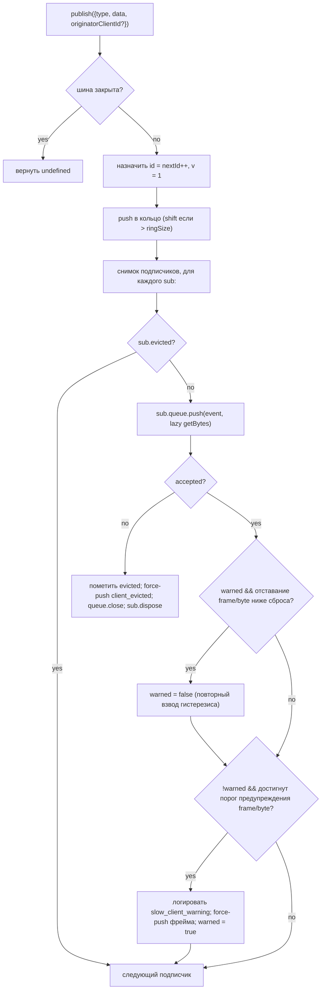

# Шина событий SSE и backpressure

## Обзор

`EventBus` (`packages/acp-bridge/src/eventBus.ts`) — это in-memory pub/sub-шина для каждой сессии, обслуживающая SSE-маршрут демона `GET /session/:id/events`. Она присваивает каждому событию монотонный id, буферизует недавние события в кольцевом буфере ограниченного размера для воспроизведения по `Last-Event-ID`, рассылает опубликованные события всем подписчикам, применяет backpressure для каждого подписчика (предупреждение при заполнении живой очереди / сериализованных байтов на 75%, исключение при достижении лимита) и генерирует локальные для подписчика синтетические фреймы (`client_evicted`, `slow_client_warning`), которые SDK обрабатывает как полноценные события, но шина помечает **без `id`**, чтобы они не занимали слот в монотонной последовательности сессии.

В настоящее время `EventBus` является package-private для `acp-bridge` и используется фабрикой bridge через один замкнутый экземпляр на сессию. Будущий рефакторинг (указанный в строках 150–159 файла `eventBus.ts`) вынесет его на верхний уровень в качестве базового строительного блока, чтобы каналы, dual-output и будущие WebSocket-транспорты могли подписываться через ту же шину вместо запуска параллельных потоков.

## Обязанности

- Назначать монотонные id событий для каждой сессии, начиная с 1.
- Буферизовать последние `ringSize` событий для воспроизведения при подписке с `lastEventId`.
- Рассылать опубликованные события не более чем `maxSubscribers` одновременным подписчикам.
- Применять ограниченные очереди для каждого подписчика; отключать подписчиков, превышающих лимит живых фреймов или лимит живых сериализованных байтов, с помощью синтетического терминального фрейма `client_evicted`.
- Выдавать `slow_client_warning` один раз за эпизод переполнения при достижении 75% заполнения живой очереди фреймами или сериализованными байтами, с гистерезисом 37,5% для предотвращения повторяющихся предупреждений.
- Оперативно разрывать подписки при `AbortSignal.abort()`.
- Корректно закрывать каждого подписчика при закрытии шины (например, при завершении сессии).
- Никогда не выбрасывать исключения из `publish` (контракт гласит: "вызов publish всегда безопасен").

## Архитектура

| Константа                                | Значение    | Назначение                                                                                         |
| ---------------------------------------- | ----------- | -------------------------------------------------------------------------------------------------- |
| `EVENT_SCHEMA_VERSION`                   | `1`         | Проставляется в каждом `BridgeEvent.v`; увеличивается при критических изменениях фреймов.          |
| `DEFAULT_RING_SIZE`                      | `8000`      | Кольцо воспроизведения для каждой сессии. Переопределяется оператором через `--event-ring-size`.   |
| `DEFAULT_MAX_QUEUED`                     | `256`       | Лимит отставания живых фреймов для каждого подписчика.                                             |
| `DEFAULT_MAX_QUEUED_BYTES`               | `2 MiB`     | Лимит отставания живых сериализованных байтов для каждого подписчика.                              |
| `DEFAULT_MAX_SUBSCRIBERS`                | `64`        | Лимит подписчиков для каждой сессии.                                                               |
| `WARN_THRESHOLD_RATIO`                   | `0.75`      | Доля `maxQueued` или `maxQueuedBytes`, при которой срабатывает `slow_client_warning`.              |
| `WARN_RESET_RATIO`                       | `0.375`     | Доля для повторного взвода гистерезиса.                                                            |
| `MAX_EVENT_RING_SIZE` (в `bridge.ts`)    | `1_000_000` | Мягкий верхний предел для `BridgeOptions.eventRingSize` для предотвращения сбоев нехватки памяти (out-of-memory), вызванных опечатками. |

### `BridgeEvent`

```ts
interface BridgeEvent {
  id?: number; // монотонный для сессии; отсутствует в синтетических терминальных фреймах
  v: 1; // EVENT_SCHEMA_VERSION
  type: string; // один из 53 известных типов или расширяемый в будущем
  data: unknown; // полезные данные (типизируются по типам в SDK; см. 09-event-schema.md)
  _meta?: { serverTimestamp?: number; [key: string]: unknown }; // проставляется EventBus.publish
  originatorClientId?: string; // устанавливается, если событие происходит от запроса с clientId
}
```

### `SubscribeOptions`

```ts
interface SubscribeOptions {
  lastEventId?: number; // воспроизводить начиная после этого id (возобновление Last-Event-ID)
  signal?: AbortSignal; // оперативно прерывает подписку
  maxQueued?: number; // лимит отставания живых фреймов для подписчика; по умолчанию 256
}
```

`subscribe()` возвращает `AsyncIterable<BridgeEvent>`. SSE-маршрут потребляет его с помощью `for await`. Регистрация является **синхронной** — к моменту возврата из `subscribe()` подписчик уже подключен, поэтому `publish()`, который соревнуется (race) с первым `next()` потребителя, всё равно будет доставлен.

Лимит живых байтов — это опция конструктора на уровне шины, предназначенная только для тестов / встроенных вызывающих объектов. Она не предоставляется как HTTP-параметр запроса, опция SDK, флаг CLI или возможность (capability), поскольку клиенты не должны иметь возможности увеличивать бюджет памяти демона.

### `BoundedAsyncQueue`

Очередь для каждого подписчика. Два ключевых поведения:

- **Живые лимиты применяются только к живым элементам.** Элементы, вставленные через `forcePush()`, несут тег `forced: true` для каждой записи и никогда не учитываются в `liveCount` или `liveBytes`. Это позволяет пути воспроизведения `Last-Event-ID` принудительно отправлять (force-push) сотни исторических фреймов новому подписчику, не вызывая немедленного срабатывания живых лимитов и исключения только что возобновленного подписчика.
- **`liveCount` и `liveBytes` поддерживаются как поля**, а не выводятся из позиции `forcedInBuf`. Более ранняя эвристика на основе позиций сломалась, когда `slow_client_warning` начал делать force-push в середине потока (предупреждения отправляются в КОНЕЦ очереди, а не в начало, как при воспроизведении). Теги `forced` для каждой записи не зависят от позиции; живые записи также хранят оценку своих сериализованных байтов, поэтому очистка очереди уменьшает `liveBytes`.
- **Сериализованные байты оцениваются лениво.** `push()` вычисляет `Buffer.byteLength(JSON.stringify(event), 'utf8')` только в том случае, если событие будет буферизовано. Если подписчик уже ожидает `next()`, событие доставляется напрямую, и оценка байтов не вычисляется. Если сериализация завершается ошибкой, демон выводит диагностическое сообщение в stderr (best-effort), и это событие пропускает учет байтов, сохраняя контракт `publish()` "никогда не выбрасывает исключения"; при этом оно всё равно учитывается в лимите живых фреймов.

`push(value, getBytes)` возвращает результат accepted / rejected вместо блокировки или выброса исключения. Переполнение фреймов отклоняется с `queue_overflow`; переполнение байтов отклоняется с `queue_bytes_overflow`. Одно событие превышенного размера допускается, когда живая очередь пуста, но второе живое событие за ним исключает подписчика. `forcePush(value)` обходит оба лимита. `close({drain?: boolean})` по умолчанию очищает (drains) ожидающие элементы; при прерывании (abort-path) передается `drain: false`, чтобы немедленно их отбросить.

## Рабочий процесс

### Публикация


```mermaid
flowchart TD
    P["publish({type, data, originatorClientId?})"] --> C{"шина закрыта?"}
    C -->|yes| RU["вернуть undefined"]
    C -->|no| AID["назначить id = nextId++, v = 1"]
    AID --> PR["push в кольцо (shift если > ringSize)"]
    PR --> FAN["снимок подписчиков, для каждого sub:"]
    FAN --> EVCK{"sub.evicted?"}
    EVCK -->|yes| NEXT[следующий подписчик]
    EVCK -->|no| PUSH["sub.queue.push(event, lazy getBytes)"]
    PUSH --> OK{"accepted?"}
    OK -->|no| EVICT["пометить evicted; force-push client_evicted; queue.close; sub.dispose"]
    OK -->|yes| RES{"warned && отставание frame/byte ниже сброса?"}
    RES -->|yes| RA["warned = false (повторный взвод гистерезиса)"]
    RES -->|no| WARN{"!warned && достигнут порог предупреждения frame/byte?"}
    RA --> WARN
    WARN -->|yes| FW["логировать slow_client_warning; force-push фрейма; warned = true"]
    WARN -->|no| NEXT
    FW --> NEXT
```

`publish` никогда не выбрасывает исключения. Закрытие шины во время `publish` (путь завершения работы закрывает шины для каждой сессии перед ожиданием `channel.kill()`) возвращает `undefined`, а не выбрасывает исключение, поскольку агент всё ещё может выдавать уведомления `sessionUpdate` в небольшом окне между закрытием шины и уничтожением канала (channel kill).

### Подписка + воспроизведение (с обнаружением исключения из кольца)

```mermaid
sequenceDiagram
    autonumber
    participant SR as SSE-маршрут
    participant EB as EventBus
    participant Q as BoundedAsyncQueue

    SR->>EB: subscribe({lastEventId: 42, maxQueued: 256, signal})
    EB->>EB: отклонить, если subs.size >= maxSubscribers<br/>(выбрасывает SubscriberLimitExceededError)
    EB->>Q: new BoundedAsyncQueue(maxQueued, maxQueuedBytes)
    EB->>EB: subs.add(sub)
    EB->>EB: epochReset = lastEventId >= nextId
    alt epochReset (старая эпоха шины)
        EB->>Q: forcePush state_resync_required<br/>{ reason: 'epoch_reset', lastDeliveredId: 42, earliestAvailableId: ring[0]?.id ?? nextId }
        Note over EB,Q: синтетический без id, фрейм идет ДО воспроизведения.<br/>Воспроизведение сканирует всё текущее кольцо.
    else та же эпоха шины
        EB->>EB: earliestInRing = ring[0]?.id
        opt earliestInRing > lastEventId + 1 (исключенный пробел)
            EB->>Q: forcePush state_resync_required<br/>{ reason: 'ring_evicted', lastDeliveredId: 42, earliestAvailableId: earliestInRing }
            Note over EB,Q: синтетический без id, фрейм идет ДО воспроизведения.<br/>Поток остается открытым; SDK reducer переключает awaitingResync.
        end
    end
    loop сканирование кольца
        EB->>EB: for e in ring where e.id > (epochReset ? 0 : 42)
        EB->>Q: forcePush(e)
    end
    EB->>EB: подключить слушатель AbortSignal<br/>(onAbort → queue.close({drain:false}); dispose)
    EB-->>SR: AsyncIterable
    SR->>Q: next() в цикле for-await
```

Если во время подписки `subs.size >= maxSubscribers`, выбрасывается `SubscriberLimitExceededError` — SSE-маршрут перехватывает его и сериализует синтетический фрейм `stream_error` для отклоненного клиента, чтобы тот не видел молчаливый пустой поток. Возврат пустого итерируемого объекта вместо этого лишил бы операторов видимости ситуации "некоторые клиенты получают события, а некоторые нет" под нагрузкой.

### Исключение из кольца → `state_resync_required` (поток восстановления)

Когда потребитель переподключается с `Last-Event-ID: N`, а самое раннее сохранившееся событие в кольце имеет `id > N + 1`, события в диапазоне `[N+1, earliestInRing-1]` были исключены до переподключения потребителя. Наивное воспроизведение молча завершилось бы успехом с несмежным суффиксом, SDK reducer продолжил бы применять дельты, как если бы поток был смежным, и его состояние разошлось бы с истинным состоянием демона — без какого-либо терминального сигнала.

Реализовано в `EventBus.subscribe()`:

1. Сначала проверяется `opts.lastEventId >= this.nextId`. Если это так, курсор клиента относится к более старой эпохе шины (перезапуск демона / реконструкция EventBus), поэтому шина выдает `reason: 'epoch_reset'` и воспроизводит всё текущее кольцо.
2. В противном случае вычисляется `earliestInRing = this.ring[0]?.id`.
3. Если `earliestInRing > opts.lastEventId + 1`, делается force-push синтетического фрейма **до** фреймов воспроизведения:
   ```jsonc
   {
     "v": 1,
     "type": "state_resync_required",
     "data": {
       "reason": "ring_evicted",
       "lastDeliveredId": <opts.lastEventId>,
       "earliestAvailableId": <earliestInRing>
     }
   }
   ```
4. После этого продолжается обычный цикл воспроизведения.

Критические контракты (и что было исправлено в ревью #4360):

- **Нет `id`** — тот же паттерн без слота, что и у `client_evicted`, поэтому он не занимает слот в монотонной последовательности сессии, которую наблюдают другие подписчики.
- **Поток остается открытым** — в отличие от `client_evicted` (действительно терминального), `state_resync_required` ориентирован на восстановление. После этого продолжается поток воспроизведения + живых фреймов.
- **Reducer автоматически пропускает дельты** — на стороне SDK переключается `awaitingResync = true` и применяются только `state_resync_required`, терминальные фреймы и снимки полного состояния, пока код потребителя не вызовет `loadSession` и не сбросит флаг. См. [`09-event-schema.md`](./09-event-schema.md) для `RESYNC_PASSTHROUGH_TYPES`.
- **Оптимизация для сети** — фреймы остаются в сети, чтобы SDK при желании мог позже вычислить разницу "что вы пропустили". Дополнительный цикл переподключения не требуется.

### Терминальный поток исключения

Когда отставание живой очереди подписчика достигает лимита и следующий `push()` отклоняется:

1. Пометить `sub.evicted = true`.
2. Сформировать данные об исключении, вывести `logSubscriberEvicted(evictionData)` в stderr, затем сконструировать фрейм `client_evicted` **без `id`**. При переполнении фреймов используется `reason: 'queue_overflow'`; при переполнении байтов — `reason: 'queue_bytes_overflow'`. Оба включают `queueSize`, `maxQueued`, `queuedBytes` и `maxQueuedBytes`; при переполнении байтов также включается `eventBytes`.
3. `queue.forcePush(evictionFrame)`, чтобы итератор потребителя увидел один терминальный фрейм.
4. `queue.close()`, чтобы итерация завершилась после терминального фрейма.
5. Вызвать `sub.dispose()` — удаляет из `subs` и отсоединяет слушатель `AbortSignal`; без этой очистки замыкания зависших потребителей остаются активными до сборки мусора `AbortSignal`.
### Процесс прерывания

`AbortSignal.abort()` → `onAbort()`:

1. `queue.close({drain: false})` — сбрасываем буферизованные элементы, чтобы SSE-роут не продолжал сериализовать события в сокет, который никто не слушает.
2. `dispose()` — идемпотентен благодаря флагу `disposed`.

Уже прерванные сигналы на момент подписки вызывают `onAbort()` синхронно перед возвратом итератора.

## Состояние и жизненный цикл

- `nextId` начинается с 1 и только увеличивается. Геттер `lastEventId` возвращает `nextId - 1`.
- `ring` ограничен; вытеснение сдвигом (eviction-by-shift) имеет сложность O(n) при заполнении. При `ringSize=8000` это занимает несколько миллисекунд в сессиях с высокой нагрузкой — что значительно ниже бюджета задержки на один фрейм. Рефакторинг под кольцевой буфер отложен до тех пор, пока профилирование не укажет на проблему или операторы не увеличат `--event-ring-size` на порядок.
- `close()` переключает флаг `closed`, закрывает очередь каждого подписчика и очищает `subs`. Последующие вызовы `publish()` / `subscribe()` становятся no-op (`publish` возвращает undefined; `subscribe` возвращает `emptyAsyncIterable`).
- Каждая сессия владеет одним `EventBus`. Закрытие шины происходит до `channel.kill()`, поэтому незавершенные публикации во время выключения возвращают undefined вместо выбрасывания исключения.

## Зависимости

- Используется в `packages/acp-bridge/src/bridge.ts` (`BridgeClient.sessionUpdate` / `BridgeClient.extNotification` → `events.publish(...)`).
- Используется в `packages/cli/src/serve/routes/sse-events.ts` (обработчик SSE-роута → `events.subscribe(...)` с последующим форматированием `BridgeEvent` в SSE-фреймы для передачи по сети).
- CLI-потребители импортируют шину событий напрямую из `@qwen-code/acp-bridge/eventBus`.
- SDK-потребитель: `packages/sdk-typescript/src/daemon/sse.ts` (`parseSseStream`), затем `asKnownDaemonEvent` (см. [`09-event-schema.md`](./09-event-schema.md), [`13-sdk-daemon-client.md`](./13-sdk-daemon-client.md)).

## Конфигурация

- `--event-ring-size <n>` — глубина кольца для каждой сессии; мягкий лимит — `MAX_EVENT_RING_SIZE = 1_000_000`.
- Query-параметр `?maxQueued=N` для подписчика в `GET /session/:id/events`, диапазон `[16, 2048]`. SDK-клиенты предварительно проверяют `caps.features.slow_client_warning` перед включением этой опции.
- Опция конструктора `EventBus(..., { maxQueuedBytes })` существует только для тестов и встраиваемых вызовов. По умолчанию 2 МиБ, невалидные значения выбрасывают `TypeError`. Query-параметр `?maxQueuedBytes` намеренно отсутствует.
- `BridgeOptions.eventRingSize` (переопределяет значение по умолчанию для демона при встраиваемом использовании).
- Теги возможностей (capability tags): `session_events`, `slow_client_warning`, `typed_event_schema`.

## Интеграция с клиентом: переподключение с `Last-Event-ID`

### Сетевой формат

Каждый SSE-фрейм, содержащий идентификатор и отправляемый через `GET /session/:id/events`, включает строку `id:`:

```
id: 42
event: session_update
data: {"id":42,"v":1,"type":"session_update","data":{...},"_meta":{"serverTimestamp":1719000000000}}

```

Синтетические/терминальные фреймы (`state_resync_required`, `replay_complete`, `client_evicted`, `slow_client_warning`, `stream_error`) отправляются **без** строки `id:` — они не продвигают монотонную последовательность в рамках сессии.

### Протокол переподключения

При переподключении после разрыва связи клиент отправляет идентификатор последнего успешно полученного события в HTTP-заголовке `Last-Event-ID`:

```
GET /session/:id/events HTTP/1.1
Last-Event-ID: 42
Accept: text/event-stream
```

`EventBus` демона воспроизводит все события из кольцевого буфера, у которых `id > Last-Event-ID`, а затем переходит к доставке в реальном времени. Синтетический фрейм `replay_complete` отмечает границу между воспроизведением и live-потоком:

```jsonc
// нет строки id: — синтетический фрейм
{
  "v": 1,
  "type": "replay_complete",
  "data": { "replayedCount": 7, "lastReplayedEventId": 49 },
}
```

### Логика воспроизведения

| Сценарий | Поведение |
| --- | --- |
| Отсутствует `Last-Event-ID` | Только live-поток; без воспроизведения. Обратная совместимость с клиентами до введения функции resume. |
| `Last-Event-ID: 0` | Воспроизведение всего кольцевого буфера с начала (ограничено `--event-ring-size`, по умолчанию 8000). |
| `Last-Event-ID: N`, где `ring[0].id <= N+1` | Непрерывное воспроизведение событий с `id > N`, затем live-поток. |
| `Last-Event-ID: N`, где `ring[0].id > N+1` | Обнаружен разрыв — перед воспроизведением сохранившегося суффикса отправляется `state_resync_required` (`reason: 'ring_evicted'`). SDK должен вызвать `loadSession` для восстановления полного состояния. |
| `Last-Event-ID: N`, где `N >= nextId` | Сброс эпохи (перезапуск демона) — отправляется `state_resync_required` (`reason: 'epoch_reset'`), затем полное воспроизведение кольца. |

### Правила валидации

Демон строго парсит `Last-Event-ID`:

- Принимаются только строки, состоящие исключительно из десятичных цифр (например, `"42"`).
- Нецифровые, отрицательные, дробные значения или значения при переполнении (превышающие `Number.MAX_SAFE_INTEGER`) отклоняются без ошибки — поток запускается только в live-режиме, а демон логирует breadcrumb.
- Директива `retry: 3000` указывает совместимым реализациям `EventSource` ждать 3 секунды перед переподключением.

### Обратная совместимость

Механизм `Last-Event-ID` подключается явно (opt-in):

- Клиенты, которые никогда не отправляют этот заголовок, получают только live-поток, идентичный поведению до введения функции resume.
- Более старые версии SDK, не отслеживающие идентификаторы событий, продолжают работать.
- Фрейм `replay_complete` является синтетическим (без `id:`), поэтому он не вводит в заблуждение потребителей, не учитывающих идентификаторы.

### Ограничения браузерного `EventSource`

Нативный браузерный API `EventSource` автоматически отслеживает последнее поле `id:` и отправляет его при переподключении. Однако он **не может** устанавливать кастомные заголовки (например, `Authorization: Bearer`). Клиентам, требующим аутентификации, необходимо использовать непосредственно `fetch()` + ручной парсинг SSE (как это делает TypeScript SDK через `parseSseStream`), а не `EventSource`. `RestSseTransport` в SDK демонстрирует этот паттерн — он устанавливает `Last-Event-ID` как явный HTTP-заголовок при вызове `fetch()`.

## Ограничения и известные нюансы

- **У синтетических фреймов нет `id`.** Потребители SDK, использующие `Last-Event-ID` для resume, записывают только фреймы с идентификаторами; `slow_client_warning`, `client_evicted`, `state_resync_required` и `replay_complete` не продвигают курсор и не потребляют порядковые номера в рамках сессии. Если между двумя live-фреймами с идентификаторами есть реальный разрыв, обрабатывайте его через путь ресинка при вытеснении из кольца / сбросе эпохи, а не как приватный синтетический фрейм.
- `client_evicted` работает **для каждого подписчика**, а не для сессии в целом. Тот же клиент может переподключиться.
- Итератор `BoundedAsyncQueue` **не безопасен для конкурентных драйверов** — два одновременных вызова `.next()` создали бы гонку за одно и то же событие. Использование в демоне последовательно (`for await ... of` в обработчике SSE-роута), поэтому в продакшене это безопасно.
- В настоящее время шина является package-private; каналы и веб-интерфейс должны подписываться через HTTP SSE-роут демона, а не напрямую через шину. В этапе 1.5 это ограничение будет снято.

## Ссылки

- `packages/acp-bridge/src/eventBus.ts` (весь файл)
- `packages/acp-bridge/src/bridge.ts` (места публикации, в особенности `BridgeClient.sessionUpdate` и события разрешений F3)
- `packages/cli/src/serve/routes/sse-events.ts` (обработчик SSE-роута — форматирует `BridgeEvent` в сетевой SSE)
- `packages/sdk-typescript/src/daemon/sse.ts` (парсер сетевого SSE на стороне клиента)
- Описание сетевого протокола: [`../qwen-serve-protocol.md`](../qwen-serve-protocol.md) (контракт переподключения с `Last-Event-ID`).