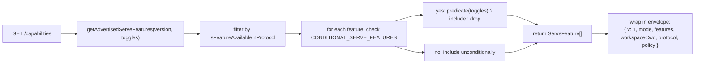
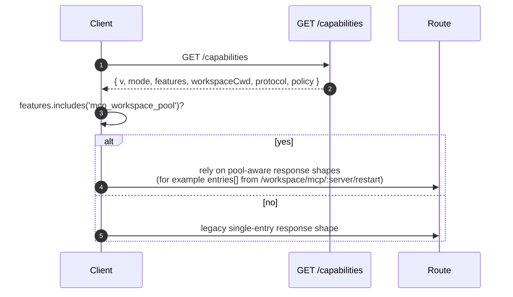

# Возможности и версионирование протокола

## Обзор

`GET /capabilities` — это конечная точка предварительной проверки демона. Каждый SDK-клиент должен прочитать её перед вызовом любого другого маршрута, чтобы узнать, какую версию протокола использует демон, какие теги возможностей включены и к какой рабочей области привязан демон. Контракт:

- **Существует одна версия протокола: `v1`.** `SERVE_PROTOCOL_VERSION = 'v1'` и `SUPPORTED_SERVE_PROTOCOL_VERSIONS = ['v1']`. v1 является аддитивной внутри; критические изменения формы фреймов отложены до v2.
- **Каждый тег имеет версию `since`.** Будущие демоны v2 могут анонсировать как теги v1, так и v2.
- **Некоторые теги условны.** Десять тегов (`require_auth`, `mcp_workspace_pool`, `mcp_pool_restart`, `allow_origin`, `prompt_absolute_deadline`, `writer_idle_timeout`, `workspace_settings`, `session_shell_command`, `rate_limit`, `workspace_reload`) анонсируются только при включении соответствующего тогла развёртывания. Наличие тега означает, что поведение существует.
- **Тег возможности = контракт поведения.** Добавление нового поведения под существующим тегом может незаметно сломать клиенты, которые уже выполнили предварительную проверку старого тега. Новое поведение требует нового тега.

Полный реестр находится в `packages/cli/src/serve/capabilities.ts`.

## Обязанности

- Объявлять каждую возможность, которую демон может анонсировать.
- Фильтровать анонсируемые возможности по версии протокола и тоглам развёртывания.
- Предоставлять `getRegisteredServeFeatures()` (все ключи, без фильтрации), `getAdvertisedServeFeatures(version, toggles)` (с фильтрацией) и `getServeProtocolVersions()` (конверт `{ current, supported }`).
- Сохранять инвариант «тег присутствует — значит поведение присутствует». В `server.test.ts` есть тест, который проверяет, что каждый условный тег анонсируется, когда его тогл включён; добавление условного тега без предиката приводит к провалу теста.

## Архитектура

### Конверт возможностей

`/capabilities` возвращает:

```ts
{
  v: 1,                    // CAPABILITIES_SCHEMA_VERSION
  mode: 'http-bridge',
  features: ServeFeature[],
  workspaceCwd: string,
  protocol?: { current: 'v1', supported: ['v1'] },
  policy?: { permission: PermissionPolicy },
}
```

`workspaceCwd` — это каноническая рабочая область, привязанная при запуске демона (см. [`02-serve-runtime.md`](./02-serve-runtime.md)). `policy.permission` — активная политика медиатора.

### `ServeCapabilityDescriptor`

```ts
interface ServeCapabilityDescriptor {
  since: ServeProtocolVersion; // current = 'v1'
  modes?: readonly string[]; // перечисляет режимы работы, когда возможность имеет режимы
}
```

Два тега v1 используют `modes`:

- `mcp_guardrails: { since: 'v1', modes: ['warn', 'enforce'] }` — клиенты должны выполнять предварительную проверку `'enforce'` перед тем, как полагаться на поведение отказа.
- `permission_mediation: { since: 'v1', modes: ['first-responder', 'designated', 'consensus', 'local-only'] }` — это поддерживаемый набор на этапе сборки; активная политика находится в `policy.permission`.

### Условные теги

```ts
export const CONDITIONAL_SERVE_FEATURES: ReadonlyMap<
  ServeFeature,
  (toggles: AdvertiseFeatureToggles) => boolean
> = new Map([
  ['require_auth', (t) => t.requireAuth === true],
  ['mcp_workspace_pool', (t) => t.mcpPoolActive === true],
  ['mcp_pool_restart', (t) => t.mcpPoolActive === true],
  ['allow_origin', (t) => t.allowOriginActive === true],
  [
    'prompt_absolute_deadline',
    (t) => typeof t.promptDeadlineMs === 'number' && t.promptDeadlineMs > 0,
  ],
  [
    'writer_idle_timeout',
    (t) =>
      typeof t.writerIdleTimeoutMs === 'number' && t.writerIdleTimeoutMs > 0,
  ],
  ['workspace_settings', (t) => t.persistSettingAvailable === true],
  ['session_shell_command', (t) => t.sessionShellCommandEnabled === true],
  ['rate_limit', (t) => t.rateLimit === true],
  ['workspace_reload', (t) => t.reloadAvailable === true],
]);
```

`Map` хранит членство и предикат вместе. Добавление нового условного тега требует двух согласованных изменений:

1. Зарегистрировать тег и его версию `since` в `SERVE_CAPABILITY_REGISTRY`.
2. Добавить его предикат в `CONDITIONAL_SERVE_FEATURES`.

Базовые теги отсутствуют в `Map` и анонсируются безусловно. Это намеренно представлено отсутствием, а не отдельным набором.

### 67 тегов (v1, сгруппированные по областям)

Фундамент: `health`, `capabilities`.

Сессии: `session_create`, `session_scope_override`, `session_load`, `session_resume`, `unstable_session_resume`, `session_list`, `session_prompt`, `session_cancel`, `session_events`, `session_set_model`, `session_close`, `session_metadata`, `session_context`, `session_context_usage`, `session_supported_commands`, `session_tasks`, `session_stats`, `session_lsp`, `session_status`, `session_approval_mode_control`, `session_recap`, `session_btw`, **`session_shell_command`** (условный), `session_language`, `session_rewind`, `session_hooks`, `session_branch`.

Стриминг: `slow_client_warning`, `typed_event_schema`.

Идентификация и heartbeat: `client_identity`, `client_heartbeat`.

Разрешения: `session_permission_vote`, `permission_vote`, **`permission_mediation`** (`modes: ['first-responder', 'designated', 'consensus', 'local-only']`).

Снимки рабочей области только для чтения: `workspace_mcp`, `workspace_skills`, `workspace_providers`, `workspace_env`, `workspace_preflight`, `workspace_hooks`, `workspace_extensions`.

Мутация рабочей области (Wave 4+): `workspace_memory`, `workspace_agents`, `workspace_agent_generate`, `workspace_tool_toggle`, **`workspace_settings`** (условный), `workspace_init`, `workspace_mcp_restart`, `workspace_mcp_manage`, `workspace_file_read`, `workspace_file_bytes`, `workspace_file_write`, **`workspace_reload`** (условный).

MCP guardrails: **`mcp_guardrails`** (`modes: ['warn', 'enforce']`), `mcp_guardrail_events`, `mcp_server_runtime_mutation`, **`mcp_workspace_pool`** (условный), **`mcp_pool_restart`** (условный).

Управление промптами: **`prompt_absolute_deadline`** (условный), **`writer_idle_timeout`** (условный), `non_blocking_prompt`.

Аутентификация: `auth_provider_install`, `auth_device_flow`, **`require_auth`** (условный), **`allow_origin`** (условный).

Ограничение скорости: **`rate_limit`** (условный).

Полужирные теги имеют `modes` или являются условными.

## Поток

### Сторона демона: сборка конверта



### Сторона клиента: предварительная проверка возможностей



## Состояние и жизненный цикл

- `CAPABILITIES_SCHEMA_VERSION` — это версия формы конверта на проводе, в настоящее время `1`. Обновляйте только при ломающем изменении конверта.
- `SERVE_PROTOCOL_VERSION = 'v1'` — это версия возможностей протокола. Добавление возможностей внутри v1 является аддитивным; старые клиенты не видят новое поведение, пока не выполнят предварительную проверку нового тега. Удаление возможности — это ломающее изменение v2.
- `EVENT_SCHEMA_VERSION = 1` — это поле `v` фрейма SSE (см. [`09-event-schema.md`](./09-event-schema.md)). Это независимая ось версии; обновление схемы событий не подразумевает обновления версии протокола, и наоборот.
- `session_resume` — это стабильная возможность демона для `POST /session/:id/resume`. `unstable_session_resume` остаётся анонсированным как устаревший псевдоним, потому что нижележащий метод ACP всё ещё называется `connection.unstable_resumeSession`; новые клиенты должны использовать определение возможности через `session_resume`.

## Зависимости

- Читается `packages/cli/src/serve/server.ts` при построении ответов `/capabilities`.
- Входные данные тоглов поступают из `runQwenServe` / `createServeApp`: `{ requireAuth, mcpPoolActive, allowOriginActive, promptDeadlineMs, writerIdleTimeoutMs, persistSettingAvailable, sessionShellCommandEnabled, rateLimit, reloadAvailable }`.
- Активная политика `permission` в конверте поступает из `BridgeOptions.permissionPolicy`, которая сама читает `settings.json` `policy.permissionStrategy`.

## Конфигурация

| Источник                     | Ручка                                                            | Влияние на возможности                                                                                                        |
| ---------------------------- | ---------------------------------------------------------------- | ----------------------------------------------------------------------------------------------------------------------------- |
| Флаг CLI                     | `--require-auth`                                                 | Анонсирует `require_auth`.                                                                                                    |
| Переменная окружения         | `QWEN_SERVE_NO_MCP_POOL=1`                                       | Прекращает анонсировать `mcp_workspace_pool` и `mcp_pool_restart`; события MCP больше не указывают `scope: 'workspace'`.      |
| Флаг CLI                     | `--mcp-client-budget=N`, `--mcp-budget-mode={off,warn,enforce}`  | Не изменяет набор тегов (`mcp_guardrails` всегда анонсируется), но изменяет резервирование и поведение отказа на сервер.      |
| Флаг CLI / переменная окружения | `--rate-limit` / `QWEN_SERVE_RATE_LIMIT=1`                      | Анонсирует `rate_limit`.                                                                                                      |
| Встроенная опция             | `persistSettingAvailable`                                        | Анонсирует `workspace_settings`.                                                                                              |
| Флаг CLI / встроенная опция  | `--enable-session-shell` / `sessionShellCommandEnabled`          | Анонсирует `session_shell_command`.                                                                                           |
| Встроенная опция             | `reloadAvailable`                                                | Анонсирует `workspace_reload`.                                                                                                |
| `settings.json`              | `policy.permissionStrategy`                                      | Устанавливает `policy.permission` конверта.                                                                                   |

## Предостережения и известные ограничения

- **`--require-auth` скрывает предварительную проверку.** С `--require-auth` все маршруты, включая `/capabilities`, требуют bearer-аутентификации. Неаутентифицированный клиент не может выполнить предварительную проверку `caps.features.require_auth`; тело ответа 401 является поверхностью обнаружения. Тег `require_auth` — это аутентифицированное подтверждение для аудиторных интерфейсов усиленного развёртывания.
- **Наличие тега означает, что поведение существует.** Если будущий участник добавит поведение под существующим тегом без увеличения `since`, клиенты, которые уже выполнили предварительную проверку старого тега, могут незаметно получить новое поведение. Соглашение: новое поведение получает новый тег.
- **Теги `unstable_*` могут изменять форму между версиями** без увеличения протокола. Привязывайте версию SDK при зависимости от них.
- Каталог маршрутов находится в [`../qwen-serve-protocol.md`](../qwen-serve-protocol.md); эта страница намеренно его не дублирует.

## Ссылки

- `packages/cli/src/serve/capabilities.ts`
- `packages/cli/src/serve/types.ts` (`ServeOptions`, `CapabilitiesEnvelope`)
- `packages/cli/src/serve/server.ts` (сборка конверта)
- `packages/acp-bridge/src/eventBus.ts` (`EVENT_SCHEMA_VERSION`)
- Справочник по проводу: [`../qwen-serve-protocol.md`](../qwen-serve-protocol.md)
- Аутентификация и guardrails развёртывания: [`12-auth-security.md`](./12-auth-security.md)