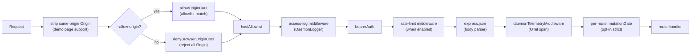
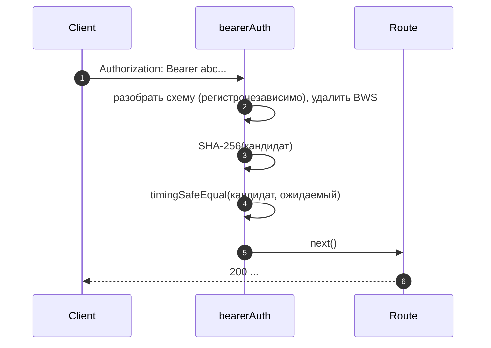
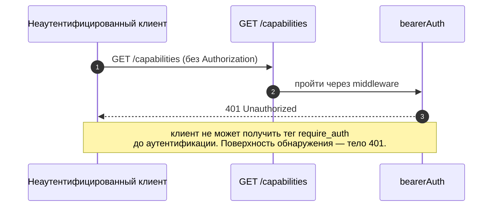
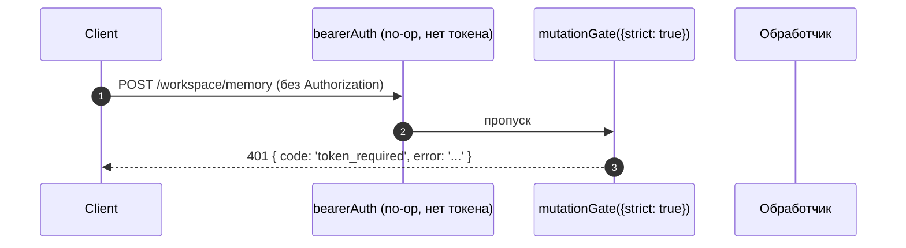

# Модель аутентификации и безопасности

## Обзор

По умолчанию `qwen serve` является локальным демоном, но при неправильной конфигурации становится открытой поверхностью. Его модель безопасности является **многоуровневой**, так что при неверной конфигурации происходит закрытый отказ (fail closed):

1. **Привязка (Bind)** — привязка не к loopback-интерфейсу без токена-носителя (bearer token) **отказывается запускаться**.
2. **Аутентификация через токен-носитель** — middleware `bearerAuth` с константным сравнением SHA-256 защищает каждый маршрут, кроме `/health` на loopback (`require_auth` расширяет это и на loopback, и на `/health`).
3. **Белый список заголовка Host** — на loopback принимаются только `localhost`, `127.0.0.1`, `[::1]`, `host.docker.internal` (плюс порт); защита от DNS rebinding.
4. **Контроль источника (Origin)** — по умолчанию любой запрос с заголовком `Origin` отклоняется с кодом 403. Когда настроен `--allow-origin <pattern>`, демон переключается в режим белого списка CORS (`allowOriginCors`) и разрешает только совпадающие источники.
5. **Шлюз мутаций для каждого маршрута** — мутирующие маршруты Wave 4 могут выбирать ответ `401` даже на loopback, если токен не настроен, используя отдельную ошибку с `code: 'token_required'`.
6. **Аутентификация через Device Flow** — отдельная OAuth-поверхность для провайдеров (`POST /workspace/auth/device-flow` + GET/DELETE на `/:id`).

Этот документ описывает каждый уровень и явные инварианты, которые обеспечиваются на этапе загрузки.

## Ответственность

- Отказаться от загрузки в небезопасных конфигурациях.
- Пропускать каждый HTTP-запрос через проверки: токена-носителя (если настроен) + хоста (loopback) + источника (Origin).
- Предоставлять для каждого маршрута шлюз мутаций, в который маршруты Wave 4 могут включиться.
- Размещать реестр device-flow, который управляет OAuth-потоками провайдеров, видимыми через SSE-события.

## Архитектура

### Правила отказа при загрузке

В файле `run-qwen-serve.ts`:

```ts
if (!isLoopbackBind(opts.hostname) && !token) {
  throw new Error('Refusing to bind <host>:<port> without a bearer token. ...');
}
if (opts.requireAuth && !token) {
  throw new Error(
    'Refusing to start with --require-auth set but no bearer token configured. ...',
  );
}
```

Для wildcard в `--allow-origin` действует собственное правило отказа:

```ts
const parsed = parseAllowOriginPatterns(opts.allowOrigins);
if (parsed.allowAny && !token) {
  throw new Error(
    "Refusing to start with --allow-origin '*' but no bearer token configured. ...",
  );
}
```

Все три отказа являются явными сбоями загрузки (видны в stderr / выбрасываются во встраивающий код), никогда не молчаливыми. Модель угроз из #3803 явно запрещает молчаливое разрешение привязки демона за пределами loopback.

### Цепочка middleware (порядок обработки HTTP-запроса)



`mutationGate` — это фабрика middleware для каждого маршрута (`createMutationGate` возвращает `mutate()`); маршруты вызывают `mutate()` или `mutate({strict: true})` при регистрации. Это не глобальный middleware `app.use()`. Логирование доступа регистрируется до `bearerAuth`, чтобы отказы 401 всё равно логировались. Ограничение частоты выполняется после `bearerAuth` и до `express.json()`, так что учитываются только аутентифицированные запросы, а большие тела запросов отклоняются до парсинга, если лимит превышен.

### `bearerAuth`

- **Токен не настроен** → middleware является no-op (режим разработчика на loopback).
- **Токен настроен** → SHA-256 для настроенного токена вычисляется один раз при создании; для каждого запроса хэшируется кандидат и сравнивается с помощью `timingSafeEqual`. Никакого короткого замыкания на строковом сравнении; никакой утечки времени.
- **Разбор схемы**: регистронезависимый `Bearer` согласно RFC 7235 §2.1; допускается `SP\tHTAB` между схемой и учётными данными согласно RFC 7230 §3.2.6 BWS; отклоняется чистый HTAB в качестве разделителя.
- **Усиление CodeQL**: ручной разбор через `indexOf` вместо регулярного выражения с `\s+` / `.+` (нет риска полиномиального регресса).

### `hostAllowlist`

Только для loopback. Содержит `Set<string>` с ключом по порту. Допустимые заголовки Host:

- `localhost:<порт>`, `127.0.0.1:<порт>`, `[::1]:<порт>`, `host.docker.internal:<порт>`.
- Плюс формы без порта (`localhost`, `127.0.0.1`, `[::1]`, `host.docker.internal`) **только** при привязке к порту 80 (согласно RFC 7230 §5.4, опускание порта по умолчанию).

Сравнение Host **регистронезависимо** — Express нормализует имена заголовков, но не их значения, поэтому Docker-прокси, которые пишут Host с заглавной буквы (`Localhost:4170`, `HOST.docker.internal`), получили бы 403 при точном строковом сравнении.

Привязки не к loopback обходят этот middleware (оператор выбрал поверхность атаки; вместо этого токен-носитель защищает от подделки Host).

### `denyBrowserOriginCors`

Отклоняет любой запрос с заголовком `Origin`. CLI/SDK никогда не устанавливают Origin; только браузеры. Возвращает детерминированный `403 { error: 'Request denied by CORS policy' }`, а не 500 HTML, который мог бы выдать пакет `cors` в колбэке ошибки.

Исключение: запросы демонстрационной страницы с тем же источником обрабатываются отдельным middleware (в `server.ts`), который удаляет `Origin`, если он совпадает с собственным адресом демона.

### `allowOriginCors` (режим `--allow-origin`)

Когда настроен `--allow-origin <pattern>`, `denyBrowserOriginCors` заменяется на `allowOriginCors(parsedPatterns)`:

- Совпадающие значения `Origin` получают заголовки `Access-Control-Allow-Origin`, `Access-Control-Allow-Headers` и `Access-Control-Allow-Methods`; предварительный запрос `OPTIONS` возвращает `204`.
- Несовпадающие значения `Origin` получают тот же детерминированный `403 { error: 'Request denied by CORS policy' }`, что и в режиме deny.
- `--allow-origin '*'` требует `--token`; иначе загрузка отказывает.
- `parseAllowOriginPatterns()` проверяет синтаксис шаблона при загрузке.
- Тег возможности `allow_origin` рекламируется только когда этот режим настроен.

### `createMutationGate`

Опциональный шлюз для каждого маршрута. Матрица поведения:

| Конфигурация демона           | Параметры маршрута | Результат                        |
| ----------------------------- | ------------------ | -------------------------------- |
| `requireAuth=true`            | любые              | пропуск¹                         |
| `token` настроен              | любые              | пропуск²                         |
| нет токена (loopback dev)     | `strict: false`    | пропуск                          |
| нет токена (loopback dev)     | `strict: true`     | `401 { code: 'token_required' }` |

¹ `--require-auth` запускается только с токеном, поэтому глобальный `bearerAuth` уже вернул бы 401 неаутентифицированным клиентам.
² Любая настройка токена заставляет глобальный `bearerAuth` требовать носитель везде; шлюз избыточен, но безвреден.

Форма `code: 'token_required'` отличается от простого `Unauthorized` от `bearerAuth`, чтобы SDK-клиенты могли отображать подсказку "настройте --token / --require-auth" вместо общего 401.

**Строгие маршруты Wave 4+**: `/workspace/memory`, `/workspace/agents/*`,
`/workspace/agents/generate`, `/file/write`, `/file/edit`,
`/workspace/tools/:name/enable`, `/workspace/mcp/:server/restart`,
`/workspace/mcp/:server/{enable,disable,authenticate,clear-auth}`,
`/workspace/mcp/servers` (POST/DELETE), `/workspace/auth/device-flow`,
`/workspace/init`, `/session/:id/approval-mode`.

### Исключение для `/health`

При привязке к loopback маршрут `/health` регистрируется **до** middleware bearer, чтобы проверки жизнеспособности внутри пода не требовали токена. При привязке не к loopback маршрут `/health` защищается bearer, как и любой другой. `--require-auth` снимает исключение: `/health` требует `Authorization: Bearer <token>` и на loopback.

### Идентификатор клиента v1 (`X-Qwen-Client-Id`) является самопровозглашённым

Демон проверяет только формат `X-Qwen-Client-Id` (`[A-Za-z0-9._:-]{1,128}`) и отслеживает привязанные идентификаторы клиентов для каждой сессии. В настоящее время он не выполняет проверку владения (proof-of-possession). Клиент, который видит `originatorClientId` в SSE, может зарегистрировать тот же идентификатор и выдать себя за инициатора в последующих запросах.

Влияние:

- `designated` — удалённый вызывающий может выдать себя за инициатора и проголосовать за запрос, предназначенный только для инициатора подсказки.
- `consensus` — если поддельный идентификатор уже был в снимке `votersAtIssue`, он может голосовать.
- `local-only` не затрагивается, поскольку проверяет `fromLoopback`, который демон устанавливает на основе удалённого адреса соединения.
- `first-responder` не затрагивается, так как не зависит от идентификатора.

В будущем механизм pair-token будет выдавать секрет для каждой сессии через `POST /session`; голоса `designated` / `consensus` должны будут его предъявлять. До тех пор развёртывания, которым требуется усиленная политика designated, должны привязываться к loopback или работать за аутентифицированным обратным прокси. См. [`04-permission-mediation.md`](./04-permission-mediation.md) для деталей политик.

### Аутентификация через Device Flow

Отдельная OAuth-поверхность для аутентификации провайдеров. Идентификатор провайдера v1 — `qwen-oauth`, но бесплатный уровень Qwen OAuth был прекращён 15 апреля 2026 года; новые настройки должны использовать поддерживаемого в настоящее время провайдера аутентификации, если таковой доступен.

- `POST /workspace/auth/device-flow` — запустить поток; возвращает `{deviceFlowId, providerId, expiresAt, verificationUrl, userCode}`.
- `GET /workspace/auth/device-flow/:id` — опросить состояние.
- `DELETE /workspace/auth/device-flow/:id` — отменить.
- `GET /workspace/auth/status` — текущий снимок учётной записи / провайдера.

События SSE `auth_device_flow_{started, throttled, authorized, failed, cancelled}` рассылают состояние потока всем подписчикам, чтобы многоклиентские UI оставались синхронизированными. См. [`09-event-schema.md`](./09-event-schema.md).

Реализация: `packages/cli/src/serve/auth/device-flow.ts` + `qwen-device-flow-provider.ts`.

**Защита от инъекции в лог / Trojan Source**: `sanitizeForStderr(value)` (`device-flow.ts`) заменяет управляющие символы ASCII и Unicode на `?`. Злонамеренный IdP мог бы иначе подделать строки лога или скрыть полезные данные:

| Диапазон                        | Почему удаляется                                                                                                                                                                                                                                                       |
| ------------------------------- | ----------------------------------------------------------------------------------------------------------------------------------------------------------------------------------------------------------------------------------------------------------------------- |
| `\x00–\x1f`, `\x7f`, `\x80–\x9f` | Управляющие символы ASCII C0 / DEL / C1, терминальные escape-последовательности, подделка строк лога.                                                                                                                                                                  |
| U+200B-U+200F                   | Символы нулевой ширины, LRM / RLM; невидимы, но могут изменить отображение в терминале.                                                                                                                                                                                  |
| U+2028-U+2029                   | Разделители строк / абзацев; многие терминалы, поддерживающие Unicode, воспринимают их как переносы строк.                                                                                                                                                               |
| U+202A-U+202E                   | Управляющие символы двунаправленного EMBEDDING / OVERRIDE.                                                                                                                                                                                                               |
| U+2066-U+2069                   | Управляющие символы двунаправленного ISOLATE (LRI / RLI / FSI / PDI) — основной вектор [CVE-2021-42574 "Trojan Source"](https://trojansource.codes/). IdP, использующий U+2066 (LRI) вместо U+202D (LRO), может обойти фильтры, блокирующие только EMBEDDING/OVERRIDE, с аналогичной визуальной перестановкой. |
| U+FEFF                           | BOM / пробел нулевой ширины без разрыва.                                                                                                                                                                                                                                 |

Длина сохраняется путём замены каждого удалённого кодового пункта на `?`, а не удаления, чтобы операторы могли видеть, что в этой позиции что-то было. Санитайзер используется в двух слоях: `qwenDeviceFlowProvider` очищает `oauthError` от IdP, а обозреватель поздних опросов в реестре очищает значения, контролируемые провайдером, которые интерполируются в подсказки аудита (`latePollResult.kind` / `lateErr.name`).

Тег возможности `auth_device_flow` рекламируется **безусловно**; сами маршруты возвращают `400 unsupported_provider`, если демон не может обслужить конкретного провайдера. Список поддерживаемых провайдеров находится на `/workspace/auth/status`, а не в `/capabilities`, чтобы сохранить единообразную форму дескриптора.

## Рабочий процесс

### Успешный запрос с аутентификацией Bearer



### Режимы отказа аутентификации Bearer

Все возвращают `401 { error: 'Unauthorized' }` (единообразно для случаев `missing header` / `wrong scheme` / `wrong token`, чтобы зондирование не могло их различить).

### Тень `--require-auth`



После аутентификации `caps.features.includes('require_auth')` подтверждает, что развёртывание усилено.

### Шлюз мутаций Wave 4 на loopback без токена



## Состояние и жизненный цикл

- Токен-носитель читается при загрузке и обрезается (переводы строк из `cat token.txt` в противном случае молча сломали бы сравнение).
- Набор разрешённых хостов кэшируется для каждого порта; перестраивается при изменении порта (временный `0` → реальный порт после `listen`).
- Шлюз мутаций создаёт `passthrough` и `strictDenier` один раз при сборке приложения; вызов для каждого маршрута возвращает закэшированное замыкание (никаких выделений на запрос).
- Реестр device-flow освобождается при `shutdown()` на Фазе 1, чтобы ожидающие потоки разрешались как `cancelled` до разбора HTTP.

## Зависимости

- `node:crypto` — `createHash`, `timingSafeEqual`.
- `packages/cli/src/serve/loopback-binds.ts` — `isLoopbackBind`.
- `packages/cli/src/serve/auth/device-flow.ts` — конечный автомат device-flow.
- `@qwen-code/acp-bridge` — передаёт события device-flow на шину SSE для каждой сессии.

## Конфигурация

| Источник | Параметр                                                                               | Эффект                                                                   |
| -------- | -------------------------------------------------------------------------------------- | ------------------------------------------------------------------------ |
| Env      | `QWEN_SERVER_TOKEN`                                                                    | Токен-носитель (обрезается).                                             |
| Флаг     | `--token`                                                                              | Токен-носитель (переопределяет env).                                     |
| Флаг     | `--require-auth`                                                                       | Расширяет bearer на loopback + `/health`. Запускается только с токеном.  |
| Флаг     | `--hostname`                                                                           | Привязка не к loopback требует `--token` (или env).                      |
| Флаг     | `--allow-origin <pattern>`                                                             | Переключение в режим белого списка CORS. `'*'` требует токен.            |
| Теги возможностей | `require_auth` (условный), `auth_device_flow` (всегда), `allow_origin` (условный) | См. [`11-capabilities-versioning.md`](./11-capabilities-versioning.md). |

## Предостережения и известные ограничения

- **`--require-auth` скрывает предварительный просмотр возможностей.** Неаутентифицированные клиенты не могут обнаружить тег `require_auth`; их поверхность обнаружения — само тело 401.
- **Порядок шлюза мутаций и парсера тела**: ответы `mutationGate({strict: true})` 401 срабатывают **после** того, как `express.json()` разобрал тело. В худшем случае на насыщенном loopback-слушателе: `--max-connections × express.json({limit: '10mb'})` ≈ 2.5 ГБ временных данных. Поверхность атаки только через loopback, намеренно принятая.
- **Удаление Origin для того же источника** в `server.ts` происходит _до_ `denyBrowserOriginCors`. Если будущее изменение переместит удаление в другое место, демонстрационная страница сломается.
- **Сравнение токенов выполняется по дайджесту SHA-256**, а не по сырому токену. Уменьшает утечку времени, заменяя сравнение токенов переменной длины на сравнение дайджеста фиксированного размера.
- Демон **не** поддерживает mTLS, подпись запросов или pair-token proof-of-possession на данный момент. `--rate-limit` обеспечивает ограничение частоты HTTP по ключу client-id / IP; это не аутентификация клиента.

## Ссылки

- `packages/cli/src/serve/auth.ts` (весь файл)
- `packages/cli/src/serve/run-qwen-serve.ts` (правила отказа)
- `packages/cli/src/serve/loopback-binds.ts`
- `packages/cli/src/serve/auth/device-flow.ts`
- `packages/cli/src/serve/auth/qwen-device-flow-provider.ts`
- Пользовательская модель угроз: [`../../users/qwen-serve.md`](../../users/qwen-serve.md).
- Справочник по протоколу: [`../qwen-serve-protocol.md`](../qwen-serve-protocol.md).