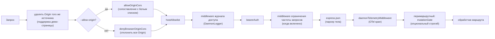
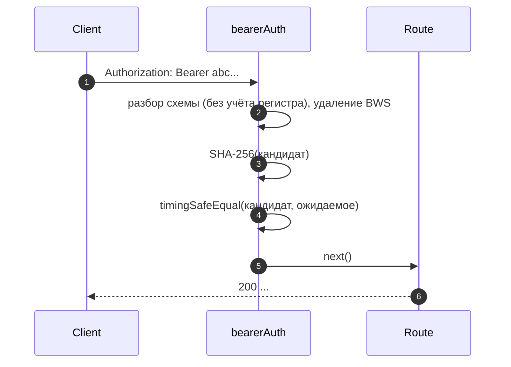
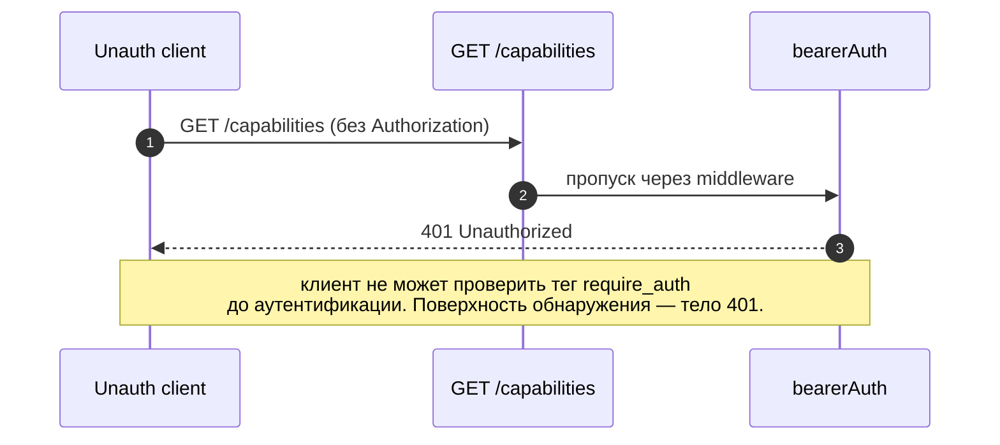
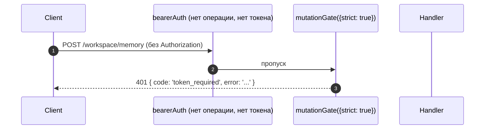

# Модель аутентификации и безопасности

## Обзор

`qwen serve` по умолчанию работает как локальный демон, но при неправильной конфигурации может стать открытой поверхностью. Его модель безопасности является **многоуровневой**, так что любая ошибка конфигурации приводит к безопасному отказу:

1. **Привязка** — привязка не к локальной петле (loopback) без токена-носителя **приводит к отказу запуска**.
2. **Аутентификация Bearer** — middleware `bearerAuth` с константным сравнением SHA-256 защищает все маршруты, кроме `/health` на локальной петле (`require_auth` расширяет это также на loopback и `/health`).
3. **Белый список заголовков Host** — на loopback принимаются только `localhost`, `127.0.0.1`, `[::1]`, `host.docker.internal` (с портом); защита от DNS-реббиндинга.
4. **Контроль источника (Origin)** — по умолчанию любой запрос с заголовком `Origin` отклоняется с кодом 403. Когда настроен `--allow-origin <pattern>`, демон переключается в режим белого списка CORS (`allowOriginCors`) и разрешает только соответствующие источники.
5. **Перимаршрутный шлюз мутаций** — мутирующие маршруты Wave 4 могут опционально возвращать `401` даже на loopback, когда токен не настроен, используя отдельную ошибку с `code: 'token_required'`.
6. **Аутентификация с Device Flow** — отдельная OAuth-поверхность для провайдеров (`POST /workspace/auth/device-flow` + GET/DELETE на `/:id`).

Этот документ описывает каждый уровень и явные инварианты, обеспечиваемые процессом загрузки.

## Обязанности

- Отказ от запуска в небезопасных конфигурациях.
- Шлюзование каждого HTTP-запроса через проверки bearer (когда настроено) + host (на loopback) + origin.
- Предоставление перимаршрутного шлюза мутаций, в который опционально включаются маршруты Wave 4.
- Размещение реестра device-flow, который управляет OAuth-потоками провайдеров, видимыми через SSE-события.

## Архитектура

### Правила отказа при запуске

В `run-qwen-serve.ts`:

```ts
if (!isLoopbackBind(opts.hostname) && !token) {
  throw new Error('Отказ привязки <host>:<port> без токена-носителя. ...');
}
if (opts.requireAuth && !token) {
  throw new Error(
    'Отказ запуска с --require-auth, но без настроенного токена-носителя. ...',
  );
}
```

Для подстановочного знака allow-origin также действует собственное правило отказа:

```ts
const parsed = parseAllowOriginPatterns(opts.allowOrigins);
if (parsed.allowAny && !token) {
  throw new Error(
    'Отказ запуска с --allow-origin \'*\' без настроенного токена-носителя. ...',
  );
}
```

Все три отказа являются явными сбоями запуска (отображаются в stderr / выбрасываются в вызывающий код), никогда не происходят молча. Угроза из #3803 явно запрещает молча оставлять демон, привязанный за пределами loopback, в открытом доступе.

### Цепочка middleware (порядок обработки HTTP-запросов)



`mutationGate` — это фабрика middleware для отдельных маршрутов (`createMutationGate` возвращает `mutate()`); маршруты вызывают `mutate()` или `mutate({strict: true})` во время регистрации. Это не глобальный `app.use()`. Журнал доступа регистрируется до `bearerAuth`, чтобы отказы 401 также логировались. Ограничение частоты запросов выполняется после `bearerAuth` и до `express.json()`, поэтому учитываются только аутентифицированные запросы, а при превышении лимита большие тела отклоняются до парсинга.

### `bearerAuth`

- **Токен не настроен** — middleware ничего не делает (значение по умолчанию для разработчика на loopback).
- **Токен настроен** — SHA-256 хэш настроенного токена вычисляется один раз при создании; для каждого запроса хэшируется полученный токен и сравнивается с помощью `timingSafeEqual`. Нет сравнения строк без задержки; нет утечки времени.
- **Разбор схемы**: регистронезависимое `Bearer` согласно RFC 7235 §2.1; допускается `SP\tHTAB` между схемой и учётными данными согласно RFC 7230 §3.2.6 BWS; отклоняется чистый HTAB в качестве разделителя.
- **Усиление CodeQL**: ручной разбор с помощью `indexOf`, а не регулярное выражение с `\s+` / `.+` (нет риска полиномиального regex).

### `hostAllowlist`

Только для loopback. Содержит `Set<string>` с ключом по порту. Разрешённые хосты:

- `localhost:<port>`, `127.0.0.1:<port>`, `[::1]:<port>`, `host.docker.internal:<port>`.
- А также формы без порта (`localhost`, `127.0.0.1`, `[::1]`, `host.docker.internal`) **только** при привязке к порту 80 (согласно RFC 7230 §5.4 пропуск порта по умолчанию).

Сравнение хостов — **регистронезависимое** — Express нормализует имена заголовков, но не значения, поэтому прокси Docker, которые пишут Host с заглавной (`Localhost:4170`, `HOST.docker.internal`), при точном строковом сравнении получали бы 403.

Привязки не к loopback обходят этот middleware (оператор выбрал поверхность атаки; токен-носитель защищает от подмены Host).

### `denyBrowserOriginCors`

Отклоняет любой запрос с заголовком `Origin`. CLI/SDK никогда не устанавливают Origin; это делают только браузеры. Возвращает детерминированный `403 { error: 'Request denied by CORS policy' }`, а не HTML-страницу 500, которую бы создал коллбэк ошибок пакета `cors`.
Исключение: XHR-запросы с тем же источником на демо-странице обрабатываются отдельным промежуточным ПО (в `server.ts`), которое удаляет заголовок `Origin`, если он совпадает с адресом самого демона.

### `allowOriginCors` (`--allow-origin` mode)

Когда настроен параметр `--allow-origin <pattern>`, `denyBrowserOriginCors` заменяется на `allowOriginCors(parsedPatterns)`:

- Совпадающие значения `Origin` получают заголовки `Access-Control-Allow-Origin`, `Access-Control-Allow-Headers` и `Access-Control-Allow-Methods`; предварительный запрос `OPTIONS` возвращает `204`.
- Несовпадающие значения `Origin` получают такой же детерминированный ответ `403 { error: 'Request denied by CORS policy' }`, как и в режиме deny.
- `--allow-origin '*'` требует `--token`; в противном случае запуск отклоняется.
- `parseAllowOriginPatterns()` проверяет синтаксис шаблонов при запуске.
- Тег возможности `allow_origin` рекламируется только при настройке этого режима.

### `createMutationGate`

Попутный механизм opt-in для каждого маршрута. Матрица поведения:

| конфигурация демона       | опции маршрута | результат                        |
| ------------------------- | -------------- | -------------------------------- |
| `requireAuth=true`        | any            | пропускается¹                    |
| `token` настроен          | any            | пропускается²                    |
| без токена (loopback dev) | `strict: false` | пропускается                     |
| без токена (loopback dev) | `strict: true`  | `401 { code: 'token_required' }` |

¹ `--require-auth` запускается только с токеном, поэтому глобальный `bearerAuth` уже возвращал 401 неаутентифицированным вызывающим.
² Любая настройка токена заставляет глобальный `bearerAuth` применять требование bearer везде; заслон избыточен, но безвреден.

Формат `code: 'token_required'` отличается от простого `Unauthorized` от `bearerAuth`, чтобы SDK-клиенты могли показать подсказку «настройте --token / --require-auth» вместо общего 401.

**Wave 4+ strict routes**: `/workspace/memory`, `/workspace/agents/*`,
`/workspace/agents/generate`, `/file/write`, `/file/edit`,
`/workspace/tools/:name/enable`, `/workspace/mcp/:server/restart`,
`/workspace/mcp/:server/{enable,disable,authenticate,clear-auth}`,
`/workspace/mcp/servers` (POST/DELETE), `/workspace/auth/device-flow`,
`/workspace/init`, `/session/:id/approval-mode`.

### `/health` exemption

На loopback-привязках `/health` регистрируется **до** промежуточного ПО bearer, поэтому пробы работоспособности внутри пода не требуют токена. Не-loopback привязки закрывают `/health` за bearer, как и любой другой маршрут. `--require-auth` снимает исключение: `/health` требует `Authorization: Bearer <token>` даже на loopback.

### v1 client identity (`X-Qwen-Client-Id`) is self-reported

Демон проверяет только формат `X-Qwen-Client-Id` (`[A-Za-z0-9._:-]{1,128}`) и отслеживает прикреплённые идентификаторы клиентов на сессию. В настоящее время он не выполняет proof-of-possession. Клиент, который видит `originatorClientId` на SSE, может перерегистрировать тот же идентификатор и выдать себя за этого инициатора в последующих запросах.

Последствия:

- `designated` — удалённый вызывающий может выдать себя за инициатора и голосовать по запросу, предназначенному только для инициатора промпта.
- `consensus` — если поддельный идентификатор уже был в снимке `votersAtIssue`, он может голосовать.
- `local-only` не затрагивается, так как он проверяет `fromLoopback`, который демон проставляет из удалённого адреса соединения.
- `first-responder` не затрагивается, так как он не зависит от идентичности.

Будущий механизм парных токенов будет выдавать секрет на сессию через `POST /session`; голоса `designated` / `consensus` должны будут его предъявлять. До тех пор развёртывания, которым требуется жёсткая политика designated, должны использовать loopback или работать за аутентифицированным обратным прокси. См. [`04-permission-mediation.md`](./04-permission-mediation.md) для деталей на уровне политик.

### Device-flow auth

Отдельный OAuth-поверхность для аутентификации провайдера. Идентификатор провайдера v1 — `qwen-oauth`, но бесплатный уровень Qwen OAuth был прекращён 2026-04-15; новые настройки должны использовать текущий поддерживаемый провайдер аутентификации, когда он доступен.

- `POST /workspace/auth/device-flow` — начать поток; возвращает `{deviceFlowId, providerId, expiresAt, verificationUrl, userCode}`.
- `GET /workspace/auth/device-flow/:id` — опрос состояния.
- `DELETE /workspace/auth/device-flow/:id` — отмена.
- `GET /workspace/auth/status` — текущий снимок учётной записи / провайдера.

SSE-события `auth_device_flow_{started, throttled, authorized, failed, cancelled}` рассылают состояние потока всем подписчикам, чтобы многоклиентские интерфейсы оставались синхронизированными. См. [`09-event-schema.md`](./09-event-schema.md).

Реализация: `packages/cli/src/serve/auth/device-flow.ts` + `qwen-device-flow-provider.ts`.

**Защита от инъекции в логи / Trojan Source**: `sanitizeForStderr(value)` (`device-flow.ts`) заменяет управляющие символы ASCII и Unicode управляющие символы на `?`. Злонамеренный IdP мог бы иначе подделать строки логов или скрыть полезные данные:

| Диапазон                       | Почему удаляется                                                                                                                                                                                                                                                    |
| ------------------------------ | ------------------------------------------------------------------------------------------------------------------------------------------------------------------------------------------------------------------------------------------------------------------- |
| `\x00–\x1f`, `\x7f`, `\x80–\x9f` | ASCII C0 / DEL / C1 управляющие, терминальные escape-последовательности и подделка строк логов.                                                                                                                                                                      |
| U+200B-U+200F                    | Символы нулевой ширины плюс LRM / RLM; невидимы, но могут изменить отображение в терминале.                                                                                                                                                                          |
| U+2028-U+2029                    | Разделители СТРОК / АБЗАЦЕВ; многие терминалы, поддерживающие Unicode, обрабатывают их как переносы строк.                                                                                                                                                          |
| U+202A-U+202E                    | Двунаправленные управляющие EMBEDDING / OVERRIDE.                                                                                                                                                                                                                   |
| U+2066-U+2069                    | Двунаправленные управляющие ISOLATE (LRI / RLI / FSI / PDI), основной вектор [CVE-2021-42574 "Trojan Source"](https://trojansource.codes/). IdP, использующий U+2066 (LRI) вместо U+202D (LRO), может обойти фильтры, ориентированные только на EMBEDDING/OVERRIDE, с аналогичной визуальной перестановкой. |
| U+FEFF                           | BOM / пробел нулевой ширины без разрыва.                                                                                                                                                                                                                            |
Длина сохраняется путём замены каждого удалённого кодового пункта на `?`, а не удаления, чтобы операторы могли видеть, что на этом индексе что-то было. Оба слоя используют санитайзер: `qwenDeviceFlowProvider` очищает `oauthError` IdP, а наблюдатель отложенного опроса реестра очищает значения, контролируемые провайдером и вставляемые в подсказки аудита (`latePollResult.kind` / `lateErr.name`).

Тег возможности `auth_device_flow` рекламируется **безусловно**; сами маршруты возвращают `400 unsupported_provider`, если демон не может обслужить конкретного провайдера. Список поддерживаемых провайдеров находится на `/workspace/auth/status`, а не на `/capabilities`, чтобы сохранить единообразную форму дескриптора.

## Workflow

### Успешный запрос с Bearer-авторизацией



### Режимы отказа Bearer-авторизации

Все возвращают `401 { error: 'Unauthorized' }` (единообразно для `отсутствует заголовок` / `неверная схема` / `неверный токен`, чтобы зондирование не могло различить).

### Тень `--require-auth`



После аутентификации `caps.features.includes('require_auth')` подтверждает, что развёртывание усилено.

### Шлюз мутаций Wave 4 для loopback без токена



## Состояние и жизненный цикл

- Bearer-токен считывается при запуске и обрезается (переводы строк из `cat token.txt` иначе молча сломали бы сравнение).
- Набор разрешённых хостов кэшируется для каждого порта; перестраивается при изменении порта (эфимерный `0` → реальный порт после `listen`).
- Шлюз мутаций создаёт `passthrough` и `strictDenier` один раз при сборке приложения; вызов для каждого маршрута возвращает кэшированное замыкание (без выделения на запрос).
- Реестр потока устройств уничтожается на фазе 1 `shutdown()`, чтобы ожидающие потоки разрешались как `cancelled` до завершения работы HTTP.

## Зависимости

- `node:crypto` — `createHash`, `timingSafeEqual`.
- `packages/cli/src/serve/loopback-binds.ts` — `isLoopbackBind`.
- `packages/cli/src/serve/auth/device-flow.ts` — конечный автомат потока устройств.
- `@qwen-code/acp-bridge` — передаёт события потока устройств в SSE-шину сессии.

## Конфигурация

| Источник        | Параметр                                                                                | Эффект                                                                  |
| --------------- | --------------------------------------------------------------------------------------- | ----------------------------------------------------------------------- |
| Переменная среды | `QWEN_SERVER_TOKEN`                                                                     | Bearer-токен (обрезается).                                               |
| Флаг            | `--token`                                                                               | Bearer-токен (переопределяет переменную среды).                           |
| Флаг            | `--require-auth`                                                                        | Расширяет Bearer на loopback + `/health`. Запускается только с токеном.  |
| Флаг            | `--hostname`                                                                            | Привязка не к loopback требует `--token` (или переменную среды).        |
| Флаг            | `--allow-origin <pattern>`                                                              | Переключение в режим белого списка CORS. `'*'` требует токен.            |
| Теги возможностей | `require_auth` (условно), `auth_device_flow` (всегда), `allow_origin` (условно)         | См. [`11-capabilities-versioning.md`](./11-capabilities-versioning.md). |

## Оговорки и известные ограничения

- **`--require-auth` скрывает предварительную проверку функций.** Неаутентифицированные клиенты не могут обнаружить тег `require_auth`; их поверхность обнаружения — само тело 401.
- **Порядок парсинга тела в шлюзе мутаций**: ответы 401 от `mutationGate({strict: true})` срабатывают **после** разбора тела `express.json()`. В худшем случае на насыщенном loopback-слушателе: `--max-connections × express.json({limit: '10mb'})` ≈ 2.5 ГБ временной памяти. Только для loopback; принято осознанно.
- **Удаление Origin того же источника** в `server.ts` происходит _до_ `denyBrowserOriginCors`. Если будущее изменение переместит удаление в другое место, демо-страница сломается.
- **Сравнение токена выполняется по SHA-256-дайджесту**, а не по сырому токену. Уменьшает утечку времени, сводя сравнение токенов переменной длины к сравнению дайджестов фиксированного размера.
- Демон **не** поддерживает mTLS, подпись запросов или доказательство владения парным токеном. `--rate-limit` предоставляет HTTP-ограничение скорости по ключу client-id / IP; это не аутентификация клиента.

Тег возможности `auth_device_flow` рекламируется **безусловно**; сами маршруты возвращают `400 unsupported_provider`, если демон не может обслужить конкретного провайдера. Список поддерживаемых провайдеров находится на `/workspace/auth/status`, а не на `/capabilities`, чтобы сохранить единообразную форму дескриптора.
## Ссылки

- `packages/cli/src/serve/auth.ts` (весь файл)
- `packages/cli/src/serve/run-qwen-serve.ts` (правила отказа)
- `packages/cli/src/serve/loopback-binds.ts`
- `packages/cli/src/serve/auth/device-flow.ts`
- `packages/cli/src/serve/auth/qwen-device-flow-provider.ts`
- Модель угроз для пользователя: [`../../users/qwen-serve.md`](../../users/qwen-serve.md).
- Описание протокола: [`../qwen-serve-protocol.md`](../qwen-serve-protocol.md).
