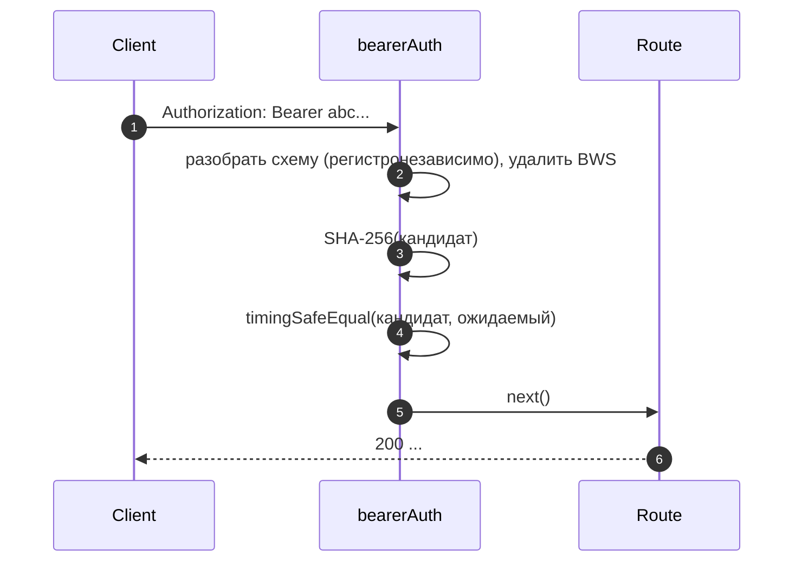
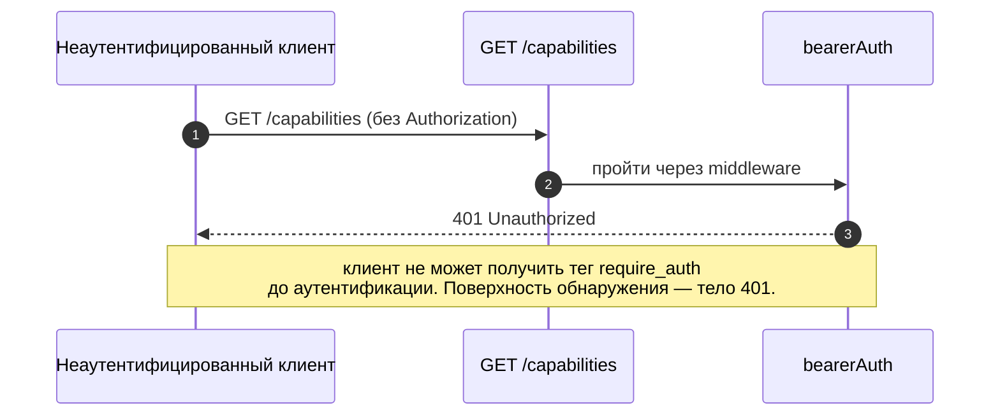
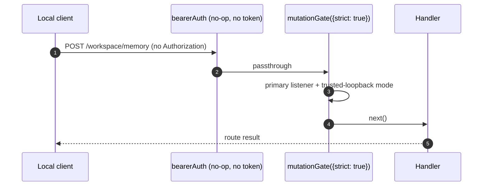

# Модель аутентификации и безопасности

## Обзор

По умолчанию `qwen serve` является локальным демоном, но при неправильной конфигурации становится открытой поверхностью. Его модель безопасности является **многоуровневой**, так что при неверной конфигурации происходит закрытый отказ (fail closed):

1. **Привязка (Bind)** — привязка не к loopback всегда несёт bearer: операторский или эфемерный 128-битный, сгенерированный и выведенный один раз при запуске. Загрузка отказывает только когда предоставленный источник токена явно пуст/состоит из пробелов, или когда запрошенный `localhost` резолвится не в loopback без разрешённого источника токена (который никогда не генерирует).
2. **Аутентификация через токен-носитель** — middleware `bearerAuth` с константным сравнением SHA-256 защищает обычные API-маршруты, кроме `/health` при обычной привязке к loopback (`require_auth` перемещает этот маршрут тоже за bearer). Входящие запросы channel webhook — это отдельный маршрут до bearer, аутентифицируемый через `x-qwen-webhook-secret`. Маршруты документов и ресурсов Web Shell остаются без аутентификации в любом режиме.
3. **Белый список заголовка Host** — на loopback принимаются только `localhost`, `127.0.0.1`, `[::1]`, `host.docker.internal` или точный привязанный loopback-адрес (плюс порт); соответствующие формы без порта также принимаются при прослушивании на 80 или 443. Белый список защищает от DNS rebinding. LAN-слушатель Local Control является исключением, которое всегда применяет проверку Host по рекламируемому authority, независимо от основной привязки.
4. **Контроль источника (Origin)** — runtime-приложение всегда устанавливает `allowOriginCors` с мутабельным белым списком (`MutableOriginAllowlist`): записи `--allow-origin <pattern>` засевают его, а Local Control добавляет LAN-origin, пока включён. Не-совпадающие источники получают 403 deny envelope. Безусловная стена отказа (`denyBrowserOriginCors`) сохраняется только в bootstrap-приложении, которое отвечает на запросы до запуска runtime.
5. **Шлюз мутаций для каждого маршрута** — строгие маршруты требуют authority оператора. Основной слушатель loopback без токена является доверенным; запросы с аутентификацией bearer и парные запросы Local Control также проходят. Запрос без токена к основному слушателю, достигший этого шлюза без доверенного authority, получает отдельную ошибку `code: 'token_required'`. Отсутствующие или недействительные настроенные учётные данные и непарные учётные данные Local Control отклоняются ранее их listener-scoped bearer middleware с простым `401 Unauthorized`.
6. **Аутентификация через Device Flow** — отдельная OAuth-поверхность для провайдеров (`POST /workspace/auth/device-flow` + GET/DELETE на `/:id`).

Этот документ описывает каждый уровень и явные инварианты, которые обеспечиваются на этапе загрузки.

## Ответственность

- Отказаться от загрузки в небезопасных конфигурациях.
- Пропускать обычные API-запросы через bearer при наличии конфигурации, с учётом исключения `/health` на loopback; удерживать входящие запросы channel webhook за их независимым шлюзом общего секрета, а также удерживать проверки Host на loopback и Origin браузера перед аутентифицированными и исключёнными маршрутами.
- Предоставлять для каждого маршрута шлюз мутаций, в который маршруты Wave 4 могут включиться.
- Размещать реестр device-flow, который управляет OAuth-потоками провайдеров, видимыми через SSE-события.

## Архитектура

### Правила отказа при загрузке

В файле `run-qwen-serve.ts`:

```ts
// A non-loopback bind with neither --token nor QWEN_SERVER_TOKEN first
// generates an ephemeral 128-bit base64url bearer (16 random bytes, 22
// URL-safe characters; printed once at startup, rotated per process). The
// first refusal below therefore fires only when a token source was supplied
// but is explicitly empty/whitespace, or when the requested hostname resolves
// off-loopback (localhost pinned to a non-loopback address never generates).
// Generation is loopback-suppressed, so the second refusal is a loopback-only
// fail-fast: on a non-loopback bind the generated token already satisfies
// --require-auth.
if (!isLoopbackBind(opts.hostname) && !token) {
  throw new Error('Refusing to bind <host>:<port> without a bearer token. ...');
}
if (opts.requireAuth && !token) {
  throw new Error(
    'Refusing to start with --require-auth set but no bearer token configured. ...',
  );
}
```

Конфигурация allow-origin без токена ограничена loopback HTTP(S) origin;
не-HTTP(S) записи сохраняют свою существующую обработку:

```ts
const parsed = parseAllowOriginPatterns(opts.allowOrigins);
if (parsed.allowAny && !token) {
  throw new Error(
    "Refusing to start with --allow-origin '*' but no bearer token configured. ...",
  );
}
if (findNonLoopbackHttpOrigin(parsed) && !token) {
  throw new Error(
    'Refusing to start with a non-loopback HTTP(S) --allow-origin but no bearer token configured. ...',
  );
}
```

Эти отказы являются явными сбоями загрузки (видны в stderr / выбрасываются во встраивающий код),
никогда не молчаливыми. Модель угроз из #3803 явно запрещает молчаливое разрешение привязки
демона за пределами loopback в открытом виде.

`runQwenServe()` резолвит `localhost` один раз, привязывает слушатель к этому адресу и проверяет фактический адрес слушателя перед публикацией доверенного loopback-authority; если результат находится за пределами `127.0.0.0/8` или `::1`, запуск без токена завершается с ошибкой и закрывает слушатель. `createServeApp()` не владеет сокетом, поэтому его вызывающий код по-прежнему отвечает за то, чтобы объявленное имя хоста loopback было привязано только к loopback. Объявленный не-loopback embed сохраняет строгие маршруты, session shell и материал сопряжения Local Control в режиме fail closed. Он также отклоняет `requireAuth: true` без непустого токена при создании, чтобы нестрогие маршруты не могли случайно остаться открытыми при недействительной усиленной конфигурации.

### Цепочка middleware (порядок обработки HTTP-запроса)


```mermaid
flowchart LR
    REQ[Request] --> LS["loopback self-origin strip<br/>(server/self-origin.ts)"]
    LS --> LOG["access-log middleware<br/>(DaemonLogger)"]
    LOG --> TID["inbound trace-id capture"]
    TID --> HA["hostAllowlist<br/>(loopback DNS-rebinding defense;<br/>primary gate passes through on<br/>non-loopback binds, Local Control<br/>keeps its own Host gate)"]
    HA --> SO["remote same-origin check<br/>(credential check + Origin strip)"]
    SO --> AO["allowOriginCors<br/>(mutable allowlist: --allow-origin<br/>patterns + Local Control LAN origin)"]
    AO --> H["pre-auth /health<br/>(loopback, unless --require-auth)"]
    H --> WH{"Channel webhook?"}
    WH -->|yes| WS["x-qwen-webhook-secret<br/>+ webhook rate/body limits"]
    WH -->|no| BA["bearerAuth"]
    BA --> RL["rate-limit middleware<br/>(when enabled)"]
    RL --> JSON["express.json<br/>(body parser)"]
    JSON --> TEL["daemonTelemetryMiddleware<br/>(OTel span)"]
    TEL --> MG["per-route: mutationGate<br/>(opt-in strict)"]
    MG --> HANDLER["route handler"]
```

`mutationGate` — это фабрика middleware для каждого маршрута (`createMutationGate` возвращает `mutate()`); маршруты вызывают `mutate()` или `mutate({strict: true})` при регистрации. Это не глобальный middleware `app.use()`. Логирование доступа и захват входящего trace-id регистрируются до стены origin и проверки same-origin credential, поэтому эти сокращённые ответы 403/401 логируются как любой другой отказ, и строка лога всё ещё объединяется с trace id вызывающего; оба также предшествуют `bearerAuth`, поэтому отказы 401 всё равно логируются. Белый список Host loopback регистрируется до маршрута pre-auth /health, чтобы защита от DNS-rebinding покрывала его. Pre-auth `/health` находится под стеной origin (совпавшие кросс-origin зонды несут CORS-заголовки); лог доступа исключает `GET /health` и `POST */heartbeat` по пути перед подключением finish-логгера, поэтому зонды с точным путём `GET /health` и `POST */heartbeat` остаются нелогированными на любой позиции монтирования, а отказы стены на этих исключённых путях также не логируются (`HEAD /health` и `GET /health/` логируются как любой запрос). Ограничение частоты обычных API выполняется после `bearerAuth` и до `express.json()`, так что учитываются только аутентифицированные запросы, а большие тела отклоняются до парсинга при превышении лимита. Входящие запросы channel webhook ответвляются до bearer auth и применяют свою проверку общего секрета, проверку частоты уровня мутаций и парсер на 1 МиБ.

Same-origin поверхность — это два middleware в `server/self-origin.ts`, установленные раздельно: удаление `Origin` только для loopback устанавливается до лога доступа (оно только удаляет совпадающий `Origin`, никогда не отклоняет), а `installRemoteSelfOriginMiddleware` запускается непосредственно перед `allowOriginCors` на не-loopback основном слушателе с настроенным токеном. Удалённый сверяет канонический `Origin` с прямой схемой сокета плюс нормализованным authority `Host` — forwarded-заголовки никогда не учитываются — и аутентифицирует через bearer перед удалением `Origin`, поэтому same-origin HTTP-мутации встроенного Web Shell не требуют `--allow-origin`. Его pre-auth предикат (`web-shell-preauth.ts`) исключает точки входа оболочки (`/`, `//`, `/assets*`, `/mcp-app-sandbox`, точные навигации `/session/:id` к документам) из проверки credential, поскольку браузерные fetch модульных скриптов несут `Origin` без `Authorization`. WebSocket-апгрейды и `https`-origin TLS-фронт-прокси не покрываются: гейт апгрейда сохраняет свою политику CSWSH (loopback origin, запись `--allow-origin` или собственный origin LAN-слушателя Local Control), а `https`-origin прокси никогда не может совпасть со схемой прямого сокета.

### `bearerAuth`

- **Токен не настроен** → middleware является no-op (режим разработчика на loopback). Исключение: **LAN-слушатель Local Control** имеет область действия слушателя и всегда требует свою парную учётную запись (`CredentialStore.isOpen` никогда не бывает истинным для `local-control`), поэтому он никогда не открыт, даже на демоне без токена.
- **Токен настроен** → SHA-256 настроенного токена один раз при создании; при каждом запросе хэшируется кандидат и сравнивается через `timingSafeEqual`. Нет сокращённого пути сравнения строк; нет утечки времени.
- **Разбор схемы**: регистронезависимый `Bearer` согласно RFC 7235 §2.1; допускается `SP\tHTAB` между схемой и учётными данными согласно RFC 7230 §3.2.6 BWS; отклоняется чистый HTAB в качестве разделителя.
- **Усиление CodeQL**: ручной разбор через `indexOf` вместо регулярного выражения с `\s+` / `.+` (нет риска полиномиального регресса).

### `hostAllowlist`

Только для loopback. Содержит `Set<string>` с ключом по порту. Допустимые заголовки Host:

- `localhost:<порт>`, `127.0.0.1:<порт>`, `[::1]:<порт>`, `host.docker.internal:<порт>` и точный привязанный loopback-адрес с тем же портом. Последняя форма покрывает весь поддерживаемый диапазон loopback IPv4 (`127.0.0.0/8`), не допуская посторонних Host.
- Плюс соответствующие формы без порта **только** при привязке к порту 80 или 443 (согласно RFC 7230 §5.4, опускание порта по умолчанию).

Сравнение Host **регистронезависимо** — Express нормализует имена заголовков, но не их значения, поэтому Docker-прокси, которые пишут Host с заглавной буквы (`Localhost:4170`, `HOST.docker.internal`), получили бы 403 при точном строковом сравнении.

Привязки не к loopback обходят основной шлюз (оператор выбрал поверхность атаки; вместо этого токен-носитель защищает от подделки Host). LAN-слушатель Local Control является исключением: он всегда применяет проверку Host по рекламируемому authority, независимо от основной привязки.

### `denyBrowserOriginCors` (только bootstrap-приложение)

Отклоняет любой запрос с заголовком `Origin`. CLI/SDK никогда не устанавливают Origin; только браузеры. Возвращает детерминированный `403 { error: 'Request denied by CORS policy' }`, а не 500 HTML, который мог бы выдать пакет `cors` в колбэке ошибки. Runtime-приложение больше не устанавливает эту стену — оно запускает `allowOriginCors` с мутабельным белым списком (ниже); поведение отказа сохраняется там как ветка для несовпадающего origin. Стена остаётся в bootstrap-приложении (run-qwen-serve.ts), которое обслуживает запросы до запуска runtime.

Исключение: same-origin XHR-запросы Web Shell при привязке к **loopback** обрабатываются отдельным middleware (в `server/self-origin.ts`), который удаляет `Origin`, если он совпадает с одним из канонических loopback self-origin (`127.0.0.1`, `localhost`, `[::1]`, `host.docker.internal`) или точным привязанным loopback-адресом. Origin без порта, совпадающие по схеме, принимаются только для их порта по умолчанию (`http` на 80, `https` на 443). При привязке не к loopback второй middleware (`installRemoteSelfOriginMiddleware`, в том же файле) покрывает XHR-запросы оболочки: он аутентифицирует через bearer запрос, чей канонический `Origin` равен прямой схеме сокета плюс нормализованный authority `Host` — forwarded-заголовки никогда не доверяются — и удаляет этот `Origin` перед стеной, поэтому эти запросы не требуют записи `--allow-origin`. Кросс-origin и `null` origin остаются отклонёнными, и маршруты апгрейда WebSocket плюс `https`-origin TLS-фронт-прокси всё ещё требуют его (см. [Цепочка middleware](#middleware-chain-http-request-order)).

### `allowOriginCors` (runtime-приложение, устанавливается всегда)

Runtime-приложение безоговорочно устанавливает `allowOriginCors(originAllowlist)`;
белый список представляет собой `MutableOriginAllowlist`, засеваемый из записей
`--allow-origin <pattern>` (возможно, пустых) и расширяемый во время выполнения,
пока включён Local Control (LAN-origin добавляется/удаляется вместе с
слушателем):

- Совпадающие значения `Origin` получают заголовки `Access-Control-Allow-Origin`,
  `Access-Control-Allow-Headers` и `Access-Control-Allow-Methods`; предварительный
  запрос `OPTIONS` возвращает `204`.
- Несовпадающие значения `Origin` получают тот же детерминированный
  `403 { error: 'Request denied by CORS policy' }`, что и в режиме deny.
- `--allow-origin '*'` требует bearer-токен; при привязке к loopback загрузка отказывает, если токен не настроен, а при привязке не к loopback сгенерированный эфемерный токен удовлетворяет проверке (отказ только для loopback).
- Без токена значения HTTP(S) `--allow-origin` ограничены хостами loopback при привязке к loopback; при привязке не к loopback сгенерированный токен удовлетворяет той же проверке. Не-loopback браузерный origin аутентифицируется через bearer на каждом API-маршруте, поскольку иначе он мог бы использовать полный API оператора, включая выполнение кода от имени пользователя демона; исключения pre-auth — это маршруты документов/ресурсов Web Shell и песочница MCP App (`/`, `/assets*`, `/mcp-app-sandbox`, точные навигации `/session/:id`), а также входящие запросы channel webhook, которые ответвляются до `bearerAuth` и аутентифицируются через собственный `x-qwen-webhook-secret` вместо bearer, и — только при привязке к loopback — `/health` (защищённый bearer в других местах).
- Явные origin браузерных расширений сохраняют свой путь локальной автоматизации без токена. При запуске логируется, что любой разрешённый браузерный origin без токена получает полные права оператора.
- `parseAllowOriginPatterns()` проверяет синтаксис шаблона при загрузке.
- Тег возможности `allow_origin` рекламируется только когда этот режим
  настроен.

### `createMutationGate`

Опциональный шлюз для каждого маршрута. Матрица поведения:

| authority демона/запроса                                      | параметры маршрута | результат                        |
| ------------------------------------------------------------- | ------------------ | -------------------------------- |
| токен настроен                                                | любые              | пропуск¹                         |
| доверенный loopback основной слушатель                        | любые              | пропуск                          |
| парный слушатель Local Control                                | `strict: true`     | пропуск                          |
| запрос без токена к основному слушателю без доверенного loopback | `strict: true`  | `401 { code: 'token_required' }` |
| любое развёртывание без токена                                | `strict: false`    | пропуск                          |

¹ Любая конфигурация токена заставляет глобальный `bearerAuth` применять аутентификацию bearer до шлюза на обычных API-маршрутах, кроме loopback `/health`, если не установлен `--require-auth`. Входящие запросы channel webhook аутентифицируются своим собственным общим секретом до этого middleware. Шлюз избыточен, но безвреден на маршрутах, которые он защищает. `--require-auth` сам по себе не является аутентификацией и действителен только с токеном.

Режим доверенного loopback выводится один раз из `loopback bind && no configured token && !requireAuth`. Он авторизует только запросы, поступающие через основной слушатель. Он не устанавливает внутреннюю метку аутентификации bearer, поэтому учётные данные слушателя и authority развёртывания остаются отдельными фактами. Форма `code: 'token_required'` сохраняется для старых демонов и не-доверенных embed без токена, чьи запросы достигают строгого шлюза, чтобы SDK-клиенты могли отображать подсказку по конфигурации вместо общего 401. Ошибки настроенного токена и учётных данных Local Control сохраняют более ранний простой ответ `401 Unauthorized`.

Статус Local Control и ответы enable раскрывают свой URL сопряжения и QR только вызывающим с authority оператора: доверенным вызывающим основного слушателя, аутентифицированным bearer вызывающим основного слушателя и уже парным LAN-клиентам. Не-парные LAN-вызывающие и не-доверенные embed не могут его получить. Включение по-прежнему требует основного слушателя; LAN-клиенты могут получать доступ после сопряжения или запрашивать отключение по существующим правилам.

**Строгие маршруты Wave 4+**: `/workspace/memory`, `/workspace/agents/*`,
`/workspace/agents/generate`, `/file/write`, `/file/edit`,
`/workspace/tools/:name/enable`, `/workspace/mcp/:server/restart`,
`/workspace/mcp/:server/{enable,disable,authenticate,clear-auth}`,
`/workspace/mcp/servers` (POST/DELETE), `/workspace/auth/device-flow`,
`/workspace/init`, `/session/:id/approval-mode`, `/session/:id/rewind` и
`/session/:id/shell`.

Rewind остаётся только REST в TypeScript SDK, даже когда настроен транспорт ACP.
Это сохраняет строгий шлюз мутаций и заголовки bearer/client identity; таблица
маршрутов ACP намеренно не содержит маппинга для rewind. Маршрутизация владельца
также повторно проверяет доверие рабочему пространству перед тем, как rewind или
shell достигнут bridge вторичного runtime. Дублирующиеся id живых сессий
завершаются с ошибкой `ambiguous_session_owner` вместо отката к основному runtime.

### Исключение для `/health`

При привязке к loopback маршрут `/health` регистрируется **до** middleware bearer, чтобы проверки жизнеспособности внутри пода не требовали токена. При привязке не к loopback маршрут `/health` защищается bearer, как и любой другой. `--require-auth` снимает исключение: `/health` требует `Authorization: Bearer <token>` и на loopback. Входящие запросы channel webhook остаются вне bearer auth в любом режиме и требуют своего собственного `x-qwen-webhook-secret`.

### Идентификатор клиента v1 (`X-Qwen-Client-Id`) является самопровозглашённым

Демон проверяет только формат `X-Qwen-Client-Id` (`[A-Za-z0-9._:-]{1,128}`) и отслеживает привязанные идентификаторы клиентов для каждой сессии. В настоящее время он не выполняет проверку владения (proof-of-possession). Клиент, который видит `originatorClientId` в SSE, может зарегистрировать тот же идентификатор и выдать себя за инициатора в последующих запросах.

Влияние:

- `designated` — удалённый вызывающий может выдать себя за инициатора и проголосовать за запрос, предназначенный только для инициатора подсказки.
- `consensus` — если поддельный идентификатор уже был в снимке `votersAtIssue`, он может голосовать.
- `local-only` не затрагивается, поскольку проверяет `fromLoopback`, который демон устанавливает на основе удалённого адреса соединения.
- `first-responder` не затрагивается, так как не зависит от идентификатора.

В будущем механизм pair-token будет выдавать секрет для каждой сессии через `POST /session`; голоса `designated` / `consensus` должны будут его предъявлять. До тех пор развёртывания, которым требуется усиленная политика designated, должны привязываться к loopback или работать за аутентифицированным обратным прокси. См. [`04-permission-mediation.md`](./04-permission-mediation.md) для деталей политик.

### Аутентификация через Device Flow

Отдельная OAuth-поверхность для аутентификации провайдеров. Идентификатор провайдера v1 — `qwen-oauth`, но бесплатный уровень Qwen OAuth был прекращён 15 апреля 2026 года; новые настройки должны использовать поддерживаемого в настоящее время провайдера аутентификации, если таковой доступен.

- `POST /workspace/auth/device-flow` — запустить поток; возвращает `{deviceFlowId, providerId, expiresAt, verificationUrl, userCode}`.
- `GET /workspace/auth/device-flow/:id` — опросить состояние.
- `DELETE /workspace/auth/device-flow/:id` — отменить.
- `GET /workspace/auth/status` — текущий снимок учётной записи / провайдера.

События SSE `auth_device_flow_{started, throttled, authorized, failed, cancelled}` рассылают состояние потока всем подписчикам, чтобы многоклиентские UI оставались синхронизированными. См. [`09-event-schema.md`](./09-event-schema.md).

Реализация: `packages/cli/src/serve/auth/device-flow.ts` + `qwen-device-flow-provider.ts`.

**Защита от инъекции в лог / Trojan Source**: `sanitizeForStderr(value)` (`device-flow.ts`) заменяет управляющие символы ASCII и Unicode на `?`. Злонамеренный IdP мог бы иначе подделать строки лога или скрыть полезные данные:

| Диапазон                        | Почему удаляется                                                                                                                                                                                                                                                                                                                         |
| ------------------------------- | ----------------------------------------------------------------------------------------------------------------------------------------------------------------------------------------------------------------------------------------------------------------------------------------------------------------------------------------- |
| `\x00–\x1f`, `\x7f`, `\x80–\x9f` | Управляющие символы ASCII C0 / DEL / C1, терминальные escape-последовательности, подделка строк лога.                                                                                                                                                                                                                                    |
| U+200B-U+200F                   | Символы нулевой ширины, LRM / RLM; невидимы, но могут изменить отображение в терминале.                                                                                                                                                                                                                                                   |
| U+2028-U+2029                   | Разделители строк / абзацев; многие терминалы, поддерживающие Unicode, воспринимают их как переносы строк.                                                                                                                                                                                                                                  |
| U+202A-U+202E                   | Управляющие символы двунаправленного EMBEDDING / OVERRIDE.                                                                                                                                                                                                                                                                                 |
| U+2066-U+2069                   | Управляющие символы двунаправленного ISOLATE (LRI / RLI / FSI / PDI) — основной вектор [CVE-2021-42574 "Trojan Source"](https://trojansource.codes/). IdP, использующий U+2066 (LRI) вместо U+202D (LRO), может обойти фильтры, блокирующие только EMBEDDING/OVERRIDE, с аналогичной визуальной перестановкой. |
| U+FEFF                           | BOM / пробел нулевой ширины без разрыва.                                                                                                                                                                                                                                                                                                   |

Длина сохраняется путём замены каждого удалённого кодового пункта на `?`, а не удаления, чтобы операторы могли видеть, что в этой позиции что-то было. Санитайзер используется в двух слоях: `qwenDeviceFlowProvider` очищает `oauthError` от IdP, а обозреватель поздних опросов в реестре очищает значения, контролируемые провайдером, которые интерполируются в подсказки аудита (`latePollResult.kind` / `lateErr.name`).

Тег возможности `auth_device_flow` рекламируется **безусловно**; сами маршруты возвращают `400 unsupported_provider`, если демон не может обслужить конкретного провайдера. Список поддерживаемых провайдеров находится на `/workspace/auth/status`, а не в `/capabilities`, чтобы сохранить единообразную форму дескриптора.

## Рабочий процесс

### Успешный запрос с аутентификацией Bearer


```mermaid
sequenceDiagram
    autonumber
    participant C as Client
    participant BA as bearerAuth
    participant R as Route

    C->>BA: Authorization: Bearer abc...
    BA->>BA: разобрать схему (регистронезависимо), удалить BWS
    BA->>BA: SHA-256(кандидат)
    BA->>BA: timingSafeEqual(кандидат, ожидаемый)
    BA->>R: next()
    R-->>C: 200 ...
```

### Режимы отказа аутентификации Bearer

Все возвращают `401 { error: 'Unauthorized' }` (единообразно для случаев `missing header` / `wrong scheme` / `wrong token`, чтобы зондирование не могло их различить).

### Тень `--require-auth`


```mermaid
sequenceDiagram
    autonumber
    participant C as Неаутентифицированный клиент
    participant CAPS as GET /capabilities
    participant BA as bearerAuth

    C->>CAPS: GET /capabilities (без Authorization)
    CAPS->>BA: пройти через middleware
    BA-->>C: 401 Unauthorized
    Note over C,BA: клиент не может получить тег require_auth<br/>до аутентификации. Поверхность обнаружения — тело 401.
```

После аутентификации `caps.features.includes('require_auth')` подтверждает, что развёртывание усилено.

### Строгая мутация на доверенном loopback


```mermaid
sequenceDiagram
    autonumber
    participant C as Local client
    participant BA as bearerAuth (no-op, no token)
    participant MG as mutationGate({strict: true})
    participant R as Handler

    C->>BA: POST /workspace/memory (no Authorization)
    BA->>MG: passthrough
    MG->>MG: primary listener + trusted-loopback mode
    MG->>R: next()
    R-->>C: route result
```

## Состояние и жизненный цикл

- Токен-носитель читается при загрузке и обрезается (переводы строк из `cat token.txt` в противном случае молча сломали бы сравнение).
- Режим CLI `--open-with-auth` выполняется до загрузки: после детерминированных проверок loopback/Web Shell он применяет тот же выбор опций по окружению и заполняет `ServeOptions.token` 32 случайными байтами в кодировке base64url только тогда, когда не существует непустого выбранного токена. Сгенерированные учётные данные имеют время жизни процесса, не записываются в `process.env` и не сохраняются демоном, а попадают в браузер через существующий фрагмент URL. Web Shell сохраняет свою копию в браузере в `sessionStorage` для каждой вкладки. Обычный `--open` и прямые вызовы `runQwenServe()` никогда не генерируют его.
- Набор разрешённых хостов кэшируется для каждого порта; перестраивается при изменении порта (временный `0` → реальный порт после `listen`).
- Шлюз мутаций создаёт `passthrough` и `strictDenier` один раз при сборке приложения; вызов для каждого маршрута возвращает закэшированное замыкание (никаких выделений на запрос).
- Реестр device-flow освобождается при `shutdown()` на Фазе 1, чтобы ожидающие потоки разрешались как `cancelled` до разбора HTTP.

## Зависимости

- `node:crypto` — `createHash`, `timingSafeEqual`.
- `packages/cli/src/serve/loopback-binds.ts` — `isLoopbackBind`.
- `packages/cli/src/serve/auth/device-flow.ts` — конечный автомат device-flow.
- `@qwen-code/acp-bridge` — передаёт события device-flow на шину SSE для каждой сессии.

## Конфигурация

| Источник | Параметр                                                                               | Эффект                                                                   |
| -------- | -------------------------------------------------------------------------------------- | ------------------------------------------------------------------------ |
| Env      | `QWEN_SERVER_TOKEN`                                                                    | Токен-носитель (обрезается).                                             |
| Флаг     | `--token`                                                                              | Токен-носитель (переопределяет env).                                     |
| CLI-флаги | `--open-with-auth`                                                                     | Повторно использовать или сгенерировать bearer для loopback Web Shell до загрузки демона. |
| Флаг     | `--require-auth`                                                                       | Расширяет bearer на loopback + `/health`. Запускается только с токеном.  |
| Флаг     | `--hostname`                                                                           | Привязка не к loopback всегда несёт bearer — `--token`, `QWEN_SERVER_TOKEN` или сгенерированный эфемерный; явно пустой источник отказывает. |
| Флаг     | `--allow-origin <pattern>`                                                             | Переключение в режим белого списка CORS. Wildcard и не-loopback HTTP(S) origin требуют токен. |
| Теги возможностей | `require_auth` (условный), `auth_device_flow` (всегда), `allow_origin` (условный) | См. [`11-capabilities-versioning.md`](./11-capabilities-versioning.md). |

## Предостережения и известные ограничения

- **`--require-auth` скрывает предварительный просмотр возможностей.** Неаутентифицированные клиенты не могут обнаружить тег `require_auth`; их поверхность обнаружения — само тело 401.
- **Порядок шлюза мутаций и парсера тела**: ответы `mutationGate({strict: true})` 401 срабатывают **после** того, как `express.json()` разобрал тело. В худшем случае на насыщенном слушателе: `--max-connections × express.json({limit: '10mb'})` ≈ 2.5 ГБ временных данных. Не-loopback производные точки входа уже требуют аутентификации bearer перед обычным API-парсером; входящие запросы channel webhook вместо этого проверяют свой общий секрет перед своим отдельным парсером на 1 МиБ. Прямые не-доверенные embed сами отвечают за своё воздействие через слушатель.
- **Удаление Origin для того же источника** в `server.ts` происходит _до_ `allowOriginCors`. Если будущее изменение переместит удаление в другое место, Web Shell сломается.
- **Сравнение токенов выполняется по дайджесту SHA-256**, а не по сырому токену. Уменьшает утечку времени, заменяя сравнение токенов переменной длины на сравнение дайджеста фиксированного размера.
- Демон **не** поддерживает mTLS, подпись запросов или pair-token proof-of-possession на данный момент. `--rate-limit` обеспечивает ограничение частоты HTTP по ключу client-id / IP; это не аутентификация клиента.

## Ссылки

- `packages/cli/src/serve/auth.ts` (весь файл)
- `packages/cli/src/serve/run-qwen-serve.ts` (правила отказа)
- `packages/cli/src/serve/loopback-binds.ts`
- `packages/cli/src/serve/auth/device-flow.ts`
- `packages/cli/src/serve/auth/qwen-device-flow-provider.ts`
- Пользовательская модель угроз: [`../../users/qwen-serve.md`](../../users/qwen-serve.md).
- Справочник по протоколу: [`../qwen-serve-protocol.md`](../qwen-serve-protocol.md).
