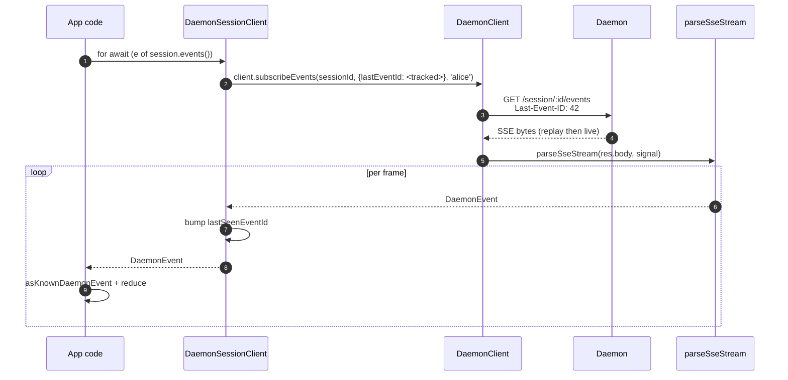
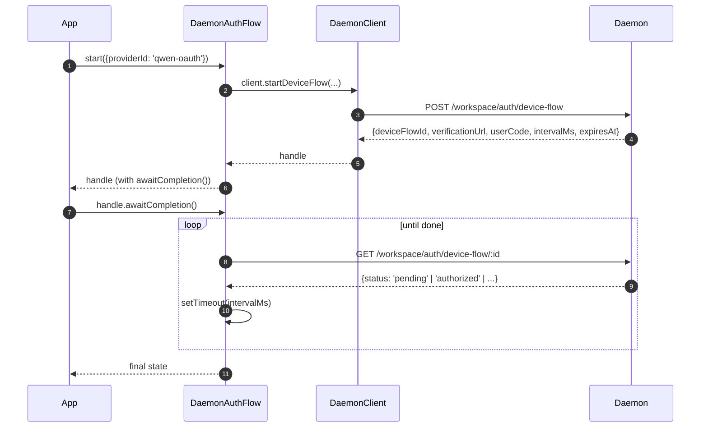

# Клиент демона TypeScript SDK

## Обзор

`packages/sdk-typescript/src/daemon/` — это **клиент демона TypeScript SDK**. Это канонический способ подключения к работающему демону `qwen serve` из любого узла TypeScript/JavaScript (собственный TUI-адаптер CLI, бэкенды канальных ботов, компаньон для IDE VS Code, пользовательские скрипты и серверные веб-бэкенды). Все остальные адаптеры зависят от него.

Структура пакета намеренно компактна:

| Файл                     | Содержимое                                                                                                                              |
| ------------------------ | --------------------------------------------------------------------------------------------------------------------------------------- |
| `index.ts`               | Публичный модуль (`DaemonClient`, `DaemonSessionClient`, `DaemonAuthFlow`, `parseSseStream`, редукторы событий, типы).                  |
| `DaemonClient.ts`        | Низкоуровневая HTTP/SSE-обёртка — один метод на маршрут `qwen-serve-protocol.md`.                                                       |
| `DaemonSessionClient.ts` | Сессионная обёртка с отслеживанием повторного воспроизведения SSE.                                                                      |
| `DaemonAuthFlow.ts`      | Высокоуровневый помощник для OAuth Device Flow.                                                                                         |
| `sse.ts`                 | `parseSseStream` (парсер NDJSON/SSE-фреймов).                                                                                           |
| `events.ts`              | `asKnownDaemonEvent`, `reduceDaemonSessionEvent`, `reduceDaemonAuthEvent` (см. [`09-event-schema.md`](./09-event-schema.md)).           |
| `types.ts`               | `DaemonCapabilities`, `DaemonSession`, `DaemonEvent`, `PermissionResponse`, `PromptResult`, типы MCP / агентов / памяти / аутентификации. |

Пошаговый пример находится в [`../examples/daemon-client-quickstart.md`](../examples/daemon-client-quickstart.md); этот документ — справочник по архитектуре и контрактам.

## Обязанности

- Предоставить один метод TypeScript на каждый HTTP-маршрут демона.
- Правильно проставлять bearer-токен и заголовок `X-Qwen-Client-Id` в каждом запросе.
- Комбинировать таймауты на вызов с предоставленным вызывающим кодом `AbortSignal` (не прерывая долгоживущие SSE).
- Потоково передавать и парсить SSE-фреймы в типизированные `DaemonEvent`.
- Отслеживать `lastSeenEventId` для каждой сессии, чтобы при переподключении корректно воспроизводить события.
- Предоставлять интерфейс аутентификации через Device Flow, опрашивающий демона с заданными им интервалами.

## Архитектура

### `DaemonClient` (`DaemonClient.ts`)

Конструктор:

```ts
new DaemonClient({
  baseUrl: string,                  // по умолчанию 'http://127.0.0.1:4170'
  token?: string,
  fetch?: typeof globalThis.fetch,  // вставляется для тестов
  fetchTimeoutMs?: number,          // 0 = отключено; по умолчанию DEFAULT_FETCH_TIMEOUT_MS
});
```

Группы методов (каждый метод принимает необязательный `clientId` для заголовка `X-Qwen-Client-Id`):

| Группа               | Методы                                                                                                                                                                                                                                                                                    |
| -------------------- | ----------------------------------------------------------------------------------------------------------------------------------------------------------------------------------------------------------------------------------------------------------------------------------------- |
| Базовые              | `health()`, `capabilities()`, `auth` (ленивый аксессор `DaemonAuthFlow`)                                                                                                                                                                                                                  |
| Сессии               | `createOrAttachSession`, `loadSession`, `resumeSession`, `listSessions`, `closeSession`, `setSessionMetadata`, `getSessionContext`, `getSessionSupportedCommands`, `setSessionApprovalMode`, `setSessionModel`                                                                             |
| Промптинг            | `prompt`, `cancel`, `heartbeat`                                                                                                                                                                                                                                                           |
| События              | `subscribeEvents` (генератор SSE), `subscribeEventsStream` (сырой ответ)                                                                                                                                                                                                                  |
| Разрешения           | `respondToPermission`, `respondToSessionPermission`                                                                                                                                                                                                                                       |
| Снимки workspace     | `getWorkspaceMcp`, `getWorkspaceSkills`, `getWorkspaceProviders`, `getWorkspaceEnv`, `getWorkspacePreflight`                                                                                                                                                                               |
| Изменения workspace  | `writeWorkspaceMemory`, `readWorkspaceMemory`, `listWorkspaceAgents`, `getWorkspaceAgent`, `createWorkspaceAgent`, `updateWorkspaceAgent`, `deleteWorkspaceAgent`, `toggleWorkspaceTool`, `restartMcpServer`, `initializeWorkspace`                                                         |
| Файлы                | `readFile`, `readFileBytes`, `writeFile`, `editFile`, `listDirectory`, `globPaths`, `statPath`                                                                                                                                                                                            |
| Аутентификация       | `startDeviceFlow`, `pollDeviceFlow`, `cancelDeviceFlow`, `getAuthStatus`                                                                                                                                                                                                                  |

### `fetchWithTimeout`

Каждый запрос проходит через `fetchWithTimeout`. Ключевые детали:

- **Чтение тела находится в области действия таймера.** В предыдущих реализациях таймер очищался при получении заголовков; если прокси зависал в середине тела, `await res.json()` мог висеть дольше `fetchTimeoutMs`. Текущая версия передаёт код чтения тела как колбэк, так что таймер покрывает как получение заголовков, так и потребление тела.
- **`perCallTimeoutMs`** позволяет отдельному вызову переопределить таймаут по умолчанию для всего клиента. Самый заметный вызывающий код — `restartMcpServer`: SDK использует `MCP_RESTART_DEFAULT_TIMEOUT_MS = 330_000` (5 мин 30 с). Собственный `MCP_RESTART_TIMEOUT_MS` демона составляет ровно 300 с; если бы клиент совпадал с этим значением, перезапуск, завершающийся около 300 с, мог бы проиграть гонку, пока демон сериализует и отправляет структурированный ответ, что привело бы к ложноположительной ошибке `TimeoutError`. Дополнительные 30 с покрывают сериализацию, передачу по сети и декодирование на обеих сторонах. Вызывающие коды, которым нужен более строгий бюджет, могут передать `timeoutMs`; передача `0` отключает таймаут.
- **`AbortSignal.any`** объединяет сигнал вызывающего кода с сигналом таймера вызова, так что отмена вызывающим кодом и таймаут вызова корректно прерывают запрос.
- **`AbortController` + отменяемый `setTimeout`** вместо `AbortSignal.timeout()` — чтобы быстро разрешающиеся запросы не оставляли ожидающие таймеры в цикле событий. Таймер очищается в блоке `finally`.
- **Потоковые конечные точки (`subscribeEvents`) обходят таймаут** — долгоживущие SSE не должны им прерываться.

### `DaemonSessionClient` (`DaemonSessionClient.ts`)

Привязывается к одной сессии и автоматически отслеживает `lastSeenEventId`, чтобы повторное воспроизведение SSE и переподключение работали без дополнительного состояния вызывающего кода.

```ts
class DaemonSessionClient {
  readonly client: DaemonClient;
  readonly session: DaemonSession;
  readonly state: DaemonSessionState;
  private lastSeenEventId: number | undefined;

  static createOrAttach(client, req?): Promise<DaemonSessionClient>;
  static load(client, sessionId, req?): Promise<DaemonSessionClient>;
  static resume(client, sessionId, req?): Promise<DaemonSessionClient>;

  events(opts?: DaemonSessionSubscribeOptions): AsyncIterable<DaemonEvent>;
  prompt(req: PromptRequest): Promise<PromptResult>;
  cancel(): Promise<void>;
  respondToPermission(...): Promise<PermissionResponse>;
  setModel(modelServiceId): Promise<SetModelResult>;
  heartbeat(): Promise<HeartbeatResult>;
  setMetadata(metadata): Promise<SessionMetadataResult>;
  close(): Promise<void>;
}
```

`events()` проксирует `client.subscribeEvents` с `resume: true` по умолчанию — он передаёт отслеживаемый `lastSeenEventId`, так что при переподключении воспроизведение начинается с того места, где остановилась предыдущая подписка. Каждое полученное событие увеличивает `lastSeenEventId`.

### `DaemonAuthFlow` (`DaemonAuthFlow.ts`)

```ts
class DaemonAuthFlow {
  start(opts: { providerId, ... }): Promise<DaemonAuthFlowHandle>;
}
interface DaemonAuthFlowHandle {
  deviceFlowId: string;
  providerId: string;
  expiresAt: string;
  verificationUrl: string;
  userCode: string;
  awaitCompletion(opts?): Promise<DaemonAuthDeviceFlowState>;
  cancel(): Promise<void>;
}
```

`awaitCompletion()` опрашивает `GET /workspace/auth/device-flow/:id` с интервалом `intervalMs`, заданным демоном, пока поток не станет `authorized`, `failed` или `cancelled`. Конструкция ленивая — доступ через `client.auth`, так что клиенты, никогда не использующие аутентификацию, не несут затрат на выделение ресурсов.

### `parseSseStream` (`sse.ts`)

Преобразует `Response.body` (`ReadableStream<Uint8Array>`) в `AsyncIterable<DaemonEvent>`. Обрабатывает:

- Фрейминг LF и CRLF.
- Ограничение переполнения буфера (16 МиБ) — защитная граница от демона, отправляющего один абсурдно большой фрейм.
- Подключение `AbortSignal` — прерывание закрывает поток и итератор.
- Фреймы, содержащие только комментарии, и неизвестные типы событий (передаются как `DaemonEvent`; потребители SDK сужают тип downstream через `asKnownDaemonEvent`).

### Типы (`types.ts`)

Примечательные экспорты: `DaemonCapabilities`, `DaemonSession` (`{ sessionId, workspaceCwd, attached, clientId?, createdAt? }`), `DaemonEvent`, `DaemonSessionState`, `DaemonSessionContextStatus`, `DaemonSessionSupportedCommandsStatus`, `PermissionResponse`, `PromptResult`, `HeartbeatResult`, `SetModelResult`, `SessionMetadataResult`, а также типы результатов MCP / агентов / памяти / аутентификации.

## Рабочий процесс

### Создание/подключение + первый промпт


### Подписка с воспроизведением



### Аутентификация через Device Flow



`qwen-oauth` — это устаревший идентификатор провайдера v1. Бесплатный уровень Qwen OAuth был прекращён 2026-04-15, поэтому новые клиенты должны предпочитать текущие поддерживаемые провайдеры аутентификации, когда они доступны.

## Состояние и жизненный цикл

- `DaemonClient` не поддерживает соединение; при создании ничего не происходит. Каждый метод открывает новый `fetch`.
- `DaemonSessionClient` сохраняет `lastSeenEventId` между вызовами `events()`; при переподключении воспроизведение начинается с последнего просмотренного события.
- `DaemonAuthFlow` ленивый — `client.auth` создаёт его при первом обращении.
- Итератор SSE закрывается, когда (а) демон завершает поток, (б) срабатывает `AbortSignal.abort()`, (в) потребитель выходит из цикла `for await`, или (г) достигается ограничение буфера (16 МиБ).

## Зависимости

- `globalThis.fetch` (встроенный в Node 18+, браузер, undici и т.д.). Вставляется через `DaemonClient` для тестов.
- Нативные `AbortController` / `AbortSignal.any` / `setTimeout`.
- Нет транзитивных зависимостей от `@qwen-code/qwen-code-core` или `@qwen-code/acp-bridge` — пакет SDK полностью отделён, чтобы внешние потребители не тянули внутренности демона.

## Подпакет `ui/*` ([#4328](https://github.com/QwenLM/qwen-code/pull/4328) + [#4353](https://github.com/QwenLM/qwen-code/pull/4353))

SDK также экспортирует `packages/sdk-typescript/src/daemon/ui/` — набор нейтральных к среде примитивов, которые преобразуют события демона в блоки транскрипта:

- `normalizeDaemonEvent(evt)` отображает 43 известных проводных события демона в 37 удобных для UI значений `DaemonUiEventType`; немоделированные или некорректные события нормализуются в `debug`.
- `createDaemonTranscriptState()` плюс `reduceDaemonTranscriptEvents(state, events)` проецирует UI-события в `DaemonTranscriptBlock[]`.
- `createDaemonTranscriptStore()` оборачивает подписку/диспатч.
- `render.ts` / `terminal.ts` предоставляют базовые рендереры для HTML и терминала, а `toolPreview.ts` создаёт сводки вызовов инструментов.
- Селекторы включают `selectTranscriptBlocksOrderedByEventId`, `selectPendingPermissionBlocks`, `selectCurrentTool`, `selectApprovalMode`, `selectToolProgress`, `selectSubagentChildBlocks`, `formatMissedRange` и `formatBlockTimestamp`.
- Публичные константы включают `DAEMON_PLAN_TOOL_CALL_ID`.
- `conformance.ts` содержит набор тестов для проверки согласованности между средами.

Первым потребителем в производстве является `packages/webui/src/daemon/` через React-компонент `DaemonSessionProvider`. Подробная архитектура, глоссарий, таблица селекторов и связь с устаревшим `DaemonTuiAdapter` описаны в [`14-cli-tui-adapter.md`](./14-cli-tui-adapter.md).

Подпакет экспортируется из подпути `@qwen-code/sdk/daemon`. Существующий код, использующий `import { DaemonClient }`, не затрагивается.

## Конфигурация

| Параметр            | Где                                  | Эффект                                                                                               |
| ------------------- | ------------------------------------ | ---------------------------------------------------------------------------------------------------- |
| `baseUrl`           | Конструктор `DaemonClient`           | URL демона; завершающие слэши удаляются.                                                             |
| `token`             | Конструктор `DaemonClient`           | Проставляется как `Authorization: Bearer`.                                                           |
| `fetch`             | Конструктор `DaemonClient`           | Точка внедрения для тестов.                                                                          |
| `fetchTimeoutMs`    | Конструктор `DaemonClient`           | Таймаут на вызов; `0` = отключено.                                                                  |
| `clientId`          | Необязательный аргумент методов      | Заголовок `X-Qwen-Client-Id` (см. [`08-session-lifecycle.md`](./08-session-lifecycle.md)).           |
| `lastEventId`       | Конструктор `DaemonSessionClient`    | Начальный курсор воспроизведения.                                                                    |
| `maxQueued`         | Опция подписки                       | `?maxQueued=N` для SSE-маршрута; сначала проверьте `caps.features.slow_client_warning`.              |
| `perCallTimeoutMs`  | На уровне метода (например, `restartMcpServer`) | Переопределяет таймаут для всего клиента.                                                    |

## Предостережения и известные ограничения

- **`fetchTimeoutMs` применяется к вызову, а не к соединению.** Длительное чтение тела использует общий таймер. Демон, передающий ответы в потоке, должен переопределить таймаут для вызова или установить его в `0`.
- **SSE обходит таймаут fetch** — долгоживущие SSE-соединения не прерываются `fetchTimeoutMs`. Используйте `AbortSignal` для отмены со стороны вызывающего кода.
- **Ограничение буфера `parseSseStream` — 16 МиБ** как защитная граница. Один фрейм больше этого размера прерывает итератор (демон никогда не отправляет такие фреймы легитимно).
- **`asKnownDaemonEvent` возвращает `undefined` для нераспознанных типов событий.** Потребители SDK должны обрабатывать эту ветвь, не предполагая, что объединение исчерпывающее; это контракт обратной совместимости. Нераспознанные события увеличивают `DaemonSessionViewState.unrecognizedKnownEventCount`.
- **`client_evicted`, `slow_client_warning`, `stream_error` отсутствуют в кольце воспроизведения.** При переподключении после вытеснения события берутся из кольца демона; вы не увидите фрейм вытеснения снова.
- **`DaemonClient` не выполняет автоматические повторы.** Сбои сети приводят к отклонению; стратегия переподключения/воспроизведения — ответственность вызывающего кода (`DaemonSessionClient.events()` упрощает воспроизведение, но переподключение всё равно выполняется на каждый вызов).

## Ссылки

- `packages/sdk-typescript/src/daemon/DaemonClient.ts`
- `packages/sdk-typescript/src/daemon/DaemonSessionClient.ts`
- `packages/sdk-typescript/src/daemon/DaemonAuthFlow.ts`
- `packages/sdk-typescript/src/daemon/sse.ts`
- `packages/sdk-typescript/src/daemon/events.ts`
- `packages/sdk-typescript/src/daemon/types.ts`
- Полное пошаговое руководство: [`../examples/daemon-client-quickstart.md`](../examples/daemon-client-quickstart.md).