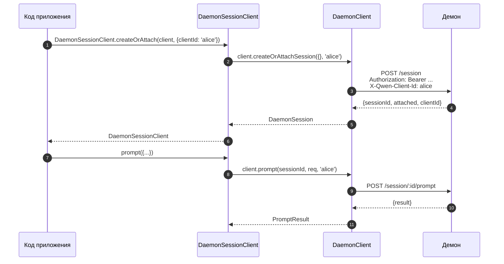
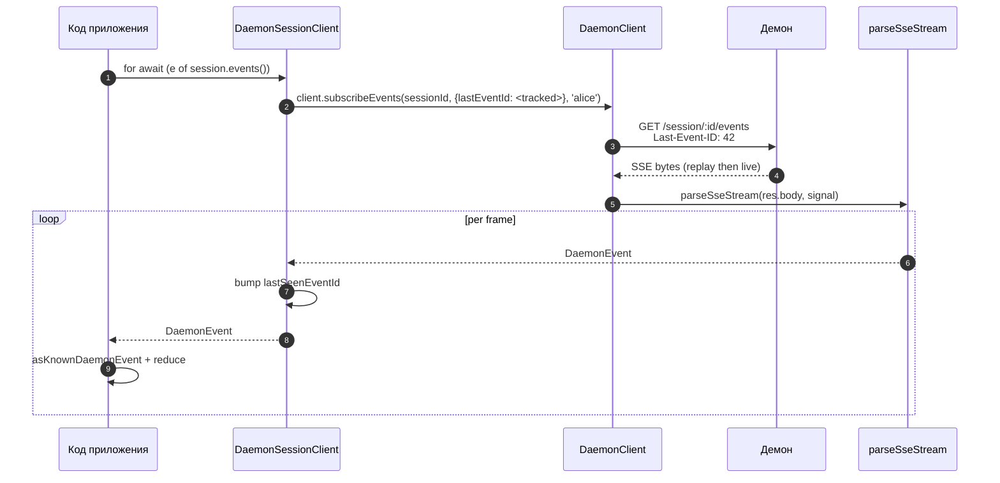
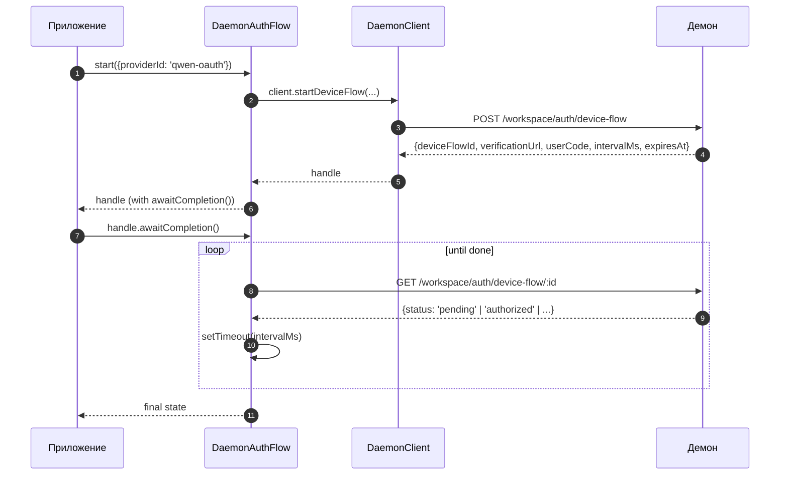

# Клиент демона TypeScript SDK

## Обзор

`packages/sdk-typescript/src/daemon/` — это **клиент демона TypeScript SDK**. Это каноничный способ подключения к работающему демону `qwen serve` из любого хоста на TypeScript / JavaScript (собственный TUI-адаптер CLI, бэкенды каналов ботов, IDE-компаньон для VS Code, пользовательские скрипты и серверные веб-бэкенды). Все остальные адаптеры зависят от него.

Структура пакета намеренно минималистична:

| Файл                     | Поверхность                                                                                                                        |
| ------------------------ | ---------------------------------------------------------------------------------------------------------------------------------- |
| `index.ts`               | Публичный barrel (экспорты `DaemonClient`, `DaemonSessionClient`, `DaemonAuthFlow`, `parseSseStream`, редьюсеры событий, типы).    |
| `DaemonClient.ts`        | Низкоуровневый HTTP/SSE-фасад — по одному методу на каждый маршрут из `qwen-serve-protocol.md`.                                    |
| `DaemonSessionClient.ts` | Обертка для сессии с отслеживанием повтора SSE.                                                                                    |
| `DaemonAuthFlow.ts`      | Высокоуровневый хелпер для OAuth device-flow.                                                                                      |
| `sse.ts`                 | `parseSseStream` (парсер фрейминга NDJSON / SSE).                                                                                  |
| `events.ts`              | `asKnownDaemonEvent`, `reduceDaemonSessionEvent`, `reduceDaemonAuthEvent` (см. [`09-event-schema.md`](./09-event-schema.md)).      |
| `types.ts`               | `DaemonCapabilities`, `DaemonSession`, `DaemonEvent`, `PermissionResponse`, `PromptResult`, типы MCP / агента / памяти / auth.    |

Пошаговый пример находится в [`../examples/daemon-client-quickstart.md`](../examples/daemon-client-quickstart.md); этот документ представляет собой справочник по архитектуре и контрактам.

## Функции

- Предоставлять по одному методу TypeScript для каждого HTTP-маршрута демона.
- Корректно добавлять bearer-токен и заголовок `X-Qwen-Client-Id` в каждый запрос.
- Композировать таймауты вызовов с переданным вызывающим кодом `AbortSignal` (не прерывая долгоживущие SSE-соединения).
- Принимать в потоке и парсить SSE-фреймы в типизированные `DaemonEvent`.
- Отслеживать `lastSeenEventId` для каждой сессии, чтобы переподключения корректно воспроизводили пропущенные события.
- Предоставлять интерфейс аутентификации device-flow, который выполняет опрос с интервалами, заданными демоном.

## Архитектура

### `DaemonClient` (`DaemonClient.ts`)

Конструктор:

```ts
new DaemonClient({
  baseUrl: string,                  // default 'http://127.0.0.1:4170'
  token?: string,
  fetch?: typeof globalThis.fetch,  // injectable for tests
  fetchTimeoutMs?: number,          // 0 = disabled; default DEFAULT_FETCH_TIMEOUT_MS
});
```

Группы методов (каждый метод принимает опциональный `clientId` для добавления заголовка `X-Qwen-Client-Id`):

| Группа                  | Методы                                                                                                                                                                                                                          |
| ----------------------- | ------------------------------------------------------------------------------------------------------------------------------------------------------------------------------------------------------------------------------- |
| Служебные               | `health()`, `capabilities()`, `auth` (ленивый аксессор `DaemonAuthFlow`)                                                                                                                                                        |
| Сессии                  | `createOrAttachSession`, `loadSession`, `resumeSession`, `listSessions`, `closeSession`, `setSessionMetadata`, `getSessionContext`, `getSessionSupportedCommands`, `setSessionApprovalMode`, `setSessionModel`                  |
| Промпты                 | `prompt`, `cancel`, `heartbeat`                                                                                                                                                                                                 |
| События                 | `subscribeEvents` (SSE-генератор), `subscribeEventsStream` (сырой ответ)                                                                                                                                                        |
| Разрешения              | `respondToPermission`, `respondToSessionPermission`                                                                                                                                                                             |
| Снимки рабочего пространства | `getWorkspaceMcp`, `getWorkspaceSkills`, `getWorkspaceProviders`, `getWorkspaceEnv`, `getWorkspacePreflight`                                                                                                                |
| Изменения рабочего пространства | `writeWorkspaceMemory`, `readWorkspaceMemory`, `listWorkspaceAgents`, `getWorkspaceAgent`, `createWorkspaceAgent`, `updateWorkspaceAgent`, `deleteWorkspaceAgent`, `toggleWorkspaceTool`, `restartMcpServer`, `initializeWorkspace` |
| Файлы                   | `readFile`, `readFileBytes`, `writeFile`, `editFile`, `listDirectory`, `globPaths`, `statPath`                                                                                                                                  |
| Аутентификация          | `startDeviceFlow`, `pollDeviceFlow`, `cancelDeviceFlow`, `getAuthStatus`                                                                                                                                                        |

### `fetchWithTimeout`

Каждый запрос проходит через `fetchWithTimeout`. Критически важные детали:

- **Чтение тела запроса находится в области действия таймера.** В предыдущих реализациях таймер сбрасывался при получении заголовков; если прокси зависал в середине передачи тела, `await res.json()` мог зависнуть дольше `fetchTimeoutMs`. Текущая реализация передает код чтения тела как колбэк, поэтому таймер охватывает как получение заголовков, ТАК и чтение тела.
- **`perCallTimeoutMs`** позволяет одному вызову переопределить дефолтный таймаут для всего клиента. Самый заметный вызывающий код — `restartMcpServer`: SDK использует `MCP_RESTART_DEFAULT_TIMEOUT_MS = 330_000` (5 мин 30 сек). Собственный таймаут демона `MCP_RESTART_TIMEOUT_MS` составляет ровно 300 сек; если бы клиент использовал то же значение, перезапуск, завершающийся около 300 сек, мог бы проиграть гонку, пока демон сериализует и отправляет структурированный ответ, что привело бы к ложному срабатыванию `TimeoutError`. Дополнительные 30 сек покрывают сериализацию, передачу по сети и декодирование на обеих сторонах. Вызывающий код, которому требуется более жесткий лимит, может передать `timeoutMs`; передача `0` отключает таймаут.
- **`AbortSignal.any`** комбинирует сигнал, переданный вызывающим кодом, с сигналом таймера вызова, поэтому и отмена вызывающим кодом, и таймаут вызова корректно прерывают операцию.
- **`AbortController` + отменяемый `setTimeout`** вместо `AbortSignal.timeout()`, чтобы быстро завершающиеся запросы не оставляли висящие таймеры в цикле событий. Таймер очищается в блоке `finally`.
- **Потоковые эндпоинты (`subscribeEvents`) обходят таймаут** — долгоживущие SSE не должны прерываться им.

### `DaemonSessionClient` (`DaemonSessionClient.ts`)

Привязывается к одной сессии и автоматически отслеживает `lastSeenEventId`, чтобы повтор и переподключение SSE работали без дополнительного состояния со стороны вызывающего кода.

```ts
class DaemonSessionClient {
  readonly client: DaemonClient;
  readonly session: DaemonSession;
  readonly state: DaemonSessionState;
  private lastSeenEventId: number | undefined;

  static createOrAttach(client, req?): Promise<DaemonSessionClient>;
  static load(client, sessionId, req?): Promise<DaemonSessionClient>;
  static resume(client, sessionId, req?): Promise<DaemonSessionClient>;

  events(opts?: DaemonSessionSubscribeOptions): AsyncIterable<DaemonEvent>;
  prompt(req: PromptRequest): Promise<PromptResult>;
  cancel(): Promise<void>;
  respondToPermission(...): Promise<PermissionResponse>;
  setModel(modelServiceId): Promise<SetModelResult>;
  heartbeat(): Promise<HeartbeatResult>;
  setMetadata(metadata): Promise<SessionMetadataResult>;
  close(): Promise<void>;
}
```

`events()` проксирует `client.subscribeEvents` с параметром `resume: true` по умолчанию — он передает отслеживаемый `lastSeenEventId`, чтобы при переподключении воспроизведение начиналось с того места, где остановилась предыдущая подписка. Каждое полученное событие увеличивает `lastSeenEventId`.

### `DaemonAuthFlow` (`DaemonAuthFlow.ts`)

```ts
class DaemonAuthFlow {
  start(opts: { providerId, ... }): Promise<DaemonAuthFlowHandle>;
}
interface DaemonAuthFlowHandle {
  deviceFlowId: string;
  providerId: string;
  expiresAt: string;
  verificationUrl: string;
  userCode: string;
  awaitCompletion(opts?): Promise<DaemonAuthDeviceFlowState>;
  cancel(): Promise<void>;
}
```

`awaitCompletion()` опрашивает `GET /workspace/auth/device-flow/:id` с интервалом `intervalMs`, заданным демоном, пока поток не перейдет в состояние `authorized`, `failed` или `cancelled`. Он создается лениво через `client.auth`, поэтому клиенты, которые никогда не взаимодействуют с аутентификацией, не несут затрат на выделение памяти.

### `parseSseStream` (`sse.ts`)

Преобразует `Response.body` (`ReadableStream<Uint8Array>`) в `AsyncIterable<DaemonEvent>`. Обрабатывает:

- Фрейминг LF и CRLF.
- Ограничение переполнения буфера (16 МиБ) — защитный лимит на случай, если демон отправит один абсурдно большой фрейм.
- Интеграция AbortSignal — прерывание закрывает поток и итератор.
- Фреймы, содержащие только комментарии, и неизвестные типы событий (передаются как `DaemonEvent`; потребители SDK сужают тип ниже по потоку с помощью `asKnownDaemonEvent`).

### Типы (`types.ts`)

Основные экспорты: `DaemonCapabilities`, `DaemonSession` (`{ sessionId, workspaceCwd, attached, clientId?, createdAt? }`), `DaemonEvent`, `DaemonSessionState`, `DaemonSessionContextStatus`, `DaemonSessionSupportedCommandsStatus`, `PermissionResponse`, `PromptResult`, `HeartbeatResult`, `SetModelResult`, `SessionMetadataResult`, а также типы результатов MCP / агента / памяти / аутентификации.

## Рабочий процесс

### Создание или подключение + первый промпт



### Подписка с воспроизведением



### Аутентификация Device-flow



`qwen-oauth` — это устаревший идентификатор провайдера v1. Бесплатный тариф Qwen OAuth был отменен 15.04.2026, поэтому новым клиентам следует использовать актуальный поддерживаемый провайдер аутентификации, если он доступен.

## Состояние и жизненный цикл

- `DaemonClient` не устанавливает постоянное соединение; при создании ничего не происходит. Каждый метод открывает новый `fetch`.
- `DaemonSessionClient` сохраняет `lastSeenEventId` между вызовами `events()`; переподключения начинают воспроизведение с последнего просмотренного события.
- `DaemonAuthFlow` создается лениво — `client.auth` инициализирует его при первом обращении.
- Итератор SSE закрывается, когда: (a) демон завершает поток, (b) срабатывает `AbortSignal.abort()`, (c) потребитель выходит из цикла `for await` или (d) достигается лимит переполнения буфера (16 МиБ).

## Зависимости

- `globalThis.fetch` (встроен в Node 18+, браузер, undici и т.д.). Можно инжектировать в `DaemonClient` для тестов.
- Нативные `AbortController` / `AbortSignal.any` / `setTimeout`.
- Нет транзитивных зависимостей от `@qwen-code/qwen-code-core` или `@qwen-code/acp-bridge` — пакет SDK полностью независим, чтобы внешние потребители не подключали внутренние компоненты демона.

## Подпакет `ui/*` ([#4328](https://github.com/QwenLM/qwen-code/pull/4328) + [#4353](https://github.com/QwenLM/qwen-code/pull/4353))

SDK также экспортирует `packages/sdk-typescript/src/daemon/ui/` — набор примитивов, не зависящих от хоста, которые преобразуют события демона в блоки транскрипта:

- `normalizeDaemonEvent(evt)` сопоставляет 47 известных сетевых событий демона с 42 удобными для UI значениями `DaemonUiEventType`; немоделированные или некорректные события нормализуются в `debug`.
- `createDaemonTranscriptState()` вместе с `reduceDaemonTranscriptEvents(state, events)` проецирует события UI в `DaemonTranscriptBlock[]`.
- `createDaemonTranscriptStore()` оборачивает подписку / диспетчеризацию.
- `render.ts` / `terminal.ts` предоставляют базовые рендереры для HTML и терминала, а `toolPreview.ts` генерирует сводки вызовов инструментов.
- Селекторы включают `selectTranscriptBlocksOrderedByEventId`, `selectPendingPermissionBlocks`, `selectCurrentTool`, `selectApprovalMode`, `selectToolProgress`, `selectSubagentChildBlocks`, `formatMissedRange` и `formatBlockTimestamp`.
- Публичные константы включают `DAEMON_PLAN_TOOL_CALL_ID`.
- `conformance.ts` содержит набор тестов на кросс-хостовую согласованность.

Первый production-потребитель — `packages/webui/src/daemon/` через React-провайдер `DaemonSessionProvider`. См. [`14-cli-tui-adapter.md`](./14-cli-tui-adapter.md) для подробного описания архитектуры, глоссария, таблицы селекторов и связи с устаревшим `DaemonTuiAdapter`.

Подпакет экспортируется из подпути `@qwen-code/sdk/daemon`. Существующий код, использующий `import { DaemonClient }`, не затрагивается.

## Переподключение по `Last-Event-ID` с помощью SDK

### Автоматическое отслеживание через `DaemonSessionClient`

`DaemonSessionClient` внутренне отслеживает `lastSeenEventId`. Каждое полученное событие с числовым `id` сдвигает курсор. Последующие вызовы `events()` автоматически передают отслеживаемый id как `Last-Event-ID`, поэтому переподключение с воспроизведением работает без дополнительного состояния со стороны вызывающего кода:

```ts
import { DaemonClient, DaemonSessionClient } from '@qwen-code/sdk/daemon';

const client = new DaemonClient({ baseUrl: 'http://127.0.0.1:4170', token });
const session = await DaemonSessionClient.createOrAttach(client);

// Первая подписка — начинает в реальном времени (или с начала кольцевого буфера для новых сессий).
for await (const event of session.events()) {
  console.log(event.type, event.id);
  // session.lastEventId увеличивается для каждого фрейма с id.
  if (shouldStop(event)) break;
}

// Переподключение — автоматически отправляет Last-Event-ID: <последний увиденный id>.
// Демон воспроизводит пропущенные события из кольцевого буфера, затем переходит в режим реального времени.
for await (const event of session.events()) {
  // Сначала приходят фреймы воспроизведения, затем синтетический `replay_complete`,
  // затем события реального времени.
  handleEvent(event);
}
```

### Ручное переподключение с `DaemonClient`

Для более низкоуровневого управления используйте `DaemonClient.subscribeEvents` напрямую и управляйте курсором самостоятельно:

```ts
const client = new DaemonClient({ baseUrl: 'http://127.0.0.1:4170', token });

let cursor: number | undefined; // undefined = только реальное время при первом подключении

async function* subscribe(sessionId: string, signal: AbortSignal) {
  for await (const event of client.subscribeEvents(sessionId, {
    lastEventId: cursor,
    signal,
  })) {
    // Только фреймы с id сдвигают курсор.
    if (event.id !== undefined) {
      cursor = event.id;
    }
    // Обработка разрыва из-за вытеснения из кольцевого буфера.
    if (event.type === 'state_resync_required') {
      // Состояние устарело — перезагружаем полное состояние сессии.
      await client.loadSession(sessionId);
      continue;
    }
    yield event;
  }
}
```

### Переподключение с циклом повторных попыток

SDK **не** выполняет автоматические повторные попытки при сетевых сбоях. Реализуйте цикл повторных попыток вокруг `events()`:

```ts
async function resilientSubscribe(session: DaemonSessionClient) {
  const MAX_RETRIES = 10;
  const BASE_DELAY_MS = 1000;

  for (let attempt = 0; attempt < MAX_RETRIES; attempt++) {
    try {
      // `resume: true` (по умолчанию) передает отслеживаемый lastSeenEventId.
      for await (const event of session.events()) {
        attempt = 0; // сброс при успешном событии
        handleEvent(event);
      }
      break; // чистое завершение потока
    } catch (err) {
      const delay = BASE_DELAY_MS * 2 ** Math.min(attempt, 5);
      await new Promise((r) => setTimeout(r, delay));
    }
  }
}
```

При переподключении демон воспроизводит события с `id > lastSeenEventId` из своего ограниченного кольцевого буфера (по умолчанию 8000 событий). Если разрыв превышает размер кольцевого буфера, фрейм `state_resync_required` сигнализирует клиенту о необходимости вызвать `loadSession` для полного восстановления состояния.

### Инициализация `lastEventId` при создании

Вызывающий код, который сохраняет курсор между перезапусками процесса, может инициализировать его:

```ts
const session = new DaemonSessionClient({
  client,
  session: { sessionId, workspaceCwd, attached: true },
  lastEventId: persistedCursor, // возобновление с сохраненной позиции
});
```

Значение должно быть конечным неотрицательным целым числом (проверяется при создании). Некорректные значения вызывают ошибку.

## Конфигурация

| Параметр           | Где                                  | Эффект                                                                                  |
| ------------------ | ------------------------------------ | --------------------------------------------------------------------------------------- |
| `baseUrl`          | Конструктор `DaemonClient`           | URL демона; конечные слеши удаляются.                                                   |
| `token`            | Конструктор `DaemonClient`           | Добавляется как `Authorization: Bearer`.                                                |
| `fetch`            | Конструктор `DaemonClient`           | Точка инжекции для тестов.                                                              |
| `fetchTimeoutMs`   | Конструктор `DaemonClient`           | Таймаут вызова; `0` = отключено.                                                        |
| `clientId`         | Опциональный аргумент метода         | Заголовок `X-Qwen-Client-Id` (см. [`08-session-lifecycle.md`](./08-session-lifecycle.md)). |
| `lastEventId`      | Конструктор `DaemonSessionClient`    | Инициализация курсора воспроизведения.                                                  |
| `maxQueued`        | Опция подписки                       | `?maxQueued=N` для SSE-маршрута; сначала проверьте pre-flight `caps.features.slow_client_warning`. |
| `perCallTimeoutMs` | Метод (напр. `restartMcpServer`)     | Переопределяет общий таймаут клиента.                                                   |

## Ограничения и известные нюансы

- **`fetchTimeoutMs` действует для каждого вызова, а не на уровне соединения.** Долгие чтения тела используют общий таймер. Демон, который стримит ответы, должен переопределять таймаут вызова или устанавливать его в `0`.
- **SSE обходит таймаут fetch** — долгоживущие SSE-соединения не прерываются из-за `fetchTimeoutMs`. Используйте `AbortSignal` для отмены со стороны вызывающего кода.
- **Лимит буфера `parseSseStream` составляет 16 МиБ** в качестве защитного ограничения. Один фрейм больше этого размера прерывает итератор (демон никогда легитимно не отправляет такие фреймы).
- **`asKnownDaemonEvent` возвращает `undefined` для нераспознанных типов событий.** Потребители SDK должны обрабатывать эту ветку, а не предполагать, что объединение типов исчерпывающе; это контракт прямой совместимости. Нераспознанные события увеличивают `DaemonSessionViewState.unrecognizedKnownEventCount`.
- **`client_evicted`, `slow_client_warning`, `stream_error` отсутствуют в кольцевом буфере воспроизведения.** Переподключение после вытеснения начинается с кольцевого буфера демона; вы больше не увидите фрейм вытеснения.
- **`DaemonClient` не выполняет автоматические повторные попытки.** Сетевые сбои проявляются как отклонения (rejections); стратегия переподключения / воспроизведения лежит на вызывающем коде (`DaemonSessionClient.events()` упрощает воспроизведение, но переподключение все равно выполняется для каждого вызова).
## Ссылки

- `packages/sdk-typescript/src/daemon/DaemonClient.ts`
- `packages/sdk-typescript/src/daemon/DaemonSessionClient.ts`
- `packages/sdk-typescript/src/daemon/DaemonAuthFlow.ts`
- `packages/sdk-typescript/src/daemon/sse.ts`
- `packages/sdk-typescript/src/daemon/events.ts`
- `packages/sdk-typescript/src/daemon/types.ts`
- Пошаговое руководство: [`../examples/daemon-client-quickstart.md`](../examples/daemon-client-quickstart.md).