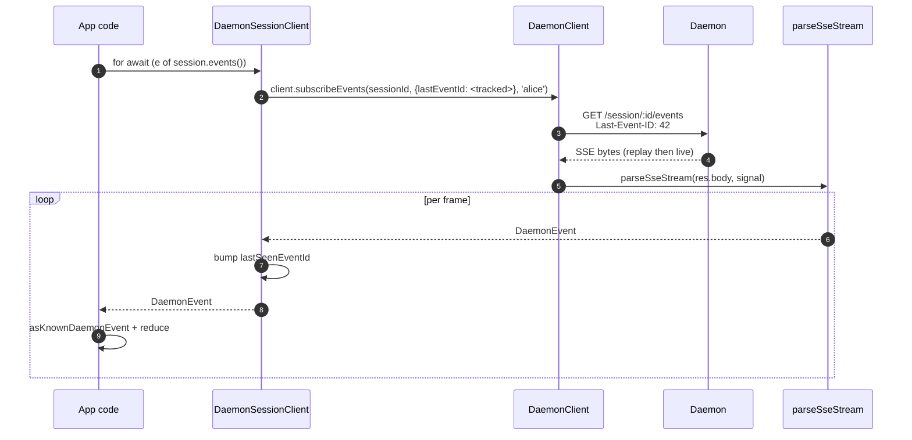
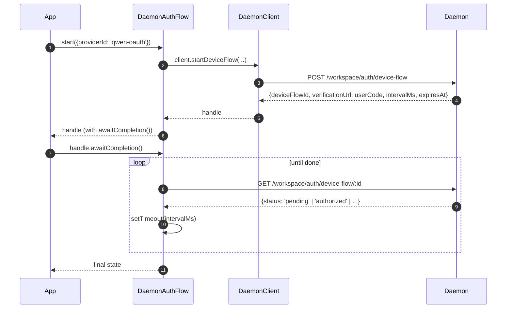

# Клиент демона TypeScript SDK

## Обзор

`packages/sdk-typescript/src/daemon/` — это **клиент демона TypeScript SDK**. Это канонический способ подключения к запущенному демону `qwen serve` из любого TypeScript/JavaScript окружения (собственный TUI-адаптер CLI, бэкенды канальных ботов, компаньон VS Code IDE, пользовательские скрипты и серверные веб-бэкенды). Все остальные адаптеры зависят от него.

Структура пакета намеренно компактна:

| Файл                     | Поверхность                                                                                                                                                  |
| ------------------------ | ------------------------------------------------------------------------------------------------------------------------------------------------------------ |
| `index.ts`               | Публичный barrel (`DaemonClient`, `DaemonSessionClient`, `DaemonAuthFlow`, `parseSseStream`, редьюсеры событий, типы).                                      |
| `DaemonClient.ts`        | Низкоуровневый фасад для HTTP/SSE — один метод на маршрут из `qwen-serve-protocol.md`.                                                                       |
| `DaemonSessionClient.ts` | Обёртка с областью сессии и учётом воспроизведения SSE.                                                                                                      |
| `DaemonAuthFlow.ts`      | Высокоуровневый помощник для OAuth device-flow.                                                                                                              |
| `sse.ts`                 | `parseSseStream` (парсер NDJSON/SSE-фреймов).                                                                                                                |
| `events.ts`              | `asKnownDaemonEvent`, `reduceDaemonSessionEvent`, `reduceDaemonAuthEvent` (см. [`09-event-schema.md`](./09-event-schema.md)).                                |
| `types.ts`               | `DaemonCapabilities`, `DaemonSession`, `DaemonEvent`, `PermissionResponse`, `PromptResult`, MCP / agent / memory / auth types.                               |

Пример использования находится в [`../examples/daemon-client-quickstart.md`](../examples/daemon-client-quickstart.md); этот документ является справочником по архитектуре и контрактам.

## Обязанности

- Предоставлять один метод TypeScript для каждого HTTP-маршрута демона.
- Корректно проставлять bearer token и заголовок `X-Qwen-Client-Id` в каждом запросе.
- Устанавливать таймауты для каждого вызова с использованием предоставленного вызывающим кодом `AbortSignal` (не прерывая долгоживущий SSE).
- Стримить и парсить SSE-фреймы в типизированные `DaemonEvent`.
- Отслеживать `lastSeenEventId` для каждой сессии, чтобы корректно воспроизводить события при переподключении.
- Предоставлять поверхность аутентификации через device-flow, опрашивающую демон с заданными интервалами.

## Архитектура

### `DaemonClient` (`DaemonClient.ts`)

Конструктор:

```ts
new DaemonClient({
  baseUrl: string,                  // default 'http://127.0.0.1:4170'
  token?: string,
  fetch?: typeof globalThis.fetch,  // injectable for tests
  fetchTimeoutMs?: number,          // 0 = disabled; default DEFAULT_FETCH_TIMEOUT_MS
});
```

Группы методов (каждый метод принимает необязательный параметр `clientId` для установки заголовка `X-Qwen-Client-Id`):

| Группа                | Методы                                                                                                                                                                                                                             |
| --------------------- | ---------------------------------------------------------------------------------------------------------------------------------------------------------------------------------------------------------------------------------- |
| Системные             | `health()`, `capabilities()`, `auth` (ленивый аксессор `DaemonAuthFlow`)                                                                                                                                                           |
| Сессии                | `createOrAttachSession`, `loadSession`, `resumeSession`, `listSessions`, `closeSession`, `setSessionMetadata`, `getSessionContext`, `getSessionSupportedCommands`, `setSessionApprovalMode`, `setSessionModel`                      |
| Промпты               | `prompt`, `cancel`, `heartbeat`                                                                                                                                                                                                    |
| События               | `subscribeEvents` (генератор SSE), `subscribeEventsStream` (сырой ответ)                                                                                                                                                           |
| Разрешения            | `respondToPermission`, `respondToSessionPermission`                                                                                                                                                                                |
| Снимки рабочего пространства | `getWorkspaceMcp`, `getWorkspaceSkills`, `getWorkspaceProviders`, `getWorkspaceEnv`, `getWorkspacePreflight`                                                                                                                        |
| Изменения рабочего пространства | `writeWorkspaceMemory`, `readWorkspaceMemory`, `listWorkspaceAgents`, `getWorkspaceAgent`, `createWorkspaceAgent`, `updateWorkspaceAgent`, `deleteWorkspaceAgent`, `toggleWorkspaceTool`, `restartMcpServer`, `initializeWorkspace` |
| Файлы                 | `readFile`, `readFileBytes`, `writeFile`, `editFile`, `listDirectory`, `globPaths`, `statPath`                                                                                                                                      |
| Аутентификация        | `startDeviceFlow`, `pollDeviceFlow`, `cancelDeviceFlow`, `getAuthStatus`                                                                                                                                                           |
### `fetchWithTimeout`

Каждый запрос проходит через `fetchWithTimeout`. Критические детали:

- **Body read is inside the timer scope.** (Чтение тела находится в области действия таймера.) Предыдущие реализации очищали таймер при получении заголовков; если прокси зависал в середине тела, `await res.json()` мог зависнуть дольше, чем `fetchTimeoutMs`. Текущая версия передаёт код чтения тела в качестве колбэка, так что таймер покрывает и прибытие заголовков, и потребление тела.
- **`perCallTimeoutMs`** позволяет отдельному вызову переопределить таймаут по умолчанию для всего клиента. Самый заметный вызывающий код — `restartMcpServer`: SDK использует `MCP_RESTART_DEFAULT_TIMEOUT_MS = 330_000` (5 мин 30 с). Таймаут самого демона `MCP_RESTART_TIMEOUT_MS` равен ровно 300 с; если клиент совпадает с этим значением, то перезапуск, завершающийся около 300 с, может проиграть гонку, пока демон сериализует и отправляет свой структурированный ответ, что приведёт к ложному `TimeoutError`. Дополнительные 30 с покрывают сериализацию, сетевую передачу и декодирование на обеих сторонах. Вызывающие коды, которым нужен более жёсткий бюджет, могут передать `timeoutMs`; передача `0` отключает таймаут.
- **`AbortSignal.any`** объединяет сигнал, предоставленный вызывающим кодом, с сигналом таймера для данного вызова, так что отмена вызывающим кодом и таймаут вызова корректно прерывают операцию.
- **`AbortController` + отменяемый `setTimeout`** вместо `AbortSignal.timeout()` — чтобы быстро разрешающиеся запросы не оставляли висеть ожидающие таймеры в цикле событий. Таймер очищается в `finally`.
- **Потоковые конечные точки (`subscribeEvents`) обходят таймаут** — долгоживущий SSE не должен им прерываться.

### `DaemonSessionClient` (`DaemonSessionClient.ts`)

Привязывается к одной сессии и автоматически отслеживает `lastSeenEventId`, чтобы повтор SSE и переподключение работали без дополнительного состояния со стороны вызывающего кода.

```ts
class DaemonSessionClient {
  readonly client: DaemonClient;
  readonly session: DaemonSession;
  readonly state: DaemonSessionState;
  private lastSeenEventId: number | undefined;

  static createOrAttach(client, req?): Promise<DaemonSessionClient>;
  static load(client, sessionId, req?): Promise<DaemonSessionClient>;
  static resume(client, sessionId, req?): Promise<DaemonSessionClient>;

  events(opts?: DaemonSessionSubscribeOptions): AsyncIterable<DaemonEvent>;
  prompt(req: PromptRequest): Promise<PromptResult>;
  cancel(): Promise<void>;
  respondToPermission(...): Promise<PermissionResponse>;
  setModel(modelServiceId): Promise<SetModelResult>;
  heartbeat(): Promise<HeartbeatResult>;
  setMetadata(metadata): Promise<SessionMetadataResult>;
  close(): Promise<void>;
}
```

`events()` делегирует вызов `client.subscribeEvents` с `resume: true` по умолчанию — он передаёт отслеживаемый `lastSeenEventId`, так что при переподключении повтор идёт с того места, на котором остановилась предыдущая подписка. Каждое полученное событие увеличивает `lastSeenEventId`.

### `DaemonAuthFlow` (`DaemonAuthFlow.ts`)

```ts
class DaemonAuthFlow {
  start(opts: { providerId, ... }): Promise<DaemonAuthFlowHandle>;
}
interface DaemonAuthFlowHandle {
  deviceFlowId: string;
  providerId: string;
  expiresAt: string;
  verificationUrl: string;
  userCode: string;
  awaitCompletion(opts?): Promise<DaemonAuthDeviceFlowState>;
  cancel(): Promise<void>;
}
```

`awaitCompletion()` опрашивает `GET /workspace/auth/device-flow/:id` с интервалом `intervalMs`, предоставленным демоном, пока поток не станет `authorized`, `failed` или `cancelled`. Он создаётся лениво через `client.auth`, так что клиенты, которые никогда не используют аутентификацию, не несут затрат на выделение памяти.

### `parseSseStream` (`sse.ts`)

Преобразует `Response.body` (`ReadableStream<Uint8Array>`) в `AsyncIterable<DaemonEvent>`. Обрабатывает:

- Разделение строк по LF и CRLF.
- Ограничение переполнения буфера (16 МиБ) — защитная граница от ситуаций, когда демон отправляет один неоправданно большой кадр.
- Подключение AbortSignal — прерывание закрывает поток и итератор.
- Кадры, содержащие только комментарии, и неизвестные типы событий (пропускаются как `DaemonEvent`; потребители SDK сужают их в коде с помощью `asKnownDaemonEvent`).

### Типы (`types.ts`)

Примечательные экспорты: `DaemonCapabilities`, `DaemonSession` (`{ sessionId, workspaceCwd, attached, clientId?, createdAt? }`), `DaemonEvent`, `DaemonSessionState`, `DaemonSessionContextStatus`, `DaemonSessionSupportedCommandsStatus`, `PermissionResponse`, `PromptResult`, `HeartbeatResult`, `SetModelResult`, `SessionMetadataResult`, а также типы результатов для MCP / агента / памяти / аутентификации.

## Рабочий процесс

### Создание-или-присоединение + первый prompt


### Подписка с повтором


### Device-flow auth



`qwen-oauth` — это идентификатор провайдера устаревшей версии v1. Бесплатный уровень Qwen OAuth был прекращён 15 апреля 2026 года, поэтому новые клиенты должны предпочитать провайдера аутентификации, который в настоящее время поддерживается, когда таковой доступен.

## Состояние и жизненный цикл

- `DaemonClient` не поддерживает соединение; при создании ничего не происходит. Каждый метод открывает новый `fetch`.
- `DaemonSessionClient` сохраняет `lastSeenEventId` между вызовами `events()`; при переподключении воспроизводит события, начиная с последнего просмотренного.
- `DaemonAuthFlow` ленивый — `client.auth` создаёт его при первом обращении.
- Итератор SSE закрывается, когда (а) демон завершает поток, (б) срабатывает `AbortSignal.abort()`, (в) потребитель выходит из цикла `for await`, или (г) достигнут лимит переполнения буфера (16 МиБ).

## Зависимости

- `globalThis.fetch` (встроенный в Node 18+, браузер, undici и т.д.). Можно внедрить через `DaemonClient` для тестов.
- Нативные `AbortController` / `AbortSignal.any` / `setTimeout`.
- Нет транзитивных зависимостей от `@qwen-code/qwen-code-core` или `@qwen-code/acp-bridge` — пакет SDK полностью развязан, чтобы внешние потребители не тянули внутренности демона.

## Подпакет `ui/*` ([#4328](https://github.com/QwenLM/qwen-code/pull/4328) + [#4353](https://github.com/QwenLM/qwen-code/pull/4353))

SDK также экспортирует `packages/sdk-typescript/src/daemon/ui/` — набор независимых от хоста примитивов, которые преобразуют события демона в блоки транскрипта:

- `normalizeDaemonEvent(evt)` отображает 47 известных событий протокола демона в 37 удобных для UI значений `DaemonUiEventType`; немоделированные или повреждённые события нормализуются в `debug`.
- `createDaemonTranscriptState()` плюс `reduceDaemonTranscriptEvents(state, events)` проецирует UI-события в `DaemonTranscriptBlock[]`.
- `createDaemonTranscriptStore()` оборачивает subscribe / dispatch.
- `render.ts` / `terminal.ts` предоставляют базовые рендереры для HTML и терминала, а `toolPreview.ts` создаёт сводки вызовов инструментов.
- Селекторы включают `selectTranscriptBlocksOrderedByEventId`, `selectPendingPermissionBlocks`, `selectCurrentTool`, `selectApprovalMode`, `selectToolProgress`, `selectSubagentChildBlocks`, `formatMissedRange` и `formatBlockTimestamp`.
- Публичные константы включают `DAEMON_PLAN_TOOL_CALL_ID`.
- `conformance.ts` содержит набор тестов для проверки согласованности между хостами.

Первый производственный потребитель — `packages/webui/src/daemon/` через React-провайдер `DaemonSessionProvider`. См. [`14-cli-tui-adapter.md`](./14-cli-tui-adapter.md) для подробной архитектуры, глоссария, таблицы селекторов и отношения к устаревшему `DaemonTuiAdapter`.

Подпакет экспортируется из подпути `@qwen-code/sdk/daemon`. Существующий код, делающий `import { DaemonClient }`, остаётся без изменений.

## Конфигурация

| Параметр            | Где                                     | Эффект                                                                                   |
| ------------------- | --------------------------------------- | ---------------------------------------------------------------------------------------- |
| `baseUrl`           | Конструктор `DaemonClient`              | URL демона; завершающие слеши удаляются.                                                 |
| `token`             | Конструктор `DaemonClient`              | Проставляется как `Authorization: Bearer`.                                               |
| `fetch`             | Конструктор `DaemonClient`              | Точка внедрения для тестов.                                                              |
| `fetchTimeoutMs`    | Конструктор `DaemonClient`              | Тайм-аут на один вызов; `0` = отключён.                                                  |
| `clientId`          | Необязательный аргумент каждого метода  | Заголовок `X-Qwen-Client-Id` (см. [`08-session-lifecycle.md`](./08-session-lifecycle.md)). |
| `lastEventId`       | Конструктор `DaemonSessionClient`       | Курсор воспроизведения для начальной точки.                                              |
| `maxQueued`         | Опция при подписке                      | `?maxQueued=N` для SSE-маршрута; сначала проверять `caps.features.slow_client_warning`.  |
| `perCallTimeoutMs`  | Каждый метод (напр. `restartMcpServer`) | Переопределяет тайм-аут, заданный для всего клиента.                                     |

## Предостережения и известные ограничения

- **`fetchTimeoutMs` применяется к каждому вызову, а не на уровне соединения.** Долгие чтения тела разделяют один таймер. Демон, который передаёт ответы потоком, должен переопределять тайм-аут для каждого вызова или устанавливать его в `0`.
- **SSE обходит тайм-аут fetch** — долгоживущие SSE-соединения не прерываются `fetchTimeoutMs`. Используйте `AbortSignal` для отмены со стороны вызывающего кода.
- **Лимит буфера `parseSseStream` составляет 16 МиБ** в качестве защитной границы. Один фрейм, превышающий этот размер, прерывает итератор (демон никогда легитимно не отправляет такие фреймы).
- **`asKnownDaemonEvent` возвращает `undefined` для неизвестных типов событий.** Потребители SDK должны обрабатывать эту ветвь, а не предполагать, что объединение типов исчерпывающее; это контракт для прямой совместимости. Неизвестные события увеличивают счётчик `DaemonSessionViewState.unrecognizedKnownEventCount`.
- **`client_evicted`, `slow_client_warning`, `stream_error` не попадают в кольцо воспроизведения.** При переподключении после вытеснения воспроизведение начинается с кольца демона; вы не увидите кадр вытеснения снова.
- **`DaemonClient` не выполняет автоматические повторные попытки.** Сетевые сбои приводят к отклонению обещания; стратегия переподключения / воспроизведения лежит на вызывающем коде (метод `DaemonSessionClient.events()` упрощает воспроизведение, но переподключение всё равно остаётся на каждый вызов).
## Ссылки

- `packages/sdk-typescript/src/daemon/DaemonClient.ts`
- `packages/sdk-typescript/src/daemon/DaemonSessionClient.ts`
- `packages/sdk-typescript/src/daemon/DaemonAuthFlow.ts`
- `packages/sdk-typescript/src/daemon/sse.ts`
- `packages/sdk-typescript/src/daemon/events.ts`
- `packages/sdk-typescript/src/daemon/types.ts`
- Сквозное руководство: [`../examples/daemon-client-quickstart.md`](../examples/daemon-client-quickstart.md).
