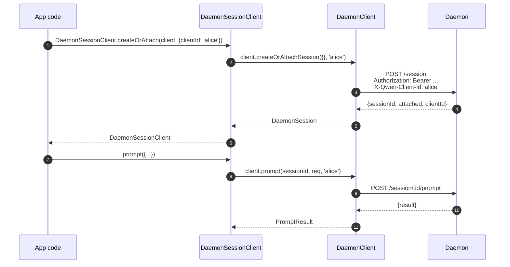
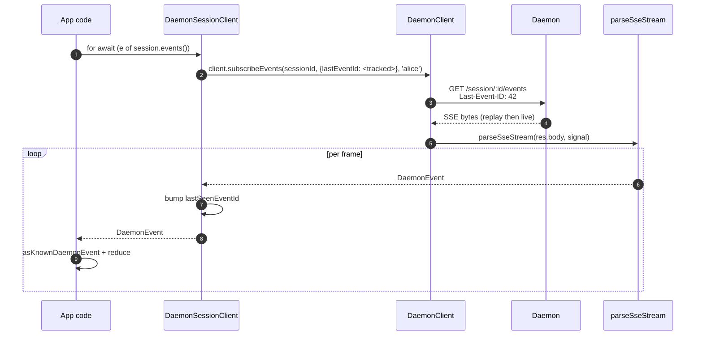
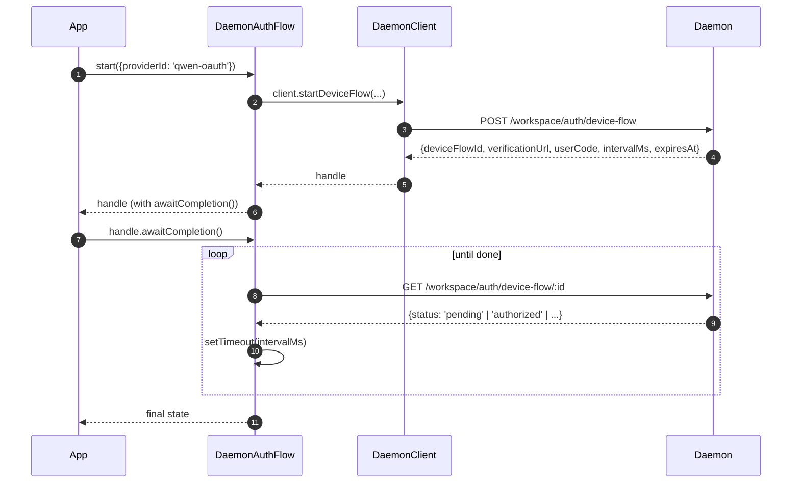

# Клиент демона TypeScript SDK

## Обзор

`packages/sdk-typescript/src/daemon/` — это **клиент демона TypeScript SDK**. Это каноничный способ подключения к работающему демону `qwen serve` из любого хоста на TypeScript / JavaScript (собственный TUI-адаптер CLI, бэкенды каналов ботов, IDE-компаньон для VS Code, пользовательские скрипты и серверные веб-бэкенды). Все остальные адаптеры зависят от него.

Структура пакета намеренно минималистична:

| Файл                     | Публичный интерфейс                                                                                                                |
| ------------------------ | ---------------------------------------------------------------------------------------------------------------------------------- |
| `index.ts`               | Публичный barrel (`DaemonClient`, `DaemonSessionClient`, `DaemonAuthFlow`, `parseSseStream`, редьюсеры событий и типы).            |
| `DaemonClient.ts`        | Низкоуровневый HTTP/SSE фасад — один метод на каждый маршрут из `qwen-serve-protocol.md`.                                          |
| `DaemonSessionClient.ts` | Обертка для сессии с отслеживанием повтора SSE.                                                                                    |
| `DaemonAuthFlow.ts`      | Высокоуровневый хелпер для OAuth device-flow.                                                                                      |
| `sse.ts`                 | `parseSseStream` (парсер фрейминга NDJSON / SSE).                                                                                  |
| `events.ts`              | `asKnownDaemonEvent`, `reduceDaemonSessionEvent`, `reduceDaemonAuthEvent` (см. [`09-event-schema.md`](./09-event-schema.md)).      |
| `types.ts`               | `DaemonCapabilities`, `DaemonSession`, `DaemonEvent`, `PermissionResponse`, `PromptResult`, типы MCP / агента / памяти / auth.    |

Пошаговый пример находится в [`../examples/daemon-client-quickstart.md`](../examples/daemon-client-quickstart.md); этот документ служит справочником по архитектуре и контрактам.

## Ответственность

- Предоставлять один TypeScript-метод для каждого HTTP-маршрута демона.
- Корректно проставлять bearer-токен и `X-Qwen-Client-Id` в каждом запросе.
- Компонировать таймауты для каждого вызова с переданным вызывающим кодом `AbortSignal` (не прерывая долгоживущие SSE-соединения).
- Потоково принимать и парсить SSE-фреймы в типизированные `DaemonEvent`.
- Отслеживать `lastSeenEventId` для каждой сессии, чтобы переподключения корректно воспроизводили пропущенные события.
- Предоставлять интерфейс аутентификации device-flow, который выполняет опрос с интервалами, заданными демоном.

## Архитектура

### `DaemonClient` (`DaemonClient.ts`)

Конструктор:

```ts
new DaemonClient({
  baseUrl: string,                  // default 'http://127.0.0.1:4170'
  token?: string,
  fetch?: typeof globalThis.fetch,  // injectable for tests
  fetchTimeoutMs?: number,          // 0 = disabled; default DEFAULT_FETCH_TIMEOUT_MS
});
```

Группы методов (каждый метод принимает опциональный `clientId` для простановки `X-Qwen-Client-Id`):

| Группа                    | Методы                                                                                                                                                                                                                                                                                                                                                                                                          |
| ------------------------- | --------------------------------------------------------------------------------------------------------------------------------------------------------------------------------------------------------------------------------------------------------------------------------------------------------------------------------------------------------------------------------------------------------------- |
| Служебные                 | `health()`, `capabilities()`, `auth` (ленивый аксессор `DaemonAuthFlow`)                                                                                                                                                                                                                                                                                                                                        |
| Сессии                    | `createOrAttachSession`, `loadSession`, `resumeSession`, `listSessions`, `closeSession`, `setSessionMetadata`, `getSessionContext`, `getSessionSupportedCommands`, `setSessionApprovalMode`, `setSessionModel`                                                                                                                                                                                                  |
| Промпты                   | `prompt`, `cancel`, `heartbeat`                                                                                                                                                                                                                                                                                                                                                                                 |
| События                   | `subscribeEvents` (SSE-генератор), `subscribeEventsStream` (сырой ответ)                                                                                                                                                                                                                                                                                                                                        |
| Разрешения                | `respondToPermission`, `respondToSessionPermission`                                                                                                                                                                                                                                                                                                                                                             |
| Снимки рабочего пространства | `getWorkspaceMcp`, `getWorkspaceSkills`, `getWorkspaceProviders`, `getWorkspaceEnv`, `getWorkspacePreflight`                                                                                                                                                                                                                                                                                                 |
| Изменения рабочего пространства | `addWorkspace`, `updateWorkspace`, `writeWorkspaceMemory`, `readWorkspaceMemory`, `rememberWorkspaceMemory`, `getWorkspaceMemoryRememberTask`, `forgetWorkspaceMemory`, `getWorkspaceMemoryForgetTask`, `dreamWorkspaceMemory`, `getWorkspaceMemoryDreamTask`, `listWorkspaceAgents`, `getWorkspaceAgent`, `createWorkspaceAgent`, `updateWorkspaceAgent`, `deleteWorkspaceAgent`, `setWorkspaceToolEnabled`, `setWorkspaceSkillEnabled`, `restartMcpServer`, `initWorkspace` |
| Файлы                     | `readFile`, `readFileBytes`, `writeFile`, `editFile`, `listDirectory`, `globPaths`, `statPath`                                                                                                                                                                                                                                                                                                                  |
| Аутентификация            | `startDeviceFlow`, `pollDeviceFlow`, `cancelDeviceFlow`, `getAuthStatus`                                                                                                                                                                                                                                                                                                                                        |

### `fetchWithTimeout`

Каждый запрос проходит через `fetchWithTimeout`. Ключевые детали:

- **Чтение тела находится в области действия таймера.** В предыдущих реализациях таймер сбрасывался при получении заголовков; если прокси зависал в середине тела, `await res.json()` мог зависнуть дольше `fetchTimeoutMs`. Текущая реализация передает код чтения тела как колбэк, поэтому таймер покрывает как получение заголовков, так и чтение тела.
- **`perCallTimeoutMs`** позволяет одному вызову переопределить дефолтное значение для всего клиента. Самый заметный вызывающий код — `restartMcpServer`: SDK использует `MCP_RESTART_DEFAULT_TIMEOUT_MS = 330_000` (5 мин 30 сек). Собственный `MCP_RESTART_TIMEOUT_MS` демона равен ровно 300 с; если бы клиент использовал то же значение, перезапуск, завершающийся около 300 с, мог бы проиграть гонку, пока демон сериализует и отправляет свой структурированный ответ, что привело бы к ложному срабатыванию `TimeoutError`. Дополнительные 30 с покрывают сериализацию, передачу по сети и декодирование на обеих сторонах. Вызывающий код, которому требуется более жесткий лимит, может передать `timeoutMs`; передача `0` отключает таймаут.
- **`AbortSignal.any`** компонует сигнал, переданный вызывающим кодом, с сигналом таймера для конкретного вызова, поэтому и отмена вызывающим кодом, и таймаут вызова корректно прерывают операцию.
- **`AbortController` + отменяемый `setTimeout`** вместо `AbortSignal.timeout()`, чтобы быстро завершающиеся запросы не оставляли висящие таймеры в цикле событий. Таймер очищается в блоке `finally`.
- **Потоковые эндпоинты (`subscribeEvents`) обходят таймаут** — долгоживущие SSE не должны прерываться им.

### `DaemonSessionClient` (`DaemonSessionClient.ts`)

Привязывается к одной сессии и автоматически отслеживает `lastSeenEventId`, чтобы повтор и переподключение SSE работали без дополнительного состояния со стороны вызывающего кода.

```ts
class DaemonSessionClient {
  readonly client: DaemonClient;
  readonly session: DaemonSession;
  readonly state: DaemonSessionState;
  private lastSeenEventId: number | undefined;

  static createOrAttach(client, req?): Promise<DaemonSessionClient>;
  static load(client, sessionId, req?): Promise<DaemonSessionClient>;
  static resume(client, sessionId, req?): Promise<DaemonSessionClient>;

  events(opts?: DaemonSessionSubscribeOptions): AsyncIterable<DaemonEvent>;
  prompt(req: PromptRequest): Promise<PromptResult>;
  cancel(): Promise<void>;
  respondToPermission(...): Promise<PermissionResponse>;
  setModel(modelServiceId): Promise<SetModelResult>;
  heartbeat(): Promise<HeartbeatResult>;
  setMetadata(metadata): Promise<SessionMetadataResult>;
  close(): Promise<void>;
}
```

`events()` проксирует `client.subscribeEvents` с `resume: true` по умолчанию — он передает отслеживаемый `lastSeenEventId`, чтобы при переподключении воспроизведение начиналось с того места, где остановилась предыдущая подписка. Каждое полученное событие увеличивает `lastSeenEventId`.

### `DaemonAuthFlow` (`DaemonAuthFlow.ts`)

```ts
class DaemonAuthFlow {
  start(opts: { providerId, ... }): Promise<DaemonAuthFlowHandle>;
}
interface DaemonAuthFlowHandle {
  deviceFlowId: string;
  providerId: string;
  expiresAt: string;
  verificationUrl: string;
  userCode: string;
  awaitCompletion(opts?): Promise<DaemonAuthDeviceFlowState>;
  cancel(): Promise<void>;
}
```

`awaitCompletion()` опрашивает `GET /workspace/auth/device-flow/:id` с интервалом `intervalMs`, заданным демоном, пока поток не перейдет в состояние `authorized`, `failed` или `cancelled`. Он лениво создается через `client.auth`, поэтому клиенты, которые никогда не взаимодействуют с аутентификацией, не несут затрат на выделение памяти.

### `parseSseStream` (`sse.ts`)

Преобразует `Response.body` (`ReadableStream<Uint8Array>`) в `AsyncIterable<DaemonEvent>`. Обрабатывает:

- Фрейминг LF и CRLF.
- Ограничение переполнения буфера (16 МиБ) — защитный лимит на случай, если демон отправит один абсурдно большой фрейм.
- Интеграция AbortSignal — прерывание закрывает поток и итератор.
- Фреймы только с комментариями и неизвестные типы событий (передаются дальше как `DaemonEvent`; потребители SDK уточняют тип ниже по цепочке с помощью `asKnownDaemonEvent`).

### Типы (`types.ts`)

Основные экспорты: `DaemonCapabilities`, `DaemonSession` (`{ sessionId, workspaceCwd, attached, clientId?, createdAt? }`), `DaemonEvent`, `DaemonSessionState`, `DaemonSessionContextStatus`, `DaemonSessionSupportedCommandsStatus`, `PermissionResponse`, `PromptResult`, `HeartbeatResult`, `SetModelResult`, `SessionMetadataResult`, а также типы результатов MCP / агента / памяти / аутентификации. К типам задач управляемой памяти рабочего пространства относятся `DaemonWorkspaceMemoryRememberTask`, `DaemonWorkspaceMemoryForgetTask` и `DaemonWorkspaceMemoryDreamTask`.

Хелперы для задач управляемой памяти рабочего пространства:

```ts
await client.rememberWorkspaceMemory('Use strict TypeScript.', {
  contextMode: 'workspace',
});
await client.getWorkspaceMemoryRememberTask('remember-...');

await client.forgetWorkspaceMemory('old preference');
await client.getWorkspaceMemoryForgetTask('forget-...');

await client.dreamWorkspaceMemory();
await client.getWorkspaceMemoryDreamTask('dream-...');
```

Переключатели навыков рабочего пространства доступны в обоих вариантах клиента:

```ts
await client.setWorkspaceSkillEnabled('review', false, {
  clientId: 'dashboard-1',
});
await client
  .workspaceByCwd('/work/secondary')
  .setWorkspaceSkillEnabled('review', true, { clientId: 'dashboard-1' });
```

Pre-flight `capabilities.features.includes('workspace_skill_toggle')`. Типизированный `DaemonSkillToggleResult` сообщает канонический `skillName`, изменилось ли состояние на диске (`changed`), состояние активации (`applied`, `deferred` или `partial`) и количество обновлённых/ошибочных сессий. `DaemonWorkspaceSkillStatus.userInvocable` — опциональное поле только для `false`; отсутствие означает, что навык доступен для вызова пользователем.

Для пакетных изменений выполните pre-flight `workspace_skill_batch_toggle` и вызовите любой из вариантов клиента с тем же контрактом:

```ts
await client.setWorkspaceSkillsEnabled(['review', 'deploy'], false, {
  clientId: 'dashboard-1',
});
await client
  .workspaceByCwd('/work/secondary')
  .setWorkspaceSkillsEnabled(['review', 'deploy'], true);
```

`DaemonSkillBatchToggleResult` содержит упорядоченные успешные `results`, `errors` для каждой цели и batch-level счётчики активации/обновления сессий. Демон сохраняет валидные цели вместе и обновляет активные сессии один раз; одна ожидаемая ошибка цели не блокирует остальные валидные цели. Метод выбрасывает исключение только при ответе с кодом, отличным от 200; ответ 200 не означает, что каждая цель была применена, поэтому всегда проверяйте `errors` перед тем, как считать пакет успешным.

Отображаемые имена рабочего пространства — это опциональные метаданные для представления. Pre-flight `capabilities.features.includes('workspace_display_name')`; id рабочего пространства и канонические пути остаются единственными селекторами, дублирующиеся отображаемые имена допустимы.

```ts
const workspace = await client.addWorkspace('/srv/repos/payments', {
  persist: true,
  displayName: 'Payments Production',
});

await client.updateWorkspace(workspace.id, {
  displayName: 'Payments',
});
await client.updateWorkspace(workspace.id, { displayName: null });
```

`addWorkspace` принимает `displayName?: string` и возвращает его, если он задан. `updateWorkspace` принимает селектор по id или cwd и `{ displayName: string | null }`; `null` очищает имя. Имена ограничены 256 символами после обрезки и отклоняют внутренние управляющие символы C0/DEL. Локальное для процесса рабочее пространство сохраняет своё имя только для текущего процесса демона; совпадающие постоянные регистрации обновляются через существующее хранилище. `DaemonWorkspaceCapability.displayName` остаётся опциональным, чтобы SDK продолжал взаимодействовать со старыми демонами.

## Рабочий процесс

### Create-or-attach + первый запрос


```mermaid
sequenceDiagram
    autonumber
    participant App as App code
    participant SC as DaemonSessionClient
    participant DC as DaemonClient
    participant D as Daemon

    App->>SC: DaemonSessionClient.createOrAttach(client, {clientId: 'alice'})
    SC->>DC: client.createOrAttachSession({}, 'alice')
    DC->>D: POST /session<br/>Authorization: Bearer ...<br/>X-Qwen-Client-Id: alice
    D-->>DC: {sessionId, attached, clientId}
    DC-->>SC: DaemonSession
    SC-->>App: DaemonSessionClient

    App->>SC: prompt({...})
    SC->>DC: client.prompt(sessionId, req, 'alice')
    DC->>D: POST /session/:id/prompt
    D-->>DC: {result}
    DC-->>SC: PromptResult
```

### Подписка с повтором


```mermaid
sequenceDiagram
    autonumber
    participant App as App code
    participant SC as DaemonSessionClient
    participant DC as DaemonClient
    participant D as Daemon
    participant P as parseSseStream

    App->>SC: for await (e of session.events())
    SC->>DC: client.subscribeEvents(sessionId, {lastEventId: <tracked>}, 'alice')
    DC->>D: GET /session/:id/events<br/>Last-Event-ID: 42
    D-->>DC: SSE bytes (replay then live)
    DC->>P: parseSseStream(res.body, signal)
    loop per frame
        P-->>SC: DaemonEvent
        SC->>SC: bump lastSeenEventId
        SC-->>App: DaemonEvent
        App->>App: asKnownDaemonEvent + reduce
    end
```

### Аутентификация через device-flow


```mermaid
sequenceDiagram
    autonumber
    participant App as App
    participant AF as DaemonAuthFlow
    participant DC as DaemonClient
    participant D as Daemon

    App->>AF: start({providerId: 'qwen-oauth'})
    AF->>DC: client.startDeviceFlow(...)
    DC->>D: POST /workspace/auth/device-flow
    D-->>DC: {deviceFlowId, verificationUrl, userCode, intervalMs, expiresAt}
    DC-->>AF: handle
    AF-->>App: handle (with awaitCompletion())
    App->>AF: handle.awaitCompletion()
    loop until done
        AF->>D: GET /workspace/auth/device-flow/:id
        D-->>AF: {status: 'pending' | 'authorized' | ...}
        AF->>AF: setTimeout(intervalMs)
    end
    AF-->>App: final state
```

`qwen-oauth` — это устаревший идентификатор провайдера v1. Бесплатный тариф Qwen OAuth был отменен 15 апреля 2026 года, поэтому новым клиентам следует использовать актуальный поддерживаемый провайдер аутентификации, если он доступен.

## Состояние и жизненный цикл

- `DaemonClient` не поддерживает постоянное соединение; при создании экземпляра ничего не происходит. Каждый метод выполняет новый `fetch`-запрос.
- `DaemonSessionClient` сохраняет `lastSeenEventId` между вызовами `events()`; при переподключении повтор (replay) начинается с последнего полученного события.
- `DaemonAuthFlow` инициализируется лениво — `client.auth` создает его при первом обращении.
- Итератор SSE закрывается, когда: (а) демон завершает поток, (б) срабатывает `AbortSignal.abort()`, (в) потребитель прерывает цикл `for await` или (г) достигается лимит переполнения буфера (16 МиБ).

## Зависимости

- `globalThis.fetch` (встроен в Node 18+, браузер, undici и т.д.). Можно внедрить (inject) для каждого `DaemonClient` в тестах.
- Нативные `AbortController` / `AbortSignal.any` / `setTimeout`.
- Нет транзитивных зависимостей от `@qwen-code/qwen-code-core` или `@qwen-code/acp-bridge` — пакет SDK полностью изолирован, чтобы внешние потребители не тянули за собой внутренние компоненты демона.

## Подпакет `ui/*` ([#4328](https://github.com/QwenLM/qwen-code/pull/4328) + [#4353](https://github.com/QwenLM/qwen-code/pull/4353))

SDK также экспортирует `packages/sdk-typescript/src/daemon/ui/` — независимый от хоста набор примитивов, которые преобразуют события демона в блоки транскрипта:

- `normalizeDaemonEvent(evt)` сопоставляет 53 известных сетевых события демона с 43 удобными для UI значениями `DaemonUiEventType`; немоделированные или некорректные события нормализуются в `debug`.
- `createDaemonTranscriptState()` вместе с `reduceDaemonTranscriptEvents(state, events)` проецируют UI-события в `DaemonTranscriptBlock[]`.
- `createDaemonTranscriptStore()` оборачивает subscribe / dispatch.
- `render.ts` / `terminal.ts` предоставляют базовые рендереры для HTML и терминала, а `toolPreview.ts` формирует сводки вызовов инструментов.
- Селекторы включают `selectTranscriptBlocksOrderedByEventId`, `selectPendingPermissionBlocks`, `selectCurrentTool`, `selectApprovalMode`, `selectToolProgress`, `selectSubagentChildBlocks`, `formatMissedRange` и `formatBlockTimestamp`.
- Публичные константы включают `DAEMON_PLAN_TOOL_CALL_ID`.
- `conformance.ts` содержит набор тестов на кросс-хостовую согласованность.

Первый production-потребитель — это `packages/webui/src/daemon/` через React-провайдер `DaemonSessionProvider`. Подробную архитектуру, глоссарий, таблицу селекторов и связь с устаревшим `DaemonTuiAdapter` см. в [`14-cli-tui-adapter.md`](./14-cli-tui-adapter.md).

Подпакет экспортируется из подпути `@qwen-code/sdk/daemon`. Существующий код, использующий `import { DaemonClient }`, не затрагивается.

## Переподключение с `Last-Event-ID` через SDK

### Автоматическое отслеживание через `DaemonSessionClient`

`DaemonSessionClient` отслеживает `lastSeenEventId` внутри себя. Каждое возвращаемое событие с числовым `id` сдвигает курсор. Последующие вызовы `events()` автоматически передают отслеживаемый id как `Last-Event-ID`, поэтому переподключение с повтором работает без дополнительного состояния на стороне вызывающего кода:

```ts
import { DaemonClient, DaemonSessionClient } from '@qwen-code/sdk/daemon';

const client = new DaemonClient({ baseUrl: 'http://127.0.0.1:4170', token });
const session = await DaemonSessionClient.createOrAttach(client);

// First subscription — starts live (or from ring start for new sessions).
for await (const event of session.events()) {
  console.log(event.type, event.id);
  // session.lastEventId is bumped on each id-bearing frame.
  if (shouldStop(event)) break;
}

// Reconnect — automatically sends Last-Event-ID: <last seen id>.
// The daemon replays missed events from the ring, then goes live.
for await (const event of session.events()) {
  // Replay frames arrive first, then a synthetic `replay_complete`,
  // then live events.
  handleEvent(event);
}
```

### Ручное переподключение с `DaemonClient`

Для более низкоуровневого контроля используйте `DaemonClient.subscribeEvents` напрямую и управляйте курсором самостоятельно:

```ts
const client = new DaemonClient({ baseUrl: 'http://127.0.0.1:4170', token });

let cursor: number | undefined; // undefined = live-only on first connect

async function* subscribe(sessionId: string, signal: AbortSignal) {
  for await (const event of client.subscribeEvents(sessionId, {
    lastEventId: cursor,
    signal,
  })) {
    // Only id-bearing frames advance the cursor.
    if (event.id !== undefined) {
      cursor = event.id;
    }
    // Handle ring-eviction gap.
    if (event.type === 'state_resync_required') {
      // State is stale — reload the daemon's bounded replay snapshot window.
      await client.loadSession(sessionId);
      continue;
    }
    if (event.type === 'history_truncated') {
      // Informational only. Render a status notice, then continue applying
      // the retained replay events; do not trigger another reload.
    }
    yield event;
  }
}
```

### Переподключение с циклом повторных попыток

SDK **не** выполняет автоматические повторные попытки при сетевых сбоях. Реализуйте цикл повторных попыток вокруг `events()`:

```ts
async function resilientSubscribe(session: DaemonSessionClient) {
  const MAX_RETRIES = 10;
  const BASE_DELAY_MS = 1000;

  for (let attempt = 0; attempt < MAX_RETRIES; attempt++) {
    try {
      // `resume: true` (default) passes the tracked lastSeenEventId.
      for await (const event of session.events()) {
        attempt = 0; // reset on successful event
        handleEvent(event);
      }
      break; // clean stream end
    } catch (err) {
      const delay = BASE_DELAY_MS * 2 ** Math.min(attempt, 5);
      await new Promise((r) => setTimeout(r, delay));
    }
  }
}
```

При переподключении демон повторяет события с `id > lastSeenEventId` из своего ограниченного кольцевого буфера (по умолчанию 8000 событий). Если разрыв превышает размер буфера, фрейм `state_resync_required` сигнализирует клиенту о необходимости вызвать `loadSession` и восстановиться из текущего ограниченного окна снимка повтора. Этот снимок может начинаться с `history_truncated`; рассматривайте его как видимый оператору маркер статуса, а не как запрос на повторную синхронизацию.

`history_truncated.fullTranscriptAvailable` — это булев флаг возможности. Когда он равен `true`, вызывающий код может листать полный активный сохранённый повтор с помощью `DaemonClient.getSessionTranscriptPage(sessionId, { cursor, limit })`; когда он равен `false`, клиенты должны продолжать обычный рендеринг ограниченного повтора.

Когда анонсируется `workspace_persisted_transcript`, `client.workspaceById(workspaceId).getSessionTranscriptPage(sessionId, { cursor, limit })` читает выбранное зарегистрированное рабочее пространство без подключения к ACP. Метод с квалификацией рабочего пространства всегда использует нативный REST, даже если клиент имеет заменяемый транспорт; его курсор истекает при перезапуске демона.

Когда анонсируется `workspace_session_export`, `client.workspaceById(workspaceId).exportSession(sessionId, { format })` или `client.workspaceByCwd(workspaceCwd).exportSession(...)` экспортирует активный сохранённый транскрипт выбранного доверенного рабочего пространства. Метод возвращает существующий `DaemonSessionExportResult`, сохраняет опциональную идентификацию клиента и поведение таймаута fetch для всего клиента, и всегда использует нативный REST, даже если клиент имеет заменяемый транспорт. Не выводите поддержку этого метода на сервере из `session_export` или `workspace_qualified_rest_core`; старые демоны сохраняют только основной экспорт.

Когда анонсируется `workspace_archived_session_export`, используйте `client.workspaceById(workspaceId).exportArchivedSession(sessionId, { format })` или соответствующий метод `workspaceByCwd` для экспорта только архивированного сохранённого транскрипта выбранного рабочего пространства. Метод использует тот же тип результата и поведение нативного REST, что и активный экспорт, но никогда не откатывается к активной сессии; поддержку нельзя вывести ни из одной возможности активного экспорта.

### Инициализация `lastEventId` при создании

Вызывающий код, сохраняющий курсор между перезапусками процесса, может инициализировать его:

```ts
const session = new DaemonSessionClient({
  client,
  session: { sessionId, workspaceCwd, attached: true },
  lastEventId: persistedCursor, // resume from persisted position
});
```

Значение должно быть конечным неотрицательным целым числом (проверяется при создании). Неверные значения вызывают ошибку.

## Конфигурация

| Параметр | Где | Эффект |
| ------------------ | ------------------------------------ | --------------------------------------------------------------------------------------- |
| `baseUrl`          | конструктор `DaemonClient`           | URL демона; конечные слеши удаляются.                                                  |
| `token`            | конструктор `DaemonClient`           | Добавляется как `Authorization: Bearer`.                                                     |
| `fetch`            | конструктор `DaemonClient`           | Точка внедрения для тестов.                                                                   |
| `fetchTimeoutMs`   | конструктор `DaemonClient`           | Таймаут для каждого вызова; `0` = отключено.                                                       |
| `clientId`         | необязательный аргумент метода              | Заголовок `X-Qwen-Client-Id` (см. [`08-session-lifecycle.md`](./08-session-lifecycle.md)). |
| `lastEventId`      | конструктор `DaemonSessionClient`    | Начальное значение курсора для повтора.                                                                     |
| `maxQueued`        | опция для каждой подписки                 | `?maxQueued=N` для SSE-маршрута; сначала pre-flight `caps.features.slow_client_warning`. |
| `perCallTimeoutMs` | для каждого метода (напр., `restartMcpServer`) | Переопределяет глобальный таймаут клиента.                                                           |

## Важные замечания и известные ограничения

- **`fetchTimeoutMs` действует для каждого вызова, а не на уровне соединения.** Долгие чтения тела ответа используют общий таймер. Демон, потоково передающий ответы, должен переопределять таймаут для каждого вызова или устанавливать его в `0`.
- **SSE обходит таймаут fetch** — долгоживущие SSE-соединения не прерываются по `fetchTimeoutMs`. Используйте `AbortSignal` для отмены на стороне вызывающего кода.
- **Лимит буфера `parseSseStream` составляет 16 МиБ** в качестве защитного ограничения. Одиночный фрейм больше этого размера прерывает итератор (демон никогда легитимно не отправляет такие фреймы).
- **`asKnownDaemonEvent` возвращает `undefined` для нераспознанных типов событий.** Потребители SDK должны обрабатывать эту ветку, а не предполагать, что объединение типов исчерпывающе; это контракт forward-compatibility. Нераспознанные события увеличивают `DaemonSessionViewState.unrecognizedKnownEventCount`.
- **`client_evicted`, `slow_client_warning`, `stream_error` отсутствуют в кольцевом буфере повтора.** Переподключение после выселения (eviction) начинается с текущего состояния кольцевого буфера демона; вы больше не увидите фрейм выселения.
- **`DaemonClient` не выполняет автоматические повторные попытки.** Сетевые сбои проявляются как отклонения (rejections); стратегия переподключения / повтора лежит на вызывающем коде (`DaemonSessionClient.events()` упрощает повтор, но переподключение всё равно выполняется для каждого вызова).

## Ссылки

- `packages/sdk-typescript/src/daemon/DaemonClient.ts`
- `packages/sdk-typescript/src/daemon/DaemonSessionClient.ts`
- `packages/sdk-typescript/src/daemon/DaemonAuthFlow.ts`
- `packages/sdk-typescript/src/daemon/sse.ts`
- `packages/sdk-typescript/src/daemon/events.ts`
- `packages/sdk-typescript/src/daemon/types.ts`
- Пошаговое руководство: [`../examples/daemon-client-quickstart.md`](../examples/daemon-client-quickstart.md).